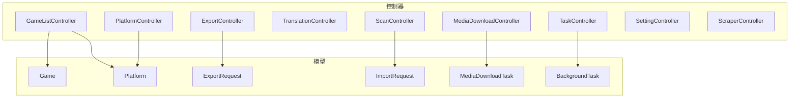
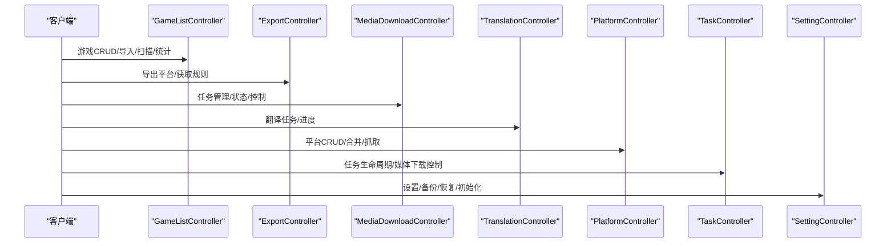
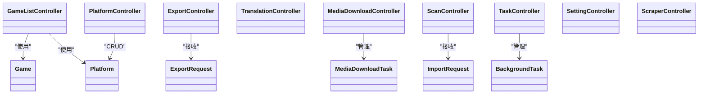
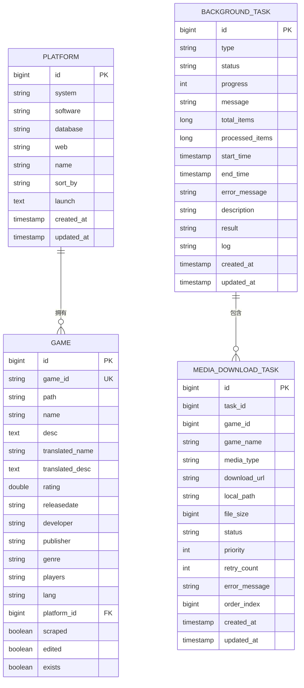

# API参考文档

<cite>
**本文引用的文件**
- [GameListController.java](file://src/main/java/com/gamelist/controller/GameListController.java)
- [ExportController.java](file://src/main/java/com/gamelist/controller/ExportController.java)
- [MediaDownloadController.java](file://src/main/java/com/gamelist/controller/MediaDownloadController.java)
- [TranslationController.java](file://src/main/java/com/gamelist/controller/TranslationController.java)
- [PlatformController.java](file://src/main/java/com/gamelist/controller/PlatformController.java)
- [ScanController.java](file://src/main/java/com/gamelist/controller/ScanController.java)
- [TaskController.java](file://src/main/java/com/gamelist/controller/TaskController.java)
- [SettingController.java](file://src/main/java/com/gamelist/controller/SettingController.java)
- [ScraperController.java](file://src/main/java/com/gamelist/controller/ScraperController.java)
- [Game.java](file://src/main/java/com/gamelist/model/Game.java)
- [Platform.java](file://src/main/java/com/gamelist/model/Platform.java)
- [ExportRequest.java](file://src/main/java/com/gamelist/model/ExportRequest.java)
- [ImportRequest.java](file://src/main/java/com/gamelist/model/ImportRequest.java)
- [MediaDownloadTask.java](file://src/main/java/com/gamelist/model/MediaDownloadTask.java)
- [BackgroundTask.java](file://src/main/java/com/gamelist/model/BackgroundTask.java)
</cite>

## 目录
1. [简介](#简介)
2. [项目结构](#项目结构)
3. [核心组件](#核心组件)
4. [架构总览](#架构总览)
5. [详细接口说明](#详细接口说明)
6. [依赖关系分析](#依赖关系分析)
7. [性能与并发](#性能与并发)
8. [故障排查指南](#故障排查指南)
9. [结论](#结论)
10. [附录](#附录)

## 简介
本参考文档面向WebGameListOper的RESTful API，覆盖游戏列表管理、导入导出、媒体下载、翻译服务、平台管理与任务管理等能力。每个接口均提供HTTP方法、URL模式、请求参数、响应格式与错误码说明，并给出最佳实践建议（认证、参数校验、错误处理）。同时包含版本管理与向后兼容性说明，帮助调用方稳定集成。

## 项目结构
系统采用Spring MVC控制器分层：
- 控制器层：按功能域划分控制器，如游戏列表、导出、媒体下载、翻译、平台、扫描、任务、设置等
- 模型层：统一的请求/响应数据对象，如Game、Platform、ExportRequest、MediaDownloadTask、BackgroundTask等
- 服务层：业务逻辑封装（由控制器注入）
- 持久化层：通过Mapper与数据库交互

**图表来源**
- [GameListController.java:39-551](file://src/main/java/com/gamelist/controller/GameListController.java#L39-L551)
- [ExportController.java:14-60](file://src/main/java/com/gamelist/controller/ExportController.java#L14-L60)
- [MediaDownloadController.java:16-483](file://src/main/java/com/gamelist/controller/MediaDownloadController.java#L16-L483)
- [TranslationController.java:30-643](file://src/main/java/com/gamelist/controller/TranslationController.java#L30-L643)
- [PlatformController.java:22-174](file://src/main/java/com/gamelist/controller/PlatformController.java#L22-L174)
- [ScanController.java:26-579](file://src/main/java/com/gamelist/controller/ScanController.java#L26-L579)
- [TaskController.java:22-202](file://src/main/java/com/gamelist/controller/TaskController.java#L22-L202)
- [SettingController.java:27-545](file://src/main/java/com/gamelist/controller/SettingController.java#L27-L545)
- [ScraperController.java:21-131](file://src/main/java/com/gamelist/controller/ScraperController.java#L21-L131)
- [Game.java:5-650](file://src/main/java/com/gamelist/model/Game.java#L5-L650)
- [Platform.java:3-141](file://src/main/java/com/gamelist/model/Platform.java#L3-L141)
- [ExportRequest.java:5-70](file://src/main/java/com/gamelist/model/ExportRequest.java#L5-L70)
- [ImportRequest.java:9-29](file://src/main/java/com/gamelist/model/ImportRequest.java#L9-L29)
- [MediaDownloadTask.java:5-175](file://src/main/java/com/gamelist/model/MediaDownloadTask.java#L5-L175)
- [BackgroundTask.java:5-114](file://src/main/java/com/gamelist/model/BackgroundTask.java#L5-L114)

**章节来源**
- [GameListController.java:39-551](file://src/main/java/com/gamelist/controller/GameListController.java#L39-L551)
- [ExportController.java:14-60](file://src/main/java/com/gamelist/controller/ExportController.java#L14-L60)
- [MediaDownloadController.java:16-483](file://src/main/java/com/gamelist/controller/MediaDownloadController.java#L16-L483)
- [TranslationController.java:30-643](file://src/main/java/com/gamelist/controller/TranslationController.java#L30-L643)
- [PlatformController.java:22-174](file://src/main/java/com/gamelist/controller/PlatformController.java#L22-L174)
- [ScanController.java:26-579](file://src/main/java/com/gamelist/controller/ScanController.java#L26-L579)
- [TaskController.java:22-202](file://src/main/java/com/gamelist/controller/TaskController.java#L22-L202)
- [SettingController.java:27-545](file://src/main/java/com/gamelist/controller/SettingController.java#L27-L545)
- [ScraperController.java:21-131](file://src/main/java/com/gamelist/controller/ScraperController.java#L21-L131)

## 核心组件
- 游戏列表管理：提供导入、扫描、查询、更新、批量操作、统计、筛选等功能
- 导入导出：支持模板导入、规则导出、平台导出
- 媒体下载：任务创建、状态查询、暂停/恢复/停止、重试失败任务、平台维度控制
- 翻译服务：多提供商（Google/Baidu/Youdao/DeepSeek），支持单条、批量、异步进度查询
- 平台管理：CRUD、合并、抓取、统计
- 任务管理：后台任务生命周期、媒体下载任务编排与控制
- 设置与备份：系统设置、数据库备份/恢复、初始化

**章节来源**
- [GameListController.java:51-551](file://src/main/java/com/gamelist/controller/GameListController.java#L51-L551)
- [ExportController.java:25-59](file://src/main/java/com/gamelist/controller/ExportController.java#L25-L59)
- [MediaDownloadController.java:28-483](file://src/main/java/com/gamelist/controller/MediaDownloadController.java#L28-L483)
- [TranslationController.java:56-643](file://src/main/java/com/gamelist/controller/TranslationController.java#L56-L643)
- [PlatformController.java:29-174](file://src/main/java/com/gamelist/controller/PlatformController.java#L29-L174)
- [TaskController.java:41-202](file://src/main/java/com/gamelist/controller/TaskController.java#L41-L202)
- [SettingController.java:41-545](file://src/main/java/com/gamelist/controller/SettingController.java#L41-L545)

## 架构总览

**图表来源**
- [GameListController.java:39-551](file://src/main/java/com/gamelist/controller/GameListController.java#L39-L551)
- [ExportController.java:14-60](file://src/main/java/com/gamelist/controller/ExportController.java#L14-L60)
- [MediaDownloadController.java:16-483](file://src/main/java/com/gamelist/controller/MediaDownloadController.java#L16-L483)
- [TranslationController.java:30-643](file://src/main/java/com/gamelist/controller/TranslationController.java#L30-L643)
- [PlatformController.java:22-174](file://src/main/java/com/gamelist/controller/PlatformController.java#L22-L174)
- [TaskController.java:22-202](file://src/main/java/com/gamelist/controller/TaskController.java#L22-L202)
- [SettingController.java:27-545](file://src/main/java/com/gamelist/controller/SettingController.java#L27-L545)

## 详细接口说明

### 游戏列表管理 API（/api/gamelist）
- 导入XML
  - POST /api/gamelist/import
  - 请求：multipart/form-data，字段 file（XML文件）
  - 响应：成功返回文本消息；失败返回500及错误信息
  - 错误码：500（IO或解析异常）
- 扫描并导入gamelist.xml
  - POST /api/gamelist/scan
  - 请求体：ScanRequest（path, scanDepth）
  - 响应：ScanResult（success, message, foundFiles, importedFiles, details）
  - 错误码：500（扫描异常）
- 扫描并导入Pegasus元数据
  - POST /api/gamelist/scan-pegasus
  - 请求体：ScanRequest
  - 响应：ScanResult
  - 错误码：500
- 获取所有平台
  - GET /api/gamelist/platforms
  - 响应：平台列表
- 分页查询所有游戏
  - GET /api/gamelist/games
  - 查询参数：page, pageSize, search, startDate, endDate, developers[], genres[], players[], scrapeStatuses[], folderPath
  - 响应：{games, totalPages, totalElements}
- 按平台ID分页查询游戏
  - GET /api/gamelist/platforms/{platformId}/games
  - 路径参数：platformId
  - 查询参数：page, pageSize, search, startDate, endDate, developers[], genres[], players[], scrapeStatuses[], fileStatuses[], folderPath
  - 响应：{games, totalPages, totalElements}
- 获取单个游戏详情
  - GET /api/gamelist/games/{gameId}
  - 路径参数：gameId
  - 响应：Game对象；未找到返回404
- 清空所有游戏
  - DELETE /api/gamelist/games
  - 响应：文本消息（删除数量）
- 总体统计
  - GET /api/gamelist/statistics/overall
  - 响应：Statistics对象
- 各平台统计
  - GET /api/gamelist/statistics/platforms
  - 响应：PlatformStatistics列表
- 按刮削状态查询
  - GET /api/gamelist/games/by-status
  - 查询参数：platformId(可选), status, page, size
  - 响应：Game列表
- 更新游戏
  - PUT /api/gamelist/games
  - 请求体：Game
  - 响应：成功文本；未找到返回404；失败返回500
- 批量更新
  - PUT /api/gamelist/games/batch
  - 请求体：{gameIds, updates}
  - 响应：{success, updatedCount, message}
  - 错误码：400（参数无效）、500
- 迁移到目标平台
  - PUT /api/gamelist/games/migrate
  - 请求体：{gameIds, targetPlatformId}
  - 响应：{success, migratedCount, message}
  - 错误码：400、500
- 条件筛选计数
  - POST /api/gamelist/games/filter
  - 请求体：filterParams（Map）
  - 响应：{count}
- 获取唯一值（开发商、发行商、类型、玩家数）
  - GET /api/gamelist/games/unique-values
  - 响应：Map<String, List<String>>
- 合盘
  - POST /api/gamelist/merge-discs
  - 请求体：{gameIds: List<Long>}
  - 响应：结果Map（含success）
- 新增游戏
  - POST /api/gamelist/games
  - 请求体：Game
  - 响应：成功文本；失败返回500
- 批量删除
  - DELETE /api/gamelist/games/batch-delete
  - 请求体：{gameIds: List<Long>}
  - 响应：{success, deletedCount, message}
  - 错误码：400、500
- 获取导入模板列表
  - GET /api/gamelist/import/templates
  - 响应：模板信息列表（fileName, name, frontend, version, description）

示例
- 请求示例（分页查询游戏）：GET /api/gamelist/games?page=1&pageSize=20&search=xxx
- 响应示例：{"games":[...],"totalPages":5,"totalElements":100}

**章节来源**
- [GameListController.java:51-551](file://src/main/java/com/gamelist/controller/GameListController.java#L51-L551)

### 导入与导出 API
- 扫描文件系统
  - POST /api/scan/scan
  - 请求体：ScanRequest（path, depth, importMethod, importTemplate, noDataFile, fileExtensions, scraperSystemId）
  - 响应：ScanResult（foundFiles, details, success, message）
- 异步导入
  - POST /api/scan/import
  - 请求体：ImportRequest（files, type, metadataOnly, threadCount, importMethod, importTemplate, scanPath, noDataFile, fileExtensions, scraperSystemId）
  - 响应：BackgroundTask（任务ID用于后续查询进度）
- 浏览目录
  - POST /api/scan/browse
  - 请求体：BrowseRequest（path）
  - 响应：BrowseResponse（success, message, directories）
- 导出平台
  - POST /api/export/platform
  - 请求体：ExportRequest（platformId, frontend, outputPath, copyRoms, copyMedia, generateDataFile, threadCount）
  - 响应：{success, ...}（具体字段由服务实现决定）
  - 错误码：400（参数错误）、500（服务异常）
- 获取导出规则
  - GET /api/export/rules
  - 响应：规则列表

示例
- 请求示例（导出）：POST /api/export/platform {platformId:1, frontend:"emuelec", outputPath:"/data/out"}
- 响应示例：{"success":true,"message":"导出完成"}

**章节来源**
- [ScanController.java:173-579](file://src/main/java/com/gamelist/controller/ScanController.java#L173-L579)
- [ExportController.java:25-59](file://src/main/java/com/gamelist/controller/ExportController.java#L25-L59)

### 媒体下载 API（/api/media-download）
- 获取所有任务
  - GET /api/media-download/tasks
  - 响应：{success, data, count}
- 按平台筛选任务
  - GET /api/media-download/tasks/by-platform?platformId=...
  - 响应：{success, data, count}
- 按任务ID筛选任务
  - GET /api/media-download/tasks/by-task?taskId=...
  - 响应：{success, data, count}
- 获取单个任务
  - GET /api/media-download/tasks/{id}
  - 响应：{success, data}；不存在返回404
- 删除单个任务
  - DELETE /api/media-download/tasks/{id}
  - 响应：{success, message}
- 批量删除任务
  - DELETE /api/media-download/tasks/batch
  - 请求体：[ids]
  - 响应：{success, message, deletedCount}
- 删除指定平台的所有任务
  - DELETE /api/media-download/tasks/by-platform?platformId=...
  - 响应：{success, message, deletedCount}
- 删除指定任务ID的所有任务
  - DELETE /api/media-download/tasks/by-task?taskId=...
  - 响应：{success, message, deletedCount}
- 获取下载状态
  - GET /api/media-download/status
  - 响应：{success, isRunning, isPaused}
- 获取下载统计
  - GET /api/media-download/stats?taskId=...
  - 响应：{success, total, pending, completed, failed, downloading}
- 暂停/恢复/停止下载
  - POST /api/media-download/pause
  - POST /api/media-download/resume
  - POST /api/media-download/stop
  - 响应：{success, message}
- 获取有任务的平台列表
  - GET /api/media-download/platforms
  - 响应：{success, data, count}
- 平台维度统计
  - GET /api/media-download/platforms/{platformId}/stats
  - 响应：{success, data}
- 平台维度控制
  - POST /api/media-download/platforms/{platformId}/stop
  - POST /api/media-download/platforms/{platformId}/resume
  - POST /api/media-download/platforms/{platformId}/retry-failed
  - 响应：{success, message}
- 停止所有平台下载
  - POST /api/media-download/platforms/stop-all
  - 响应：{success, message}
- 删除平台刮削任务
  - POST /api/media-download/platforms/{platformId}/delete
  - 响应：{success, message, deletedCount}

示例
- 请求示例（暂停）：POST /api/media-download/pause
- 响应示例：{"success":true,"message":"媒体下载已暂停"}

**章节来源**
- [MediaDownloadController.java:28-483](file://src/main/java/com/gamelist/controller/MediaDownloadController.java#L28-L483)

### 翻译服务 API（/api/translation）
- 获取平台列表
  - GET /api/translation/platforms
  - 响应：Platform列表
- 获取有效翻译服务
  - GET /api/translation/services
  - 响应：{success, services}
- 翻译平台游戏（异步）
  - POST /api/translation/translate
  - 查询参数：platformId, apiType, sourceLang, targetLang, translateType, apiKey, appId(可选), appSecret(可选)
  - 响应：{success, taskId, message, totalGames}
- 翻译单个游戏
  - POST /api/translation/translate/game
  - 查询参数：gameId, apiType, sourceLang, targetLang, translateType, apiKey, appId(可选), appSecret(可选)
  - 响应：{success, message, game}
- 批量翻译游戏（异步）
  - POST /api/translation/translate/games
  - 请求体：{gameIds, apiType, sourceLang, targetLang, translateType, apiKey, appId(可选), appSecret(可选)}
  - 响应：{success, taskId, message, totalGames}
- 获取翻译进度
  - GET /api/translation/progress/{taskId}
  - 响应：{success, progress, errors(可选)}
- 创建错误子集平台
  - POST /api/translation/create-error-subset/{taskId}
  - 响应：{success, platformName, platformId, errorCount, message}

支持的apiType：google、baidu、youdao、deepseek（通过工厂/管理器选择）

示例
- 请求示例（批量翻译）：POST /api/translation/translate/games {gameIds:[1,2], apiType:"baidu", sourceLang:"zh-CN", targetLang:"en-US", translateType:"both", apiKey:"...", appId:"...", appSecret:"..."}
- 响应示例：{"success":true,"taskId":"task_...","message":"翻译任务已启动","totalGames":2}

**章节来源**
- [TranslationController.java:56-643](file://src/main/java/com/gamelist/controller/TranslationController.java#L56-L643)

### 平台管理 API（/api/platforms）
- 获取所有平台
  - GET /api/platforms
  - 响应：Platform列表
- 获取平台详情
  - GET /api/platforms/{id}
  - 响应：Platform；不存在返回404
- 更新平台
  - PUT /api/platforms/{id}
  - 请求体：Platform（id将被忽略，使用路径参数）
  - 响应：更新后的Platform
- 删除平台
  - DELETE /api/platforms/{id}
  - 响应：204 No Content
- 新增平台
  - POST /api/platforms
  - 请求体：Platform
  - 响应：{success, message}
- 基于过滤条件创建平台并复制游戏
  - POST /api/platforms/create-with-games
  - 请求体：{name, filter}
  - 响应：{success, platformName, platformId, gameCount}
- 合并平台
  - POST /api/platforms/merge
  - 请求体：{sourcePlatformIds, newPlatformName, newPlatformFolderPath, overwrite}
  - 响应：{success, ...}
- 获取平台统计
  - GET /api/platforms/{id}/statistics
  - 响应：{success, ...}
- 抓取平台媒体
  - POST /api/platforms/{id}/scrape
  - 请求体：{systemId, region, mediaTypes[]}
  - 响应：{success, ...}

示例
- 请求示例（合并）：POST /api/platforms/merge {sourcePlatformIds:[1,2], newPlatformName:"合并平台", newPlatformFolderPath:"/data/platforms/merged", overwrite:true}
- 响应示例：{"success":true,"message":"合并完成"}

**章节来源**
- [PlatformController.java:29-174](file://src/main/java/com/gamelist/controller/PlatformController.java#L29-L174)

### 任务管理 API（/api/tasks）
- 获取所有任务
  - GET /api/tasks
  - 响应：BackgroundTask列表
- 获取单个任务
  - GET /api/tasks/{id}
  - 响应：BackgroundTask
- 删除任务
  - DELETE /api/tasks/{id}
  - 行为：删除任务并清理关联媒体任务
- 清空所有任务
  - DELETE /api/tasks/clear
- 获取任务的媒体任务统计
  - GET /api/tasks/{id}/media-tasks
  - 响应：{total, pending, downloading, completed, failed, progress}
- 启动媒体下载
  - POST /api/tasks/{id}/start-media-download
  - 响应：{success, message, taskId, totalMediaTasks}
- 停止媒体下载
  - POST /api/tasks/stop-media-download
  - 响应：{success, message}
- 暂停媒体下载
  - POST /api/tasks/pause-media-download
  - 响应：{success, message}
- 恢复媒体下载
  - POST /api/tasks/resume-media-download
  - 响应：{success, message}
- 获取媒体下载状态
  - GET /api/tasks/media-download-status
  - 响应：{running, paused}

示例
- 请求示例（启动）：POST /api/tasks/1/start-media-download
- 响应示例：{"success":true,"message":"媒体下载任务已启动","taskId":1001,"totalMediaTasks":50}

**章节来源**
- [TaskController.java:41-202](file://src/main/java/com/gamelist/controller/TaskController.java#L41-L202)

### 设置与备份 API（/api/settings）
- 保存系统设置
  - POST /api/settings/save
  - 请求：表单键值对（setting_key -> setting_value）
  - 响应：成功文本；失败返回500
- 获取系统设置
  - GET /api/settings/get
  - 响应：Map<key, value>
- 数据库备份
  - POST /api/settings/backup/database?backupPath=...
  - 响应：成功文本（包含备份文件路径与统计）；失败返回500
- 数据库恢复
  - POST /api/settings/restore/database?backupFile=...
  - 响应：成功文本；失败返回500
- 获取备份文件列表
  - GET /api/settings/backups/list?backupPath=...
  - 响应：BackupFileInfo列表
- 数据库初始化
  - POST /api/settings/database/init
  - 响应：成功文本（执行语句数）；失败返回500

示例
- 请求示例（备份）：POST /api/settings/backup/database?backupPath=/data/backup
- 响应示例："数据库备份成功！备份文件：/data/backup/database/database_backup_xxx.sql (包含 N 个平台，M 个游戏)"

**章节来源**
- [SettingController.java:41-545](file://src/main/java/com/gamelist/controller/SettingController.java#L41-L545)

### 刮削与搜索 API（/api/scraper）
- 启动刮削任务
  - POST /api/scraper/scrape
  - 请求体：ScraperRequest
  - 响应：结果Map（success为true则200，否则400）
- 查询任务状态
  - GET /api/scraper/tasks/{taskId}
  - 响应：结果Map
- 获取当前刮削状态
  - GET /api/scraper/status
  - 响应：{success, data}
- 暂停/恢复/停止刮削
  - POST /api/scraper/pause
  - POST /api/scraper/resume
  - POST /api/scraper/stop
  - 响应：{success, message}
- 搜索游戏
  - GET /api/scraper/search?platformId=...&searchTerm=...
  - 响应：{success, data}
- 下载单个游戏的媒体文件
  - POST /api/scraper/downloadMedia
  - 请求体：{gameId, gameName, platformId, medias}
  - 响应：{success, message}

示例
- 请求示例（搜索）：GET /api/scraper/search?platformId=1&searchTerm=Super+Mario
- 响应示例：{"success":true,"data":[...]}

**章节来源**
- [ScraperController.java:30-131](file://src/main/java/com/gamelist/controller/ScraperController.java#L30-L131)

## 依赖关系分析
- 控制器之间无直接耦合，均通过服务层解耦
- 模型对象在多个控制器间复用（如Game、Platform、BackgroundTask）
- 任务系统与媒体下载、翻译、导入导出存在协作关系（通过任务ID与状态流转）

**图表来源**
- [GameListController.java:39-551](file://src/main/java/com/gamelist/controller/GameListController.java#L39-L551)
- [ExportController.java:14-60](file://src/main/java/com/gamelist/controller/ExportController.java#L14-L60)
- [MediaDownloadController.java:16-483](file://src/main/java/com/gamelist/controller/MediaDownloadController.java#L16-L483)
- [TranslationController.java:30-643](file://src/main/java/com/gamelist/controller/TranslationController.java#L30-L643)
- [PlatformController.java:22-174](file://src/main/java/com/gamelist/controller/PlatformController.java#L22-L174)
- [ScanController.java:26-579](file://src/main/java/com/gamelist/controller/ScanController.java#L26-L579)
- [TaskController.java:22-202](file://src/main/java/com/gamelist/controller/TaskController.java#L22-L202)
- [SettingController.java:27-545](file://src/main/java/com/gamelist/controller/SettingController.java#L27-L545)
- [ScraperController.java:21-131](file://src/main/java/com/gamelist/controller/ScraperController.java#L21-L131)
- [Game.java:5-650](file://src/main/java/com/gamelist/model/Game.java#L5-L650)
- [Platform.java:3-141](file://src/main/java/com/gamelist/model/Platform.java#L3-L141)
- [ExportRequest.java:5-70](file://src/main/java/com/gamelist/model/ExportRequest.java#L5-L70)
- [ImportRequest.java:9-29](file://src/main/java/com/gamelist/model/ImportRequest.java#L9-L29)
- [MediaDownloadTask.java:5-175](file://src/main/java/com/gamelist/model/MediaDownloadTask.java#L5-L175)
- [BackgroundTask.java:5-114](file://src/main/java/com/gamelist/model/BackgroundTask.java#L5-L114)

**章节来源**
- [GameListController.java:39-551](file://src/main/java/com/gamelist/controller/GameListController.java#L39-L551)
- [ExportController.java:14-60](file://src/main/java/com/gamelist/controller/ExportController.java#L14-L60)
- [MediaDownloadController.java:16-483](file://src/main/java/com/gamelist/controller/MediaDownloadController.java#L16-L483)
- [TranslationController.java:30-643](file://src/main/java/com/gamelist/controller/TranslationController.java#L30-L643)
- [PlatformController.java:22-174](file://src/main/java/com/gamelist/controller/PlatformController.java#L22-L174)
- [ScanController.java:26-579](file://src/main/java/com/gamelist/controller/ScanController.java#L26-L579)
- [TaskController.java:22-202](file://src/main/java/com/gamelist/controller/TaskController.java#L22-L202)
- [SettingController.java:27-545](file://src/main/java/com/gamelist/controller/SettingController.java#L27-L545)
- [ScraperController.java:21-131](file://src/main/java/com/gamelist/controller/ScraperController.java#L21-L131)

## 性能与并发
- 导入任务支持多线程配置（threadCount），默认限制在合理范围
- 媒体下载任务支持暂停/恢复/停止，避免资源占用
- 翻译任务异步执行，提供进度查询，降低阻塞
- 分页查询减少大数据量传输压力
- 建议：
  - 大文件导入时适当增大线程数但需评估系统负载
  - 媒体下载根据网络与磁盘I/O调整并发
  - 翻译任务分批提交，避免瞬时高并发

[本节为通用指导，不直接分析具体文件]

## 故障排查指南
- 常见错误码
  - 400：参数缺失或非法（如空gameIds、无效targetPlatformId）
  - 404：资源不存在（如游戏、平台、任务）
  - 500：服务器内部错误（IO异常、解析异常、服务异常）
- 排查步骤
  - 检查请求参数是否完整且类型正确
  - 查看任务日志（BackgroundTask.log）定位失败原因
  - 媒体下载任务失败可重试（/api/media-download/platforms/{platformId}/retry-failed）
  - 翻译任务可通过进度接口获取errors列表进行问题定位
- 日志与调试
  - 控制器中记录异常堆栈与关键信息
  - 导入任务将详细错误写入任务日志

**章节来源**
- [GameListController.java:156-159](file://src/main/java/com/gamelist/controller/GameListController.java#L156-L159)
- [MediaDownloadController.java:40-45](file://src/main/java/com/gamelist/controller/MediaDownloadController.java#L40-L45)
- [TranslationController.java:228-232](file://src/main/java/com/gamelist/controller/TranslationController.java#L228-L232)
- [ScanController.java:359-373](file://src/main/java/com/gamelist/controller/ScanController.java#L359-L373)

## 结论
本API参考文档覆盖了WebGameListOper的核心能力，包括游戏列表管理、导入导出、媒体下载、翻译服务、平台管理与任务管理。通过统一的错误处理与任务机制，确保调用方能够稳定集成与运维。建议在生产环境中结合任务监控与日志系统进行健康检查与告警。

[本节为总结性内容，不直接分析具体文件]

## 附录

### 数据模型概览

**图表来源**
- [Game.java:5-650](file://src/main/java/com/gamelist/model/Game.java#L5-L650)
- [Platform.java:3-141](file://src/main/java/com/gamelist/model/Platform.java#L3-L141)
- [MediaDownloadTask.java:5-175](file://src/main/java/com/gamelist/model/MediaDownloadTask.java#L5-L175)
- [BackgroundTask.java:5-114](file://src/main/java/com/gamelist/model/BackgroundTask.java#L5-L114)

### API版本管理与向后兼容
- 当前版本：v1（以基础路径/api前缀区分）
- 向后兼容策略：
  - 新增可选参数不影响现有调用
  - 废弃字段保留一段时间并提供迁移指引
  - 错误响应结构保持稳定（success/message/error）
- 升级建议：
  - 关注新增必填参数的提示
  - 逐步迁移到统一的任务与进度查询接口

[本节为通用指导，不直接分析具体文件]