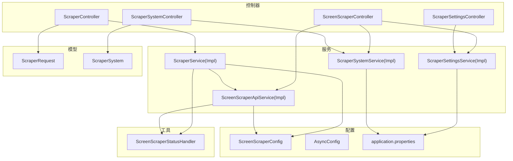
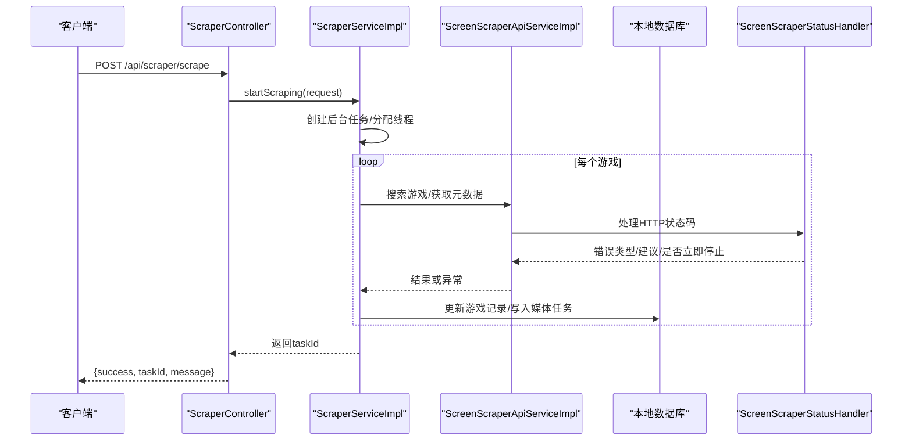
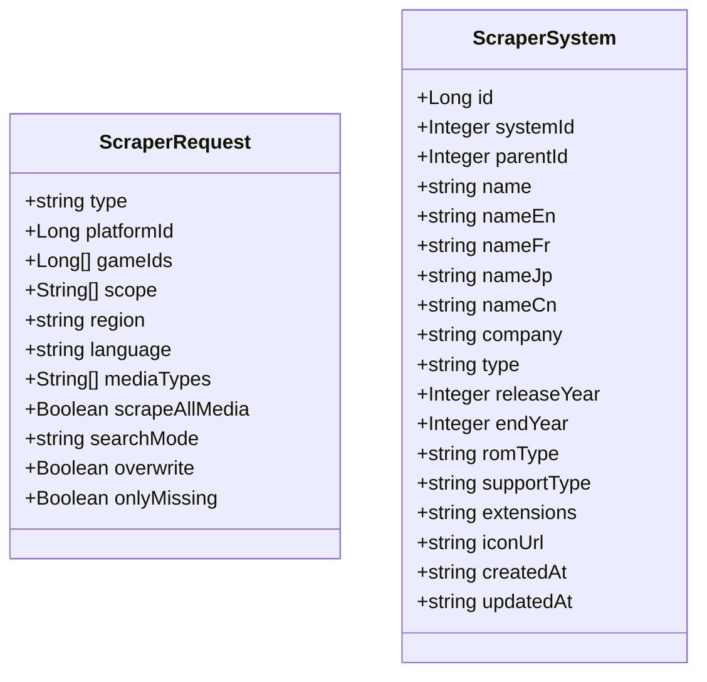
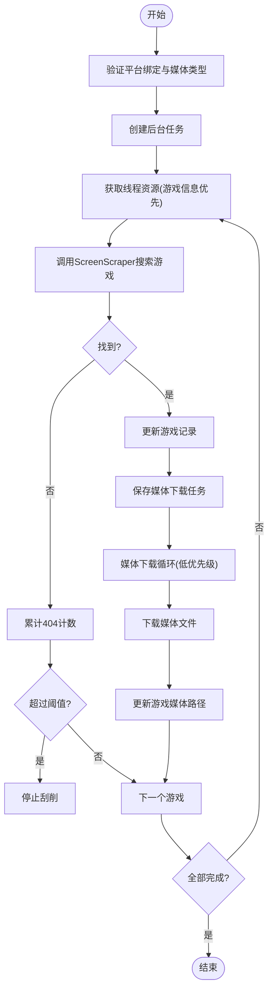
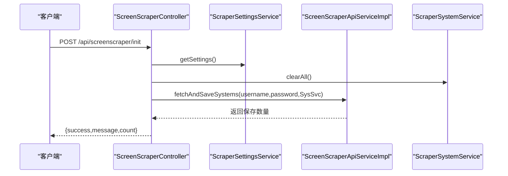
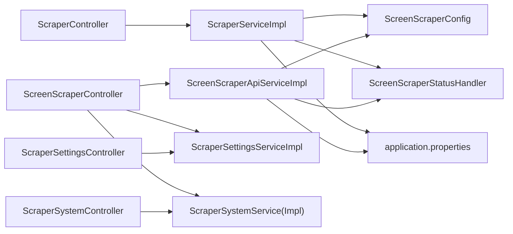

# Scraper集成API

<cite>
**本文引用的文件**
- [ScraperController.java](file://src/main/java/com/gamelist/controller/ScraperController.java)
- [ScreenScraperController.java](file://src/main/java/com/gamelist/controller/ScreenScraperController.java)
- [ScraperSettingsController.java](file://src/main/java/com/gamelist/controller/ScraperSettingsController.java)
- [ScraperSystemController.java](file://src/main/java/com/gamelist/controller/ScraperSystemController.java)
- [ScraperService.java](file://src/main/java/com/gamelist/service/ScraperService.java)
- [ScraperServiceImpl.java](file://src/main/java/com/gamelist/service/impl/ScraperServiceImpl.java)
- [ScreenScraperApiService.java](file://src/main/java/com/gamelist/service/ScreenScraperApiService.java)
- [ScreenScraperApiServiceImpl.java](file://src/main/java/com/gamelist/service/impl/ScreenScraperApiServiceImpl.java)
- [ScraperSettingsService.java](file://src/main/java/com/gamelist/service/ScraperSettingsService.java)
- [ScraperSystemService.java](file://src/main/java/com/gamelist/service/ScraperSystemService.java)
- [ScreenScraperConfig.java](file://src/main/java/com/gamelist/config/ScreenScraperConfig.java)
- [AsyncConfig.java](file://src/main/java/com/gamelist/config/AsyncConfig.java)
- [application.properties](file://src/main/resources/application.properties)
- [ScraperRequest.java](file://src/main/java/com/gamelist/model/ScraperRequest.java)
- [ScraperSystem.java](file://src/main/java/com/gamelist/model/ScraperSystem.java)
- [ScreenScraperStatusHandler.java](file://src/main/java/com/gamelist/util/ScreenScraperStatusHandler.java)
</cite>

## 目录
1. [简介](#简介)
2. [项目结构](#项目结构)
3. [核心组件](#核心组件)
4. [架构总览](#架构总览)
5. [详细组件分析](#详细组件分析)
6. [依赖关系分析](#依赖关系分析)
7. [性能考虑](#性能考虑)
8. [故障排查指南](#故障排查指南)
9. [结论](#结论)
10. [附录](#附录)

## 简介
本文件为Scraper集成功能的RESTful API文档，覆盖与ScreenScraper等外部元数据服务的集成接口，包括系统配置、认证设置、元数据获取、游戏信息刮削、批量处理、状态监控、初始化与配置管理、搜索与过滤、数据映射、错误处理、重试机制与性能优化策略。读者可据此快速对接并安全高效地使用Scraper服务。

## 项目结构
Scraper相关能力由控制器层暴露REST接口，服务层实现业务逻辑与外部API调用，配置类提供外部服务连接参数，模型对象承载请求与实体数据，工具类统一处理外部API状态码与错误策略。

图表来源
- [ScraperController.java:21-131](file://src/main/java/com/gamelist/controller/ScraperController.java#L21-L131)
- [ScreenScraperController.java:18-119](file://src/main/java/com/gamelist/controller/ScreenScraperController.java#L18-L119)
- [ScraperSettingsController.java:10-66](file://src/main/java/com/gamelist/controller/ScraperSettingsController.java#L10-L66)
- [ScraperSystemController.java:24-189](file://src/main/java/com/gamelist/controller/ScraperSystemController.java#L24-L189)
- [ScraperServiceImpl.java:62-129](file://src/main/java/com/gamelist/service/impl/ScraperServiceImpl.java#L62-L129)
- [ScreenScraperApiServiceImpl.java:30-104](file://src/main/java/com/gamelist/service/impl/ScreenScraperApiServiceImpl.java#L30-L104)
- [ScreenScraperConfig.java:6-46](file://src/main/java/com/gamelist/config/ScreenScraperConfig.java#L6-L46)
- [AsyncConfig.java:10-14](file://src/main/java/com/gamelist/config/AsyncConfig.java#L10-L14)
- [application.properties:1-86](file://src/main/resources/application.properties#L1-L86)

章节来源
- [ScraperController.java:21-131](file://src/main/java/com/gamelist/controller/ScraperController.java#L21-L131)
- [ScreenScraperController.java:18-119](file://src/main/java/com/gamelist/controller/ScreenScraperController.java#L18-L119)
- [ScraperSettingsController.java:10-66](file://src/main/java/com/gamelist/controller/ScraperSettingsController.java#L10-L66)
- [ScraperSystemController.java:24-189](file://src/main/java/com/gamelist/controller/ScraperSystemController.java#L24-L189)
- [ScraperServiceImpl.java:62-129](file://src/main/java/com/gamelist/service/impl/ScraperServiceImpl.java#L62-L129)
- [ScreenScraperApiServiceImpl.java:30-104](file://src/main/java/com/gamelist/service/impl/ScreenScraperApiServiceImpl.java#L30-L104)
- [ScreenScraperConfig.java:6-46](file://src/main/java/com/gamelist/config/ScreenScraperConfig.java#L6-L46)
- [AsyncConfig.java:10-14](file://src/main/java/com/gamelist/config/AsyncConfig.java#L10-L14)
- [application.properties:1-86](file://src/main/resources/application.properties#L1-L86)

## 核心组件
- ScraperController：暴露游戏信息刮削、任务状态查询、暂停/恢复/停止、搜索游戏、媒体下载等接口。
- ScreenScraperController：提供ScreenScraper连接测试、系统初始化、状态检查等接口。
- ScraperSettingsController：提供Scraper用户凭证的读取、保存、清除接口。
- ScraperSystemController：提供Scraper系统（平台）的CRUD、按系统批量刮削、全量媒体刮削等接口。
- ScraperService/Impl：实现异步两阶段线程资源管理的刮削流程，含进度统计、失败保护、媒体下载队列。
- ScreenScraperApiService/Impl：封装对ScreenScraper的HTTP调用、分页拉取系统列表、解析响应、构建媒体URL等。
- ScraperSettingsService/Impl：持久化Scraper用户凭证到本地JSON配置文件。
- ScraperSystemService/Impl：维护Scraper系统与本地平台的绑定及批量刮削编排。
- ScreenScraperConfig：集中管理ScreenScraper基础地址、开发者凭证等配置。
- AsyncConfig：启用Spring异步执行能力。
- application.properties：数据库、静态资源、日志、临时目录等运行期配置。

章节来源
- [ScraperController.java:21-131](file://src/main/java/com/gamelist/controller/ScraperController.java#L21-L131)
- [ScreenScraperController.java:18-119](file://src/main/java/com/gamelist/controller/ScreenScraperController.java#L18-L119)
- [ScraperSettingsController.java:10-66](file://src/main/java/com/gamelist/controller/ScraperSettingsController.java#L10-L66)
- [ScraperSystemController.java:24-189](file://src/main/java/com/gamelist/controller/ScraperSystemController.java#L24-L189)
- [ScraperService.java:8-63](file://src/main/java/com/gamelist/service/ScraperService.java#L8-L63)
- [ScraperServiceImpl.java:62-129](file://src/main/java/com/gamelist/service/impl/ScraperServiceImpl.java#L62-L129)
- [ScreenScraperApiService.java:8-19](file://src/main/java/com/gamelist/service/ScreenScraperApiService.java#L8-L19)
- [ScreenScraperApiServiceImpl.java:30-104](file://src/main/java/com/gamelist/service/impl/ScreenScraperApiServiceImpl.java#L30-L104)
- [ScraperSettingsService.java:5-12](file://src/main/java/com/gamelist/service/ScraperSettingsService.java#L5-L12)
- [ScraperSystemService.java:8-19](file://src/main/java/com/gamelist/service/ScraperSystemService.java#L8-L19)
- [ScreenScraperConfig.java:6-46](file://src/main/java/com/gamelist/config/ScreenScraperConfig.java#L6-L46)
- [AsyncConfig.java:10-14](file://src/main/java/com/gamelist/config/AsyncConfig.java#L10-L14)
- [application.properties:1-86](file://src/main/resources/application.properties#L1-L86)

## 架构总览
Scraper通过控制器接收请求，服务层协调外部ScreenScraper API与本地数据库，使用OkHttp进行网络请求，结合异步执行与线程资源管理器实现高并发与优先级调度，并通过统一的状态处理器处理外部API返回的错误码与重试策略。

图表来源
- [ScraperController.java:33-42](file://src/main/java/com/gamelist/controller/ScraperController.java#L33-L42)
- [ScraperServiceImpl.java:131-192](file://src/main/java/com/gamelist/service/impl/ScraperServiceImpl.java#L131-L192)
- [ScreenScraperApiServiceImpl.java:106-251](file://src/main/java/com/gamelist/service/impl/ScreenScraperApiServiceImpl.java#L106-L251)
- [ScreenScraperStatusHandler.java:138-170](file://src/main/java/com/gamelist/util/ScreenScraperStatusHandler.java#L138-L170)

## 详细组件分析

### 控制器API概览
- 游戏刮削与任务控制
  - POST /api/scraper/scrape：启动刮削任务，支持平台/批量/单游戏三种类型，支持范围选择（gameInfo/media）、地区、语言、媒体类型、搜索模式、覆盖与仅缺失等选项。
  - GET /api/scraper/tasks/{taskId}：查询任务状态与进度。
  - GET /api/scraper/status：获取当前全局刮削状态（用于前端展示）。
  - POST /api/scraper/pause：暂停当前刮削任务。
  - POST /api/scraper/resume：恢复当前刮削任务。
  - POST /api/scraper/stop：停止当前刮削任务。
  - GET /api/scraper/search：搜索游戏（基于ScreenScraper搜索接口），返回候选结果供前端选择。
  - POST /api/scraper/downloadMedia：为单个游戏创建媒体下载任务。

- ScreenScraper集成
  - GET /api/screenscraper/status：检查是否已配置用户凭证（游客模式或用户模式）。
  - POST /api/screenscraper/test：测试与ScreenScraper的连接（可选传入用户名密码）。
  - POST /api/screenscraper/init：从ScreenScraper拉取系统列表并保存到本地，便于后续按系统刮削。

- Scraper系统管理
  - GET /api/scraper-systems：获取所有Scraper系统列表。
  - GET /api/scraper-systems/{id}：获取指定系统详情。
  - POST /api/scraper-systems：创建Scraper系统。
  - PUT /api/scraper-systems/{id}：更新Scraper系统。
  - DELETE /api/scraper-systems/{id}：删除Scraper系统。
  - DELETE /api/scraper-systems/clear：清空所有Scraper系统。
  - GET /api/scraper-systems/simple：简化列表（用于下拉选择）。
  - POST /api/scraper-systems/scrape：按系统+地区+媒体类型进行批量刮削。
  - POST /api/scraper-systems/scrape-all：按系统拉取全部媒体。

- Scraper设置管理
  - GET /api/settings/scraper：读取Scraper用户凭证。
  - POST /api/settings/scraper：保存Scraper用户凭证。
  - DELETE /api/settings/scraper：清除Scraper用户凭证。

章节来源
- [ScraperController.java:33-131](file://src/main/java/com/gamelist/controller/ScraperController.java#L33-L131)
- [ScreenScraperController.java:37-119](file://src/main/java/com/gamelist/controller/ScreenScraperController.java#L37-L119)
- [ScraperSystemController.java:33-189](file://src/main/java/com/gamelist/controller/ScraperSystemController.java#L33-L189)
- [ScraperSettingsController.java:20-66](file://src/main/java/com/gamelist/controller/ScraperSettingsController.java#L20-L66)

### 请求与响应规范
- 通用响应格式
  - success：布尔值，表示本次请求是否成功。
  - data：业务数据（可为对象或数组）。
  - message：提示信息（失败时包含错误原因）。
  - 其他字段依具体接口而定（如taskId、count等）。

- 典型请求示例（以文本描述）
  - 启动刮削：POST /api/scraper/scrape，请求体包含type、platformId、scope、region、language、mediaTypes、searchMode、overwrite、onlyMissing等字段。
  - 搜索游戏：GET /api/scraper/search?platformId=...&searchTerm=...
  - 测试连接：POST /api/screenscraper/test，请求体可选username/password。
  - 初始化系统：POST /api/screenscraper/init，无需请求体。
  - 保存设置：POST /api/settings/scraper，请求体包含username/password。
  - 按系统批量刮削：POST /api/scraper-systems/scrape，请求体包含systemId、regions、mediaTypes。

- 典型响应示例（以文本描述）
  - 启动刮削：{success:true, taskId:..., message:"..."}
  - 任务状态：{success:true, taskId:..., status:..., progress:..., message:...}
  - 搜索游戏：{success:true, data:[...]}
  - 测试连接：{success:true/false, message:"...", mode:"guest|user"}
  - 初始化系统：{success:true, message:"...", count:...}
  - 保存设置：{success:true, message:"..."}
  - 批量刮削：{success:true, message:"...", ...}

章节来源
- [ScraperController.java:33-131](file://src/main/java/com/gamelist/controller/ScraperController.java#L33-L131)
- [ScreenScraperController.java:37-119](file://src/main/java/com/gamelist/controller/ScreenScraperController.java#L37-L119)
- [ScraperSettingsController.java:20-66](file://src/main/java/com/gamelist/controller/ScraperSettingsController.java#L20-L66)
- [ScraperSystemController.java:33-189](file://src/main/java/com/gamelist/controller/ScraperSystemController.java#L33-L189)

### 数据模型
- ScraperRequest：定义刮削任务的类型、目标平台、游戏ID集合、刮削范围、地区、语言、媒体类型、搜索模式、覆盖与仅缺失等选项。
- ScraperSystem：定义Scraper系统的标识、多语言名称、公司信息、类型、年份、ROM类型、扩展名、图标等属性。

图表来源
- [ScraperRequest.java:5-107](file://src/main/java/com/gamelist/model/ScraperRequest.java#L5-L107)
- [ScraperSystem.java:3-228](file://src/main/java/com/gamelist/model/ScraperSystem.java#L3-L228)

章节来源
- [ScraperRequest.java:5-107](file://src/main/java/com/gamelist/model/ScraperRequest.java#L5-L107)
- [ScraperSystem.java:3-228](file://src/main/java/com/gamelist/model/ScraperSystem.java#L3-L228)

### 关键业务流程

#### 游戏信息刮削与媒体下载（两阶段策略）
- 阶段一：游戏信息刮削优先，动态获取线程资源，调用ScreenScraper搜索并更新游戏记录；同时生成媒体下载任务。
- 阶段二：媒体下载并行执行，低优先级抢占资源，完成下载后更新游戏媒体路径。

图表来源
- [ScraperServiceImpl.java:131-192](file://src/main/java/com/gamelist/service/impl/ScraperServiceImpl.java#L131-L192)
- [ScraperServiceImpl.java:203-538](file://src/main/java/com/gamelist/service/impl/ScraperServiceImpl.java#L203-L538)
- [ScreenScraperStatusHandler.java:100-123](file://src/main/java/com/gamelist/util/ScreenScraperStatusHandler.java#L100-L123)

章节来源
- [ScraperServiceImpl.java:131-538](file://src/main/java/com/gamelist/service/impl/ScraperServiceImpl.java#L131-L538)
- [ScreenScraperStatusHandler.java:100-123](file://src/main/java/com/gamelist/util/ScreenScraperStatusHandler.java#L100-L123)

#### ScreenScraper系统初始化流程
- 步骤：读取Scraper设置 -> 清空本地系统缓存 -> 分页拉取系统列表 -> 解析并批量插入数据库 -> 返回数量。

图表来源
- [ScreenScraperController.java:90-119](file://src/main/java/com/gamelist/controller/ScreenScraperController.java#L90-L119)
- [ScreenScraperApiServiceImpl.java:279-426](file://src/main/java/com/gamelist/service/impl/ScreenScraperApiServiceImpl.java#L279-L426)

章节来源
- [ScreenScraperController.java:90-119](file://src/main/java/com/gamelist/controller/ScreenScraperController.java#L90-L119)
- [ScreenScraperApiServiceImpl.java:279-426](file://src/main/java/com/gamelist/service/impl/ScreenScraperApiServiceImpl.java#L279-L426)

### 高级功能说明
- 元数据搜索：通过GET /api/scraper/search调用ScreenScraper搜索接口，返回候选结果供前端选择。
- 结果过滤：支持按地区、语言、媒体类型、搜索模式（crc/filename/name）等条件筛选。
- 数据映射：将ScreenScraper返回的系统与媒体信息映射到本地ScraperSystem与游戏记录，支持多语言名称与扩展字段。
- 批量处理：支持按平台或系统批量刮削，内部采用两阶段策略与线程资源管理器提升吞吐。
- 状态监控：通过任务ID查询进度，或通过全局状态接口查看当前运行状况。

章节来源
- [ScraperController.java:97-131](file://src/main/java/com/gamelist/controller/ScraperController.java#L97-L131)
- [ScraperServiceImpl.java:203-538](file://src/main/java/com/gamelist/service/impl/ScraperServiceImpl.java#L203-L538)
- [ScreenScraperApiServiceImpl.java:648-696](file://src/main/java/com/gamelist/service/impl/ScreenScraperApiServiceImpl.java#L648-L696)

## 依赖关系分析
- 控制器依赖服务：ScraperController依赖ScraperService；ScreenScraperController依赖ScreenScraperApiService、ScraperSettingsService、ScraperSystemService；ScraperSettingsController依赖ScraperSettingsService；ScraperSystemController依赖ScraperSystemService。
- 服务依赖配置与工具：ScraperServiceImpl依赖ScreenScraperConfig与ScreenScraperStatusHandler；ScreenScraperApiServiceImpl依赖ScreenScraperConfig与OkHttpClient。
- 异步与线程管理：AsyncConfig启用异步；ScraperServiceImpl使用线程资源管理器与ExecutorService进行并发控制。
- 配置与运行环境：application.properties提供数据库、静态资源、日志、临时目录等运行参数。

图表来源
- [ScraperController.java:21-131](file://src/main/java/com/gamelist/controller/ScraperController.java#L21-L131)
- [ScreenScraperController.java:18-119](file://src/main/java/com/gamelist/controller/ScreenScraperController.java#L18-L119)
- [ScraperSettingsController.java:10-66](file://src/main/java/com/gamelist/controller/ScraperSettingsController.java#L10-L66)
- [ScraperSystemController.java:24-189](file://src/main/java/com/gamelist/controller/ScraperSystemController.java#L24-L189)
- [ScraperServiceImpl.java:62-129](file://src/main/java/com/gamelist/service/impl/ScraperServiceImpl.java#L62-L129)
- [ScreenScraperApiServiceImpl.java:30-104](file://src/main/java/com/gamelist/service/impl/ScreenScraperApiServiceImpl.java#L30-L104)
- [ScreenScraperConfig.java:6-46](file://src/main/java/com/gamelist/config/ScreenScraperConfig.java#L6-L46)
- [application.properties:1-86](file://src/main/resources/application.properties#L1-L86)

章节来源
- [ScraperController.java:21-131](file://src/main/java/com/gamelist/controller/ScraperController.java#L21-L131)
- [ScreenScraperController.java:18-119](file://src/main/java/com/gamelist/controller/ScreenScraperController.java#L18-L119)
- [ScraperSettingsController.java:10-66](file://src/main/java/com/gamelist/controller/ScraperSettingsController.java#L10-L66)
- [ScraperSystemController.java:24-189](file://src/main/java/com/gamelist/controller/ScraperSystemController.java#L24-L189)
- [ScraperServiceImpl.java:62-129](file://src/main/java/com/gamelist/service/impl/ScraperServiceImpl.java#L62-L129)
- [ScreenScraperApiServiceImpl.java:30-104](file://src/main/java/com/gamelist/service/impl/ScreenScraperApiServiceImpl.java#L30-L104)
- [ScreenScraperConfig.java:6-46](file://src/main/java/com/gamelist/config/ScreenScraperConfig.java#L6-L46)
- [application.properties:1-86](file://src/main/resources/application.properties#L1-L86)

## 性能考虑
- 并发与优先级：游戏信息刮削优先于媒体下载，使用线程资源管理器动态分配资源，避免IO阻塞影响主流程。
- 超时与重试：OkHttp设置连接/读写超时，支持连接失败重试；外部API错误通过状态处理器判断是否可重试与等待时间。
- 速率限制：当出现429/430/431等限流错误时，依据建议降低请求速度或延后重试。
- 资源回收：在finally中释放线程资源，防止泄漏；任务完成后重置状态与计数器。
- 日志与监控：详细记录请求与响应、TLS握手、进度与错误，便于定位瓶颈。

[本节为通用性能指导，不直接分析具体文件]

## 故障排查指南
- 常见错误与处理
  - 未绑定系统：提示先绑定系统再进行刮削。
  - 未选择媒体类型：当选择媒体刮削时必须至少选择一种媒体类型。
  - 线程数无效：未设置用户凭证时使用默认线程数1，可能导致性能较低。
  - 404过多：短时间内多次未找到会触发自动停止，需检查ROM文件或CRC值。
  - 认证失败：检查用户名/密码或开发者凭证是否正确。
  - 配额用尽：等待次日或提高用户等级。

- 诊断要点
  - 查看任务状态与日志，确认进度与失败原因。
  - 检查ScreenScraper连接测试与系统初始化是否成功。
  - 核对Scraper设置中的用户名与密码是否保存成功。
  - 关注HTTP状态码与错误类型，参考状态处理器建议。

章节来源
- [ScraperController.java:33-131](file://src/main/java/com/gamelist/controller/ScraperController.java#L33-L131)
- [ScreenScraperController.java:37-119](file://src/main/java/com/gamelist/controller/ScreenScraperController.java#L37-L119)
- [ScraperServiceImpl.java:131-192](file://src/main/java/com/gamelist/service/impl/ScraperServiceImpl.java#L131-L192)
- [ScreenScraperStatusHandler.java:138-170](file://src/main/java/com/gamelist/util/ScreenScraperStatusHandler.java#L138-L170)

## 结论
本API文档系统化梳理了Scraper集成功能的核心接口与实现细节，涵盖配置管理、认证设置、元数据获取、游戏信息刮削、批量处理、状态监控、搜索与过滤、数据映射、错误处理与重试机制、性能优化策略。通过两阶段线程资源管理与统一的状态处理，系统在稳定性与效率上具备良好表现。建议在生产环境中合理配置用户凭证与线程数，并结合日志与任务监控持续优化。

[本节为总结性内容，不直接分析具体文件]

## 附录
- 配置项说明
  - ScreenScraper基础地址与开发者凭证：通过ScreenScraperConfig注入。
  - 异步执行：通过AsyncConfig启用。
  - 运行环境：数据库、静态资源、日志、临时目录等在application.properties中配置。

章节来源
- [ScreenScraperConfig.java:6-46](file://src/main/java/com/gamelist/config/ScreenScraperConfig.java#L6-L46)
- [AsyncConfig.java:10-14](file://src/main/java/com/gamelist/config/AsyncConfig.java#L10-L14)
- [application.properties:1-86](file://src/main/resources/application.properties#L1-L86)