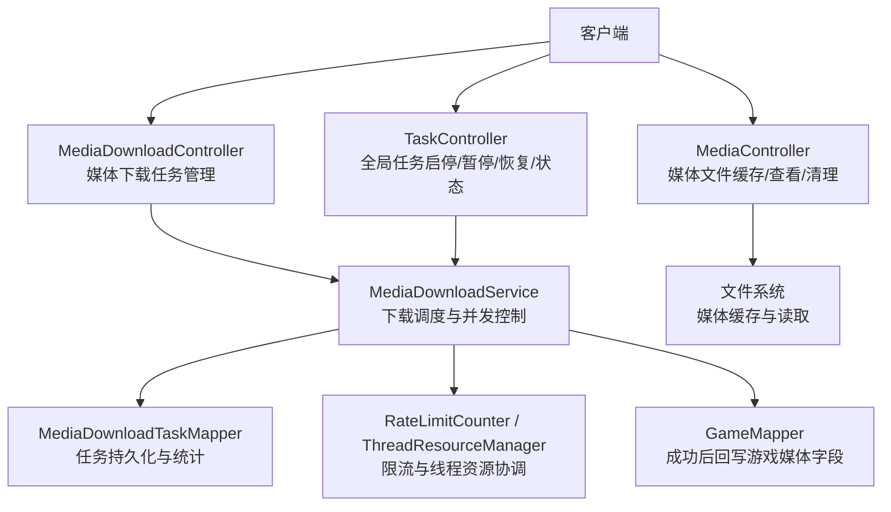
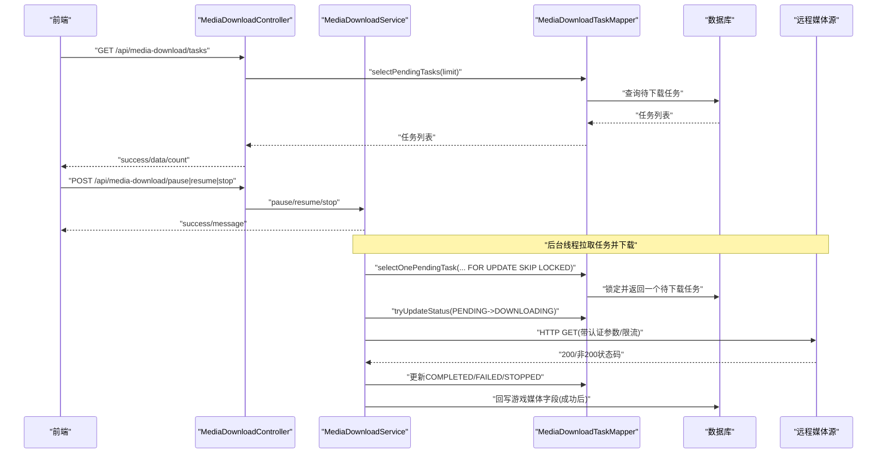
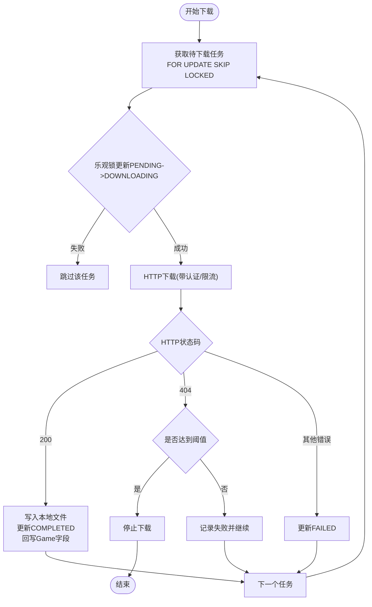
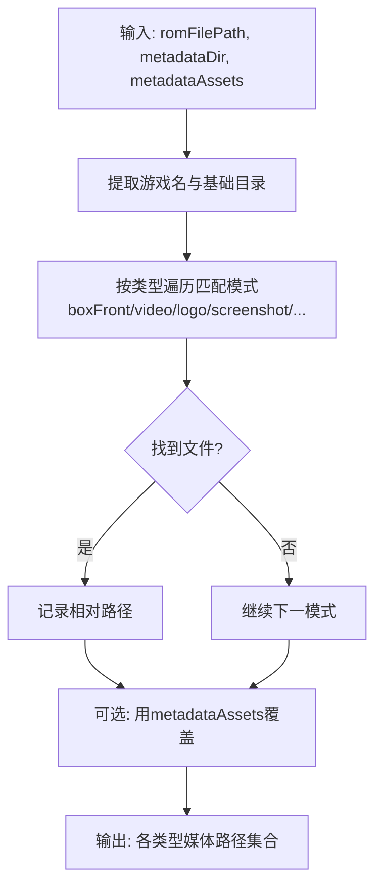
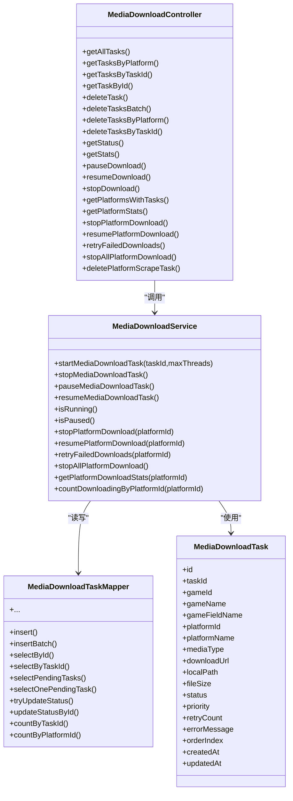

# 媒体管理API

<cite>
**本文引用的文件**
- [MediaDownloadController.java](file://src/main/java/com/gamelist/controller/MediaDownloadController.java)
- [MediaController.java](file://src/main/java/com/gamelist/controller/MediaController.java)
- [TaskController.java](file://src/main/java/com/gamelist/controller/TaskController.java)
- [MediaDownloadService.java](file://src/main/java/com/gamelist/service/MediaDownloadService.java)
- [MediaDownloadServiceImpl.java](file://src/main/java/com/gamelist/service/impl/MediaDownloadServiceImpl.java)
- [MediaDownloadTaskMapper.java](file://src/main/java/com/gamelist/mapper/MediaDownloadTaskMapper.java)
- [MediaDownloadTaskMapper.xml](file://src/main/resources/mappers/MediaDownloadTaskMapper.xml)
- [MediaDownloadTask.java](file://src/main/java/com/gamelist/model/MediaDownloadTask.java)
- [Game.java](file://src/main/java/com/gamelist/model/Game.java)
- [Platform.java](file://src/main/java/com/gamelist/model/Platform.java)
- [MediaFileFinder.java](file://src/main/java/com/gamelist/util/MediaFileFinder.java)
- [media-mapping-cn.md](file://docs/media-mapping-cn.md)
</cite>

## 目录
1. [简介](#简介)
2. [项目结构](#项目结构)
3. [核心组件](#核心组件)
4. [架构总览](#架构总览)
5. [详细组件分析](#详细组件分析)
6. [依赖关系分析](#依赖关系分析)
7. [性能与并发特性](#性能与并发特性)
8. [故障排查指南](#故障排查指南)
9. [结论](#结论)
10. [附录：接口清单与示例](#附录接口清单与示例)

## 简介
本文件面向“媒体资源管理”的RESTful API，聚焦媒体文件下载任务的全生命周期管理：任务创建、状态查询、进度监控、结果获取；并说明支持的媒体类型（封面、截图、视频、音频等）及本地媒体文件的查找、匹配与关联机制。同时覆盖批量下载、错误重试、限流与停止/恢复控制等高级能力。文档提供请求与响应格式约定、异步任务处理流程与状态管理机制说明。

## 项目结构
围绕媒体下载的核心由控制器、服务实现、数据访问层与模型组成：
- 控制器层：对外暴露REST接口，负责参数校验、统一响应封装与异常处理
- 服务层：实现下载调度、并发控制、限流、状态码处理、失败重试与平台级控制
- 数据访问层：MyBatis Mapper定义与SQL映射，支撑任务CRUD、统计与并发安全更新
- 模型层：任务实体、游戏与平台实体，承载媒体类型、路径与状态信息
- 工具层：本地媒体文件查找与匹配策略，支持多种命名与目录规范

**图示来源**
- [MediaDownloadController.java:16-483](file://src/main/java/com/gamelist/controller/MediaDownloadController.java#L16-L483)
- [MediaController.java:28-271](file://src/main/java/com/gamelist/controller/MediaController.java#L28-L271)
- [TaskController.java:121-201](file://src/main/java/com/gamelist/controller/TaskController.java#L121-L201)
- [MediaDownloadService.java:5-19](file://src/main/java/com/gamelist/service/MediaDownloadService.java#L5-L19)
- [MediaDownloadServiceImpl.java:28-635](file://src/main/java/com/gamelist/service/impl/MediaDownloadServiceImpl.java#L28-L635)
- [MediaDownloadTaskMapper.java:8-56](file://src/main/java/com/gamelist/mapper/MediaDownloadTaskMapper.java#L8-L56)

**章节来源**
- [MediaDownloadController.java:16-483](file://src/main/java/com/gamelist/controller/MediaDownloadController.java#L16-L483)
- [MediaController.java:28-271](file://src/main/java/com/gamelist/controller/MediaController.java#L28-L271)
- [TaskController.java:121-201](file://src/main/java/com/gamelist/controller/TaskController.java#L121-L201)
- [MediaDownloadService.java:5-19](file://src/main/java/com/gamelist/service/MediaDownloadService.java#L5-L19)
- [MediaDownloadServiceImpl.java:28-635](file://src/main/java/com/gamelist/service/impl/MediaDownloadServiceImpl.java#L28-L635)
- [MediaDownloadTaskMapper.java:8-56](file://src/main/java/com/gamelist/mapper/MediaDownloadTaskMapper.java#L8-L56)

## 核心组件
- 媒体下载任务控制器：提供任务的列表、筛选、删除、状态查询、统计、暂停/恢复/停止、平台级操作等接口
- 媒体文件控制器：提供本地媒体文件缓存、在线预览与缓存清理
- 下载服务实现：多线程并行下载、限流、状态码处理、失败重试、平台级停止/恢复、成功回写游戏媒体字段
- 任务数据访问：基于MyBatis的任务CRUD、分页/限制、乐观锁更新、按平台维度统计
- 本地媒体查找：根据游戏名与多种目录/命名规则匹配本地媒体文件，返回结构化结果

**章节来源**
- [MediaDownloadController.java:16-483](file://src/main/java/com/gamelist/controller/MediaDownloadController.java#L16-L483)
- [MediaController.java:28-271](file://src/main/java/com/gamelist/controller/MediaController.java#L28-L271)
- [MediaDownloadServiceImpl.java:28-635](file://src/main/java/com/gamelist/service/impl/MediaDownloadServiceImpl.java#L28-L635)
- [MediaDownloadTaskMapper.java:8-56](file://src/main/java/com/gamelist/mapper/MediaDownloadTaskMapper.java#L8-L56)
- [MediaFileFinder.java:8-800](file://src/main/java/com/gamelist/util/MediaFileFinder.java#L8-L800)

## 架构总览
媒体下载采用“控制器-服务-数据访问”的分层架构，结合异步任务与线程池并发执行，配合数据库乐观锁与行级锁定避免重复下载；通过限流器控制外部源访问频率，并在遇到特定HTTP状态码时快速失败或停止。

**图示来源**
- [MediaDownloadController.java:31-483](file://src/main/java/com/gamelist/controller/MediaDownloadController.java#L31-L483)
- [MediaDownloadServiceImpl.java:64-229](file://src/main/java/com/gamelist/service/impl/MediaDownloadServiceImpl.java#L64-L229)
- [MediaDownloadTaskMapper.java:10-56](file://src/main/java/com/gamelist/mapper/MediaDownloadTaskMapper.java#L10-L56)
- [MediaDownloadTaskMapper.xml:95-101](file://src/main/resources/mappers/MediaDownloadTaskMapper.xml#L95-L101)

## 详细组件分析

### 媒体下载任务管理接口（MediaDownloadController）
- 任务查询
  - 获取全部待下载任务：GET /api/media-download/tasks
  - 按平台筛选：GET /api/media-download/tasks/by-platform?platformId=...
  - 按任务ID筛选：GET /api/media-download/tasks/by-task?taskId=...
  - 单个任务：GET /api/media-download/tasks/{id}
- 任务删除
  - 删除单个：DELETE /api/media-download/tasks/{id}
  - 批量删除：DELETE /api/media-download/tasks/batch (Body: [id,...])
  - 按平台删除：DELETE /api/media-download/tasks/by-platform?platformId=...
  - 按任务ID删除：DELETE /api/media-download/tasks/by-task?taskId=...
- 状态与控制
  - 获取状态：GET /api/media-download/status
  - 获取统计：GET /api/media-download/stats?taskId=...
  - 暂停/恢复/停止：POST /api/media-download/pause|resume|stop
- 平台级操作
  - 列出有任务的平台：GET /api/media-download/platforms
  - 平台统计：GET /api/media-download/platforms/{platformId}/stats
  - 停止/恢复指定平台：POST /api/media-download/platforms/{platformId}/stop|resume
  - 重试失败任务：POST /api/media-download/platforms/{platformId}/retry-failed
  - 停止所有平台：POST /api/media-download/platforms/stop-all
  - 删除平台任务：POST /api/media-download/platforms/{platformId}/delete

统一响应格式
- 成功：{ success: true, data?: any, count?: number, message?: string }
- 失败：{ success: false, message: string }

**章节来源**
- [MediaDownloadController.java:31-483](file://src/main/java/com/gamelist/controller/MediaDownloadController.java#L31-L483)

### 媒体文件缓存与查看（MediaController）
- 缓存本地媒体到服务器：POST /api/media/cache?localPath=...
  - 将源文件复制到本地缓存目录，返回可访问URL与文件名
- 查看/下载媒体文件：GET /api/media/view?localPath=...&platformId=...&gameId=...&platformPath=...
  - 自动解析平台路径与游戏路径，检测文件类型并设置Content-Type
- 清理缓存：DELETE /api/media/clear

**章节来源**
- [MediaController.java:34-271](file://src/main/java/com/gamelist/controller/MediaController.java#L34-L271)

### 全局任务控制（TaskController）
- 启动媒体下载：POST /api/task/start-media-download（内部调用服务启动）
- 停止/暂停/恢复：POST /api/task/stop-media-download | pause-media-download | resume-media-download
- 查询状态：GET /api/task/media-download-status

**章节来源**
- [TaskController.java:121-201](file://src/main/java/com/gamelist/controller/TaskController.java#L121-L201)

### 下载服务实现（MediaDownloadServiceImpl）
- 并发与限流
  - 使用固定大小线程池并发下载，实际并发受线程资源管理器约束
  - 内置限流计数器，防止触发远端限速
- 任务执行流程
  - 从数据库以“FOR UPDATE SKIP LOCKED”方式独占获取一个待下载任务
  - 乐观锁将PENDING更新为DOWNLOADING，失败则跳过
  - 下载完成后根据HTTP状态码更新为COMPLETED或FAILED，特殊状态码立即停止
  - 成功时将本地路径回写到Game对应字段
- 平台级控制
  - 停止/恢复指定平台：标记任务状态并重启下载循环
  - 重试失败任务：将FAILED重置为PENDING并递增重试计数
- 404保护
  - 窗口期内连续出现多次404则自动停止下载，避免无效请求风暴

**图示来源**
- [MediaDownloadServiceImpl.java:64-229](file://src/main/java/com/gamelist/service/impl/MediaDownloadServiceImpl.java#L64-L229)
- [MediaDownloadTaskMapper.xml:95-101](file://src/main/resources/mappers/MediaDownloadTaskMapper.xml#L95-L101)

**章节来源**
- [MediaDownloadServiceImpl.java:64-635](file://src/main/java/com/gamelist/service/impl/MediaDownloadServiceImpl.java#L64-L635)

### 本地媒体查找与匹配（MediaFileFinder）
- 支持多种媒体类型：封面、封底、侧边、完整盒子、卡带、边框、面板、横幅、Steam图、海报、背景、音乐、标题画面、手册、3D盒、Steam网格、粉丝艺术、纹理、壁纸等
- 匹配策略：基于游戏名与多套目录/命名模式进行扫描，优先命中标准目录结构，其次尝试变体命名
- 元数据资产验证：允许外部传入的媒体路径在存在时覆盖默认匹配结果

**图示来源**
- [MediaFileFinder.java:89-159](file://src/main/java/com/gamelist/util/MediaFileFinder.java#L89-L159)
- [MediaFileFinder.java:167-800](file://src/main/java/com/gamelist/util/MediaFileFinder.java#L167-L800)

**章节来源**
- [MediaFileFinder.java:8-800](file://src/main/java/com/gamelist/util/MediaFileFinder.java#L8-L800)
- [media-mapping-cn.md:26-151](file://docs/media-mapping-cn.md#L26-L151)

## 依赖关系分析
- 控制器依赖服务接口，服务实现依赖Mapper与外部工具（限流、加密、状态处理器）
- 任务实体包含媒体类型、下载URL、本地路径、状态、优先级、重试次数等
- Game实体包含大量媒体字段，用于下载成功后回写
- Platform实体提供folderPath用于构建媒体文件绝对路径

**图示来源**
- [MediaDownloadController.java:16-483](file://src/main/java/com/gamelist/controller/MediaDownloadController.java#L16-L483)
- [MediaDownloadService.java:5-19](file://src/main/java/com/gamelist/service/MediaDownloadService.java#L5-L19)
- [MediaDownloadTask.java:5-175](file://src/main/java/com/gamelist/model/MediaDownloadTask.java#L5-L175)
- [MediaDownloadTaskMapper.java:8-56](file://src/main/java/com/gamelist/mapper/MediaDownloadTaskMapper.java#L8-L56)

**章节来源**
- [MediaDownloadController.java:16-483](file://src/main/java/com/gamelist/controller/MediaDownloadController.java#L16-L483)
- [MediaDownloadService.java:5-19](file://src/main/java/com/gamelist/service/MediaDownloadService.java#L5-L19)
- [MediaDownloadTask.java:5-175](file://src/main/java/com/gamelist/model/MediaDownloadTask.java#L5-L175)
- [MediaDownloadTaskMapper.java:8-56](file://src/main/java/com/gamelist/mapper/MediaDownloadTaskMapper.java#L8-L56)

## 性能与并发特性
- 并发下载：固定线程池+资源管理器，确保媒体下载与游戏信息抓取互不阻塞
- 数据库并发安全：使用“FOR UPDATE SKIP LOCKED”与乐观锁更新，避免重复下载
- 限流控制：10秒内访问过多将被短暂休眠，降低被远端封禁风险
- 批处理与停顿：每批处理一定数量后短暂休眠，缓解后端压力
- 快速失败：遇到特定状态码（如404阈值）立即停止，避免无效请求

[本节为通用性能讨论，无需具体文件引用]

## 故障排查指南
- 常见错误
  - 任务不存在：检查任务ID与平台ID是否正确
  - 文件不存在：确认本地路径与平台路径拼接正确
  - 下载失败：查看错误消息与HTTP状态码，必要时重试失败任务
- 定位步骤
  - 使用统计接口查看pending/downloading/completed/failed数量
  - 使用平台级重试接口将失败任务重置为待下载
  - 检查限流与404保护是否触发导致停止
- 日志关注点
  - 下载过程中的状态码与错误信息
  - 404阈值触发与停止通知
  - 资源获取失败与归还逻辑

**章节来源**
- [MediaDownloadController.java:228-483](file://src/main/java/com/gamelist/controller/MediaDownloadController.java#L228-L483)
- [MediaDownloadServiceImpl.java:140-229](file://src/main/java/com/gamelist/service/impl/MediaDownloadServiceImpl.java#L140-L229)
- [MediaDownloadServiceImpl.java:380-413](file://src/main/java/com/gamelist/service/impl/MediaDownloadServiceImpl.java#L380-L413)

## 结论
本系统提供了完整的媒体下载任务管理能力，涵盖任务创建、状态查询、进度监控、结果获取与平台级控制；支持丰富的媒体类型与灵活的本地匹配策略；通过并发、限流、乐观锁与快速失败机制保障稳定性与效率。建议在生产环境中合理配置线程数与限流策略，并结合平台级重试与停止控制提升鲁棒性。

[本节为总结性内容，无需具体文件引用]

## 附录：接口清单与示例

### 基础约定
- Base URL: http://localhost:8081/api/
- 统一响应体：
  - 成功：{ success: true, data?: any, count?: number, message?: string }
  - 失败：{ success: false, message: string }

### 媒体下载任务管理
- GET /api/media-download/tasks
  - 描述：获取待下载任务列表
  - 响应：{ success, data: [...], count }
- GET /api/media-download/tasks/by-platform?platformId=...
  - 描述：按平台筛选任务
- GET /api/media-download/tasks/by-task?taskId=...
  - 描述：按任务ID筛选任务
- GET /api/media-download/tasks/{id}
  - 描述：获取单个任务
- DELETE /api/media-download/tasks/{id}
  - 描述：删除单个任务
- DELETE /api/media-download/tasks/batch
  - Body: [id1,id2,...]
  - 描述：批量删除任务
- DELETE /api/media-download/tasks/by-platform?platformId=...
  - 描述：删除某平台所有任务
- DELETE /api/media-download/tasks/by-task?taskId=...
  - 描述：删除某任务的所有媒体下载子任务
- GET /api/media-download/status
  - 描述：获取运行状态（是否运行/暂停）
- GET /api/media-download/stats?taskId=...
  - 描述：获取任务统计（total/pending/completed/failed/downloading）
- POST /api/media-download/pause
  - 描述：暂停下载
- POST /api/media-download/resume
  - 描述：恢复下载
- POST /api/media-download/stop
  - 描述：停止下载
- GET /api/media-download/platforms
  - 描述：列出有任务的平台ID
- GET /api/media-download/platforms/{platformId}/stats
  - 描述：平台统计
- POST /api/media-download/platforms/{platformId}/stop
  - 描述：停止平台下载
- POST /api/media-download/platforms/{platformId}/resume
  - 描述：恢复平台下载（含失败任务）
- POST /api/media-download/platforms/{platformId}/retry-failed
  - 描述：重试失败任务
- POST /api/media-download/platforms/stop-all
  - 描述：停止所有平台下载
- POST /api/media-download/platforms/{platformId}/delete
  - 描述：删除平台任务（先停止再删除）

### 媒体文件缓存与查看
- POST /api/media/cache?localPath=...
  - 描述：缓存本地媒体文件到服务器
  - 响应：{ success, mediaUrl, fileName }
- GET /api/media/view?localPath=...&platformId=...&gameId=...&platformPath=...
  - 描述：查看/下载媒体文件（自动识别类型）
- DELETE /api/media/clear
  - 描述：清理媒体缓存

### 全局任务控制
- POST /api/task/start-media-download
  - 描述：启动媒体下载任务（内部调用服务）
- POST /api/task/stop-media-download
  - 描述：停止媒体下载
- POST /api/task/pause-media-download
  - 描述：暂停媒体下载
- POST /api/task/resume-media-download
  - 描述：恢复媒体下载
- GET /api/task/media-download-status
  - 描述：查询运行状态

### 媒体类型与映射
- 支持类型包括：封面、封底、侧边、完整盒子、卡带、边框、面板、横幅、Steam图、海报、背景、音乐、标题画面、手册、3D盒、Steam网格、粉丝艺术、纹理、壁纸、视频、标准化视频等
- 映射规则参考导入模板与刮削映射文档

**章节来源**
- [MediaDownloadController.java:31-483](file://src/main/java/com/gamelist/controller/MediaDownloadController.java#L31-L483)
- [MediaController.java:34-271](file://src/main/java/com/gamelist/controller/MediaController.java#L34-L271)
- [TaskController.java:121-201](file://src/main/java/com/gamelist/controller/TaskController.java#L121-L201)
- [media-mapping-cn.md:26-151](file://docs/media-mapping-cn.md#L26-L151)