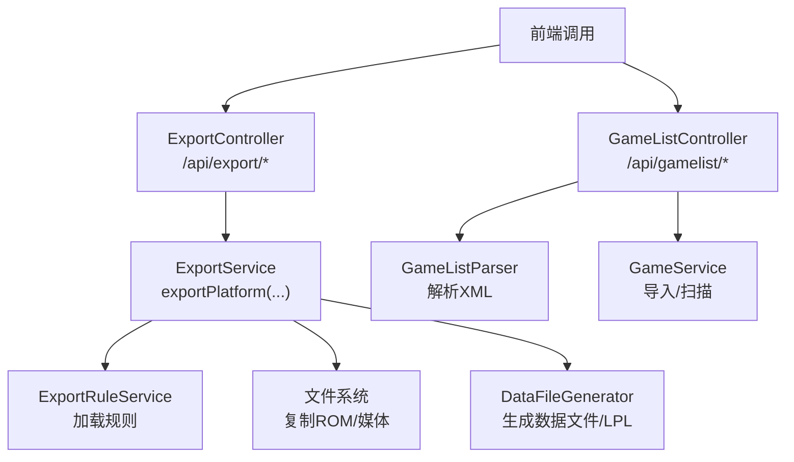
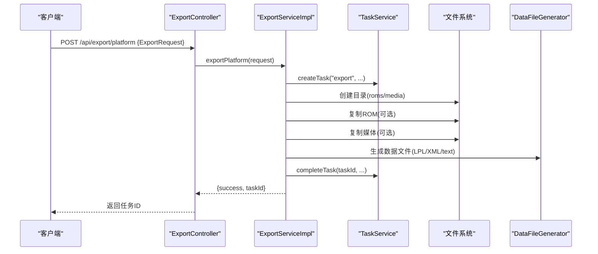
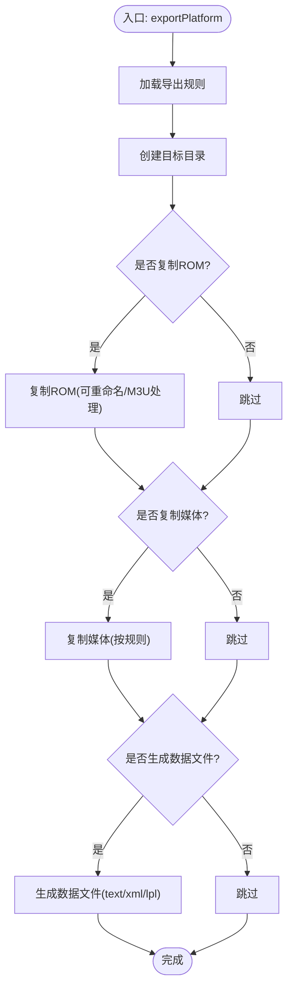
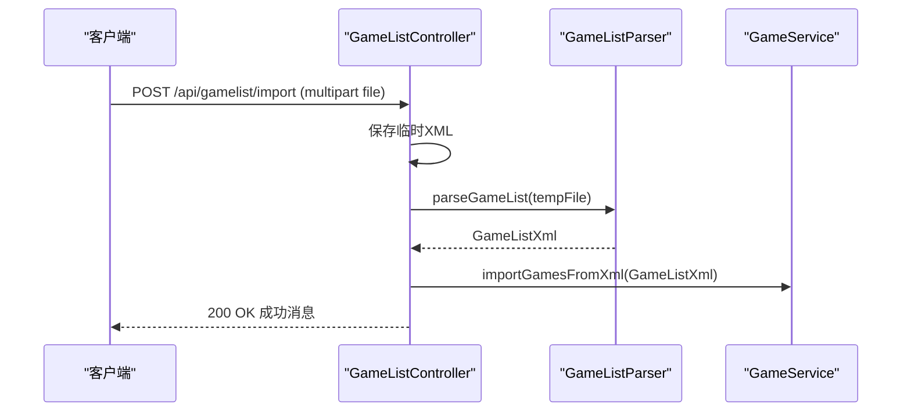
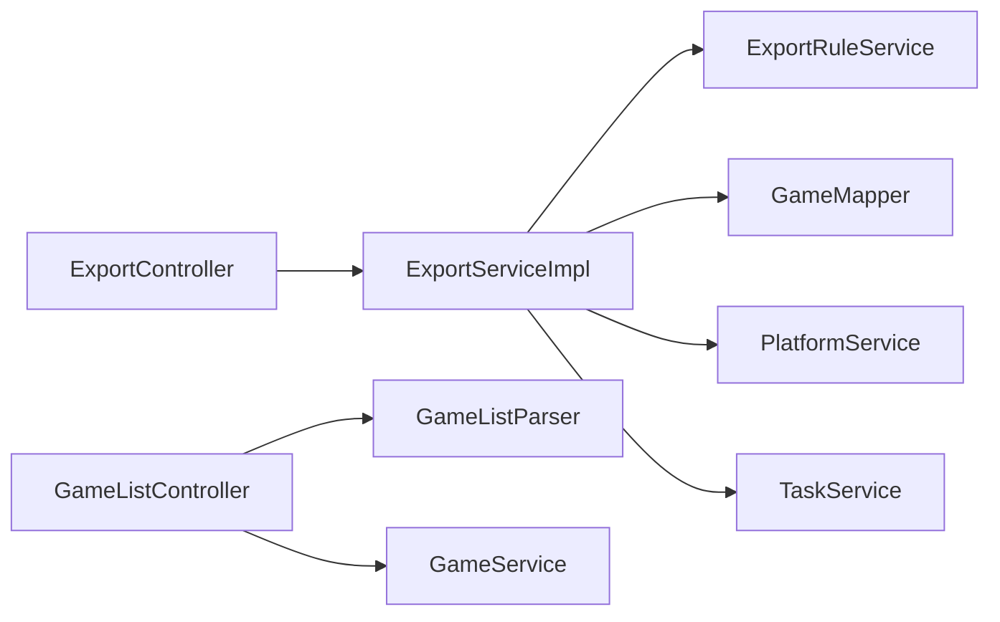

# 导入导出API

<cite>
**本文引用的文件**
- [ExportController.java](file://src/main/java/com/gamelist/controller/ExportController.java)
- [GameListController.java](file://src/main/java/com/gamelist/controller/GameListController.java)
- [ExportService.java](file://src/main/java/com/gamelist/service/ExportService.java)
- [ExportServiceImpl.java](file://src/main/java/com/gamelist/service/impl/ExportServiceImpl.java)
- [ExportRequest.java](file://src/main/java/com/gamelist/model/ExportRequest.java)
- [ImportRequest.java](file://src/main/java/com/gamelist/model/ImportRequest.java)
- [ExportResult.java](file://src/main/java/com/gamelist/model/ExportResult.java)
- [Game.java](file://src/main/java/com/gamelist/model/Game.java)
- [rules/export/pegasus.json](file://rules/export/pegasus.json)
- [rules/export/retrobat.json](file://rules/export/retrobat.json)
- [rules/export/esde.json](file://rules/export/esde.json)
- [rules/export/lakka.json](file://rules/export/lakka.json)
- [rules/import/pegasus.json](file://rules/import/pegasus.json)
- [docs/export-functionality-cn.md](file://docs/export-functionality-cn.md)
- [docs/import-templates-cn.md](file://docs/import-templates-cn.md)
</cite>

## 目录
1. [简介](#简介)
2. [项目结构](#项目结构)
3. [核心组件](#核心组件)
4. [架构总览](#架构总览)
5. [详细组件分析](#详细组件分析)
6. [依赖关系分析](#依赖关系分析)
7. [性能考虑](#性能考虑)
8. [故障排查指南](#故障排查指南)
9. [结论](#结论)
10. [附录](#附录)

## 简介
本文件为“导入导出”功能的RESTful API文档，覆盖以下要点：
- 数据导出：支持 Pegasus、RetroBat、EmuELEC（通过ESDE模板）、Lakka等前端；提供导出规则配置、模板选择、字段映射与变量替换。
- 数据导入：支持XML文件上传、扫描批量导入、模板导入与媒体关联。
- 任务流程：导出任务的创建、执行、进度监控与结果获取。
- 请求响应示例：包含导出配置参数、导入模板格式、错误处理机制。
- 字段对应关系：不同前端格式的字段映射与数据转换规则说明。

## 项目结构
- 控制器层
  - /api/export：导出相关接口（平台导出、导出规则列表）
  - /api/gamelist：游戏列表与导入相关接口（XML导入、扫描导入、模板列表）
- 服务层
  - ExportService/ExportServiceImpl：导出业务编排（复制ROM、复制媒体、生成数据文件、LPL播放列表）
- 模型层
  - ExportRequest/ImportRequest/ExportResult/Game：请求与响应数据结构
- 规则与模板
  - rules/export/*.json：各前端的导出规则（Pegasus、RetroBat、ESDE、Lakka）
  - rules/import/*.json：各前端的导入模板（字段映射、媒体匹配规则）
- 文档
  - docs/export-functionality-cn.md、docs/import-templates-cn.md：功能与模板详细说明

图表来源
- [ExportController.java:14-59](file://src/main/java/com/gamelist/controller/ExportController.java#L14-L59)
- [GameListController.java:51-114](file://src/main/java/com/gamelist/controller/GameListController.java#L51-L114)
- [ExportServiceImpl.java:52-181](file://src/main/java/com/gamelist/service/impl/ExportServiceImpl.java#L52-L181)

章节来源
- [ExportController.java:14-59](file://src/main/java/com/gamelist/controller/ExportController.java#L14-L59)
- [GameListController.java:51-114](file://src/main/java/com/gamelist/controller/GameListController.java#L51-L114)

## 核心组件
- 导出控制器
  - POST /api/export/platform：提交导出请求（平台ID、前端类型、输出路径、是否复制ROM/媒体、是否生成数据文件、线程数）
  - GET /api/export/rules：获取可用导出规则列表
- 导入控制器
  - POST /api/gamelist/import：上传XML并导入数据库
  - POST /api/gamelist/scan：按路径扫描并导入gamelist.xml
  - POST /api/gamelist/scan-pegasus：扫描并导入metadata.pegasus.txt
  - GET /api/gamelist/import/templates：读取导入模板列表（从/data/rules/import/*.json）
- 导出服务
  - exportPlatform：创建异步任务，依次执行：创建目录、复制ROM、复制媒体、生成数据文件（含LPL）
  - copyGameFiles/copyMediaFiles/generateDataFile：具体实现由服务层完成

章节来源
- [ExportController.java:25-58](file://src/main/java/com/gamelist/controller/ExportController.java#L25-L58)
- [GameListController.java:51-114](file://src/main/java/com/gamelist/controller/GameListController.java#L51-L114)
- [ExportService.java:7-37](file://src/main/java/com/gamelist/service/ExportService.java#L7-L37)
- [ExportServiceImpl.java:52-181](file://src/main/java/com/gamelist/service/impl/ExportServiceImpl.java#L52-L181)

## 架构总览
导出流程采用“控制器→服务→规则→文件/数据生成”的分层架构，并通过任务系统记录进度与日志。导入流程通过解析器将外部数据转换为内部模型后持久化。

图表来源
- [ExportController.java:25-41](file://src/main/java/com/gamelist/controller/ExportController.java#L25-L41)
- [ExportServiceImpl.java:52-181](file://src/main/java/com/gamelist/service/impl/ExportServiceImpl.java#L52-L181)

## 详细组件分析

### 导出API
- 接口
  - POST /api/export/platform
    - 请求体：ExportRequest（platformId、frontend、outputPath、copyRoms、copyMedia、generateDataFile、threadCount）
    - 响应：{success, message, taskId} 或错误信息
  - GET /api/export/rules
    - 响应：导出规则列表（前端名称、描述等）
- 行为
  - 校验平台是否存在
  - 加载导出规则（根据frontend）
  - 创建后台任务，更新进度与日志
  - 按规则复制ROM/媒体，生成数据文件（text/xml/lpl）
  - 完成任务并返回taskId供前端查询

图表来源
- [ExportServiceImpl.java:52-181](file://src/main/java/com/gamelist/service/impl/ExportServiceImpl.java#L52-L181)
- [ExportServiceImpl.java:183-581](file://src/main/java/com/gamelist/service/impl/ExportServiceImpl.java#L183-L581)

章节来源
- [ExportController.java:25-58](file://src/main/java/com/gamelist/controller/ExportController.java#L25-L58)
- [ExportServiceImpl.java:52-181](file://src/main/java/com/gamelist/service/impl/ExportServiceImpl.java#L52-L181)

### 导入API
- 接口
  - POST /api/gamelist/import
    - 表单字段：file（XML）
    - 响应：成功消息或错误信息
  - POST /api/gamelist/scan
    - 请求体：ScanRequest（path、scanDepth）
    - 响应：ScanResult（foundFiles、importedFiles、message等）
  - POST /api/gamelist/scan-pegasus
    - 请求体：ScanRequest
    - 响应：ScanResult
  - GET /api/gamelist/import/templates
    - 响应：导入模板列表（name、frontend、version、description等）
- 行为
  - XML导入：保存临时文件→解析→导入数据库→清理临时文件
  - 扫描导入：递归扫描指定路径，解析gamelist.xml或metadata.pegasus.txt并导入
  - 模板列表：读取/data/rules/import/*.json并解析元信息

图表来源
- [GameListController.java:51-74](file://src/main/java/com/gamelist/controller/GameListController.java#L51-L74)

章节来源
- [GameListController.java:51-114](file://src/main/java/com/gamelist/controller/GameListController.java#L51-L114)

### 导出规则与模板
- 支持的导出前端与规则文件
  - Pegasus：rules/export/pegasus.json（文本格式 metadata.pegasus.txt）
  - RetroBat：rules/export/retrobat.json（XML gamelist.xml）
  - EmulationStation DE（ESDE）：rules/export/esde.json（XML gamelist.xml，仅元数据与媒体）
  - Lakka：rules/export/lakka.json（LPL播放列表）
- 关键配置项
  - media：媒体源字段→目标路径模板→dataFileTag（可选）
  - dataFile：文件名、格式（text/xml/lpl）、表头/页脚、字段映射、路径格式
  - directory：roms/media目录模板（支持变量替换）
  - m3u：M3U播放列表处理开关与目标路径
  - gameFile：游戏文件重命名模板（enabled/template）
  - fieldTransforms：字段值转换（path/trim/case/replace）
- 导入模板
  - rules/import/pegasus.json：字段映射、媒体匹配规则、扩展名定义
  - 其他前端模板类似，用于将外部数据映射到内部Game模型

章节来源
- [rules/export/pegasus.json:1-93](file://rules/export/pegasus.json#L1-L93)
- [rules/export/retrobat.json:1-92](file://rules/export/retrobat.json#L1-L92)
- [rules/export/esde.json:1-120](file://rules/export/esde.json#L1-L120)
- [rules/export/lakka.json:1-73](file://rules/export/lakka.json#L1-L73)
- [rules/import/pegasus.json:1-556](file://rules/import/pegasus.json#L1-L556)
- [docs/export-functionality-cn.md:18-755](file://docs/export-functionality-cn.md#L18-L755)
- [docs/import-templates-cn.md:16-200](file://docs/import-templates-cn.md#L16-L200)

### 字段映射与数据转换
- 导出字段映射
  - 通过dataFile.fields将内部Game字段映射到导出数据字段
  - 支持多值匹配（逗号分隔），如"name,translatedName"
  - 路径格式控制：pathFormat/pathPrefix/fieldTransforms.path
- 导入字段映射
  - 通过fieldMappings将外部字段映射到内部Game字段
  - 支持正则替换、大小写转换、去空格等
- 媒体映射
  - 导出：media.source→target，可选dataFileTag写入数据文件
  - 导入：media.rules定义多种可能路径模板以匹配媒体文件

章节来源
- [ExportServiceImpl.java:743-800](file://src/main/java/com/gamelist/service/impl/ExportServiceImpl.java#L743-L800)
- [Game.java:1-200](file://src/main/java/com/gamelist/model/Game.java#L1-L200)
- [docs/export-functionality-cn.md:443-755](file://docs/export-functionality-cn.md#L443-L755)
- [docs/import-templates-cn.md:108-200](file://docs/import-templates-cn.md#L108-L200)

## 依赖关系分析
- 控制器依赖服务：ExportController→ExportService；GameListController→GameService/Parser
- 服务依赖规则与数据访问：ExportServiceImpl→ExportRuleService/GameMapper/PlatformService/TaskService
- 规则驱动：导出/导入均依赖JSON规则进行字段映射与文件组织
- 外部资源：文件系统、数据库（通过Mapper）、任务系统（TaskService）

图表来源
- [ExportController.java:14-59](file://src/main/java/com/gamelist/controller/ExportController.java#L14-L59)
- [ExportServiceImpl.java:31-49](file://src/main/java/com/gamelist/service/impl/ExportServiceImpl.java#L31-L49)
- [GameListController.java:41-50](file://src/main/java/com/gamelist/controller/GameListController.java#L41-L50)

章节来源
- [ExportController.java:14-59](file://src/main/java/com/gamelist/controller/ExportController.java#L14-L59)
- [ExportServiceImpl.java:31-49](file://src/main/java/com/gamelist/service/impl/ExportServiceImpl.java#L31-L49)
- [GameListController.java:41-50](file://src/main/java/com/gamelist/controller/GameListController.java#L41-L50)

## 性能考虑
- 并发复制：使用固定大小线程池复制ROM与媒体，默认线程数基于CPU核心数，最大限制避免过载
- 任务隔离：导出在单线程任务中顺序执行子步骤，便于进度与日志追踪
- I/O优化：预检查重命名与M3U规则，减少无效操作；按需创建目录
- 建议
  - 合理设置threadCount，避免磁盘I/O瓶颈
  - 大库导出时优先只复制必要内容（ROM/媒体/数据文件三选）
  - 监控磁盘空间与权限，确保输出目录可写

[本节为通用指导，不直接分析具体文件]

## 故障排查指南
- 常见错误
  - 平台不存在：返回success=false与错误信息
  - 未找到导出规则：检查frontend是否正确且规则已加载
  - 源文件不存在：日志警告并跳过
  - 路径非法或无权限：检查outputPath与系统权限
- 定位方法
  - 查看控制器与服务层日志（SLF4J）
  - 通过任务ID查询任务状态与日志（由TaskService管理）
  - 检查规则JSON语法与变量替换结果

章节来源
- [ExportController.java:25-58](file://src/main/java/com/gamelist/controller/ExportController.java#L25-L58)
- [ExportServiceImpl.java:52-181](file://src/main/java/com/gamelist/service/impl/ExportServiceImpl.java#L52-L181)

## 结论
本导入导出API通过规则驱动的方式，统一了多前端的数据迁移能力。导出侧支持Pegasus、RetroBat、ESDE、Lakka等格式，并提供灵活的字段映射与文件组织；导入侧支持XML与文本格式，具备强大的媒体匹配与字段转换能力。借助任务系统，用户可实时跟踪导出进度与结果。

[本节为总结性内容，不直接分析具体文件]

## 附录

### API清单与请求响应示例

- 导出
  - POST /api/export/platform
    - 请求体字段（ExportRequest）
      - platformId: Long
      - frontend: String（pegasus/retrobat/esde/lakka）
      - outputPath: String（默认/data/output）
      - copyRoms: boolean
      - copyMedia: boolean
      - generateDataFile: boolean
      - threadCount: int
    - 成功响应示例
      - { "success": true, "message": "导出任务已启动", "taskId": 123 }
    - 失败响应示例
      - { "success": false, "error": "Platform not found" }
- 获取导出规则
  - GET /api/export/rules
    - 响应：规则列表（包含frontend、name、description等）
- 导入
  - POST /api/gamelist/import
    - 表单字段：file（XML）
    - 成功响应：字符串消息
    - 失败响应：HTTP 500 + 错误信息
  - POST /api/gamelist/scan
    - 请求体（ScanRequest）：path、scanDepth
    - 响应（ScanResult）：success、message、foundFiles、importedFiles
  - POST /api/gamelist/scan-pegasus
    - 同scan，但针对metadata.pegasus.txt
  - GET /api/gamelist/import/templates
    - 响应：模板列表（fileName、name、frontend、version、description）

章节来源
- [ExportController.java:25-58](file://src/main/java/com/gamelist/controller/ExportController.java#L25-L58)
- [GameListController.java:51-114](file://src/main/java/com/gamelist/controller/GameListController.java#L51-L114)
- [ExportRequest.java:1-70](file://src/main/java/com/gamelist/model/ExportRequest.java#L1-L70)
- [ImportRequest.java:1-29](file://src/main/java/com/gamelist/model/ImportRequest.java#L1-L29)
- [ExportResult.java:1-98](file://src/main/java/com/gamelist/model/ExportResult.java#L1-L98)

### 字段映射速查

- 导出字段（Game→导出数据）
  - name/title → name/translatedName
  - description/desc → description/translatedDesc
  - releaseYear → releaseDate（取releasedate前4位）
  - developer/publisher/genre/players/region → 对应字段
  - path/files → 文件路径（受fieldTransforms.path影响）
- 导入字段（外部→Game）
  - 通过fieldMappings将外部字段映射到内部字段
  - 支持多值字段与路径转换（no/yes/keep）
- 媒体映射
  - 导出：source→target，可选dataFileTag
  - 导入：media.rules定义多种路径模板以匹配媒体

章节来源
- [ExportServiceImpl.java:743-800](file://src/main/java/com/gamelist/service/impl/ExportServiceImpl.java#L743-L800)
- [docs/export-functionality-cn.md:443-755](file://docs/export-functionality-cn.md#L443-L755)
- [docs/import-templates-cn.md:108-200](file://docs/import-templates-cn.md#L108-L200)

### 任务监控与结果获取
- 导出任务
  - 创建：exportPlatform返回taskId
  - 进度：通过TaskService更新（开始、进行中、完成、失败）
  - 结果：完成后输出路径与统计信息（由服务层记录）
- 导入任务
  - 同步返回结果（成功/失败）
  - 扫描导入返回统计（foundFiles/importedFiles）

章节来源
- [ExportServiceImpl.java:52-181](file://src/main/java/com/gamelist/service/impl/ExportServiceImpl.java#L52-L181)
- [GameListController.java:76-114](file://src/main/java/com/gamelist/controller/GameListController.java#L76-L114)