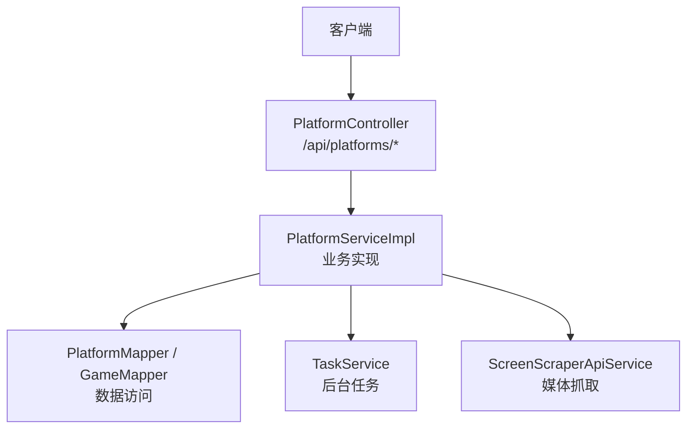
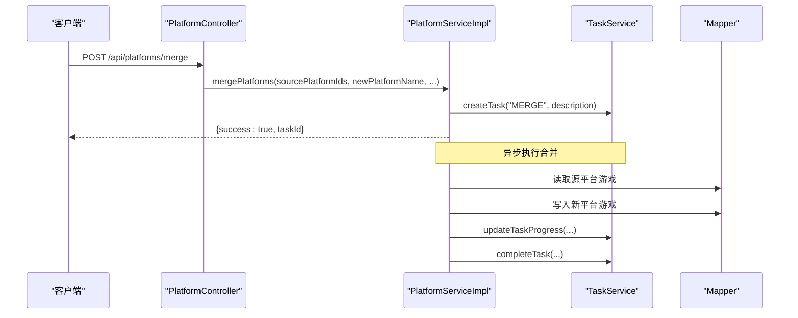
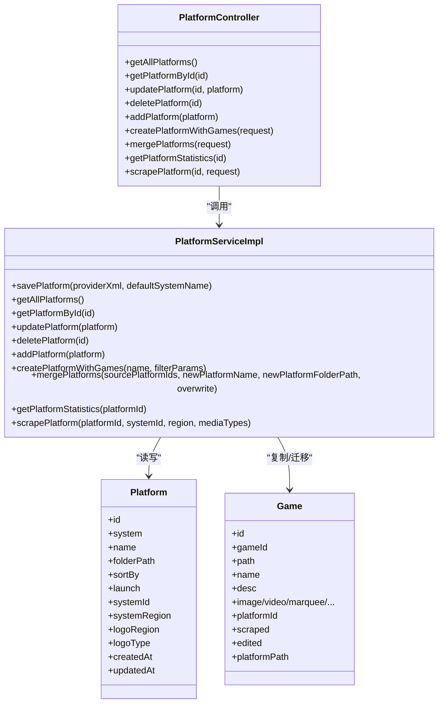
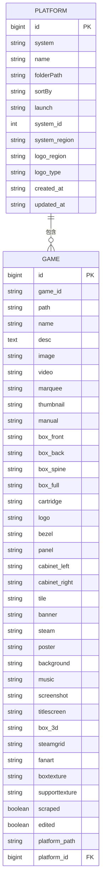

# 平台管理API

<cite>
**本文档引用的文件**
- [PlatformController.java](file://src/main/java/com/gamelist/controller/PlatformController.java)
- [PlatformService.java](file://src/main/java/com/gamelist/service/PlatformService.java)
- [PlatformServiceImpl.java](file://src/main/java/com/gamelist/service/impl/PlatformServiceImpl.java)
- [Platform.java](file://src/main/java/com/gamelist/model/Platform.java)
- [PlatformType.java](file://src/main/java/com/gamelist/model/PlatformType.java)
- [Game.java](file://src/main/java/com/gamelist/model/Game.java)
- [schema.sql](file://src/main/resources/schema.sql)
- [GameListController.java](file://src/main/java/com/gamelist/controller/GameListController.java)
- [GameService.java](file://src/main/java/com/gamelist/service/GameService.java)
</cite>

## 目录
1. [简介](#简介)
2. [项目结构](#项目结构)
3. [核心组件](#核心组件)
4. [架构总览](#架构总览)
5. [详细接口说明](#详细接口说明)
6. [依赖关系分析](#依赖关系分析)
7. [性能与扩展性](#性能与扩展性)
8. [故障排查指南](#故障排查指南)
9. [结论](#结论)
10. [附录：数据模型与关联](#附录数据模型与关联)

## 简介
本文件为“游戏平台管理”的RESTful API文档，覆盖平台的CRUD、平台间数据迁移（合并）、平台统计信息获取、平台配置管理与批量操作等能力。文档包含请求/响应示例、数据模型与关联关系说明，以及平台类型定义与扩展机制。

## 项目结构
平台管理相关代码主要位于控制器层、服务层与模型层：
- 控制器：提供HTTP端点，负责参数校验与响应封装
- 服务：实现业务逻辑，包括平台创建、更新、删除、合并、统计、刮削任务调度等
- 模型：平台、游戏、平台类型等实体定义
- 数据库迁移脚本：补充平台字段、媒体字段与状态字段

图表来源
- [PlatformController.java:22-173](file://src/main/java/com/gamelist/controller/PlatformController.java#L22-L173)
- [PlatformServiceImpl.java:29-53](file://src/main/java/com/gamelist/service/impl/PlatformServiceImpl.java#L29-L53)

章节来源
- [PlatformController.java:22-173](file://src/main/java/com/gamelist/controller/PlatformController.java#L22-L173)
- [PlatformServiceImpl.java:29-53](file://src/main/java/com/gamelist/service/impl/PlatformServiceImpl.java#L29-L53)

## 核心组件
- 平台控制器：暴露平台CRUD、创建并带游戏、平台合并、统计、刮削等接口
- 平台服务：实现平台增删改查、基于筛选条件创建平台并复制游戏、多平台合并到新平台、统计计算、异步刮削
- 平台模型：平台元数据（系统名、名称、路径、排序方式、启动命令、区域、Logo策略、时间戳等）
- 平台类型：内置支持recalbox、batocera、retrobat、esde、generic，并提供识别与校验方法
- 游戏模型：游戏完整属性集合，含大量媒体字段与平台关联字段

章节来源
- [PlatformController.java:22-173](file://src/main/java/com/gamelist/controller/PlatformController.java#L22-L173)
- [PlatformService.java:11-38](file://src/main/java/com/gamelist/service/PlatformService.java#L11-L38)
- [Platform.java:1-141](file://src/main/java/com/gamelist/model/Platform.java#L1-L141)
- [PlatformType.java:1-51](file://src/main/java/com/gamelist/model/PlatformType.java#L1-L51)
- [Game.java:1-200](file://src/main/java/com/gamelist/model/Game.java#L1-L200)

## 架构总览
平台管理的调用链路如下：
- 客户端通过REST调用PlatformController
- Controller将请求委托给PlatformService
- Service进行业务处理，必要时调用Mapper读写数据库，或通过TaskService创建后台任务执行耗时操作（如合并、刮削）
- 刮削流程通过ScreenScraperApiService获取媒体资源并持久化

图表来源
- [PlatformController.java:109-141](file://src/main/java/com/gamelist/controller/PlatformController.java#L109-L141)
- [PlatformServiceImpl.java:680-732](file://src/main/java/com/gamelist/service/impl/PlatformServiceImpl.java#L680-L732)
- [PlatformServiceImpl.java:782-851](file://src/main/java/com/gamelist/service/impl/PlatformServiceImpl.java#L782-L851)

## 详细接口说明

### 基础CRUD
- 获取所有平台
  - 方法：GET
  - 路径：/api/platforms
  - 响应：平台列表
- 根据ID获取平台
  - 方法：GET
  - 路径：/api/platforms/{id}
  - 响应：平台对象或404
- 更新平台
  - 方法：PUT
  - 路径：/api/platforms/{id}
  - 请求体：平台对象（至少包含id）
  - 响应：更新后的平台对象
- 删除平台
  - 方法：DELETE
  - 路径：/api/platforms/{id}
  - 响应：204 No Content
- 新增平台
  - 方法：POST
  - 路径：/api/platforms
  - 请求体：平台对象
  - 响应：{ success, message }

章节来源
- [PlatformController.java:29-79](file://src/main/java/com/gamelist/controller/PlatformController.java#L29-L79)

### 创建平台并带游戏
- 方法：POST
- 路径：/api/platforms/create-with-games
- 请求体：
  - name: 新平台名称
  - filter: 筛选条件Map，可包含platformIds等
- 响应：
  - success: true/false
  - platformName: 新平台名称
  - platformId: 新平台ID
  - gameCount: 添加的游戏数量
  - 失败时返回errorMessage

行为说明：
- 基于filter筛选游戏，创建新平台并将筛选出的游戏复制到新平台（保留原游戏标识，仅修改platformId）
- 若存在原平台，会继承sortBy、launch等属性

章节来源
- [PlatformController.java:81-107](file://src/main/java/com/gamelist/controller/PlatformController.java#L81-L107)
- [PlatformServiceImpl.java:529-631](file://src/main/java/com/gamelist/service/impl/PlatformServiceImpl.java#L529-L631)

### 平台间数据迁移（合并）
- 方法：POST
- 路径：/api/platforms/merge
- 请求体：
  - sourcePlatformIds: 源平台ID数组（支持字符串/整数/长整型）
  - newPlatformName: 新平台名称
  - newPlatformFolderPath: 新平台文件夹路径
  - overwrite: 是否覆盖已存在游戏（可选）
- 响应：
  - success: true/false
  - taskId: 后台任务ID（用于查询进度）
  - message: 提示信息
  - 失败时返回errorMessage

行为说明：
- 创建新平台，将多个源平台的游戏合并到新平台
- 重复检测优先级：gameId > crc32 > 文件名精确匹配 > 游戏名不区分大小写匹配
- 若overwrite为true且检测到重复，则覆盖；否则跳过
- 合并过程异步执行，通过taskId查询任务进度与日志

章节来源
- [PlatformController.java:109-141](file://src/main/java/com/gamelist/controller/PlatformController.java#L109-L141)
- [PlatformServiceImpl.java:680-732](file://src/main/java/com/gamelist/service/impl/PlatformServiceImpl.java#L680-L732)
- [PlatformServiceImpl.java:782-851](file://src/main/java/com/gamelist/service/impl/PlatformServiceImpl.java#L782-L851)
- [PlatformServiceImpl.java:854-893](file://src/main/java/com/gamelist/service/impl/PlatformServiceImpl.java#L854-L893)

### 平台统计信息
- 方法：GET
- 路径：/api/platforms/{id}/statistics
- 响应：
  - totalGames: 总游戏数
  - fullyScraped: 完全刮削（既有描述又有媒体）
  - partiallyScraped: 部分刮削（仅有描述或仅有媒体）
  - notScraped: 未刮削（既无描述也无媒体）
  - duplicateFiles: 重复文件分组（按文件名）
  - duplicateFilesCount: 重复文件总数

章节来源
- [PlatformController.java:143-154](file://src/main/java/com/gamelist/controller/PlatformController.java#L143-L154)
- [PlatformServiceImpl.java:1036-1110](file://src/main/java/com/gamelist/service/impl/PlatformServiceImpl.java#L1036-L1110)

### 平台刮削（媒体抓取）
- 方法：POST
- 路径：/api/platforms/{id}/scrape
- 请求体：
  - systemId: 系统ID
  - region: 地区（逗号分隔）
  - mediaTypes: 媒体类型数组
- 响应：
  - success: true/false
  - taskId: 后台任务ID
  - message: 提示信息
  - 失败时返回errorMessage

行为说明：
- 为指定平台按地区和媒体类型抓取媒体资源并保存
- 抓取完成后更新平台的systemId与systemRegion

章节来源
- [PlatformController.java:156-172](file://src/main/java/com/gamelist/controller/PlatformController.java#L156-L172)
- [PlatformServiceImpl.java:1165-1248](file://src/main/java/com/gamelist/service/impl/PlatformServiceImpl.java#L1165-L1248)

### 游戏批量迁移（跨平台）
- 方法：PUT
- 路径：/api/gamelist/games/migrate
- 请求体：
  - gameIds: 要迁移的游戏ID数组
  - targetPlatformId: 目标平台ID
- 响应：
  - success: true/false
  - migratedCount: 成功迁移的数量
  - message: 提示信息
  - 失败时返回error

章节来源
- [GameListController.java:393-413](file://src/main/java/com/gamelist/controller/GameListController.java#L393-L413)
- [GameService.java:58-58](file://src/main/java/com/gamelist/service/GameService.java#L58-L58)

## 依赖关系分析
- PlatformController依赖PlatformService
- PlatformServiceImpl依赖：
  - PlatformMapper/GameMapper/MediaDownloadTaskMapper：数据访问
  - TaskService：后台任务管理
  - ScreenScraperApiService：媒体抓取
  - ScraperSettingsService：刮削配置
- 平台与游戏为一对多关系（一个平台包含多个游戏）
- 平台类型由PlatformType集中管理，便于扩展

图表来源
- [PlatformController.java:22-173](file://src/main/java/com/gamelist/controller/PlatformController.java#L22-L173)
- [PlatformServiceImpl.java:29-53](file://src/main/java/com/gamelist/service/impl/PlatformServiceImpl.java#L29-L53)
- [Platform.java:1-141](file://src/main/java/com/gamelist/model/Platform.java#L1-L141)
- [Game.java:1-200](file://src/main/java/com/gamelist/model/Game.java#L1-L200)

章节来源
- [PlatformController.java:22-173](file://src/main/java/com/gamelist/controller/PlatformController.java#L22-L173)
- [PlatformServiceImpl.java:29-53](file://src/main/java/com/gamelist/service/impl/PlatformServiceImpl.java#L29-L53)

## 性能与扩展性
- 合并与刮削采用异步任务，避免阻塞请求，提升用户体验
- 合并过程中使用分批与去重策略，减少冗余写入
- 统计接口对媒体字段进行快速判断，避免复杂计算
- 平台类型通过常量类集中管理，便于新增平台类型与识别规则

优化建议：
- 大平台合并时可考虑分页处理与并发控制
- 统计接口可对海量游戏引入缓存或预聚合表
- 刮削任务可增加重试与限流机制

[本节为通用指导，无需特定文件引用]

## 故障排查指南
- 平台不存在
  - 现象：GET /api/platforms/{id} 返回404
  - 处理：检查平台ID是否正确
- 合并失败
  - 现象：返回success=false与errorMessage
  - 处理：查看taskId对应的任务日志，确认源平台是否存在、是否有权限写入
- 刮削失败
  - 现象：返回success=false与errorMessage
  - 处理：检查scraper配置（用户名/密码）、网络连通性与媒体源可用性
- 重复文件
  - 现象：statistics中duplicateFiles不为空
  - 处理：根据文件名定位重复项，决定覆盖或删除

章节来源
- [PlatformController.java:35-42](file://src/main/java/com/gamelist/controller/PlatformController.java#L35-L42)
- [PlatformController.java:109-141](file://src/main/java/com/gamelist/controller/PlatformController.java#L109-L141)
- [PlatformController.java:143-154](file://src/main/java/com/gamelist/controller/PlatformController.java#L143-L154)
- [PlatformController.java:156-172](file://src/main/java/com/gamelist/controller/PlatformController.java#L156-L172)

## 结论
本平台管理API提供了完整的平台生命周期管理能力，涵盖创建、编辑、删除、查询、合并、统计与刮削等关键功能。通过异步任务与去重策略，保证了大规模数据处理时的稳定性与效率。平台类型机制便于扩展新的平台生态。

[本节为总结，无需特定文件引用]

## 附录：数据模型与关联

### 平台模型（Platform）
- 关键字段：id、system、name、folderPath、sortBy、launch、systemId、systemRegion、logoRegion、logoType、createdAt、updatedAt
- 用途：描述平台元数据与运行配置

章节来源
- [Platform.java:1-141](file://src/main/java/com/gamelist/model/Platform.java#L1-L141)

### 游戏模型（Game）
- 关键字段：id、gameId、path、name、desc、image/video/marquee/...、platformId、scraped、edited、platformPath
- 用途：记录游戏及其丰富的媒体信息与平台归属

章节来源
- [Game.java:1-200](file://src/main/java/com/gamelist/model/Game.java#L1-L200)

### 平台类型（PlatformType）
- 内置类型：recalbox、batocera、retrobat、esde、generic
- 能力：校验与识别平台类型，便于后续扩展

章节来源
- [PlatformType.java:1-51](file://src/main/java/com/gamelist/model/PlatformType.java#L1-L51)

### 数据库字段补充
- 平台表新增system_id、system_region
- 游戏表新增scraped、edited、platform_path及多种媒体字段
- 临时子集游戏表同步新增相同字段

章节来源
- [schema.sql:1-29](file://src/main/resources/schema.sql#L1-L29)

### 关联关系
- 平台与游戏：一对多（Platform.id -> Game.platformId）
- 平台类型：通过PlatformType统一管理，便于扩展

图表来源
- [Platform.java:1-141](file://src/main/java/com/gamelist/model/Platform.java#L1-L141)
- [Game.java:1-200](file://src/main/java/com/gamelist/model/Game.java#L1-L200)
- [schema.sql:1-29](file://src/main/resources/schema.sql#L1-L29)