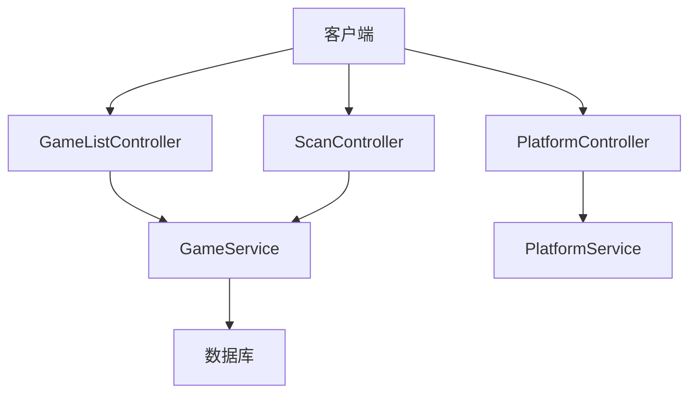
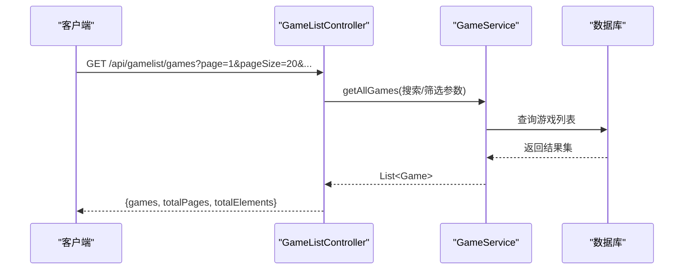
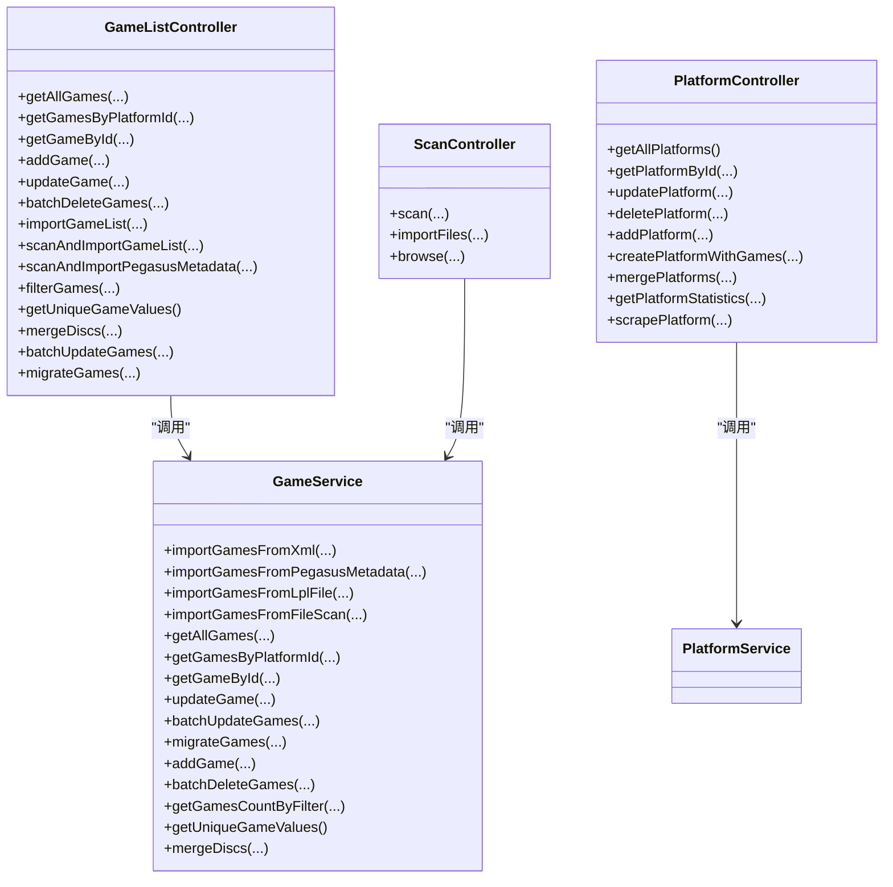

# 游戏管理API

<cite>
**本文引用的文件**
- [GameListController.java](file://src/main/java/com/gamelist/controller/GameListController.java)
- [ScanController.java](file://src/main/java/com/gamelist/controller/ScanController.java)
- [PlatformController.java](file://src/main/java/com/gamelist/controller/PlatformController.java)
- [GameService.java](file://src/main/java/com/gamelist/service/GameService.java)
- [Game.java](file://src/main/java/com/gamelist/model/Game.java)
- [Platform.java](file://src/main/java/com/gamelist/model/Platform.java)
- [ScanRequest.java](file://src/main/java/com/gamelist/model/ScanRequest.java)
- [ScanResult.java](file://src/main/java/com/gamelist/model/ScanResult.java)
- [ImportStatistics.java](file://src/main/java/com/gamelist/model/ImportStatistics.java)
- [schema.sql](file://src/main/resources/schema.sql)
</cite>

## 目录
1. [简介](#简介)
2. [项目结构](#项目结构)
3. [核心组件](#核心组件)
4. [架构总览](#架构总览)
5. [接口详细文档](#接口详细文档)
6. [依赖关系分析](#依赖关系分析)
7. [性能与扩展性](#性能与扩展性)
8. [故障排查指南](#故障排查指南)
9. [结论](#结论)
10. [附录：数据模型与约束](#附录数据模型与约束)

## 简介
本文件为游戏管理模块的RESTful API详细说明，覆盖游戏列表查询、单个游戏获取、创建、更新、删除、导入XML、扫描ROM目录、按平台筛选、分页与条件筛选（开发商、类型、玩家数等）、批量操作等能力。同时提供错误处理机制、状态码说明以及数据模型字段定义与业务规则约束。

## 项目结构
- 控制器层
  - GameListController：游戏列表、导入、统计、筛选、CRUD、批量操作
  - ScanController：扫描文件系统、异步导入任务、目录浏览
  - PlatformController：平台CRUD、合并、刮削、统计
- 服务层
  - GameService：游戏导入、查询、统计、批量操作等核心逻辑接口
- 模型层
  - Game、Platform、ScanRequest、ScanResult、ImportStatistics 等
- 数据库迁移
  - schema.sql 描述新增字段与默认值

图表来源
- [GameListController.java:39-551](file://src/main/java/com/gamelist/controller/GameListController.java#L39-L551)
- [ScanController.java:26-579](file://src/main/java/com/gamelist/controller/ScanController.java#L26-L579)
- [PlatformController.java:22-174](file://src/main/java/com/gamelist/controller/PlatformController.java#L22-L174)
- [GameService.java:13-61](file://src/main/java/com/gamelist/service/GameService.java#L13-L61)

章节来源
- [GameListController.java:39-551](file://src/main/java/com/gamelist/controller/GameListController.java#L39-L551)
- [ScanController.java:26-579](file://src/main/java/com/gamelist/controller/ScanController.java#L26-L579)
- [PlatformController.java:22-174](file://src/main/java/com/gamelist/controller/PlatformController.java#L22-L174)
- [GameService.java:13-61](file://src/main/java/com/gamelist/service/GameService.java#L13-L61)

## 核心组件
- 游戏控制器：提供游戏CRUD、导入XML、扫描导入、统计、筛选、批量操作等接口
- 扫描控制器：支持扫描指定路径的数据文件（gamelist.xml、metadata.pegasus.txt、.lpl），并启动异步导入任务
- 平台控制器：平台增删改查、合并、按平台刮削、统计
- 服务接口：封装导入、查询、统计、批量操作等业务逻辑
- 数据模型：Game、Platform、ScanRequest、ScanResult、ImportStatistics

章节来源
- [GameListController.java:39-551](file://src/main/java/com/gamelist/controller/GameListController.java#L39-L551)
- [ScanController.java:26-579](file://src/main/java/com/gamelist/controller/ScanController.java#L26-L579)
- [PlatformController.java:22-174](file://src/main/java/com/gamelist/controller/PlatformController.java#L22-L174)
- [GameService.java:13-61](file://src/main/java/com/gamelist/service/GameService.java#L13-L61)

## 架构总览
系统采用Spring MVC REST风格，控制器接收HTTP请求，调用服务层完成业务逻辑，最终通过JDBC/MyBatis访问数据库。扫描与导入支持异步任务，便于大文件处理与进度跟踪。

图表来源
- [GameListController.java:128-160](file://src/main/java/com/gamelist/controller/GameListController.java#L128-L160)
- [GameService.java:40-46](file://src/main/java/com/gamelist/service/GameService.java#L40-L46)

## 接口详细文档

### 基础信息
- 基础路径
  - 游戏：/api/gamelist
  - 扫描：/api/scan
  - 平台：/api/platforms
- 通用响应格式
  - 成功：HTTP 200，JSON体包含业务数据或消息
  - 失败：HTTP 4xx/5xx，JSON体包含error或errorMessage等字段

### 游戏列表与查询
- 获取所有游戏（分页+多条件）
  - 方法：GET
  - 路径：/api/gamelist/games
  - 查询参数
    - page：页码，默认1
    - pageSize：每页数量，默认20
    - search：关键词搜索
    - startDate/endDate：日期范围
    - developers：开发商列表
    - genres：类型列表
    - players：玩家数列表
    - scrapeStatuses：刮削状态列表
    - folderPath：文件夹路径过滤
  - 响应体
    - games：数组，元素为Game对象
    - totalPages：总页数
    - totalElements：总数
  - 示例
    - 请求：GET /api/gamelist/games?page=1&pageSize=20&developers=Capcom&genres=Action
    - 响应：{ "games": [...], "totalPages": 5, "totalElements": 98 }
  - 错误
    - 服务器异常：500，{"error":"获取所有游戏列表失败"}

- 按平台ID获取游戏（分页+多条件）
  - 方法：GET
  - 路径：/api/gamelist/platforms/{platformId}/games
  - 路径参数
    - platformId：平台ID
  - 查询参数
    - page/pageSize/search/startDate/endDate/developers/genres/players/scrapeStatuses/fileStatuses/folderPath
  - 响应体：同“获取所有游戏”
  - 错误
    - 服务器异常：500，{"error":"获取平台游戏列表失败"}

- 获取单个游戏详情
  - 方法：GET
  - 路径：/api/gamelist/games/{gameId}
  - 路径参数
    - gameId：游戏ID
  - 响应体：Game对象
  - 错误
    - 未找到：404

- 按刮削状态获取游戏（分页）
  - 方法：GET
  - 路径：/api/gamelist/games/by-status
  - 查询参数
    - platformId：可选
    - status：刮削状态
    - page：页码，默认1
    - size：每页大小，默认10
  - 响应体：Game数组
  - 错误
    - 服务器异常：500

- 筛选计数
  - 方法：POST
  - 路径：/api/gamelist/games/filter
  - 请求体：Map<String,Object> filterParams（如开发者、类型、玩家数等）
  - 响应体：{"count": 数字}
  - 错误
    - 服务器异常：500，{"error":"筛选失败：..."}

- 获取唯一值（用于前端筛选器）
  - 方法：GET
  - 路径：/api/gamelist/games/unique-values
  - 响应体：{"developer":[...],"publisher":[...],"genre":[...],"players":[...]}
  - 错误
    - 服务器异常：500

章节来源
- [GameListController.java:119-160](file://src/main/java/com/gamelist/controller/GameListController.java#L119-L160)
- [GameListController.java:165-199](file://src/main/java/com/gamelist/controller/GameListController.java#L165-L199)
- [GameListController.java:204-208](file://src/main/java/com/gamelist/controller/GameListController.java#L204-L208)
- [GameListController.java:252-266](file://src/main/java/com/gamelist/controller/GameListController.java#L252-L266)
- [GameListController.java:419-431](file://src/main/java/com/gamelist/controller/GameListController.java#L419-L431)
- [GameListController.java:436-446](file://src/main/java/com/gamelist/controller/GameListController.java#L436-L446)
- [GameService.java:40-55](file://src/main/java/com/gamelist/service/GameService.java#L40-L55)

### 游戏创建、更新、删除
- 新增游戏
  - 方法：POST
  - 路径：/api/gamelist/games
  - 请求体：Game对象
  - 响应体：字符串消息
  - 错误
    - 服务器异常：500，{"body":"新增失败：..."}

- 更新游戏
  - 方法：PUT
  - 路径：/api/gamelist/games
  - 请求体：Game对象（需包含id）
  - 响应体：字符串消息
  - 错误
    - 未找到：404，{"body":"游戏信息更新失败：未找到指定游戏"}
    - 服务器异常：500，{"body":"更新失败：..."}

- 批量删除
  - 方法：DELETE
  - 路径：/api/gamelist/games/batch-delete
  - 请求体：{"gameIds":[1,2,3]}
  - 响应体：{"success":true,"deletedCount":N,"message":"成功删除 N 个游戏"}
  - 错误
    - 参数无效：400，{"error":"游戏ID列表不能为空"}
    - 服务器异常：500，{"success":false,"error":"批量删除失败：..."}

- 清空所有游戏
  - 方法：DELETE
  - 路径：/api/gamelist/games
  - 响应体：字符串消息（已删除数量）

章节来源
- [GameListController.java:465-480](file://src/main/java/com/gamelist/controller/GameListController.java#L465-L480)
- [GameListController.java:271-286](file://src/main/java/com/gamelist/controller/GameListController.java#L271-L286)
- [GameListController.java:485-507](file://src/main/java/com/gamelist/controller/GameListController.java#L485-L507)
- [GameListController.java:213-217](file://src/main/java/com/gamelist/controller/GameListController.java#L213-L217)
- [GameService.java:52-61](file://src/main/java/com/gamelist/service/GameService.java#L52-L61)

### 批量操作
- 批量更新
  - 方法：PUT
  - 路径：/api/gamelist/games/batch
  - 请求体：{"gameIds":[...], "updates":{"field":"value",...}}
  - 响应体：{"success":true,"updatedCount":N,"message":"成功更新 N 个游戏"}
  - 错误
    - 参数无效：400，{"error":"游戏ID列表为空或包含无效ID"}
    - 服务器异常：500，{"success":false,"error":"批量更新失败：..."}

- 迁移到目标平台
  - 方法：PUT
  - 路径：/api/gamelist/games/migrate
  - 请求体：{"gameIds":[...], "targetPlatformId":数字}
  - 响应体：{"success":true,"migratedCount":N,"message":"成功迁移 N 个游戏到目标平台"}
  - 错误
    - 参数无效：400，{"error":"目标平台ID无效"}
    - 服务器异常：500，{"success":false,"error":"迁移游戏失败：..."}

- 合盘
  - 方法：POST
  - 路径：/api/gamelist/merge-discs
  - 请求体：{"gameIds":[...]}
  - 响应体：由服务返回的结果（包含success等字段）
  - 错误
    - 参数无效：400

章节来源
- [GameListController.java:291-341](file://src/main/java/com/gamelist/controller/GameListController.java#L291-L341)
- [GameListController.java:346-413](file://src/main/java/com/gamelist/controller/GameListController.java#L346-L413)
- [GameListController.java:451-460](file://src/main/java/com/gamelist/controller/GameListController.java#L451-L460)
- [GameService.java:56-58](file://src/main/java/com/gamelist/service/GameService.java#L56-L58)

### 导入与扫描
- 导入XML文件
  - 方法：POST
  - 路径：/api/gamelist/import
  - 请求体：multipart/form-data，字段名 file（上传XML）
  - 响应体：字符串消息
  - 错误
    - 服务器异常：500，{"body":"导入失败：..."}

- 扫描并导入gamelist.xml
  - 方法：POST
  - 路径：/api/gamelist/scan
  - 请求体：ScanRequest（path, scanDepth）
  - 响应体：ScanResult（success,message,foundFiles,importedFiles,details[]）
  - 错误
    - 服务器异常：500，{"success":false,"message":"扫描过程中发生错误：...","foundFiles":0,"importedFiles":0}

- 扫描并导入Pegasus元数据
  - 方法：POST
  - 路径：/api/gamelist/scan-pegasus
  - 请求体：ScanRequest（path, scanDepth）
  - 响应体：ScanResult
  - 错误
    - 服务器异常：500

- 扫描文件系统（仅发现文件）
  - 方法：POST
  - 路径：/api/scan/scan
  - 请求体：ScanController.ScanRequest（path, depth, importMethod, importTemplate, noDataFile, fileExtensions, scraperSystemId）
  - 响应体：ScanResult（details中列出找到的文件及类型）
  - 错误
    - 路径不存在：success=false，message提示

- 异步导入任务
  - 方法：POST
  - 路径：/api/scan/import
  - 请求体：ScanController.ImportRequest（files[], type, metadataOnly, threadCount, importMethod, importTemplate, scanPath, noDataFile, fileExtensions, scraperSystemId）
  - 响应体：BackgroundTask（任务ID等）
  - 说明：后台执行导入，可通过任务服务查询进度与日志

- 目录浏览
  - 方法：POST
  - 路径：/api/scan/browse
  - 请求体：{"path":"..."}
  - 响应体：{"success":true,"message":"浏览成功","directories":["..."]}
  - 错误
    - 路径无效：success=false

章节来源
- [GameListController.java:54-114](file://src/main/java/com/gamelist/controller/GameListController.java#L54-L114)
- [ScanController.java:173-239](file://src/main/java/com/gamelist/controller/ScanController.java#L173-L239)
- [ScanController.java:244-410](file://src/main/java/com/gamelist/controller/ScanController.java#L244-L410)
- [ScanController.java:559-579](file://src/main/java/com/gamelist/controller/ScanController.java#L559-L579)
- [ScanRequest.java:7-27](file://src/main/java/com/gamelist/model/ScanRequest.java#L7-L27)
- [ScanResult.java:5-93](file://src/main/java/com/gamelist/model/ScanResult.java#L5-L93)
- [ImportStatistics.java:3-44](file://src/main/java/com/gamelist/model/ImportStatistics.java#L3-L44)

### 平台相关
- 获取所有平台
  - 方法：GET
  - 路径：/api/platforms
  - 响应体：Platform数组

- 获取平台详情
  - 方法：GET
  - 路径：/api/platforms/{id}
  - 响应体：Platform对象
  - 错误
    - 未找到：404

- 更新平台
  - 方法：PUT
  - 路径：/api/platforms/{id}
  - 请求体：Platform对象（id与待更新字段）
  - 响应体：Platform对象

- 删除平台
  - 方法：DELETE
  - 路径：/api/platforms/{id}
  - 响应体：空（204 No Content）

- 新增平台
  - 方法：POST
  - 路径：/api/platforms
  - 请求体：Platform对象
  - 响应体：{"success":true,"message":"平台添加成功"} 或 {"success":false,"message":"平台添加失败"}
  - 错误
    - 服务器异常：500，{"success":false,"message":"平台添加失败: ..."}

- 基于筛选创建平台并关联游戏
  - 方法：POST
  - 路径：/api/platforms/create-with-games
  - 请求体：{"name":"新平台名","filter":{...}}
  - 响应体：{"success":true,"platformName":"...","platformId":数字,"gameCount":数字}
  - 错误
    - 服务端异常：200，{"success":false,"errorMessage":"..."}

- 合并平台
  - 方法：POST
  - 路径：/api/platforms/merge
  - 请求体：{"sourcePlatformIds":[...],"newPlatformName":"...","newPlatformFolderPath":"...","overwrite":布尔}
  - 响应体：由服务返回的结果
  - 错误
    - 服务端异常：200，{"success":false,"errorMessage":"..."}

- 平台统计
  - 方法：GET
  - 路径：/api/platforms/{id}/statistics
  - 响应体：统计信息Map
  - 错误
    - 服务端异常：200，{"success":false,"errorMessage":"..."}

- 平台刮削
  - 方法：POST
  - 路径：/api/platforms/{id}/scrape
  - 请求体：{"systemId":数字,"region":"区域","mediaTypes":["图片","视频",...]}
  - 响应体：由服务返回的结果
  - 错误
    - 服务端异常：200，{"success":false,"errorMessage":"..."}

章节来源
- [PlatformController.java:29-79](file://src/main/java/com/gamelist/controller/PlatformController.java#L29-L79)
- [PlatformController.java:81-141](file://src/main/java/com/gamelist/controller/PlatformController.java#L81-L141)
- [PlatformController.java:143-172](file://src/main/java/com/gamelist/controller/PlatformController.java#L143-L172)

### 统计与模板
- 总体统计
  - 方法：GET
  - 路径：/api/gamelist/statistics/overall
  - 响应体：Statistics对象
  - 错误
    - 服务器异常：500

- 各平台统计
  - 方法：GET
  - 路径：/api/gamelist/statistics/platforms
  - 响应体：PlatformStatistics数组
  - 错误
    - 服务器异常：500

- 获取导入模板列表
  - 方法：GET
  - 路径：/api/gamelist/import/templates
  - 响应体：模板信息数组（fileName,name,frontend,version,description）
  - 错误
    - 服务器异常：500

章节来源
- [GameListController.java:222-247](file://src/main/java/com/gamelist/controller/GameListController.java#L222-L247)
- [GameListController.java:512-549](file://src/main/java/com/gamelist/controller/GameListController.java#L512-L549)

## 依赖关系分析
- 控制器与服务解耦：控制器负责参数校验与响应包装，服务实现具体业务逻辑
- 扫描与导入：ScanController支持多种数据文件格式（gamelist.xml、metadata.pegasus.txt、.lpl），并通过GameService统一导入
- 平台与游戏：PlatformController提供平台维度的管理与聚合操作，GameListController提供游戏维度操作

图表来源
- [GameListController.java:39-551](file://src/main/java/com/gamelist/controller/GameListController.java#L39-L551)
- [ScanController.java:26-579](file://src/main/java/com/gamelist/controller/ScanController.java#L26-L579)
- [PlatformController.java:22-174](file://src/main/java/com/gamelist/controller/PlatformController.java#L22-L174)
- [GameService.java:13-61](file://src/main/java/com/gamelist/service/GameService.java#L13-L61)

章节来源
- [GameListController.java:39-551](file://src/main/java/com/gamelist/controller/GameListController.java#L39-L551)
- [ScanController.java:26-579](file://src/main/java/com/gamelist/controller/ScanController.java#L26-L579)
- [PlatformController.java:22-174](file://src/main/java/com/gamelist/controller/PlatformController.java#L22-L174)
- [GameService.java:13-61](file://src/main/java/com/gamelist/service/GameService.java#L13-L61)

## 性能与扩展性
- 分页与筛选：列表接口支持page/pageSize与多维度筛选，减少单次响应体积
- 异步导入：扫描导入使用异步任务，避免阻塞请求线程，适合大批量文件处理
- 并发控制：导入线程数可配置，限制最大并发防止资源耗尽
- 可扩展点：支持多种数据文件格式（XML、Pegasus、Lakka .lpl），便于接入更多来源

[本节为通用指导，不直接分析具体文件]

## 故障排查指南
- 常见状态码
  - 200：成功
  - 400：参数无效（如空ID列表、非法平台ID）
  - 404：资源未找到（如游戏不存在）
  - 500：服务器内部错误（导入失败、扫描异常等）
- 错误响应示例
  - 导入失败：{"body":"导入失败：..."}
  - 扫描失败：{"success":false,"message":"扫描过程中发生错误：...","foundFiles":0,"importedFiles":0}
  - 批量操作失败：{"success":false,"error":"批量删除失败：..."}
- 建议
  - 检查请求参数是否完整且类型正确
  - 确认路径存在且可访问
  - 查看任务日志以定位导入过程中的具体错误

章节来源
- [GameListController.java:54-114](file://src/main/java/com/gamelist/controller/GameListController.java#L54-L114)
- [GameListController.java:291-341](file://src/main/java/com/gamelist/controller/GameListController.java#L291-L341)
- [ScanController.java:173-239](file://src/main/java/com/gamelist/controller/ScanController.java#L173-L239)
- [ScanController.java:244-410](file://src/main/java/com/gamelist/controller/ScanController.java#L244-L410)

## 结论
该游戏管理模块提供了完整的RESTful API，覆盖游戏与平台的CRUD、导入与扫描、筛选与分页、批量操作与统计等功能。通过清晰的分层设计与异步导入机制，满足大规模游戏库管理的性能与可用性需求。

[本节为总结，不直接分析具体文件]

## 附录：数据模型与约束

### 游戏模型（Game）关键字段
- 标识与来源
  - id：主键
  - gameId：外部标识
  - source：来源
- 基本信息
  - name：名称
  - desc：描述
  - translatedName/translatedDesc：翻译后的名称/描述
  - releasedate：发布日期
  - developer/publisher：开发商/发行商
  - genre：类型
  - players：玩家数
  - lang：语言
  - hash/crc32/md5：文件哈希
- 媒体资源
  - image/video/marquee/thumbnail/wheel/manual/boxFront/boxBack/boxSpine/boxFull/cartridge/logo/bezel/panel/cabinetLeft/cabinetRight/tile/banner/steam/poster/background/music/screenshot/titlescreen/box3d/steamgrid/fanart/boxtexture/supporttexture/videonormalized/wheelcarbon/wheelsteel/screenmarqueesmall/boxside/figurine/pictoliste/pictomonochrome/pictomonochromesvg/pictocouleur/wallpaper
- 平台与排序
  - platformType/platformId：平台类型与ID
  - sortBy：排序字段
- 状态与路径
  - scraped/edited/exists：刮削/编辑/存在状态
  - absolutePath/platformPath：绝对路径与平台路径
- Lakka特定字段
  - corePath/coreName/databaseLink

章节来源
- [Game.java:5-79](file://src/main/java/com/gamelist/model/Game.java#L5-L79)
- [Game.java:80-649](file://src/main/java/com/gamelist/model/Game.java#L80-L649)

### 平台模型（Platform）关键字段
- id/system/software/database/web/name/sortBy/launch/folderPath/systemId/systemRegion/logoRegion/logoType/createdAt/updatedAt

章节来源
- [Platform.java:3-19](file://src/main/java/com/gamelist/model/Platform.java#L3-L19)
- [Platform.java:20-141](file://src/main/java/com/gamelist/model/Platform.java#L20-L141)

### 扫描与导入模型
- ScanRequest
  - path：扫描路径
  - scanDepth：扫描深度
- ScanResult
  - success/message/foundFiles/importedFiles/details[]
- ImportStatistics
  - importedPlatforms/importedGames

章节来源
- [ScanRequest.java:7-27](file://src/main/java/com/gamelist/model/ScanRequest.java#L7-L27)
- [ScanResult.java:5-93](file://src/main/java/com/gamelist/model/ScanResult.java#L5-L93)
- [ImportStatistics.java:3-44](file://src/main/java/com/gamelist/model/ImportStatistics.java#L3-L44)

### 数据库约束与迁移
- 平台表新增字段：system_id、system_region
- 游戏表新增字段：scraped、edited、platform_path
- 临时子集游戏表同步新增上述字段
- 新增媒体类型字段：videonormalized、wheelcarbon、wheelsteel、screenmarqueesmall、boxside、figurine

章节来源
- [schema.sql:1-29](file://src/main/resources/schema.sql#L1-L29)