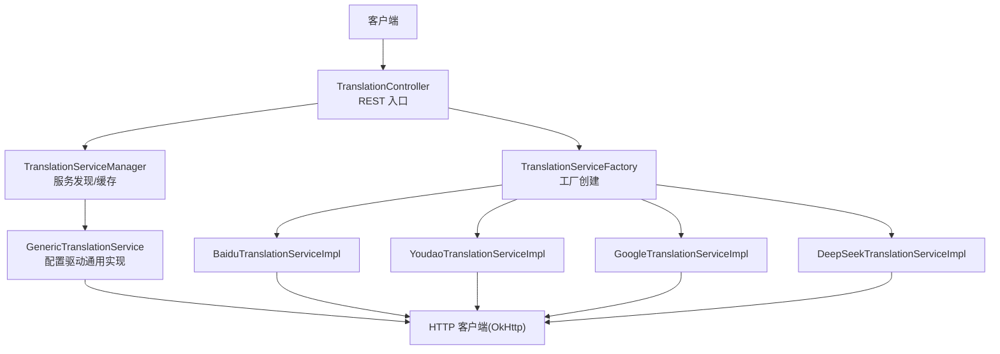
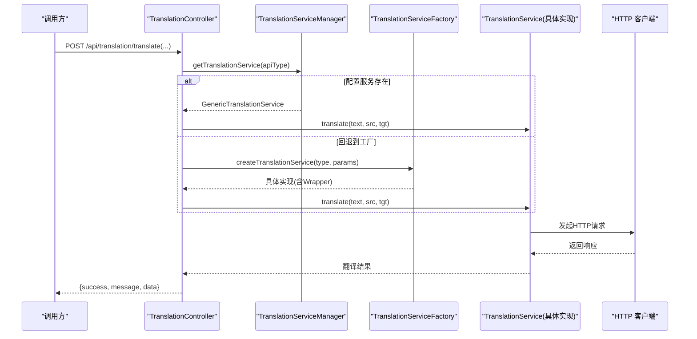
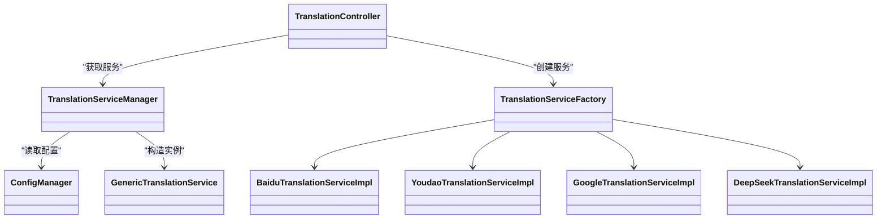

# 翻译服务API

<cite>
**本文引用的文件**
- [TranslationController.java](file://src/main/java/com/gamelist/controller/TranslationController.java)
- [TranslationService.java](file://src/main/java/com/gamelist/service/TranslationService.java)
- [TranslationServiceFactory.java](file://src/main/java/com/gamelist/service/impl/TranslationServiceFactory.java)
- [TranslationServiceManager.java](file://src/main/java/com/gamelist/service/impl/TranslationServiceManager.java)
- [GenericTranslationService.java](file://src/main/java/com/gamelist/service/impl/GenericTranslationService.java)
- [BaiduTranslationServiceImpl.java](file://src/main/java/com/gamelist/service/impl/BaiduTranslationServiceImpl.java)
- [YoudaoTranslationServiceImpl.java](file://src/main/java/com/gamelist/service/impl/YoudaoTranslationServiceImpl.java)
- [GoogleTranslationServiceImpl.java](file://src/main/java/com/gamelist/service/impl/GoogleTranslationServiceImpl.java)
- [DeepSeekTranslationServiceImpl.java](file://src/main/java/com/gamelist/service/impl/DeepSeekTranslationServiceImpl.java)
- [ConfigManager.java](file://src/main/java/com/gamelist/service/impl/ConfigManager.java)
- [translation-config.json](file://rules/translation-config.json)
- [RateLimitCounter.java](file://src/main/java/com/gamelist/util/RateLimitCounter.java)
- [LanguageDetector.java](file://src/main/java/com/gamelist/util/LanguageDetector.java)
</cite>

## 目录
1. [简介](#简介)
2. [项目结构](#项目结构)
3. [核心组件](#核心组件)
4. [架构总览](#架构总览)
5. [详细组件分析](#详细组件分析)
6. [依赖关系分析](#依赖关系分析)
7. [性能与限流](#性能与限流)
8. [故障排查指南](#故障排查指南)
9. [结论](#结论)
10. [附录：API 接口定义与示例](#附录api-接口定义与示例)

## 简介
本模块提供游戏列表的翻译能力，支持百度、有道、Google、DeepSeek 等翻译提供商。通过 RESTful API 暴露单条翻译、批量翻译、语言检测（辅助）等功能；同时提供工厂模式与配置驱动的扩展机制，便于新增第三方翻译服务。文档涵盖：
- 支持的翻译提供商及调用方式
- 批量翻译、单条翻译、语言检测等核心接口
- API 密钥配置、请求频率限制、错误处理机制
- 多语言文本翻译的请求示例与响应格式
- 翻译质量评估与本地化优化建议
- 工厂模式实现与扩展机制

## 项目结构
翻译服务由控制器、服务接口、具体实现、配置管理、工具类组成。关键路径如下：
- 控制器：/api/translation/*
- 服务接口与实现：service 包下 TranslationService 及其实现
- 配置：rules/translation-config.json 与 ConfigManager
- 工具：RateLimitCounter、LanguageDetector

图表来源
- [TranslationController.java:30-643](file://src/main/java/com/gamelist/controller/TranslationController.java#L30-L643)
- [TranslationServiceManager.java:11-110](file://src/main/java/com/gamelist/service/impl/TranslationServiceManager.java#L11-L110)
- [TranslationServiceFactory.java:5-46](file://src/main/java/com/gamelist/service/impl/TranslationServiceFactory.java#L5-L46)
- [GenericTranslationService.java:21-443](file://src/main/java/com/gamelist/service/impl/GenericTranslationService.java#L21-L443)
- [BaiduTranslationServiceImpl.java:14-100](file://src/main/java/com/gamelist/service/impl/BaiduTranslationServiceImpl.java#L14-L100)
- [YoudaoTranslationServiceImpl.java:13-94](file://src/main/java/com/gamelist/service/impl/YoudaoTranslationServiceImpl.java#L13-L94)
- [GoogleTranslationServiceImpl.java:10-59](file://src/main/java/com/gamelist/service/impl/GoogleTranslationServiceImpl.java#L10-L59)
- [DeepSeekTranslationServiceImpl.java:17-118](file://src/main/java/com/gamelist/service/impl/DeepSeekTranslationServiceImpl.java#L17-L118)

章节来源
- [TranslationController.java:30-643](file://src/main/java/com/gamelist/controller/TranslationController.java#L30-L643)
- [translation-config.json:1-149](file://rules/translation-config.json#L1-L149)

## 核心组件
- TranslationService：统一翻译接口，包含 translate 与 translateGame（默认分别调用 translate）。
- 具体实现：
  - GenericTranslationService：基于配置的通用实现，支持变量替换、URL 参数、请求体模板、响应路径解析、响应解析器。
  - BaiduTranslationServiceImpl：百度翻译，GET 签名请求。
  - YoudaoTranslationServiceImpl：有道翻译，POST FormBody 签名请求。
  - GoogleTranslationServiceImpl：Google 翻译，POST JSON。
  - DeepSeekTranslationServiceImpl：DeepSeek 对话模型，POST JSON。
- TranslationServiceManager：从配置加载并缓存服务实例，校验必需变量。
- TranslationServiceFactory：按类型创建具体实现，并包装为带通用错误处理的 Wrapper。
- ConfigManager：读取 rules/translation-config.json，维护 variables 与服务配置。
- RateLimitCounter：限流计数器（窗口内请求计数与暂停控制）。
- LanguageDetector：基础语言判断工具（如中文检测）。

章节来源
- [TranslationService.java:1-33](file://src/main/java/com/gamelist/service/TranslationService.java#L1-L33)
- [GenericTranslationService.java:21-443](file://src/main/java/com/gamelist/service/impl/GenericTranslationService.java#L21-L443)
- [BaiduTranslationServiceImpl.java:14-100](file://src/main/java/com/gamelist/service/impl/BaiduTranslationServiceImpl.java#L14-L100)
- [YoudaoTranslationServiceImpl.java:13-94](file://src/main/java/com/gamelist/service/impl/YoudaoTranslationServiceImpl.java#L13-L94)
- [GoogleTranslationServiceImpl.java:10-59](file://src/main/java/com/gamelist/service/impl/GoogleTranslationServiceImpl.java#L10-L59)
- [DeepSeekTranslationServiceImpl.java:17-118](file://src/main/java/com/gamelist/service/impl/DeepSeekTranslationServiceImpl.java#L17-L118)
- [TranslationServiceManager.java:11-110](file://src/main/java/com/gamelist/service/impl/TranslationServiceManager.java#L11-L110)
- [TranslationServiceFactory.java:5-46](file://src/main/java/com/gamelist/service/impl/TranslationServiceFactory.java#L5-L46)
- [ConfigManager.java:13-197](file://src/main/java/com/gamelist/service/impl/ConfigManager.java#L13-L197)
- [RateLimitCounter.java:1-138](file://src/main/java/com/gamelist/util/RateLimitCounter.java#L1-L138)
- [LanguageDetector.java:1-34](file://src/main/java/com/gamelist/util/LanguageDetector.java#L1-L34)

## 架构总览
系统采用“控制器 + 工厂/管理器 + 配置驱动”的分层架构：
- 控制器负责接收请求、参数校验、任务调度与进度跟踪。
- 管理器负责从配置中获取可用服务并缓存实例。
- 工厂负责按类型创建具体实现，并进行统一封装。
- 通用服务根据配置动态构建请求与解析响应，降低对特定供应商的耦合。

图表来源
- [TranslationController.java:84-235](file://src/main/java/com/gamelist/controller/TranslationController.java#L84-L235)
- [TranslationServiceManager.java:28-41](file://src/main/java/com/gamelist/service/impl/TranslationServiceManager.java#L28-L41)
- [TranslationServiceFactory.java:6-44](file://src/main/java/com/gamelist/service/impl/TranslationServiceFactory.java#L6-L44)
- [GenericTranslationService.java:203-244](file://src/main/java/com/gamelist/service/impl/GenericTranslationService.java#L203-L244)

## 详细组件分析

### 控制器：TranslationController
- 路由前缀：/api/translation
- 主要接口：
  - GET /platforms：获取平台列表
  - GET /services：获取有效翻译服务列表（基于配置校验）
  - POST /translate：按平台批量翻译（异步任务，返回 taskId）
  - POST /translate/game：单条游戏翻译
  - POST /translate/games：指定游戏ID集合批量翻译（异步任务）
  - GET /progress/{taskId}：查询翻译进度与错误
  - POST /create-error-subset/{taskId}：将失败条目分离为新平台
- 错误处理：捕获 TranslationException 与通用异常，记录错误信息并返回 success=false。
- 任务进度：使用内存 Map 存储进度与错误，结合后台任务服务更新进度。

章节来源
- [TranslationController.java:56-643](file://src/main/java/com/gamelist/controller/TranslationController.java#L56-L643)

### 服务接口与实现
- TranslationService：定义 translate 与 translateGame（默认分别调用 translate）。
- GenericTranslationService：
  - 支持变量替换：${var}、{text}、{sourceLang}、{targetLang}、{gameName}、{gameDescription}
  - 支持 URL 参数拼接、请求体模板、响应路径提取、响应解析器（如 microsoftGameNameDescription、gameNameDescription）
  - 超时设置：连接/读写/写超时
- 各提供商实现：
  - Baidu：GET 请求，MD5 签名，错误码检查
  - Youdao：POST FormBody，SHA-256 签名，errorCode 检查
  - Google：POST JSON，key 作为查询参数
  - DeepSeek：POST JSON，Bearer Token，messages 数组，temperature/max_tokens 控制

章节来源
- [TranslationService.java:1-33](file://src/main/java/com/gamelist/service/TranslationService.java#L1-L33)
- [GenericTranslationService.java:21-443](file://src/main/java/com/gamelist/service/impl/GenericTranslationService.java#L21-L443)
- [BaiduTranslationServiceImpl.java:14-100](file://src/main/java/com/gamelist/service/impl/BaiduTranslationServiceImpl.java#L14-L100)
- [YoudaoTranslationServiceImpl.java:13-94](file://src/main/java/com/gamelist/service/impl/YoudaoTranslationServiceImpl.java#L13-L94)
- [GoogleTranslationServiceImpl.java:10-59](file://src/main/java/com/gamelist/service/impl/GoogleTranslationServiceImpl.java#L10-L59)
- [DeepSeekTranslationServiceImpl.java:17-118](file://src/main/java/com/gamelist/service/impl/DeepSeekTranslationServiceImpl.java#L17-L118)

### 配置管理与服务发现
- ConfigManager：
  - 读取 rules/translation-config.json
  - 维护 variables（如 google_api_key、microsoft_api_key、deepseek_api_key）
  - 提供 getServiceConfig、getDefaultService、reloadConfig
- TranslationServiceManager：
  - 根据 serviceId 获取服务配置并构造 GenericTranslationService
  - 校验 requiredVariables，返回有效服务列表
  - 支持 reloadServices 刷新配置与缓存

章节来源
- [ConfigManager.java:13-197](file://src/main/java/com/gamelist/service/impl/ConfigManager.java#L13-L197)
- [TranslationServiceManager.java:11-110](file://src/main/java/com/gamelist/service/impl/TranslationServiceManager.java#L11-L110)
- [translation-config.json:1-149](file://rules/translation-config.json#L1-L149)

### 工厂模式与扩展机制
- TranslationServiceFactory：
  - 根据 serviceType 创建对应实现（google/baidu/youdao/deepseek）
  - 参数校验（如 apiKey/appId/appSecret）
  - 返回包装后的服务（添加通用错误处理）
- 扩展新提供商：
  - 在 translation-config.json 中添加服务配置（url、method、headers、requestBody、responsePath、validation）
  - 或在工厂中添加新的 case 分支（如需专用实现）
  - 通过 Manager 自动发现与缓存

章节来源
- [TranslationServiceFactory.java:5-46](file://src/main/java/com/gamelist/service/impl/TranslationServiceFactory.java#L5-L46)
- [translation-config.json:1-149](file://rules/translation-config.json#L1-L149)

## 依赖关系分析
- 控制器依赖 ServiceManager/Factory 以选择具体翻译服务。
- 通用服务依赖 OkHttp 进行 HTTP 通信，依赖 Jackson 解析 JSON。
- 各提供商实现均依赖 OkHttp 与 JSON 库。
- 配置管理依赖 PathUtil 定位配置文件路径。

图表来源
- [TranslationController.java:30-643](file://src/main/java/com/gamelist/controller/TranslationController.java#L30-L643)
- [TranslationServiceManager.java:11-110](file://src/main/java/com/gamelist/service/impl/TranslationServiceManager.java#L11-L110)
- [TranslationServiceFactory.java:5-46](file://src/main/java/com/gamelist/service/impl/TranslationServiceFactory.java#L5-L46)
- [GenericTranslationService.java:21-443](file://src/main/java/com/gamelist/service/impl/GenericTranslationService.java#L21-L443)
- [ConfigManager.java:13-197](file://src/main/java/com/gamelist/service/impl/ConfigManager.java#L13-L197)

## 性能与限流
- 并发与异步：批量翻译在控制器中使用线程执行，避免阻塞请求线程；通过后台任务服务更新进度。
- 连接池与超时：通用服务使用 OkHttpClient 并设置连接/读/写超时，提升稳定性。
- 限流：RateLimitCounter 提供滑动窗口限流（可配置阈值与暂停时长），防止高频访问触发第三方限制。
- 建议：
  - 在高并发场景下，结合外部队列或线程池管理翻译任务。
  - 针对第三方服务的速率限制，可在控制器或服务层集成 RateLimitCounter。
  - 合理设置 timeout，避免长尾请求占用资源。

章节来源
- [TranslationController.java:139-221](file://src/main/java/com/gamelist/controller/TranslationController.java#L139-L221)
- [GenericTranslationService.java:196-201](file://src/main/java/com/gamelist/service/impl/GenericTranslationService.java#L196-L201)
- [RateLimitCounter.java:1-138](file://src/main/java/com/gamelist/util/RateLimitCounter.java#L1-L138)

## 故障排查指南
- 常见错误：
  - 网络错误：IOException，通常由网络不可达或超时引起。
  - 认证失败：apiKey/appId/appSecret 为空或不正确。
  - 第三方 API 错误：error_code/errorCode 非零，或 HTTP 状态码非 2xx。
- 排查步骤：
  - 检查 translation-config.json 中的 variables 是否已配置。
  - 查看控制器日志与通用服务的调试输出（URL、方法、请求体、响应体）。
  - 使用 /api/translation/services 验证服务有效性。
  - 使用 /api/translation/progress/{taskId} 获取任务进度与错误详情。
- 错误分类：
  - 翻译错误：TranslationException，包含第三方错误信息。
  - 更新错误：数据库或业务逻辑异常，记录错误条目。

章节来源
- [TranslationController.java:177-196](file://src/main/java/com/gamelist/controller/TranslationController.java#L177-L196)
- [GenericTranslationService.java:229-243](file://src/main/java/com/gamelist/service/impl/GenericTranslationService.java#L229-L243)
- [BaiduTranslationServiceImpl.java:67-86](file://src/main/java/com/gamelist/service/impl/BaiduTranslationServiceImpl.java#L67-L86)
- [YoudaoTranslationServiceImpl.java:55-73](file://src/main/java/com/gamelist/service/impl/YoudaoTranslationServiceImpl.java#L55-L73)
- [GoogleTranslationServiceImpl.java:43-56](file://src/main/java/com/gamelist/service/impl/GoogleTranslationServiceImpl.java#L43-L56)
- [DeepSeekTranslationServiceImpl.java:72-92](file://src/main/java/com/gamelist/service/impl/DeepSeekTranslationServiceImpl.java#L72-L92)

## 结论
本翻译服务模块通过统一的接口与配置驱动的方式，灵活支持多家翻译提供商，并提供批量与单条翻译能力。工厂模式与管理器简化了服务选择与扩展，配合限流与错误处理机制，提升了系统的稳定性与可维护性。建议在大规模使用时结合队列与监控，进一步优化性能与可观测性。

## 附录：API 接口定义与示例

### 接口总览
- 基础路径：/api/translation
- 方法：
  - GET /platforms
  - GET /services
  - POST /translate
  - POST /translate/game
  - POST /translate/games
  - GET /progress/{taskId}
  - POST /create-error-subset/{taskId}

### 接口详情

#### GET /platforms
- 功能：获取所有平台列表
- 响应：平台对象数组

章节来源
- [TranslationController.java:56-62](file://src/main/java/com/gamelist/controller/TranslationController.java#L56-L62)

#### GET /services
- 功能：获取有效的翻译服务列表（基于配置校验）
- 响应：
  - success: boolean
  - services: 服务信息数组（id, name, valid）

章节来源
- [TranslationController.java:64-79](file://src/main/java/com/gamelist/controller/TranslationController.java#L64-L79)
- [TranslationServiceManager.java:43-62](file://src/main/java/com/gamelist/service/impl/TranslationServiceManager.java#L43-L62)

#### POST /translate
- 功能：按平台批量翻译（异步）
- 参数：
  - platformId: Long
  - apiType: String（google/baidu/youdao/deepseek）
  - sourceLang: String
  - targetLang: String
  - translateType: String（name/desc/both）
  - apiKey: String
  - appId: String（可选）
  - appSecret: String（可选）
- 响应：
  - success: boolean
  - taskId: String
  - message: String
  - totalGames: int

章节来源
- [TranslationController.java:81-235](file://src/main/java/com/gamelist/controller/TranslationController.java#L81-L235)

#### POST /translate/game
- 功能：单条游戏翻译
- 参数：
  - gameId: Long
  - apiType: String
  - sourceLang: String
  - targetLang: String
  - translateType: String（name/desc/both）
  - apiKey: String
  - appId: String（可选）
  - appSecret: String（可选）
- 响应：
  - success: boolean
  - message: String
  - game: 游戏对象（包含翻译字段）

章节来源
- [TranslationController.java:237-302](file://src/main/java/com/gamelist/controller/TranslationController.java#L237-L302)

#### POST /translate/games
- 功能：指定游戏ID集合批量翻译（异步）
- 请求体：
  - gameIds: List<Long> 或 "id1,id2"
  - apiType: String
  - sourceLang: String
  - targetLang: String
  - translateType: String（name/desc/both）
  - apiKey: String
  - appId: String（可选）
  - appSecret: String（可选）
- 响应：
  - success: boolean
  - taskId: String
  - message: String
  - totalGames: int

章节来源
- [TranslationController.java:304-480](file://src/main/java/com/gamelist/controller/TranslationController.java#L304-L480)

#### GET /progress/{taskId}
- 功能：查询翻译进度与错误
- 路径参数：taskId: String
- 响应：
  - success: boolean
  - progress: 进度对象（total, completed, success, failed, status, errors）

章节来源
- [TranslationController.java:502-529](file://src/main/java/com/gamelist/controller/TranslationController.java#L502-L529)

#### POST /create-error-subset/{taskId}
- 功能：将失败条目分离为新平台
- 路径参数：taskId: String
- 响应：
  - success: boolean
  - platformName: String
  - platformId: Long
  - errorCount: int
  - message: String

章节来源
- [TranslationController.java:531-616](file://src/main/java/com/gamelist/controller/TranslationController.java#L531-L616)

### 配置与密钥
- 配置文件：rules/translation-config.json
- 变量：
  - google_api_key
  - microsoft_api_key
  - microsoft_region
  - deepseek_api_key
- 服务配置项：
  - id/name/type/url/method/headers/requestBody/responsePath/validation
- 默认服务：deepseek

章节来源
- [translation-config.json:1-149](file://rules/translation-config.json#L1-L149)
- [ConfigManager.java:154-197](file://src/main/java/com/gamelist/service/impl/ConfigManager.java#L154-L197)

### 请求示例与响应格式

#### 单条翻译（Google）
- 请求：
  - POST /api/translation/translate/game
  - 参数：gameId=123, apiType=google, sourceLang=en, targetLang=zh-CN, translateType=name, apiKey=YOUR_KEY
- 响应：
  - {success: true, message: "游戏翻译成功", game: {...}}

章节来源
- [TranslationController.java:237-302](file://src/main/java/com/gamelist/controller/TranslationController.java#L237-L302)
- [GoogleTranslationServiceImpl.java:19-56](file://src/main/java/com/gamelist/service/impl/GoogleTranslationServiceImpl.java#L19-L56)

#### 批量翻译（DeepSeek）
- 请求：
  - POST /api/translation/translate/games
  - 请求体：
    - gameIds: [1, 2, 3]
    - apiType: deepseek
    - sourceLang: en
    - targetLang: zh-CN
    - translateType: both
    - apiKey: YOUR_KEY
- 响应：
  - {success: true, taskId: "task_xxx", message: "翻译任务已启动", totalGames: 3}

章节来源
- [TranslationController.java:304-480](file://src/main/java/com/gamelist/controller/TranslationController.java#L304-L480)
- [DeepSeekTranslationServiceImpl.java:26-92](file://src/main/java/com/gamelist/service/impl/DeepSeekTranslationServiceImpl.java#L26-L92)

#### 进度查询
- 请求：
  - GET /api/translation/progress/task_xxx
- 响应：
  - {success: true, progress: {total: 3, completed: 1, success: 1, failed: 0, status: "processing"}}

章节来源
- [TranslationController.java:502-529](file://src/main/java/com/gamelist/controller/TranslationController.java#L502-L529)

### 语言检测
- 工具：LanguageDetector.containsChinese
- 用途：辅助判断文本是否包含中文，可用于预处理或策略选择。

章节来源
- [LanguageDetector.java:1-34](file://src/main/java/com/gamelist/util/LanguageDetector.java#L1-L34)

### 翻译质量评估与本地化优化建议
- 质量评估：
  - 观察第三方返回的错误码与消息，结合进度中的错误列表进行分析。
  - 对于 DeepSeek，可通过调整 temperature 与 max_tokens 控制输出风格与长度。
- 本地化优化：
  - 在游戏名称翻译中保留术语与风格（如 RPG、FPS 等）。
  - 描述翻译时保持语句流畅自然，避免过度直译。
  - 使用 responseParser 定制解析逻辑，确保字段准确映射。

章节来源
- [translation-config.json:85-145](file://rules/translation-config.json#L85-L145)
- [GenericTranslationService.java:381-416](file://src/main/java/com/gamelist/service/impl/GenericTranslationService.java#L381-L416)

### 工厂模式与扩展机制
- 工厂创建：
  - 根据 serviceType 创建具体实现，并进行参数校验。
  - 返回包装后的服务，统一错误处理。
- 扩展新提供商：
  - 在 translation-config.json 中添加服务配置。
  - 或在工厂中添加新的 case 分支（如需专用实现）。
  - 通过 Manager 自动发现与缓存。

章节来源
- [TranslationServiceFactory.java:5-46](file://src/main/java/com/gamelist/service/impl/TranslationServiceFactory.java#L5-L46)
- [TranslationServiceManager.java:28-41](file://src/main/java/com/gamelist/service/impl/TranslationServiceManager.java#L28-L41)
- [translation-config.json:1-149](file://rules/translation-config.json#L1-L149)