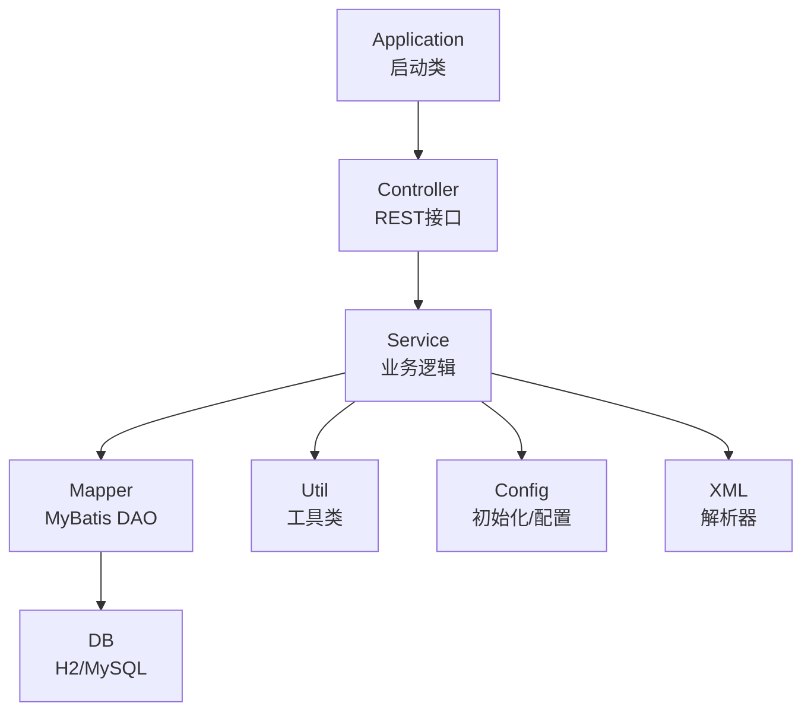
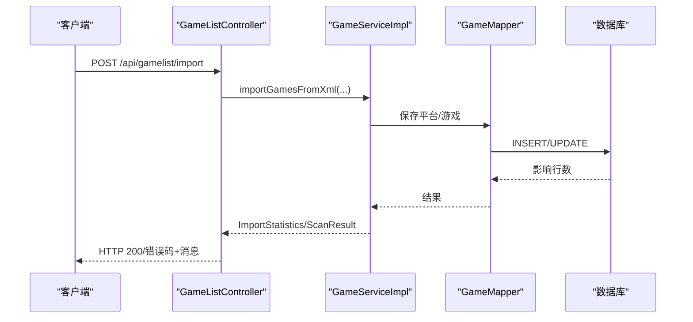
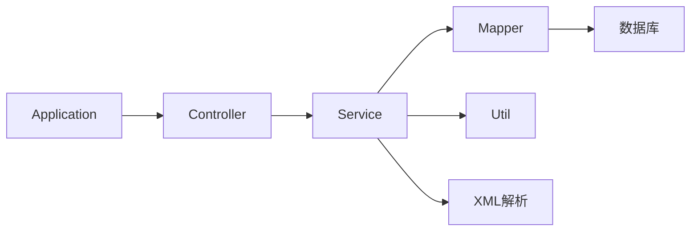

# 代码规范

<cite>
**本文引用的文件**
- [Application.java](file://src/main/java/com/gamelist/Application.java)
- [GameListController.java](file://src/main/java/com/gamelist/controller/GameListController.java)
- [GameService.java](file://src/main/java/com/gamelist/service/GameService.java)
- [GameServiceImpl.java](file://src/main/java/com/gamelist/service/impl/GameServiceImpl.java)
- [Game.java](file://src/main/java/com/gamelist/model/Game.java)
- [DatabaseInitializer.java](file://src/main/java/com/gamelist/config/DatabaseInitializer.java)
- [ErrorLogWriter.java](file://src/main/java/com/gamelist/util/ErrorLogWriter.java)
- [TranslationException.java](file://src/main/java/com/gamelist/service/TranslationException.java)
- [init.sql](file://src/main/resources/sql/init.sql)
- [schema.sql](file://src/main/resources/schema.sql)
- [pom.xml](file://pom.xml)
</cite>

## 目录
1. [简介](#简介)
2. [项目结构](#项目结构)
3. [核心组件](#核心组件)
4. [架构总览](#架构总览)
5. [详细组件分析](#详细组件分析)
6. [依赖分析](#依赖分析)
7. [性能考虑](#性能考虑)
8. [故障排查指南](#故障排查指南)
9. [结论](#结论)
10. [附录](#附录)

## 简介
本规范面向WebGameListOper项目的Java后端开发，统一命名约定、注释规范、格式化标准、异常处理与日志记录、SQL编写约定，并提供代码审查检查清单与质量标准。目标是提升代码一致性、可维护性与可观测性，降低协作成本与缺陷率。

## 项目结构
项目采用Spring Boot + MyBatis的分层架构：
- 入口与装配：Application
- 控制器层：controller（REST API）
- 服务层：service（接口与实现）
- 数据访问层：mapper（MyBatis映射）
- 模型层：model（领域对象）
- 配置与初始化：config（数据库、Flyway、异步等）
- 工具与扩展：util（错误日志、路径、解析器等）
- XML解析：xml（XML/元数据解析）
- 资源与脚本：resources（SQL迁移、静态资源、规则模板）

图表来源
- [Application.java:8-14](file://src/main/java/com/gamelist/Application.java#L8-L14)
- [GameListController.java:39-49](file://src/main/java/com/gamelist/controller/GameListController.java#L39-L49)
- [GameService.java:13-61](file://src/main/java/com/gamelist/service/GameService.java#L13-L61)
- [GameServiceImpl.java:46-70](file://src/main/java/com/gamelist/service/impl/GameServiceImpl.java#L46-L70)
- [DatabaseInitializer.java:23-52](file://src/main/java/com/gamelist/config/DatabaseInitializer.java#L23-L52)

章节来源
- [Application.java:8-14](file://src/main/java/com/gamelist/Application.java#L8-L14)
- [pom.xml:18-21](file://pom.xml#L18-L21)

## 核心组件
- 控制器层：提供游戏列表、平台、扫描、导入导出、统计等REST接口，统一参数校验与异常返回。
- 服务层：封装导入/扫描/合并/批量操作等业务逻辑，协调Mapper、外部系统与工具类。
- 数据模型：Game、Platform等实体承载业务数据，字段与表结构一致。
- 配置与初始化：数据库初始化、Flyway迁移、异步任务启用、数据目录准备。
- 工具类：错误日志写入、语言检测、媒体文件查找、变量替换等。

章节来源
- [GameListController.java:39-551](file://src/main/java/com/gamelist/controller/GameListController.java#L39-L551)
- [GameService.java:13-61](file://src/main/java/com/gamelist/service/GameService.java#L13-L61)
- [GameServiceImpl.java:46-200](file://src/main/java/com/gamelist/service/impl/GameServiceImpl.java#L46-L200)
- [Game.java:5-650](file://src/main/java/com/gamelist/model/Game.java#L5-L650)
- [DatabaseInitializer.java:23-132](file://src/main/java/com/gamelist/config/DatabaseInitializer.java#L23-L132)
- [ErrorLogWriter.java:13-189](file://src/main/java/com/gamelist/util/ErrorLogWriter.java#L13-L189)

## 架构总览
请求从Controller进入，调用Service完成业务处理，必要时通过Mapper访问数据库；复杂流程使用工具类或外部API；异常统一捕获并返回结构化响应；关键路径记录日志以便追踪。

图表来源
- [GameListController.java:54-74](file://src/main/java/com/gamelist/controller/GameListController.java#L54-L74)
- [GameServiceImpl.java:116-200](file://src/main/java/com/gamelist/service/impl/GameServiceImpl.java#L116-L200)

## 详细组件分析

### 命名约定
- 包名：全小写，按功能分层，如 com.gamelist.controller、com.gamelist.service.impl、com.gamelist.model、com.gamelist.util、com.gamelist.config、com.gamelist.xml。
- 类名：大驼峰，名词或动名词，体现职责，如 GameListController、GameServiceImpl、DatabaseInitializer、ErrorLogWriter。
- 方法名：小驼峰，动词开头，表达行为，如 getAllGames、importGamesFromXml、scanAndImportGames、writeImportErrorLog。
- 变量名：小驼峰，语义清晰，避免缩写，如 platformId、gameIds、templateFiles。
- 常量名：全大写加下划线，位于类顶部或常量类中，如 INIT_SQL_PATH、LOG_DIR、DATE_FORMATTER。
- 枚举/类型：大驼峰，如 PlatformType、FileType。
- 字段与数据库列：遵循下划线分隔的列名（如 game_id、platform_path），Java侧使用小驼峰属性（如 gameId、platformPath）。

章节来源
- [GameListController.java:39-49](file://src/main/java/com/gamelist/controller/GameListController.java#L39-L49)
- [GameServiceImpl.java:46-70](file://src/main/java/com/gamelist/service/impl/GameServiceImpl.java#L46-L70)
- [DatabaseInitializer.java:23-33](file://src/main/java/com/gamelist/config/DatabaseInitializer.java#L23-L33)
- [ErrorLogWriter.java:13-22](file://src/main/java/com/gamelist/util/ErrorLogWriter.java#L13-L22)
- [init.sql:2-90](file://src/main/resources/sql/init.sql#L2-L90)

### 注释规范
- 类注释：说明类的职责、主要用法与注意事项，置于类上方。
- 方法注释：对公共方法使用Javadoc风格，描述参数、返回值、异常与业务约束。
- 复杂逻辑注释：在关键分支、循环、转换逻辑前添加行内注释，解释“为什么”而非“是什么”。
- 示例参考：
  - 类级注释：ErrorLogWriter 描述了错误日志写入用途与输出格式。
  - 方法级注释：DatabaseInitializer.run() 说明了初始化流程与异常处理。
  - 行内注释：GameServiceImpl 中导入流程的关键步骤均有信息性日志与注释辅助理解。

章节来源
- [ErrorLogWriter.java:13-33](file://src/main/java/com/gamelist/util/ErrorLogWriter.java#L13-L33)
- [DatabaseInitializer.java:23-52](file://src/main/java/com/gamelist/config/DatabaseInitializer.java#L23-L52)
- [GameServiceImpl.java:116-200](file://src/main/java/com/gamelist/service/impl/GameServiceImpl.java#L116-L200)

### 格式化标准
- 缩进：使用4空格缩进，禁止Tab。
- 换行：单行不超过120字符；方法签名过长时合理换行对齐。
- 空行：方法之间空一行；逻辑块前后适当空行增强可读性。
- 花括号：K&R风格，左括号不换行，右括号独占一行。
- 导入：按包分组排序，去除未使用导入。
- 字符串与编码：统一UTF-8，避免硬编码路径，使用常量或配置。
- 日志：使用占位符{}，避免字符串拼接；敏感信息脱敏。

章节来源
- [GameListController.java:54-74](file://src/main/java/com/gamelist/controller/GameListController.java#L54-L74)
- [DatabaseInitializer.java:68-102](file://src/main/java/com/gamelist/config/DatabaseInitializer.java#L68-L102)
- [ErrorLogWriter.java:42-103](file://src/main/java/com/gamelist/util/ErrorLogWriter.java#L42-L103)

### 异常处理规范
- 异常类型选择：
  - 业务异常：自定义受检异常（如 TranslationException），用于明确业务失败场景。
  - 运行时异常：用于编程错误或不可恢复状态（如 null 输入、非法参数）。
  - 第三方异常：包装为业务异常或统一错误响应。
- 错误信息格式：
  - 控制器层：返回HTTP状态码与结构化JSON（包含success、error/message、count等）。
  - 服务层：抛出带上下文的异常，附带关键上下文（如ID、路径、平台名）。
  - 日志：记录错误级别日志，包含必要上下文与堆栈。
- 日志记录标准：
  - 使用SLF4J Logger，info/warn/error/debug分级。
  - 关键流程：开始/结束、成功/失败、耗时、计数。
  - 安全：不记录敏感信息（密钥、密码、完整路径中的用户名等）。
- 示例参考：
  - Controller层统一try-catch，返回错误响应。
  - Service层记录详细日志并抛出自定义异常。
  - 工具类ErrorLogWriter将导入/导出问题写入独立日志文件。

章节来源
- [GameListController.java:54-74](file://src/main/java/com/gamelist/controller/GameListController.java#L54-L74)
- [GameListController.java:128-160](file://src/main/java/com/gamelist/controller/GameListController.java#L128-L160)
- [GameServiceImpl.java:116-200](file://src/main/java/com/gamelist/service/impl/GameServiceImpl.java#L116-L200)
- [TranslationException.java:1-12](file://src/main/java/com/gamelist/service/TranslationException.java#L1-L12)
- [ErrorLogWriter.java:13-189](file://src/main/java/com/gamelist/util/ErrorLogWriter.java#L13-L189)

### SQL编写规范
- 表名：全小写下划线分隔，复数形式（如 game、platform、temp_subset_game）。
- 字段名：全小写下划线分隔，语义清晰（如 game_id、platform_path、created_at）。
- 主键：id BIGINT AUTO_INCREMENT PRIMARY KEY。
- 外键：显式声明FOREIGN KEY，保证引用完整性。
- 索引：为高频查询字段建立索引（如 platform_id、game_id、status）。
- 默认值：时间戳使用CURRENT_TIMESTAMP，布尔字段设置默认值。
- 迁移：使用Flyway版本化脚本（V1.0.x__description.sql），增量变更，幂等设计。
- 注释：DDL中使用--注释说明变更原因。
- 示例参考：
  - init.sql定义了平台、游戏、系统设置、临时子集、合并报告、刮削系统、后台任务、媒体下载任务等表结构。
  - schema.sql进行增量ALTER TABLE添加新字段。

章节来源
- [init.sql:2-305](file://src/main/resources/sql/init.sql#L2-L305)
- [schema.sql:1-29](file://src/main/resources/schema.sql#L1-L29)

### 代码审查检查清单
- 命名与结构
  - 包/类/方法/变量/常量命名是否符合规范？
  - 分层职责是否清晰，是否存在跨层调用？
- 注释与文档
  - 公共API是否有Javadoc？
  - 复杂逻辑是否有行内注释？
- 异常与日志
  - 是否统一捕获异常并返回结构化响应？
  - 日志是否分级合理，是否包含必要上下文？
  - 是否避免记录敏感信息？
- 数据与SQL
  - 表/字段命名是否一致？
  - 是否使用Flyway管理迁移？
  - 是否对关键查询建立索引？
- 安全与健壮性
  - 输入参数是否校验？
  - 是否处理空指针与边界条件？
  - 是否避免SQL注入（使用预编译/ORM）？
- 性能
  - 是否避免N+1查询？
  - 是否合理使用分页与批处理？
  - 是否避免阻塞IO在主线程？
- 测试与可维护性
  - 是否覆盖关键路径单元测试？
  - 是否拆分过大类/方法？
  - 是否移除死代码与冗余日志？

### 质量标准
- 代码覆盖率：核心服务方法覆盖率≥80%。
- 重复度：重复代码率≤5%。
- 复杂度：圈复杂度≤10，方法长度≤100行。
- 缺陷密度：每千行代码缺陷数≤0.5。
- 构建与依赖：无高危漏洞依赖，构建稳定。

## 依赖分析
项目依赖Spring Boot Web、MyBatis、H2/MySQL、Flyway、OkHttp、JSON库等。启动类启用异步与Mapper扫描，服务层通过Autowired注入Mapper与Service，工具类提供通用能力。

图表来源
- [Application.java:8-14](file://src/main/java/com/gamelist/Application.java#L8-L14)
- [GameListController.java:39-49](file://src/main/java/com/gamelist/controller/GameListController.java#L39-L49)
- [GameServiceImpl.java:46-70](file://src/main/java/com/gamelist/service/impl/GameServiceImpl.java#L46-L70)

章节来源
- [pom.xml:23-106](file://pom.xml#L23-L106)
- [Application.java:8-14](file://src/main/java/com/gamelist/Application.java#L8-L14)

## 性能考虑
- 分页与过滤：Controller层对列表接口支持分页参数，减少数据传输。
- 批处理：Service层提供批量更新/删除，降低数据库往返次数。
- 异步任务：启用@Async，后台任务与媒体下载异步执行。
- I/O优化：文件读取使用BufferedReader/BufferedWriter，避免频繁磁盘I/O。
- 日志级别：生产环境关闭debug，减少日志开销。
- 数据库：合理使用索引与事务，避免长事务与锁竞争。

[本节为通用指导，无需具体文件来源]

## 故障排查指南
- 导入失败
  - 查看Controller层catch块返回的错误信息与日志。
  - 检查ErrorLogWriter生成的错误日志文件，定位跳过/失败的游戏。
- 数据库初始化失败
  - 检查DatabaseInitializer日志，确认脚本路径与权限。
  - 查看Flyway迁移历史，修复失败的迁移。
- XML解析异常
  - 检查GameListParser日志，定位错误行号与内容。
  - 验证XML编码与结构是否符合预期。
- 网络请求失败
  - 检查OkHttp调用日志与重试策略。
  - 确认API Key与网络连通性。

章节来源
- [GameListController.java:54-74](file://src/main/java/com/gamelist/controller/GameListController.java#L54-L74)
- [ErrorLogWriter.java:13-189](file://src/main/java/com/gamelist/util/ErrorLogWriter.java#L13-L189)
- [DatabaseInitializer.java:35-102](file://src/main/java/com/gamelist/config/DatabaseInitializer.java#L35-L102)

## 结论
本规范基于现有代码实践总结，统一了命名、注释、格式化、异常与SQL约定，提供了审查清单与质量标准。建议团队在新增功能时严格遵循，定期回顾与迭代规范，确保代码质量与团队协作效率持续提升。

## 附录
- 常用日志级别
  - info：业务流程关键节点
  - warn：潜在风险与可恢复异常
  - error：严重错误与不可恢复异常
  - debug：调试信息，生产环境谨慎开启
- 错误响应结构
  - success: boolean
  - message/error: string
  - count/data: 业务数据
- 迁移脚本命名
  - V{version}__description.sql，如 V1.0.3__baseline_migration.sql

[本节为补充说明，无需具体文件来源]