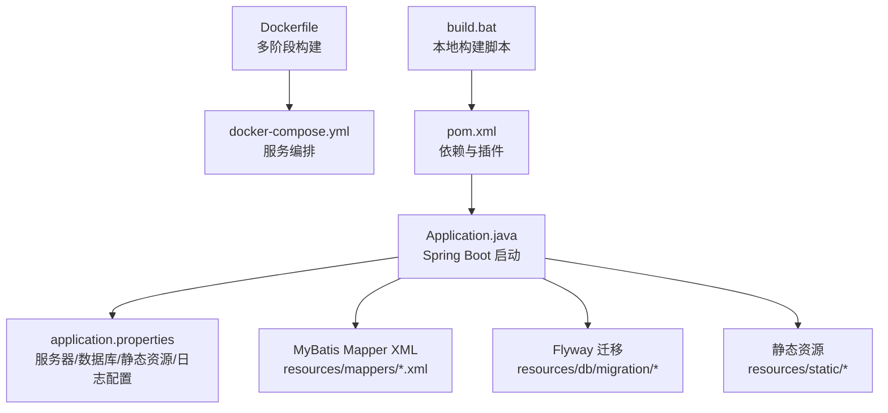
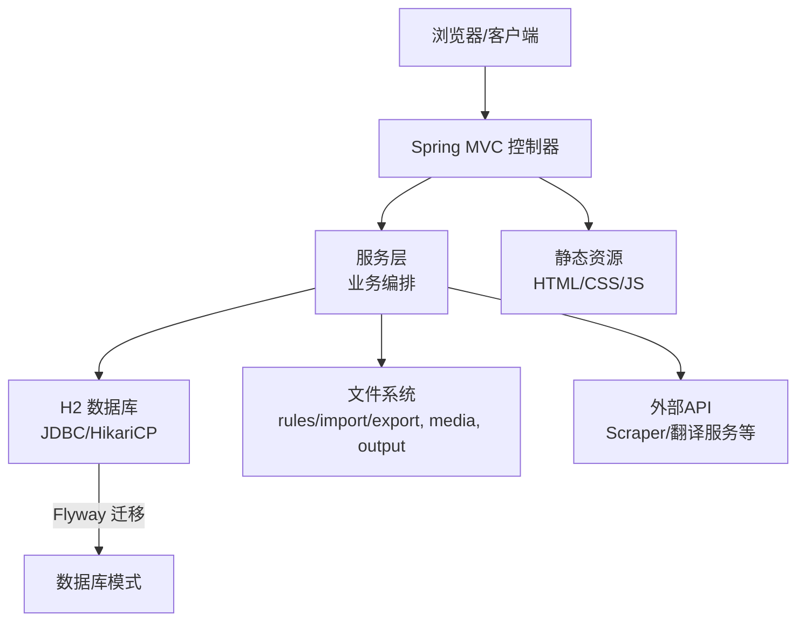
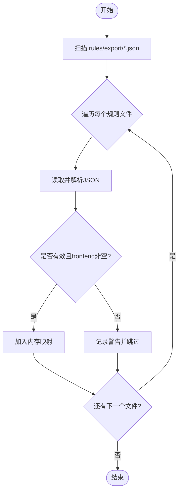
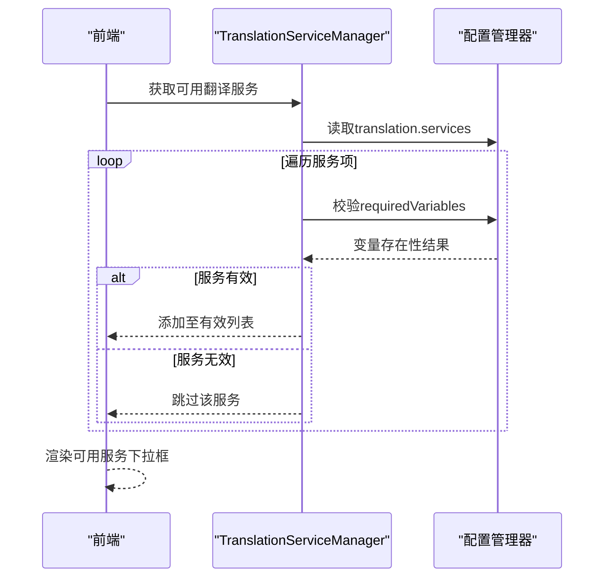
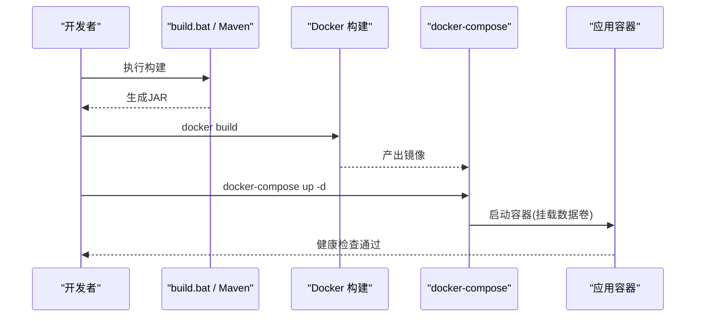
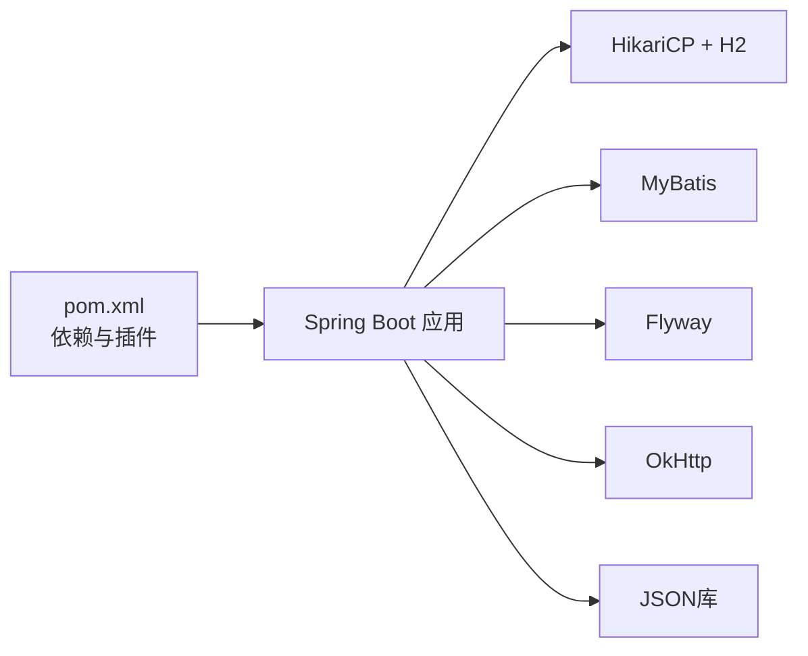

# 开发工作流程

<cite>
**本文引用的文件**
- [pom.xml](file://pom.xml)
- [Application.java](file://src/main/java/com/gamelist/Application.java)
- [application.properties](file://src/main/resources/application.properties)
- [Dockerfile](file://Dockerfile)
- [docker-compose.yml](file://docker-compose.yml)
- [build.bat](file://build.bat)
- [.gitignore](file://.gitignore)
- [README.md](file://README.md)
- [ExportRuleServiceImpl.java](file://src/main/java/com/gamelist/service/impl/ExportRuleServiceImpl.java)
- [TranslationServiceManager.java](file://src/main/java/com/gamelist/service/impl/TranslationServiceManager.java)
</cite>

## 目录
1. [简介](#简介)
2. [项目结构](#项目结构)
3. [核心组件](#核心组件)
4. [架构总览](#架构总览)
5. [详细组件分析](#详细组件分析)
6. [依赖分析](#依赖分析)
7. [性能考虑](#性能考虑)
8. [故障排查指南](#故障排查指南)
9. [结论](#结论)
10. [附录](#附录)

## 简介
本指南面向WebGameListOper项目的开发者，提供从需求到发布的全流程工作规范。内容涵盖：新功能开发流程、Git分支管理策略、代码提交与审查规范、构建与部署自动化、版本发布与变更日志维护、代码质量检查与持续集成配置建议。目标是让团队在统一规范下高效协作，保证交付质量与可维护性。

## 项目结构
- 技术栈与入口
  - Spring Boot 3.2.x + Java 17，主启动类为 Application.java，使用 MyBatis 进行数据访问，H2 作为默认数据库，Flyway 用于数据库迁移（已禁用自动执行，采用基线方式）。
  - 静态资源位于 resources/static，前端页面通过 Spring MVC 暴露。
- 关键配置
  - application.properties 定义了端口、编码、静态资源路径、H2 数据库连接、HikariCP 连接池、MyBatis Mapper 位置、日志输出等。
  - Docker 多阶段构建镜像，entrypoint 脚本启动应用；docker-compose 定义服务、卷挂载与健康检查。
- 构建与打包
  - Maven 插件负责 repackage 生成可执行 JAR；Windows 环境提供 build.bat 一键构建。
- 忽略规则
  - .gitignore 排除编译产物、日志、数据库文件、data/logs/backup 等运行时数据。

图表来源
- [Application.java:8-14](file://src/main/java/com/gamelist/Application.java#L8-L14)
- [application.properties:1-86](file://src/main/resources/application.properties#L1-L86)
- [pom.xml:108-150](file://pom.xml#L108-L150)
- [Dockerfile:1-55](file://Dockerfile#L1-L55)
- [docker-compose.yml:1-33](file://docker-compose.yml#L1-L33)

章节来源
- [pom.xml:1-152](file://pom.xml#L1-L152)
- [Application.java:1-16](file://src/main/java/com/gamelist/Application.java#L1-L16)
- [application.properties:1-86](file://src/main/resources/application.properties#L1-L86)
- [Dockerfile:1-55](file://Dockerfile#L1-L55)
- [docker-compose.yml:1-33](file://docker-compose.yml#L1-L33)
- [build.bat:1-42](file://build.bat#L1-L42)
- [.gitignore:1-64](file://.gitignore#L1-L64)

## 核心组件
- 启动与装配
  - @SpringBootApplication 启用自动配置；@MapperScan 扫描 MyBatis Mapper；@EnableAsync 支持异步任务。
- 配置中心
  - application.properties 集中管理服务器、数据库、静态资源、日志、上传临时目录、Tomcat 基础目录等。
- 数据层
  - MyBatis Mapper XML 映射 SQL；H2 内嵌数据库；Flyway 迁移脚本位于 db/migration，当前以 baseline 方式初始化。
- 业务与服务
  - 导出规则加载由 ExportRuleServiceImpl 实现，按 JSON 规则文件动态解析并缓存。
  - 翻译服务管理由 TranslationServiceManager 负责，校验服务配置有效性。
- 构建与运行
  - Maven 插件完成 repackage；Docker 多阶段构建镜像；docker-compose 编排容器并挂载数据卷。

章节来源
- [Application.java:8-14](file://src/main/java/com/gamelist/Application.java#L8-L14)
- [application.properties:1-86](file://src/main/resources/application.properties#L1-L86)
- [ExportRuleServiceImpl.java:74-93](file://src/main/java/com/gamelist/service/impl/ExportRuleServiceImpl.java#L74-L93)
- [TranslationServiceManager.java:47-76](file://src/main/java/com/gamelist/service/impl/TranslationServiceManager.java#L47-L76)

## 架构总览
系统采用典型的 Spring Boot Web 架构：
- 控制器层接收 HTTP 请求，调用服务层处理业务逻辑。
- 服务层协调数据访问（MyBatis）、外部 API（如 Scraper）与文件操作（导入/导出规则、媒体文件）。
- 数据持久化使用 H2 文件数据库，并通过 Flyway 管理迁移。
- 前端静态资源由 Spring MVC 直接提供，便于快速迭代。
- 容器化部署通过 Docker 与 docker-compose 实现，支持数据卷持久化与自重启。

图表来源
- [application.properties:1-86](file://src/main/resources/application.properties#L1-L86)
- [pom.xml:47-69](file://pom.xml#L47-L69)
- [Dockerfile:27-49](file://Dockerfile#L27-L49)

## 详细组件分析

### 组件A：导出规则加载（ExportRuleServiceImpl）
- 职责：从 rules/export 目录加载 JSON 规则文件，解析为 ExportRule 对象并建立前端标识到规则的映射。
- 关键点：
  - 遍历目录中的 *.json 文件，逐个读取并反序列化。
  - 对空或无效规则进行告警与跳过。
  - 记录加载过程日志，便于问题定位。
- 复杂度：O(N) 次文件读取与解析，N 为规则文件数量。
- 优化建议：
  - 首次启动时缓存规则到内存，避免重复 IO。
  - 对大规则文件增加超时与错误边界保护。

图表来源
- [ExportRuleServiceImpl.java:74-93](file://src/main/java/com/gamelist/service/impl/ExportRuleServiceImpl.java#L74-L93)

章节来源
- [ExportRuleServiceImpl.java:74-93](file://src/main/java/com/gamelist/service/impl/ExportRuleServiceImpl.java#L74-L93)

### 组件B：翻译服务管理（TranslationServiceManager）
- 职责：根据配置文件校验翻译服务的可用性，返回有效服务列表。
- 关键点：
  - 读取 translation.services 节点，逐项验证。
  - 若配置了 requiredVariables，则检查变量是否存在且非空。
- 复杂度：O(M) 次配置校验，M 为服务数量。
- 优化建议：
  - 将校验结果缓存，减少重复计算。
  - 提供热更新机制，在不重启的情况下刷新服务状态。

图表来源
- [TranslationServiceManager.java:47-76](file://src/main/java/com/gamelist/service/impl/TranslationServiceManager.java#L47-L76)

章节来源
- [TranslationServiceManager.java:47-76](file://src/main/java/com/gamelist/service/impl/TranslationServiceManager.java#L47-L76)

### 组件C：构建与部署流水线（本地与容器）
- 本地构建
  - 使用 build.bat 清理 target、执行 mvn clean package spring-boot:repackage 并验证产物。
- 容器构建
  - Dockerfile 多阶段构建：第一阶段基于 maven:3.9-eclipse-temurin-17 编译；第二阶段基于 openjdk:27-ea-17-jdk-slim 运行。
  - 复制静态资源与默认规则，创建必要目录，暴露 8080 端口，使用 entrypoint.sh 启动。
- 编排与运行
  - docker-compose.yml 定义服务、端口映射、数据卷挂载、环境变量、健康检查与资源限制。

图表来源
- [build.bat:1-42](file://build.bat#L1-L42)
- [Dockerfile:1-55](file://Dockerfile#L1-L55)
- [docker-compose.yml:1-33](file://docker-compose.yml#L1-L33)

章节来源
- [build.bat:1-42](file://build.bat#L1-L42)
- [Dockerfile:1-55](file://Dockerfile#L1-L55)
- [docker-compose.yml:1-33](file://docker-compose.yml#L1-L33)

## 依赖分析
- 核心依赖
  - Spring Boot Starter Web/JDBC、MyBatis、H2、Flyway、OkHttp、JSON 库。
- 构建插件
  - maven-jar-plugin 指定主类；spring-boot-maven-plugin 完成 repackage；maven-resources-plugin 控制资源过滤与编码。
- 运行时依赖
  - 通过 application.properties 配置 HikariCP 连接池参数与数据库 URL；静态资源路径包含 classpath 与 file 协议。

图表来源
- [pom.xml:23-106](file://pom.xml#L23-L106)
- [pom.xml:108-150](file://pom.xml#L108-L150)
- [application.properties:15-27](file://src/main/resources/application.properties#L15-L27)

章节来源
- [pom.xml:23-106](file://pom.xml#L23-L106)
- [pom.xml:108-150](file://pom.xml#L108-L150)
- [application.properties:15-27](file://src/main/resources/application.properties#L15-L27)

## 性能考虑
- 数据库连接池
  - HikariCP 最大连接数、空闲超时、连接超时与生命周期已在 application.properties 中配置，可根据并发量调整。
- 静态资源缓存
  - 关闭缓存以避免开发期资源更新不及时；生产环境可开启缓存以提升性能。
- 文件IO
  - 导出规则加载为一次性 IO 操作，建议在启动后缓存至内存；对大量规则文件场景可增加并行度与超时控制。
- 容器资源
  - docker-compose 中设置了 CPU 与内存限制，确保资源可控；可通过 JAVA_OPTS 调整 JVM 堆大小与 GC 策略。

[本节为通用指导，不直接分析具体文件]

## 故障排查指南
- 常见问题定位
  - 启动失败：检查 application.properties 的端口、数据库路径、静态资源路径是否正确；确认 data/database 目录可写。
  - 规则加载异常：查看 ExportRuleServiceImpl 日志，确认 rules/export 目录下 JSON 文件格式正确且 frontend 字段非空。
  - 翻译服务不可用：检查 TranslationServiceManager 的配置与 requiredVariables 是否齐全。
- 日志与监控
  - 控制台与文件日志均已配置；可通过 logs/application.log 查看运行信息。
  - H2 控制台已启用，可通过 /h2-console 访问（仅开发环境建议开启）。
- 容器与健康检查
  - docker-compose 配置了健康检查，若服务未就绪会重试；可通过 docker logs 查看容器日志。

章节来源
- [application.properties:43-58](file://src/main/resources/application.properties#L43-L58)
- [ExportRuleServiceImpl.java:74-93](file://src/main/java/com/gamelist/service/impl/ExportRuleServiceImpl.java#L74-L93)
- [TranslationServiceManager.java:47-76](file://src/main/java/com/gamelist/service/impl/TranslationServiceManager.java#L47-L76)
- [docker-compose.yml:20-25](file://docker-compose.yml#L20-L25)

## 结论
本指南提供了 WebGameListOper 项目的端到端开发工作流，覆盖从需求到发布的各阶段，并结合现有代码与配置给出落地建议。遵循统一的分支管理、提交规范、构建与部署流程，配合代码质量检查与持续集成，可显著提升团队协作效率与交付质量。

[本节为总结性内容，不直接分析具体文件]

## 附录

### 新功能开发完整流程
- 需求分析
  - 明确功能目标、用户故事、验收标准与影响范围。
- 技术设计
  - 设计接口契约、数据模型、流程图与异常处理；评估性能与安全风险。
- 编码实现
  - 遵循分层架构（Controller/Service/Mapper），编写单元测试与集成测试用例。
- 单元测试
  - 针对核心算法与边界条件编写测试，确保覆盖率与稳定性。
- 集成测试
  - 使用 H2 内存库或测试数据库，模拟外部依赖（如 Scraper/翻译服务）进行端到端验证。
- 文档编写
  - 更新 README、wiki 与 API 文档，补充配置说明与使用示例。
- 代码审查
  - 提交 PR，至少一名成员审查；关注可读性、健壮性与安全性。
- 构建与部署
  - 本地构建通过后，推送至 CI 流水线；生成镜像并部署到测试环境。
- 回归与验收
  - 执行回归测试与用户验收；修复缺陷并复测。
- 发布与回滚
  - 打标签并发布；准备回滚方案与应急预案。

[本节为通用流程说明，不直接分析具体文件]

### Git 分支管理策略
- 分支命名
  - 主分支：main（受保护，仅允许合并发布分支）
  - 开发分支：develop（集成日常开发）
  - 功能分支：feature/<描述>（如 feature/add-export-rule）
  - 修复分支：fix/<描述>（如 fix/translation-validation）
  - 发布分支：release/<版本号>（如 release/1.0.6-beta3）
  - 热修复分支：hotfix/<描述>（如 hotfix/db-migration-baseline）
- 使用流程
  - 从 develop 拉取功能分支，完成后提交 PR 到 develop。
  - 发布前从 develop 创建 release 分支，测试通过后合并到 main 并打标签。
  - 线上紧急修复走 hotfix 分支，直接合并到 main 与 develop。

[本节为通用规范说明，不直接分析具体文件]

### 代码提交规范
- Commit Message 格式
  - 类型: 描述（例如：feat: 新增导出规则加载逻辑）
  - 类型包括：feat、fix、docs、style、refactor、test、chore、ci
  - 描述简洁明了，必要时附加影响范围与关联问题编号
- 代码审查流程
  - 所有变更需通过 PR 审查；至少一名 reviewer 批准后方可合并。
  - 审查重点：可读性、健壮性、安全性、性能、测试覆盖、文档更新。

[本节为通用规范说明，不直接分析具体文件]

### 构建与部署自动化
- 本地构建
  - Windows：执行 build.bat，自动清理、构建与产物验证。
  - Linux/macOS：可直接执行 mvn clean package spring-boot:repackage -DskipTests。
- 容器化
  - Dockerfile 多阶段构建，复制静态资源与默认规则，创建必要目录，暴露 8080 端口。
  - docker-compose 编排服务，挂载数据卷，设置健康检查与资源限制。
- 持续集成（建议）
  - 在 CI 中执行：mvn test、mvn verify、构建镜像、推送镜像仓库、部署到测试环境。
  - 可选：引入 SonarQube 进行代码质量门禁。

章节来源
- [build.bat:1-42](file://build.bat#L1-L42)
- [Dockerfile:1-55](file://Dockerfile#L1-L55)
- [docker-compose.yml:1-33](file://docker-compose.yml#L1-L33)

### 版本发布流程与变更日志维护
- 版本规划
  - 依据 README 的版本历史与路线图，确定里程碑与特性集。
- 发布步骤
  - 从 develop 创建 release 分支，执行全量测试与回归。
  - 合并到 main，打标签（如 v1.0.6-beta3），生成发行说明。
- 变更日志
  - 在 README 的“Recent Updates”中记录每次发布的改动要点。
  - 保持向后兼容说明与已知限制提示。

章节来源
- [README.md:25-74](file://README.md#L25-L74)

### 代码质量检查与持续集成配置（建议）
- 代码质量
  - 引入 Checkstyle/SpotBugs/SonarQube 进行静态分析与漏洞扫描。
  - 设定质量阈值，未达标阻断合并。
- 测试
  - 单元测试：JUnit + Mockito；集成测试：Testcontainers 或内存数据库。
  - 覆盖率要求：核心模块行覆盖率不低于 80%。
- CI 流水线
  - 触发条件：push/PR 到 develop/main。
  - 步骤：安装依赖、编译、测试、构建镜像、安全扫描、部署到测试环境。
- 制品管理
  - 镜像推送到私有仓库；JAR 包归档到制品库；保留构建日志以便审计。

[本节为通用建议，不直接分析具体文件]