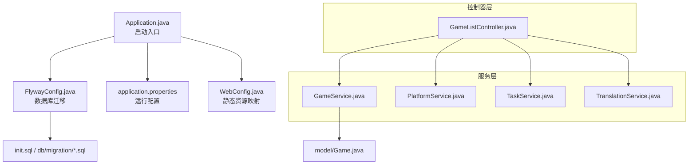
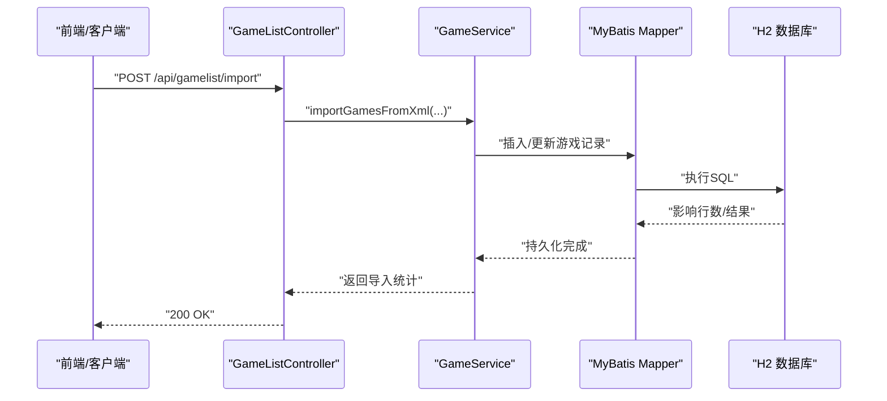
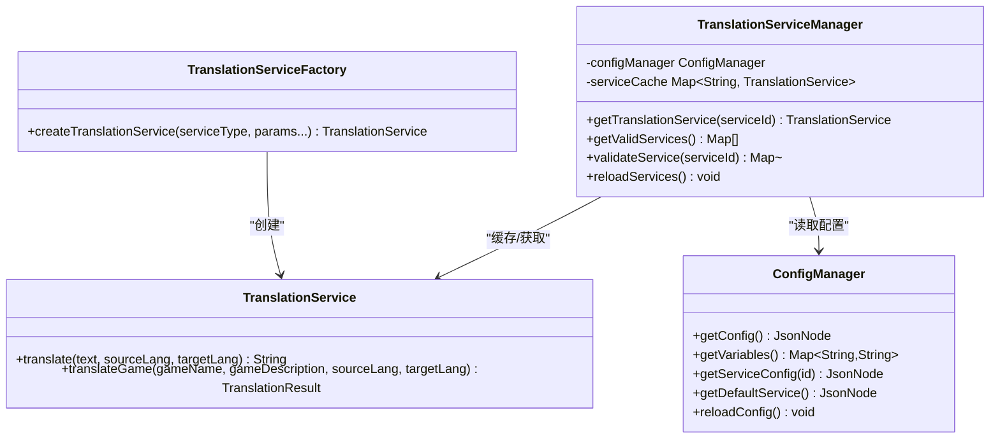
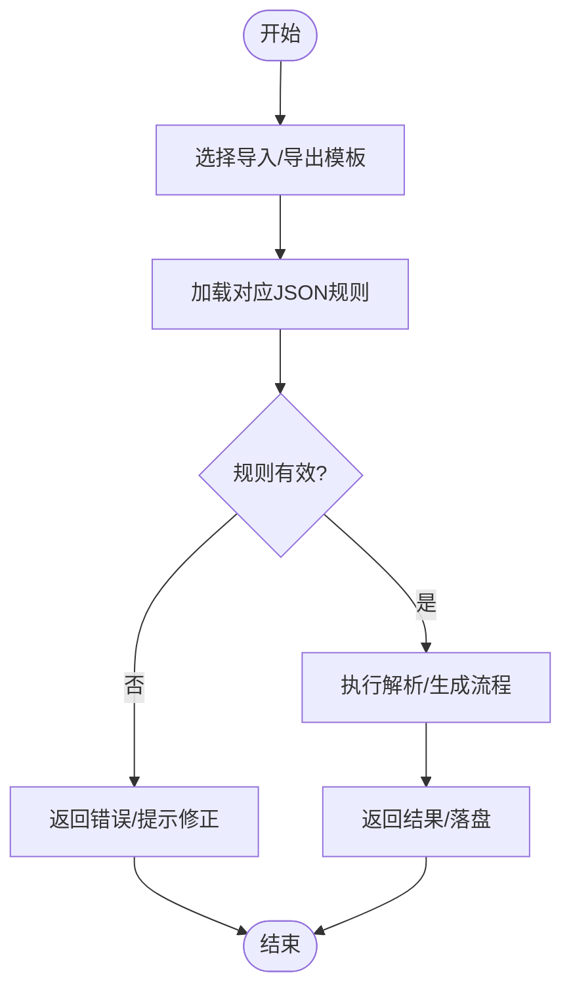
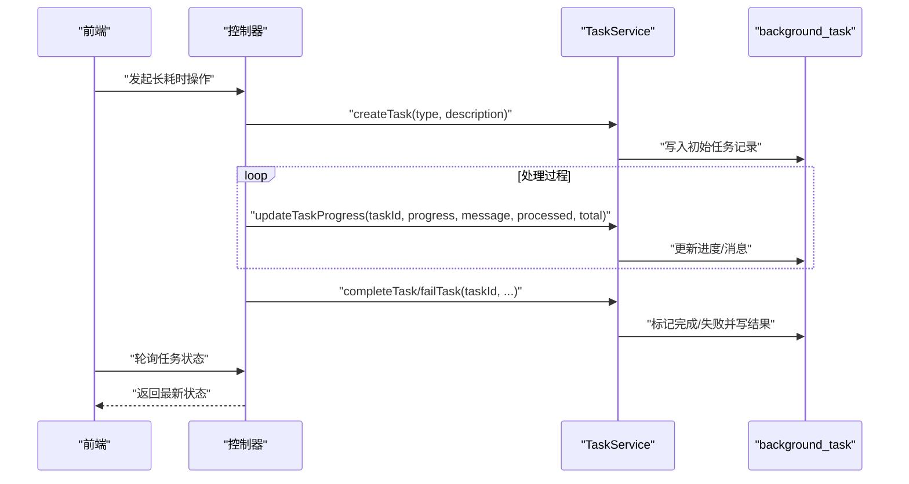
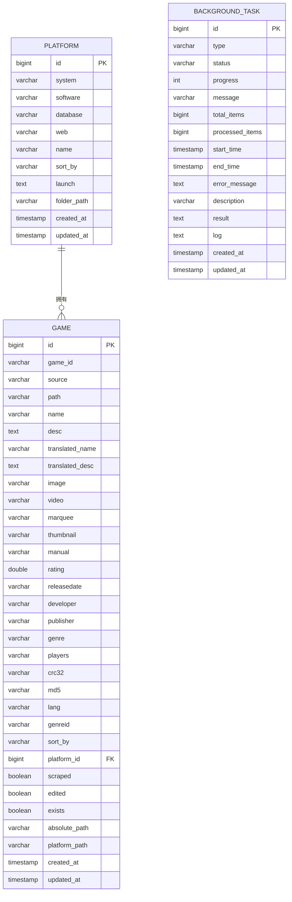
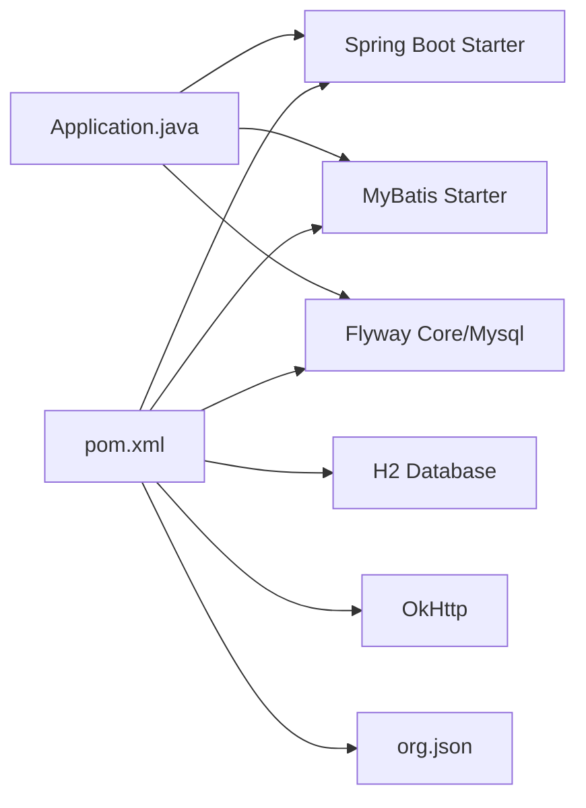

# 开发指南

<cite>
**本文引用的文件**
- [pom.xml](file://pom.xml)
- [README.md](file://README.md)
- [Application.java](file://src/main/java/com/gamelist/Application.java)
- [application.properties](file://src/main/resources/application.properties)
- [WebConfig.java](file://src/main/java/com/gamelist/config/WebConfig.java)
- [FlywayConfig.java](file://src/main/java/com/gamelist/config/FlywayConfig.java)
- [GameListController.java](file://src/main/java/com/gamelist/controller/GameListController.java)
- [GameService.java](file://src/main/java/com/gamelist/service/GameService.java)
- [PlatformService.java](file://src/main/java/com/gamelist/service/PlatformService.java)
- [TaskService.java](file://src/main/java/com/gamelist/service/TaskService.java)
- [TranslationService.java](file://src/main/java/com/gamelist/service/TranslationService.java)
- [TranslationServiceFactory.java](file://src/main/java/com/gamelist/service/impl/TranslationServiceFactory.java)
- [TranslationServiceManager.java](file://src/main/java/com/gamelist/service/impl/TranslationServiceManager.java)
- [ConfigManager.java](file://src/main/java/com/gamelist/service/impl/ConfigManager.java)
- [Game.java](file://src/main/java/com/gamelist/model/Game.java)
- [init.sql](file://src/main/resources/sql/init.sql)
- [V1.0.3__baseline_migration.sql](file://src/main/resources/db/migration/V1.0.3__baseline_migration.sql)
- [API.md](file://wiki/API.md)
</cite>

## 目录
1. [简介](#简介)
2. [项目结构](#项目结构)
3. [核心组件](#核心组件)
4. [架构总览](#架构总览)
5. [详细组件分析](#详细组件分析)
6. [依赖关系分析](#依赖关系分析)
7. [性能考量](#性能考量)
8. [故障排查指南](#故障排查指南)
9. [结论](#结论)
10. [附录](#附录)

## 简介
本指南面向 WebGameListOper 项目的开发者，提供从环境搭建、代码结构与模块职责、核心设计模式应用、新功能开发流程、代码与提交规范、测试策略、调试与性能分析到贡献与 Pull Request 规范的完整说明。项目基于 Spring Boot 3.2.x + Java 17，使用 H2 内嵌数据库与 MyBatis，支持游戏列表导入/导出、平台管理、媒体资源管理、翻译服务扩展等能力。

## 项目结构
- 入口与装配
  - 应用启动类：[Application.java](file://src/main/java/com/gamelist/Application.java)
  - 全局配置：[application.properties](file://src/main/resources/application.properties)
  - Web 静态资源映射：[WebConfig.java](file://src/main/java/com/gamelist/config/WebConfig.java)
- 分层组织
  - controller：REST 接口层（如游戏列表、平台、任务、扫描、刮削等）
  - service：业务逻辑层（如 GameService、PlatformService、TaskService、翻译服务等）
  - model：领域模型（如 Game、Platform、任务与统计等）
  - mapper/xml：MyBatis 数据访问层与 SQL 映射
  - config：初始化与迁移（Flyway）、异步、Web 配置等
  - util：工具类（加密、日志、语言检测、速率限制等）
  - xml：XML 解析与元数据处理
- 资源与规则
  - 数据库初始化脚本：[init.sql](file://src/main/resources/sql/init.sql)
  - 数据库迁移脚本：db/migration 下的 V*.sql
  - 导入模板与导出规则：rules/import、rules/export
  - 前端静态页面：resources/static

**图表来源**
- [Application.java:8-14](file://src/main/java/com/gamelist/Application.java#L8-L14)
- [application.properties:1-86](file://src/main/resources/application.properties#L1-L86)
- [WebConfig.java:8-20](file://src/main/java/com/gamelist/config/WebConfig.java#L8-L20)
- [FlywayConfig.java:17-75](file://src/main/java/com/gamelist/config/FlywayConfig.java#L17-L75)
- [GameListController.java:39-50](file://src/main/java/com/gamelist/controller/GameListController.java#L39-L50)
- [GameService.java:13-61](file://src/main/java/com/gamelist/service/GameService.java#L13-L61)
- [PlatformService.java:11-34](file://src/main/java/com/gamelist/service/PlatformService.java#L11-L34)
- [TaskService.java:7-61](file://src/main/java/com/gamelist/service/TaskService.java#L7-L61)
- [TranslationService.java:3-33](file://src/main/java/com/gamelist/service/TranslationService.java#L3-L33)
- [init.sql:1-305](file://src/main/resources/sql/init.sql#L1-L305)

**章节来源**
- [Application.java:8-14](file://src/main/java/com/gamelist/Application.java#L8-L14)
- [application.properties:1-86](file://src/main/resources/application.properties#L1-L86)
- [WebConfig.java:8-20](file://src/main/java/com/gamelist/config/WebConfig.java#L8-L20)
- [FlywayConfig.java:17-75](file://src/main/java/com/gamelist/config/FlywayConfig.java#L17-L75)
- [GameListController.java:39-50](file://src/main/java/com/gamelist/controller/GameListController.java#L39-L50)
- [GameService.java:13-61](file://src/main/java/com/gamelist/service/GameService.java#L13-L61)
- [PlatformService.java:11-34](file://src/main/java/com/gamelist/service/PlatformService.java#L11-L34)
- [TaskService.java:7-61](file://src/main/java/com/gamelist/service/TaskService.java#L7-L61)
- [TranslationService.java:3-33](file://src/main/java/com/gamelist/service/TranslationService.java#L3-L33)
- [init.sql:1-305](file://src/main/resources/sql/init.sql#L1-L305)

## 核心组件
- 应用启动与装配
  - 通过 @SpringBootApplication、@MapperScan、@EnableAsync 启用自动装配、MyBatis 扫描与异步任务能力。
- 配置与资源
  - 端口、编码、静态资源、H2 控制台、上传临时目录、Tomcat 工作目录、规则与输入输出路径等均在 application.properties 中集中配置。
  - WebConfig 为 scraper 相关资源提供无缓存的文件映射。
- 数据持久化
  - 使用 H2 内嵌数据库；通过 Flyway 进行版本化迁移；同时提供 init.sql 用于基础表与默认设置初始化。
- 控制器与服务
  - GameListController 暴露游戏列表、平台、统计、导入/扫描等 REST API。
  - GameService/PlatformService/TaskService 封装核心业务；TranslationService 抽象翻译能力并支持多实现。
- 模型与规则
  - Game 模型承载游戏实体及大量媒体字段；导入/导出规则以 JSON 形式维护在 rules 目录。

**章节来源**
- [Application.java:8-14](file://src/main/java/com/gamelist/Application.java#L8-L14)
- [application.properties:1-86](file://src/main/resources/application.properties#L1-L86)
- [WebConfig.java:8-20](file://src/main/java/com/gamelist/config/WebConfig.java#L8-L20)
- [FlywayConfig.java:17-75](file://src/main/java/com/gamelist/config/FlywayConfig.java#L17-L75)
- [GameListController.java:39-50](file://src/main/java/com/gamelist/controller/GameListController.java#L39-L50)
- [GameService.java:13-61](file://src/main/java/com/gamelist/service/GameService.java#L13-L61)
- [PlatformService.java:11-34](file://src/main/java/com/gamelist/service/PlatformService.java#L11-L34)
- [TaskService.java:7-61](file://src/main/java/com/gamelist/service/TaskService.java#L7-L61)
- [TranslationService.java:3-33](file://src/main/java/com/gamelist/service/TranslationService.java#L3-L33)
- [init.sql:1-305](file://src/main/resources/sql/init.sql#L1-L305)

## 架构总览
系统采用典型的 MVC 分层：
- 表现层：Spring MVC 控制器接收请求，返回 JSON 或重定向。
- 业务层：Service 组合多个 Mapper/工具完成复杂逻辑，必要时调用外部服务（如翻译）。
- 数据层：MyBatis Mapper + XML 映射到 H2 数据库；Flyway 负责迁移。
- 配置层：统一配置、静态资源映射、异步与迁移初始化。

**图表来源**
- [GameListController.java:54-74](file://src/main/java/com/gamelist/controller/GameListController.java#L54-L74)
- [GameService.java:13-25](file://src/main/java/com/gamelist/service/GameService.java#L13-L25)

## 详细组件分析

### 工厂模式：翻译服务
- 目标：根据配置或类型动态创建不同的翻译服务实现（Google/Baidu/Youdao/DeepSeek），屏蔽具体实现细节。
- 关键点
  - TranslationService 定义统一接口与通用方法。
  - TranslationServiceFactory 按 serviceType 创建对应实现，并进行参数校验。
  - TranslationServiceManager 负责从配置加载服务、校验必填变量、缓存实例与热重载。
  - ConfigManager 提供配置读取与变量注入。

**图表来源**
- [TranslationService.java:3-33](file://src/main/java/com/gamelist/service/TranslationService.java#L3-L33)
- [TranslationServiceFactory.java:5-35](file://src/main/java/com/gamelist/service/impl/TranslationServiceFactory.java#L5-L35)
- [TranslationServiceManager.java:11-110](file://src/main/java/com/gamelist/service/impl/TranslationServiceManager.java#L11-L110)
- [ConfigManager.java:148-197](file://src/main/java/com/gamelist/service/impl/ConfigManager.java#L148-L197)

**章节来源**
- [TranslationService.java:3-33](file://src/main/java/com/gamelist/service/TranslationService.java#L3-L33)
- [TranslationServiceFactory.java:5-35](file://src/main/java/com/gamelist/service/impl/TranslationServiceFactory.java#L5-L35)
- [TranslationServiceManager.java:11-110](file://src/main/java/com/gamelist/service/impl/TranslationServiceManager.java#L11-L110)
- [ConfigManager.java:148-197](file://src/main/java/com/gamelist/service/impl/ConfigManager.java#L148-L197)

### 策略模式：导入/导出规则
- 目标：针对不同前端模板（Pegasus、RetroBat、Emuelec 等）的导入/导出采用可插拔的规则策略。
- 关键点
  - 规则以 JSON 文件形式存放在 rules/import 与 rules/export。
  - 控制器或服务层根据模板名称选择对应规则，驱动解析/生成流程。
  - 新增模板只需新增规则文件与适配逻辑，无需修改既有流程。

**图表来源**
- [GameListController.java:512-549](file://src/main/java/com/gamelist/controller/GameListController.java#L512-L549)

**章节来源**
- [GameListController.java:512-549](file://src/main/java/com/gamelist/controller/GameListController.java#L512-L549)

### 观察者模式：后台任务进度
- 目标：将耗时操作（如批量导入、媒体下载）拆分为后台任务，实时反馈进度与状态。
- 关键点
  - TaskService 提供任务的创建、进度更新、完成/失败回调。
  - 控制器触发任务后，前端轮询或通过事件机制获取任务状态。
  - 任务状态持久化至 background_task 表，便于查询与审计。

**图表来源**
- [TaskService.java:7-61](file://src/main/java/com/gamelist/service/TaskService.java#L7-L61)
- [init.sql:264-281](file://src/main/resources/sql/init.sql#L264-L281)

**章节来源**
- [TaskService.java:7-61](file://src/main/java/com/gamelist/service/TaskService.java#L7-L61)
- [init.sql:264-281](file://src/main/resources/sql/init.sql#L264-L281)

### 数据模型与持久化
- 核心模型
  - Game 包含丰富的媒体字段与平台关联信息，支撑多前端模板展示。
- 数据库
  - 通过 init.sql 创建 platform、game、temp_subset、merge_report、scraper_system、background_task、media_download_task 等表。
  - 使用 Flyway 进行增量迁移（V1.0.3 起），保证跨环境一致性。

**图表来源**
- [init.sql:1-305](file://src/main/resources/sql/init.sql#L1-L305)

**章节来源**
- [Game.java:1-650](file://src/main/java/com/gamelist/model/Game.java#L1-L650)
- [init.sql:1-305](file://src/main/resources/sql/init.sql#L1-L305)

## 依赖关系分析
- 构建与运行时依赖
  - Spring Boot 3.2.x、MyBatis、H2、Flyway、OkHttp、JSON 库等。
  - 主类由 Maven 插件打包时指定 Application 作为入口。
- 模块耦合
  - Controller 依赖 Service；Service 依赖 Mapper/Model；配置与迁移独立于业务。
  - 翻译服务通过工厂与管理器解耦，便于扩展新供应商。

**图表来源**
- [pom.xml:1-152](file://pom.xml#L1-L152)
- [Application.java:8-14](file://src/main/java/com/gamelist/Application.java#L8-L14)

**章节来源**
- [pom.xml:1-152](file://pom.xml#L1-L152)
- [Application.java:8-14](file://src/main/java/com/gamelist/Application.java#L8-L14)

## 性能考量
- 连接池与并发
  - HikariCP 连接池大小、空闲超时、最大生命周期等在 application.properties 中配置，建议根据负载调优。
- 静态资源与缓存
  - WebConfig 对 scraper 资源禁用缓存，避免旧资源污染；生产环境可按需开启 CDN 或浏览器缓存。
- 数据库
  - 使用 Flyway 管理迁移，避免手动变更导致不一致；合理索引与分页查询提升性能。
- 任务与异步
  - 长耗时任务通过后台任务与异步注解降低阻塞；注意线程池与限流策略。

**章节来源**
- [application.properties:21-27](file://src/main/resources/application.properties#L21-L27)
- [WebConfig.java:12-20](file://src/main/java/com/gamelist/config/WebConfig.java#L12-L20)
- [FlywayConfig.java:35-75](file://src/main/java/com/gamelist/config/FlywayConfig.java#L35-L75)

## 故障排查指南
- 常见问题定位
  - 启动失败：检查端口占用、H2 文件权限、Flyway 迁移是否成功。
  - 导入失败：确认上传临时目录与 Tomcat 工作目录可写；检查 XML/模板格式。
  - 资源无法访问：核对 WebConfig 映射路径与静态资源位置。
- 日志与监控
  - 日志级别与输出路径在 application.properties 中配置；关注 ERROR 与异常堆栈。
  - 使用 H2 Console 查看数据库状态（开发环境）。
- 回滚与修复
  - Flyway 支持 repair 与 baseline-on-migrate；谨慎执行迁移脚本。

**章节来源**
- [application.properties:43-58](file://src/main/resources/application.properties#L43-L58)
- [FlywayConfig.java:35-75](file://src/main/java/com/gamelist/config/FlywayConfig.java#L35-L75)

## 结论
本项目以清晰的分层与可扩展的设计（工厂、策略、观察者）实现了游戏列表的全生命周期管理。通过 Flyway 与 init.sql 保障数据一致性，借助后台任务与异步能力提升用户体验。建议在后续迭代中继续完善测试覆盖、性能基准与文档同步。

## 附录

### 开发环境搭建
- 必需环境
  - JDK 17（参考 pom.xml 的 java.version）
  - Maven 3.6+（用于构建与依赖管理）
  - IDE（IntelliJ IDEA/Eclipse），导入根目录即可识别 Spring Boot 项目
- 构建与运行
  - 使用 Maven 构建：mvn clean package
  - 直接运行：java -jar 目标 jar（入口类见 pom.xml 配置）
  - Docker 部署：参考 README 中的 docker run/docker-compose 示例
- 关键配置
  - 端口、编码、静态资源、H2 控制台、上传目录、规则与输入输出路径等见 application.properties
  - 静态资源映射见 WebConfig

**章节来源**
- [pom.xml:18-21](file://pom.xml#L18-L21)
- [pom.xml:108-136](file://pom.xml#L108-L136)
- [README.md:95-149](file://README.md#L95-L149)
- [application.properties:1-86](file://src/main/resources/application.properties#L1-L86)
- [WebConfig.java:8-20](file://src/main/java/com/gamelist/config/WebConfig.java#L8-L20)

### 代码结构与模块划分
- 控制器层：REST 接口（游戏、平台、任务、扫描、刮削、翻译等）
- 服务层：业务编排与事务边界
- 数据层：MyBatis Mapper + XML 映射
- 配置层：应用配置、Web 配置、数据库迁移
- 模型层：领域对象与 DTO
- 工具层：加密、日志、语言检测、速率限制等
- 资源层：静态页面、导入/导出规则、数据库脚本

**章节来源**
- [GameListController.java:39-50](file://src/main/java/com/gamelist/controller/GameListController.java#L39-L50)
- [GameService.java:13-61](file://src/main/java/com/gamelist/service/GameService.java#L13-L61)
- [PlatformService.java:11-34](file://src/main/java/com/gamelist/service/PlatformService.java#L11-L34)
- [TaskService.java:7-61](file://src/main/java/com/gamelist/service/TaskService.java#L7-L61)
- [TranslationService.java:3-33](file://src/main/java/com/gamelist/service/TranslationService.java#L3-L33)
- [init.sql:1-305](file://src/main/resources/sql/init.sql#L1-L305)

### 核心设计模式应用
- 工厂模式：TranslationServiceFactory 根据类型创建不同翻译实现
- 策略模式：导入/导出规则以 JSON 策略文件驱动，支持多模板
- 观察者模式：后台任务通过 TaskService 发布进度与状态变化

**章节来源**
- [TranslationServiceFactory.java:5-35](file://src/main/java/com/gamelist/service/impl/TranslationServiceFactory.java#L5-L35)
- [GameListController.java:512-549](file://src/main/java/com/gamelist/controller/GameListController.java#L512-L549)
- [TaskService.java:7-61](file://src/main/java/com/gamelist/service/TaskService.java#L7-L61)

### 新功能开发流程
- 需求分析：明确功能范围、输入输出、边界条件与兼容性
- 设计：确定涉及的层（Controller/Service/Mapper/Model/配置/规则）
- 编码：遵循现有命名与分层约定，添加必要注释
- 测试：编写单元测试与集成测试，覆盖正常与异常路径
- 文档：更新 API 文档与用户手册，补充配置项说明
- 评审与合并：代码审查通过后合并分支

### 代码规范与提交规范
- 命名约定
  - 包名小写、类名大驼峰、方法与变量小驼峰
  - 常量全大写加下划线
- 注释规范
  - 类与方法提供必要注释，复杂逻辑增加行内注释
- 分支管理
  - 功能分支命名：feature/xxx；修复分支：fix/xxx；发布分支：release/x.y
- 提交信息
  - 简洁描述变更点，必要时引用问题编号

### 测试策略与单元测试
- 单元与集成测试
  - 使用 Spring Boot Test 框架；对 Service 与 Controller 进行断言
  - 使用内存数据库或 TestContainer 模拟真实环境
- 覆盖率与质量
  - 设定最低覆盖率阈值；引入静态检查（如 Checkstyle/SonarQube）

### 调试技巧与性能分析
- 调试
  - 本地启动后访问 H2 Console 查看数据
  - 开启更详细的日志级别，定位异常堆栈
- 性能分析
  - 使用 JVM 参数与 GC 日志分析内存与停顿
  - 对热点接口进行压测与慢查询优化

### 贡献代码与 Pull Request 规范
- Fork 仓库并创建功能分支
- 提交前确保构建通过、测试通过、文档更新
- 提交 PR 时附上变更说明、影响范围与测试截图
- 等待代码审查与 CI 通过后合并

**章节来源**
- [API.md:1-265](file://wiki/API.md#L1-L265)