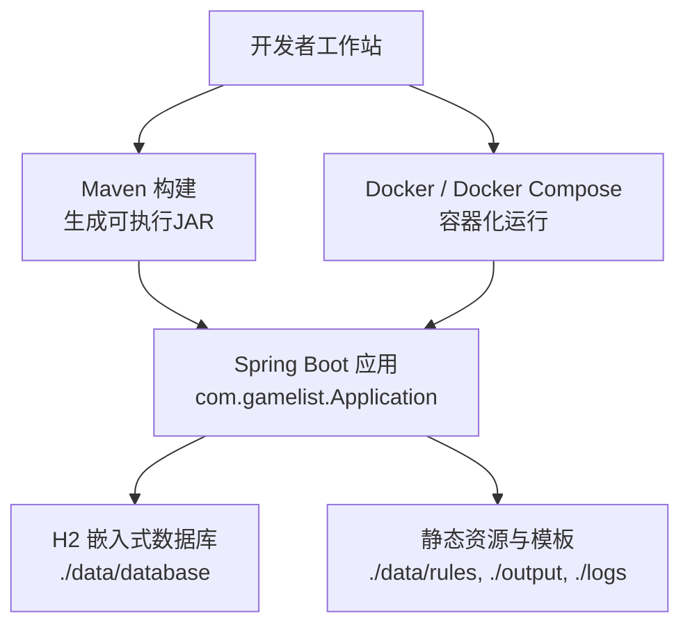
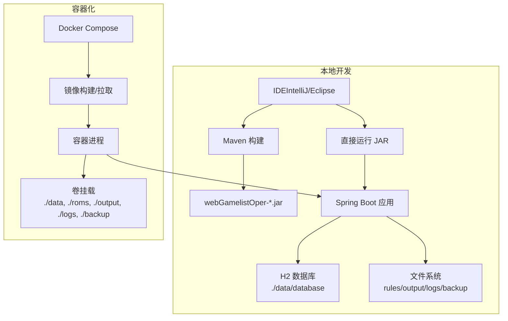
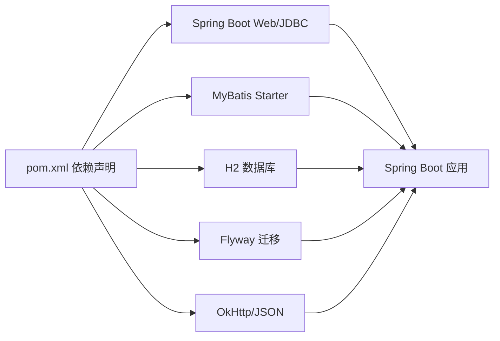

# 开发环境搭建

<cite>
**本文引用的文件**
- [pom.xml](file://pom.xml)
- [application.properties](file://src/main/resources/application.properties)
- [Dockerfile](file://Dockerfile)
- [docker-compose.yml](file://docker-compose.yml)
- [entrypoint.sh](file://entrypoint.sh)
- [start.bat](file://start.bat)
- [build.bat](file://build.bat)
- [build-distribution.bat](file://build-distribution.bat)
- [README.md](file://README.md)
- [Installation.md](file://wiki/Installation.md)
- [Quick-Start.md](file://wiki/Quick-Start.md)
</cite>

## 目录
1. [简介](#简介)
2. [项目结构](#项目结构)
3. [核心组件](#核心组件)
4. [架构总览](#架构总览)
5. [详细组件分析](#详细组件分析)
6. [依赖分析](#依赖分析)
7. [性能考虑](#性能考虑)
8. [故障排查指南](#故障排查指南)
9. [结论](#结论)
10. [附录](#附录)

## 简介
本指南面向首次接触 WebGameListOper 项目的开发者，目标是帮助你在本地快速搭建可运行的开发环境。内容涵盖：
- Java 17 环境的安装与配置
- Maven 的安装与仓库镜像配置
- IDE（IntelliJ IDEA、Eclipse）导入与调试配置
- Docker 与 Docker Compose 的本地运行方式
- 常见环境问题排查（端口冲突、权限等）
- 快速启动脚本的使用说明

本项目基于 Spring Boot 3.2.x + MyBatis + H2 数据库，支持通过 JAR、Docker、Docker Compose 三种方式运行；默认监听 8080 端口，可通过环境变量或配置文件调整。

## 项目结构
- 应用入口与构建产物由 Maven 管理，主类为 com.gamelist.Application，打包后生成可执行 JAR。
- 运行时数据、规则、日志、备份等通过 application.properties 中的路径配置，默认位于 ./data 及其子目录。
- 容器化方案提供 Dockerfile 与 docker-compose.yml，便于一键拉起服务并持久化数据。

图表来源
- [pom.xml:108-136](file://pom.xml#L108-L136)
- [application.properties:15-27](file://src/main/resources/application.properties#L15-L27)
- [Dockerfile:1-55](file://Dockerfile#L1-L55)
- [docker-compose.yml:1-33](file://docker-compose.yml#L1-L33)

章节来源
- [pom.xml:1-152](file://pom.xml#L1-L152)
- [application.properties:1-86](file://src/main/resources/application.properties#L1-L86)
- [Dockerfile:1-55](file://Dockerfile#L1-L55)
- [docker-compose.yml:1-33](file://docker-compose.yml#L1-L33)

## 核心组件
- 运行时依赖
  - Java 17（Spring Boot 3.2.x 要求）
  - Maven（用于构建与打包）
  - H2 嵌入式数据库（默认使用 file 模式，数据保存在 ./data/database）
  - MyBatis 与 Flyway（迁移脚本位于 classpath:db/migration）
- 外部资源
  - 规则与模板：./data/rules/export、./data/rules/import
  - 输出目录：./data/output
  - 日志目录：./data/logs（或 logs/application.log）
  - 备份目录：./data/backup

章节来源
- [pom.xml:18-106](file://pom.xml#L18-L106)
- [application.properties:15-86](file://src/main/resources/application.properties#L15-L86)

## 架构总览
下图展示了本地开发与容器化两种运行方式的总体关系：

图表来源
- [pom.xml:108-136](file://pom.xml#L108-L136)
- [application.properties:15-86](file://src/main/resources/application.properties#L15-L86)
- [Dockerfile:1-55](file://Dockerfile#L1-L55)
- [docker-compose.yml:1-33](file://docker-compose.yml#L1-L33)

## 详细组件分析

### Java 17 环境安装与配置
- 版本要求
  - 项目声明 Java 17，Spring Boot 3.2.x 需要 JDK 17+。
- 安装建议
  - 下载并安装 JDK 17（推荐 Eclipse Temurin 或 Oracle JDK）。
  - 设置系统环境变量（示例）：
    - JAVA_HOME 指向 JDK 安装目录
    - PATH 包含 %JAVA_HOME%\bin
  - 验证：命令行执行 java -version 与 mvn -v 确认版本。
- 注意事项
  - Windows 下 build.bat 中预设了 JAVA_HOME 路径，若你的安装路径不同请修改对应行。
  - Linux/macOS 建议使用 sdkman 或官方安装包进行版本管理。

章节来源
- [pom.xml:18-21](file://pom.xml#L18-L21)
- [build.bat:6-9](file://build.bat#L6-L9)

### Maven 安装与仓库镜像配置
- 安装与验证
  - 安装 Maven 3.8+，确保 mvn -v 可用。
- 镜像源配置（加速依赖下载）
  - 在用户目录创建 ~/.m2/settings.xml（Windows 为 %USERPROFILE%\.m2\settings.xml），添加阿里云镜像或其他国内镜像。
  - 参考 Dockerfile 中内置的 settings.xml 片段，将 central 镜像指向国内源。
- 构建命令
  - 清理并打包：mvn clean package spring-boot:repackage -DskipTests
  - 或直接使用项目提供的构建脚本：build.bat（Windows）

章节来源
- [Dockerfile:8-16](file://Dockerfile#L8-L16)
- [pom.xml:108-136](file://pom.xml#L108-L136)
- [build.bat:16-17](file://build.bat#L16-L17)

### IDE 配置（IntelliJ IDEA / Eclipse）
- 导入项目
  - IntelliJ IDEA：File > Open > 选择 pom.xml，等待索引完成。
  - Eclipse：Import > Existing Maven Projects > 选择根目录。
- 运行与调试
  - 运行主类：com.gamelist.Application
  - 调试参数：可在 VM Options 中传入 JVM 参数（如内存、GC 等），或使用 start.bat 中的参数作为参考。
- 插件建议
  - Lombok（如需）、Spring Boot Support、MyBatis Plugin（可选）。
- 本地运行端口
  - 默认 8080，可通过 application.properties 或启动参数覆盖。

章节来源
- [pom.xml:112-128](file://pom.xml#L112-L128)
- [application.properties:1-2](file://src/main/resources/application.properties#L1-L2)
- [start.bat:3-12](file://start.bat#L3-L12)

### Docker 与 Docker Compose 搭建
- 使用 Docker 镜像运行（推荐）
  - 拉取镜像并运行，映射端口 8080，挂载 data、roms、output、logs、backup 等目录。
  - 环境变量 SPRING_PROFILES_ACTIVE、SERVER_TOMCAT_BASEDIR、SPRING_RESOURCES_STATIC_LOCATIONS、JAVA_OPTS 可按需设置。
- 使用 Docker Compose
  - 在项目根目录执行 docker-compose up -d 即可拉起服务。
  - 健康检查与资源限制已在 compose 文件中配置。
- 自定义构建镜像
  - 使用 Dockerfile 多阶段构建，已内置 Maven 镜像源加速。

章节来源
- [README.md:95-140](file://README.md#L95-L140)
- [README.md:172-217](file://README.md#L172-L217)
- [Dockerfile:1-55](file://Dockerfile#L1-L55)
- [docker-compose.yml:1-33](file://docker-compose.yml#L1-L33)
- [entrypoint.sh:1-93](file://entrypoint.sh#L1-L93)

### 快速启动脚本使用方法
- Windows 快速启动
  - 双击 start.bat 可直接运行已构建的 JAR（需先执行 build.bat 生成 JAR）。
  - 脚本会设置 JVM 参数并检查目标 JAR 是否存在。
- 构建与分发
  - build.bat：执行清理、构建、repackage，并校验产物。
  - build-distribution.bat：构建并打包发行版（含 data、rules、文档等）。
- 容器快速启动
  - 使用 docker-compose up -d 一键拉起服务。

章节来源
- [start.bat:1-20](file://start.bat#L1-L20)
- [build.bat:1-42](file://build.bat#L1-L42)
- [build-distribution.bat:1-101](file://build-distribution.bat#L1-L101)
- [docker-compose.yml:1-33](file://docker-compose.yml#L1-L33)

## 依赖分析
- 运行时关键依赖
  - Spring Boot Starter Web、JDBC
  - MyBatis Spring Boot Starter
  - H2 Database（嵌入式，文件模式）
  - Flyway（数据库迁移）
  - OkHttp、JSON 库（HTTP 请求与响应处理）
- 构建与打包
  - maven-jar-plugin 指定主类
  - spring-boot-maven-plugin 负责 repackage
- 资源与编码
  - 统一 UTF-8 编码
  - 静态资源位置与缓存策略可配置

图表来源
- [pom.xml:23-106](file://pom.xml#L23-L106)
- [pom.xml:108-136](file://pom.xml#L108-L136)

章节来源
- [pom.xml:23-106](file://pom.xml#L23-L106)
- [pom.xml:108-136](file://pom.xml#L108-L136)

## 性能考虑
- 内存与 GC
  - 建议在启动时设置合理的堆大小与 GC 参数（例如 -Xmx2g -Xms512m -XX:+UseG1GC）。
  - 容器环境下可通过 JAVA_OPTS 环境变量注入。
- 连接池
  - HikariCP 最大连接数、空闲超时、连接超时等可根据负载调优。
- 静态资源缓存
  - 开发环境关闭缓存以便热更新；生产环境可开启缓存以提升性能。
- 日志滚动
  - 配置日志文件大小与保留天数，避免磁盘占用过大。

章节来源
- [application.properties:21-27](file://src/main/resources/application.properties#L21-L27)
- [application.properties:43-53](file://src/main/resources/application.properties#L43-L53)
- [docker-compose.yml:14-18](file://docker-compose.yml#L14-L18)

## 故障排查指南
- 端口冲突
  - 现象：启动时报端口被占用。
  - 解决：修改 application.properties 中的 server.port，或通过启动参数 --server.port=新端口 覆盖。
- 权限问题
  - 现象：上传临时目录无写入权限。
  - 解决：确保 spring.servlet.multipart.location 指向有写权限的目录（默认 ./data），并在容器中正确挂载 volume。
- 数据库初始化失败
  - 现象：启动时报 SQL 初始化错误。
  - 解决：检查 spring.sql.init.mode 与 schema-locations；确认 H2 控制台路径与访问权限。
- 静态资源无法访问
  - 现象：页面样式或脚本加载失败。
  - 解决：检查 spring.web.resources.static-locations 与 SERVER_TOMCAT_BASEDIR 配置；容器内通过 entrypoint 注入静态资源路径。
- 容器启动失败
  - 现象：容器退出或健康检查失败。
  - 解决：查看容器日志；确认端口映射、卷挂载路径、环境变量是否正确；检查 healthcheck 端点是否可达。

章节来源
- [application.properties:1-2](file://src/main/resources/application.properties#L1-L2)
- [application.properties:60-74](file://src/main/resources/application.properties#L60-L74)
- [application.properties:29-37](file://src/main/resources/application.properties#L29-L37)
- [application.properties:10-13](file://src/main/resources/application.properties#L10-L13)
- [docker-compose.yml:20-25](file://docker-compose.yml#L20-L25)
- [entrypoint.sh:86-92](file://entrypoint.sh#L86-L92)

## 结论
通过以上步骤，你可以在本地快速搭建 WebGameListOper 的开发与运行环境。推荐使用 Docker 或 Docker Compose 以简化部署；本地开发可使用 IDE 直接运行主类或借助脚本快速启动。根据实际负载与存储需求，合理调整内存、连接池与日志策略，可获得更稳定的运行体验。

## 附录
- 常用命令速查
  - 构建：mvn clean package spring-boot:repackage -DskipTests
  - 本地运行：java -jar target/webGamelistOper-*.jar
  - 容器运行：docker run ... fansmall/webgamelistoper:latest
  - Compose：docker-compose up -d
- 访问地址
  - 默认 http://localhost:8080（可通过配置改为 8081 等）

章节来源
- [README.md:95-149](file://README.md#L95-L149)
- [README.md:172-226](file://README.md#L172-L226)
- [Installation.md:1-121](file://wiki/Installation.md#L1-L121)
- [Quick-Start.md:1-89](file://wiki/Quick-Start.md#L1-L89)