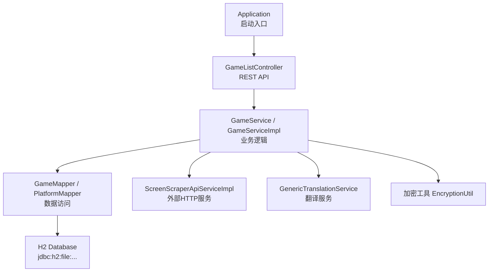
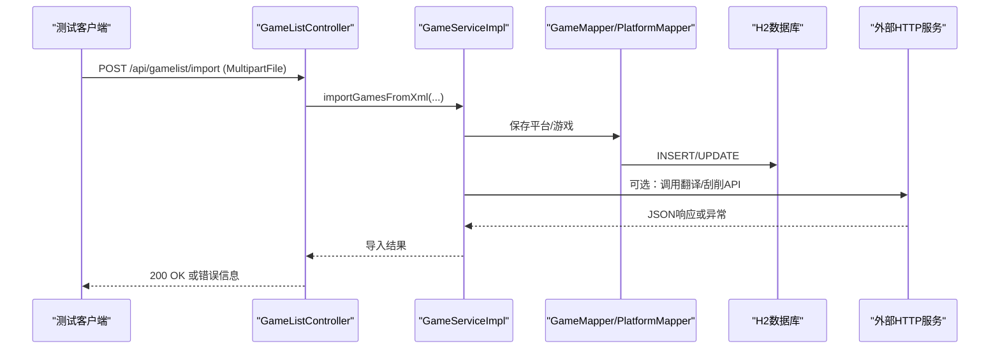
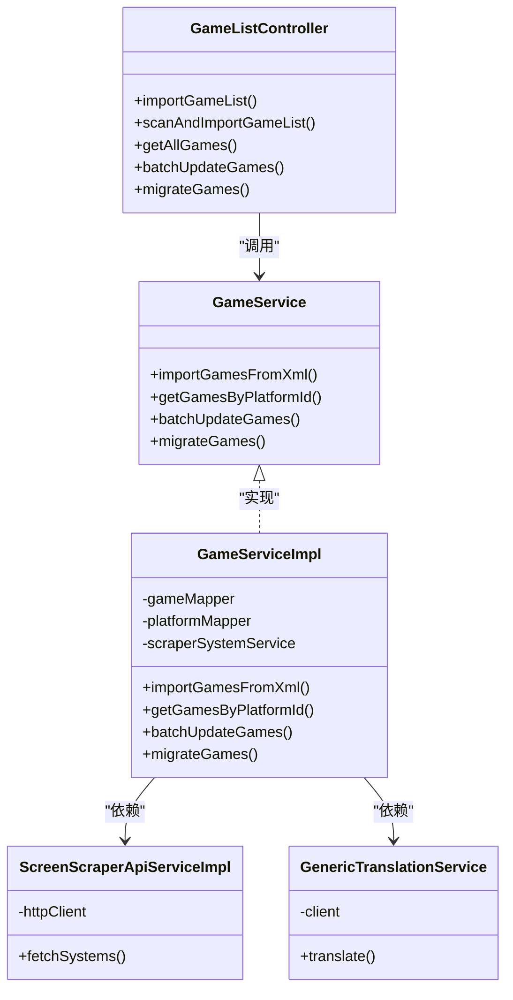

# 测试指南

<cite>
**本文引用的文件**
- [pom.xml](file://pom.xml)
- [Application.java](file://src/main/java/com/gamelist/Application.java)
- [GameListController.java](file://src/main/java/com/gamelist/controller/GameListController.java)
- [GameService.java](file://src/main/java/com/gamelist/service/GameService.java)
- [GameServiceImpl.java](file://src/main/java/com/gamelist/service/impl/GameServiceImpl.java)
- [Game.java](file://src/main/java/com/gamelist/model/Game.java)
- [application.properties](file://src/main/resources/application.properties)
- [FlywayConfig.java](file://src/main/java/com/gamelist/config/FlywayConfig.java)
- [DatabaseInitializer.java](file://src/main/java/com/gamelist/config/DatabaseInitializer.java)
- [DataDirectoryInitializer.java](file://src/main/java/com/gamelist/config/DataDirectoryInitializer.java)
- [ScreenScraperApiServiceImpl.java](file://src/main/java/com/gamelist/service/impl/ScreenScraperApiServiceImpl.java)
- [GenericTranslationService.java](file://src/main/java/com/gamelist/service/impl/GenericTranslationService.java)
- [EncryptionUtil.java](file://src/main/java/com/gamelist/util/EncryptionUtil.java)
</cite>

## 目录
1. [简介](#简介)
2. [项目结构](#项目结构)
3. [核心组件](#核心组件)
4. [架构总览](#架构总览)
5. [详细组件分析](#详细组件分析)
6. [依赖关系分析](#依赖关系分析)
7. [性能考虑](#性能考虑)
8. [故障排查指南](#故障排查指南)
9. [结论](#结论)
10. [附录](#附录)

## 简介
本指南面向WebGameListOper项目的测试实践，覆盖单元测试、集成测试、覆盖率统计、性能与压力测试、测试数据管理以及自动化持续集成。项目基于Spring Boot 3.2（Java 17），使用MyBatis + H2数据库，并包含外部HTTP服务调用（如翻译、刮削API）和文件系统操作。文档提供可操作的步骤、最佳实践与示例路径引用，帮助团队建立稳定可靠的测试体系。

## 项目结构
- 应用入口：Application类启用异步与Mapper扫描
- Web层：REST控制器处理导入、扫描、查询、更新、批量操作等
- 服务层：业务逻辑集中在Service接口及实现中，封装导入、统计、迁移、合并等
- 数据访问：MyBatis Mapper + Flyway迁移 + H2内存/文件库
- 外部依赖：OkHttp用于HTTP请求；JAXB用于XML解析；JSON库用于响应处理
- 配置：application.properties定义数据库、静态资源、上传限制、日志等

图表来源
- [Application.java:8-14](file://src/main/java/com/gamelist/Application.java#L8-L14)
- [GameListController.java:39-50](file://src/main/java/com/gamelist/controller/GameListController.java#L39-L50)
- [GameService.java:13-61](file://src/main/java/com/gamelist/service/GameService.java#L13-L61)
- [GameServiceImpl.java:46-69](file://src/main/java/com/gamelist/service/impl/GameServiceImpl.java#L46-L69)
- [application.properties:15-20](file://src/main/resources/application.properties#L15-L20)
- [ScreenScraperApiServiceImpl.java:30-43](file://src/main/java/com/gamelist/service/impl/ScreenScraperApiServiceImpl.java#L30-L43)
- [GenericTranslationService.java:191-201](file://src/main/java/com/gamelist/service/impl/GenericTranslationService.java#L191-L201)
- [EncryptionUtil.java:10-18](file://src/main/java/com/gamelist/util/EncryptionUtil.java#L10-L18)

章节来源
- [Application.java:8-14](file://src/main/java/com/gamelist/Application.java#L8-L14)
- [GameListController.java:39-50](file://src/main/java/com/gamelist/controller/GameListController.java#L39-L50)
- [application.properties:15-20](file://src/main/resources/application.properties#L15-L20)

## 核心组件
- REST控制器：提供游戏列表导入、扫描、分页查询、统计、批量更新/删除、迁移、合盘等接口
- 服务接口与实现：封装导入流程、平台管理、统计计算、过滤、唯一值获取、磁盘合并等
- 模型对象：Game为游戏实体，含大量媒体字段与平台特定字段
- 数据库与迁移：H2默认存储，Flyway管理版本化迁移，初始化脚本确保基础表存在
- 外部服务：OkHttp客户端调用第三方API（翻译、刮削），需进行超时、重试、错误处理

章节来源
- [GameListController.java:51-550](file://src/main/java/com/gamelist/controller/GameListController.java#L51-L550)
- [GameService.java:13-61](file://src/main/java/com/gamelist/service/GameService.java#L13-L61)
- [GameServiceImpl.java:116-200](file://src/main/java/com/gamelist/service/impl/GameServiceImpl.java#L116-L200)
- [Game.java:5-80](file://src/main/java/com/gamelist/model/Game.java#L5-L80)
- [application.properties:29-37](file://src/main/resources/application.properties#L29-L37)

## 架构总览
下图展示从控制器到服务、数据访问、外部服务的调用链，便于设计端到端测试用例。

图表来源
- [GameListController.java:54-74](file://src/main/java/com/gamelist/controller/GameListController.java#L54-L74)
- [GameServiceImpl.java:116-200](file://src/main/java/com/gamelist/service/impl/GameServiceImpl.java#L116-L200)
- [ScreenScraperApiServiceImpl.java:106-200](file://src/main/java/com/gamelist/service/impl/ScreenScraperApiServiceImpl.java#L106-L200)

## 详细组件分析

### 单元测试编写方法（JUnit5 + Mockito）
- 目标：验证Service层核心逻辑（导入、统计、过滤、批量更新/删除、迁移、合盘）在不依赖真实数据库和外部服务时的正确性
- 建议：
  - 使用@ExtendWith(MockitoExtension.class)启用Mockito
  - 对Service依赖的Mapper、PlatformService、ScraperSystemService等进行@Mock或@Spy
  - 针对边界条件（空输入、非法参数、异常分支）编写用例
  - 使用Assertions断言返回值、状态码、异常类型与消息

示例要点（以导入为例）：
- 构造GameListXml与Provider，模拟平台保存返回
- 验证convertToGameModel转换逻辑与批量保存调用次数
- 校验异常场景（null输入、平台保存失败）抛出预期异常

参考路径
- [GameService.java:13-61](file://src/main/java/com/gamelist/service/GameService.java#L13-L61)
- [GameServiceImpl.java:116-200](file://src/main/java/com/gamelist/service/impl/GameServiceImpl.java#L116-L200)

章节来源
- [GameService.java:13-61](file://src/main/java/com/gamelist/service/GameService.java#L13-L61)
- [GameServiceImpl.java:116-200](file://src/main/java/com/gamelist/service/impl/GameServiceImpl.java#L116-L200)

### Mock对象的创建与管理
- 对外部HTTP服务（OkHttp）：通过接口抽象或使用TestRestTemplate拦截，避免真实网络调用
- 对数据库访问：在单元测试中使用内存H2或Mock Mapper；在集成测试中使用真实H2并执行Flyway迁移
- 对文件IO：使用临时目录与Mock File，避免污染真实文件系统

参考路径
- [ScreenScraperApiServiceImpl.java:30-43](file://src/main/java/com/gamelist/service/impl/ScreenScraperApiServiceImpl.java#L30-L43)
- [GenericTranslationService.java:191-201](file://src/main/java/com/gamelist/service/impl/GenericTranslationService.java#L191-L201)
- [application.properties:15-20](file://src/main/resources/application.properties#L15-L20)

章节来源
- [ScreenScraperApiServiceImpl.java:30-43](file://src/main/java/com/gamelist/service/impl/ScreenScraperApiServiceImpl.java#L30-L43)
- [GenericTranslationService.java:191-201](file://src/main/java/com/gamelist/service/impl/GenericTranslationService.java#L191-L201)
- [application.properties:15-20](file://src/main/resources/application.properties#L15-L20)

### 测试用例的设计原则
- 单一职责：每个用例只验证一个行为或一条路径
- 可重复性：不依赖外部状态，使用隔离的数据与环境
- 可读性：命名清晰，Arrange-Act-Assert三段式
- 覆盖关键路径：成功、失败、边界、并发（必要时）
- 数据驱动：对多组输入使用Parameterized Tests

章节来源
- [GameListController.java:128-160](file://src/main/java/com/gamelist/controller/GameListController.java#L128-L160)
- [GameServiceImpl.java:116-200](file://src/main/java/com/gamelist/service/impl/GameServiceImpl.java#L116-L200)

### 集成测试策略（数据库、API、外部服务模拟）
- 数据库测试：
  - 使用@SpringBootTest + @AutoConfigureTestDatabase(replace=ANY)加载内存H2
  - 通过FlywayConfig或DatabaseInitializer执行迁移，保证表结构一致
  - 使用@Transactional在每个测试后回滚，保持环境干净
- API接口测试：
  - 使用TestRestTemplate或MockMvc发起HTTP请求，验证状态码与响应体
  - 覆盖导入、扫描、查询、批量更新/删除、迁移、合盘等接口
- 外部服务模拟：
  - 使用WireMock或自定义Mock OkHttp，返回固定响应或模拟超时/错误
  - 针对翻译与刮削API，验证重试、限流、错误处理逻辑

参考路径
- [FlywayConfig.java:35-75](file://src/main/java/com/gamelist/config/FlywayConfig.java#L35-L75)
- [DatabaseInitializer.java:23-32](file://src/main/java/com/gamelist/config/DatabaseInitializer.java#L23-L32)
- [ScreenScraperApiServiceImpl.java:106-200](file://src/main/java/com/gamelist/service/impl/ScreenScraperApiServiceImpl.java#L106-L200)
- [GenericTranslationService.java:203-280](file://src/main/java/com/gamelist/service/impl/GenericTranslationService.java#L203-L280)

章节来源
- [FlywayConfig.java:35-75](file://src/main/java/com/gamelist/config/FlywayConfig.java#L35-L75)
- [DatabaseInitializer.java:23-32](file://src/main/java/com/gamelist/config/DatabaseInitializer.java#L23-L32)
- [ScreenScraperApiServiceImpl.java:106-200](file://src/main/java/com/gamelist/service/impl/ScreenScraperApiServiceImpl.java#L106-L200)
- [GenericTranslationService.java:203-280](file://src/main/java/com/gamelist/service/impl/GenericTranslationService.java#L203-L280)

### 测试覆盖率的要求与统计方法
- 推荐指标：行覆盖率≥80%，分支覆盖率≥70%
- 工具：JaCoCo插件集成到Maven构建中，生成HTML报告
- 执行方式：mvn test 或 mvn verify，查看target/site/jacoco/index.html
- 排除规则：对DTO、配置类、异常类适当排除，聚焦业务逻辑

参考路径
- [pom.xml:71-76](file://pom.xml#L71-L76)

章节来源
- [pom.xml:71-76](file://pom.xml#L71-L76)

### 性能测试与压力测试实施指导
- 目标：评估高并发下导入、扫描、批量更新的吞吐与延迟
- 工具：JMeter或Gatling
- 场景：
  - 并发导入XML/Pegasus元数据
  - 批量更新/删除大量游戏记录
  - 查询分页与筛选在高数据量下的响应时间
- 指标：TPS、P95/P99延迟、错误率、CPU/内存占用
- 环境：独立测试数据库，预热缓存，关闭不必要的日志

章节来源
- [GameListController.java:79-114](file://src/main/java/com/gamelist/controller/GameListController.java#L79-L114)
- [GameListController.java:288-341](file://src/main/java/com/gamelist/controller/GameListController.java#L288-L341)

### 测试数据的准备与管理方法
- 单元/集成测试数据：
  - 使用JSON/XML样例作为输入（导入模板、导出规则）
  - 通过@Sql或@SqlGroup在测试前注入初始数据
- 外部服务数据：
  - 使用WireMock录制/回放响应，确保稳定复现
- 文件与路径：
  - 使用临时目录存放上传与中间文件，避免污染
  - DataDirectoryInitializer确保必要目录存在

参考路径
- [DataDirectoryInitializer.java:18-92](file://src/main/java/com/gamelist/config/DataDirectoryInitializer.java#L18-L92)
- [application.properties:60-86](file://src/main/resources/application.properties#L60-L86)

章节来源
- [DataDirectoryInitializer.java:18-92](file://src/main/java/com/gamelist/config/DataDirectoryInitializer.java#L18-L92)
- [application.properties:60-86](file://src/main/resources/application.properties#L60-L86)

### 自动化测试的集成与持续集成配置
- Maven阶段：
  - compile/test/verify阶段执行单元测试与集成测试
  - JaCoCo生成覆盖率报告，SonarQube可接入质量门禁
- CI流水线：
  - 安装JDK 17、Maven
  - 运行mvn clean verify
  - 归档测试报告与覆盖率HTML
- 并行执行：
  - 使用Surefire并行选项加速测试套件

参考路径
- [pom.xml:108-150](file://pom.xml#L108-L150)

章节来源
- [pom.xml:108-150](file://pom.xml#L108-L150)

### 常见测试场景与最佳实践
- 导入XML/Pegasus元数据：
  - 验证成功路径与异常路径（文件格式错误、路径不存在）
  - 校验平台创建与游戏映射是否正确
- 扫描与导入：
  - 验证递归扫描深度、文件扩展名过滤
- 查询与分页：
  - 验证搜索、日期范围、开发者/类型/玩家数筛选
- 批量操作：
  - 验证批量更新/删除的原子性与错误处理
- 迁移与合盘：
  - 验证跨平台迁移与多碟合并逻辑
- 外部服务：
  - 模拟超时、限流、认证失败，验证重试与降级

参考路径
- [GameListController.java:54-114](file://src/main/java/com/gamelist/controller/GameListController.java#L54-L114)
- [GameListController.java:128-199](file://src/main/java/com/gamelist/controller/GameListController.java#L128-L199)
- [GameListController.java:288-460](file://src/main/java/com/gamelist/controller/GameListController.java#L288-L460)

章节来源
- [GameListController.java:54-114](file://src/main/java/com/gamelist/controller/GameListController.java#L54-L114)
- [GameListController.java:128-199](file://src/main/java/com/gamelist/controller/GameListController.java#L128-L199)
- [GameListController.java:288-460](file://src/main/java/com/gamelist/controller/GameListController.java#L288-L460)

## 依赖关系分析
- 控制器依赖服务接口，服务实现依赖Mapper与外部服务
- 数据库通过H2与Flyway管理，确保迁移一致性
- 外部HTTP服务通过OkHttp调用，需进行超时与错误处理

图表来源
- [GameListController.java:39-50](file://src/main/java/com/gamelist/controller/GameListController.java#L39-L50)
- [GameService.java:13-61](file://src/main/java/com/gamelist/service/GameService.java#L13-L61)
- [GameServiceImpl.java:46-69](file://src/main/java/com/gamelist/service/impl/GameServiceImpl.java#L46-L69)
- [ScreenScraperApiServiceImpl.java:30-43](file://src/main/java/com/gamelist/service/impl/ScreenScraperApiServiceImpl.java#L30-L43)
- [GenericTranslationService.java:191-201](file://src/main/java/com/gamelist/service/impl/GenericTranslationService.java#L191-L201)

章节来源
- [GameListController.java:39-50](file://src/main/java/com/gamelist/controller/GameListController.java#L39-L50)
- [GameService.java:13-61](file://src/main/java/com/gamelist/service/GameService.java#L13-L61)
- [GameServiceImpl.java:46-69](file://src/main/java/com/gamelist/service/impl/GameServiceImpl.java#L46-L69)
- [ScreenScraperApiServiceImpl.java:30-43](file://src/main/java/com/gamelist/service/impl/ScreenScraperApiServiceImpl.java#L30-L43)
- [GenericTranslationService.java:191-201](file://src/main/java/com/gamelist/service/impl/GenericTranslationService.java#L191-L201)

## 性能考虑
- 导入与扫描：
  - 控制线程池大小，避免I/O阻塞
  - 分批处理大文件，减少内存占用
- 批量更新/删除：
  - 使用批量SQL减少往返次数
- 外部服务：
  - 设置合理的超时与重试策略，避免级联失败
- 监控：
  - 记录关键指标（耗时、错误率、队列长度）

[本节为通用指导，无需具体文件引用]

## 故障排查指南
- 数据库迁移失败：
  - 检查FlywayConfig与application.properties中的locations与baseline-version
  - 查看迁移历史与失败记录，必要时执行修复
- 外部服务调用异常：
  - 检查OkHttp超时、TLS配置、重定向与重试
  - 捕获并记录响应体与状态码，定位问题
- 文件操作权限：
  - 确认DataDirectoryInitializer已创建必要目录
  - 调整上传临时目录与静态资源映射

参考路径
- [FlywayConfig.java:35-75](file://src/main/java/com/gamelist/config/FlywayConfig.java#L35-L75)
- [application.properties:33-37](file://src/main/resources/application.properties#L33-L37)
- [ScreenScraperApiServiceImpl.java:106-200](file://src/main/java/com/gamelist/service/impl/ScreenScraperApiServiceImpl.java#L106-L200)
- [DataDirectoryInitializer.java:18-92](file://src/main/java/com/gamelist/config/DataDirectoryInitializer.java#L18-L92)

章节来源
- [FlywayConfig.java:35-75](file://src/main/java/com/gamelist/config/FlywayConfig.java#L35-L75)
- [application.properties:33-37](file://src/main/resources/application.properties#L33-L37)
- [ScreenScraperApiServiceImpl.java:106-200](file://src/main/java/com/gamelist/service/impl/ScreenScraperApiServiceImpl.java#L106-L200)
- [DataDirectoryInitializer.java:18-92](file://src/main/java/com/gamelist/config/DataDirectoryInitializer.java#L18-L92)

## 结论
通过分层测试（单元、集成、API、性能）与完善的Mock与数据管理，结合CI中的自动化执行与覆盖率门禁，可显著提升WebGameListOper的稳定性和可维护性。建议在迭代中持续完善测试用例，关注关键路径与外部依赖的健壮性。

[本节为总结，无需具体文件引用]

## 附录
- 常用命令：
  - 运行测试：mvn test
  - 生成覆盖率：mvn verify
  - 查看报告：target/site/jacoco/index.html
- 参考路径（按功能分类）：
  - 导入与扫描：[GameListController.java:54-114](file://src/main/java/com/gamelist/controller/GameListController.java#L54-L114)
  - 查询与分页：[GameListController.java:128-199](file://src/main/java/com/gamelist/controller/GameListController.java#L128-L199)
  - 批量操作：[GameListController.java:288-341](file://src/main/java/com/gamelist/controller/GameListController.java#L288-L341)
  - 迁移与合盘：[GameListController.java:346-460](file://src/main/java/com/gamelist/controller/GameListController.java#L346-L460)
  - 外部服务：[ScreenScraperApiServiceImpl.java:106-200](file://src/main/java/com/gamelist/service/impl/ScreenScraperApiServiceImpl.java#L106-L200), [GenericTranslationService.java:203-280](file://src/main/java/com/gamelist/service/impl/GenericTranslationService.java#L203-L280)
  - 数据库配置：[application.properties:15-37](file://src/main/resources/application.properties#L15-L37)

[本节为附录，无需具体文件引用]