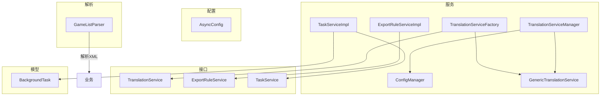
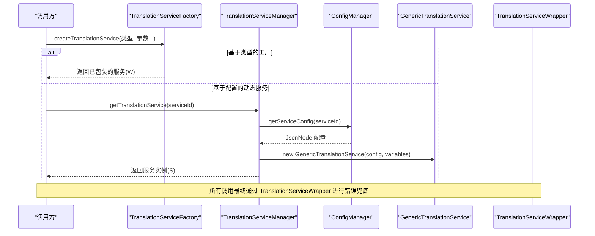
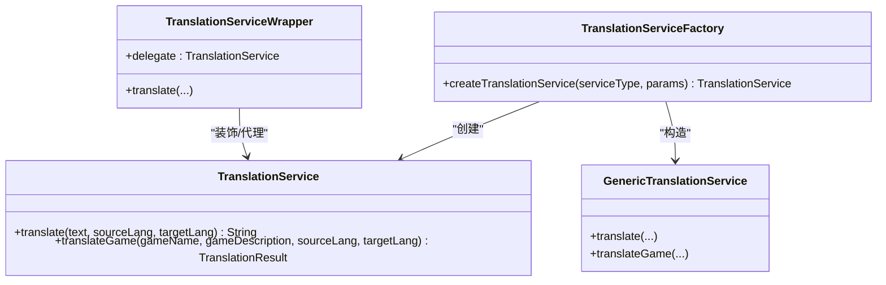
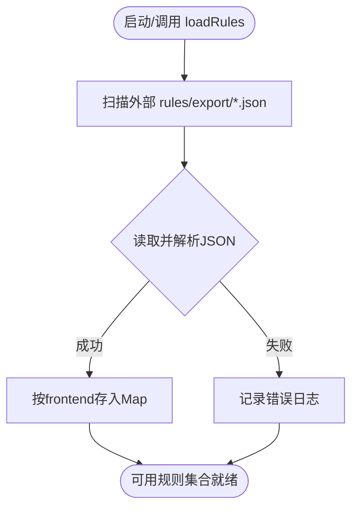
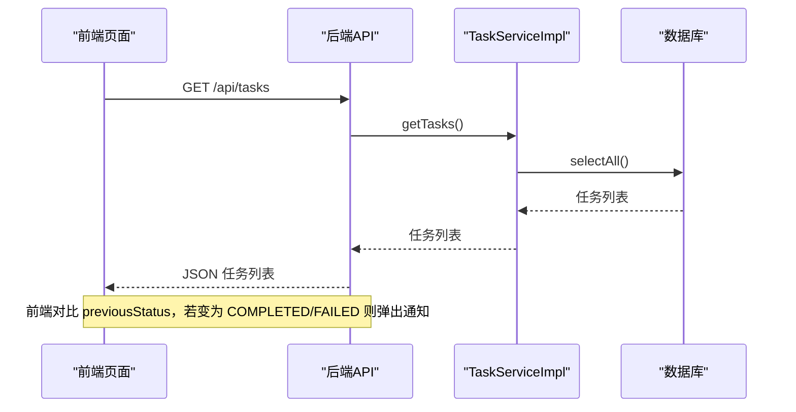
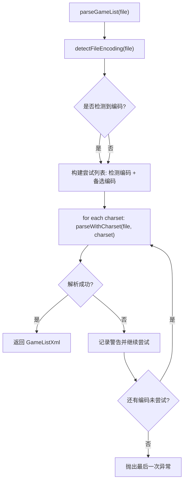
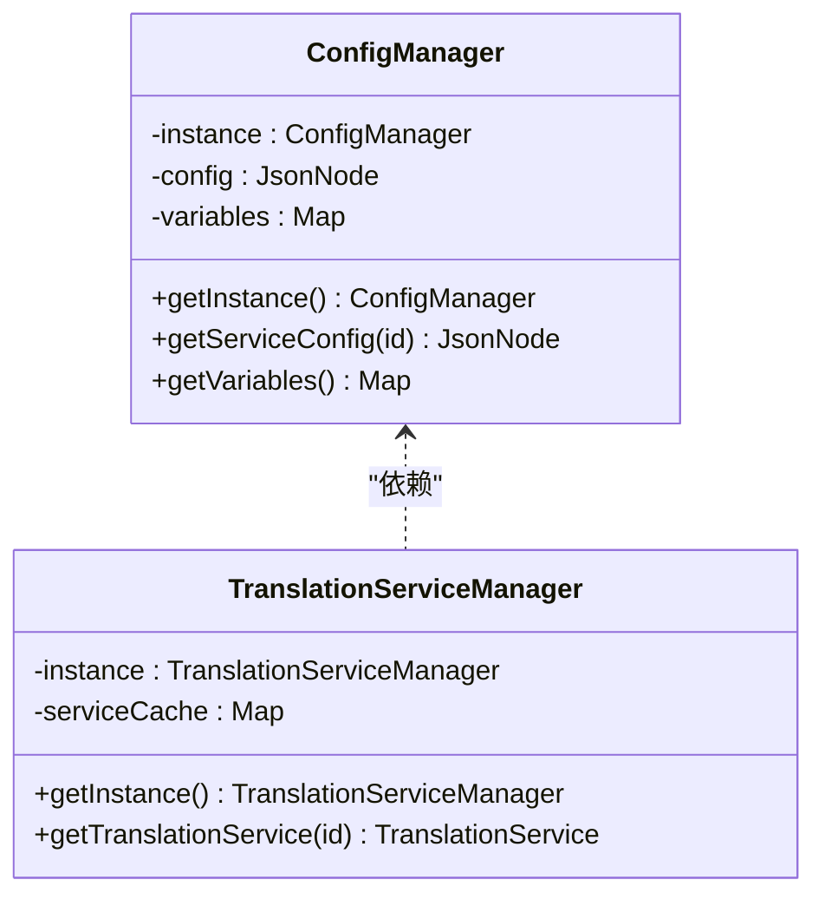
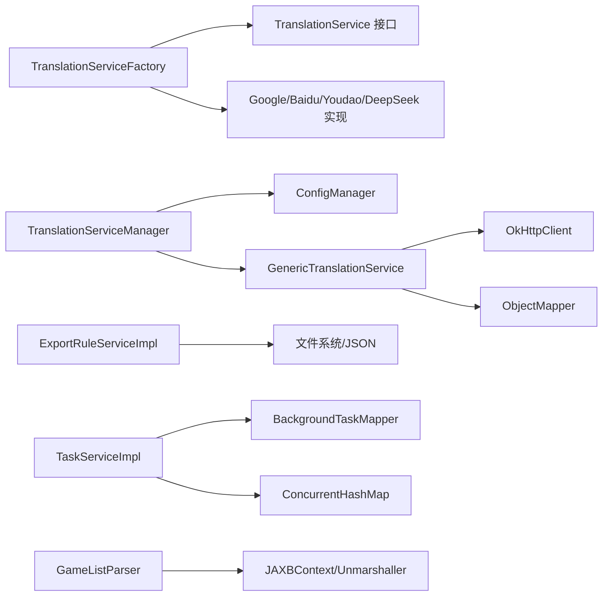

# 设计模式应用

<cite>
**本文引用的文件**
- [TranslationServiceFactory.java](file://src/main/java/com/gamelist/service/impl/TranslationServiceFactory.java)
- [TranslationService.java](file://src/main/java/com/gamelist/service/TranslationService.java)
- [GenericTranslationService.java](file://src/main/java/com/gamelist/service/impl/GenericTranslationService.java)
- [ConfigManager.java](file://src/main/java/com/gamelist/service/impl/ConfigManager.java)
- [TranslationServiceManager.java](file://src/main/java/com/gamelist/service/impl/TranslationServiceManager.java)
- [TranslationServiceWrapper.java](file://src/main/java/com/gamelist/service/impl/TranslationServiceWrapper.java)
- [ExportRuleService.java](file://src/main/java/com/gamelist/service/ExportRuleService.java)
- [ExportRuleServiceImpl.java](file://src/main/java/com/gamelist/service/impl/ExportRuleServiceImpl.java)
- [GameListParser.java](file://src/main/java/com/gamelist/xml/GameListParser.java)
- [TaskService.java](file://src/main/java/com/gamelist/service/TaskService.java)
- [TaskServiceImpl.java](file://src/main/java/com/gamelist/service/impl/TaskServiceImpl.java)
- [BackgroundTask.java](file://src/main/java/com/gamelist/model/BackgroundTask.java)
- [AsyncConfig.java](file://src/main/java/com/gamelist/config/AsyncConfig.java)
</cite>

## 目录
1. [简介](#简介)
2. [项目结构](#项目结构)
3. [核心组件](#核心组件)
4. [架构总览](#架构总览)
5. [详细组件分析](#详细组件分析)
6. [依赖关系分析](#依赖关系分析)
7. [性能考虑](#性能考虑)
8. [故障排查指南](#故障排查指南)
9. [结论](#结论)
10. [附录](#附录)

## 简介
本文件聚焦 WebGameListOper 项目中设计模式的落地实践，围绕以下主题展开：
- 工厂模式在翻译服务中的动态创建与统一封装
- 策略模式在导入导出规则处理中的应用
- 观察者模式在异步任务状态监控中的体现（前端轮询+后端状态变更）
- 模板方法模式在 XML 解析流程中的使用
- 单例模式、代理模式等在其他场景的应用
- 各模式的代码示例路径、选择原因与收益

## 项目结构
本项目采用分层组织：
- 配置层：异步配置、数据目录初始化、数据库迁移等
- 控制器层：对外暴露的 REST API
- 服务层：业务逻辑实现，包含翻译、导出、任务管理等
- 模型层：领域对象与请求/响应模型
- 工具与解析：XML/LPL 解析、变量替换、媒体查找等
- 资源与文档：规则 JSON、静态页面、说明文档

图表来源
- [AsyncConfig.java:1-14](file://src/main/java/com/gamelist/config/AsyncConfig.java#L1-L14)
- [TranslationServiceFactory.java:1-46](file://src/main/java/com/gamelist/service/impl/TranslationServiceFactory.java#L1-L46)
- [TranslationServiceManager.java:1-110](file://src/main/java/com/gamelist/service/impl/TranslationServiceManager.java#L1-L110)
- [ConfigManager.java:1-197](file://src/main/java/com/gamelist/service/impl/ConfigManager.java#L1-L197)
- [GenericTranslationService.java:1-443](file://src/main/java/com/gamelist/service/impl/GenericTranslationService.java#L1-L443)
- [ExportRuleServiceImpl.java:1-162](file://src/main/java/com/gamelist/service/impl/ExportRuleServiceImpl.java#L1-L162)
- [TaskServiceImpl.java:1-175](file://src/main/java/com/gamelist/service/impl/TaskServiceImpl.java#L1-L175)
- [BackgroundTask.java:1-114](file://src/main/java/com/gamelist/model/BackgroundTask.java#L1-L114)
- [GameListParser.java:1-730](file://src/main/java/com/gamelist/xml/GameListParser.java#L1-L730)

章节来源
- [AsyncConfig.java:1-14](file://src/main/java/com/gamelist/config/AsyncConfig.java#L1-L14)

## 核心组件
- 翻译服务工厂：根据类型参数动态创建具体翻译服务实例，并统一包装错误处理。
- 通用翻译服务：通过配置驱动（URL、Headers、Body、Params、ResponsePath、Parser）适配多种翻译 API。
- 配置管理器：单例加载 translation-config.json，提供变量替换与服务配置查询。
- 导出规则服务：从外部目录扫描 JSON 规则文件，按前端名称映射到规则对象。
- 任务服务：后台任务生命周期管理（创建、进度更新、完成/失败），配合前端轮询实现“观察者”效果。
- XML 解析器：多编码检测与尝试、JAXB 解组、平台识别与 LPL 播放列表解析。

章节来源
- [TranslationServiceFactory.java:1-46](file://src/main/java/com/gamelist/service/impl/TranslationServiceFactory.java#L1-L46)
- [GenericTranslationService.java:1-443](file://src/main/java/com/gamelist/service/impl/GenericTranslationService.java#L1-L443)
- [ConfigManager.java:1-197](file://src/main/java/com/gamelist/service/impl/ConfigManager.java#L1-L197)
- [ExportRuleServiceImpl.java:1-162](file://src/main/java/com/gamelist/service/impl/ExportRuleServiceImpl.java#L1-L162)
- [TaskServiceImpl.java:1-175](file://src/main/java/com/gamelist/service/impl/TaskServiceImpl.java#L1-L175)
- [GameListParser.java:1-730](file://src/main/java/com/gamelist/xml/GameListParser.java#L1-L730)

## 架构总览
下图展示了翻译服务的工厂创建、配置驱动与代理包装的整体交互。

图表来源
- [TranslationServiceFactory.java:1-46](file://src/main/java/com/gamelist/service/impl/TranslationServiceFactory.java#L1-L46)
- [TranslationServiceManager.java:1-110](file://src/main/java/com/gamelist/service/impl/TranslationServiceManager.java#L1-L110)
- [ConfigManager.java:1-197](file://src/main/java/com/gamelist/service/impl/ConfigManager.java#L1-L197)
- [GenericTranslationService.java:1-443](file://src/main/java/com/gamelist/service/impl/GenericTranslationService.java#L1-L443)
- [TranslationServiceWrapper.java:1-39](file://src/main/java/com/gamelist/service/impl/TranslationServiceWrapper.java#L1-L39)

## 详细组件分析

### 工厂模式：翻译服务动态创建
- 目标：屏蔽不同翻译供应商的差异，集中化创建与校验参数，统一返回可复用的服务实例。
- 关键点：
  - 根据 serviceType 分支创建 Google/Baidu/Youdao/DeepSeek 等实现
  - 对缺失参数进行严格校验，抛出明确异常
  - 返回前用 TranslationServiceWrapper 包裹，提供统一的错误回退策略
- 优势：
  - 新增翻译供应商只需扩展工厂分支，不改动调用方
  - 参数校验前置，降低运行时异常概率
  - 统一错误处理，提升健壮性

图表来源
- [TranslationService.java:1-33](file://src/main/java/com/gamelist/service/TranslationService.java#L1-L33)
- [TranslationServiceFactory.java:1-46](file://src/main/java/com/gamelist/service/impl/TranslationServiceFactory.java#L1-L46)
- [GenericTranslationService.java:1-443](file://src/main/java/com/gamelist/service/impl/GenericTranslationService.java#L1-L443)
- [TranslationServiceWrapper.java:1-39](file://src/main/java/com/gamelist/service/impl/TranslationServiceWrapper.java#L1-L39)

章节来源
- [TranslationServiceFactory.java:1-46](file://src/main/java/com/gamelist/service/impl/TranslationServiceFactory.java#L1-L46)
- [TranslationServiceWrapper.java:1-39](file://src/main/java/com/gamelist/service/impl/TranslationServiceWrapper.java#L1-L39)

### 策略模式：导入导出规则处理
- 目标：将不同前端/平台的导出规则以 JSON 形式配置，运行时按需加载与匹配，避免硬编码分支。
- 关键点：
  - ExportRuleService 定义规则加载与查询接口
  - ExportRuleServiceImpl 从外部 rules/export 目录扫描 *.json，反序列化为 ExportRule，并以 frontend 为键缓存
  - 支持类路径 fallback（JAR 内资源）与外部目录优先策略
- 优势：
  - 规则热插拔：新增/修改规则无需重新编译
  - 职责单一：规则加载与业务逻辑解耦
  - 可扩展：后续可按策略组合不同规则集

图表来源
- [ExportRuleService.java:1-29](file://src/main/java/com/gamelist/service/ExportRuleService.java#L1-L29)
- [ExportRuleServiceImpl.java:1-162](file://src/main/java/com/gamelist/service/impl/ExportRuleServiceImpl.java#L1-L162)

章节来源
- [ExportRuleService.java:1-29](file://src/main/java/com/gamelist/service/ExportRuleService.java#L1-L29)
- [ExportRuleServiceImpl.java:1-162](file://src/main/java/com/gamelist/service/impl/ExportRuleServiceImpl.java#L1-L162)

### 观察者模式：异步任务状态监控
- 目标：后台任务执行过程中，前端能够实时感知任务状态变化（进行中、完成、失败）。
- 关键点：
  - 后端 TaskServiceImpl 维护任务状态机（PENDING/RUNNING/COMPLETED/FAILED），持久化并缓存
  - 前端定时轮询 /api/tasks，比较上次状态，当进入终态时触发通知
  - AsyncConfig 启用 Spring 异步能力，便于后续扩展 @Async 任务
- 优势：
  - 松耦合：前后端仅通过任务状态交互，无需长连接
  - 易扩展：新增任务类型只需遵循状态约定
  - 用户体验好：即时反馈任务结果

图表来源
- [TaskService.java:1-72](file://src/main/java/com/gamelist/service/TaskService.java#L1-L72)
- [TaskServiceImpl.java:1-175](file://src/main/java/com/gamelist/service/impl/TaskServiceImpl.java#L1-L175)
- [BackgroundTask.java:1-114](file://src/main/java/com/gamelist/model/BackgroundTask.java#L1-L114)
- [AsyncConfig.java:1-14](file://src/main/java/com/gamelist/config/AsyncConfig.java#L1-L14)

章节来源
- [TaskServiceImpl.java:1-175](file://src/main/java/com/gamelist/service/impl/TaskServiceImpl.java#L1-L175)
- [BackgroundTask.java:1-114](file://src/main/java/com/gamelist/model/BackgroundTask.java#L1-L114)
- [AsyncConfig.java:1-14](file://src/main/java/com/gamelist/config/AsyncConfig.java#L1-L14)

### 模板方法模式：XML 解析流程
- 目标：将 XML 解析的固定步骤抽象为模板，复用公共流程（编码检测、BOM 处理、JAXB 解组、平台识别），同时允许差异点扩展。
- 关键点：
  - 编码检测：优先 BOM，其次 XML 声明，最后默认 UTF-8
  - 多编码尝试：按优先级依次尝试，直至成功或全部失败
  - JAXB 解组：设置忽略未知元素处理器，增强兼容性
  - 平台识别：基于 Provider 字段与游戏条目特征推断平台类型
- 优势：
  - 流程标准化：解析入口统一，减少重复代码
  - 容错性强：多编码与宽松解析提升鲁棒性
  - 易维护：新增编码或解析策略可在模板中集中调整

图表来源
- [GameListParser.java:1-730](file://src/main/java/com/gamelist/xml/GameListParser.java#L1-L730)

章节来源
- [GameListParser.java:1-730](file://src/main/java/com/gamelist/xml/GameListParser.java#L1-L730)

### 单例模式：配置与服务管理器
- ConfigManager：通过 getInstance() 保证全局唯一配置访问点，负责加载 translation-config.json 与变量替换表。
- TranslationServiceManager：同样以单例方式管理翻译服务实例缓存，避免重复创建与配置读取开销。
- 适用场景：配置中心、服务注册/发现、资源池等需要全局一致性的场景。

图表来源
- [ConfigManager.java:1-197](file://src/main/java/com/gamelist/service/impl/ConfigManager.java#L1-L197)
- [TranslationServiceManager.java:1-110](file://src/main/java/com/gamelist/service/impl/TranslationServiceManager.java#L1-L110)

章节来源
- [ConfigManager.java:1-197](file://src/main/java/com/gamelist/service/impl/ConfigManager.java#L1-L197)
- [TranslationServiceManager.java:1-110](file://src/main/java/com/gamelist/service/impl/TranslationServiceManager.java#L1-L110)

### 代理模式：翻译服务错误兜底
- TranslationServiceWrapper 作为代理，拦截 translate 调用，捕获异常并将无效结果回退为原文，确保上层稳定。
- 适用场景：横切关注点（如重试、限流、降级、审计）可通过代理统一注入。

章节来源
- [TranslationServiceWrapper.java:1-39](file://src/main/java/com/gamelist/service/impl/TranslationServiceWrapper.java#L1-L39)

## 依赖关系分析
- 翻译子系统：
  - TranslationServiceFactory 依赖 TranslationService 接口与具体实现（Google/Baidu/Youdao/DeepSeek）
  - TranslationServiceManager 依赖 ConfigManager 获取配置，构造 GenericTranslationService
  - GenericTranslationService 依赖 OkHttp、Jackson 进行 HTTP 请求与 JSON 处理
- 导出规则子系统：
  - ExportRuleServiceImpl 依赖 Jackson ObjectMapper 与文件系统 API
- 任务子系统：
  - TaskServiceImpl 依赖 BackgroundTaskMapper（持久化）、ConcurrentHashMap（缓存）、AtomicLong（ID 生成）
- XML 解析子系统：
  - GameListParser 依赖 JAXBContext/Unmarshaller、字符集检测与正则表达式

图表来源
- [TranslationServiceFactory.java:1-46](file://src/main/java/com/gamelist/service/impl/TranslationServiceFactory.java#L1-L46)
- [TranslationServiceManager.java:1-110](file://src/main/java/com/gamelist/service/impl/TranslationServiceManager.java#L1-L110)
- [GenericTranslationService.java:1-443](file://src/main/java/com/gamelist/service/impl/GenericTranslationService.java#L1-L443)
- [ExportRuleServiceImpl.java:1-162](file://src/main/java/com/gamelist/service/impl/ExportRuleServiceImpl.java#L1-L162)
- [TaskServiceImpl.java:1-175](file://src/main/java/com/gamelist/service/impl/TaskServiceImpl.java#L1-L175)
- [GameListParser.java:1-730](file://src/main/java/com/gamelist/xml/GameListParser.java#L1-L730)

章节来源
- [TranslationServiceFactory.java:1-46](file://src/main/java/com/gamelist/service/impl/TranslationServiceFactory.java#L1-L46)
- [TranslationServiceManager.java:1-110](file://src/main/java/com/gamelist/service/impl/TranslationServiceManager.java#L1-L110)
- [GenericTranslationService.java:1-443](file://src/main/java/com/gamelist/service/impl/GenericTranslationService.java#L1-L443)
- [ExportRuleServiceImpl.java:1-162](file://src/main/java/com/gamelist/service/impl/ExportRuleServiceImpl.java#L1-L162)
- [TaskServiceImpl.java:1-175](file://src/main/java/com/gamelist/service/impl/TaskServiceImpl.java#L1-L175)
- [GameListParser.java:1-730](file://src/main/java/com/gamelist/xml/GameListParser.java#L1-L730)

## 性能考虑
- 翻译服务：
  - 连接池与超时：OkHttpClient 合理设置连接/读写超时，避免阻塞
  - 响应解析：通过 responsePath/responseParser 精准提取字段，减少额外处理
  - 缓存：TranslationServiceManager 缓存服务实例，避免重复构造
- 导出规则：
  - 首次扫描后内存缓存 Map，查询 O(1)
  - 外部目录优先，减少类路径资源 IO
- 任务系统：
  - 并发安全：ConcurrentHashMap + AtomicLong + ReentrantLock 保证线程安全
  - 延迟初始化 ID 生成器，避免冷启动 DB 压力
- XML 解析：
  - 多编码尝试带来一定开销，但显著提升兼容性；必要时可限制尝试次数或引入启发式编码检测

[本节为通用指导，不直接分析具体文件]

## 故障排查指南
- 翻译服务不可用：
  - 检查配置文件中 requiredVariables 是否齐全（如 google_api_key、microsoft_api_key 等）
  - 查看网络连通性与 API 返回码，确认 responsePath 是否正确
  - 参考：[ConfigManager.java:52-152](file://src/main/java/com/gamelist/service/impl/ConfigManager.java#L52-L152)、[GenericTranslationService.java:203-244](file://src/main/java/com/gamelist/service/impl/GenericTranslationService.java#L203-L244)
- 导出规则未加载：
  - 确认外部 rules/export 目录存在且可读
  - 检查 JSON 文件格式与 frontend 字段是否为空
  - 参考：[ExportRuleServiceImpl.java:41-101](file://src/main/java/com/gamelist/service/impl/ExportRuleServiceImpl.java#L41-L101)
- 任务无状态更新：
  - 确认前端轮询间隔与后端 updateTaskProgress/failTask/completeTask 调用链正常
  - 检查数据库写入与缓存一致性
  - 参考：[TaskServiceImpl.java:59-141](file://src/main/java/com/gamelist/service/impl/TaskServiceImpl.java#L59-L141)
- XML 解析失败：
  - 查看日志中的编码尝试与最后一次异常堆栈
  - 检查 BOM 与 XML 声明 encoding 是否一致
  - 参考：[GameListParser.java:104-162](file://src/main/java/com/gamelist/xml/GameListParser.java#L104-L162)、[GameListParser.java:319-384](file://src/main/java/com/gamelist/xml/GameListParser.java#L319-L384)

章节来源
- [ConfigManager.java:52-152](file://src/main/java/com/gamelist/service/impl/ConfigManager.java#L52-L152)
- [GenericTranslationService.java:203-244](file://src/main/java/com/gamelist/service/impl/GenericTranslationService.java#L203-L244)
- [ExportRuleServiceImpl.java:41-101](file://src/main/java/com/gamelist/service/impl/ExportRuleServiceImpl.java#L41-L101)
- [TaskServiceImpl.java:59-141](file://src/main/java/com/gamelist/service/impl/TaskServiceImpl.java#L59-L141)
- [GameListParser.java:104-162](file://src/main/java/com/gamelist/xml/GameListParser.java#L104-L162)
- [GameListParser.java:319-384](file://src/main/java/com/gamelist/xml/GameListParser.java#L319-L384)

## 结论
本项目在多模块中系统性地应用了多种经典设计模式：
- 工厂模式简化了翻译服务的创建与参数校验，结合代理模式提供统一错误兜底
- 策略模式通过 JSON 规则实现导出策略的动态装配，提升扩展性与可维护性
- 观察者模式以前后端协作的方式实现了异步任务的可视化管理
- 模板方法模式规范了 XML 解析流程，增强了兼容性与可测试性
- 单例模式用于配置与服务管理器，保障全局一致性与资源复用

这些模式共同提升了系统的可扩展性、可维护性与健壮性，并为后续功能演进奠定了良好基础。

[本节为总结性内容，不直接分析具体文件]

## 附录
- 最佳实践建议
  - 工厂：新增实现时同步完善参数校验与文档
  - 策略：保持规则 JSON 的结构稳定，提供校验与版本控制
  - 观察者：统一任务状态枚举与消息格式，避免歧义
  - 模板方法：将可变点抽取为可插拔策略，保持主流程稳定
  - 单例：谨慎使用，确保线程安全与懒加载
  - 代理：将横切关注点（重试、限流、降级）集中管理

[本节为通用指导，不直接分析具体文件]