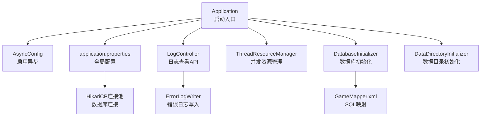
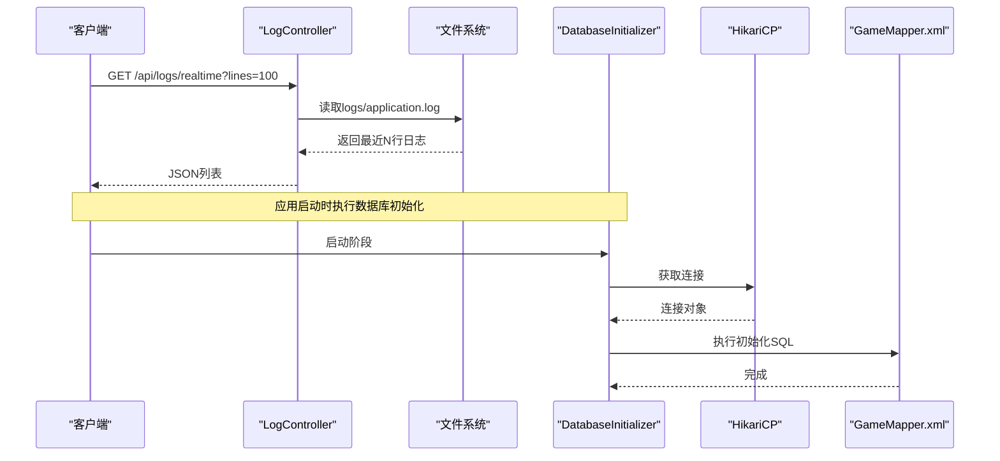
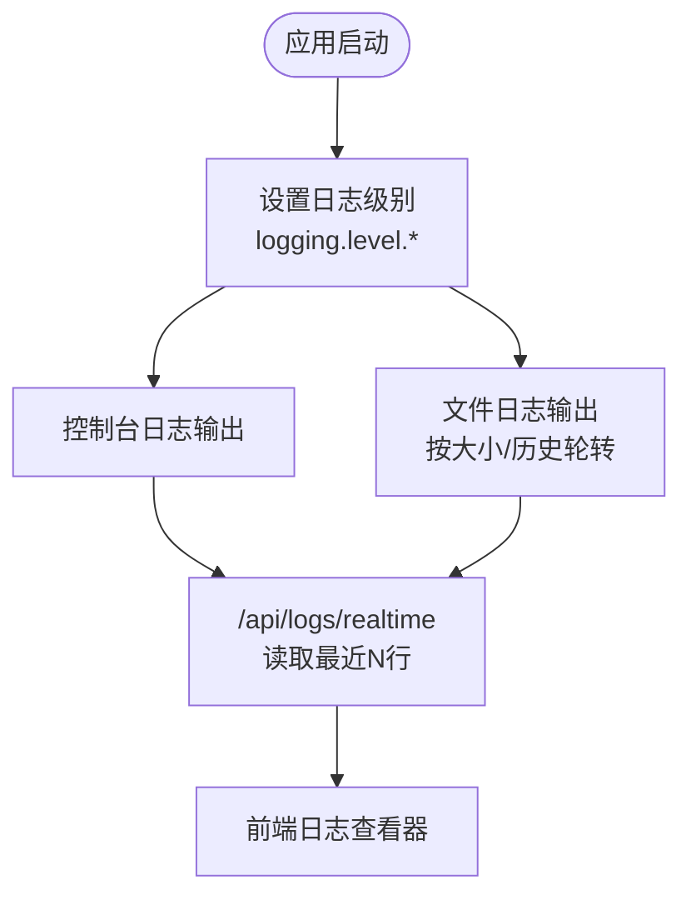
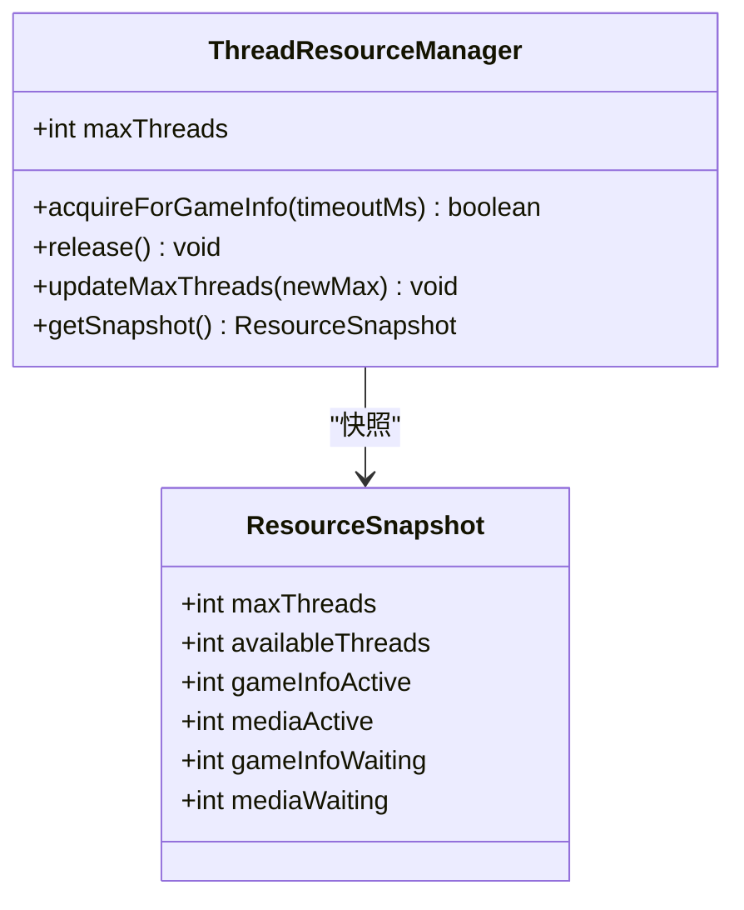
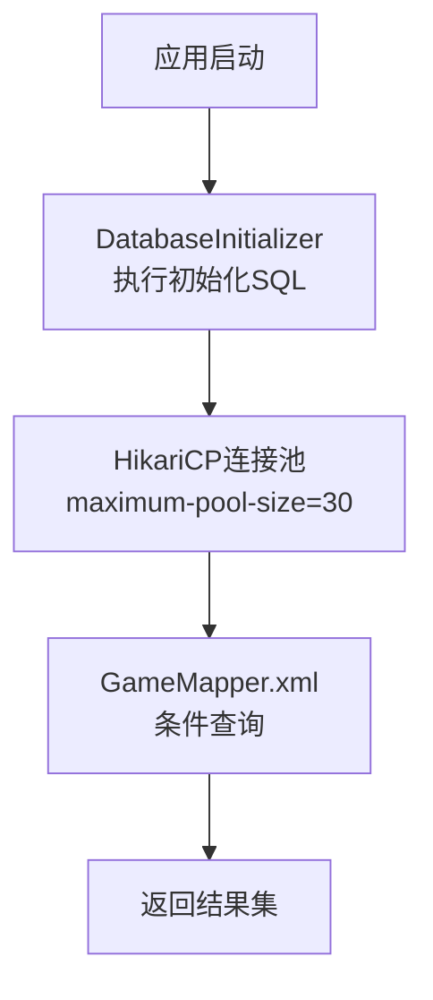
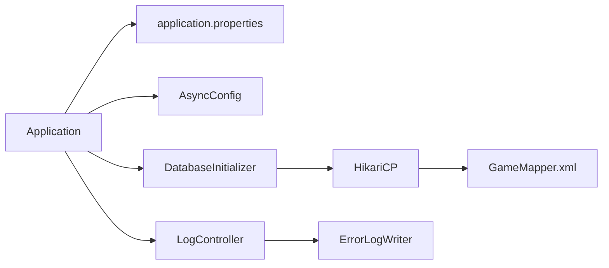
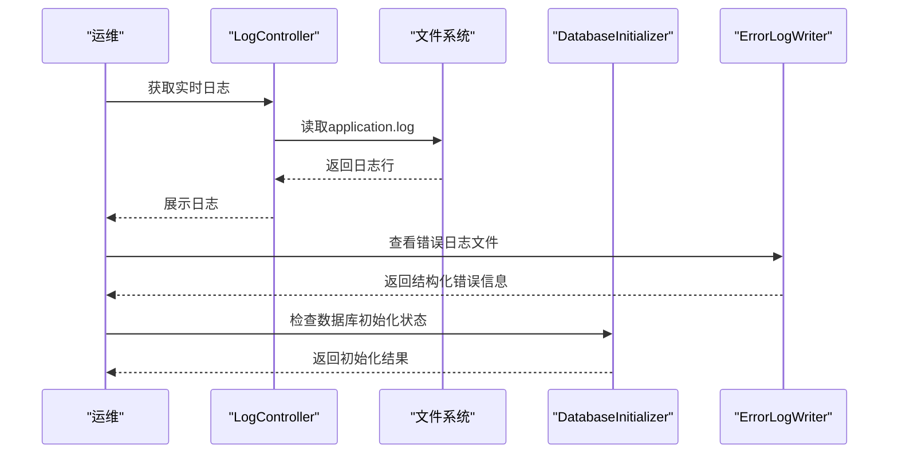

# 调试与性能优化

<cite>
**本文引用的文件**
- [Application.java](file://src/main/java/com/gamelist/Application.java)
- [application.properties](file://src/main/resources/application.properties)
- [pom.xml](file://pom.xml)
- [LogController.java](file://src/main/java/com/gamelist/controller/LogController.java)
- [ErrorLogWriter.java](file://src/main/java/com/gamelist/util/ErrorLogWriter.java)
- [AsyncConfig.java](file://src/main/java/com/gamelist/config/AsyncConfig.java)
- [ThreadResourceManager.java](file://src/main/java/com/gamelist/service/ThreadResourceManager.java)
- [GameMapper.xml](file://src/main/resources/mappers/GameMapper.xml)
- [DatabaseInitializer.java](file://src/main/java/com/gamelist/config/DatabaseInitializer.java)
- [DataDirectoryInitializer.java](file://src/main/java/com/gamelist/config/DataDirectoryInitializer.java)
- [Configuration.md](file://wiki/Configuration.md)
</cite>

## 目录
1. [简介](#简介)
2. [项目结构](#项目结构)
3. [核心组件](#核心组件)
4. [架构总览](#架构总览)
5. [详细组件分析](#详细组件分析)
6. [依赖关系分析](#依赖关系分析)
7. [性能考量](#性能考量)
8. [故障排查指南](#故障排查指南)
9. [结论](#结论)
10. [附录](#附录)

## 简介
本指南面向WebGameListOper项目的开发与运维人员，聚焦于调试技巧、日志系统配置与使用、性能分析方法（内存泄漏检测、CPU使用率分析、数据库查询优化）、常见瓶颈识别与解决方案、缓存策略优化、并发编程调优，以及生产环境的问题排查方法与监控指标。内容基于仓库中的实际代码与配置进行说明，确保可操作性与可追溯性。

## 项目结构
本项目为Spring Boot应用，采用分层架构：
- 启动入口：Application类启用异步能力与MyBatis Mapper扫描
- 配置：application.properties集中管理服务器、数据库连接池、日志、静态资源等
- 控制器：提供日志查看、任务管理等API
- 服务层：包含线程资源管理、导出导入、翻译服务等
- 数据访问：MyBatis XML映射与H2数据库
- 工具：错误日志写入、速率限制等

图表来源
- [Application.java:8-14](file://src/main/java/com/gamelist/Application.java#L8-L14)
- [AsyncConfig.java:10-12](file://src/main/java/com/gamelist/config/AsyncConfig.java#L10-L12)
- [application.properties:1-86](file://src/main/resources/application.properties#L1-L86)
- [LogController.java:16-78](file://src/main/java/com/gamelist/controller/LogController.java#L16-L78)
- [ThreadResourceManager.java:27-124](file://src/main/java/com/gamelist/service/ThreadResourceManager.java#L27-L124)
- [DatabaseInitializer.java:23-32](file://src/main/java/com/gamelist/config/DatabaseInitializer.java#L23-L32)
- [DataDirectoryInitializer.java:87-106](file://src/main/java/com/gamelist/config/DataDirectoryInitializer.java#L87-L106)
- [GameMapper.xml:181-207](file://src/main/resources/mappers/GameMapper.xml#L181-L207)

章节来源
- [Application.java:8-14](file://src/main/java/com/gamelist/Application.java#L8-L14)
- [application.properties:1-86](file://src/main/resources/application.properties#L1-L86)

## 核心组件
- 启动与异步：Application启用@EnableAsync；AsyncConfig进一步声明异步能力
- 日志系统：application.properties配置控制台与文件日志；LogController提供实时日志读取；ErrorLogWriter输出结构化错误日志
- 并发与资源：ThreadResourceManager动态分配线程资源，区分游戏信息刮削与媒体下载优先级
- 数据库：HikariCP连接池配置；DatabaseInitializer执行初始化脚本；GameMapper.xml定义查询语句
- 配置与路径：DataDirectoryInitializer在应用早期创建必要目录，避免权限问题

章节来源
- [AsyncConfig.java:10-12](file://src/main/java/com/gamelist/config/AsyncConfig.java#L10-L12)
- [application.properties:43-53](file://src/main/resources/application.properties#L43-L53)
- [LogController.java:16-78](file://src/main/java/com/gamelist/controller/LogController.java#L16-L78)
- [ErrorLogWriter.java:1-189](file://src/main/java/com/gamelist/util/ErrorLogWriter.java#L1-L189)
- [ThreadResourceManager.java:27-124](file://src/main/java/com/gamelist/service/ThreadResourceManager.java#L27-L124)
- [application.properties:21-27](file://src/main/resources/application.properties#L21-L27)
- [DatabaseInitializer.java:23-32](file://src/main/java/com/gamelist/config/DatabaseInitializer.java#L23-L32)
- [GameMapper.xml:181-207](file://src/main/resources/mappers/GameMapper.xml#L181-L207)
- [DataDirectoryInitializer.java:87-106](file://src/main/java/com/gamelist/config/DataDirectoryInitializer.java#L87-L106)

## 架构总览
下图展示请求从控制器到服务、数据库的调用链，以及日志与错误记录的路径。

图表来源
- [LogController.java:23-42](file://src/main/java/com/gamelist/controller/LogController.java#L23-L42)
- [application.properties:43-53](file://src/main/resources/application.properties#L43-L53)
- [DatabaseInitializer.java:23-32](file://src/main/java/com/gamelist/config/DatabaseInitializer.java#L23-L32)
- [GameMapper.xml:181-207](file://src/main/resources/mappers/GameMapper.xml#L181-L207)

## 详细组件分析

### 调试技巧（IDE断点、变量监视、调用栈）
- 远程调试
  - 通过JVM参数开启远程调试端口，便于在生产或容器环境中附加IDE进行断点调试
  - 参考文档中提供的JVM参数示例，可在启动命令中加入远程调试选项
- 本地调试
  - 使用Spring Boot DevTools（可选）提升热重载体验
  - 在关键控制器或服务方法设置断点，观察入参、出参与异常堆栈
- 日志辅助
  - 结合LogController的实时日志接口，快速定位问题上下文
  - 使用ErrorLogWriter输出的结构化错误日志，缩小问题范围

章节来源
- [Configuration.md:171-185](file://wiki/Configuration.md#L171-L185)
- [LogController.java:23-42](file://src/main/java/com/gamelist/controller/LogController.java#L23-L42)
- [ErrorLogWriter.java:1-189](file://src/main/java/com/gamelist/util/ErrorLogWriter.java#L1-L189)

### 日志系统配置与使用
- 日志级别与格式
  - 控制台与文件日志均支持自定义格式，包含时间戳、线程、级别、类名与消息
  - 建议将业务模块日志级别设置为INFO，调试时临时调整为DEBUG
- 日志轮转
  - 文件日志按大小与保留天数进行轮转，避免磁盘占用过大
- 实时日志查看
  - 通过/api/logs/realtime接口读取最近N行日志，便于前端展示与快速排障
- 错误日志
  - ErrorLogWriter按操作类型与平台生成独立错误日志文件，便于分类归档与回溯

图表来源
- [application.properties:43-53](file://src/main/resources/application.properties#L43-L53)
- [LogController.java:23-42](file://src/main/java/com/gamelist/controller/LogController.java#L23-L42)
- [ErrorLogWriter.java:1-189](file://src/main/java/com/gamelist/util/ErrorLogWriter.java#L1-L189)

章节来源
- [application.properties:43-53](file://src/main/resources/application.properties#L43-L53)
- [LogController.java:23-42](file://src/main/java/com/gamelist/controller/LogController.java#L23-L42)
- [ErrorLogWriter.java:1-189](file://src/main/java/com/gamelist/util/ErrorLogWriter.java#L1-L189)

### 并发与线程资源管理
- ThreadResourceManager负责动态分配线程资源，保证总并发不超过上限，并优先保障游戏信息刮削线程
- 使用ReentrantLock与Condition实现等待与唤醒机制，避免死锁
- 提供超时机制，防止长时间阻塞

图表来源
- [ThreadResourceManager.java:27-124](file://src/main/java/com/gamelist/service/ThreadResourceManager.java#L27-L124)
- [ThreadResourceManager.java:363-376](file://src/main/java/com/gamelist/service/ThreadResourceManager.java#L363-L376)

章节来源
- [ThreadResourceManager.java:27-124](file://src/main/java/com/gamelist/service/ThreadResourceManager.java#L27-L124)
- [ThreadResourceManager.java:363-376](file://src/main/java/com/gamelist/service/ThreadResourceManager.java#L363-L376)

### 数据库与查询优化
- 连接池配置
  - HikariCP最大连接数、空闲超时、连接超时、生命周期等参数已配置，可根据负载调整
- 初始化与迁移
  - DatabaseInitializer在启动时执行初始化脚本，确保基础表存在
  - Flyway迁移已禁用自动配置，使用自定义基线版本
- 查询优化
  - GameMapper.xml中包含条件查询，注意LIKE模糊匹配的性能影响
  - 建议在大数据量场景下增加索引，减少全表扫描

图表来源
- [DatabaseInitializer.java:23-32](file://src/main/java/com/gamelist/config/DatabaseInitializer.java#L23-L32)
- [application.properties:21-27](file://src/main/resources/application.properties#L21-L27)
- [GameMapper.xml:181-207](file://src/main/resources/mappers/GameMapper.xml#L181-L207)

章节来源
- [application.properties:21-27](file://src/main/resources/application.properties#L21-L27)
- [DatabaseInitializer.java:23-32](file://src/main/java/com/gamelist/config/DatabaseInitializer.java#L23-L32)
- [GameMapper.xml:181-207](file://src/main/resources/mappers/GameMapper.xml#L181-L207)

### 缓存策略与优化
- 当前代码未内置通用缓存框架（如Caffeine/Redis），可通过以下方式引入：
  - 方法级缓存：对读多写少的接口使用@Cacheable注解
  - 本地缓存：使用Caffeine作为进程内缓存，降低数据库压力
  - 分布式缓存：在高并发场景引入Redis，共享缓存状态
- 缓存键设计：以平台ID、查询条件组合为键，避免冲突
- 失效策略：TTL过期+主动失效（更新后删除）

[本节为概念性内容，不直接分析具体文件]

### 性能分析方法
- 内存泄漏检测
  - 使用JDK自带jmap/jhat或VisualVM分析堆转储，定位大对象与潜在泄漏
  - 关注频繁GC导致的停顿，结合Heap Dump分析对象引用链
- CPU使用率分析
  - 使用jstack抓取线程快照，结合top/htop定位热点线程
  - 使用async-profiler或JFR进行火焰图分析，定位热点方法
- 数据库查询优化
  - 使用EXPLAIN分析慢查询，添加合适索引
  - 减少N+1查询，合并批量操作
- 网络与I/O
  - 检查外部API调用耗时，合理设置超时与重试
  - 文件读写使用缓冲流，避免频繁小文件IO

[本节为通用指导，不直接分析具体文件]

### 常见性能瓶颈与解决方案
- 连接池不足导致请求排队
  - 调整maximum-pool-size与connection-timeout，监控连接使用率
- 模糊查询性能差
  - 对高频搜索字段建立索引，或使用全文检索方案
- 高并发下的线程争用
  - 通过ThreadResourceManager控制并发，避免资源耗尽
- 日志写入阻塞
  - 使用异步日志或落盘策略，避免同步IO阻塞主流程

章节来源
- [application.properties:21-27](file://src/main/resources/application.properties#L21-L27)
- [GameMapper.xml:181-207](file://src/main/resources/mappers/GameMapper.xml#L181-L207)
- [ThreadResourceManager.java:27-124](file://src/main/java/com/gamelist/service/ThreadResourceManager.java#L27-L124)

## 依赖关系分析
- 启动依赖：Application依赖Spring Boot与MyBatis，启用异步
- 配置依赖：application.properties驱动Tomcat、HikariCP、MyBatis、Flyway、H2控制台
- 运行时依赖：LogController依赖文件系统读取日志；ErrorLogWriter写入错误日志
- 数据访问依赖：DatabaseInitializer与GameMapper.xml协同完成数据库初始化与查询

图表来源
- [Application.java:8-14](file://src/main/java/com/gamelist/Application.java#L8-L14)
- [application.properties:1-86](file://src/main/resources/application.properties#L1-L86)
- [LogController.java:16-78](file://src/main/java/com/gamelist/controller/LogController.java#L16-L78)
- [DatabaseInitializer.java:23-32](file://src/main/java/com/gamelist/config/DatabaseInitializer.java#L23-L32)
- [GameMapper.xml:181-207](file://src/main/resources/mappers/GameMapper.xml#L181-L207)
- [ErrorLogWriter.java:1-189](file://src/main/java/com/gamelist/util/ErrorLogWriter.java#L1-L189)

章节来源
- [Application.java:8-14](file://src/main/java/com/gamelist/Application.java#L8-L14)
- [application.properties:1-86](file://src/main/resources/application.properties#L1-L86)

## 性能考量
- 连接池调优
  - maximum-pool-size根据并发与数据库承载能力调整，避免过多连接导致上下文切换开销
  - idle-timeout与max-lifetime平衡连接复用与资源释放
- 异步处理
  - 启用@EnableAsync后，长耗时任务应放入异步线程池，避免阻塞请求线程
- 日志与IO
  - 文件日志轮转避免无限增长；必要时将日志异步化
- 数据库查询
  - 减少不必要的列选择，避免SELECT *；合理使用WHERE条件与索引

章节来源
- [application.properties:21-27](file://src/main/resources/application.properties#L21-L27)
- [AsyncConfig.java:10-12](file://src/main/java/com/gamelist/config/AsyncConfig.java#L10-L12)
- [application.properties:43-53](file://src/main/resources/application.properties#L43-L53)
- [GameMapper.xml:181-207](file://src/main/resources/mappers/GameMapper.xml#L181-L207)

## 故障排查指南
- 日志查看
  - 使用/api/logs/realtime获取最近日志，结合前端日志查看器快速定位问题
- 错误日志
  - ErrorLogWriter按操作类型与平台生成错误日志，便于分类分析与归档
- 数据库问题
  - 检查DatabaseInitializer是否成功执行；确认HikariCP连接池状态
- 目录权限
  - DataDirectoryInitializer在应用早期创建必要目录，避免无权限错误

图表来源
- [LogController.java:23-42](file://src/main/java/com/gamelist/controller/LogController.java#L23-L42)
- [ErrorLogWriter.java:1-189](file://src/main/java/com/gamelist/util/ErrorLogWriter.java#L1-L189)
- [DatabaseInitializer.java:23-32](file://src/main/java/com/gamelist/config/DatabaseInitializer.java#L23-L32)

章节来源
- [LogController.java:23-42](file://src/main/java/com/gamelist/controller/LogController.java#L23-L42)
- [ErrorLogWriter.java:1-189](file://src/main/java/com/gamelist/util/ErrorLogWriter.java#L1-L189)
- [DatabaseInitializer.java:23-32](file://src/main/java/com/gamelist/config/DatabaseInitializer.java#L23-L32)

## 结论
本项目具备完善的日志系统与并发资源管理能力，配合合理的数据库连接池配置与查询优化，可满足中等规模的业务需求。建议在生产环境中引入缓存与更丰富的监控指标，进一步提升稳定性与性能。调试方面，结合远程调试与日志接口，可高效定位问题。

## 附录
- 远程调试参数示例与日志级别说明见配置文档
- 构建与运行相关插件配置见Maven POM

章节来源
- [Configuration.md:151-185](file://wiki/Configuration.md#L151-L185)
- [pom.xml:108-150](file://pom.xml#L108-L150)