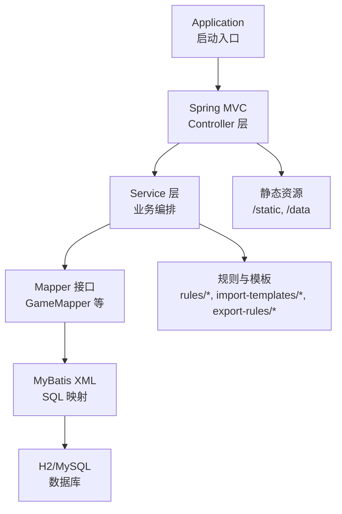
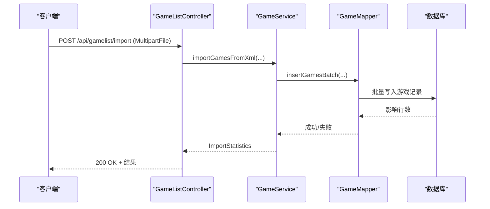
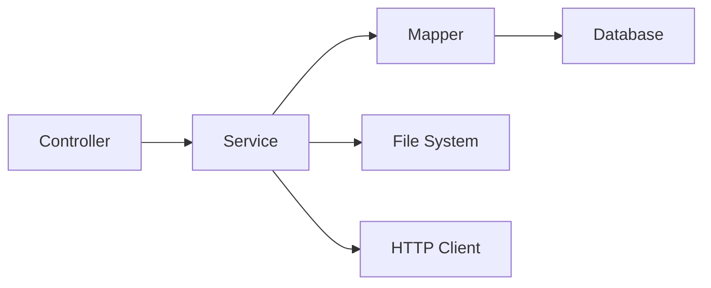

# 项目结构说明

<cite>
**本文引用的文件**
- [Application.java](file://src/main/java/com/gamelist/Application.java)
- [pom.xml](file://pom.xml)
- [application.properties](file://src/main/resources/application.properties)
- [WebConfig.java](file://src/main/java/com/gamelist/config/WebConfig.java)
- [GameListController.java](file://src/main/java/com/gamelist/controller/GameListController.java)
- [GameService.java](file://src/main/java/com/gamelist/service/GameService.java)
- [GameMapper.java](file://src/main/java/com/gamelist/mapper/GameMapper.java)
- [GameMapper.xml](file://src/main/resources/mappers/GameMapper.xml)
- [Game.java](file://src/main/java/com/gamelist/model/Game.java)
</cite>

## 目录
1. [简介](#简介)
2. [项目结构](#项目结构)
3. [核心组件](#核心组件)
4. [架构总览](#架构总览)
5. [详细组件分析](#详细组件分析)
6. [依赖关系分析](#依赖关系分析)
7. [性能考量](#性能考量)
8. [故障排查指南](#故障排查指南)
9. [结论](#结论)
10. [附录：新模块添加指南](#附录新模块添加指南)

## 简介
本项目是一个基于 Spring Boot 的 Web 应用，用于管理游戏列表与媒体资源，提供导入、扫描、导出、刮削、平台管理等能力。后端采用 Controller-Service-Mapper 分层架构，数据持久化使用 MyBatis + H2（可切换至 MySQL），通过 Flyway 进行数据库迁移，静态资源与模板位于 resources/static，规则与模板以 JSON 形式组织在 rules 与 resources/import-templates/export-rules 下。

## 项目结构
- 入口类：com.gamelist.Application 启动 Spring Boot 应用，启用异步任务并扫描 Mapper。
- 包划分：
  - controller：HTTP 接口层，处理请求与响应。
  - service：业务逻辑层，封装复杂流程与事务边界。
  - model：数据模型，对应数据库表结构与业务对象。
  - mapper：数据访问接口，配合 XML 映射完成 SQL 操作。
  - config：配置类，如 Web 资源映射、异步、初始化等。
  - util/xml：工具与解析器，如 XML/JSON 解析、变量替换、速率限制等。
- 资源与配置：
  - application.properties：服务器、编码、静态资源、数据库、日志、上传路径、规则路径等。
  - mappers/*.xml：MyBatis SQL 映射。
  - db/migration：Flyway 迁移脚本。
  - static：前端页面与静态资源。
  - import-templates/export-rules：内置导入模板与导出规则。
  - sql/init.sql：初始建表脚本（在 Flyway 之前执行）。

图表来源
- [Application.java:8-14](file://src/main/java/com/gamelist/Application.java#L8-L14)
- [WebConfig.java:11-20](file://src/main/java/com/gamelist/config/WebConfig.java#L11-L20)
- [application.properties:10-86](file://src/main/resources/application.properties#L10-L86)

章节来源
- [Application.java:8-14](file://src/main/java/com/gamelist/Application.java#L8-L14)
- [pom.xml:23-106](file://pom.xml#L23-L106)
- [application.properties:1-86](file://src/main/resources/application.properties#L1-L86)

## 核心组件
- 控制器层（controller）
  - 负责接收 HTTP 请求、参数校验、调用 Service、返回统一响应体。
  - 示例：游戏列表导入、扫描、分页查询、统计、批量更新/删除、迁移等。
- 服务层（service）
  - 实现具体业务逻辑，协调多个 Mapper 与外部资源（文件系统、网络 API）。
  - 示例：XML/Pegasus/LPL 导入、文件扫描、统计聚合、合并盘片、批量更新/迁移。
- 数据模型（model）
  - 定义领域实体与 DTO，如 Game、Platform、Statistics、ImportRequest 等。
  - 字段覆盖广泛，包含基础信息、媒体资源、平台特定字段与状态标记。
- 数据访问（mapper）
  - 定义 DAO 接口，配合 XML 中的 SQL 完成 CRUD、筛选、统计、唯一值获取等。
  - 支持批量插入、条件查询、按平台过滤、去重与合并相关查询。

章节来源
- [GameListController.java:39-551](file://src/main/java/com/gamelist/controller/GameListController.java#L39-L551)
- [GameService.java:13-61](file://src/main/java/com/gamelist/service/GameService.java#L13-L61)
- [Game.java:5-650](file://src/main/java/com/gamelist/model/Game.java#L5-L650)
- [GameMapper.java:11-76](file://src/main/java/com/gamelist/mapper/GameMapper.java#L11-L76)

## 架构总览
整体遵循典型三层架构：
- 表现层：RESTful 接口，统一错误处理与分页封装。
- 业务层：流程编排、规则应用、并发控制、异常转换。
- 数据层：MyBatis 映射 + Flyway 迁移，支持 H2/MySQL。

图表来源
- [GameListController.java:54-74](file://src/main/java/com/gamelist/controller/GameListController.java#L54-L74)
- [GameService.java:14-25](file://src/main/java/com/gamelist/service/GameService.java#L14-L25)
- [GameMapper.xml:74-99](file://src/main/resources/mappers/GameMapper.xml#L74-L99)

## 详细组件分析

### 控制器层（Controller）
- 职责
  - 暴露 REST API，处理文件上传、扫描、查询、统计、批量操作。
  - 对异常进行捕获并返回结构化错误信息。
- 关键接口
  - 导入：POST /api/gamelist/import
  - 扫描：POST /api/gamelist/scan、/scan-pegasus
  - 查询：GET /api/gamelist/games、/platforms/{id}/games
  - 统计：GET /api/gamelist/statistics/overall、/statistics/platforms
  - 更新/迁移/合并：PUT /api/gamelist/games、/games/migrate、/merge-discs
  - 批量操作：PUT /api/gamelist/games/batch、DELETE /api/gamelist/games/batch-delete
- 设计要点
  - 统一返回 ResponseEntity，便于前端处理。
  - 分页在 Controller 层计算起止索引，减少内存占用。
  - 对空参、非法 ID 等进行前置校验，避免无效请求进入 Service。

章节来源
- [GameListController.java:39-551](file://src/main/java/com/gamelist/controller/GameListController.java#L39-L551)

### 服务层（Service）
- 职责
  - 封装导入、扫描、统计、合并、迁移等业务流程。
  - 协调多 Mapper 调用，保证事务一致性与错误回滚。
- 关键能力
  - 多种格式导入：XML、Pegasus metadata、Lakka .lpl。
  - 文件扫描：递归扫描指定根路径，提取元数据并入库。
  - 统计：总体统计、平台维度统计、按刮削状态分页。
  - 批量更新/迁移：将游戏迁移到目标平台，或批量修改字段。
  - 合盘：将同一游戏的多个 Disc 合并为一条记录。
- 设计要点
  - 方法重载丰富，适配不同导入场景与线程数配置。
  - 对外抛出业务异常，由上层统一处理。

章节来源
- [GameService.java:13-61](file://src/main/java/com/gamelist/service/GameService.java#L13-L61)

### 数据模型（Model）
- 核心实体
  - Game：游戏主实体，包含名称、描述、媒体资源、平台信息、哈希、状态等。
  - Platform、Statistics、ImportStatistics、ScanResult 等辅助模型。
- 设计要点
  - 字段命名与数据库列名通过 ResultMap 映射。
  - 扩展性强，支持平台特定字段（如 Lakka corePath/coreName）。

章节来源
- [Game.java:5-650](file://src/main/java/com/gamelist/model/Game.java#L5-L650)

### 数据访问（Mapper）
- 接口与映射
  - GameMapper 定义大量查询方法，涵盖筛选、统计、唯一值、合并相关查询。
  - GameMapper.xml 提供完整 SQL 实现，含动态条件、批量插入、结果映射。
- 设计要点
  - 使用 <if>/<foreach> 构建灵活查询。
  - 批量插入提升导入性能。
  - 针对平台与状态的多维筛选，满足前端复杂过滤需求。

章节来源
- [GameMapper.java:11-76](file://src/main/java/com/gamelist/mapper/GameMapper.java#L11-L76)
- [GameMapper.xml:1-200](file://src/main/resources/mappers/GameMapper.xml#L1-L200)

### 配置与资源
- 应用配置
  - application.properties：端口、编码、静态资源、数据库连接、连接池、Flyway、MyBatis、日志、上传目录、规则目录等。
  - WebConfig：自定义静态资源映射，支持 /scraper/** 与 /data/scraper/** 无缓存访问。
- 数据库迁移
  - Flyway 迁移脚本位于 resources/db/migration，版本化演进数据库结构。
  - 初始建表脚本 resources/sql/init.sql 在 Flyway 前执行，确保基础表存在。
- 规则与模板
  - rules/import 与 rules/export：导入模板与导出规则 JSON。
  - resources/import-templates 与 resources/export-rules：内置模板与规则。
- 静态资源
  - resources/static：HTML 页面、CSS/JS、本地化文件 locales、媒体目录 media。

章节来源
- [application.properties:1-86](file://src/main/resources/application.properties#L1-L86)
- [WebConfig.java:11-20](file://src/main/java/com/gamelist/config/WebConfig.java#L11-L20)

## 依赖关系分析
- 技术栈
  - Spring Boot 3.2.0，Java 17。
  - MyBatis Spring Boot Starter 3.0.3，H2 运行时数据库，Flyway 迁移。
  - OkHttp 用于 HTTP 请求，JSON 库用于响应构造。
- 模块耦合
  - Controller 依赖 Service；Service 依赖 Mapper；Mapper 依赖数据库。
  - 配置类解耦于业务，仅关注资源映射与初始化。
- 外部集成点
  - 文件系统：导入源、导出目标、媒体资源。
  - 网络 API：刮削服务（通过 Service 层封装）。

图表来源
- [pom.xml:23-106](file://pom.xml#L23-L106)

章节来源
- [pom.xml:23-106](file://pom.xml#L23-L106)

## 性能考量
- 数据库
  - 使用 HikariCP 连接池，合理设置最大连接数与超时。
  - 批量插入减少往返次数，提高导入吞吐。
  - 动态 SQL 条件查询避免全表扫描，建议结合索引优化。
- 文件与网络
  - 上传临时目录与 Tomcat 工作目录分离，避免权限问题。
  - 静态资源关闭缓存便于开发调试，生产环境可按需开启。
- 并发
  - 启用 @EnableAsync，支持异步任务（如长耗时导入/刮削）。
  - 服务层方法支持 threadCount 参数，控制并发度。

[本节为通用指导，不直接分析具体文件]

## 故障排查指南
- 常见问题定位
  - 导入失败：检查上传临时目录权限与大小限制，查看日志输出。
  - 数据库连接失败：核对 application.properties 中 URL、用户名、密码及驱动。
  - 静态资源无法访问：确认 WebConfig 与 spring.web.resources.static-locations 配置。
  - 迁移冲突：检查 Flyway 基线版本与迁移脚本顺序。
- 日志与监控
  - 控制台与文件日志均启用 UTF-8，便于中文排错。
  - 可通过 H2 Console 在线查看数据库状态。

章节来源
- [application.properties:43-86](file://src/main/resources/application.properties#L43-L86)

## 结论
本项目采用清晰的分层架构与成熟的生态组件，具备良好的可扩展性与可维护性。通过规则与模板机制，能够灵活适配多种前端与平台需求。建议在新增功能时遵循现有包结构与命名规范，保持 Controller-Service-Mapper 的职责边界，并通过单元测试保障质量。

[本节为总结性内容，不直接分析具体文件]

## 附录：新模块添加指南
- 新增功能步骤
  1. 在 controller 下新增控制器类，定义 REST 接口。
  2. 在 service 下新增接口与实现类，封装业务逻辑。
  3. 在 model 下新增数据模型或 DTO。
  4. 在 mapper 下新增接口与 XML 映射，编写 SQL。
  5. 如需数据库变更，新增 Flyway 迁移脚本。
  6. 如需静态资源或模板，放入 resources/static 或 rules/import/export。
- 命名规范
  - 控制器：XxxController，RequestMapping 以 /api/xxx 开头。
  - 服务：IXxxService 与 XxxServiceImpl。
  - 模型：名词复数或单数保持一致，字段与数据库列通过 ResultMap 映射。
  - 映射：XxxMapper 与 XxxMapper.xml 一一对应。
- 最佳实践
  - 参数校验前置，避免无效请求进入 Service。
  - 统一异常处理与响应格式。
  - 批量操作优先，减少数据库往返。
  - 敏感配置外置，避免硬编码。

[本节为通用指导，不直接分析具体文件]