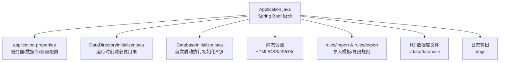
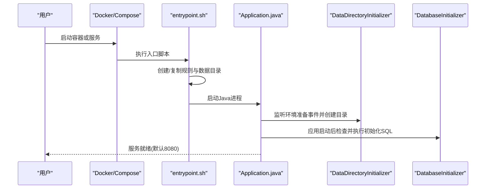
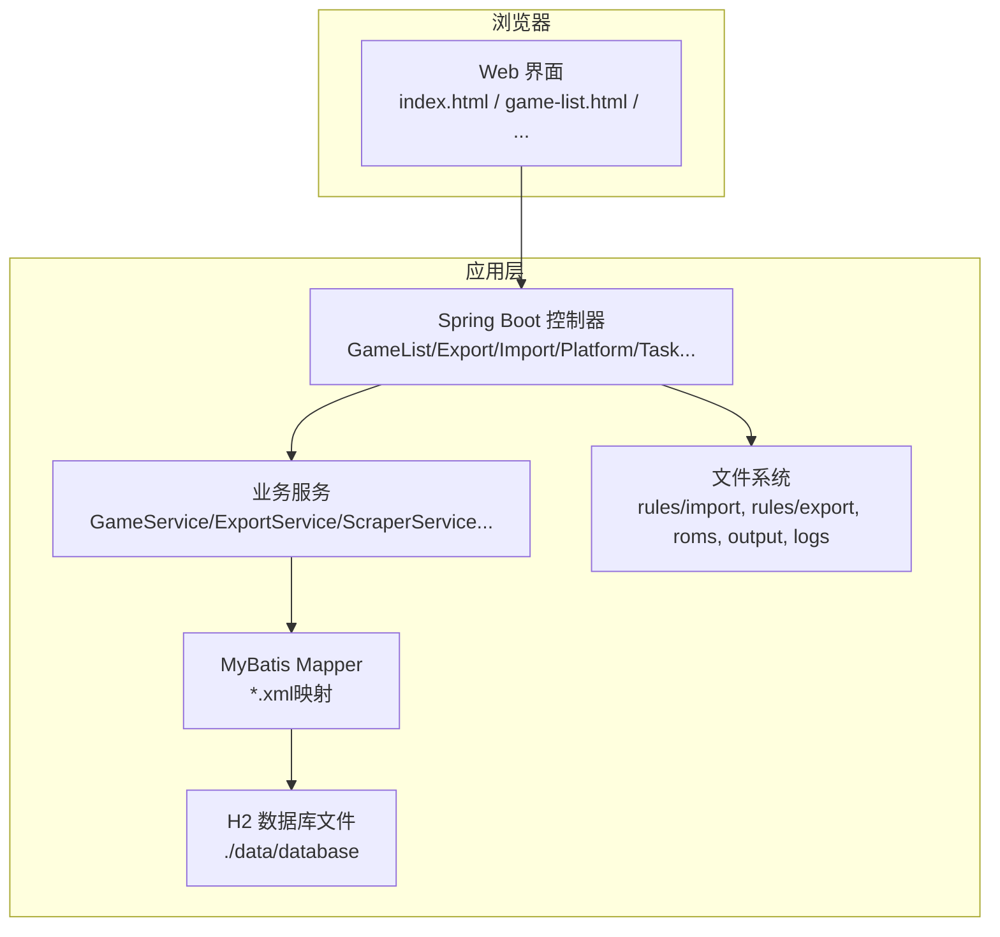
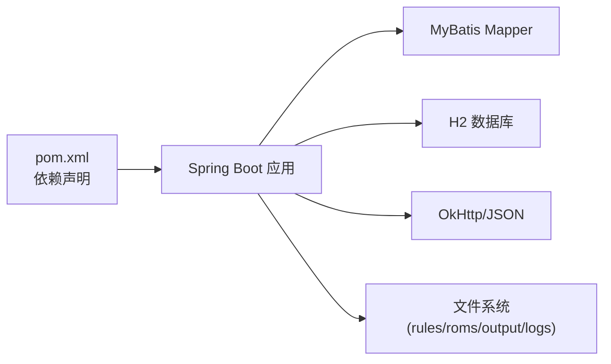

# 快速开始

<cite>
**本文引用的文件**
- [README.md](file://README.md)
- [pom.xml](file://pom.xml)
- [Dockerfile](file://Dockerfile)
- [docker-compose.yml](file://docker-compose.yml)
- [application.properties](file://src/main/resources/application.properties)
- [Application.java](file://src/main/java/com/gamelist/Application.java)
- [entrypoint.sh](file://entrypoint.sh)
- [DataDirectoryInitializer.java](file://src/main/java/com/gamelist/config/DataDirectoryInitializer.java)
- [DatabaseInitializer.java](file://src/main/java/com/gamelist/config/DatabaseInitializer.java)
- [Quick-Start.md](file://wiki/Quick-Start.md)
- [Installation.md](file://wiki/Installation.md)
- [Troubleshooting.md](file://wiki/Troubleshooting.md)
</cite>

## 目录
1. [简介](#简介)
2. [环境要求](#环境要求)
3. [项目结构概览](#项目结构概览)
4. [核心组件与启动流程](#核心组件与启动流程)
5. [架构总览](#架构总览)
6. [详细部署指南](#详细部署指南)
7. [首次启动后的基本配置](#首次启动后的基本配置)
8. [依赖关系分析](#依赖关系分析)
9. [性能注意事项](#性能注意事项)
10. [故障排除指南](#故障排除指南)
11. [结论](#结论)
12. [附录：访问地址与界面介绍](#附录：访问地址与界面介绍)

## 简介
WebGameListOper（Frontend-Killer）是一款用于管理模拟器前端游戏列表的 Web 应用，支持导入/导出多种前端模板、媒体文件管理、平台合并与数据迁移等。本快速开始指南帮助你在最短时间内完成环境准备、部署运行和基础操作。

## 环境要求
- Java 17+（若使用 JAR 方式运行）
- Docker（推荐，便于一键部署与数据持久化）
- 建议内存：至少 2GB RAM
- 端口：默认 8080（可通过环境变量或参数调整）

说明：
- 项目基于 Spring Boot 3.2.x 与 Java 17 构建，打包产物为可执行 JAR。
- 数据库默认使用 H2（文件型），数据通过卷挂载持久化。

章节来源
- [pom.xml:18-21](file://pom.xml#L18-L21)
- [pom.xml:108-136](file://pom.xml#L108-L136)
- [README.md:86-92](file://README.md#L86-L92)
- [Installation.md:5-8](file://wiki/Installation.md#L5-L8)

## 项目结构概览
- 应用入口：Spring Boot 主类 Application
- 资源与配置：application.properties、静态页面、规则模板
- 初始化逻辑：数据目录自动创建、数据库脚本初始化
- 容器化：Dockerfile、docker-compose.yml、entrypoint.sh

图表来源
- [Application.java:8-14](file://src/main/java/com/gamelist/Application.java#L8-L14)
- [application.properties:1-86](file://src/main/resources/application.properties#L1-L86)
- [DataDirectoryInitializer.java:18-92](file://src/main/java/com/gamelist/config/DataDirectoryInitializer.java#L18-L92)
- [DatabaseInitializer.java:34-52](file://src/main/java/com/gamelist/config/DatabaseInitializer.java#L34-L52)

章节来源
- [Application.java:1-16](file://src/main/java/com/gamelist/Application.java#L1-L16)
- [application.properties:1-86](file://src/main/resources/application.properties#L1-L86)

## 核心组件与启动流程
- 应用入口：Application 启动 Spring Boot 容器
- 目录初始化：DataDirectoryInitializer 在环境准备阶段创建 data/logs/rules 等目录
- 数据库初始化：DatabaseInitializer 检查并执行初始化 SQL
- 容器启动：entrypoint.sh 负责复制默认规则、释放初始数据、设置 JVM 参数并启动应用

图表来源
- [entrypoint.sh:27-92](file://entrypoint.sh#L27-L92)
- [Application.java:8-14](file://src/main/java/com/gamelist/Application.java#L8-L14)
- [DataDirectoryInitializer.java:18-92](file://src/main/java/com/gamelist/config/DataDirectoryInitializer.java#L18-L92)
- [DatabaseInitializer.java:34-52](file://src/main/java/com/gamelist/config/DatabaseInitializer.java#L34-L52)

章节来源
- [entrypoint.sh:1-93](file://entrypoint.sh#L1-L93)
- [DataDirectoryInitializer.java:1-106](file://src/main/java/com/gamelist/config/DataDirectoryInitializer.java#L1-L106)
- [DatabaseInitializer.java:1-132](file://src/main/java/com/gamelist/config/DatabaseInitializer.java#L1-L132)

## 架构总览

图表来源
- [application.properties:15-20](file://src/main/resources/application.properties#L15-L20)
- [application.properties:76-86](file://src/main/resources/application.properties#L76-L86)

## 详细部署指南

### 方式一：Docker 部署（推荐）
步骤：
1. 准备目录（用于数据持久化与日志）
   - 创建 data、output、logs、backup 等目录
2. 拉取镜像并运行容器
   - 将宿主机目录映射到容器内 /data、/app/logs 等路径
   - 设置必要的环境变量（如 SPRING_PROFILES_ACTIVE、SERVER_TOMCAT_BASEDIR、静态资源位置、JVM 参数）
3. 访问应用
   - 默认端口 8080，映射到宿主机 8081（示例）

参考命令与说明：
- 拉取镜像与运行命令参见仓库 README 中的“Docker 部署”段落
- 关键环境变量：
  - SPRING_PROFILES_ACTIVE=default
  - SERVER_TOMCAT_BASEDIR=/data
  - SPRING_RESOURCES_STATIC_LOCATIONS=classpath:/static/,file:/data,file:/data/roms,file:/data/output,file:/data/input
  - JAVA_OPTS=-Xmx2g -Xms512m -XX:+UseG1GC

章节来源
- [README.md:95-115](file://README.md#L95-L115)
- [README.md:172-192](file://README.md#L172-L192)
- [docker-compose.yml:14-19](file://docker-compose.yml#L14-L19)
- [application.properties:60-74](file://src/main/resources/application.properties#L60-L74)

### 方式二：Docker Compose 部署
步骤：
1. 在项目根目录准备 docker-compose.yml（仓库已提供）
2. 根据需要修改端口映射、卷挂载路径与环境变量
3. 启动服务：docker-compose up -d
4. 查看健康检查与日志

说明：
- 默认暴露 8080 端口，可在 compose 中映射到宿主机任意端口
- 健康检查会探测 /actuator/health（若启用）

章节来源
- [docker-compose.yml:1-33](file://docker-compose.yml#L1-L33)
- [README.md:117-140](file://README.md#L117-L140)
- [README.md:194-217](file://README.md#L194-L217)

### 方式三：JAR 包运行
步骤：
1. 确保安装 Java 17+
2. 创建必要目录：data/rules/import、data/rules/export、output、logs
3. 运行 JAR：java -jar webGamelistOper-1.0.6-beta3.jar
4. 访问 http://localhost:8080（或自定义端口）

可选参数：
- 通过 --server.port 指定端口
- 通过 --app.data.path 指定数据目录（如需）

章节来源
- [README.md:142-146](file://README.md#L142-L146)
- [README.md:219-223](file://README.md#L219-L223)
- [pom.xml:108-136](file://pom.xml#L108-L136)
- [Installation.md:69-93](file://wiki/Installation.md#L69-L93)

## 首次启动后的基本配置
- 目录结构初始化
  - 应用会在启动时自动创建 data、logs、rules/import、rules/export、output、input、database 等目录
  - 容器模式下 entrypoint.sh 会将默认规则复制到 /data/rules，并保护已有数据库不被覆盖
- 数据库初始化
  - 首次启动会检测是否存在 platform 表，不存在则执行 sql/init.sql 进行初始化
- 静态资源与规则
  - 静态资源默认从 classpath:/static 与外部 file:/data 等路径加载
  - 导入模板与导出规则位于 ./data/rules/import 与 ./data/rules/export

章节来源
- [DataDirectoryInitializer.java:18-92](file://src/main/java/com/gamelist/config/DataDirectoryInitializer.java#L18-L92)
- [DatabaseInitializer.java:34-52](file://src/main/java/com/gamelist/config/DatabaseInitializer.java#L34-L52)
- [entrypoint.sh:31-83](file://entrypoint.sh#L31-L83)
- [application.properties:10-13](file://src/main/resources/application.properties#L10-L13)
- [application.properties:76-86](file://src/main/resources/application.properties#L76-L86)

## 依赖关系分析
- 运行时依赖
  - Spring Boot Web、JDBC、MyBatis、H2 数据库、Flyway（已禁用自动迁移）、OkHttp、JSON 库
- 构建与打包
  - Maven 构建，Spring Boot Maven Plugin 重打包为可执行 JAR
- 容器化
  - 多阶段构建：第一阶段编译，第二阶段运行；entrypoint.sh 负责启动前准备

图表来源
- [pom.xml:23-106](file://pom.xml#L23-L106)
- [pom.xml:108-136](file://pom.xml#L108-L136)

章节来源
- [pom.xml:1-152](file://pom.xml#L1-L152)

## 性能注意事项
- JVM 参数
  - 默认建议 -Xmx2g -Xms512m -XX:+UseG1GC，可根据机器内存调整
- 连接池
  - HikariCP 最大连接数、空闲超时等已在 application.properties 中配置
- 静态资源缓存
  - 开发环境关闭缓存，生产环境可按需开启
- I/O 与并发
  - 避免一次性导入过多文件；合理设置上传大小限制

章节来源
- [application.properties:21-27](file://src/main/resources/application.properties#L21-L27)
- [application.properties:60-74](file://src/main/resources/application.properties#L60-L74)
- [entrypoint.sh:86-92](file://entrypoint.sh#L86-L92)

## 故障排除指南
常见问题与解决思路：
- 应用无法启动
  - 检查端口占用、目录权限、Docker 日志
- 导入模板未加载
  - 确认 ./data/rules/import 存在且 JSON 格式正确
- 导出规则未找到
  - 确认 ./data/rules/export 存在且包含必需字段
- 字符乱码
  - 确保 XML 文件为 UTF-8 编码
- JAXB 解析失败
  - 检查 XML 是否为空或结构不正确
- 数据库连接错误
  - 检查 ./data/database 目录权限与 SQLite/H2 驱动
- 媒体文件不显示
  - 检查 roms 目录结构与文件扩展名
- 语言切换无效
  - 清理浏览器缓存，检查 translation-config.json

日志位置：
- Docker：/app/logs
- 本地：./logs

章节来源
- [Troubleshooting.md:5-180](file://wiki/Troubleshooting.md#L5-L180)
- [Troubleshooting.md:182-205](file://wiki/Troubleshooting.md#L182-L205)

## 结论
通过 Docker 或 JAR 两种方式均可快速部署 WebGameListOper。首次启动会自动完成目录与数据库初始化，随后即可通过浏览器访问并进行导入/导出、媒体管理等操作。遇到问题时可依据故障排除指南定位与解决。

## 附录：访问地址与界面介绍
- 访问地址
  - 默认：http://localhost:8080
  - Docker 映射示例：http://localhost:8081
- 界面功能概览
  - 导航菜单包括数据导入、游戏列表、导出、任务管理、系统设置等
  - 支持多语言切换、搜索与过滤
  - 媒体文件管理：查看图片/视频
  - 批量翻译（可选）

章节来源
- [README.md:148-149](file://README.md#L148-L149)
- [README.md:225-226](file://README.md#L225-L226)
- [Quick-Start.md:40-83](file://wiki/Quick-Start.md#L40-L83)