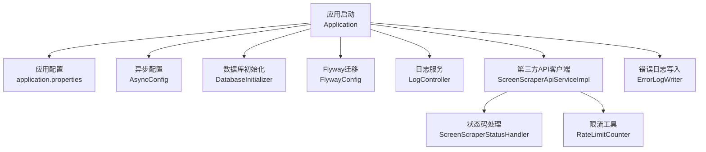
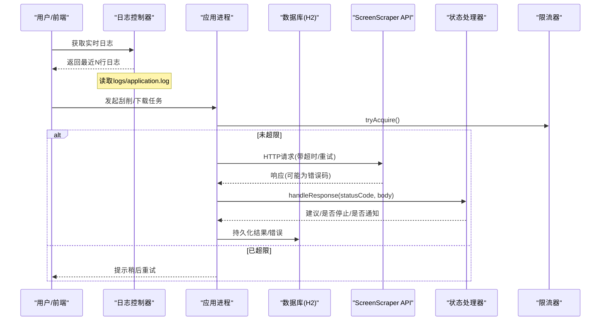
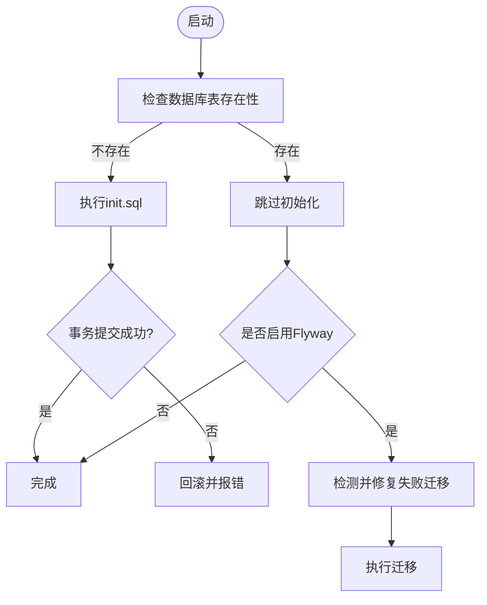
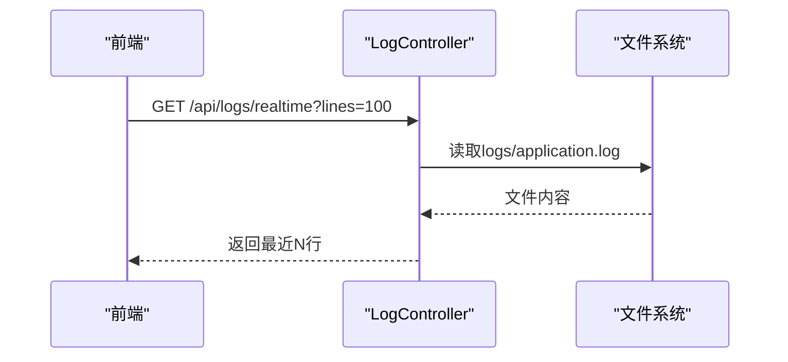
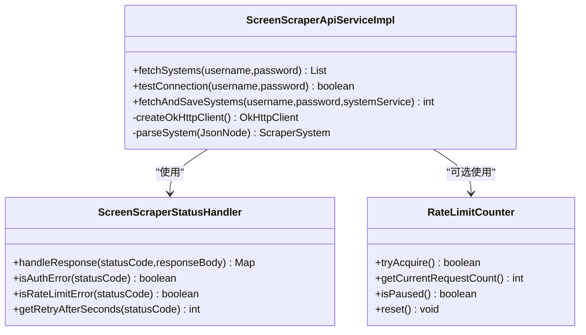
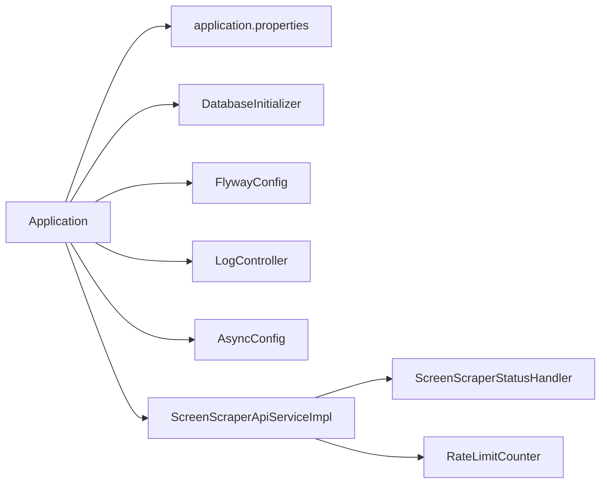

# 故障排除

<cite>
**本文引用的文件**
- [Application.java](file://src/main/java/com/gamelist/Application.java)
- [application.properties](file://src/main/resources/application.properties)
- [DatabaseInitializer.java](file://src/main/java/com/gamelist/config/DatabaseInitializer.java)
- [FlywayConfig.java](file://src/main/java/com/gamelist/config/FlywayConfig.java)
- [LogController.java](file://src/main/java/com/gamelist/controller/LogController.java)
- [ErrorLogWriter.java](file://src/main/java/com/gamelist/util/ErrorLogWriter.java)
- [ScreenScraperConfig.java](file://src/main/java/com/gamelist/config/ScreenScraperConfig.java)
- [ScreenScraperApiServiceImpl.java](file://src/main/java/com/gamelist/service/impl/ScreenScraperApiServiceImpl.java)
- [ScreenScraperStatusHandler.java](file://src/main/java/com/gamelist/util/ScreenScraperStatusHandler.java)
- [RateLimitCounter.java](file://src/main/java/com/gamelist/util/RateLimitCounter.java)
- [AsyncConfig.java](file://src/main/java/com/gamelist/config/AsyncConfig.java)
</cite>

## 目录
1. [简介](#简介)
2. [项目结构](#项目结构)
3. [核心组件](#核心组件)
4. [架构总览](#架构总览)
5. [详细组件分析](#详细组件分析)
6. [依赖关系分析](#依赖关系分析)
7. [性能注意事项](#性能注意事项)
8. [故障排除指南](#故障排除指南)
9. [结论](#结论)
10. [附录](#附录)

## 简介
本故障排除文档面向WebGameListOper的部署、运行与运维人员，聚焦以下目标：
- 安装部署问题定位（端口、路径、数据库初始化、迁移）
- 运行时错误排查（日志查看与分析、错误分类、快速定位）
- 性能问题诊断（连接池、异步任务、网络超时、限流）
- 数据库相关问题（连接、一致性、性能优化）
- 第三方API集成问题（网络、认证、限流、重试与降级）
- 内存泄漏检测与性能瓶颈分析方法
- 系统监控与健康检查方案
- 问题反馈与社区支持渠道建议
- 常见问题知识库维护策略

## 项目结构
本项目基于Spring Boot构建，核心模块包括：
- 启动入口与异步能力启用
- 配置中心（应用属性、数据库、HikariCP、日志、静态资源等）
- 数据库初始化与迁移（自定义初始化脚本与Flyway）
- 日志采集与在线查看（REST接口读取应用日志）
- 第三方API客户端（ScreenScraper），含SSL/TLS、超时、重试、状态码处理
- 限流工具（本地滑动窗口计数）
- 错误日志写入（导入/导出过程的问题明细）

**图表来源**
- [Application.java:8-14](file://src/main/java/com/gamelist/Application.java#L8-L14)
- [application.properties:1-86](file://src/main/resources/application.properties#L1-L86)
- [AsyncConfig.java:10-13](file://src/main/java/com/gamelist/config/AsyncConfig.java#L10-L13)
- [DatabaseInitializer.java:23-52](file://src/main/java/com/gamelist/config/DatabaseInitializer.java#L23-L52)
- [FlywayConfig.java:17-74](file://src/main/java/com/gamelist/config/FlywayConfig.java#L17-L74)
- [LogController.java:16-77](file://src/main/java/com/gamelist/controller/LogController.java#L16-L77)
- [ScreenScraperApiServiceImpl.java:30-104](file://src/main/java/com/gamelist/service/impl/ScreenScraperApiServiceImpl.java#L30-L104)
- [ScreenScraperStatusHandler.java:15-213](file://src/main/java/com/gamelist/util/ScreenScraperStatusHandler.java#L15-L213)
- [RateLimitCounter.java:13-79](file://src/main/java/com/gamelist/util/RateLimitCounter.java#L13-L79)
- [ErrorLogWriter.java:17-189](file://src/main/java/com/gamelist/util/ErrorLogWriter.java#L17-L189)

**章节来源**
- [Application.java:8-14](file://src/main/java/com/gamelist/Application.java#L8-L14)
- [application.properties:1-86](file://src/main/resources/application.properties#L1-L86)

## 核心组件
- 应用启动与异步：启用异步注解，便于后台任务执行。
- 配置管理：统一通过application.properties管理端口、编码、静态资源、数据库、HikariCP、日志、H2控制台、上传临时目录、Tomcat工作目录、规则与输入输出目录等。
- 数据库初始化与迁移：启动时检查并执行基础SQL；可选Flyway迁移修复与执行。
- 日志与排障：提供实时日志读取接口；按日期生成导入/导出错误日志。
- 第三方API集成：OkHttp客户端封装，包含TLS版本、超时、重试、重定向、连接池、事件监听；统一状态码处理与建议。
- 限流：本地滑动窗口计数器，避免触发第三方配额限制。

**章节来源**
- [AsyncConfig.java:10-13](file://src/main/java/com/gamelist/config/AsyncConfig.java#L10-L13)
- [application.properties:1-86](file://src/main/resources/application.properties#L1-L86)
- [DatabaseInitializer.java:23-132](file://src/main/java/com/gamelist/config/DatabaseInitializer.java#L23-L132)
- [FlywayConfig.java:17-74](file://src/main/java/com/gamelist/config/FlywayConfig.java#L17-L74)
- [LogController.java:16-77](file://src/main/java/com/gamelist/controller/LogController.java#L16-L77)
- [ErrorLogWriter.java:17-189](file://src/main/java/com/gamelist/util/ErrorLogWriter.java#L17-L189)
- [ScreenScraperApiServiceImpl.java:30-104](file://src/main/java/com/gamelist/service/impl/ScreenScraperApiServiceImpl.java#L30-L104)
- [ScreenScraperStatusHandler.java:15-213](file://src/main/java/com/gamelist/util/ScreenScraperStatusHandler.java#L15-L213)
- [RateLimitCounter.java:13-79](file://src/main/java/com/gamelist/util/RateLimitCounter.java#L13-L79)

## 架构总览
下图展示了从请求到日志与外部API调用的关键路径，以及异常与限流的分支处理。

**图表来源**
- [LogController.java:23-42](file://src/main/java/com/gamelist/controller/LogController.java#L23-L42)
- [ScreenScraperApiServiceImpl.java:106-251](file://src/main/java/com/gamelist/service/impl/ScreenScraperApiServiceImpl.java#L106-L251)
- [ScreenScraperStatusHandler.java:138-170](file://src/main/java/com/gamelist/util/ScreenScraperStatusHandler.java#L138-L170)
- [RateLimitCounter.java:31-79](file://src/main/java/com/gamelist/util/RateLimitCounter.java#L31-L79)

## 详细组件分析

### 数据库初始化与迁移
- 启动时检查是否存在平台表，若不存在则执行init.sql创建基础结构；失败时回滚并抛出异常。
- 可选Flyway迁移：自动检测失败迁移并repair，再执行migrate；可关闭自动配置使用自定义逻辑。

**图表来源**
- [DatabaseInitializer.java:34-102](file://src/main/java/com/gamelist/config/DatabaseInitializer.java#L34-L102)
- [FlywayConfig.java:35-74](file://src/main/java/com/gamelist/config/FlywayConfig.java#L35-L74)

**章节来源**
- [DatabaseInitializer.java:23-132](file://src/main/java/com/gamelist/config/DatabaseInitializer.java#L23-L132)
- [FlywayConfig.java:17-74](file://src/main/java/com/gamelist/config/FlywayConfig.java#L17-L74)
- [application.properties:15-37](file://src/main/resources/application.properties#L15-L37)

### 日志查看与分析
- 应用日志：默认输出到logs/application.log，支持控制台与文件滚动（大小与保留天数）。
- 在线查看：提供/api/logs/realtime接口读取最后N行；/api/logs/status检查文件可读性。
- 错误日志：导入/导出过程中将问题游戏写入独立日志文件，便于快速定位。

**图表来源**
- [LogController.java:23-77](file://src/main/java/com/gamelist/controller/LogController.java#L23-L77)
- [application.properties:43-53](file://src/main/resources/application.properties#L43-L53)
- [ErrorLogWriter.java:17-189](file://src/main/java/com/gamelist/util/ErrorLogWriter.java#L17-L189)

**章节来源**
- [LogController.java:16-77](file://src/main/java/com/gamelist/controller/LogController.java#L16-L77)
- [application.properties:43-53](file://src/main/resources/application.properties#L43-L53)
- [ErrorLogWriter.java:17-189](file://src/main/java/com/gamelist/util/ErrorLogWriter.java#L17-L189)

### 第三方API集成（ScreenScraper）
- 客户端配置：设置TLS协议、连接/读写超时、重定向、重试、连接池、事件监听。
- 状态码处理：统一映射错误类型、建议、是否立即停止、是否通知用户、重试间隔。
- 分页拉取：循环抓取系统列表，解析JSON并批量入库。
- 测试连接：调用测试接口验证连通性与响应格式。

**图表来源**
- [ScreenScraperApiServiceImpl.java:30-104](file://src/main/java/com/gamelist/service/impl/ScreenScraperApiServiceImpl.java#L30-L104)
- [ScreenScraperApiServiceImpl.java:106-251](file://src/main/java/com/gamelist/service/impl/ScreenScraperApiServiceImpl.java#L106-L251)
- [ScreenScraperStatusHandler.java:15-213](file://src/main/java/com/gamelist/util/ScreenScraperStatusHandler.java#L15-L213)
- [RateLimitCounter.java:13-79](file://src/main/java/com/gamelist/util/RateLimitCounter.java#L13-L79)

**章节来源**
- [ScreenScraperConfig.java:6-46](file://src/main/java/com/gamelist/config/ScreenScraperConfig.java#L6-L46)
- [ScreenScraperApiServiceImpl.java:30-104](file://src/main/java/com/gamelist/service/impl/ScreenScraperApiServiceImpl.java#L30-L104)
- [ScreenScraperApiServiceImpl.java:106-251](file://src/main/java/com/gamelist/service/impl/ScreenScraperApiServiceImpl.java#L106-L251)
- [ScreenScraperStatusHandler.java:15-213](file://src/main/java/com/gamelist/util/ScreenScraperStatusHandler.java#L15-L213)
- [RateLimitCounter.java:13-79](file://src/main/java/com/gamelist/util/RateLimitCounter.java#L13-L79)

### 异步任务与线程模型
- 启用异步注解，支持@Async方法在后台线程执行，避免阻塞主流程。
- 注意线程池配置与任务队列容量，防止任务堆积导致内存压力。

**章节来源**
- [AsyncConfig.java:10-13](file://src/main/java/com/gamelist/config/AsyncConfig.java#L10-L13)
- [Application.java:8-14](file://src/main/java/com/gamelist/Application.java#L8-L14)

## 依赖关系分析
- 应用启动依赖Spring Boot容器，扫描Mapper与启用异步。
- 数据库层依赖HikariCP连接池与H2嵌入式数据库；可通过application.properties调整连接池参数。
- 日志框架输出至控制台与文件，支持字符集与滚动策略。
- 第三方API依赖OkHttp，需关注TLS版本、证书与代理环境。

**图表来源**
- [Application.java:8-14](file://src/main/java/com/gamelist/Application.java#L8-L14)
- [application.properties:1-86](file://src/main/resources/application.properties#L1-L86)
- [DatabaseInitializer.java:23-52](file://src/main/java/com/gamelist/config/DatabaseInitializer.java#L23-L52)
- [FlywayConfig.java:17-74](file://src/main/java/com/gamelist/config/FlywayConfig.java#L17-L74)
- [LogController.java:16-77](file://src/main/java/com/gamelist/controller/LogController.java#L16-L77)
- [AsyncConfig.java:10-13](file://src/main/java/com/gamelist/config/AsyncConfig.java#L10-L13)
- [ScreenScraperApiServiceImpl.java:30-104](file://src/main/java/com/gamelist/service/impl/ScreenScraperApiServiceImpl.java#L30-L104)
- [ScreenScraperStatusHandler.java:15-213](file://src/main/java/com/gamelist/util/ScreenScraperStatusHandler.java#L15-L213)
- [RateLimitCounter.java:13-79](file://src/main/java/com/gamelist/util/RateLimitCounter.java#L13-L79)

**章节来源**
- [application.properties:15-27](file://src/main/resources/application.properties#L15-L27)
- [application.properties:43-53](file://src/main/resources/application.properties#L43-L53)
- [ScreenScraperApiServiceImpl.java:45-104](file://src/main/java/com/gamelist/service/impl/ScreenScraperApiServiceImpl.java#L45-L104)

## 性能注意事项
- 连接池：根据并发量调整最大连接数、空闲连接、超时与生命周期，避免连接耗尽或频繁创建销毁。
- 日志滚动：合理设置文件大小与保留天数，避免磁盘占满影响IO。
- 网络超时：为第三方API设置合理的连接/读/写超时，避免线程长时间阻塞。
- 限流：在高并发场景下结合服务端限流策略，降低被第三方封禁风险。
- 异步任务：确保线程池容量与队列大小匹配业务峰值，避免OOM。

[本节为通用指导，不直接分析具体文件]

## 故障排除指南

### 安装部署问题
- 端口冲突
  - 现象：启动失败或无法访问
  - 排查：检查server.port配置，确认端口未被占用
  - 参考：[application.properties:1-8](file://src/main/resources/application.properties#L1-L8)
- 静态资源与上传目录权限
  - 现象：页面加载失败或上传失败
  - 排查：确认spring.web.resources.static-locations与spring.servlet.multipart.location指向的目录存在且可读写
  - 参考：[application.properties:10-13](file://src/main/resources/application.properties#L10-L13), [application.properties:60-74](file://src/main/resources/application.properties#L60-L74)
- 数据库初始化失败
  - 现象：启动时报错或表缺失
  - 排查：检查DatabaseInitializer执行日志，确认init.sql存在与可执行；必要时手动执行或清理数据目录
  - 参考：[DatabaseInitializer.java:34-102](file://src/main/java/com/gamelist/config/DatabaseInitializer.java#L34-L102)
- Flyway迁移失败
  - 现象：迁移中断或状态不一致
  - 排查：启用Flyway后检查失败迁移记录，执行repair后再migrate
  - 参考：[FlywayConfig.java:35-74](file://src/main/java/com/gamelist/config/FlywayConfig.java#L35-L74)

**章节来源**
- [application.properties:1-86](file://src/main/resources/application.properties#L1-L86)
- [DatabaseInitializer.java:34-102](file://src/main/java/com/gamelist/config/DatabaseInitializer.java#L34-L102)
- [FlywayConfig.java:35-74](file://src/main/java/com/gamelist/config/FlywayConfig.java#L35-L74)

### 运行时错误
- 日志为空或无法读取
  - 现象：/api/logs/realtime返回空或错误
  - 排查：确认logs/application.log存在且可读；检查日志滚动配置与磁盘空间
  - 参考：[LogController.java:23-42](file://src/main/java/com/gamelist/controller/LogController.java#L23-L42), [application.properties:43-53](file://src/main/resources/application.properties#L43-L53)
- 导入/导出错误
  - 现象：部分游戏跳过或失败
  - 排查：查看errolog-*.log中的“被跳过的游戏”“转换失败的游戏”“缺失文件”等分类
  - 参考：[ErrorLogWriter.java:30-103](file://src/main/java/com/gamelist/util/ErrorLogWriter.java#L30-L103), [ErrorLogWriter.java:111-168](file://src/main/java/com/gamelist/util/ErrorLogWriter.java#L111-L168)

**章节来源**
- [LogController.java:23-77](file://src/main/java/com/gamelist/controller/LogController.java#L23-L77)
- [ErrorLogWriter.java:30-168](file://src/main/java/com/gamelist/util/ErrorLogWriter.java#L30-L168)

### 性能问题
- 连接池耗尽
  - 现象：请求卡顿或超时
  - 排查：检查HikariCP参数（最大连接数、空闲超时、连接超时、生命周期）；监控活跃连接数
  - 参考：[application.properties:21-27](file://src/main/resources/application.properties#L21-L27)
- 网络超时
  - 现象：第三方API请求超时
  - 排查：检查OkHttp超时配置与重试策略；观察日志中SSL握手与HTTP状态码
  - 参考：[ScreenScraperApiServiceImpl.java:45-104](file://src/main/java/com/gamelist/service/impl/ScreenScraperApiServiceImpl.java#L45-L104)
- 限流触发
  - 现象：频繁429/430/431
  - 排查：结合RateLimitCounter与状态处理器，降低请求频率或等待恢复时间
  - 参考：[RateLimitCounter.java:31-79](file://src/main/java/com/gamelist/util/RateLimitCounter.java#L31-L79), [ScreenScraperStatusHandler.java:172-186](file://src/main/java/com/gamelist/util/ScreenScraperStatusHandler.java#L172-L186)

**章节来源**
- [application.properties:21-27](file://src/main/resources/application.properties#L21-L27)
- [ScreenScraperApiServiceImpl.java:45-104](file://src/main/java/com/gamelist/service/impl/ScreenScraperApiServiceImpl.java#L45-L104)
- [RateLimitCounter.java:31-79](file://src/main/java/com/gamelist/util/RateLimitCounter.java#L31-L79)
- [ScreenScraperStatusHandler.java:172-186](file://src/main/java/com/gamelist/util/ScreenScraperStatusHandler.java#L172-L186)

### 数据库相关问题
- 连接问题
  - 现象：无法获取连接或连接池耗尽
  - 排查：检查URL、驱动、用户名密码；调整HikariCP参数；确认data目录可写
  - 参考：[application.properties:15-27](file://src/main/resources/application.properties#L15-L27)
- 数据一致性
  - 现象：初始化或迁移后数据异常
  - 排查：查看DatabaseInitializer事务日志；必要时执行repair与重新迁移
  - 参考：[DatabaseInitializer.java:82-100](file://src/main/java/com/gamelist/config/DatabaseInitializer.java#L82-L100), [FlywayConfig.java:48-68](file://src/main/java/com/gamelist/config/FlywayConfig.java#L48-L68)
- 性能优化
  - 建议：合理设置连接池大小、查询批处理、索引与分页；避免大事务

**章节来源**
- [application.properties:15-27](file://src/main/resources/application.properties#L15-L27)
- [DatabaseInitializer.java:82-100](file://src/main/java/com/gamelist/config/DatabaseInitializer.java#L82-L100)
- [FlywayConfig.java:48-68](file://src/main/java/com/gamelist/config/FlywayConfig.java#L48-L68)

### 第三方API集成问题
- 网络超时
  - 现象：连接或读取超时
  - 排查：检查OkHttp超时配置与网络环境；查看日志中的SSL握手信息
  - 参考：[ScreenScraperApiServiceImpl.java:45-104](file://src/main/java/com/gamelist/service/impl/ScreenScraperApiServiceImpl.java#L45-L104)
- 认证失败
  - 现象：401/403
  - 排查：核对devPseudo/devPassword或用户凭证；查看状态处理器建议
  - 参考：[ScreenScraperConfig.java:6-46](file://src/main/java/com/gamelist/config/ScreenScraperConfig.java#L6-L46), [ScreenScraperStatusHandler.java:84-98](file://src/main/java/com/gamelist/util/ScreenScraperStatusHandler.java#L84-L98)
- 限流处理
  - 现象：429/430/431
  - 排查：降低请求频率；依据retryAfter等待；结合RateLimitCounter控制
  - 参考：[ScreenScraperStatusHandler.java:172-195](file://src/main/java/com/gamelist/util/ScreenScraperStatusHandler.java#L172-L195), [RateLimitCounter.java:31-79](file://src/main/java/com/gamelist/util/RateLimitCounter.java#L31-L79)

**章节来源**
- [ScreenScraperConfig.java:6-46](file://src/main/java/com/gamelist/config/ScreenScraperConfig.java#L6-L46)
- [ScreenScraperApiServiceImpl.java:45-104](file://src/main/java/com/gamelist/service/impl/ScreenScraperApiServiceImpl.java#L45-L104)
- [ScreenScraperStatusHandler.java:84-195](file://src/main/java/com/gamelist/util/ScreenScraperStatusHandler.java#L84-L195)
- [RateLimitCounter.java:31-79](file://src/main/java/com/gamelist/util/RateLimitCounter.java#L31-L79)

### 内存泄漏检测与性能瓶颈分析
- 内存泄漏检测
  - 使用JVM参数开启GC日志与堆转储；在压测后分析heap dump定位大对象与未释放引用
  - 关注异步任务队列与缓存是否无限增长
- 性能瓶颈分析
  - 使用APM或JProfiler监控CPU、线程、锁竞争与I/O
  - 重点排查数据库慢查询、网络超时与连接池饱和

[本节为通用指导，不直接分析具体文件]

### 系统监控与健康检查
- 健康检查建议
  - 暴露/health端点，检查数据库连接、磁盘空间、第三方API连通性
  - 定期采集指标：连接池使用率、日志文件大小、任务队列长度
- 监控实现思路
  - 使用Spring Actuator或自定义HealthIndicator
  - 结合Prometheus/Grafana进行可视化监控与告警

[本节为通用指导，不直接分析具体文件]

### 问题反馈与社区支持
- 建立问题反馈渠道：Issue模板、FAQ文档、错误码对照表
- 社区支持：贡献指南、讨论区、版本更新说明
- 知识库维护：定期更新常见问题与解决方案，标注生效版本

[本节为通用指导，不直接分析具体文件]

### 常见问题解答与知识库更新策略
- 收集高频问题：部署、日志、数据库、API、性能
- 标准化解答：现象、原因、步骤、参考文件
- 版本同步：每次发布更新FAQ，标注变更影响

[本节为通用指导，不直接分析具体文件]

## 结论
通过统一的配置管理、完善的日志体系、健壮的数据库初始化与迁移机制、以及针对第三方API的状态处理与限流策略，WebGameListOper具备良好的可观测性与可维护性。按照本文的故障排除指南，可快速定位并解决常见部署、运行与性能问题，保障系统稳定高效运行。

[本节为总结性内容，不直接分析具体文件]

## 附录
- 常用命令与路径
  - 应用日志：logs/application.log
  - 错误日志：./logs/errolog-*.log
  - 数据库文件：./data/database/database.db
  - H2控制台：/h2-console
- 关键配置项
  - 端口：server.port
  - 连接池：spring.datasource.hikari.*
  - 日志级别与滚动：logging.level.*、logging.file.*
  - 静态资源与上传：spring.web.resources.*、spring.servlet.multipart.*
  - 第三方API：screenscraper.*

**章节来源**
- [application.properties:1-86](file://src/main/resources/application.properties#L1-L86)