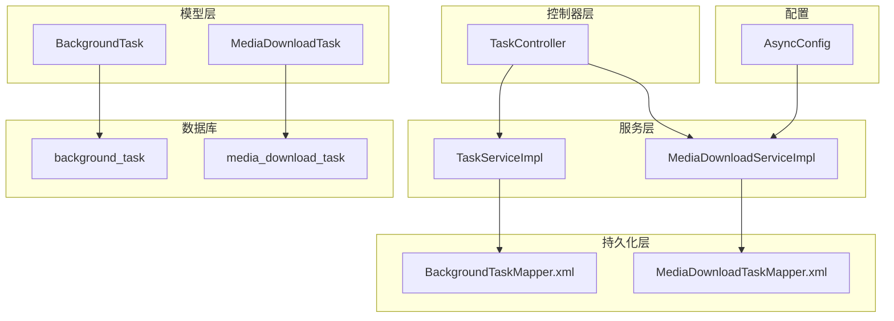
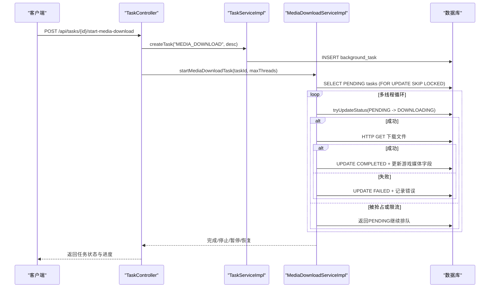
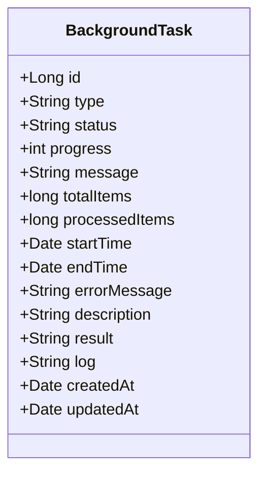
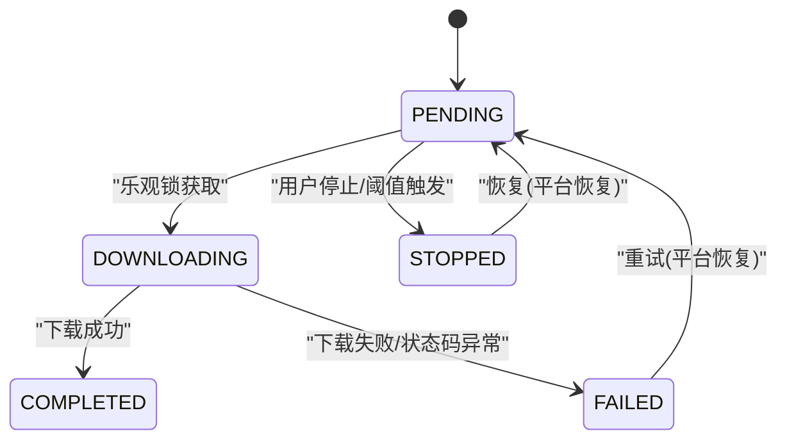
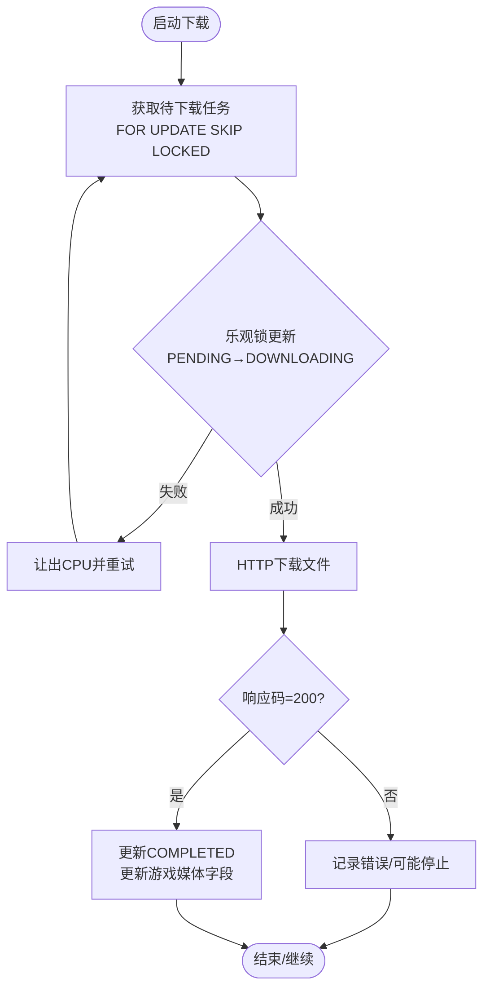
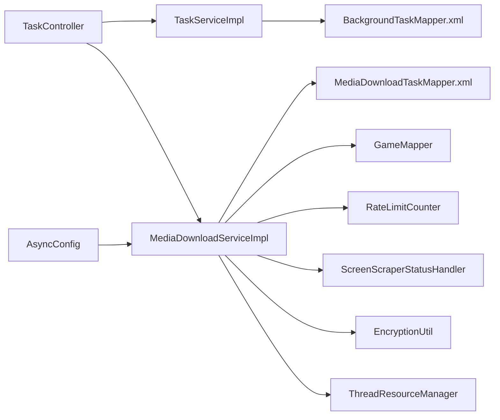

# 任务数据模型

<cite>
**本文引用的文件**
- [BackgroundTask.java](file://src/main/java/com/gamelist/model/BackgroundTask.java)
- [MediaDownloadTask.java](file://src/main/java/com/gamelist/model/MediaDownloadTask.java)
- [TaskServiceImpl.java](file://src/main/java/com/gamelist/service/impl/TaskServiceImpl.java)
- [TaskController.java](file://src/main/java/com/gamelist/controller/TaskController.java)
- [MediaDownloadServiceImpl.java](file://src/main/java/com/gamelist/service/impl/MediaDownloadServiceImpl.java)
- [BackgroundTaskMapper.xml](file://src/main/resources/mappers/BackgroundTaskMapper.xml)
- [MediaDownloadTaskMapper.xml](file://src/main/resources/mappers/MediaDownloadTaskMapper.xml)
- [V1.0.3__baseline_migration.sql](file://src/main/resources/db/migration/V1.0.3__baseline_migration.sql)
- [AsyncConfig.java](file://src/main/java/com/gamelist/config/AsyncConfig.java)
</cite>

## 目录
1. [简介](#简介)
2. [项目结构](#项目结构)
3. [核心组件](#核心组件)
4. [架构总览](#架构总览)
5. [详细组件分析](#详细组件分析)
6. [依赖关系分析](#依赖关系分析)
7. [性能考虑](#性能考虑)
8. [故障排查指南](#故障排查指南)
9. [结论](#结论)
10. [附录：API与最佳实践](#附录api与最佳实践)

## 简介
本文件围绕“任务数据模型”展开，重点解释两类核心任务实体：
- BackgroundTask：通用后台任务（导入、导出、翻译、媒体下载等）的元数据与生命周期管理。
- MediaDownloadTask：媒体下载任务的细粒度执行单元，包含优先级、重试、状态机、进度与错误信息。

文档涵盖：
- 任务状态及转换逻辑（等待中、执行中、已完成、失败、跳过、停止等）
- 优先级管理与调度策略
- 重试机制与错误处理策略
- 媒体下载的特殊字段与流程（URL认证参数注入、下载控制、资源释放、游戏记录更新）
- 数据库设计（任务队列、执行历史、统计查询）
- API接口示例与批量操作最佳实践
- 异步任务生命周期与资源清理

## 项目结构
与任务数据模型相关的代码分布在模型层、服务层、控制器层与持久化映射层，并通过Flyway迁移脚本定义数据库表结构。



图表来源
- [TaskController.java:22-40](file://src/main/java/com/gamelist/controller/TaskController.java#L22-L40)
- [TaskServiceImpl.java:17-28](file://src/main/java/com/gamelist/service/impl/TaskServiceImpl.java#L17-L28)
- [MediaDownloadServiceImpl.java:28-56](file://src/main/java/com/gamelist/service/impl/MediaDownloadServiceImpl.java#L28-L56)
- [BackgroundTaskMapper.xml:3-21](file://src/main/resources/mappers/BackgroundTaskMapper.xml#L3-L21)
- [MediaDownloadTaskMapper.xml:3-24](file://src/main/resources/mappers/MediaDownloadTaskMapper.xml#L3-L24)
- [AsyncConfig.java:10-12](file://src/main/java/com/gamelist/config/AsyncConfig.java#L10-L12)

章节来源
- [V1.0.3__baseline_migration.sql:199-237](file://src/main/resources/db/migration/V1.0.3__baseline_migration.sql#L199-L237)

## 核心组件
- BackgroundTask：承载任务类型、状态、进度、消息、耗时、结果与日志等元信息，用于统一跟踪任意后台任务的生命周期。
- MediaDownloadTask：承载单个媒体文件的下载任务，包括关联的游戏、平台、媒体类型、下载URL、本地路径、文件大小、优先级、重试次数、错误信息与排序索引等。

章节来源
- [BackgroundTask.java:5-21](file://src/main/java/com/gamelist/model/BackgroundTask.java#L5-L21)
- [MediaDownloadTask.java:5-31](file://src/main/java/com/gamelist/model/MediaDownloadTask.java#L5-L31)

## 架构总览
整体流程由控制器接收请求，调用服务层进行任务创建与调度；媒体下载通过异步线程池并发执行，使用数据库乐观锁与行级锁避免重复消费；完成后回写游戏记录的媒体字段。



图表来源
- [TaskController.java:84-129](file://src/main/java/com/gamelist/controller/TaskController.java#L84-L129)
- [TaskServiceImpl.java:59-76](file://src/main/java/com/gamelist/service/impl/TaskServiceImpl.java#L59-L76)
- [MediaDownloadServiceImpl.java:64-228](file://src/main/java/com/gamelist/service/impl/MediaDownloadServiceImpl.java#L64-L228)
- [MediaDownloadTaskMapper.xml:95-101](file://src/main/resources/mappers/MediaDownloadTaskMapper.xml#L95-L101)

## 详细组件分析

### BackgroundTask 设计与实现
- 字段说明
  - type：任务类型（如 IMPORT、EXPORT、TRANSLATE、MEDIA_DOWNLOAD）
  - status：任务状态（PENDING、RUNNING、COMPLETED、FAILED）
  - progress：进度百分比
  - message：当前消息
  - totalItems/processedItems：总量与已处理量
  - startTime/endTime：起止时间
  - errorMessage：错误信息
  - description/result/log：描述、结果、详细日志
  - createdAt/updatedAt：创建与更新时间
- 生命周期管理
  - 创建：初始化默认状态为PENDING，设置开始时间与日志
  - 运行：更新状态为RUNNING，持续刷新进度与消息
  - 完成：状态置为COMPLETED，设置结束时间与结果
  - 失败：状态置为FAILED，记录错误信息并结束
- 缓存与一致性
  - 内存缓存ConcurrentHashMap提升读取性能
  - 原子ID生成器与延迟初始化保证多实例安全



图表来源
- [BackgroundTask.java:5-21](file://src/main/java/com/gamelist/model/BackgroundTask.java#L5-L21)

章节来源
- [TaskServiceImpl.java:59-141](file://src/main/java/com/gamelist/service/impl/TaskServiceImpl.java#L59-L141)
- [BackgroundTaskMapper.xml:23-42](file://src/main/resources/mappers/BackgroundTaskMapper.xml#L23-L42)
- [V1.0.3__baseline_migration.sql:199-216](file://src/main/resources/db/migration/V1.0.3__baseline_migration.sql#L199-L216)

### MediaDownloadTask 设计与实现
- 字段说明
  - taskId/gameId/platformId：关联背景任务、游戏、平台
  - gameName/platformName/mediaType：上下文信息
  - downloadUrl/localPath/fileSize：下载源与落盘信息
  - status：PENDING/DOWNLOADING/COMPLETED/FAILED/SKIPPED/STOPPED
  - priority/retryCount/orderIndex：优先级、重试次数、顺序索引
  - errorMessage：错误信息
  - createdAt/updatedAt：时间戳
- 状态机与转换
  - PENDING → DOWNLOADING：通过乐观锁tryUpdateStatus确保唯一性
  - DOWNLOADING → COMPLETED：下载成功，更新游戏媒体字段
  - DOWNLOADING → FAILED：网络异常或状态码异常，记录错误
  - STOPPED：用户主动停止或达到阈值（如频繁404）时标记
  - SKIPPED：业务逻辑跳过（例如忽略某些媒体类型）
- 特殊处理
  - URL认证参数注入：根据登录状态动态添加或移除认证参数
  - 限流与404保护：基于RateLimitCounter与窗口计数自动停止
  - 资源管理：通过ThreadResourceManager协调线程资源，避免与刮削任务争抢



图表来源
- [MediaDownloadTask.java:25-31](file://src/main/java/com/gamelist/model/MediaDownloadTask.java#L25-L31)
- [MediaDownloadTaskMapper.xml:95-101](file://src/main/resources/mappers/MediaDownloadTaskMapper.xml#L95-L101)
- [MediaDownloadServiceImpl.java:127-179](file://src/main/java/com/gamelist/service/impl/MediaDownloadServiceImpl.java#L127-L179)

章节来源
- [MediaDownloadTask.java:5-31](file://src/main/java/com/gamelist/model/MediaDownloadTask.java#L5-L31)
- [MediaDownloadTaskMapper.xml:26-101](file://src/main/resources/mappers/MediaDownloadTaskMapper.xml#L26-L101)
- [MediaDownloadServiceImpl.java:64-228](file://src/main/java/com/gamelist/service/impl/MediaDownloadServiceImpl.java#L64-L228)

### 任务调度与并发控制
- 并发模型
  - 固定大小线程池ExecutorService，线程数来自用户配置
  - 每个工作线程循环拉取待下载任务，使用FOR UPDATE SKIP LOCKED避免重复消费
  - 通过tryUpdateStatus实现乐观锁，防止并发竞争导致的状态不一致
- 资源协调
  - ThreadResourceManager在媒体下载与刮削任务间协调线程资源，优先保障高优先级任务
- 限流与容错
  - RateLimitCounter限制访问频率，触发后暂停工作线程
  - 404阈值保护：短时间内多次404则停止下载并通知
  - 特殊状态码立即停止：依据ScreenScraperStatusHandler判断



图表来源
- [MediaDownloadTaskMapper.xml:95-101](file://src/main/resources/mappers/MediaDownloadTaskMapper.xml#L95-L101)
- [MediaDownloadServiceImpl.java:118-179](file://src/main/java/com/gamelist/service/impl/MediaDownloadServiceImpl.java#L118-L179)

章节来源
- [MediaDownloadServiceImpl.java:64-228](file://src/main/java/com/gamelist/service/impl/MediaDownloadServiceImpl.java#L64-L228)

### 数据库设计
- 表结构与关系
  - background_task：记录任务元数据与执行历史
  - media_download_task：记录每个媒体文件的下载任务，外键关联background_task与game
- 关键索引与查询
  - 按task_id、platform_id、status组合查询支持统计与调度
  - 使用order_index保证任务顺序
  - 提供count系列方法便于前端展示进度

```mermaid
erDiagram
BACKGROUND_TASK {
bigint id PK
varchar type
varchar status
int progress
text message
bigint total_items
bigint processed_items
timestamp start_time
timestamp end_time
text error_message
varchar description
text result
text log
timestamp created_at
timestamp updated_at
}
MEDIA_DOWNLOAD_TASK {
bigint id PK
bigint task_id FK
bigint game_id FK
varchar game_name
varchar platform_name
varchar media_type
varchar download_url
varchar local_path
bigint file_size
varchar status
int priority
int retry_count
text error_message
bigint order_index
timestamp created_at
timestamp updated_at
}
GAME {
bigint id PK
varchar name
...
}
BACKGROUND_TASK ||--o{ MEDIA_DOWNLOAD_TASK : "包含"
GAME ||--o{ MEDIA_DOWNLOAD_TASK : "关联"
```

图表来源
- [V1.0.3__baseline_migration.sql:199-237](file://src/main/resources/db/migration/V1.0.3__baseline_migration.sql#L199-L237)

章节来源
- [V1.0.3__baseline_migration.sql:199-237](file://src/main/resources/db/migration/V1.0.3__baseline_migration.sql#L199-L237)
- [MediaDownloadTaskMapper.xml:67-101](file://src/main/resources/mappers/MediaDownloadTaskMapper.xml#L67-L101)

## 依赖关系分析
- 控制器依赖服务：TaskController依赖TaskService与MediaDownloadService
- 服务依赖持久化：TaskServiceImpl依赖BackgroundTaskMapper；MediaDownloadServiceImpl依赖MediaDownloadTaskMapper与GameMapper
- 异步配置：AsyncConfig启用@Async，使媒体下载任务可异步执行
- 外部工具：RateLimitCounter、ScreenScraperStatusHandler、EncryptionUtil、ThreadResourceManager



图表来源
- [TaskController.java:22-40](file://src/main/java/com/gamelist/controller/TaskController.java#L22-L40)
- [TaskServiceImpl.java:17-28](file://src/main/java/com/gamelist/service/impl/TaskServiceImpl.java#L17-L28)
- [MediaDownloadServiceImpl.java:28-56](file://src/main/java/com/gamelist/service/impl/MediaDownloadServiceImpl.java#L28-L56)
- [AsyncConfig.java:10-12](file://src/main/java/com/gamelist/config/AsyncConfig.java#L10-L12)

章节来源
- [TaskController.java:22-40](file://src/main/java/com/gamelist/controller/TaskController.java#L22-L40)
- [TaskServiceImpl.java:17-28](file://src/main/java/com/gamelist/service/impl/TaskServiceImpl.java#L17-L28)
- [MediaDownloadServiceImpl.java:28-56](file://src/main/java/com/gamelist/service/impl/MediaDownloadServiceImpl.java#L28-L56)

## 性能考虑
- 并发与锁
  - FOR UPDATE SKIP LOCKED避免行锁竞争导致的阻塞
  - 乐观锁tryUpdateStatus减少锁持有时间
- 批处理与分页
  - 批量插入媒体任务（insertBatch）降低IO开销
  - 分批拉取待下载任务（LIMIT）避免一次性加载过多
- 资源隔离
  - ThreadResourceManager协调不同任务类型的线程资源，避免相互影响
- 限流与容错
  - RateLimitCounter防止高频访问导致的服务端压力
  - 404阈值保护快速止损，避免无效下载浪费资源

[本节为通用指导，不直接分析具体文件]

## 故障排查指南
- 常见问题定位
  - 任务未启动：检查TaskController是否校验到已有任务运行或线程数为0
  - 下载卡住：确认是否触发了限流或404阈值保护
  - 状态不一致：核对tryUpdateStatus是否成功，是否存在并发抢占
- 日志与监控
  - 查看BackgroundTask.log字段获取详细执行日志
  - 通过TaskController的媒体任务统计接口观察各状态数量变化
- 恢复策略
  - 平台恢复：将STOPPED与FAILED任务重置为PENDING并重新拉起
  - 全局停止：设置stopRequested与isStopped标志，等待当前文件完成

章节来源
- [TaskController.java:84-129](file://src/main/java/com/gamelist/controller/TaskController.java#L84-L129)
- [MediaDownloadServiceImpl.java:560-616](file://src/main/java/com/gamelist/service/impl/MediaDownloadServiceImpl.java#L560-L616)

## 结论
该任务数据模型以BackgroundTask作为统一的任务容器，以MediaDownloadTask作为细粒度的下载执行单元，结合数据库乐观锁、行级锁与线程资源协调，实现了高可靠、可观测、可控制的媒体下载系统。通过完善的API与统计接口，便于前端展示与运维监控。

[本节为总结，不直接分析具体文件]

## 附录：API与最佳实践

### API接口示例
- 获取所有后台任务
  - GET /api/tasks
- 获取指定任务
  - GET /api/tasks/{id}
- 删除任务及其媒体任务
  - DELETE /api/tasks/{id}
- 清空所有任务
  - DELETE /api/tasks/clear
- 获取某任务的媒体任务统计
  - GET /api/tasks/{id}/media-tasks
- 启动媒体下载
  - POST /api/tasks/{id}/start-media-download
- 停止媒体下载
  - POST /api/tasks/stop-media-download
- 暂停媒体下载
  - POST /api/tasks/pause-media-download
- 恢复媒体下载
  - POST /api/tasks/resume-media-download
- 查询媒体下载状态
  - GET /api/tasks/media-download-status

章节来源
- [TaskController.java:41-200](file://src/main/java/com/gamelist/controller/TaskController.java#L41-L200)

### 批量操作最佳实践
- 批量插入媒体任务
  - 使用insertBatch减少数据库往返次数
- 分批拉取与处理
  - LIMIT配合order_index保证顺序与吞吐平衡
- 幂等性与重试
  - 通过tryUpdateStatus确保同一任务不会被重复处理
  - 失败任务可通过平台恢复接口重置为PENDING并重试
- 资源清理
  - 任务结束后关闭线程池并重置资源管理器，避免资源泄漏

章节来源
- [MediaDownloadTaskMapper.xml:31-37](file://src/main/resources/mappers/MediaDownloadTaskMapper.xml#L31-L37)
- [MediaDownloadServiceImpl.java:206-228](file://src/main/java/com/gamelist/service/impl/MediaDownloadServiceImpl.java#L206-L228)