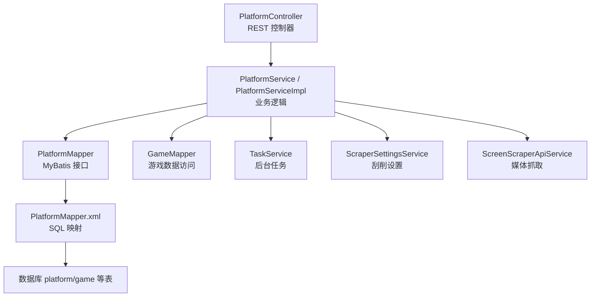
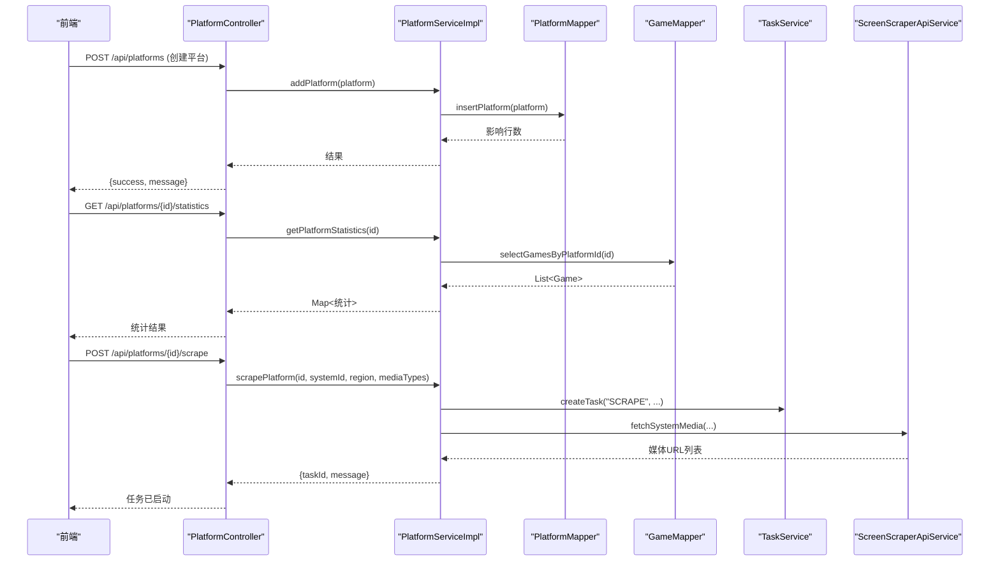
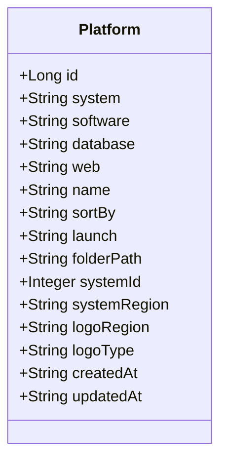
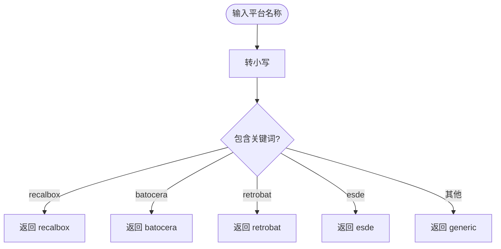
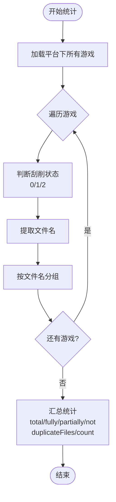
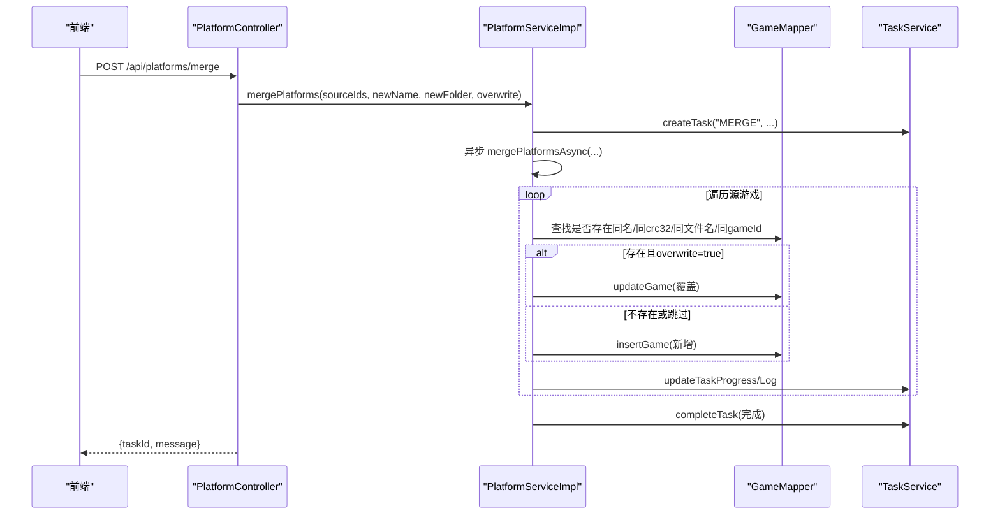
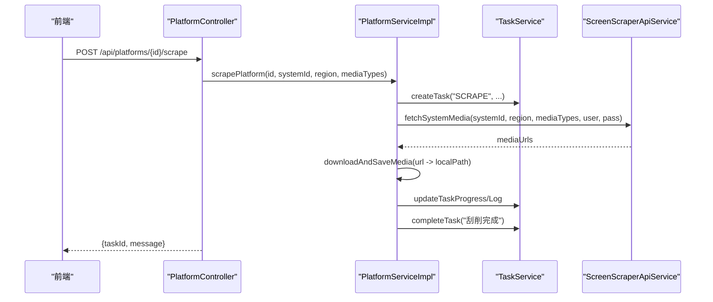
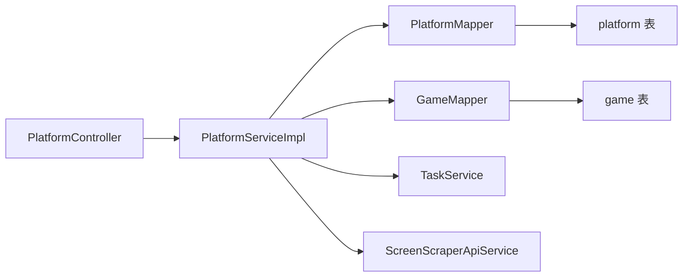

# 平台数据模型

<cite>
**本文引用的文件**
- [Platform.java](file://src/main/java/com/gamelist/model/Platform.java)
- [PlatformType.java](file://src/main/java/com/gamelist/model/PlatformType.java)
- [PlatformStatistics.java](file://src/main/java/com/gamelist/model/PlatformStatistics.java)
- [PlatformService.java](file://src/main/java/com/gamelist/service/PlatformService.java)
- [PlatformServiceImpl.java](file://src/main/java/com/gamelist/service/impl/PlatformServiceImpl.java)
- [PlatformController.java](file://src/main/java/com/gamelist/controller/PlatformController.java)
- [PlatformMapper.java](file://src/main/java/com/gamelist/mapper/PlatformMapper.java)
- [PlatformMapper.xml](file://src/main/resources/mappers/PlatformMapper.xml)
- [schema.sql](file://src/main/resources/schema.sql)
- [V1.0.3__baseline_migration.sql](file://src/main/resources/db/migration/V1.0.3__baseline_migration.sql)
- [V1.0.4__add_platform_fields.sql](file://src/main/resources/db/migration/V1.0.4__add_platform_fields.sql)
- [V1.0.6__add_platform_type_column.sql](file://src/main/resources/db/migration/V1.0.6__add_platform_type_column.sql)
</cite>

## 目录
1. [简介](#简介)
2. [项目结构](#项目结构)
3. [核心组件](#核心组件)
4. [架构总览](#架构总览)
5. [详细组件分析](#详细组件分析)
6. [依赖关系分析](#依赖关系分析)
7. [性能考量](#性能考量)
8. [故障排查指南](#故障排查指南)
9. [结论](#结论)
10. [附录](#附录)

## 简介
本文件围绕“平台”这一核心领域实体，系统化梳理平台数据模型的结构、类型分类、与游戏的关联关系、平台间的数据迁移（合并）机制、配置校验规则、CRUD 操作示例以及统计信息的计算与维护方式。文档面向不同技术背景的读者，提供从概念到代码级实现的渐进式说明，并辅以架构图、类图、时序图和流程图帮助理解。

## 项目结构
平台相关代码采用分层组织：
- 模型层：Platform、PlatformType、PlatformStatistics
- 服务层：PlatformService 接口与 PlatformServiceImpl 实现
- 控制层：PlatformController 暴露 REST API
- 持久层：PlatformMapper 接口与 XML 映射
- 数据库：Flyway 迁移脚本与 schema 定义

图表来源
- [PlatformController.java:22-174](file://src/main/java/com/gamelist/controller/PlatformController.java#L22-L174)
- [PlatformService.java:11-38](file://src/main/java/com/gamelist/service/PlatformService.java#L11-L38)
- [PlatformServiceImpl.java:29-54](file://src/main/java/com/gamelist/service/impl/PlatformServiceImpl.java#L29-L54)
- [PlatformMapper.java:8-16](file://src/main/java/com/gamelist/mapper/PlatformMapper.java#L8-L16)
- [PlatformMapper.xml:23-61](file://src/main/resources/mappers/PlatformMapper.xml#L23-L61)

章节来源
- [PlatformController.java:22-174](file://src/main/java/com/gamelist/controller/PlatformController.java#L22-L174)
- [PlatformService.java:11-38](file://src/main/java/com/gamelist/service/PlatformService.java#L11-L38)
- [PlatformMapper.java:8-16](file://src/main/java/com/gamelist/mapper/PlatformMapper.java#L8-L16)
- [PlatformMapper.xml:23-61](file://src/main/resources/mappers/PlatformMapper.xml#L23-L61)

## 核心组件
- Platform：平台实体，承载平台基本信息、类型标识、路径配置、排序与启动命令等。
- PlatformType：平台类型常量与识别工具，用于区分 RecalBox、Batocera、RetroBat、ESDE、通用等。
- PlatformStatistics：平台统计信息载体，包含总游戏数、刮削状态分布、缺失游戏数等。
- PlatformService/PlatformServiceImpl：平台 CRUD、创建带游戏平台、平台合并、统计计算、刮削任务调度等。
- PlatformController：对外暴露平台的增删改查、合并、统计、刮削等 REST 接口。
- PlatformMapper/XML：平台数据的持久化映射。

章节来源
- [Platform.java:3-140](file://src/main/java/com/gamelist/model/Platform.java#L3-L140)
- [PlatformType.java:3-50](file://src/main/java/com/gamelist/model/PlatformType.java#L3-L50)
- [PlatformStatistics.java:3-54](file://src/main/java/com/gamelist/model/PlatformStatistics.java#L3-L54)
- [PlatformService.java:11-38](file://src/main/java/com/gamelist/service/PlatformService.java#L11-L38)
- [PlatformServiceImpl.java:55-1305](file://src/main/java/com/gamelist/service/impl/PlatformServiceImpl.java#L55-L1305)
- [PlatformController.java:22-174](file://src/main/java/com/gamelist/controller/PlatformController.java#L22-L174)
- [PlatformMapper.java:8-16](file://src/main/java/com/gamelist/mapper/PlatformMapper.java#L8-L16)
- [PlatformMapper.xml:23-61](file://src/main/resources/mappers/PlatformMapper.xml#L23-L61)

## 架构总览
平台模块遵循典型的 MVC + Service + Mapper 分层架构，结合异步任务与外部抓取服务，形成“平台管理—游戏关联—统计与刮削”的闭环。

图表来源
- [PlatformController.java:57-174](file://src/main/java/com/gamelist/controller/PlatformController.java#L57-L174)
- [PlatformServiceImpl.java:55-1305](file://src/main/java/com/gamelist/service/impl/PlatformServiceImpl.java#L55-L1305)
- [PlatformMapper.xml:23-61](file://src/main/resources/mappers/PlatformMapper.xml#L23-L61)

## 详细组件分析

### Platform 实体结构与字段说明
- 标识与基础信息
  - id：主键
  - system：系统名称（唯一性用于去重）
  - name：显示名称（通常与 system 保持一致）
  - software/database/web：平台软件、数据库、Web 地址
- 行为与展示
  - sortBy：排序字段
  - launch：启动命令或参数
- 路径与区域
  - folderPath：平台根路径
  - systemRegion/logoRegion/logoType：区域与 Logo 类型
- 关联与时间戳
  - systemId：关联刮削系统 ID
  - createdAt/updatedAt：创建与更新时间

图表来源
- [Platform.java:3-140](file://src/main/java/com/gamelist/model/Platform.java#L3-L140)
- [PlatformMapper.xml:5-21](file://src/main/resources/mappers/PlatformMapper.xml#L5-L21)
- [V1.0.3__baseline_migration.sql:5-17](file://src/main/resources/db/migration/V1.0.3__baseline_migration.sql#L5-L17)

章节来源
- [Platform.java:3-140](file://src/main/java/com/gamelist/model/Platform.java#L3-L140)
- [PlatformMapper.xml:5-21](file://src/main/resources/mappers/PlatformMapper.xml#L5-L21)
- [V1.0.3__baseline_migration.sql:5-17](file://src/main/resources/db/migration/V1.0.3__baseline_migration.sql#L5-L17)

### PlatformType 枚举与作用
- 作用：集中维护受支持的平台类型常量，并提供类型校验与基于名称的智能识别。
- 支持类型：recalbox、batocera、retrobat、esde、generic。
- 关键方法：
  - isValidPlatformType：校验传入类型是否受支持
  - detectPlatformType：根据平台名/描述推断具体类型

图表来源
- [PlatformType.java:19-49](file://src/main/java/com/gamelist/model/PlatformType.java#L19-L49)

章节来源
- [PlatformType.java:3-50](file://src/main/java/com/gamelist/model/PlatformType.java#L3-L50)

### 平台与游戏的关联关系
- 一对多关系：一个平台对应多个游戏（game.platform_id → platform.id）。
- 外键约束：确保游戏记录必须归属于有效平台。
- 新增字段：platform_path、scraped、edited 等用于媒体与编辑状态跟踪。

```mermaid
erDiagram
PLATFORM {
bigint id PK
varchar system
varchar name
varchar folder_path
int system_id
varchar system_region
varchar logo_region
varchar logo_type
timestamp created_at
timestamp updated_at
}
GAME {
bigint id PK
varchar game_id
varchar path
varchar name
text desc
varchar image
varchar video
varchar marquee
varchar thumbnail
varchar manual
double rating
varchar releasedate
varchar developer
varchar publisher
varchar genre
varchar players
varchar crc32
varchar md5
varchar lang
varchar genreid
varchar sort_by
bigint platform_id FK
boolean scraped
boolean edited
boolean exists
varchar absolute_path
varchar platform_path
varchar box_front
varchar box_back
varchar box_spine
varchar box_full
varchar cartridge
varchar logo
varchar bezel
varchar panel
varchar cabinet_left
varchar cabinet_right
varchar tile
varchar banner
varchar steam
varchar poster
varchar background
varchar music
varchar screenshot
varchar titlescreen
varchar box3d
varchar steamgrid
varchar fanart
varchar boxtexture
varchar supporttexture
varchar videonormalized
varchar wheelcarbon
varchar wheelsteel
varchar screenmarqueesmall
varchar boxside
varchar figurine
timestamp created_at
timestamp updated_at
}
PLATFORM ||--o{ GAME : "拥有"
```

图表来源
- [V1.0.3__baseline_migration.sql:5-82](file://src/main/resources/db/migration/V1.0.3__baseline_migration.sql#L5-L82)
- [schema.sql:1-29](file://src/main/resources/schema.sql#L1-L29)

章节来源
- [V1.0.3__baseline_migration.sql:5-82](file://src/main/resources/db/migration/V1.0.3__baseline_migration.sql#L5-L82)
- [schema.sql:1-29](file://src/main/resources/schema.sql#L1-L29)

### 平台配置的验证规则与约束条件
- 平台名称规范化：保存时去除首尾空格，必要时使用默认值兜底。
- 唯一性约束：通过 system 字段进行重复检测，避免重复平台。
- 必填字段：system/name 在插入前会做非空校验与回退处理。
- 类型校验：PlatformType.isValidPlatformType 可用于前端或上游校验。
- 路径与区域：folderPath/systemRegion/logoRegion/logoType 为可选但需符合预期格式。

章节来源
- [PlatformServiceImpl.java:392-462](file://src/main/java/com/gamelist/service/impl/PlatformServiceImpl.java#L392-L462)
- [PlatformType.java:19-25](file://src/main/java/com/gamelist/model/PlatformType.java#L19-L25)

### 平台管理的 CRUD 操作示例
- 创建平台
  - 接口：POST /api/platforms
  - 请求体：Platform 对象
  - 响应：成功返回 {success, message}；失败返回错误信息
- 查询所有平台
  - 接口：GET /api/platforms
  - 响应：平台列表
- 按 ID 查询平台
  - 接口：GET /api/platforms/{id}
  - 响应：平台对象或 404
- 更新平台
  - 接口：PUT /api/platforms/{id}
  - 请求体：Platform 对象（含 id）
  - 响应：更新后的平台对象
- 删除平台
  - 接口：DELETE /api/platforms/{id}
  - 响应：204 No Content
- 创建带游戏的平台
  - 接口：POST /api/platforms/create-with-games
  - 请求体：{name, filter}
  - 响应：{success, platformName, platformId, gameCount}

章节来源
- [PlatformController.java:29-107](file://src/main/java/com/gamelist/controller/PlatformController.java#L29-L107)
- [PlatformService.java:11-23](file://src/main/java/com/gamelist/service/PlatformService.java#L11-L23)
- [PlatformServiceImpl.java:505-631](file://src/main/java/com/gamelist/service/impl/PlatformServiceImpl.java#L505-L631)

### 平台统计信息的计算与维护
- 统计维度
  - totalGames：平台下游戏总数
  - fullyScraped/partiallyScraped/notScraped：按“是否有描述+是否有媒体”划分三类
  - duplicateFiles/duplicateFilesCount：按文件名查重统计
- 计算流程
  - 获取平台下所有游戏
  - 遍历判断刮削状态与媒体存在性
  - 提取文件名构建重复组
  - 汇总统计结果

图表来源
- [PlatformServiceImpl.java:1039-1110](file://src/main/java/com/gamelist/service/impl/PlatformServiceImpl.java#L1039-L1110)
- [PlatformServiceImpl.java:1118-1163](file://src/main/java/com/gamelist/service/impl/PlatformServiceImpl.java#L1118-L1163)

章节来源
- [PlatformServiceImpl.java:1039-1110](file://src/main/java/com/gamelist/service/impl/PlatformServiceImpl.java#L1039-L1110)
- [PlatformServiceImpl.java:1118-1163](file://src/main/java/com/gamelist/service/impl/PlatformServiceImpl.java#L1118-L1163)

### 平台合并功能的实现细节与数据一致性保证
- 两种合并模式
  - 二合一：将次要平台的游戏合并到主要平台
  - 多合一新：将多个源平台的游戏合并到一个新平台
- 关键步骤
  - 创建后台任务，异步执行合并
  - 读取源平台游戏，逐个复制到目标平台
  - 冲突检测：优先按 gameId/crc32/文件名/游戏名匹配
  - 覆盖策略：可配置 overwrite=true 时覆盖已有记录
  - 进度与日志：实时更新任务进度与详细日志
- 数据一致性
  - 复制时使用 createGameCopy 完整拷贝字段，仅修改 platformId
  - 冲突时按优先级匹配，避免误覆盖
  - 异常捕获与任务失败标记，保证可观测性与可恢复性

图表来源
- [PlatformController.java:109-141](file://src/main/java/com/gamelist/controller/PlatformController.java#L109-L141)
- [PlatformServiceImpl.java:634-852](file://src/main/java/com/gamelist/service/impl/PlatformServiceImpl.java#L634-L852)
- [PlatformServiceImpl.java:858-991](file://src/main/java/com/gamelist/service/impl/PlatformServiceImpl.java#L858-L991)

章节来源
- [PlatformController.java:109-141](file://src/main/java/com/gamelist/controller/PlatformController.java#L109-L141)
- [PlatformServiceImpl.java:634-852](file://src/main/java/com/gamelist/service/impl/PlatformServiceImpl.java#L634-L852)
- [PlatformServiceImpl.java:858-991](file://src/main/java/com/gamelist/service/impl/PlatformServiceImpl.java#L858-L991)

### 平台刮削任务的触发与执行
- 触发入口：POST /api/platforms/{id}/scrape
- 执行流程
  - 校验平台存在
  - 读取刮削设置（用户名/密码）
  - 创建 SCRAPE 任务，异步执行
  - 按 region × mediaTypes 组合调用抓取服务
  - 下载并保存媒体文件，更新平台 systemId/systemRegion
  - 完成任务并返回进度

图表来源
- [PlatformController.java:156-174](file://src/main/java/com/gamelist/controller/PlatformController.java#L156-L174)
- [PlatformServiceImpl.java:1166-1302](file://src/main/java/com/gamelist/service/impl/PlatformServiceImpl.java#L1166-L1302)

章节来源
- [PlatformController.java:156-174](file://src/main/java/com/gamelist/controller/PlatformController.java#L156-L174)
- [PlatformServiceImpl.java:1166-1302](file://src/main/java/com/gamelist/service/impl/PlatformServiceImpl.java#L1166-L1302)

## 依赖关系分析
- 控制器依赖服务层，服务层依赖 Mapper 与外部服务（TaskService、ScraperSettingsService、ScreenScraperApiService）。
- 平台与游戏通过外键关联，合并与统计均围绕该关系展开。
- 数据库迁移脚本逐步扩展了 platform 与 game 表的字段，支撑新功能。

图表来源
- [PlatformController.java:22-174](file://src/main/java/com/gamelist/controller/PlatformController.java#L22-L174)
- [PlatformServiceImpl.java:29-54](file://src/main/java/com/gamelist/service/impl/PlatformServiceImpl.java#L29-L54)
- [PlatformMapper.java:8-16](file://src/main/java/com/gamelist/mapper/PlatformMapper.java#L8-L16)

章节来源
- [PlatformController.java:22-174](file://src/main/java/com/gamelist/controller/PlatformController.java#L22-L174)
- [PlatformServiceImpl.java:29-54](file://src/main/java/com/gamelist/service/impl/PlatformServiceImpl.java#L29-L54)
- [PlatformMapper.java:8-16](file://src/main/java/com/gamelist/mapper/PlatformMapper.java#L8-L16)

## 性能考量
- 批量插入：临时子集游戏写入采用分批插入，降低数据库压力。
- 异步任务：平台合并与刮削均通过后台任务异步执行，提升用户体验。
- 去重策略：合并时多级匹配（gameId/crc32/文件名/名称），减少冗余写入。
- 索引优化：媒体下载任务表对 platform_id 建立索引，提高查询效率。

章节来源
- [PlatformServiceImpl.java:201-224](file://src/main/java/com/gamelist/service/impl/PlatformServiceImpl.java#L201-L224)
- [PlatformServiceImpl.java:634-852](file://src/main/java/com/gamelist/service/impl/PlatformServiceImpl.java#L634-L852)
- [V1.0.4__add_platform_fields.sql:8-9](file://src/main/resources/db/migration/V1.0.4__add_platform_fields.sql#L8-L9)

## 故障排查指南
- 平台添加失败
  - 检查 system/name 是否为空或重复
  - 查看服务日志中的异常堆栈与提示信息
- 平台合并失败
  - 确认源平台是否存在
  - 检查任务进度与日志，定位具体失败步骤
- 刮削失败
  - 检查刮削设置（用户名/密码）是否正确
  - 关注网络超时与 NOMEDIA 响应
- 统计数据异常
  - 核对游戏描述与媒体字段是否填充
  - 检查文件名重复导致的统计偏差

章节来源
- [PlatformController.java:57-174](file://src/main/java/com/gamelist/controller/PlatformController.java#L57-L174)
- [PlatformServiceImpl.java:634-852](file://src/main/java/com/gamelist/service/impl/PlatformServiceImpl.java#L634-L852)
- [PlatformServiceImpl.java:1166-1302](file://src/main/java/com/gamelist/service/impl/PlatformServiceImpl.java#L1166-L1302)

## 结论
平台数据模型以 Platform 为核心，配合 PlatformType 的类型管理与 PlatformStatistics 的统计能力，构建了完整的平台生命周期管理能力。通过服务层封装的 CRUD、合并与刮削功能，以及 MyBatis 映射与数据库迁移脚本，实现了可扩展、可维护、可观测的平台管理体系。建议在实际使用中严格遵循字段规范与校验规则，充分利用异步任务与批量操作以提升性能与稳定性。

## 附录
- 数据库字段演进
  - 初始平台表结构：id、system、software、database、web、name、sort_by、launch、folder_path、created_at、updated_at
  - 新增刮削系统关联：system_id、system_region、logo_region、logo_type
  - 游戏表新增：scraped、edited、platform_path 及多种媒体字段
  - 媒体下载任务表新增：platform_id、platform_name 及索引

章节来源
- [V1.0.3__baseline_migration.sql:5-17](file://src/main/resources/db/migration/V1.0.3__baseline_migration.sql#L5-L17)
- [V1.0.3__baseline_migration.sql:193-197](file://src/main/resources/db/migration/V1.0.3__baseline_migration.sql#L193-L197)
- [schema.sql:1-29](file://src/main/resources/schema.sql#L1-L29)
- [V1.0.4__add_platform_fields.sql:4-9](file://src/main/resources/db/migration/V1.0.4__add_platform_fields.sql#L4-L9)
- [V1.0.6__add_platform_type_column.sql:1-2](file://src/main/resources/db/migration/V1.0.6__add_platform_type_column.sql#L1-L2)