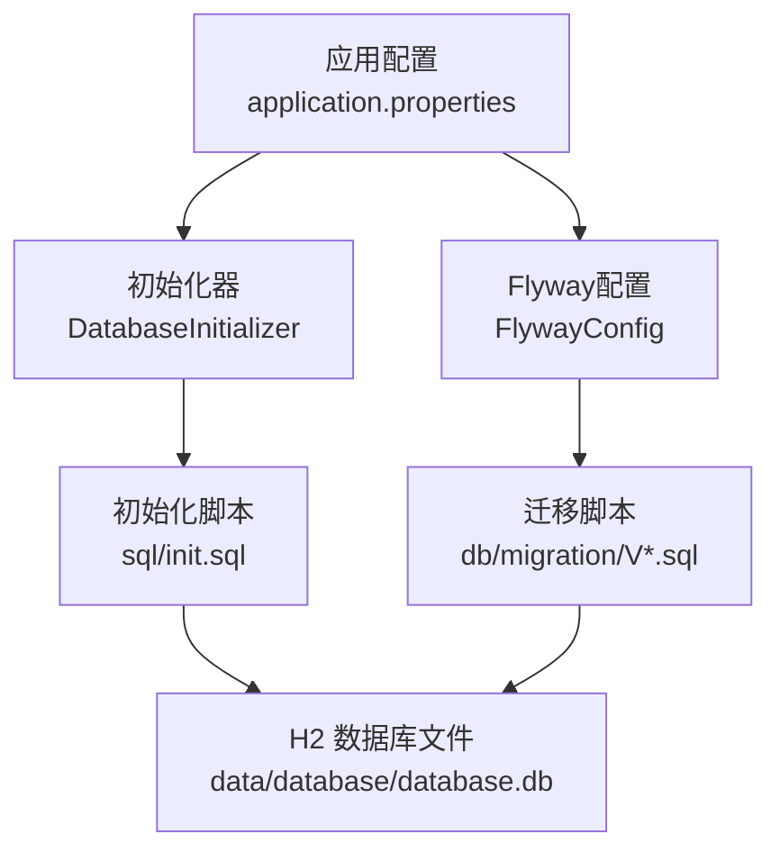
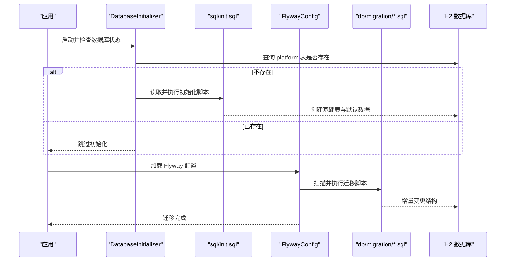
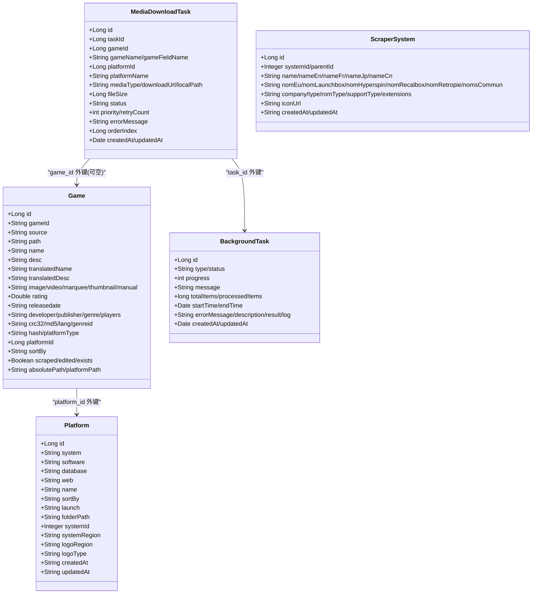
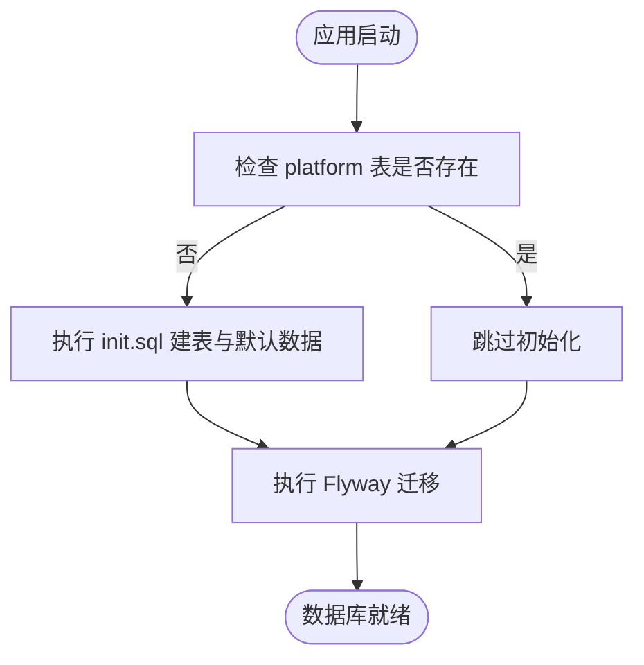
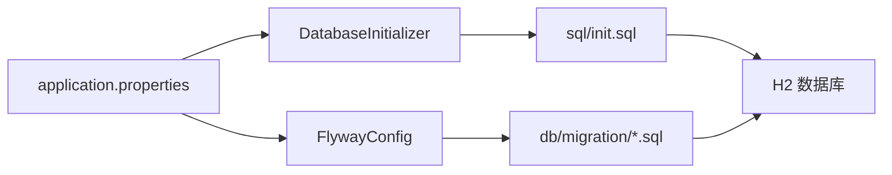

# 数据库架构

<cite>
**本文引用的文件**
- [application.properties](file://src/main/resources/application.properties)
- [FlywayConfig.java](file://src/main/java/com/gamelist/config/FlywayConfig.java)
- [DatabaseInitializer.java](file://src/main/java/com/gamelist/config/DatabaseInitializer.java)
- [init.sql](file://src/main/resources/sql/init.sql)
- [schema.sql](file://src/main/resources/schema.sql)
- [V1.0.3__baseline_migration.sql](file://src/main/resources/db/migration/V1.0.3__baseline_migration.sql)
- [V1.0.4__add_platform_fields.sql](file://src/main/resources/db/migration/V1.0.4__add_platform_fields.sql)
- [V1.0.5__add_new_media_types.sql](file://src/main/resources/db/migration/V1.0.5__add_new_media_types.sql)
- [V1.0.6__add_platform_type_column.sql](file://src/main/resources/db/migration/V1.0.6__add_platform_type_column.sql)
- [V1.0.7__add_hash_column.sql](file://src/main/resources/db/migration/V1.0.7__add_hash_column.sql)
- [V1.0.8__add_missing_columns.sql](file://src/main/resources/db/migration/V1.0.8__add_missing_columns.sql)
- [V1.0.9__add_game_field_name.sql](file://src/main/resources/db/migration/V1.0.9__add_game_field_name.sql)
- [V1.0.10__allow_null_game_id.sql](file://src/main/resources/db/migration/V1.0.10__allow_null_game_id.sql)
- [Game.java](file://src/main/java/com/gamelist/model/Game.java)
- [Platform.java](file://src/main/java/com/gamelist/model/Platform.java)
- [BackgroundTask.java](file://src/main/java/com/gamelist/model/BackgroundTask.java)
- [MediaDownloadTask.java](file://src/main/java/com/gamelist/model/MediaDownloadTask.java)
- [ScraperSystem.java](file://src/main/java/com/gamelist/model/ScraperSystem.java)
</cite>

## 目录
1. [简介](#简介)
2. [项目结构](#项目结构)
3. [核心组件](#核心组件)
4. [架构总览](#架构总览)
5. [详细组件分析](#详细组件分析)
6. [依赖关系分析](#依赖关系分析)
7. [性能考虑](#性能考虑)
8. [故障排查指南](#故障排查指南)
9. [结论](#结论)
10. [附录](#附录)

## 简介
本文件为项目的 H2 嵌入式数据库完整架构文档。内容涵盖：
- 表结构与字段定义、数据类型与约束
- Flyway 版本迁移机制与变更历史
- 表间关系设计（主外键、索引策略）
- 数据库初始化流程与默认数据配置
- 备份与恢复最佳实践
- 性能调优建议与监控指标
- 数据迁移策略与版本升级注意事项
- 并发访问控制与事务管理机制

## 项目结构
数据库相关资源与配置集中在以下位置：
- 应用配置：H2 连接、连接池、H2 控制台、SQL 初始化与 Flyway 开关等
- 初始化脚本：首次启动时创建基础表与默认系统设置
- 迁移脚本：按版本号递增的增量变更，用于演进数据库结构
- 模型类：Java 实体映射到数据库表，体现字段语义与业务含义

图表来源
- [application.properties:15-37](file://src/main/resources/application.properties#L15-L37)
- [DatabaseInitializer.java:23-52](file://src/main/java/com/gamelist/config/DatabaseInitializer.java#L23-L52)
- [FlywayConfig.java:17-75](file://src/main/java/com/gamelist/config/FlywayConfig.java#L17-L75)

章节来源
- [application.properties:15-37](file://src/main/resources/application.properties#L15-L37)
- [DatabaseInitializer.java:23-52](file://src/main/java/com/gamelist/config/DatabaseInitializer.java#L23-L52)
- [FlywayConfig.java:17-75](file://src/main/java/com/gamelist/config/FlywayConfig.java#L17-L75)

## 核心组件
- 数据库连接与连接池
  - 使用 H2 文件模式，启用 AUTO_SERVER，便于多进程访问；HikariCP 连接池参数已配置
- 初始化器
  - 启动时检查平台表是否存在，若不存在则执行 sql/init.sql 完成建表与默认数据注入
- Flyway 迁移
  - 通过自定义配置类在启动阶段执行迁移，支持基线版本与失败修复
- 模型映射
  - Game、Platform、BackgroundTask、MediaDownloadTask、ScraperSystem 等实体与表一一对应

章节来源
- [application.properties:15-37](file://src/main/resources/application.properties#L15-L37)
- [DatabaseInitializer.java:23-52](file://src/main/java/com/gamelist/config/DatabaseInitializer.java#L23-L52)
- [FlywayConfig.java:17-75](file://src/main/java/com/gamelist/config/FlywayConfig.java#L17-L75)
- [Game.java:1-650](file://src/main/java/com/gamelist/model/Game.java#L1-L650)
- [Platform.java:1-141](file://src/main/java/com/gamelist/model/Platform.java#L1-L141)
- [BackgroundTask.java:1-114](file://src/main/java/com/gamelist/model/BackgroundTask.java#L1-L114)
- [MediaDownloadTask.java:1-175](file://src/main/java/com/gamelist/model/MediaDownloadTask.java#L1-L175)
- [ScraperSystem.java:1-228](file://src/main/java/com/gamelist/model/ScraperSystem.java#L1-L228)

## 架构总览
下图展示从应用启动到数据库就绪的关键路径：应用读取配置，先执行初始化脚本确保基础表存在，再运行 Flyway 迁移以演进结构。

图表来源
- [DatabaseInitializer.java:34-52](file://src/main/java/com/gamelist/config/DatabaseInitializer.java#L34-L52)
- [init.sql:1-305](file://src/main/resources/sql/init.sql#L1-L305)
- [FlywayConfig.java:35-75](file://src/main/java/com/gamelist/config/FlywayConfig.java#L35-L75)
- [application.properties:29-37](file://src/main/resources/application.properties#L29-L37)

## 详细组件分析

### 表结构与字段定义
- 平台表（platform）
  - 主键：id（自增）
  - 关键字段：system、software、database、web、name、sort_by、launch、folder_path、时间戳
  - 扩展字段：system_id、system_region、logo_region、logo_type（兼容旧库）
- 游戏表（game）
  - 主键：id（自增）
  - 标识与元数据：game_id、source、path、name、desc、translated_name/desc、媒体字段（图片/视频/海报等）、评分、发行日期、开发商/发行商、类型/玩家数、校验码、语言、排序等
  - 关联：platform_id（外键）
  - 状态与路径：scraped、edited、exists、absolute_path、platform_path
  - 扩展：platform_type、hash、更多媒体字段
- 临时子集表（temp_subset）
  - 主键：id（自增）
  - 字段：name、description、creator_id、status、时间戳
- 临时子集游戏表（temp_subset_game）
  - 主键：id（自增）
  - 关联：subset_id、original_game_id、platform_id（均为外键）
  - 字段：与 game 表基本一致，包含媒体字段与状态字段
- 刮削系统表（scraper_system）
  - 主键：id（自增）
  - 唯一键：system_id
  - 字段：多语言名称、公司、类型、年份、ROM 类型、支持类型、扩展名、图标 URL、时间戳
- 后台任务表（background_task）
  - 主键：id（自增）
  - 字段：type、status、progress、message、total_items、processed_items、start_time、end_time、error_message、description、result、log、时间戳
- 媒体下载任务表（media_download_task）
  - 主键：id（自增）
  - 关联：task_id（外键）、game_id（外键，允许为空）
  - 字段：game_name、platform_id、platform_name、media_type、download_url、local_path、file_size、status、priority、retry_count、error_message、order_index、时间戳
- 系统设置表（system_settings）
  - 主键：id（自增）
  - 唯一键：setting_key
  - 字段：setting_value、description、时间戳
  - 默认数据：备份根目录、游戏路径、翻译 API Key 等
- 合并报告与冲突表（merge_report、merge_conflict）
  - 用于记录平台合并过程及冲突详情，含外键关联至 platform 与 game

章节来源
- [init.sql:1-305](file://src/main/resources/sql/init.sql#L1-L305)
- [V1.0.3__baseline_migration.sql:5-238](file://src/main/resources/db/migration/V1.0.3__baseline_migration.sql#L5-L238)
- [V1.0.4__add_platform_fields.sql:1-10](file://src/main/resources/db/migration/V1.0.4__add_platform_fields.sql#L1-L10)
- [V1.0.5__add_new_media_types.sql:1-13](file://src/main/resources/db/migration/V1.0.5__add_new_media_types.sql#L1-L13)
- [V1.0.6__add_platform_type_column.sql:1-2](file://src/main/resources/db/migration/V1.0.6__add_platform_type_column.sql#L1-L2)
- [V1.0.7__add_hash_column.sql:1-2](file://src/main/resources/db/migration/V1.0.7__add_hash_column.sql#L1-L2)
- [V1.0.8__add_missing_columns.sql:1-6](file://src/main/resources/db/migration/V1.0.8__add_missing_columns.sql#L1-L6)
- [V1.0.9__add_game_field_name.sql:1-3](file://src/main/resources/db/migration/V1.0.9__add_game_field_name.sql#L1-L3)
- [V1.0.10__allow_null_game_id.sql:1-6](file://src/main/resources/db/migration/V1.0.10__allow_null_game_id.sql#L1-L6)
- [schema.sql:1-29](file://src/main/resources/schema.sql#L1-L29)

### 表关系与索引策略
- 主外键关系
  - game.platform_id → platform.id
  - temp_subset_game.subset_id → temp_subset.id
  - temp_subset_game.original_game_id → game.id
  - media_download_task.task_id → background_task.id
  - media_download_task.game_id → game.id（允许为空）
  - merge_conflict.report_id → merge_report.id
  - merge_conflict.source_game_id/existing_game_id → game.id
  - merge_report.new_platform_id → platform.id
- 索引策略
  - media_download_task.platform_id 建有索引以提升查询性能
  - scraper_system.system_id 具有唯一约束，天然具备唯一索引
- 性能优化建议
  - 对高频查询字段建立复合索引（如 game.path、game.name、media_download_task.status）
  - 大文本字段（desc、log）避免频繁检索，必要时分表或归档
  - 合理设置 H2 连接池大小与超时，避免连接耗尽

章节来源
- [init.sql:1-305](file://src/main/resources/sql/init.sql#L1-L305)
- [V1.0.4__add_platform_fields.sql:8-10](file://src/main/resources/db/migration/V1.0.4__add_platform_fields.sql#L8-L10)

### 实体与表的映射关系

图表来源
- [Platform.java:1-141](file://src/main/java/com/gamelist/model/Platform.java#L1-L141)
- [Game.java:1-650](file://src/main/java/com/gamelist/model/Game.java#L1-L650)
- [BackgroundTask.java:1-114](file://src/main/java/com/gamelist/model/BackgroundTask.java#L1-L114)
- [MediaDownloadTask.java:1-175](file://src/main/java/com/gamelist/model/MediaDownloadTask.java#L1-L175)
- [ScraperSystem.java:1-228](file://src/main/java/com/gamelist/model/ScraperSystem.java#L1-L228)

### 初始化流程与默认数据
- 启动时由 DatabaseInitializer 检测 platform 表是否存在
- 若不存在，则执行 sql/init.sql 创建所有基础表并插入默认系统设置
- 随后 Flyway 根据 baseline-version 与迁移脚本进行版本演进

图表来源
- [DatabaseInitializer.java:34-52](file://src/main/java/com/gamelist/config/DatabaseInitializer.java#L34-L52)
- [init.sql:92-116](file://src/main/resources/sql/init.sql#L92-L116)
- [FlywayConfig.java:35-75](file://src/main/java/com/gamelist/config/FlywayConfig.java#L35-L75)

章节来源
- [DatabaseInitializer.java:34-52](file://src/main/java/com/gamelist/config/DatabaseInitializer.java#L34-L52)
- [init.sql:92-116](file://src/main/resources/sql/init.sql#L92-L116)
- [FlywayConfig.java:35-75](file://src/main/java/com/gamelist/config/FlywayConfig.java#L35-L75)

### Flyway 版本管理与迁移历史
- 基线版本：1.0.2（配置项 baseline-version）
- 迁移脚本顺序与作用
  - V1.0.3：创建基础表（platform、game、temp_subset、temp_subset_game、scraper_system、background_task、media_download_task），并为 platform 添加系统关联字段
  - V1.0.4：为 media_download_task 增加 platform_id、platform_name 并创建索引
  - V1.0.5：为 game 与 temp_subset_game 新增多种媒体类型字段
  - V1.0.6：为 game 增加 platform_type 字段
  - V1.0.7：为 game 增加 hash 字段
  - V1.0.8：补充缺失的媒体字段（与 V1.0.5 重复覆盖）
  - V1.0.9：为 media_download_task 增加 game_field_name 字段
  - V1.0.10：将 media_download_task.game_id 修改为允许 NULL
- 失败修复：FlywayConfig 在检测到失败迁移时自动 repair 后重试

章节来源
- [application.properties:33-37](file://src/main/resources/application.properties#L33-L37)
- [FlywayConfig.java:35-75](file://src/main/java/com/gamelist/config/FlywayConfig.java#L35-L75)
- [V1.0.3__baseline_migration.sql:5-238](file://src/main/resources/db/migration/V1.0.3__baseline_migration.sql#L5-L238)
- [V1.0.4__add_platform_fields.sql:1-10](file://src/main/resources/db/migration/V1.0.4__add_platform_fields.sql#L1-L10)
- [V1.0.5__add_new_media_types.sql:1-13](file://src/main/resources/db/migration/V1.0.5__add_new_media_types.sql#L1-L13)
- [V1.0.6__add_platform_type_column.sql:1-2](file://src/main/resources/db/migration/V1.0.6__add_platform_type_column.sql#L1-L2)
- [V1.0.7__add_hash_column.sql:1-2](file://src/main/resources/db/migration/V1.0.7__add_hash_column.sql#L1-L2)
- [V1.0.8__add_missing_columns.sql:1-6](file://src/main/resources/db/migration/V1.0.8__add_missing_columns.sql#L1-L6)
- [V1.0.9__add_game_field_name.sql:1-3](file://src/main/resources/db/migration/V1.0.9__add_game_field_name.sql#L1-L3)
- [V1.0.10__allow_null_game_id.sql:1-6](file://src/main/resources/db/migration/V1.0.10__allow_null_game_id.sql#L1-L6)

### 并发访问控制与事务管理
- 连接池：HikariCP 最大连接数、空闲连接、超时与生命周期已配置
- 事务：
  - 初始化脚本执行时显式关闭自动提交，逐条执行并在异常时回滚
  - Flyway 迁移由框架管理事务边界
- 并发：
  - H2 启用 AUTO_SERVER，支持多进程访问
  - 建议在业务层对写操作加锁或使用队列串行化长事务

章节来源
- [application.properties:21-28](file://src/main/resources/application.properties#L21-L28)
- [DatabaseInitializer.java:81-100](file://src/main/java/com/gamelist/config/DatabaseInitializer.java#L81-L100)
- [FlywayConfig.java:35-75](file://src/main/java/com/gamelist/config/FlywayConfig.java#L35-L75)

## 依赖关系分析
- 配置驱动：application.properties 决定数据库连接、连接池、H2 控制台、SQL 初始化与 Flyway 行为
- 初始化依赖：DatabaseInitializer 依赖 DataSource 与 init.sql
- 迁移依赖：FlywayConfig 依赖 DataSource 与 db/migration 下的脚本
- 模型依赖：各 Model 类与表结构保持一致，作为 ORM 映射的基础

图表来源
- [application.properties:15-37](file://src/main/resources/application.properties#L15-L37)
- [DatabaseInitializer.java:23-52](file://src/main/java/com/gamelist/config/DatabaseInitializer.java#L23-L52)
- [FlywayConfig.java:17-75](file://src/main/java/com/gamelist/config/FlywayConfig.java#L17-L75)

章节来源
- [application.properties:15-37](file://src/main/resources/application.properties#L15-L37)
- [DatabaseInitializer.java:23-52](file://src/main/java/com/gamelist/config/DatabaseInitializer.java#L23-L52)
- [FlywayConfig.java:17-75](file://src/main/java/com/gamelist/config/FlywayConfig.java#L17-L75)

## 性能考虑
- 连接池调优
  - maximum-pool-size=30、minimum-idle=10、idle-timeout=60s、connection-timeout=10s、max-lifetime=30min
- 索引优化
  - 为 media_download_task.platform_id 已建索引
  - 建议为 game.path、game.name、media_download_task.status 等高频查询列建立索引
- 存储与查询
  - 大文本字段（desc、log）避免全表扫描与频繁读取
  - 合理使用分页与只读查询
- H2 特性
  - 启用 AUTO_SERVER 提升多进程访问稳定性
  - 定期导出备份以减少文件膨胀

[本节提供通用指导，不直接分析具体文件]

## 故障排查指南
- 初始化失败
  - 检查 platform 表是否存在；查看 init.sql 是否成功执行
  - 关注日志中的 SQL 执行错误与回滚信息
- 迁移失败
  - FlywayConfig 会检测失败迁移并尝试 repair；查看迁移日志定位问题
  - 核对迁移脚本顺序与兼容性（H2 语法）
- 连接池耗尽
  - 调整 HikariCP 参数；检查长事务与未释放连接
- 数据不一致
  - 对比 schema.sql 与迁移脚本，确保结构同步
  - 使用 H2 控制台验证表结构与数据

章节来源
- [DatabaseInitializer.java:68-100](file://src/main/java/com/gamelist/config/DatabaseInitializer.java#L68-L100)
- [FlywayConfig.java:46-75](file://src/main/java/com/gamelist/config/FlywayConfig.java#L46-L75)
- [application.properties:55-58](file://src/main/resources/application.properties#L55-L58)

## 结论
本项目采用 H2 嵌入式数据库配合 Flyway 进行版本化管理，通过初始化脚本与迁移脚本协同实现数据库结构的稳定演进。合理的连接池配置与索引策略保障了基本性能。建议在后续迭代中持续完善索引、监控与备份策略，确保数据一致性与可用性。

[本节总结性内容，不直接分析具体文件]

## 附录

### 备份与恢复最佳实践
- 备份
  - 定期复制 data/database/database.db 文件
  - 结合系统设置中的备份路径进行自动化备份
- 恢复
  - 停止应用后替换数据库文件
  - 重启应用，确认 Flyway 迁移状态与数据完整性

[本节提供通用指导，不直接分析具体文件]

### 数据迁移策略与版本升级注意事项
- 新增字段优先使用 IF NOT EXISTS 与默认值，保证向后兼容
- 删除或重命名字段需评估影响面，必要时保留过渡期
- 迁移脚本幂等，避免重复执行导致错误
- 升级前备份数据库，先在测试环境验证

[本节提供通用指导，不直接分析具体文件]

### 监控指标建议
- 连接池指标：活跃连接数、等待线程数、连接泄漏
- 迁移指标：迁移耗时、失败次数、修复次数
- 查询性能：慢查询日志、热点表访问频率
- 磁盘与文件：数据库文件大小增长趋势

[本节提供通用指导，不直接分析具体文件]