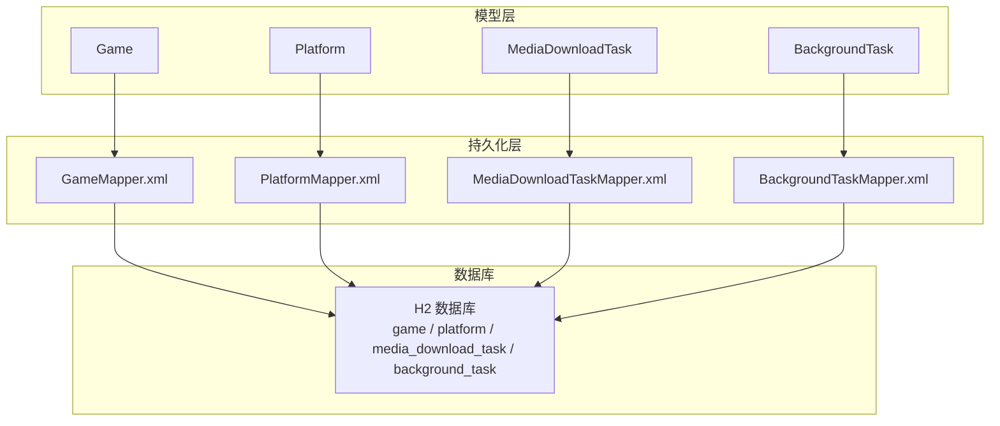
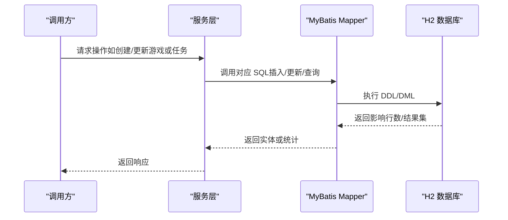
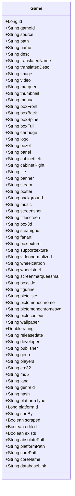
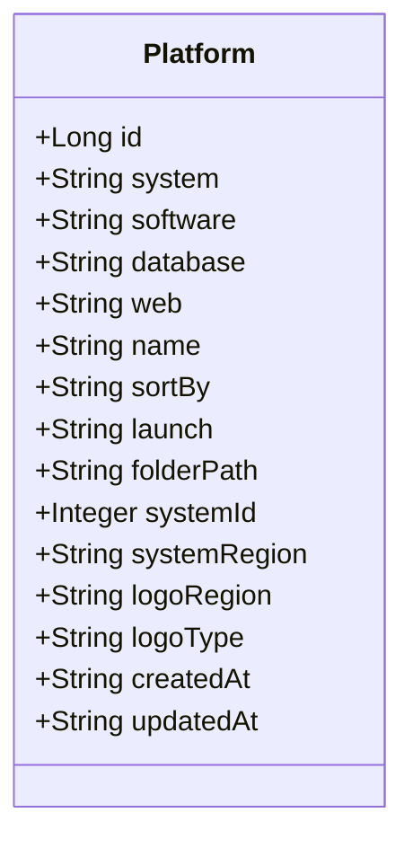
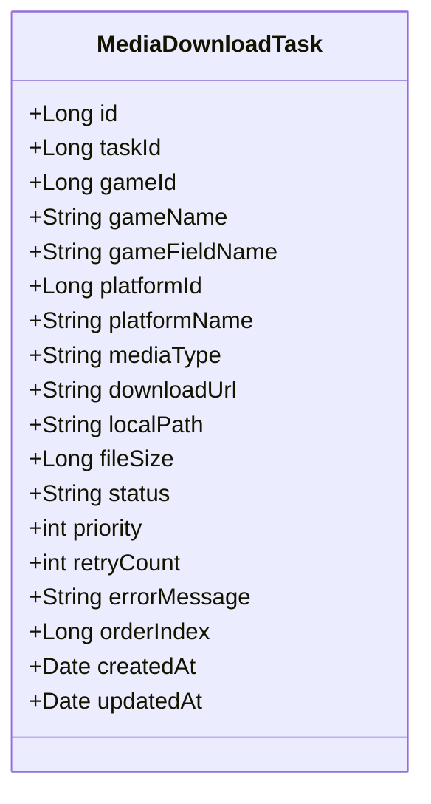
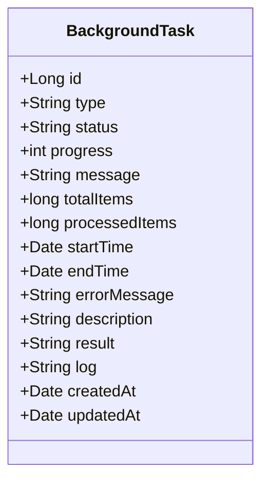
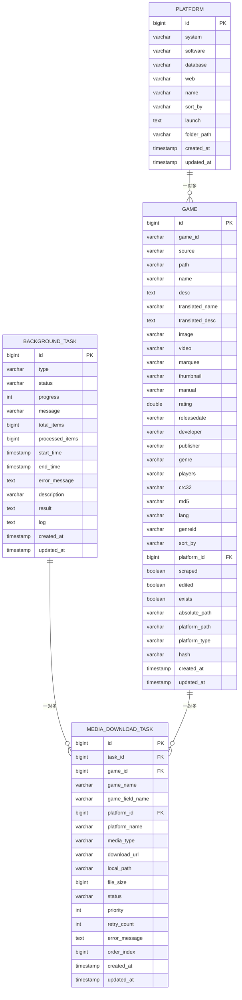
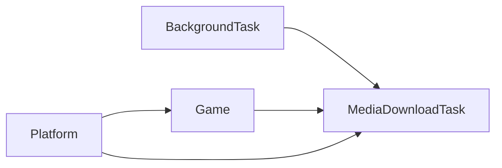

# 数据模型

<cite>
**本文引用的文件**
- [Game.java](file://src/main/java/com/gamelist/model/Game.java)
- [Platform.java](file://src/main/java/com/gamelist/model/Platform.java)
- [MediaDownloadTask.java](file://src/main/java/com/gamelist/model/MediaDownloadTask.java)
- [BackgroundTask.java](file://src/main/java/com/gamelist/model/BackgroundTask.java)
- [V1.0.3__baseline_migration.sql](file://src/main/resources/db/migration/V1.0.3__baseline_migration.sql)
- [V1.0.4__add_platform_fields.sql](file://src/main/resources/db/migration/V1.0.4__add_platform_fields.sql)
- [V1.0.5__add_new_media_types.sql](file://src/main/resources/db/migration/V1.0.5__add_new_media_types.sql)
- [V1.0.6__add_platform_type_column.sql](file://src/main/resources/db/migration/V1.0.6__add_platform_type_column.sql)
- [V1.0.7__add_hash_column.sql](file://src/main/resources/db/migration/V1.0.7__add_hash_column.sql)
- [V1.0.8__add_missing_columns.sql](file://src/main/resources/db/migration/V1.0.8__add_missing_columns.sql)
- [V1.0.9__add_game_field_name.sql](file://src/main/resources/db/migration/V1.0.9__add_game_field_name.sql)
- [V1.0.10__allow_null_game_id.sql](file://src/main/resources/db/migration/V1.0.10__allow_null_game_id.sql)
- [GameMapper.xml](file://src/main/resources/mappers/GameMapper.xml)
- [PlatformMapper.xml](file://src/main/resources/mappers/PlatformMapper.xml)
- [MediaDownloadTaskMapper.xml](file://src/main/resources/mappers/MediaDownloadTaskMapper.xml)
- [BackgroundTaskMapper.xml](file://src/main/resources/mappers/BackgroundTaskMapper.xml)
- [application.properties](file://src/main/resources/application.properties)
</cite>

## 目录
1. [简介](#简介)
2. [项目结构](#项目结构)
3. [核心组件](#核心组件)
4. [架构总览](#架构总览)
5. [详细组件分析](#详细组件分析)
6. [依赖关系分析](#依赖关系分析)
7. [性能考虑](#性能考虑)
8. [故障排查指南](#故障排查指南)
9. [结论](#结论)
10. [附录](#附录)

## 简介
本文件为 WebGameListOper 项目的数据模型完整文档，聚焦以下核心实体：游戏（Game）、平台（Platform）、媒体下载任务（MediaDownloadTask）、后台任务（BackgroundTask）。内容涵盖实体字段定义、数据类型与业务含义；数据库表结构设计（主键、外键、索引、约束）；实体间关系映射；数据验证规则与业务约束；数据库迁移历史；数据访问模式与 ORM 映射配置；数据生命周期管理（创建、更新、删除、归档策略）；以及备份与恢复最佳实践。

## 项目结构
本项目采用分层组织：
- 领域模型位于 model 包，定义 Game、Platform、MediaDownloadTask、BackgroundTask 等实体。
- 数据持久化通过 MyBatis XML 映射文件实现，位于 resources/mappers。
- 数据库版本演进由 Flyway 迁移脚本驱动，位于 resources/db/migration。
- 应用配置集中于 application.properties，包含 H2 数据库、连接池、MyBatis、静态资源等设置。

图表来源
- [Game.java:1-650](file://src/main/java/com/gamelist/model/Game.java#L1-L650)
- [Platform.java:1-141](file://src/main/java/com/gamelist/model/Platform.java#L1-L141)
- [MediaDownloadTask.java:1-175](file://src/main/java/com/gamelist/model/MediaDownloadTask.java#L1-L175)
- [BackgroundTask.java:1-114](file://src/main/java/com/gamelist/model/BackgroundTask.java#L1-L114)
- [GameMapper.xml:1-855](file://src/main/resources/mappers/GameMapper.xml#L1-L855)
- [PlatformMapper.xml:1-63](file://src/main/resources/mappers/PlatformMapper.xml#L1-L63)
- [MediaDownloadTaskMapper.xml:1-180](file://src/main/resources/mappers/MediaDownloadTaskMapper.xml#L1-L180)
- [BackgroundTaskMapper.xml:1-72](file://src/main/resources/mappers/BackgroundTaskMapper.xml#L1-L72)

章节来源
- [application.properties:15-41](file://src/main/resources/application.properties#L15-L41)

## 核心组件
本节概述四大实体的职责与关键字段：
- Game：游戏元数据与媒体资源路径、刮削状态、平台关联、排序与哈希等。
- Platform：平台信息（系统名、软件、数据库、Web 地址、名称、排序、启动命令、文件夹路径、区域与 Logo 类型等）。
- MediaDownloadTask：媒体下载任务项，记录目标游戏、平台、媒体类型、下载地址、本地路径、文件大小、优先级、重试次数、错误信息与顺序索引等。
- BackgroundTask：后台任务（导入/导出/翻译等），跟踪类型、状态、进度、消息、起止时间、结果与日志。

章节来源
- [Game.java:1-650](file://src/main/java/com/gamelist/model/Game.java#L1-L650)
- [Platform.java:1-141](file://src/main/java/com/gamelist/model/Platform.java#L1-L141)
- [MediaDownloadTask.java:1-175](file://src/main/java/com/gamelist/model/MediaDownloadTask.java#L1-L175)
- [BackgroundTask.java:1-114](file://src/main/java/com/gamelist/model/BackgroundTask.java#L1-L114)

## 架构总览
数据流从控制器到服务再到 Mapper，最终落盘至 H2 数据库。实体与表的映射通过 MyBatis ResultMap 完成，迁移脚本负责表结构演进。

图表来源
- [GameMapper.xml:74-99](file://src/main/resources/mappers/GameMapper.xml#L74-L99)
- [PlatformMapper.xml:23-26](file://src/main/resources/mappers/PlatformMapper.xml#L23-L26)
- [MediaDownloadTaskMapper.xml:26-37](file://src/main/resources/mappers/MediaDownloadTaskMapper.xml#L26-L37)
- [BackgroundTaskMapper.xml:23-26](file://src/main/resources/mappers/BackgroundTaskMapper.xml#L23-L26)

## 详细组件分析

### 实体类设计（Game）
- 标识与来源：id（自增主键）、gameId（外部标识）、source（来源）。
- 基本元数据：name、desc、translatedName、translatedDesc、releasedate、developer、publisher、genre、players、lang、genreid。
- 媒体资源路径：image、video、marquee、thumbnail、manual、boxFront/Back/Spine/Full、cartridge、logo、bezel、panel、cabinetLeft/Right、tile、banner、steam、poster、background、music、screenshot、titlescreen、box3d、steamgrid、fanart、boxtexture、supporttexture、videonormalized、wheelcarbon、wheelsteel、screenmarqueesmall、boxside、figurine、pictoliste、pictomonochrome、pictomonochromesvg、pictocouleur、wallpaper。
- 平台与排序：platformType、platformId（外键）、sortBy、absolutePath、platformPath。
- 质量与校验：rating、crc32、md5、hash、scraped、edited、exists。
- 扩展字段（Lakka .lpl）：corePath、coreName、databaseLink。

图表来源
- [Game.java:1-650](file://src/main/java/com/gamelist/model/Game.java#L1-L650)

章节来源
- [Game.java:1-650](file://src/main/java/com/gamelist/model/Game.java#L1-L650)
- [GameMapper.xml:5-72](file://src/main/resources/mappers/GameMapper.xml#L5-L72)

### 实体类设计（Platform）
- 标识与基本信息：id（自增主键）、system、software、database、web、name。
- 行为与展示：sortBy、launch、folderPath。
- 系统与区域：systemId、systemRegion、logoRegion、logoType。
- 审计时间：createdAt、updatedAt。

图表来源
- [Platform.java:1-141](file://src/main/java/com/gamelist/model/Platform.java#L1-L141)

章节来源
- [Platform.java:1-141](file://src/main/java/com/gamelist/model/Platform.java#L1-L141)
- [PlatformMapper.xml:5-21](file://src/main/resources/mappers/PlatformMapper.xml#L5-L21)

### 实体类设计（MediaDownloadTask）
- 标识与归属：id（自增主键）、taskId（外键，关联后台任务）、gameId（可空，外键，关联游戏）、platformId（外键，关联平台）。
- 描述与定位：gameName、gameFieldName（用于关联 Game 的字段）、mediaType、downloadUrl、localPath、fileSize。
- 执行控制：status（PENDING/DOWNLOADING/COMPLETED/FAILED/SKIPPED/STOPPED）、priority、retryCount、orderIndex。
- 错误与审计：errorMessage、createdAt、updatedAt。

图表来源
- [MediaDownloadTask.java:1-175](file://src/main/java/com/gamelist/model/MediaDownloadTask.java#L1-L175)

章节来源
- [MediaDownloadTask.java:1-175](file://src/main/java/com/gamelist/model/MediaDownloadTask.java#L1-L175)
- [MediaDownloadTaskMapper.xml:5-24](file://src/main/resources/mappers/MediaDownloadTaskMapper.xml#L5-L24)

### 实体类设计（BackgroundTask）
- 标识与类型：id（自增主键）、type（IMPORT/EXPORT/TRANSLATE）。
- 执行状态：status（PENDING/RUNNING/COMPLETED/FAILED）、progress、message。
- 进度与范围：totalItems、processedItems、startTime、endTime。
- 结果与诊断：errorMessage、description、result、log。
- 审计时间：createdAt、updatedAt。

图表来源
- [BackgroundTask.java:1-114](file://src/main/java/com/gamelist/model/BackgroundTask.java#L1-L114)

章节来源
- [BackgroundTask.java:1-114](file://src/main/java/com/gamelist/model/BackgroundTask.java#L1-L114)
- [BackgroundTaskMapper.xml:5-21](file://src/main/resources/mappers/BackgroundTaskMapper.xml#L5-L21)

### 数据库表结构与关系
- 平台表 platform：主键 id；非空字段 system、software、database、web、name；可选字段 sort_by、launch、folder_path；时间戳 created_at、updated_at。
- 游戏表 game：主键 id；唯一性/非空约束见迁移脚本；platform_id 为外键指向 platform(id)；大量媒体字段与元数据字段；布尔字段 scraped、edited、exists；时间戳 created_at、updated_at。
- 临时子集表 temp_subset 与 temp_subset_game：用于处理临时集合与游戏副本，含外键关联。
- 后台任务表 background_task：主键 id；非空 type、status；进度与时间字段；文本日志与结果。
- 媒体下载任务表 media_download_task：主键 id；task_id 外键指向 background_task(id)；game_id 外键指向 game(id)（后期允许为空）；platform_id 外键指向 platform(id)；status 枚举值；order_index 控制执行顺序；time 戳自动更新。

图表来源
- [V1.0.3__baseline_migration.sql:5-82](file://src/main/resources/db/migration/V1.0.3__baseline_migration.sql#L5-L82)
- [V1.0.3__baseline_migration.sql:199-237](file://src/main/resources/db/migration/V1.0.3__baseline_migration.sql#L199-L237)
- [V1.0.4__add_platform_fields.sql:4-9](file://src/main/resources/db/migration/V1.0.4__add_platform_fields.sql#L4-L9)
- [V1.0.10__allow_null_game_id.sql:1-6](file://src/main/resources/db/migration/V1.0.10__allow_null_game_id.sql#L1-L6)

章节来源
- [V1.0.3__baseline_migration.sql:5-237](file://src/main/resources/db/migration/V1.0.3__baseline_migration.sql#L5-L237)
- [V1.0.4__add_platform_fields.sql:1-10](file://src/main/resources/db/migration/V1.0.4__add_platform_fields.sql#L1-L10)
- [V1.0.10__allow_null_game_id.sql:1-6](file://src/main/resources/db/migration/V1.0.10__allow_null_game_id.sql#L1-L6)

### 实体间关系映射
- 游戏与平台：game.platform_id 外键关联 platform.id，形成“平台-游戏”一对多关系。
- 后台任务与媒体下载任务：media_download_task.task_id 外键关联 background_task.id，一个后台任务可包含多个下载任务项。
- 媒体下载任务与游戏：media_download_task.game_id 外键关联 game.id（支持 NULL，便于解耦场景）。
- 媒体下载任务与平台：media_download_task.platform_id 外键关联 platform.id，便于按平台维度管理与统计。

章节来源
- [V1.0.3__baseline_migration.sql:19-82](file://src/main/resources/db/migration/V1.0.3__baseline_migration.sql#L19-L82)
- [V1.0.3__baseline_migration.sql:199-237](file://src/main/resources/db/migration/V1.0.3__baseline_migration.sql#L199-L237)
- [V1.0.4__add_platform_fields.sql:4-9](file://src/main/resources/db/migration/V1.0.4__add_platform_fields.sql#L4-L9)
- [V1.0.10__allow_null_game_id.sql:1-6](file://src/main/resources/db/migration/V1.0.10__allow_null_game_id.sql#L1-L6)

### 数据验证规则与业务约束
- 必填与非空：platform.system/software/database/web/name、game.path/name、media_download_task.media_type/download_url/local_path 在迁移脚本中为非空。
- 外键约束：game.platform_id、media_download_task.task_id/game_id/platform_id 均受外键约束（game_id 在 V1.0.10 后允许为空）。
- 状态机约束：
  - 后台任务：type 限定为 IMPORT/EXPORT/TRANSLATE；status 限定为 PENDING/RUNNING/COMPLETED/FAILED。
  - 媒体下载任务：status 限定为 PENDING/DOWNLOADING/COMPLETED/FAILED/SKIPPED/STOPPED；order_index 控制执行顺序；retry_count 用于重试计数。
- 业务逻辑约束（查询与统计）：
  - 游戏刮削状态判定：基于 name/desc/translated_name/translated_desc 及多种媒体字段是否非空，区分 fully/partially/not。
  - 文件存在性：exists 布尔字段标记 ROM 是否存在。
  - 平台维度统计：按平台聚合游戏数量与刮削状态分布。

章节来源
- [V1.0.3__baseline_migration.sql:5-82](file://src/main/resources/db/migration/V1.0.3__baseline_migration.sql#L5-L82)
- [V1.0.3__baseline_migration.sql:199-237](file://src/main/resources/db/migration/V1.0.3__baseline_migration.sql#L199-L237)
- [GameMapper.xml:105-179](file://src/main/resources/mappers/GameMapper.xml#L105-L179)
- [GameMapper.xml:390-438](file://src/main/resources/mappers/GameMapper.xml#L390-L438)
- [MediaDownloadTask.java:25-30](file://src/main/java/com/gamelist/model/MediaDownloadTask.java#L25-L30)
- [BackgroundTask.java:5-20](file://src/main/java/com/gamelist/model/BackgroundTask.java#L5-L20)

### 数据库迁移历史
- V1.0.3：基线迁移，创建 platform、game、temp_subset、temp_subset_game、scraper_system、background_task、media_download_task 表，并建立外键关系。
- V1.0.4：为 media_download_task 添加 platform_id 与 platform_name，并创建 platform_id 索引。
- V1.0.5：为 game 与 temp_subset_game 新增 pictoliste/pictomonochrome/pictomonochromesvg/pictocouleur/wallpaper 媒体字段。
- V1.0.6：为 game 添加 platform_type 列。
- V1.0.7：为 game 添加 hash 列。
- V1.0.8：补齐 game 缺失的媒体字段（与 V1.0.5 重复覆盖）。
- V1.0.9：为 media_download_task 添加 game_field_name 列，用于关联 Game 的字段。
- V1.0.10：将 media_download_task.game_id 修改为允许 NULL。

章节来源
- [V1.0.3__baseline_migration.sql:5-237](file://src/main/resources/db/migration/V1.0.3__baseline_migration.sql#L5-L237)
- [V1.0.4__add_platform_fields.sql:1-10](file://src/main/resources/db/migration/V1.0.4__add_platform_fields.sql#L1-L10)
- [V1.0.5__add_new_media_types.sql:1-13](file://src/main/resources/db/migration/V1.0.5__add_new_media_types.sql#L1-L13)
- [V1.0.6__add_platform_type_column.sql:1-2](file://src/main/resources/db/migration/V1.0.6__add_platform_type_column.sql#L1-L2)
- [V1.0.7__add_hash_column.sql:1-2](file://src/main/resources/db/migration/V1.0.7__add_hash_column.sql#L1-L2)
- [V1.0.8__add_missing_columns.sql:1-6](file://src/main/resources/db/migration/V1.0.8__add_missing_columns.sql#L1-L6)
- [V1.0.9__add_game_field_name.sql:1-3](file://src/main/resources/db/migration/V1.0.9__add_game_field_name.sql#L1-L3)
- [V1.0.10__allow_null_game_id.sql:1-6](file://src/main/resources/db/migration/V1.0.10__allow_null_game_id.sql#L1-L6)

### 数据访问模式与 ORM 映射配置
- MyBatis 映射：
  - GameMapper.xml：定义 GameResultMap 映射所有 game 字段；提供批量插入、条件筛选、统计与更新等操作。
  - PlatformMapper.xml：定义 PlatformResultMap；提供插入、查询、更新、删除。
  - MediaDownloadTaskMapper.xml：定义任务项映射；提供插入、批量插入、按任务/平台查询、状态更新、删除、计数与并发安全查询（FOR UPDATE SKIP LOCKED）。
  - BackgroundTaskMapper.xml：定义后台任务映射；提供插入、更新、查询、删除与进度更新。
- 应用配置：
  - 数据源：H2 文件数据库，相对路径 data/database/database.db，启用 AUTO_SERVER。
  - 连接池：HikariCP 最大连接数 30，最小空闲 10，超时与生命周期参数已配置。
  - MyBatis：mapper 位置 mappers/*.xml；类型别名包 com.gamelist.model。
  - 迁移：Flyway 禁用自动配置，使用自定义 locations 与 baseline-version。

章节来源
- [GameMapper.xml:5-72](file://src/main/resources/mappers/GameMapper.xml#L5-L72)
- [PlatformMapper.xml:5-21](file://src/main/resources/mappers/PlatformMapper.xml#L5-L21)
- [MediaDownloadTaskMapper.xml:5-24](file://src/main/resources/mappers/MediaDownloadTaskMapper.xml#L5-L24)
- [BackgroundTaskMapper.xml:5-21](file://src/main/resources/mappers/BackgroundTaskMapper.xml#L5-L21)
- [application.properties:15-41](file://src/main/resources/application.properties#L15-L41)

### 数据生命周期管理
- 创建：
  - 平台：通过 PlatformMapper.insert 创建平台记录。
  - 游戏：通过 GameMapper.insert/insertGamesBatch 批量创建游戏记录，并写入媒体字段与平台关联。
  - 后台任务：通过 BackgroundTaskMapper.insert 创建任务，初始状态 PENDING。
  - 媒体下载任务：通过 MediaDownloadTaskMapper.insert/insertBatch 创建任务项，默认状态 PENDING，按 order_index 排序。
- 更新：
  - 游戏：GameMapper.update 更新元数据、媒体路径、平台关联与状态。
  - 后台任务：BackgroundTaskMapper.update/updateProgress 更新状态、进度、结果与日志。
  - 媒体下载任务：MediaDownloadTaskMapper.updateStatus/updateStatusById/tryUpdateStatus 更新状态、错误信息与文件大小；支持乐观更新（fromStatus->toStatus）。
- 删除：
  - 游戏：GameMapper.deleteGameById/deleteGamesByPlatformId 支持按 ID 或平台删除。
  - 后台任务：BackgroundTaskMapper.deleteById/deleteAll 支持清理。
  - 媒体下载任务：MediaDownloadTaskMapper.deleteById/deleteByTaskId/deleteByPlatformId/deleteBatch 支持多维度清理。
- 归档策略：
  - 当前未实现显式归档表；可通过定期清理已完成/失败的任务项与旧日志，或迁移至归档库实现。
  - 建议对长时间运行的后台任务与媒体下载任务进行周期性清理，避免表膨胀。

章节来源
- [GameMapper.xml:74-99](file://src/main/resources/mappers/GameMapper.xml#L74-L99)
- [GameMapper.xml:440-507](file://src/main/resources/mappers/GameMapper.xml#L440-L507)
- [PlatformMapper.xml:23-26](file://src/main/resources/mappers/PlatformMapper.xml#L23-L26)
- [MediaDownloadTaskMapper.xml:26-37](file://src/main/resources/mappers/MediaDownloadTaskMapper.xml#L26-L37)
- [MediaDownloadTaskMapper.xml:55-61](file://src/main/resources/mappers/MediaDownloadTaskMapper.xml#L55-L61)
- [BackgroundTaskMapper.xml:23-26](file://src/main/resources/mappers/BackgroundTaskMapper.xml#L23-L26)
- [BackgroundTaskMapper.xml:28-42](file://src/main/resources/mappers/BackgroundTaskMapper.xml#L28-L42)

### 数据备份与恢复最佳实践
- 备份：
  - H2 文件数据库：直接复制 data/database/database.db 文件（确保应用停止或处于只读模式以避免锁冲突）。
  - 结合操作系统级快照或文件系统备份工具进行增量/全量备份。
- 恢复：
  - 将备份的 database.db 替换到运行环境，重启应用以加载最新数据。
  - 若使用 Flyway 迁移，确保迁移脚本一致且版本匹配，避免 schema 不一致。
- 建议：
  - 定期备份与演练恢复流程。
  - 对大表（如 game、media_download_task）进行分片或归档，降低单文件体积。
  - 在生产环境关闭 H2 控制台或限制访问，提升安全性。

章节来源
- [application.properties:15-19](file://src/main/resources/application.properties#L15-L19)
- [application.properties:55-58](file://src/main/resources/application.properties#L55-L58)

## 依赖关系分析
- 实体依赖：
  - Game 依赖 Platform（通过 platform_id）。
  - MediaDownloadTask 依赖 BackgroundTask（通过 task_id）、Game（通过 game_id）、Platform（通过 platform_id）。
  - BackgroundTask 无外部实体依赖。
- 访问依赖：
  - Mapper 文件依赖实体类与数据库表结构。
  - 应用配置依赖 H2 驱动与 HikariCP 连接池。

图表来源
- [V1.0.3__baseline_migration.sql:19-82](file://src/main/resources/db/migration/V1.0.3__baseline_migration.sql#L19-L82)
- [V1.0.3__baseline_migration.sql:199-237](file://src/main/resources/db/migration/V1.0.3__baseline_migration.sql#L199-L237)
- [V1.0.4__add_platform_fields.sql:4-9](file://src/main/resources/db/migration/V1.0.4__add_platform_fields.sql#L4-L9)

章节来源
- [V1.0.3__baseline_migration.sql:5-237](file://src/main/resources/db/migration/V1.0.3__baseline_migration.sql#L5-L237)
- [V1.0.4__add_platform_fields.sql:1-10](file://src/main/resources/db/migration/V1.0.4__add_platform_fields.sql#L1-L10)

## 性能考虑
- 索引优化：
  - media_download_task.platform_id 已创建索引，提升按平台维度的查询与统计性能。
  - 建议对 game.path、game.platform_id、media_download_task.task_id、media_download_task.status 等高频查询字段评估索引收益。
- 批量操作：
  - 使用 GameMapper.insertGamesBatch 与 MediaDownloadTaskMapper.insertBatch 减少往返开销。
- 并发安全：
  - MediaDownloadTaskMapper.selectOnePendingTask 使用 FOR UPDATE SKIP LOCKED 避免争用。
- 连接池：
  - HikariCP 最大连接数 30，适合中等并发场景；可根据负载调整。

章节来源
- [V1.0.4__add_platform_fields.sql:8-9](file://src/main/resources/db/migration/V1.0.4__add_platform_fields.sql#L8-L9)
- [GameMapper.xml:86-99](file://src/main/resources/mappers/GameMapper.xml#L86-L99)
- [MediaDownloadTaskMapper.xml:31-37](file://src/main/resources/mappers/MediaDownloadTaskMapper.xml#L31-L37)
- [MediaDownloadTaskMapper.xml:95-97](file://src/main/resources/mappers/MediaDownloadTaskMapper.xml#L95-L97)
- [application.properties:21-27](file://src/main/resources/application.properties#L21-L27)

## 故障排查指南
- 常见问题：
  - 外键约束失败：检查 platform_id、task_id、game_id 是否存在于对应父表。
  - 状态机异常：确认 MediaDownloadTask.status 与 BackgroundTask.status 的合法值。
  - 查询性能问题：检查是否命中索引，必要时增加合适索引。
- 定位方法：
  - 查看 BackgroundTask.log 与 MediaDownloadTask.error_message 获取错误详情。
  - 使用 H2 控制台（/h2-console）检查表结构与数据一致性。
- 修复建议：
  - 对失败任务进行重试（updateFailedToPendingByPlatformId）。
  - 清理停滞任务（STOPPED/FAILED）并重置状态。

章节来源
- [MediaDownloadTaskMapper.xml:168-170](file://src/main/resources/mappers/MediaDownloadTaskMapper.xml#L168-L170)
- [BackgroundTaskMapper.xml:28-42](file://src/main/resources/mappers/BackgroundTaskMapper.xml#L28-L42)
- [application.properties:55-58](file://src/main/resources/application.properties#L55-L58)

## 结论
本项目围绕 Game、Platform、MediaDownloadTask、BackgroundTask 四个核心实体构建了完整的数据模型，并通过 MyBatis 与 Flyway 实现了灵活的 ORM 映射与数据库版本管理。实体间关系清晰，具备完善的 CRUD 与统计能力。建议在后续迭代中持续优化索引、完善归档策略与备份恢复流程，以提升系统的稳定性与可维护性。

## 附录
- 关键查询示例路径：
  - 游戏筛选与统计：[GameMapper.xml:105-179](file://src/main/resources/mappers/GameMapper.xml#L105-L179)、[GameMapper.xml:390-438](file://src/main/resources/mappers/GameMapper.xml#L390-L438)
  - 平台统计：[GameMapper.xml:345-388](file://src/main/resources/mappers/GameMapper.xml#L345-L388)
  - 媒体下载任务并发安全查询：[MediaDownloadTaskMapper.xml:95-97](file://src/main/resources/mappers/MediaDownloadTaskMapper.xml#L95-L97)
- 配置参考：
  - 数据源与连接池：[application.properties:15-27](file://src/main/resources/application.properties#L15-L27)
  - MyBatis 与迁移：[application.properties:29-41](file://src/main/resources/application.properties#L29-L41)