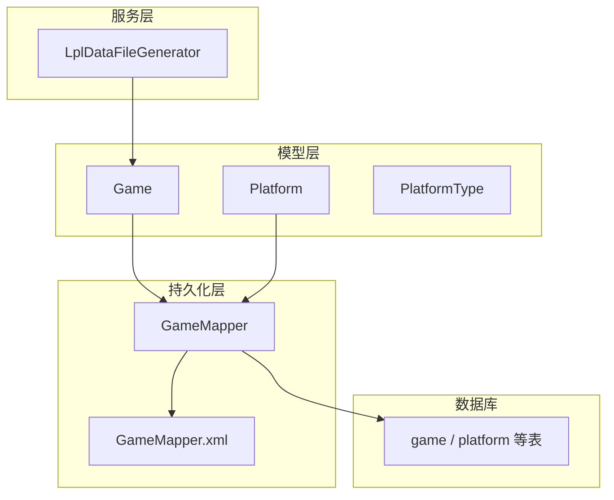
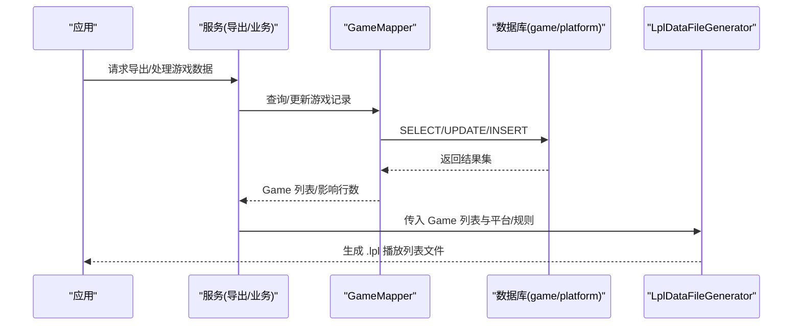
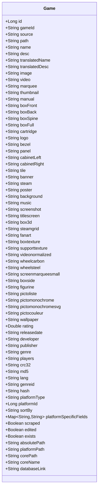
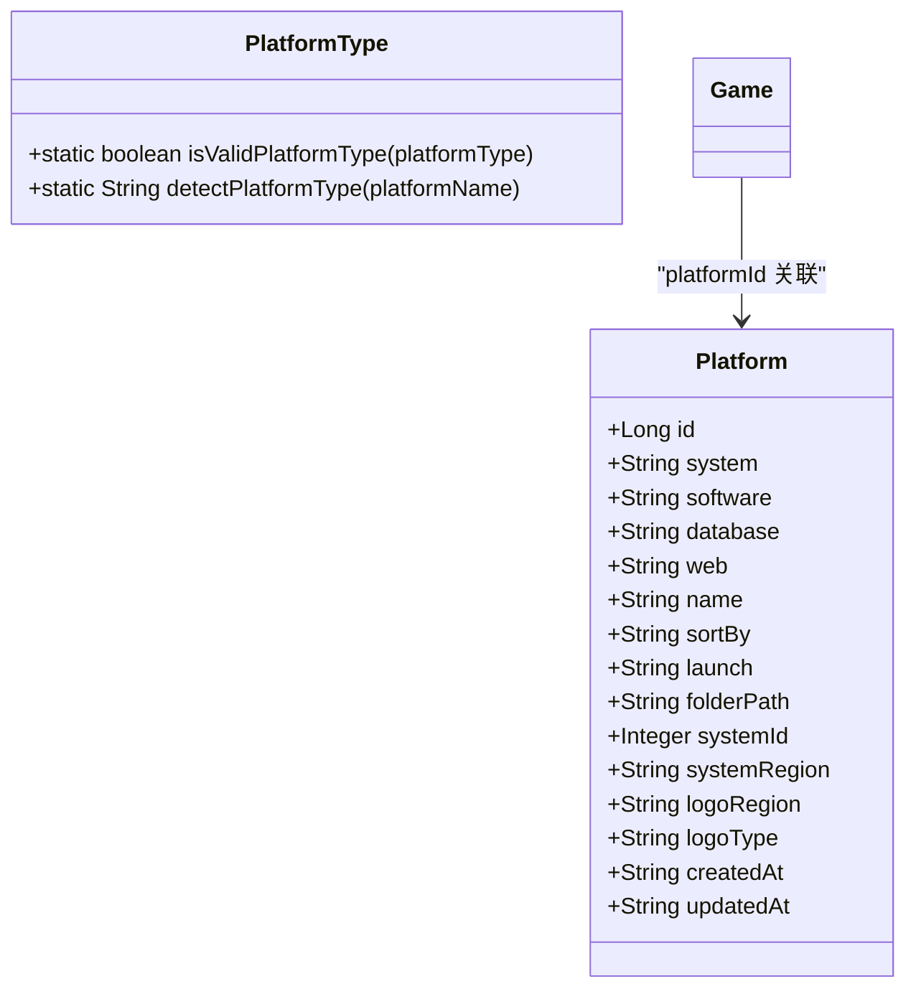
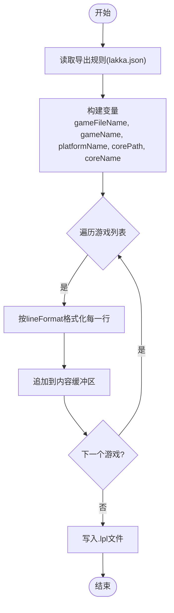
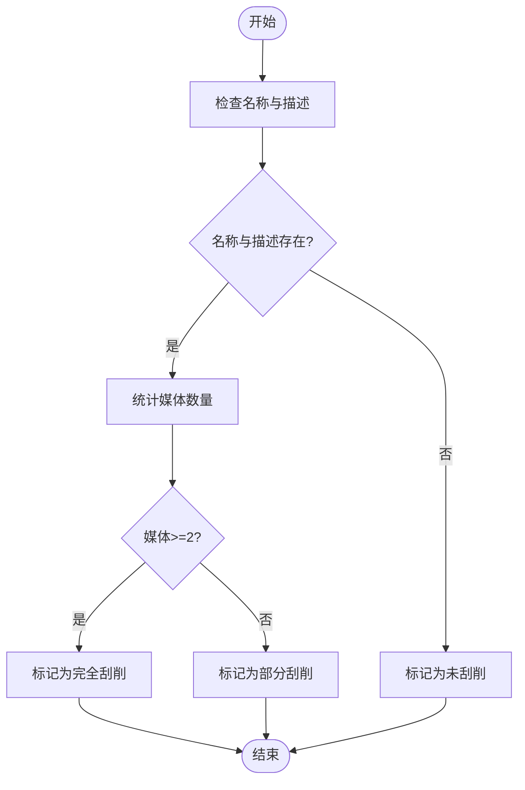
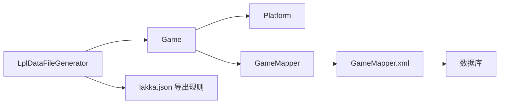

# 游戏数据模型

<cite>
**本文引用的文件**
- [Game.java](file://src/main/java/com/gamelist/model/Game.java)
- [Platform.java](file://src/main/java/com/gamelist/model/Platform.java)
- [PlatformType.java](file://src/main/java/com/gamelist/model/PlatformType.java)
- [GameMapper.java](file://src/main/java/com/gamelist/mapper/GameMapper.java)
- [GameMapper.xml](file://src/main/resources/mappers/GameMapper.xml)
- [V1.0.3__baseline_migration.sql](file://src/main/resources/db/migration/V1.0.3__baseline_migration.sql)
- [schema.sql](file://src/main/resources/schema.sql)
- [V1.0.7__add_hash_column.sql](file://src/main/resources/db/migration/V1.0.7__add_hash_column.sql)
- [LplDataFileGenerator.java](file://src/main/java/com/gamelist/service/impl/LplDataFileGenerator.java)
- [lakka.json（导出规则）](file://src/main/resources/export-rules/lakka.json)
- [lakka.json（导入模板）](file://rules/import/lakka.json)
</cite>

## 目录
1. [简介](#简介)
2. [项目结构](#项目结构)
3. [核心组件](#核心组件)
4. [架构总览](#架构总览)
5. [详细组件分析](#详细组件分析)
6. [依赖关系分析](#依赖关系分析)
7. [性能考虑](#性能考虑)
8. [故障排查指南](#故障排查指南)
9. [结论](#结论)
10. [附录](#附录)

## 简介
本文件围绕游戏数据模型进行系统化说明，重点覆盖 Game 实体类字段定义、数据类型与业务含义；游戏元数据结构（基本信息、媒体资源、平台信息、状态字段等）；Lakka .lpl 特定字段的用途与配置方法；数据验证规则与业务约束；数据库表结构映射（主键、索引、外键）；以及游戏数据的 CRUD 操作示例与最佳实践。

## 项目结构
本项目采用分层架构：
- 模型层：Game、Platform、PlatformType 等实体描述领域对象
- 持久化层：MyBatis Mapper 接口与 XML 映射，负责 SQL 与结果映射
- 服务层：包含 Lakka .lpl 导出生成器等业务逻辑
- 迁移脚本：Flyway 风格的数据库版本迁移脚本，维护表结构与字段演进

图表来源
- [Game.java:1-650](file://src/main/java/com/gamelist/model/Game.java#L1-L650)
- [Platform.java:1-141](file://src/main/java/com/gamelist/model/Platform.java#L1-L141)
- [PlatformType.java:1-51](file://src/main/java/com/gamelist/model/PlatformType.java#L1-L51)
- [GameMapper.java:1-76](file://src/main/java/com/gamelist/mapper/GameMapper.java#L1-L76)
- [GameMapper.xml:1-855](file://src/main/resources/mappers/GameMapper.xml#L1-L855)
- [LplDataFileGenerator.java:1-130](file://src/main/java/com/gamelist/service/impl/LplDataFileGenerator.java#L1-L130)

章节来源
- [Game.java:1-650](file://src/main/java/com/gamelist/model/Game.java#L1-L650)
- [Platform.java:1-141](file://src/main/java/com/gamelist/model/Platform.java#L1-L141)
- [GameMapper.java:1-76](file://src/main/java/com/gamelist/mapper/GameMapper.java#L1-L76)
- [GameMapper.xml:1-855](file://src/main/resources/mappers/GameMapper.xml#L1-L855)
- [V1.0.3__baseline_migration.sql:1-238](file://src/main/resources/db/migration/V1.0.3__baseline_migration.sql#L1-L238)
- [schema.sql:1-29](file://src/main/resources/schema.sql#L1-L29)
- [V1.0.7__add_hash_column.sql:1-2](file://src/main/resources/db/migration/V1.0.7__add_hash_column.sql#L1-L2)
- [LplDataFileGenerator.java:1-130](file://src/main/java/com/gamelist/service/impl/LplDataFileGenerator.java#L1-L130)
- [lakka.json（导出规则）:1-73](file://src/main/resources/export-rules/lakka.json#L1-L73)
- [lakka.json（导入模板）:1-58](file://rules/import/lakka.json#L1-L58)

## 核心组件
- Game：游戏元数据与媒体资源的核心实体，承载名称、描述、发布日期、评分、开发商、发行商、类型、玩家数、语言、哈希校验值、平台关联、刮削与编辑状态、路径信息等。
- Platform：平台元数据，如系统名、软件名、数据库源、网站、名称、排序方式、启动命令、文件夹路径、系统ID、区域、Logo 相关字段及时间戳。
- PlatformType：平台类型常量与识别工具，支持 recalbox、batocera、retrobat、esde、generic 等类型，并提供检测与校验方法。
- GameMapper/GameMapper.xml：提供游戏的增删改查、筛选、统计、批量操作等数据访问能力，并定义结果映射。
- LplDataFileGenerator：基于 ExportRule 和 Platform 将 Game 列表生成为 Lakka RetroArch 播放列表（.lpl）文件。

章节来源
- [Game.java:1-650](file://src/main/java/com/gamelist/model/Game.java#L1-L650)
- [Platform.java:1-141](file://src/main/java/com/gamelist/model/Platform.java#L1-L141)
- [PlatformType.java:1-51](file://src/main/java/com/gamelist/model/PlatformType.java#L1-L51)
- [GameMapper.java:1-76](file://src/main/java/com/gamelist/mapper/GameMapper.java#L1-L76)
- [GameMapper.xml:1-855](file://src/main/resources/mappers/GameMapper.xml#L1-L855)
- [LplDataFileGenerator.java:1-130](file://src/main/java/com/gamelist/service/impl/LplDataFileGenerator.java#L1-L130)

## 架构总览
下图展示从模型到持久化再到导出的整体流程，突出 Game 在系统中的中心地位以及与平台、Mapper、导出器的交互。

图表来源
- [GameMapper.java:1-76](file://src/main/java/com/gamelist/mapper/GameMapper.java#L1-L76)
- [GameMapper.xml:1-855](file://src/main/resources/mappers/GameMapper.xml#L1-L855)
- [LplDataFileGenerator.java:1-130](file://src/main/java/com/gamelist/service/impl/LplDataFileGenerator.java#L1-L130)

## 详细组件分析

### Game 实体类设计
- 标识与来源
  - id：自增主键
  - gameId：外部系统或上游来源的游戏唯一标识
  - source：数据来源标记
- 路径与存在性
  - path：ROM 或资源相对路径
  - absolutePath：绝对路径
  - platformPath：平台根路径
  - exists：文件是否存在标记
- 基本信息
  - name：游戏名称
  - desc：描述
  - translatedName / translatedDesc：翻译后的名称与描述
  - releasedate：发布日期（字符串形式）
  - rating：评分（浮点）
  - developer / publisher：开发商/发行商
  - genre / genreid：类型与类型ID
  - players：玩家人数（可含范围或区间表达）
  - lang：语言
  - crc32 / md5 / hash：校验值与哈希，用于去重与完整性校验
- 媒体资源（图片/视频/封面等）
  - image / video / marquee / thumbnail / manual
  - boxFront / boxBack / boxSpine / boxFull / cartridge
  - logo / bezel / panel / cabinetLeft / cabinetRight
  - tile / banner / steam / poster / background / music
  - screenshot / titlescreen / box3d / steamgrid / fanart
  - boxtexture / supporttexture / videonormalized / wheelcarbon / wheelsteel
  - screenmarqueesmall / boxside / figurine / pictoliste / pictomonochrome / pictomonochromesvg / pictocouleur / wallpaper
- 平台信息
  - platformId：关联平台主键
  - platformType：平台类型（如 recalbox/batocera/retrobat/esde/generic）
  - sortBy：排序策略
- 状态字段
  - scraped：是否已抓取（基于描述与媒体完整度判定）
  - edited：是否已人工编辑
- Lakka .lpl 特定字段
  - corePath：RetroArch Core 路径
  - coreName：Core 名称
  - databaseLink：数据库链接（用于导入/导出映射）

图表来源
- [Game.java:1-650](file://src/main/java/com/gamelist/model/Game.java#L1-L650)

章节来源
- [Game.java:1-650](file://src/main/java/com/gamelist/model/Game.java#L1-L650)

### Platform 与 PlatformType
- Platform：描述平台元数据，包括 system、software、database、web、name、sortBy、launch、folderPath、systemId、systemRegion、logoRegion、logoType、createdAt、updatedAt。
- PlatformType：提供平台类型常量与识别方法，支持 isValidPlatformType 校验与 detectPlatformType 自动识别。

图表来源
- [Platform.java:1-141](file://src/main/java/com/gamelist/model/Platform.java#L1-L141)
- [PlatformType.java:1-51](file://src/main/java/com/gamelist/model/PlatformType.java#L1-L51)
- [Game.java:1-650](file://src/main/java/com/gamelist/model/Game.java#L1-L650)

章节来源
- [Platform.java:1-141](file://src/main/java/com/gamelist/model/Platform.java#L1-L141)
- [PlatformType.java:1-51](file://src/main/java/com/gamelist/model/PlatformType.java#L1-L51)

### 数据库表结构与映射
- game 表
  - 主键：id（BIGINT AUTO_INCREMENT）
  - 关键字段：game_id、path、name、desc、translated_name、translated_desc、image、video、marquee、thumbnail、manual、rating、releasedate、developer、publisher、genre、players、crc32、md5、lang、genreid、sort_by、platform_id、scraped、edited、exists、absolute_path、platform_path、hash
  - 外键：platform_id 引用 platform(id)
  - 新增字段：videonormalized、wheelcarbon、wheelsteel、screenmarqueesmall、boxside、figurine、pictoliste、pictomonochrome、pictomonochromesvg、pictocouleur、wallpaper、platform_type、hash
- platform 表
  - 主键：id（BIGINT AUTO_INCREMENT）
  - 字段：system、software、database、web、name、sort_by、launch、folder_path、created_at、updated_at、system_id、system_region、logo_region、logo_type
- temp_subset / temp_subset_game：临时子集与临时子集游戏表，结构与 game 类似，便于合并/筛选场景
- 索引策略
  - 基础迁移未显式创建 game 表索引；可通过查询模式添加复合索引优化（例如按 platform_id、scraped、name 等）
  - media_download_task 表有 platform_id 索引（非本主题核心，但体现索引意识）

```mermaid
erDiagram
PLATFORM {
bigint id PK
varchar system
varchar software
varchar database
varchar web
varchar name
varchar sort_by
text launch
varchar folder_path
timestamp created_at
timestamp updated_at
int system_id
varchar system_region
varchar logo_region
varchar logo_type
}
GAME {
bigint id PK
varchar game_id
varchar source
varchar path
varchar name
text desc
varchar translated_name
text translated_desc
varchar image
varchar video
varchar marquee
varchar thumbnail
varchar manual
double rating
varchar releasedate
varchar developer
varchar publisher
varchar genre
varchar players
varchar crc32
varchar md5
varchar lang
varchar genreid
varchar sort_by
bigint platform_id FK
boolean scraped
boolean edited
boolean exists
varchar absolute_path
varchar platform_path
varchar hash
varchar platform_type
varchar box_front
varchar box_back
varchar box_spine
varchar box_full
varchar cartridge
varchar logo
varchar bezel
varchar panel
varchar cabinet_left
varchar cabinet_right
varchar tile
varchar banner
varchar steam
varchar poster
varchar background
varchar music
varchar screenshot
varchar titlescreen
varchar box3d
varchar steamgrid
varchar fanart
varchar boxtexture
varchar supporttexture
varchar videonormalized
varchar wheelcarbon
varchar wheelsteel
varchar screenmarqueesmall
varchar boxside
varchar figurine
varchar pictoliste
varchar pictomonochrome
varchar pictomonochromesvg
varchar pictocouleur
varchar wallpaper
}
PLATFORM ||--o{ GAME : "1..*"
```

图表来源
- [V1.0.3__baseline_migration.sql:1-238](file://src/main/resources/db/migration/V1.0.3__baseline_migration.sql#L1-L238)
- [schema.sql:1-29](file://src/main/resources/schema.sql#L1-L29)
- [V1.0.7__add_hash_column.sql:1-2](file://src/main/resources/db/migration/V1.0.7__add_hash_column.sql#L1-L2)

章节来源
- [V1.0.3__baseline_migration.sql:1-238](file://src/main/resources/db/migration/V1.0.3__baseline_migration.sql#L1-L238)
- [schema.sql:1-29](file://src/main/resources/schema.sql#L1-L29)
- [V1.0.7__add_hash_column.sql:1-2](file://src/main/resources/db/migration/V1.0.7__add_hash_column.sql#L1-L2)

### Lakka .lpl 特定字段与配置
- 字段用途
  - corePath：RetroArch 核心库路径，决定使用哪个模拟器内核运行游戏
  - coreName：核心名称，便于 UI 显示与调试
  - databaseLink：数据库链接，用于导入/导出时的元数据关联
- 导出配置（lakka.json 导出规则）
  - lplExport.lineFormat：定义每行输出格式，包含游戏文件路径、名称、corePath、coreName、固定占位符、播放列表名
  - coreMappings：平台到核心的映射，支持“default”兜底
  - platformMappings：平台名到 Lakka 显示名的映射
  - dataFile：输出文件名与格式
  - directory：ROM 与媒体目录模板
  - media：截图、缩略图、视频的复制与目标路径映射
- 导入模板（lakka.json 导入模板）
  - textFormat.linesPerEntry：每条记录占用行数（5 或 6）
  - lineMappings：行号到字段的映射（files、name、corePath、coreName、databaseLink、playlistName）
  - nullValueMarker：空值标记（DETECT）
  - fieldMappings：字段映射与转换规则
  - extensions/gameExtensions：支持的媒体与 ROM 扩展名

图表来源
- [LplDataFileGenerator.java:1-130](file://src/main/java/com/gamelist/service/impl/LplDataFileGenerator.java#L1-L130)
- [lakka.json（导出规则）:1-73](file://src/main/resources/export-rules/lakka.json#L1-L73)
- [lakka.json（导入模板）:1-58](file://rules/import/lakka.json#L1-L58)

章节来源
- [LplDataFileGenerator.java:1-130](file://src/main/java/com/gamelist/service/impl/LplDataFileGenerator.java#L1-L130)
- [lakka.json（导出规则）:1-73](file://src/main/resources/export-rules/lakka.json#L1-L73)
- [lakka.json（导入模板）:1-58](file://rules/import/lakka.json#L1-L58)

### 数据验证规则与业务约束
- 必填与唯一性
  - path、name 为必填（数据库 NOT NULL）
  - game_id 作为外部标识，建议保证唯一性（业务层面）
- 完整性与一致性
  - platform_id 外键约束，确保游戏归属平台有效
  - exists 标记与 path 对应文件存在性一致
  - scraped 由描述与媒体完整度判定（见下文“刮削状态”）
- 媒体资源
  - 多字段存储不同媒体类型，建议统一命名与路径规范
  - 导出时通过 lakka.json 的 media 配置进行复制与标签映射
- 哈希与校验
  - crc32、md5、hash 用于去重与完整性校验，建议在导入阶段计算并填充
- 平台类型
  - platformType 建议使用 PlatformType.isValidPlatformType 校验，detectPlatformType 自动识别

章节来源
- [GameMapper.xml:1-855](file://src/main/resources/mappers/GameMapper.xml#L1-L855)
- [PlatformType.java:1-51](file://src/main/java/com/gamelist/model/PlatformType.java#L1-L51)
- [V1.0.3__baseline_migration.sql:1-238](file://src/main/resources/db/migration/V1.0.3__baseline_migration.sql#L1-L238)

### 刮削状态判定逻辑
- 完全刮削（fully）：名称与描述存在，且至少具备两项以上媒体（如 image/video/marquee/thumbnail/manual 的组合）
- 部分刮削（partially）：名称与描述存在，但媒体不足（0-1项）
- 未刮削（not）：名称或描述缺失，或两者均缺失

图表来源
- [GameMapper.xml:105-179](file://src/main/resources/mappers/GameMapper.xml#L105-L179)
- [GameMapper.xml:185-275](file://src/main/resources/mappers/GameMapper.xml#L185-L275)
- [GameMapper.xml:302-343](file://src/main/resources/mappers/GameMapper.xml#L302-L343)

章节来源
- [GameMapper.xml:105-179](file://src/main/resources/mappers/GameMapper.xml#L105-L179)
- [GameMapper.xml:185-275](file://src/main/resources/mappers/GameMapper.xml#L185-L275)
- [GameMapper.xml:302-343](file://src/main/resources/mappers/GameMapper.xml#L302-L343)

### CRUD 操作示例与最佳实践
- 插入
  - 单条插入：insertGame
  - 批量插入：insertGamesBatch（推荐用于大量导入）
- 查询
  - 全量/过滤：selectAllGamesWithFilter（支持搜索、日期范围、开发商、类型、玩家数、刮削状态）
  - 平台维度：selectGamesByPlatformIdWithFilter
  - 精确查找：selectGameById、selectGameByPath
  - 去重与合并：selectGamesByGameIdAndPlatformId、selectGamesByCrc32AndPlatformId
- 更新
  - updateGame：更新所有字段（注意仅更新必要字段以减少开销）
  - 批量更新平台路径：updatePlatformPathForAllGames
- 删除
  - deleteGameById：按主键删除
  - deleteGamesByPlatformId：按平台批量删除
  - deleteAllGames：清空游戏表（谨慎使用）
- 最佳实践
  - 使用批量插入减少往返次数
  - 利用筛选条件与分页（offset/limit）提升查询性能
  - 对高频查询字段建立索引（如 platform_id、scraped、name）
  - 导入阶段计算并填充 crc32/md5/hash，避免重复导入
  - 使用 PlatformType 校验 platformType，保证一致性

章节来源
- [GameMapper.java:1-76](file://src/main/java/com/gamelist/mapper/GameMapper.java#L1-L76)
- [GameMapper.xml:74-99](file://src/main/resources/mappers/GameMapper.xml#L74-L99)
- [GameMapper.xml:101-179](file://src/main/resources/mappers/GameMapper.xml#L101-L179)
- [GameMapper.xml:181-275](file://src/main/resources/mappers/GameMapper.xml#L181-L275)
- [GameMapper.xml:277-295](file://src/main/resources/mappers/GameMapper.xml#L277-L295)
- [GameMapper.xml:440-507](file://src/main/resources/mappers/GameMapper.xml#L440-L507)
- [GameMapper.xml:509-570](file://src/main/resources/mappers/GameMapper.xml#L509-L570)
- [GameMapper.xml:572-800](file://src/main/resources/mappers/GameMapper.xml#L572-L800)

## 依赖关系分析
- 模型依赖
  - Game 依赖 Platform（通过 platformId 外键）
  - PlatformType 被用于校验与识别 platformType
- 持久化依赖
  - GameMapper 接口与 GameMapper.xml 实现 SQL 与结果映射
  - 迁移脚本维护表结构与字段演进
- 导出依赖
  - LplDataFileGenerator 依赖 ExportRule（lakka.json）与 Platform、Game 生成 .lpl

图表来源
- [Game.java:1-650](file://src/main/java/com/gamelist/model/Game.java#L1-L650)
- [Platform.java:1-141](file://src/main/java/com/gamelist/model/Platform.java#L1-L141)
- [GameMapper.java:1-76](file://src/main/java/com/gamelist/mapper/GameMapper.java#L1-L76)
- [GameMapper.xml:1-855](file://src/main/resources/mappers/GameMapper.xml#L1-L855)
- [LplDataFileGenerator.java:1-130](file://src/main/java/com/gamelist/service/impl/LplDataFileGenerator.java#L1-L130)
- [lakka.json（导出规则）:1-73](file://src/main/resources/export-rules/lakka.json#L1-L73)

章节来源
- [Game.java:1-650](file://src/main/java/com/gamelist/model/Game.java#L1-L650)
- [Platform.java:1-141](file://src/main/java/com/gamelist/model/Platform.java#L1-L141)
- [GameMapper.java:1-76](file://src/main/java/com/gamelist/mapper/GameMapper.java#L1-L76)
- [GameMapper.xml:1-855](file://src/main/resources/mappers/GameMapper.xml#L1-L855)
- [LplDataFileGenerator.java:1-130](file://src/main/java/com/gamelist/service/impl/LplDataFileGenerator.java#L1-L130)
- [lakka.json（导出规则）:1-73](file://src/main/resources/export-rules/lakka.json#L1-L73)

## 性能考虑
- 批量操作：优先使用 insertGamesBatch 进行批量导入，减少事务与网络开销
- 查询优化：
  - 使用 selectGamesByPlatformIdWithFilter 等平台维度的筛选
  - 对 platform_id、scraped、name 等常用字段建立索引
- 媒体处理：
  - 导出前预检查媒体文件存在性，避免无效 IO
  - 合理设置 media 目标路径，避免重复拷贝
- 状态更新：
  - 仅在必要时更新 scraped/edited 标志，减少写放大

[本节为通用指导，不直接分析具体文件]

## 故障排查指南
- 常见问题
  - 路径错误：确认 path/absolutePath/platformPath 与实际文件一致
  - 平台关联失败：检查 platform_id 是否存在于 platform 表
  - 导出失败：核对 lakka.json 的 lineFormat 与 coreMappings 配置
  - 刮削状态异常：检查描述与媒体字段是否为空
- 定位方法
  - 使用 selectGameByPath 或 selectGameById 获取具体记录
  - 使用 countFullyScrapedGames/countPartiallyScrapedGames/countNotScrapedGames 统计状态分布
  - 查看日志输出（LplDataFileGenerator 中的 logger）

章节来源
- [GameMapper.xml:277-295](file://src/main/resources/mappers/GameMapper.xml#L277-L295)
- [GameMapper.xml:297-343](file://src/main/resources/mappers/GameMapper.xml#L297-L343)
- [LplDataFileGenerator.java:1-130](file://src/main/java/com/gamelist/service/impl/LplDataFileGenerator.java#L1-L130)

## 结论
Game 实体作为游戏数据模型的核心，承载了丰富的元数据与媒体资源，并通过 Platform 与 PlatformType 完成平台关联与类型管理。借助 MyBatis Mapper 提供的强大查询与批量能力，结合 Lakka .lpl 导出规则，可实现高效的数据管理与跨平台导出。建议在生产环境中完善索引策略、严格数据校验与状态管理，以提升系统稳定性与性能。

[本节为总结性内容，不直接分析具体文件]

## 附录
- 字段字典（节选）
  - 基本信息：name、desc、translatedName、translatedDesc、releasedate、rating、developer、publisher、genre、players、lang
  - 媒体资源：image、video、marquee、thumbnail、manual、boxFront、boxBack、boxSpine、boxFull、cartridge、logo、bezel、panel、cabinetLeft、cabinetRight、tile、banner、steam、poster、background、music、screenshot、titlescreen、box3d、steamgrid、fanart、boxtexture、supporttexture、videonormalized、wheelcarbon、wheelsteel、screenmarqueesmall、boxside、figurine、pictoliste、pictomonochrome、pictomonochromesvg、pictocouleur、wallpaper
  - 平台信息：platformId、platformType、sortBy
  - 状态字段：scraped、edited、exists
  - Lakka 特定：corePath、coreName、databaseLink

章节来源
- [Game.java:1-650](file://src/main/java/com/gamelist/model/Game.java#L1-L650)
- [lakka.json（导入模板）:1-58](file://rules/import/lakka.json#L1-L58)