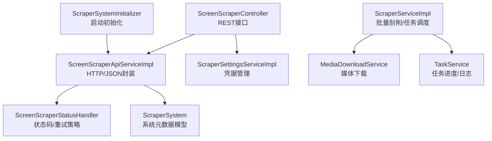
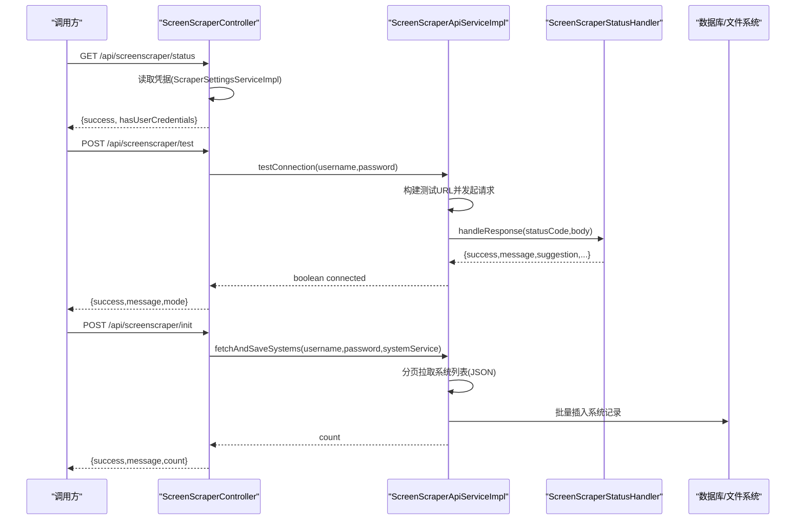
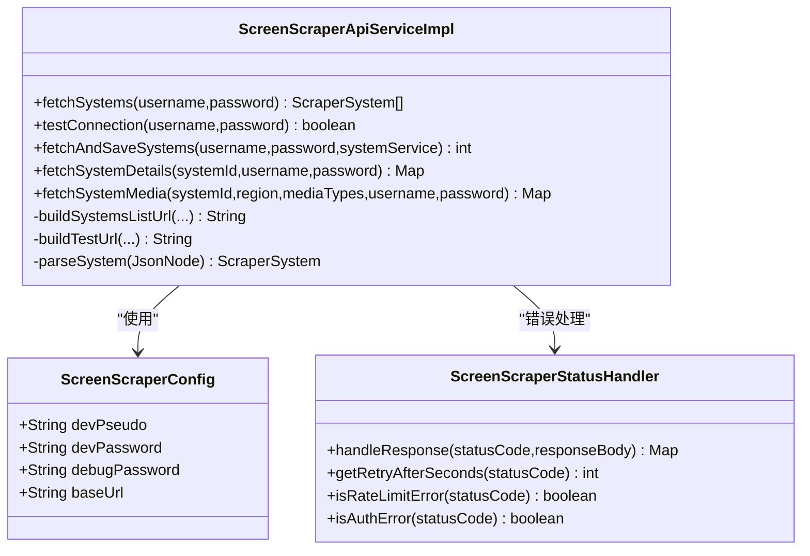
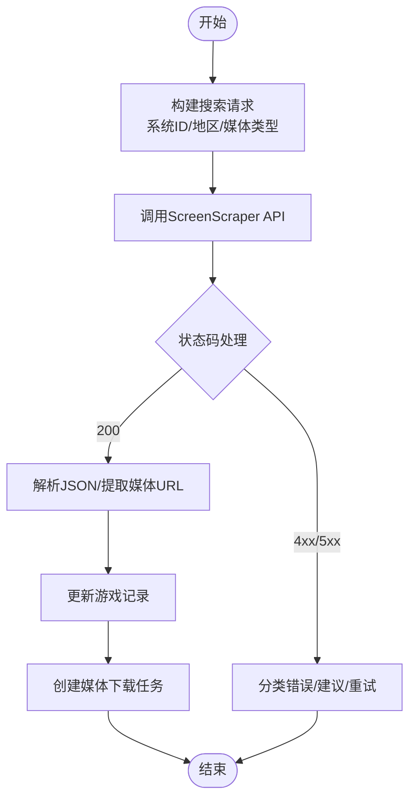
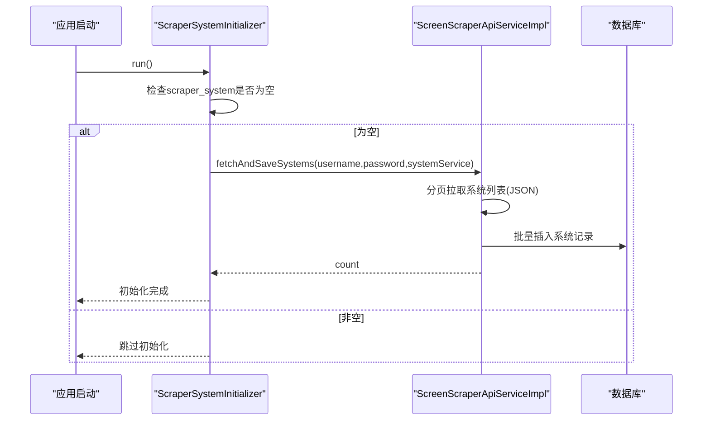
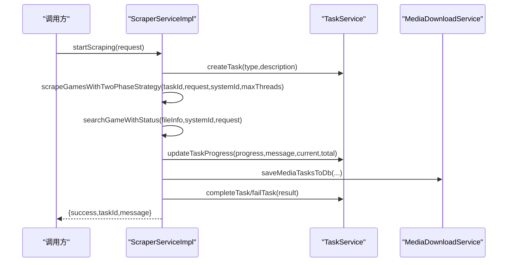
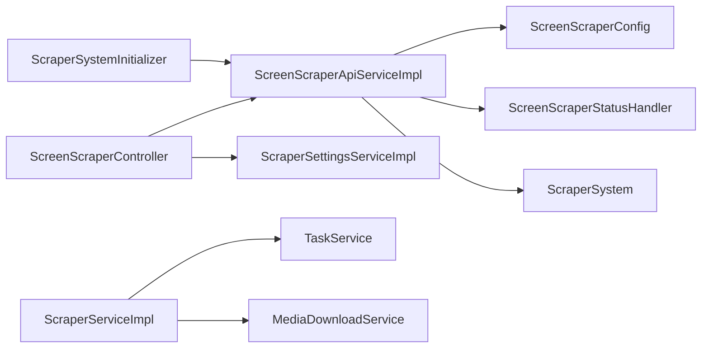

# Scraper系统集成

<cite>
**本文引用的文件**
- [ScreenScraperConfig.java](file://src/main/java/com/gamelist/config/ScreenScraperConfig.java)
- [ScreenScraperApiServiceImpl.java](file://src/main/java/com/gamelist/service/impl/ScreenScraperApiServiceImpl.java)
- [ScreenScraperController.java](file://src/main/java/com/gamelist/controller/ScreenScraperController.java)
- [ScraperSystem.java](file://src/main/java/com/gamelist/model/ScraperSystem.java)
- [ScraperServiceImpl.java](file://src/main/java/com/gamelist/service/impl/ScraperServiceImpl.java)
- [ScreenScraperStatusHandler.java](file://src/main/java/com/gamelist/util/ScreenScraperStatusHandler.java)
- [ScraperSettingsServiceImpl.java](file://src/main/java/com/gamelist/service/impl/ScraperSettingsServiceImpl.java)
- [ScraperSystemInitializer.java](file://src/main/java/com/gamelist/config/ScraperSystemInitializer.java)
- [application.properties](file://src/main/resources/application.properties)
</cite>

## 目录
1. [简介](#简介)
2. [项目结构](#项目结构)
3. [核心组件](#核心组件)
4. [架构总览](#架构总览)
5. [详细组件分析](#详细组件分析)
6. [依赖关系分析](#依赖关系分析)
7. [性能考量](#性能考量)
8. [故障排除指南](#故障排除指南)
9. [结论](#结论)
10. [附录：配置示例与最佳实践](#附录：配置示例与最佳实践)

## 简介
本文件面向Scraper系统的ScreenScraper集成，覆盖认证配置、请求封装、响应解析、游戏元数据获取流程（搜索、匹配、提取）、系统初始化（系统定义、字段映射、优先级）、批量元数据获取（任务调度、进度监控、错误重试）、设置管理（API密钥、频率限制、缓存策略），以及最佳实践与性能优化建议。文档同时提供完整的配置示例与故障排除指引，帮助快速落地并稳定运行。

## 项目结构
围绕ScreenScraper集成的关键代码分布在以下位置：
- 配置层：ScreenScraperConfig 提供基础URL与开发者凭证；application.properties 提供运行时参数
- 控制器层：ScreenScraperController 暴露状态检查、连接测试、系统初始化等接口
- 服务层：ScreenScraperApiServiceImpl 负责HTTP请求、SSL/TLS、分页拉取、JSON解析；ScraperServiceImpl 实现批量刮削、任务调度、媒体下载、进度跟踪
- 工具层：ScreenScraperStatusHandler 统一处理状态码、限流、重试建议
- 模型层：ScraperSystem 承载系统元数据
- 初始化：ScraperSystemInitializer 在应用启动时异步拉取系统列表并入库
- 设置管理：ScraperSettingsServiceImpl 持久化用户凭据（加密存储）

图表来源
- [ScreenScraperController.java:18-119](file://src/main/java/com/gamelist/controller/ScreenScraperController.java#L18-L119)
- [ScreenScraperApiServiceImpl.java:30-104](file://src/main/java/com/gamelist/service/impl/ScreenScraperApiServiceImpl.java#L30-L104)
- [ScraperSettingsServiceImpl.java:18-117](file://src/main/java/com/gamelist/service/impl/ScraperSettingsServiceImpl.java#L18-L117)
- [ScreenScraperStatusHandler.java:15-213](file://src/main/java/com/gamelist/util/ScreenScraperStatusHandler.java#L15-L213)
- [ScraperSystem.java:1-228](file://src/main/java/com/gamelist/model/ScraperSystem.java#L1-L228)
- [ScraperServiceImpl.java:62-129](file://src/main/java/com/gamelist/service/impl/ScraperServiceImpl.java#L62-L129)
- [ScraperSystemInitializer.java:19-119](file://src/main/java/com/gamelist/config/ScraperSystemInitializer.java#L19-L119)

章节来源
- [ScreenScraperController.java:18-119](file://src/main/java/com/gamelist/controller/ScreenScraperController.java#L18-L119)
- [ScreenScraperApiServiceImpl.java:30-104](file://src/main/java/com/gamelist/service/impl/ScreenScraperApiServiceImpl.java#L30-L104)
- [ScraperSettingsServiceImpl.java:18-117](file://src/main/java/com/gamelist/service/impl/ScraperSettingsServiceImpl.java#L18-L117)
- [ScreenScraperStatusHandler.java:15-213](file://src/main/java/com/gamelist/util/ScreenScraperStatusHandler.java#L15-L213)
- [ScraperSystem.java:1-228](file://src/main/java/com/gamelist/model/ScraperSystem.java#L1-L228)
- [ScraperServiceImpl.java:62-129](file://src/main/java/com/gamelist/service/impl/ScraperServiceImpl.java#L62-L129)
- [ScraperSystemInitializer.java:19-119](file://src/main/java/com/gamelist/config/ScraperSystemInitializer.java#L19-L119)

## 核心组件
- ScreenScraperConfig：集中管理ScreenScraper的基础URL、开发者伪名与密码、调试密码等配置项，便于通过配置文件注入
- ScreenScraperApiServiceImpl：基于OkHttp构建客户端，支持TLS版本协商、连接池、超时与重连；实现系统列表分页拉取、系统详情与媒体URL构建、JSON解析与异常分类
- ScraperServiceImpl：实现批量游戏信息刮削与媒体下载的两阶段并发策略，使用动态线程资源管理器控制并发，维护任务进度、暂停/恢复/停止、404熔断保护
- ScreenScraperStatusHandler：统一处理HTTP状态码，提供是否立即停止、是否通知用户、重试秒数、错误类型与建议
- ScraperSettingsServiceImpl：以JSON文件持久化用户凭据，读写时进行加解密，保证安全
- ScraperSystemInitializer：应用启动时检测scraper_system表是否为空，为空则异步拉取系统列表并入库，提升可用性
- ScraperSystem：承载系统名称（多语言）、公司、类型、年份、ROM类型、扩展名、图标等字段，适配不同版本的API返回结构

章节来源
- [ScreenScraperConfig.java:6-46](file://src/main/java/com/gamelist/config/ScreenScraperConfig.java#L6-L46)
- [ScreenScraperApiServiceImpl.java:30-104](file://src/main/java/com/gamelist/service/impl/ScreenScraperApiServiceImpl.java#L30-L104)
- [ScraperServiceImpl.java:62-129](file://src/main/java/com/gamelist/service/impl/ScraperServiceImpl.java#L62-L129)
- [ScreenScraperStatusHandler.java:15-213](file://src/main/java/com/gamelist/util/ScreenScraperStatusHandler.java#L15-L213)
- [ScraperSettingsServiceImpl.java:18-117](file://src/main/java/com/gamelist/service/impl/ScraperSettingsServiceImpl.java#L18-L117)
- [ScraperSystemInitializer.java:19-119](file://src/main/java/com/gamelist/config/ScraperSystemInitializer.java#L19-L119)
- [ScraperSystem.java:1-228](file://src/main/java/com/gamelist/model/ScraperSystem.java#L1-L228)

## 架构总览
整体调用链从控制器到API服务，再到状态处理器与数据库/文件系统，形成“配置—请求—解析—持久化”的闭环。

图表来源
- [ScreenScraperController.java:37-119](file://src/main/java/com/gamelist/controller/ScreenScraperController.java#L37-L119)
- [ScreenScraperApiServiceImpl.java:106-426](file://src/main/java/com/gamelist/service/impl/ScreenScraperApiServiceImpl.java#L106-L426)
- [ScreenScraperStatusHandler.java:138-213](file://src/main/java/com/gamelist/util/ScreenScraperStatusHandler.java#L138-L213)

## 详细组件分析

### ScreenScraper API 集成（认证、请求封装、响应解析）
- 认证配置
  - 开发者凭证与基础URL由ScreenScraperConfig提供，可通过配置文件注入
  - 用户凭据（username/password）由ScraperSettingsServiceImpl持久化并加解密
- 请求封装
  - 使用OkHttpClient，配置TLS版本、连接池、超时、重定向与事件监听
  - 构造查询参数：devid、devpassword、softname、output、可选ssid/sspassword
  - 支持系统列表、系统详情、媒体URL构建等端点
- 响应解析
  - JSON解析为JsonNode，兼容新旧字段（如systemes/systems、noms对象或数组）
  - 统一错误处理：根据状态码分类为认证失败、配额限制、服务器错误等，并提供重试建议

图表来源
- [ScreenScraperConfig.java:6-46](file://src/main/java/com/gamelist/config/ScreenScraperConfig.java#L6-L46)
- [ScreenScraperApiServiceImpl.java:30-104](file://src/main/java/com/gamelist/service/impl/ScreenScraperApiServiceImpl.java#L30-L104)
- [ScreenScraperApiServiceImpl.java:106-426](file://src/main/java/com/gamelist/service/impl/ScreenScraperApiServiceImpl.java#L106-L426)
- [ScreenScraperApiServiceImpl.java:648-796](file://src/main/java/com/gamelist/service/impl/ScreenScraperApiServiceImpl.java#L648-L796)
- [ScreenScraperStatusHandler.java:15-213](file://src/main/java/com/gamelist/util/ScreenScraperStatusHandler.java#L15-L213)

章节来源
- [ScreenScraperConfig.java:6-46](file://src/main/java/com/gamelist/config/ScreenScraperConfig.java#L6-L46)
- [ScreenScraperApiServiceImpl.java:106-426](file://src/main/java/com/gamelist/service/impl/ScreenScraperApiServiceImpl.java#L106-L426)
- [ScreenScraperApiServiceImpl.java:648-796](file://src/main/java/com/gamelist/service/impl/ScreenScraperApiServiceImpl.java#L648-L796)
- [ScreenScraperStatusHandler.java:15-213](file://src/main/java/com/gamelist/util/ScreenScraperStatusHandler.java#L15-L213)

### 游戏元数据获取流程（搜索、匹配、提取）
- 搜索
  - 通过ScraperServiceImpl.searchGameWithStatus对单个游戏发起搜索，内部调用searchGame并包装状态码处理
- 匹配
  - 根据系统ID、地区、媒体类型构建请求，解析返回的媒体列表，过滤无效URL
- 提取
  - 将成功结果更新到游戏记录，并生成媒体下载任务（待下载队列）

图表来源
- [ScraperServiceImpl.java:652-700](file://src/main/java/com/gamelist/service/impl/ScraperServiceImpl.java#L652-L700)
- [ScreenScraperApiServiceImpl.java:648-796](file://src/main/java/com/gamelist/service/impl/ScreenScraperApiServiceImpl.java#L648-L796)
- [ScreenScraperStatusHandler.java:138-213](file://src/main/java/com/gamelist/util/ScreenScraperStatusHandler.java#L138-L213)

章节来源
- [ScraperServiceImpl.java:652-700](file://src/main/java/com/gamelist/service/impl/ScraperServiceImpl.java#L652-L700)
- [ScreenScraperApiServiceImpl.java:648-796](file://src/main/java/com/gamelist/service/impl/ScreenScraperApiServiceImpl.java#L648-L796)
- [ScreenScraperStatusHandler.java:138-213](file://src/main/java/com/gamelist/util/ScreenScraperStatusHandler.java#L138-L213)

### Scraper系统初始化配置（系统定义、字段映射、优先级）
- 系统定义
  - 应用启动时，ScraperSystemInitializer检测scraper_system表是否为空，为空则异步拉取系统列表并入库
- 字段映射
  - parseSystem方法兼容多种返回格式：noms对象/数组、nom_*字段、company/constructeur等，确保主名称优先选择Launchbox/Hyperspin/公共名
- 优先级
  - 两阶段策略：先完成所有游戏信息刮削，再并行下载媒体；媒体下载线程数受动态资源管理器控制，避免抢占游戏信息资源

图表来源
- [ScraperSystemInitializer.java:43-98](file://src/main/java/com/gamelist/config/ScraperSystemInitializer.java#L43-L98)
- [ScreenScraperApiServiceImpl.java:279-426](file://src/main/java/com/gamelist/service/impl/ScreenScraperApiServiceImpl.java#L279-L426)

章节来源
- [ScraperSystemInitializer.java:43-98](file://src/main/java/com/gamelist/config/ScraperSystemInitializer.java#L43-L98)
- [ScreenScraperApiServiceImpl.java:279-426](file://src/main/java/com/gamelist/service/impl/ScreenScraperApiServiceImpl.java#L279-L426)
- [ScraperSystem.java:1-228](file://src/main/java/com/gamelist/model/ScraperSystem.java#L1-L228)

### 批量元数据获取（任务调度、进度监控、错误重试）
- 任务调度
  - startScraping创建后台任务，异步执行scrapeGamesWithTwoPhaseStrategy，按scope决定游戏信息与媒体下载范围
- 进度监控
  - 使用TaskService更新任务进度与日志，统计成功/失败/总数，实时反馈
- 错误重试
  - 基于ScreenScraperStatusHandler判断是否可重试与重试间隔；404过多触发熔断停止，防止雪崩

图表来源
- [ScraperServiceImpl.java:131-192](file://src/main/java/com/gamelist/service/impl/ScraperServiceImpl.java#L131-L192)
- [ScraperServiceImpl.java:203-538](file://src/main/java/com/gamelist/service/impl/ScraperServiceImpl.java#L203-L538)
- [ScraperServiceImpl.java:652-700](file://src/main/java/com/gamelist/service/impl/ScraperServiceImpl.java#L652-L700)

章节来源
- [ScraperServiceImpl.java:131-192](file://src/main/java/com/gamelist/service/impl/ScraperServiceImpl.java#L131-L192)
- [ScraperServiceImpl.java:203-538](file://src/main/java/com/gamelist/service/impl/ScraperServiceImpl.java#L203-L538)
- [ScraperServiceImpl.java:652-700](file://src/main/java/com/gamelist/service/impl/ScraperServiceImpl.java#L652-L700)

### Scraper设置管理（API密钥、频率限制、缓存策略）
- API密钥
  - 用户凭据通过ScraperSettingsServiceImpl保存为加密JSON，读取时尝试解密；未配置则使用游客模式
- 频率限制
  - 通过ScreenScraperStatusHandler识别429/430/431等限流状态，提供重试秒数与停止建议；ScraperServiceImpl在404过多时熔断
- 缓存策略
  - 内存中维护系统信息缓存Map，减少重复查询；媒体下载任务去重与状态机管理，避免重复下载

章节来源
- [ScraperSettingsServiceImpl.java:44-117](file://src/main/java/com/gamelist/service/impl/ScraperSettingsServiceImpl.java#L44-L117)
- [ScreenScraperStatusHandler.java:138-213](file://src/main/java/com/gamelist/util/ScreenScraperStatusHandler.java#L138-L213)
- [ScraperServiceImpl.java:97-129](file://src/main/java/com/gamelist/service/impl/ScraperServiceImpl.java#L97-L129)

## 依赖关系分析
- 控制器依赖服务与配置：ScreenScraperController依赖ScreenScraperApiService、ScraperSettingsService、ScraperSystemService
- 服务依赖工具与模型：ScreenScraperApiServiceImpl依赖ScreenScraperConfig、ScreenScraperStatusHandler、ScraperSystem
- 批量刮削依赖任务与媒体：ScraperServiceImpl依赖TaskService、MediaDownloadService、ThreadResourceManager
- 初始化依赖API与服务：ScraperSystemInitializer依赖ScreenScraperApiService、ScraperSettingsService、ScraperSystemService

图表来源
- [ScreenScraperController.java:18-119](file://src/main/java/com/gamelist/controller/ScreenScraperController.java#L18-L119)
- [ScreenScraperApiServiceImpl.java:30-104](file://src/main/java/com/gamelist/service/impl/ScreenScraperApiServiceImpl.java#L30-L104)
- [ScraperServiceImpl.java:62-129](file://src/main/java/com/gamelist/service/impl/ScraperServiceImpl.java#L62-L129)
- [ScraperSystemInitializer.java:19-119](file://src/main/java/com/gamelist/config/ScraperSystemInitializer.java#L19-L119)

章节来源
- [ScreenScraperController.java:18-119](file://src/main/java/com/gamelist/controller/ScreenScraperController.java#L18-L119)
- [ScreenScraperApiServiceImpl.java:30-104](file://src/main/java/com/gamelist/service/impl/ScreenScraperApiServiceImpl.java#L30-L104)
- [ScraperServiceImpl.java:62-129](file://src/main/java/com/gamelist/service/impl/ScraperServiceImpl.java#L62-L129)
- [ScraperSystemInitializer.java:19-119](file://src/main/java/com/gamelist/config/ScraperSystemInitializer.java#L19-L119)

## 性能考量
- HTTP客户端优化
  - 合理设置连接池大小、超时时间、重定向与重试策略，降低握手与网络开销
- 并发控制
  - 两阶段策略优先保障游戏信息刮削，媒体下载在空闲资源下并行执行，避免争抢
- 熔断与限流
  - 404阈值熔断与状态码限流识别，防止雪崩与浪费资源
- 缓存
  - 系统信息内存缓存减少重复查询；媒体任务状态机避免重复下载
- 日志与监控
  - 详细日志输出关键路径与状态码，便于定位瓶颈与问题

[本节为通用性能指导，不直接分析具体文件]

## 故障排除指南
- 认证失败（401/403）
  - 检查用户凭据是否正确配置；确认开发者凭证有效；查看ScreenScraperStatusHandler的建议
- 配额限制（429/430/431）
  - 降低请求频率或等待次日重试；根据retryAfter调整策略
- 服务器错误（423/5xx）
  - 等待官方修复或稍后重试；关注日志中的错误描述
- 404过多熔断
  - 检查ROM文件或CRC值；确认系统ID与地区匹配；必要时调整搜索条件
- SSL握手失败
  - 检查TLS版本与证书；参考ScreenScraperApiServiceImpl的SSL上下文配置

章节来源
- [ScreenScraperStatusHandler.java:138-213](file://src/main/java/com/gamelist/util/ScreenScraperStatusHandler.java#L138-L213)
- [ScreenScraperApiServiceImpl.java:45-104](file://src/main/java/com/gamelist/service/impl/ScreenScraperApiServiceImpl.java#L45-L104)
- [ScraperServiceImpl.java:677-700](file://src/main/java/com/gamelist/service/impl/ScraperServiceImpl.java#L677-L700)

## 结论
本集成通过清晰的层次划分与完善的错误处理机制，实现了ScreenScraper的稳定接入与高效批量处理。结合动态线程资源管理、熔断与限流策略，能够在高并发场景下保持良好性能与稳定性。配合完善的配置管理与监控日志，便于运维与排障。

[本节为总结性内容，不直接分析具体文件]

## 附录：配置示例与最佳实践
- 配置示例
  - application.properties中已包含服务器端口、编码、数据库、静态资源、上传目录等基础配置
  - ScreenScraperConfig提供baseUrl、devPseudo、devPassword等属性，可通过外部配置注入
  - ScraperSettingsServiceImpl默认将凭据保存在/data/config/scraper-settings.json，支持加密存储
- 最佳实践
  - 在生产环境启用HTTPS与合适的TLS版本，避免降级到明文
  - 合理设置并发线程数与超时时间，避免资源耗尽
  - 定期清理过期媒体任务与日志，保持系统健康
  - 使用状态码分类与重试策略，提高鲁棒性
  - 监控404阈值与限流状态，及时调整策略

章节来源
- [application.properties:1-86](file://src/main/resources/application.properties#L1-L86)
- [ScreenScraperConfig.java:6-46](file://src/main/java/com/gamelist/config/ScreenScraperConfig.java#L6-L46)
- [ScraperSettingsServiceImpl.java:21-117](file://src/main/java/com/gamelist/service/impl/ScraperSettingsServiceImpl.java#L21-L117)