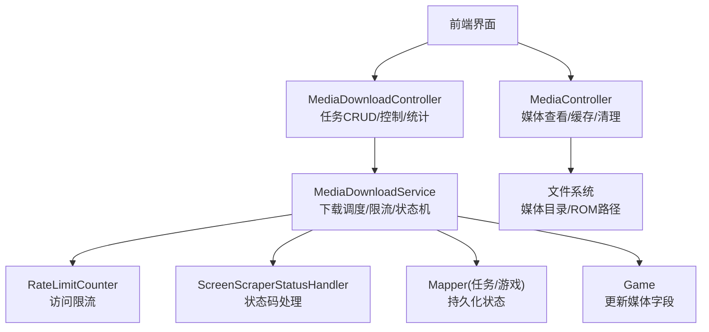
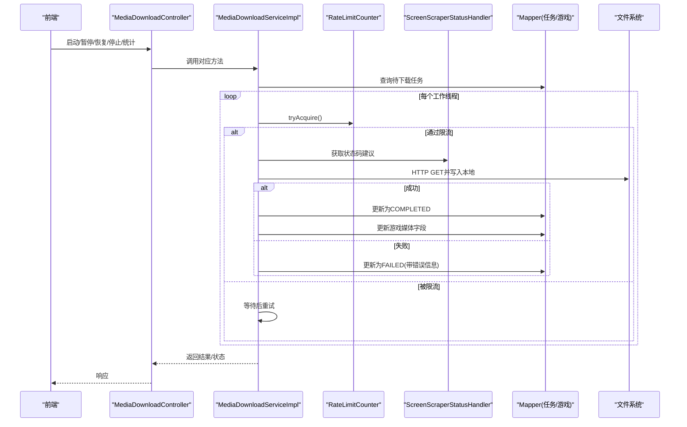
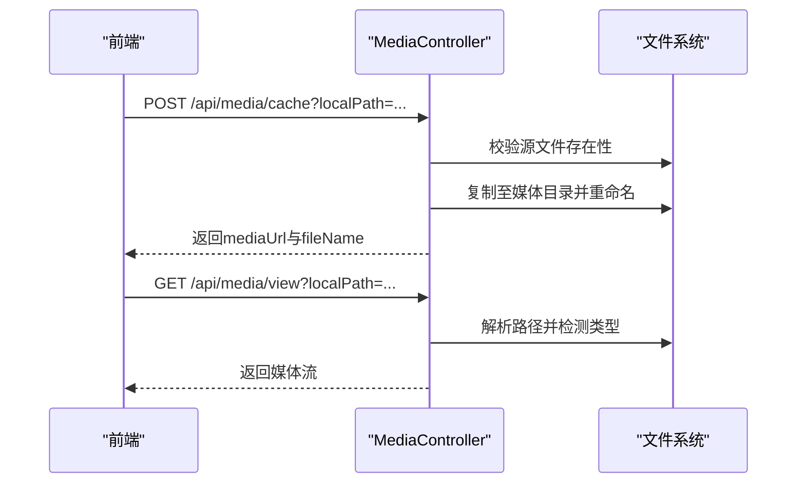
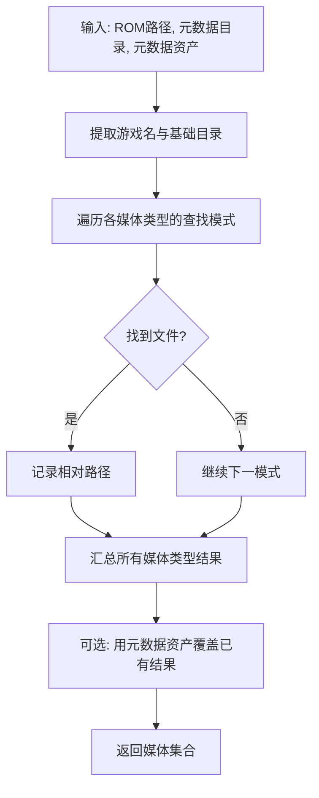
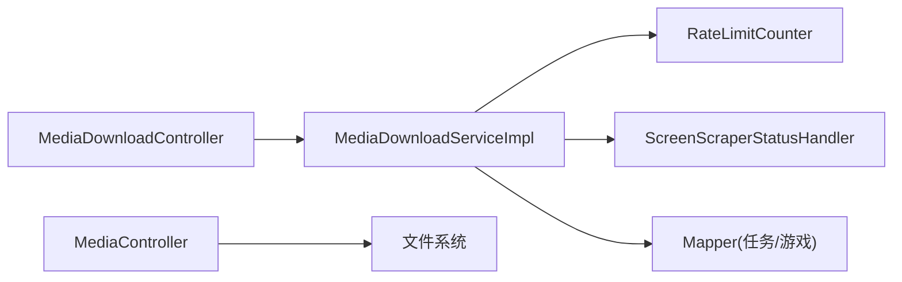

# 媒体资源管理

<cite>
**本文引用的文件**
- [MediaDownloadService.java](file://src/main/java/com/gamelist/service/MediaDownloadService.java)
- [MediaDownloadServiceImpl.java](file://src/main/java/com/gamelist/service/impl/MediaDownloadServiceImpl.java)
- [MediaController.java](file://src/main/java/com/gamelist/controller/MediaController.java)
- [MediaDownloadController.java](file://src/main/java/com/gamelist/controller/MediaDownloadController.java)
- [MediaFileFinder.java](file://src/main/java/com/gamelist/util/MediaFileFinder.java)
- [MediaDownloadTask.java](file://src/main/java/com/gamelist/model/MediaDownloadTask.java)
- [Game.java](file://src/main/java/com/gamelist/model/Game.java)
- [RateLimitCounter.java](file://src/main/java/com/gamelist/util/RateLimitCounter.java)
- [ScreenScraperStatusHandler.java](file://src/main/java/com/gamelist/util/ScreenScraperStatusHandler.java)
- [media-mapping-cn.md](file://docs/media-mapping-cn.md)
</cite>

## 目录
1. [简介](#简介)
2. [项目结构](#项目结构)
3. [核心组件](#核心组件)
4. [架构总览](#架构总览)
5. [详细组件分析](#详细组件分析)
6. [依赖关系分析](#依赖关系分析)
7. [性能与可靠性](#性能与可靠性)
8. [故障排查指南](#故障排查指南)
9. [结论](#结论)
10. [附录：配置与使用示例](#附录配置与使用示例)

## 简介
本章节面向“媒体资源管理”功能，覆盖以下目标：
- 支持的媒体类型：封面、截图、视频、海报、轮播图、背景、手册等。
- 自动下载机制：网络请求、限流控制、错误处理与停止策略（含404阈值保护）。
- 本地文件查找与管理：命名规则、目录结构与引用关系。
- 批量操作：批量下载、批量删除、任务级清理。
- 元数据提取与关联：媒体类型到数据库字段的映射与更新。
- 任务监控与管理：进度跟踪、暂停/恢复/停止、平台维度统计。
- 实际配置与使用场景：结合导入模板与前端展示。

## 项目结构
围绕媒体资源管理的代码主要分布在控制器、服务实现、工具类与模型中：
- 控制器层：提供媒体查看/缓存/清理接口，以及媒体下载任务的查询、控制与统计接口。
- 服务层：实现多线程下载、限流、状态码处理、任务状态流转、平台维度控制。
- 工具层：本地媒体文件查找、HTTP状态码处理、速率限制。
- 模型层：媒体下载任务、游戏实体字段定义。

图表来源
- [MediaController.java:34-88](file://src/main/java/com/gamelist/controller/MediaController.java#L34-L88)
- [MediaDownloadController.java:31-46](file://src/main/java/com/gamelist/controller/MediaDownloadController.java#L31-L46)
- [MediaDownloadServiceImpl.java:64-229](file://src/main/java/com/gamelist/service/impl/MediaDownloadServiceImpl.java#L64-L229)
- [RateLimitCounter.java:31-79](file://src/main/java/com/gamelist/util/RateLimitCounter.java#L31-L79)
- [ScreenScraperStatusHandler.java:79-102](file://src/main/java/com/gamelist/util/ScreenScraperStatusHandler.java#L79-L102)

章节来源
- [MediaController.java:34-88](file://src/main/java/com/gamelist/controller/MediaController.java#L34-L88)
- [MediaDownloadController.java:31-46](file://src/main/java/com/gamelist/controller/MediaDownloadController.java#L31-L46)
- [MediaDownloadServiceImpl.java:64-229](file://src/main/java/com/gamelist/service/impl/MediaDownloadServiceImpl.java#L64-L229)

## 核心组件
- 媒体下载服务：负责创建线程池、拉取待下载任务、并发下载、状态更新、失败重试与停止策略。
- 媒体控制器：提供本地媒体文件的查看、缓存到应用目录、清空缓存能力。
- 媒体文件查找器：根据游戏名与约定目录模式扫描本地媒体文件，支持多种命名与目录变体。
- 任务模型与游戏模型：承载下载任务信息与游戏媒体字段映射。
- 限流与状态码处理：保障外部API稳定性，避免触发封禁或配额耗尽。

章节来源
- [MediaDownloadService.java:5-19](file://src/main/java/com/gamelist/service/MediaDownloadService.java#L5-L19)
- [MediaDownloadServiceImpl.java:28-63](file://src/main/java/com/gamelist/service/impl/MediaDownloadServiceImpl.java#L28-L63)
- [MediaController.java:34-88](file://src/main/java/com/gamelist/controller/MediaController.java#L34-L88)
- [MediaFileFinder.java:89-159](file://src/main/java/com/gamelist/util/MediaFileFinder.java#L89-L159)
- [MediaDownloadTask.java:5-31](file://src/main/java/com/gamelist/model/MediaDownloadTask.java#L5-L31)
- [Game.java:14-53](file://src/main/java/com/gamelist/model/Game.java#L14-L53)

## 架构总览
媒体资源管理的关键流程包括：
- 任务编排：从数据库读取待下载任务，按批次分配给工作线程。
- 下载执行：解密URL、添加认证参数、发起HTTP GET、写入本地文件。
- 状态更新：成功则标记完成并更新游戏媒体字段；失败记录错误信息。
- 限流与容错：基于时间窗口的访问计数，遇到特定状态码立即停止并提示。
- 监控与控制：提供暂停、恢复、停止、平台维度统计与重试。

图表来源
- [MediaDownloadController.java:231-282](file://src/main/java/com/gamelist/controller/MediaDownloadController.java#L231-L282)
- [MediaDownloadServiceImpl.java:64-229](file://src/main/java/com/gamelist/service/impl/MediaDownloadServiceImpl.java#L64-L229)
- [RateLimitCounter.java:31-79](file://src/main/java/com/gamelist/util/RateLimitCounter.java#L31-L79)
- [ScreenScraperStatusHandler.java:79-102](file://src/main/java/com/gamelist/util/ScreenScraperStatusHandler.java#L79-L102)

## 详细组件分析

### 媒体下载服务（MediaDownloadServiceImpl）
- 多线程下载：固定大小线程池，按任务ID拉取待下载任务，乐观锁更新状态避免重复处理。
- 限流控制：基于时间窗口计数，超过阈值进入暂停态，避免触发服务端限流。
- 状态码处理：对4xx/5xx进行统一分类，特殊状态码直接停止任务并给出建议。
- 404保护：在短时间窗口内多次404时自动停止下载，防止无效请求风暴。
- 任务生命周期：PENDING → DOWNLOADING → COMPLETED/FAILED/STOPPED，支持暂停/恢复/停止。
- 元数据关联：下载成功后将本地路径写入游戏实体的对应媒体字段。

```mermaid
flowchart TD
Start(["开始下载"]) --> GetTask["获取待下载任务"]
GetTask --> Acquire["尝试获取限流许可"]
Acquire --> |否| Wait["等待后重试"]
Acquire --> |是| Download["发起HTTP下载"]
Download --> Status{"状态码"}
Status --> |200| Save["写入本地文件"]
Save --> Update["更新任务为完成"]
Update --> MapField["映射并更新游戏媒体字段"]
MapField --> Next["下一个任务"]
Status --> |其他| HandleErr["记录错误/可能停止"]
HandleErr --> Next
Next --> End(["结束或继续"])
```

图表来源
- [MediaDownloadServiceImpl.java:64-229](file://src/main/java/com/gamelist/service/impl/MediaDownloadServiceImpl.java#L64-L229)
- [MediaDownloadServiceImpl.java:268-303](file://src/main/java/com/gamelist/service/impl/MediaDownloadServiceImpl.java#L268-L303)
- [MediaDownloadServiceImpl.java:382-405](file://src/main/java/com/gamelist/service/impl/MediaDownloadServiceImpl.java#L382-L405)
- [MediaDownloadServiceImpl.java:418-495](file://src/main/java/com/gamelist/service/impl/MediaDownloadServiceImpl.java#L418-L495)

章节来源
- [MediaDownloadServiceImpl.java:64-229](file://src/main/java/com/gamelist/service/impl/MediaDownloadServiceImpl.java#L64-L229)
- [MediaDownloadServiceImpl.java:268-303](file://src/main/java/com/gamelist/service/impl/MediaDownloadServiceImpl.java#L268-L303)
- [MediaDownloadServiceImpl.java:382-405](file://src/main/java/com/gamelist/service/impl/MediaDownloadServiceImpl.java#L382-L405)
- [MediaDownloadServiceImpl.java:418-495](file://src/main/java/com/gamelist/service/impl/MediaDownloadServiceImpl.java#L418-L495)

### 媒体控制器（MediaController）
- 缓存接口：将源媒体文件复制到应用媒体目录，生成唯一文件名并返回可访问URL。
- 查看接口：根据传入路径与平台/游戏上下文构建完整路径，检测文件类型并返回流。
- 清理接口：清空媒体缓存目录中的文件。

图表来源
- [MediaController.java:34-88](file://src/main/java/com/gamelist/controller/MediaController.java#L34-L88)
- [MediaController.java:96-243](file://src/main/java/com/gamelist/controller/MediaController.java#L96-L243)
- [MediaController.java:245-269](file://src/main/java/com/gamelist/controller/MediaController.java#L245-L269)

章节来源
- [MediaController.java:34-88](file://src/main/java/com/gamelist/controller/MediaController.java#L34-L88)
- [MediaController.java:96-243](file://src/main/java/com/gamelist/controller/MediaController.java#L96-L243)
- [MediaController.java:245-269](file://src/main/java/com/gamelist/controller/MediaController.java#L245-L269)

### 媒体文件查找器（MediaFileFinder）
- 多模式匹配：针对每种媒体类型定义多组目录与命名规则，优先匹配更具体的路径。
- 相对路径输出：返回相对于基础目录的相对路径，便于跨平台与容器环境使用。
- 元数据资产验证：支持从外部元数据指定媒体路径，若存在则覆盖默认查找结果。

图表来源
- [MediaFileFinder.java:89-159](file://src/main/java/com/gamelist/util/MediaFileFinder.java#L89-L159)
- [MediaFileFinder.java:167-800](file://src/main/java/com/gamelist/util/MediaFileFinder.java#L167-L800)

章节来源
- [MediaFileFinder.java:89-159](file://src/main/java/com/gamelist/util/MediaFileFinder.java#L89-L159)
- [MediaFileFinder.java:167-800](file://src/main/java/com/gamelist/util/MediaFileFinder.java#L167-L800)

### 任务与模型（MediaDownloadTask、Game）
- 任务状态常量：PENDING、DOWNLOADING、COMPLETED、FAILED、SKIPPED、STOPPED。
- 任务属性：任务ID、游戏ID、平台ID、媒体类型、下载URL、本地路径、文件大小、优先级、重试次数、错误信息等。
- 游戏媒体字段：涵盖封面、截图、视频、海报、轮播图、背景、手册、纹理等多种类型。

章节来源
- [MediaDownloadTask.java:5-31](file://src/main/java/com/gamelist/model/MediaDownloadTask.java#L5-L31)
- [Game.java:14-53](file://src/main/java/com/gamelist/model/Game.java#L14-L53)

### 限流与状态码处理（RateLimitCounter、ScreenScraperStatusHandler）
- 限流计数器：10秒窗口内达到阈值即暂停，避免触发服务端限流。
- 状态码处理：对常见错误进行分类，提供是否立即停止、是否通知用户、重试间隔等决策。

章节来源
- [RateLimitCounter.java:31-79](file://src/main/java/com/gamelist/util/RateLimitCounter.java#L31-L79)
- [ScreenScraperStatusHandler.java:79-102](file://src/main/java/com/gamelist/util/ScreenScraperStatusHandler.java#L79-L102)
- [ScreenScraperStatusHandler.java:138-187](file://src/main/java/com/gamelist/util/ScreenScraperStatusHandler.java#L138-L187)

## 依赖关系分析
- 控制器依赖服务：MediaDownloadController调用MediaDownloadService进行任务控制与统计。
- 服务依赖工具：MediaDownloadServiceImpl使用RateLimitCounter进行限流，使用ScreenScraperStatusHandler处理状态码。
- 服务依赖持久化：通过Mapper读写任务与游戏数据，更新任务状态与游戏媒体字段。
- 控制器依赖文件系统：MediaController进行文件复制、读取与清理。

图表来源
- [MediaDownloadController.java:22-27](file://src/main/java/com/gamelist/controller/MediaDownloadController.java#L22-L27)
- [MediaDownloadServiceImpl.java:33-47](file://src/main/java/com/gamelist/service/impl/MediaDownloadServiceImpl.java#L33-L47)
- [MediaController.java:90-95](file://src/main/java/com/gamelist/controller/MediaController.java#L90-L95)

章节来源
- [MediaDownloadController.java:22-27](file://src/main/java/com/gamelist/controller/MediaDownloadController.java#L22-L27)
- [MediaDownloadServiceImpl.java:33-47](file://src/main/java/com/gamelist/service/impl/MediaDownloadServiceImpl.java#L33-L47)
- [MediaController.java:90-95](file://src/main/java/com/gamelist/controller/MediaController.java#L90-L95)

## 性能与可靠性
- 并发与限流：固定线程池配合时间窗口限流，避免过度并发导致服务端拒绝。
- 批处理与停顿：每批任务完成后短暂停顿，降低瞬时压力。
- 404阈值保护：短时间大量404自动停止，减少无效请求。
- 资源释放：finally块确保线程池关闭与资源管理器重置，避免资源泄漏。
- 日志脱敏：敏感参数在日志中隐藏，提升安全性。

[本节为通用性能讨论，不直接分析具体文件]

## 故障排查指南
- 下载失败：检查任务状态是否为FAILED，查看错误信息；必要时重试失败任务。
- 频繁404：确认ROM文件或哈希是否正确；系统会在短时间内多次404后自动停止。
- 限流触发：降低并发或等待限流窗口结束；检查外部API配额与频率限制。
- 无法查看媒体：确认路径拼接逻辑与平台路径设置；必要时使用缓存接口生成稳定URL。
- 任务卡住：检查是否有正在运行的任务；可通过暂停/恢复/停止接口干预。

章节来源
- [MediaDownloadServiceImpl.java:382-405](file://src/main/java/com/gamelist/service/impl/MediaDownloadServiceImpl.java#L382-L405)
- [MediaDownloadController.java:231-282](file://src/main/java/com/gamelist/controller/MediaDownloadController.java#L231-L282)
- [MediaController.java:96-243](file://src/main/java/com/gamelist/controller/MediaController.java#L96-L243)

## 结论
媒体资源管理模块提供了完整的媒体发现、下载、缓存、关联与监控能力。通过严格的限流与状态码处理，保障了对外部服务的稳定性；通过灵活的本地文件查找与映射机制，兼容了多样化的媒体组织方式；通过完善的任务控制接口，实现了批量操作与可视化监控。

[本节为总结，不直接分析具体文件]

## 附录：配置与使用示例

### 支持的媒体类型与映射
- 媒体类型广泛覆盖封面、截图、视频、海报、轮播图、背景、手册、纹理等。
- 不同导入模板（webgamelistoper、emuelec等）定义了各自的媒体路径规则，最终统一映射到数据库字段。

章节来源
- [media-mapping-cn.md:26-67](file://docs/media-mapping-cn.md#L26-L67)
- [media-mapping-cn.md:91-151](file://docs/media-mapping-cn.md#L91-L151)
- [media-mapping-cn.md:234-269](file://docs/media-mapping-cn.md#L234-L269)

### 自动下载机制要点
- 网络请求：解密URL并添加认证参数后发起GET请求。
- 缓存策略：应用内媒体目录缓存本地文件，生成唯一文件名与访问URL。
- 断点续传：当前实现未包含断点续传逻辑；如需支持，可在下载写入阶段增加分片与偏移量管理。

章节来源
- [MediaDownloadServiceImpl.java:268-303](file://src/main/java/com/gamelist/service/impl/MediaDownloadServiceImpl.java#L268-L303)
- [MediaController.java:34-88](file://src/main/java/com/gamelist/controller/MediaController.java#L34-L88)

### 本地文件查找与管理
- 命名规则：支持多种命名变体（如boxFront、box_front、box2dfront等）。
- 目录结构：媒体文件通常位于媒体根目录下按游戏名分组或按类型分组。
- 引用关系：查找到的媒体路径以相对路径形式存储，并在下载成功后更新到游戏实体字段。

章节来源
- [MediaFileFinder.java:167-800](file://src/main/java/com/gamelist/util/MediaFileFinder.java#L167-L800)
- [MediaDownloadServiceImpl.java:418-495](file://src/main/java/com/gamelist/service/impl/MediaDownloadServiceImpl.java#L418-L495)

### 批量媒体文件操作
- 批量下载：通过任务ID或平台ID批量拉取待下载任务，多线程并发处理。
- 批量删除：支持按任务ID或平台ID批量删除媒体下载任务。
- 批量重命名：当前未提供批量重命名接口；可通过缓存接口生成新文件名或使用文件系统工具。

章节来源
- [MediaDownloadController.java:148-226](file://src/main/java/com/gamelist/controller/MediaDownloadController.java#L148-L226)
- [MediaDownloadController.java:361-435](file://src/main/java/com/gamelist/controller/MediaDownloadController.java#L361-L435)

### 元数据提取与关联
- 媒体类型映射：将外部媒体类型映射到数据库字段，确保一致性。
- 关联机制：下载成功后将本地路径写入游戏实体的对应媒体字段，供前端展示。

章节来源
- [MediaDownloadServiceImpl.java:497-558](file://src/main/java/com/gamelist/service/impl/MediaDownloadServiceImpl.java#L497-L558)
- [media-mapping-cn.md:91-151](file://docs/media-mapping-cn.md#L91-L151)

### 任务监控与管理
- 进度跟踪：提供任务总数、待处理、进行中、已完成、失败数等统计。
- 错误处理：记录错误信息并支持重试失败任务。
- 控制接口：支持暂停、恢复、停止、平台维度控制与全局停止。

章节来源
- [MediaDownloadController.java:231-282](file://src/main/java/com/gamelist/controller/MediaDownloadController.java#L231-L282)
- [MediaDownloadController.java:361-435](file://src/main/java/com/gamelist/controller/MediaDownloadController.java#L361-L435)

### 实际使用场景
- 场景一：为新平台批量下载媒体资源
  - 步骤：创建任务 → 启动下载 → 监控进度 → 处理失败 → 完成。
- 场景二：本地媒体文件预览与缓存
  - 步骤：调用缓存接口生成稳定URL → 前端通过查看接口加载媒体。
- 场景三：清理与重建
  - 步骤：清空缓存 → 重新扫描本地媒体 → 重新下载缺失资源。

章节来源
- [MediaDownloadController.java:31-46](file://src/main/java/com/gamelist/controller/MediaDownloadController.java#L31-L46)
- [MediaController.java:34-88](file://src/main/java/com/gamelist/controller/MediaController.java#L34-L88)
- [MediaController.java:96-243](file://src/main/java/com/gamelist/controller/MediaController.java#L96-L243)