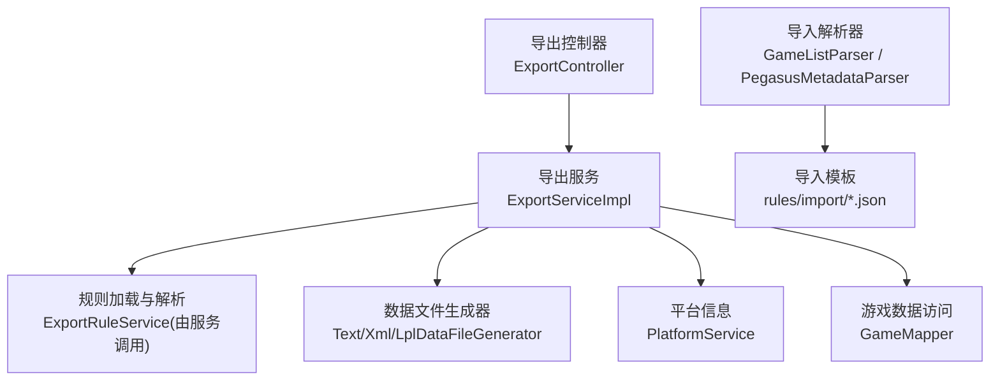
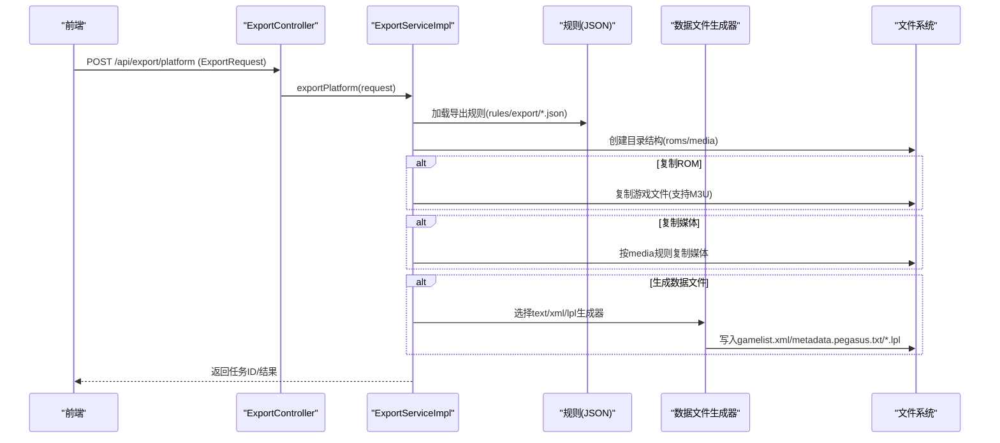
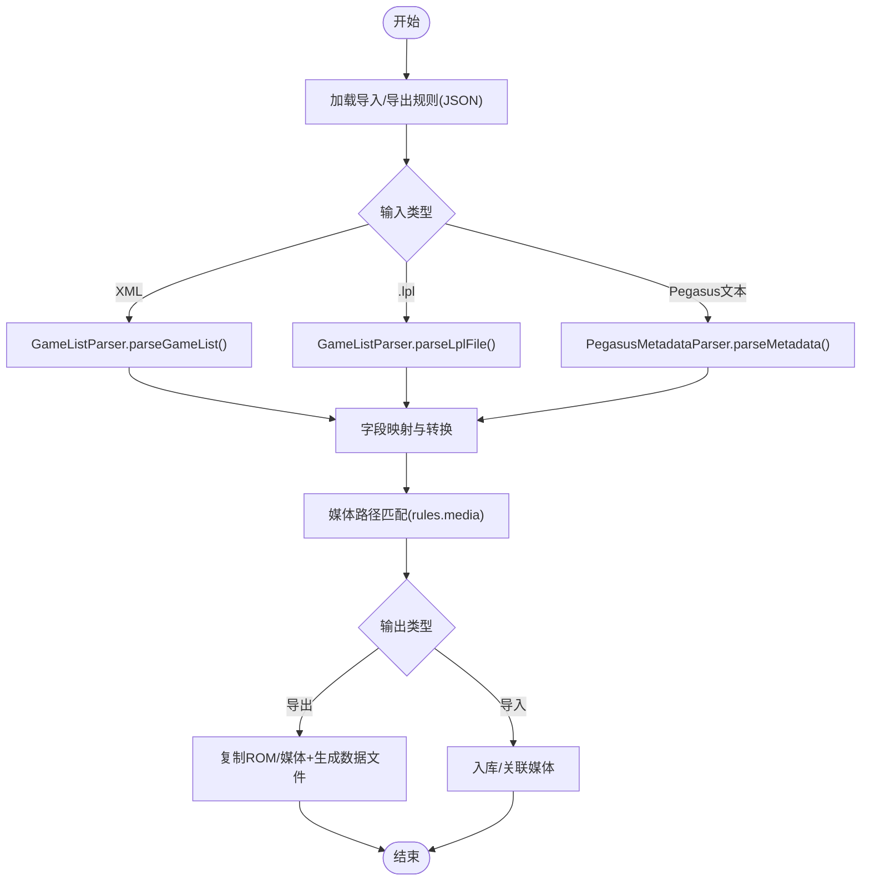
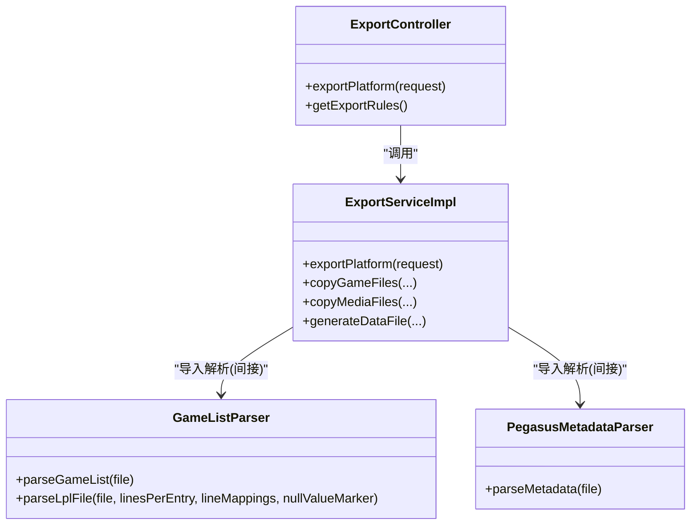

# 导入导出功能

<cite>
**本文引用的文件**
- [ExportController.java](file://src/main/java/com/gamelist/controller/ExportController.java)
- [ExportServiceImpl.java](file://src/main/java/com/gamelist/service/impl/ExportServiceImpl.java)
- [ExportRequest.java](file://src/main/java/com/gamelist/model/ExportRequest.java)
- [ImportRequest.java](file://src/main/java/com/gamelist/model/ImportRequest.java)
- [GameListParser.java](file://src/main/java/com/gamelist/xml/GameListParser.java)
- [PegasusMetadataParser.java](file://src/main/java/com/gamelist/util/PegasusMetadataParser.java)
- [export-functionality-cn.md](file://docs/export-functionality-cn.md)
- [import-templates-cn.md](file://docs/import-templates-cn.md)
- [rules/export/pegasus.json](file://rules/export/pegasus.json)
- [rules/export/retrobat.json](file://rules/export/retrobat.json)
- [rules/export/emuelec.json](file://rules/export/emuelec.json)
- [rules/export/lakka.json](file://rules/export/lakka.json)
- [rules/export/esde.json](file://rules/export/esde.json)
- [rules/import/pegasus.json](file://rules/import/pegasus.json)
- [rules/import/retrobat.json](file://rules/import/retrobat.json)
- [rules/import/emuelec.json](file://rules/import/emuelec.json)
- [rules/import/lakka.json](file://rules/import/lakka.json)
- [rules/import/esde.json](file://rules/import/esde.json)
</cite>

## 目录
1. [简介](#简介)
2. [项目结构](#项目结构)
3. [核心组件](#核心组件)
4. [架构总览](#架构总览)
5. [详细组件分析](#详细组件分析)
6. [依赖关系分析](#依赖关系分析)
7. [性能考虑](#性能考虑)
8. [故障排查指南](#故障排查指南)
9. [结论](#结论)
10. [附录](#附录)

## 简介
本文件面向“导入导出”能力，覆盖以下目标：
- 支持多种前端模板的导入与导出：Pegasus、RetroBat、EmuELEC、Lakka、ES-DE 等。
- 自定义导入/导出模板的配置方法：字段映射、数据转换、验证规则。
- 批量导入/导出的操作流程：文件上传、数据处理、错误处理机制。
- 导出规则的 JSON 配置结构：变量替换、条件过滤、数据格式化。
- 不同格式的导入/导出示例：请求参数、配置文件、使用场景。
- 常见问题排查与性能优化建议。

## 项目结构
导入导出相关代码与配置主要分布在如下位置：
- 控制器与服务：导出入口在 ExportController，核心逻辑在 ExportServiceImpl；导入解析在 GameListParser 与 PegasusMetadataParser。
- 规则配置：
  - 导出规则位于 rules/export/*.json（如 pegasus.json、retrobat.json、emuelec.json、lakka.json、esde.json）。
  - 导入模板位于 rules/import/*.json（如 pegasus.json、retrobat.json、emuelec.json、lakka.json、esde.json）。
- 文档说明：docs/export-functionality-cn.md、docs/import-templates-cn.md。

图表来源
- [ExportController.java:14-59](file://src/main/java/com/gamelist/controller/ExportController.java#L14-L59)
- [ExportServiceImpl.java:31-181](file://src/main/java/com/gamelist/service/impl/ExportServiceImpl.java#L31-L181)
- [GameListParser.java:319-384](file://src/main/java/com/gamelist/xml/GameListParser.java#L319-L384)
- [PegasusMetadataParser.java:284-614](file://src/main/java/com/gamelist/util/PegasusMetadataParser.java#L284-L614)

章节来源
- [ExportController.java:14-59](file://src/main/java/com/gamelist/controller/ExportController.java#L14-L59)
- [ExportServiceImpl.java:31-181](file://src/main/java/com/gamelist/service/impl/ExportServiceImpl.java#L31-L181)
- [GameListParser.java:319-384](file://src/main/java/com/gamelist/xml/GameListParser.java#L319-L384)
- [PegasusMetadataParser.java:284-614](file://src/main/java/com/gamelist/util/PegasusMetadataParser.java#L284-L614)

## 核心组件
- 导出控制器：提供 REST 接口用于触发平台导出与获取导出规则列表。
- 导出服务：实现平台导出流程，包括创建目录、复制 ROM/媒体、生成数据文件、任务进度跟踪。
- 导入解析器：
  - GameListParser：解析 XML 格式的游戏列表（含编码检测、BOM 处理、多编码尝试），并支持 Lakka .lpl 播放列表解析。
  - PegasusMetadataParser：解析 Pegasus 文本元数据文件。
- 规则配置：
  - 导出规则：rules/export/*.json，定义媒体拷贝路径、数据文件格式、目录结构、变量替换等。
  - 导入模板：rules/import/*.json，定义字段映射、媒体匹配规则、扩展名、表头提取等。

章节来源
- [ExportController.java:14-59](file://src/main/java/com/gamelist/controller/ExportController.java#L14-L59)
- [ExportServiceImpl.java:52-181](file://src/main/java/com/gamelist/service/impl/ExportServiceImpl.java#L52-L181)
- [GameListParser.java:319-384](file://src/main/java/com/gamelist/xml/GameListParser.java#L319-L384)
- [PegasusMetadataParser.java:284-614](file://src/main/java/com/gamelist/util/PegasusMetadataParser.java#L284-L614)
- [export-functionality-cn.md:18-116](file://docs/export-functionality-cn.md#L18-L116)
- [import-templates-cn.md:16-73](file://docs/import-templates-cn.md#L16-L73)

## 架构总览
导出与导入的整体流程如下：

图表来源
- [ExportController.java:25-41](file://src/main/java/com/gamelist/controller/ExportController.java#L25-L41)
- [ExportServiceImpl.java:52-181](file://src/main/java/com/gamelist/service/impl/ExportServiceImpl.java#L52-L181)
- [export-functionality-cn.md:480-515](file://docs/export-functionality-cn.md#L480-L515)

## 详细组件分析

### 导出规则与模板（JSON）
- 通用结构
  - 基本信息：frontend、name、version、description。
  - rules.media：媒体类型到目标路径的映射，支持 dataFileTag 控制是否在数据文件中引用。
  - rules.dataFile：文件名、格式（text/xml/lpl）、路径格式、header/footer、fields 映射。
  - rules.directory：roms/media/gamelist 目录模板。
  - 可选：rules.m3u（启用 M3U 处理及目标路径模板）、rules.gameFile（重命名模板）、rules.exportOptions（限制导出内容）。
- 各前端差异要点
  - Pegasus：text 格式，metadata.pegasus.txt，支持 assets.* 标签；m3u 可启用。
  - RetroBat：xml 格式，gamelist.xml，provider 包含 system/software/database/web。
  - EmuELEC：xml 格式，仅导出媒体与列表（exportOptions.gameFiles=false）。
  - ES-DE：xml 格式，三目录结构（gamelists/downloaded_media/roms），dataFileTag 常为 null（按文件名匹配）。
  - Lakka：lpl 播放列表，lineFormat 定义每条目行数与变量替换，coreMappings 与 platformMappings 映射核心与平台名称。

章节来源
- [rules/export/pegasus.json:1-93](file://rules/export/pegasus.json#L1-L93)
- [rules/export/retrobat.json:1-92](file://rules/export/retrobat.json#L1-L92)
- [rules/export/emuelec.json:1-102](file://rules/export/emuelec.json#L1-L102)
- [rules/export/esde.json:1-120](file://rules/export/esde.json#L1-L120)
- [rules/export/lakka.json:1-73](file://rules/export/lakka.json#L1-L73)
- [export-functionality-cn.md:42-116](file://docs/export-functionality-cn.md#L42-L116)

### 导入模板与字段映射
- 通用结构
  - type/dataFile/delimiter：数据文件类型与分隔符。
  - rules.header：表头提取（XML 或 key-value），startMarker/endMarker，structure 与 fields 映射平台信息。
  - rules.fieldMappings：外部字段到系统字段的映射，支持 isMultiValue、valuePrefix、transform（path/trim/case/replace）。
  - rules.media：媒体源字段与路径规则数组，支持 {gameName}/{filename}/{filepath}/{ext} 等变量。
  - rules.extensions/gameExtensions：支持的图片/视频/游戏扩展名。
- 各前端特点
  - Pegasus：text，metadata.pegasus.txt，files 支持多行缩进值。
  - RetroBat/ES-DE/EmuELEC：xml，gamelist.xml，provider 字段映射。
  - Lakka：*.lpl，linesPerEntry=5/6，nullValueMarker="DETECT"。

章节来源
- [rules/import/pegasus.json:1-556](file://rules/import/pegasus.json#L1-L556)
- [rules/import/retrobat.json:1-435](file://rules/import/retrobat.json#L1-L435)
- [rules/import/emuelec.json:1-206](file://rules/import/emuelec.json#L1-L206)
- [rules/import/esde.json:1-204](file://rules/import/esde.json#L1-L204)
- [rules/import/lakka.json:1-58](file://rules/import/lakka.json#L1-L58)
- [import-templates-cn.md:75-158](file://docs/import-templates-cn.md#L75-L158)

### 批量导入导出流程
- 导出流程
  - 接收 ExportRequest（platformId、frontend、outputPath、copyRoms、copyMedia、generateDataFile、threadCount）。
  - 加载规则、创建目录、并行复制 ROM/媒体、生成数据文件（text/xml/lpl），更新任务进度。
- 导入流程
  - 解析 XML（自动编码检测、BOM 处理、多编码尝试）或 Lakka .lpl（自动检测 5/6 行格式）。
  - 根据导入模板进行字段映射与媒体匹配，支持深度子目录与多种路径规则。

图表来源
- [GameListParser.java:319-384](file://src/main/java/com/gamelist/xml/GameListParser.java#L319-L384)
- [GameListParser.java:578-697](file://src/main/java/com/gamelist/xml/GameListParser.java#L578-L697)
- [PegasusMetadataParser.java:284-614](file://src/main/java/com/gamelist/util/PegasusMetadataParser.java#L284-L614)
- [ExportServiceImpl.java:183-581](file://src/main/java/com/gamelist/service/impl/ExportServiceImpl.java#L183-L581)

章节来源
- [ExportServiceImpl.java:52-181](file://src/main/java/com/gamelist/service/impl/ExportServiceImpl.java#L52-L181)
- [ExportServiceImpl.java:183-581](file://src/main/java/com/gamelist/service/impl/ExportServiceImpl.java#L183-L581)
- [GameListParser.java:319-384](file://src/main/java/com/gamelist/xml/GameListParser.java#L319-L384)
- [GameListParser.java:578-697](file://src/main/java/com/gamelist/xml/GameListParser.java#L578-L697)
- [PegasusMetadataParser.java:284-614](file://src/main/java/com/gamelist/util/PegasusMetadataParser.java#L284-L614)

### API 与请求模型
- 导出接口
  - POST /api/export/platform：请求体 ExportRequest，包含平台 ID、目标前端、输出路径、是否复制 ROM/媒体/生成数据文件、线程数。
  - GET /api/export/rules：返回可用导出规则列表。
- 导入请求模型
  - ImportRequest：包含 filePaths（文件路径列表）与 scanDepth（扫描深度）。

章节来源
- [ExportController.java:25-59](file://src/main/java/com/gamelist/controller/ExportController.java#L25-L59)
- [ExportRequest.java:1-70](file://src/main/java/com/gamelist/model/ExportRequest.java#L1-L70)
- [ImportRequest.java:1-29](file://src/main/java/com/gamelist/model/ImportRequest.java#L1-L29)

### Lakka LPL 生成与核心映射
- LPL 导出通过 lplExport.lineFormat 逐行生成条目，支持 coreMappings 与 platformMappings 将平台映射到 Retrolib 核心与显示名。
- 生成时按游戏逐项替换变量（gameFileName、gameName、corePath、coreName、platformName）。

章节来源
- [rules/export/lakka.json:1-73](file://rules/export/lakka.json#L1-L73)
- [ExportServiceImpl.java:583-668](file://src/main/java/com/gamelist/service/impl/ExportServiceImpl.java#L583-L668)

## 依赖关系分析
- 控制器依赖服务：ExportController -> ExportServiceImpl。
- 服务依赖：
  - 规则加载：ExportRuleService（由服务调用，规则来自 rules/export/*.json）。
  - 数据访问：GameMapper（查询平台下的游戏）。
  - 平台信息：PlatformService（获取平台字段用于变量替换）。
  - 任务管理：TaskService（记录进度与日志）。
- 导入解析依赖：
  - GameListParser：XML/.lpl 解析与编码检测。
  - PegasusMetadataParser：Pegasus 文本元数据解析。

图表来源
- [ExportController.java:14-59](file://src/main/java/com/gamelist/controller/ExportController.java#L14-L59)
- [ExportServiceImpl.java:31-181](file://src/main/java/com/gamelist/service/impl/ExportServiceImpl.java#L31-L181)
- [GameListParser.java:319-384](file://src/main/java/com/gamelist/xml/GameListParser.java#L319-L384)
- [PegasusMetadataParser.java:284-614](file://src/main/java/com/gamelist/util/PegasusMetadataParser.java#L284-L614)

章节来源
- [ExportController.java:14-59](file://src/main/java/com/gamelist/controller/ExportController.java#L14-L59)
- [ExportServiceImpl.java:31-181](file://src/main/java/com/gamelist/service/impl/ExportServiceImpl.java#L31-L181)
- [GameListParser.java:319-384](file://src/main/java/com/gamelist/xml/GameListParser.java#L319-L384)
- [PegasusMetadataParser.java:284-614](file://src/main/java/com/gamelist/util/PegasusMetadataParser.java#L284-L614)

## 性能考虑
- 并发复制：导出服务使用固定大小线程池并行复制 ROM/媒体，默认线程数基于 CPU 核心数，最大限制避免过度竞争。
- 任务进度：异步执行导出任务，实时更新进度与日志，便于监控与中断。
- 解析优化：XML 解析采用多编码尝试与 BOM 检测，减少失败重试成本；LPL 解析自动检测 5/6 行格式。
- I/O 优化：预创建目录结构，减少重复检查；媒体规则预构建，避免循环内重复查找。

[本节为通用指导，无需特定文件来源]

## 故障排查指南
- 导出失败常见原因
  - 未找到导出规则：确认 frontend 与 rules/export/*.json 一致。
  - 平台不存在：检查 platformId 是否正确。
  - 路径变量替换异常：核对 directory/media 模板中的变量（{outputPath}/{platform}/{mediaPath}）。
  - 媒体文件缺失：检查 source 字段是否存在且路径有效。
- 导入失败常见原因
  - XML 编码问题：GameListParser 已自动检测 BOM 与声明编码，若仍失败请检查文件编码是否为 UTF-8/UTF-16/GBK 等。
  - LPL 格式不匹配：确认 linesPerEntry 与 nullValueMarker 设置正确。
  - 字段映射错误：核对 rules.fieldMappings.fields 与实际数据字段名一致。
- 日志定位
  - 导出：查看 ExportServiceImpl 日志，关注“复制游戏文件/媒体文件/生成数据文件”步骤。
  - 导入：查看 GameListParser 日志，关注“检测到的文件编码/解析成功/失败”等信息。

章节来源
- [ExportServiceImpl.java:52-181](file://src/main/java/com/gamelist/service/impl/ExportServiceImpl.java#L52-L181)
- [GameListParser.java:319-384](file://src/main/java/com/gamelist/xml/GameListParser.java#L319-L384)

## 结论
本导入导出功能通过 JSON 规则驱动，实现对多种前端（Pegasus、RetroBat、EmuELEC、Lakka、ES-DE）的数据与媒体文件的灵活迁移。导出支持 text/xml/lpl 格式与丰富的变量替换，导入支持 XML/.lpl/Pegasus 文本解析与强大的字段映射与媒体匹配。通过并发复制与任务进度反馈，兼顾性能与可观测性。用户可根据实际需求定制导入/导出模板，满足复杂业务场景。

[本节为总结，无需特定文件来源]

## 附录

### 导出规则 JSON 结构速查
- media：source/target/dataFileTag
- dataFile：filename/format/pathFormat/header/footer/fields
- directory：roms/media/gamelist
- m3u：enabled/target
- gameFile：enabled/template
- exportOptions：gameFiles/mediaFiles/gameListFile/showWarning

章节来源
- [export-functionality-cn.md:42-116](file://docs/export-functionality-cn.md#L42-L116)
- [rules/export/pegasus.json:1-93](file://rules/export/pegasus.json#L1-L93)
- [rules/export/retrobat.json:1-92](file://rules/export/retrobat.json#L1-L92)
- [rules/export/emuelec.json:1-102](file://rules/export/emuelec.json#L1-L102)
- [rules/export/esde.json:1-120](file://rules/export/esde.json#L1-L120)
- [rules/export/lakka.json:1-73](file://rules/export/lakka.json#L1-L73)

### 导入模板 JSON 结构速查
- header：enabled/format/startMarker/endMarker/structure/fields
- fieldMappings：fields/isMultiValue/valuePrefix/transform
- media：source/rules（路径模板数组）
- extensions：image/video
- gameExtensions：游戏扩展名列表

章节来源
- [import-templates-cn.md:75-158](file://docs/import-templates-cn.md#L75-L158)
- [rules/import/pegasus.json:1-556](file://rules/import/pegasus.json#L1-L556)
- [rules/import/retrobat.json:1-435](file://rules/import/retrobat.json#L1-L435)
- [rules/import/emuelec.json:1-206](file://rules/import/emuelec.json#L1-L206)
- [rules/import/esde.json:1-204](file://rules/import/esde.json#L1-L204)
- [rules/import/lakka.json:1-58](file://rules/import/lakka.json#L1-L58)

### 常用变量参考
- 路径变量：{outputPath}、{platform}、{gameName}、{mediaPath}、{romsPath}
- 平台变量：{platform.system}、{platform.software}、{platform.database}、{platform.web}、{platform.launch}、{platform.name}、{platform.sortBy}、{platform.folderPath}
- 环境变量：{env.appdir}、{env.home}、{env.user}
- 游戏变量：{game.name}、{game.path}、{game.description}、{game.rating}、{game.developer}、{game.publisher}、{game.genre}、{game.players}

章节来源
- [export-functionality-cn.md:405-442](file://docs/export-functionality-cn.md#L405-L442)
- [import-templates-cn.md:780-800](file://docs/import-templates-cn.md#L780-L800)