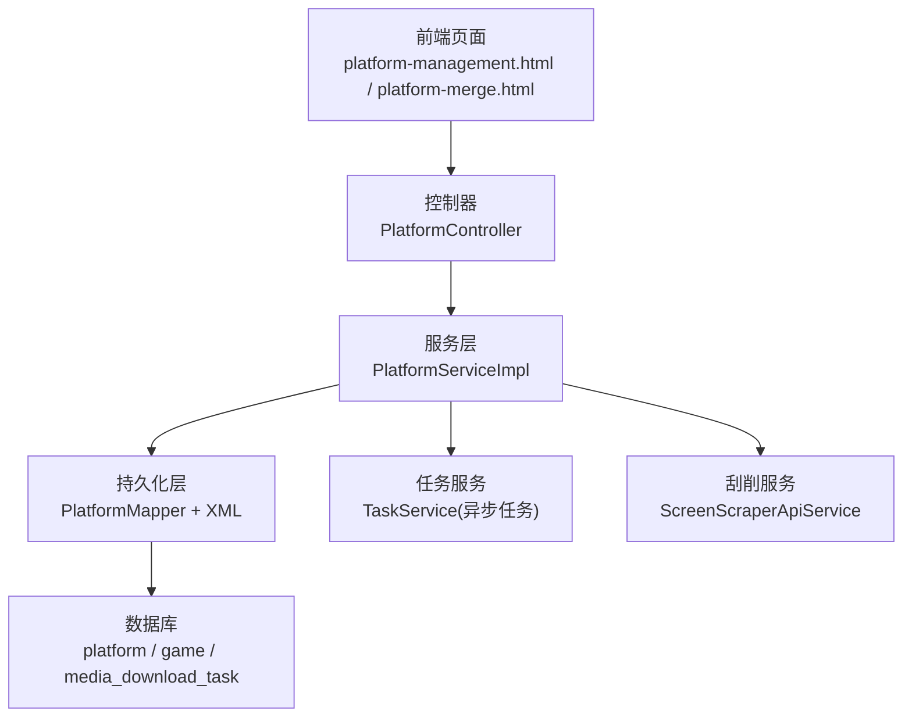
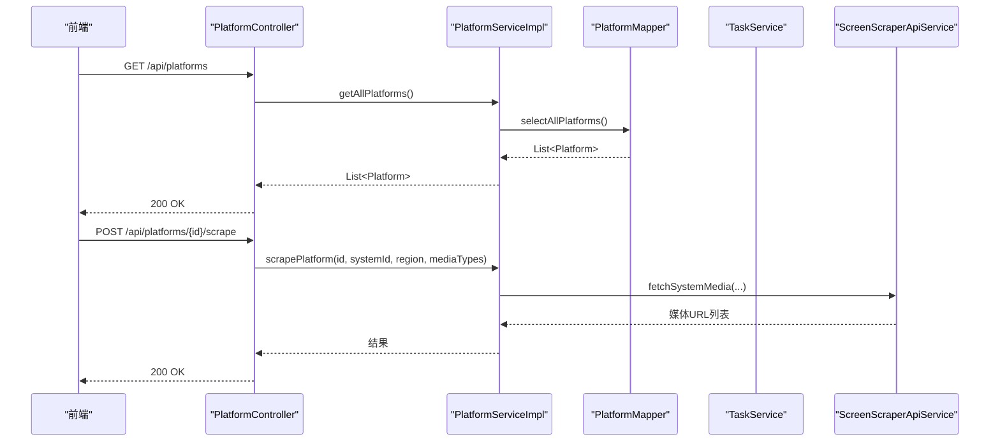
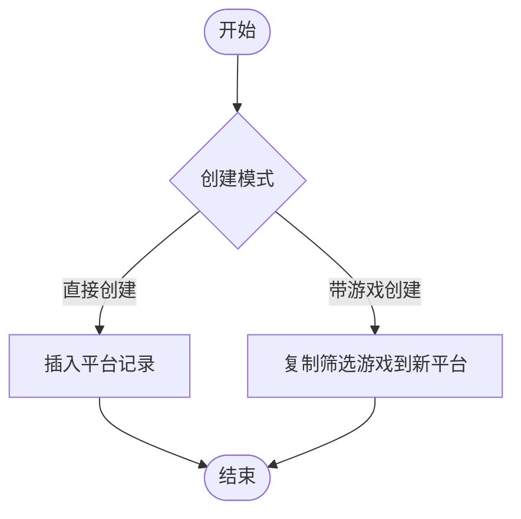
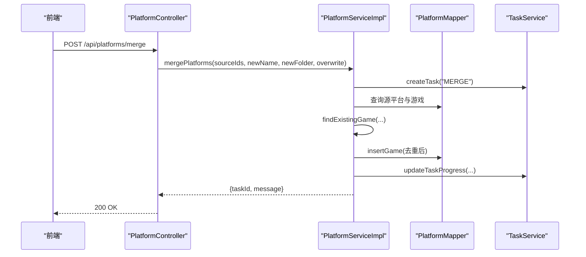
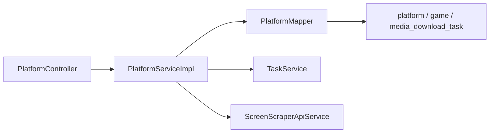

# 平台管理

<cite>
**本文引用的文件**
- [PlatformController.java](file://src/main/java/com/gamelist/controller/PlatformController.java)
- [PlatformService.java](file://src/main/java/com/gamelist/service/PlatformService.java)
- [PlatformServiceImpl.java](file://src/main/java/com/gamelist/service/impl/PlatformServiceImpl.java)
- [PlatformMapper.java](file://src/main/java/com/gamelist/mapper/PlatformMapper.java)
- [PlatformMapper.xml](file://src/main/resources/mappers/PlatformMapper.xml)
- [Platform.java](file://src/main/java/com/gamelist/model/Platform.java)
- [PlatformType.java](file://src/main/java/com/gamelist/model/PlatformType.java)
- [PlatformStatistics.java](file://src/main/java/com/gamelist/model/PlatformStatistics.java)
- [Game.java](file://src/main/java/com/gamelist/model/Game.java)
- [MergeOperation.java](file://src/main/java/com/gamelist/model/MergeOperation.java)
- [V1.0.4__add_platform_fields.sql](file://src/main/resources/db/migration/V1.0.4__add_platform_fields.sql)
- [V1.0.6__add_platform_type_column.sql](file://src/main/resources/db/migration/V1.0.6__add_platform_type_column.sql)
- [init.sql](file://src/main/resources/sql/init.sql)
- [platform-management.html](file://src/main/resources/static/platform-management.html)
- [platform-merge.html](file://src/main/resources/static/platform-merge.html)
</cite>

## 目录
1. [简介](#简介)
2. [项目结构](#项目结构)
3. [核心组件](#核心组件)
4. [架构总览](#架构总览)
5. [详细组件分析](#详细组件分析)
6. [依赖关系分析](#依赖关系分析)
7. [性能考虑](#性能考虑)
8. [故障排查指南](#故障排查指南)
9. [结论](#结论)
10. [附录：API 接口与使用示例](#附录api-接口与使用示例)

## 简介
本章节面向“平台管理”功能，覆盖平台的创建、编辑、删除、合并、统计与刮削等能力。文档从系统架构、数据流、处理逻辑、集成点、错误处理与性能特性等方面展开，并提供完整的 API 接口说明与前端交互要点，帮助开发者快速理解并正确使用平台管理能力。

## 项目结构
平台管理相关代码采用典型的分层架构：
- 控制器层：暴露 RESTful API，负责请求路由与参数校验
- 服务层：实现业务逻辑（平台 CRUD、合并、统计、刮削）
- 持久化层：MyBatis Mapper 与 SQL 映射，完成数据库操作
- 模型层：平台、游戏、统计、类型等实体定义
- 迁移脚本：Flyway 数据库版本管理
- 前端页面：平台管理与合并界面

图表来源
- [PlatformController.java:22-173](file://src/main/java/com/gamelist/controller/PlatformController.java#L22-L173)
- [PlatformServiceImpl.java:29-54](file://src/main/java/com/gamelist/service/impl/PlatformServiceImpl.java#L29-L54)
- [PlatformMapper.java:8-16](file://src/main/java/com/gamelist/mapper/PlatformMapper.java#L8-L16)
- [PlatformMapper.xml:23-61](file://src/main/resources/mappers/PlatformMapper.xml#L23-L61)

章节来源
- [PlatformController.java:22-173](file://src/main/java/com/gamelist/controller/PlatformController.java#L22-L173)
- [PlatformServiceImpl.java:29-54](file://src/main/java/com/gamelist/service/impl/PlatformServiceImpl.java#L29-L54)
- [PlatformMapper.java:8-16](file://src/main/java/com/gamelist/mapper/PlatformMapper.java#L8-L16)
- [PlatformMapper.xml:23-61](file://src/main/resources/mappers/PlatformMapper.xml#L23-L61)

## 核心组件
- 平台实体 Platform：包含系统标识、名称、软件信息、数据库、Web 地址、排序方式、启动命令、文件夹路径、系统 ID、区域、Logo 配置、时间戳等字段
- 平台类型 PlatformType：内置支持 Recalbox、Batocera、RetroBat、ESDE、通用类型，提供类型校验与名称识别
- 平台统计 PlatformStatistics：统计平台的游戏总数、完全/部分/未刮削数量、缺失游戏数
- 平台服务 PlatformService/Impl：提供平台 CRUD、带游戏的平台创建、多平台合并、统计查询、刮削入口
- 平台控制器 PlatformController：REST API，统一返回格式与异常封装
- 数据访问 PlatformMapper/XML：平台表增删改查映射

章节来源
- [Platform.java:1-141](file://src/main/java/com/gamelist/model/Platform.java#L1-L141)
- [PlatformType.java:1-51](file://src/main/java/com/gamelist/model/PlatformType.java#L1-L51)
- [PlatformStatistics.java:1-55](file://src/main/java/com/gamelist/model/PlatformStatistics.java#L1-L55)
- [PlatformService.java:11-38](file://src/main/java/com/gamelist/service/PlatformService.java#L11-L38)
- [PlatformServiceImpl.java:55-520](file://src/main/java/com/gamelist/service/impl/PlatformServiceImpl.java#L55-L520)
- [PlatformController.java:22-173](file://src/main/java/com/gamelist/controller/PlatformController.java#L22-L173)
- [PlatformMapper.java:8-16](file://src/main/java/com/gamelist/mapper/PlatformMapper.java#L8-L16)
- [PlatformMapper.xml:23-61](file://src/main/resources/mappers/PlatformMapper.xml#L23-L61)

## 架构总览
平台管理的整体调用链如下：
- 前端通过 REST API 发起平台列表、详情、新增、更新、删除、合并、统计、刮削等操作
- 控制器将请求转发至服务层，服务层协调 Mapper、任务服务与刮削服务
- 数据持久化通过 MyBatis 映射到数据库；合并与刮削等耗时操作以异步任务执行

图表来源
- [PlatformController.java:29-173](file://src/main/java/com/gamelist/controller/PlatformController.java#L29-L173)
- [PlatformServiceImpl.java:55-54](file://src/main/java/com/gamelist/service/impl/PlatformServiceImpl.java#L55-L54)
- [PlatformMapper.xml:23-61](file://src/main/resources/mappers/PlatformMapper.xml#L23-L61)

## 详细组件分析

### 平台基本信息与生命周期
- 创建平台：支持直接添加与“带游戏的平台创建”，后者可从筛选条件复制游戏到新平台
- 更新平台：同步 system 与 name 字段，确保一致性
- 删除平台：级联清理媒体下载任务与关联游戏后删除平台
- 读取平台：按 ID 或系统名查询，支持列出全部

图表来源
- [PlatformController.java:57-107](file://src/main/java/com/gamelist/controller/PlatformController.java#L57-L107)
- [PlatformServiceImpl.java:505-631](file://src/main/java/com/gamelist/service/impl/PlatformServiceImpl.java#L505-L631)

章节来源
- [PlatformController.java:29-107](file://src/main/java/com/gamelist/controller/PlatformController.java#L29-L107)
- [PlatformServiceImpl.java:484-631](file://src/main/java/com/gamelist/service/impl/PlatformServiceImpl.java#L484-L631)
- [PlatformMapper.xml:23-61](file://src/main/resources/mappers/PlatformMapper.xml#L23-L61)

### ROM 路径配置与系统类型设置
- 平台对象包含 folderPath、system、software、database、web、sortBy、launch、systemId、systemRegion、logoRegion、logoType 等字段，用于描述 ROM 路径、系统信息与展示行为
- 平台类型由 PlatformType 提供常量与识别方法，便于扩展新平台类型

章节来源
- [Platform.java:1-141](file://src/main/java/com/gamelist/model/Platform.java#L1-L141)
- [PlatformType.java:1-51](file://src/main/java/com/gamelist/model/PlatformType.java#L1-L51)

### 平台间的数据迁移（合并）
- 双平台合并：将次要平台的游戏复制到主要平台，生成后台任务并异步执行
- 多平台合并：选择多个源平台，创建新平台并将所有游戏整合到新平台，支持覆盖策略
- 冲突检测：优先基于 gameId、crc32 匹配，再回退到文件名与游戏名匹配，避免重复与冲突
- 报告与日志：合并过程记录进度与日志，完成后输出汇总信息

图表来源
- [PlatformController.java:109-141](file://src/main/java/com/gamelist/controller/PlatformController.java#L109-L141)
- [PlatformServiceImpl.java:679-852](file://src/main/java/com/gamelist/service/impl/PlatformServiceImpl.java#L679-L852)

章节来源
- [PlatformController.java:109-141](file://src/main/java/com/gamelist/controller/PlatformController.java#L109-L141)
- [PlatformServiceImpl.java:633-852](file://src/main/java/com/gamelist/service/impl/PlatformServiceImpl.java#L633-L852)
- [init.sql:203-233](file://src/main/resources/sql/init.sql#L203-L233)

### 平台统计信息的收集与分析
- 统计维度：平台 ID、名称、总游戏数、完全/部分/未刮削数量、缺失游戏数
- 前端展示：平台列表页与详情页均会拉取统计数据并渲染
- 数据来源：服务层聚合游戏与媒体状态，返回给控制器与前端

章节来源
- [PlatformStatistics.java:1-55](file://src/main/java/com/gamelist/model/PlatformStatistics.java#L1-L55)
- [platform-management.html:1224-1267](file://src/main/resources/static/platform-management.html#L1224-L1267)
- [platform-details.html:719-741](file://src/main/resources/static/platform-details.html#L719-L741)

### 平台合并的重复检测与冲突解决
- 重复检测优先级：gameId > crc32 > 文件名/游戏名
- 冲突处理：在目标平台已存在时，可选择跳过或覆盖（由上层策略控制），并在合并报告中记录冲突项
- 数据整合：将源平台游戏复制为目标平台的新记录，保持原始元数据一致

章节来源
- [PlatformServiceImpl.java:854-874](file://src/main/java/com/gamelist/service/impl/PlatformServiceImpl.java#L854-L874)
- [init.sql:203-233](file://src/main/resources/sql/init.sql#L203-L233)

### 平台类型的定义与扩展机制
- 内置类型：recalbox、batocera、retrobat、esde、generic
- 扩展方式：在 PlatformType 中增加常量与识别规则，并在业务处调用 isValidPlatformType/detectPlatformType 进行校验与推断
- 数据库支持：game 表新增 platform_type 列，便于记录游戏所属平台类型

章节来源
- [PlatformType.java:1-51](file://src/main/java/com/gamelist/model/PlatformType.java#L1-L51)
- [V1.0.6__add_platform_type_column.sql:1-2](file://src/main/resources/db/migration/V1.0.6__add_platform_type_column.sql#L1-L2)

### 刮削与媒体文件关联
- 平台刮削：通过 /{id}/scrape 接口传入 systemId、region、mediaTypes，触发媒体抓取
- 媒体下载任务：与平台关联，支持按平台维度查看任务状态与统计
- 前端联动：媒体下载页面可获取平台信息与统计，展示运行状态

章节来源
- [PlatformController.java:156-173](file://src/main/java/com/gamelist/controller/PlatformController.java#L156-L173)
- [V1.0.4__add_platform_fields.sql:1-10](file://src/main/resources/db/migration/V1.0.4__add_platform_fields.sql#L1-L10)
- [platform-management.html:759-928](file://src/main/resources/static/media-download.html#L759-L928)

## 依赖关系分析
- 控制器依赖服务层，服务层依赖 Mapper、任务服务与刮削服务
- Mapper 与 XML 映射平台表，提供基础 CRUD
- 数据库迁移脚本为平台与任务表扩展字段，提升查询与关联能力

图表来源
- [PlatformController.java:22-173](file://src/main/java/com/gamelist/controller/PlatformController.java#L22-L173)
- [PlatformServiceImpl.java:29-54](file://src/main/java/com/gamelist/service/impl/PlatformServiceImpl.java#L29-L54)
- [PlatformMapper.java:8-16](file://src/main/java/com/gamelist/mapper/PlatformMapper.java#L8-L16)

章节来源
- [PlatformController.java:22-173](file://src/main/java/com/gamelist/controller/PlatformController.java#L22-L173)
- [PlatformServiceImpl.java:29-54](file://src/main/java/com/gamelist/service/impl/PlatformServiceImpl.java#L29-L54)
- [PlatformMapper.java:8-16](file://src/main/java/com/gamelist/mapper/PlatformMapper.java#L8-L16)

## 性能考虑
- 批量插入：临时子集游戏写入采用分批插入，降低数据库压力
- 异步任务：合并与刮削等耗时操作通过后台任务执行，避免阻塞请求线程
- 索引优化：媒体下载任务表按 platform_id 建立索引，提高查询效率
- 去重策略：合并时优先使用唯一标识（gameId、crc32）减少重复判断开销

[本节为通用性能建议，不直接分析具体文件]

## 故障排查指南
- 平台不存在：更新或删除时若 ID 无效，控制器返回 NOT_FOUND 或抛出参数异常
- 合并失败：服务层捕获异常并返回 success=false 与 errorMessage，可在任务管理中查看失败原因
- 媒体下载任务外键约束：删除平台前需先清理关联任务，避免外键冲突
- 前端错误提示：控制器对异常进行统一封装，前端根据 success 与 errorMessage 展示

章节来源
- [PlatformController.java:35-55](file://src/main/java/com/gamelist/controller/PlatformController.java#L35-L55)
- [PlatformController.java:109-141](file://src/main/java/com/gamelist/controller/PlatformController.java#L109-L141)
- [PlatformServiceImpl.java:510-520](file://src/main/java/com/gamelist/service/impl/PlatformServiceImpl.java#L510-L520)

## 结论
平台管理模块提供了完整的平台生命周期管理、跨平台数据迁移、统计分析与刮削能力。通过清晰的层次化设计与异步任务机制，系统在易用性与性能之间取得平衡。建议在生产环境中结合任务监控与日志审计，持续优化合并与刮削流程。

[本节为总结性内容，不直接分析具体文件]

## 附录：API 接口与使用示例

### 平台管理 API
- 获取所有平台
  - 方法：GET
  - 路径：/api/platforms
  - 响应：平台列表
- 获取平台详情
  - 方法：GET
  - 路径：/api/platforms/{id}
  - 响应：平台对象
- 更新平台
  - 方法：PUT
  - 路径：/api/platforms/{id}
  - 请求体：平台对象（至少包含 id）
  - 响应：更新后的平台对象
- 删除平台
  - 方法：DELETE
  - 路径：/api/platforms/{id}
  - 响应：空内容
- 添加平台
  - 方法：POST
  - 路径：/api/platforms
  - 请求体：平台对象
  - 响应：{success, message}
- 创建带游戏的平台
  - 方法：POST
  - 路径：/api/platforms/create-with-games
  - 请求体：{name, filter}
  - 响应：{success, platformName, platformId, gameCount}
- 平台合并（多源到新平台）
  - 方法：POST
  - 路径：/api/platforms/merge
  - 请求体：{sourcePlatformIds, newPlatformName, newPlatformFolderPath, overwrite}
  - 响应：{success, taskId, message}
- 平台统计
  - 方法：GET
  - 路径：/api/platforms/{id}/statistics
  - 响应：统计信息
- 平台刮削
  - 方法：POST
  - 路径：/api/platforms/{id}/scrape
  - 请求体：{systemId, region, mediaTypes}
  - 响应：刮削结果

章节来源
- [PlatformController.java:29-173](file://src/main/java/com/gamelist/controller/PlatformController.java#L29-L173)

### 前端交互要点
- 平台列表页：加载平台与统计数据，支持编辑、删除、刮削操作
- 平台合并页：选择源平台、输入新平台名称与路径，提交合并任务并查看进度
- 媒体下载页：按平台维度查看任务状态与统计，支持刷新与过滤

章节来源
- [platform-management.html:1224-1267](file://src/main/resources/static/platform-management.html#L1224-L1267)
- [platform-merge.html:1-200](file://src/main/resources/static/platform-merge.html#L1-L200)
- [platform-management.html:759-928](file://src/main/resources/static/media-download.html#L759-L928)