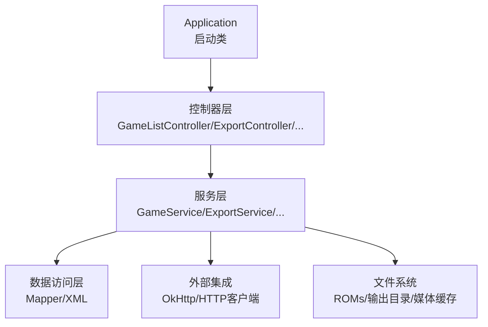
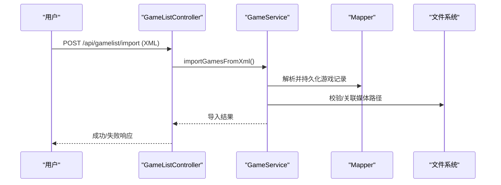
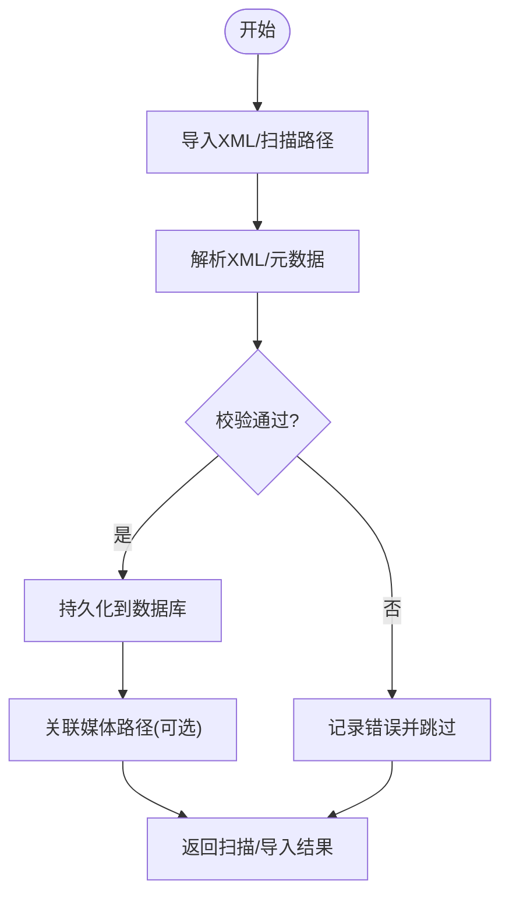
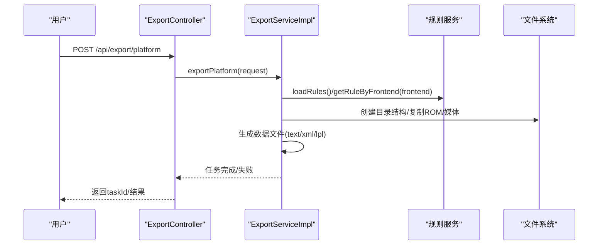
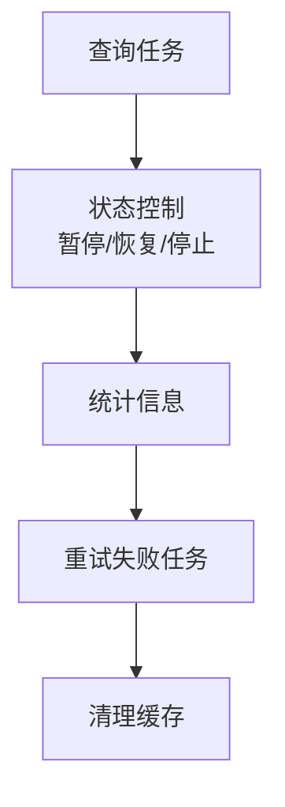
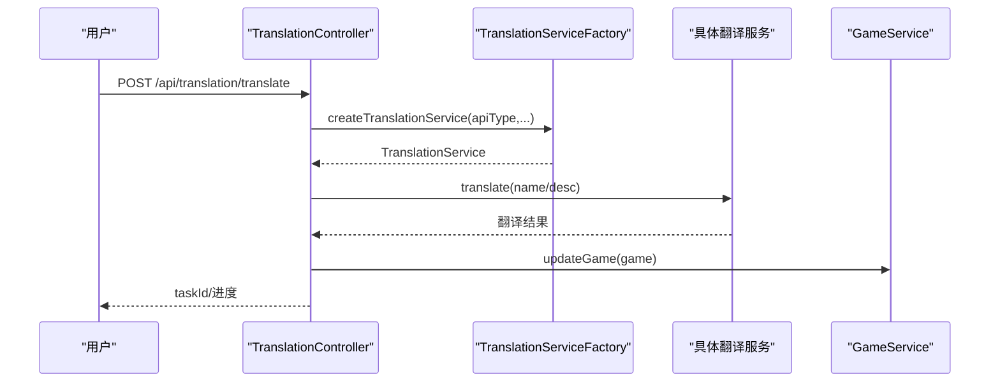
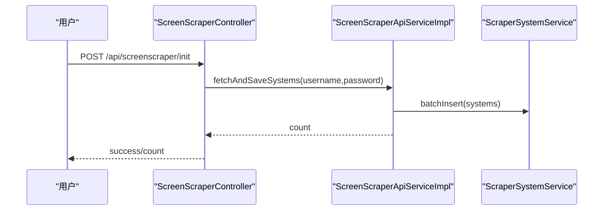
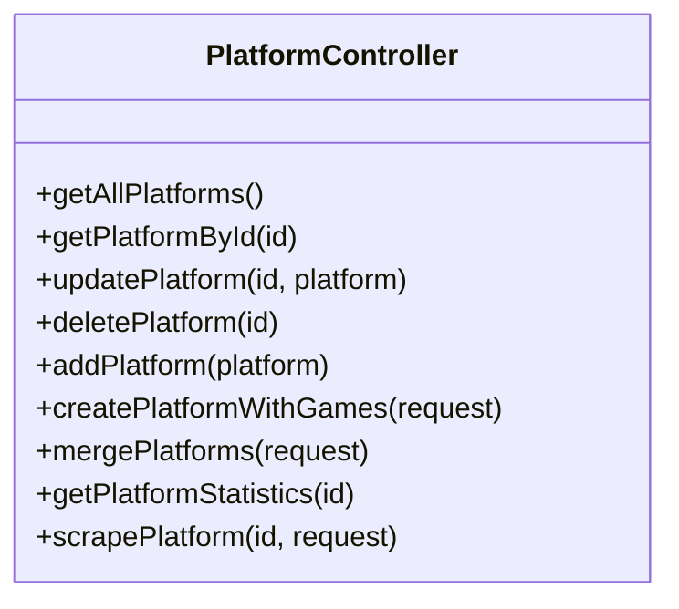
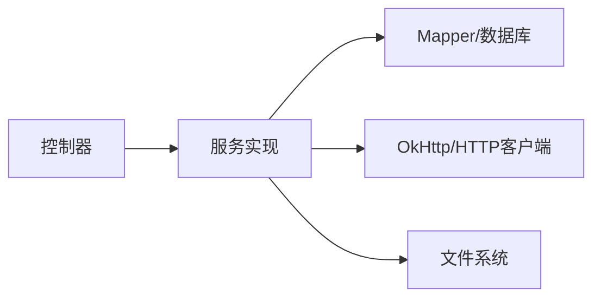

# 核心功能

<cite>
**本文引用的文件**
- [Application.java](file://src/main/java/com/gamelist/Application.java)
- [GameListController.java](file://src/main/java/com/gamelist/controller/GameListController.java)
- [GameService.java](file://src/main/java/com/gamelist/service/GameService.java)
- [ScanResult.java](file://src/main/java/com/gamelist/model/ScanResult.java)
- [ExportController.java](file://src/main/java/com/gamelist/controller/ExportController.java)
- [ExportServiceImpl.java](file://src/main/java/com/gamelist/service/impl/ExportServiceImpl.java)
- [MediaDownloadController.java](file://src/main/java/com/gamelist/controller/MediaDownloadController.java)
- [MediaController.java](file://src/main/java/com/gamelist/controller/MediaController.java)
- [TranslationController.java](file://src/main/java/com/gamelist/controller/TranslationController.java)
- [TranslationServiceFactory.java](file://src/main/java/com/gamelist/service/impl/TranslationServiceFactory.java)
- [BaiduTranslationServiceImpl.java](file://src/main/java/com/gamelist/service/impl/BaiduTranslationServiceImpl.java)
- [PlatformController.java](file://src/main/java/com/gamelist/controller/PlatformController.java)
- [ScraperController.java](file://src/main/java/com/gamelist/controller/ScraperController.java)
- [ScreenScraperController.java](file://src/main/java/com/gamelist/controller/ScreenScraperController.java)
- [ScreenScraperApiServiceImpl.java](file://src/main/java/com/gamelist/service/impl/ScreenScraperApiServiceImpl.java)
- [pom.xml](file://pom.xml)
- [README.md](file://README.md)
</cite>

## 目录
1. [简介](#简介)
2. [项目结构](#项目结构)
3. [核心组件](#核心组件)
4. [架构总览](#架构总览)
5. [详细组件分析](#详细组件分析)
6. [依赖分析](#依赖分析)
7. [性能考虑](#性能考虑)
8. [故障排查指南](#故障排查指南)
9. [结论](#结论)
10. [附录](#附录)

## 简介
本文件面向 WebGameListOper 的核心功能模块，系统化说明游戏列表管理（扫描、导入、编辑、删除）、多格式导入导出（Pegasus、RetroBat、EmuELEC、Lakka 等）、媒体资源管理（自动下载、本地缓存与批量管理）、翻译服务（百度、有道、Google、DeepSeek）、Scraper 系统（ScreenScraper API）以及平台管理（创建、编辑、数据迁移）。每个功能均提供操作步骤、配置选项与实际使用示例，帮助快速上手与排错。

## 项目结构
- 应用入口：Spring Boot 启动类启用异步任务与 MyBatis Mapper 扫描。
- 控制器层：按功能域划分（游戏列表、导出、媒体下载、翻译、平台、Scraper、ScreenScraper）。
- 服务层：实现业务逻辑（导入/导出、媒体下载、翻译、Scraper、平台管理等）。
- 模型与规则：统一的数据模型与导入/导出规则（JSON）。
- 资源与脚本：数据库迁移、静态页面、国际化资源等。

图表来源
- [Application.java:8-14](file://src/main/java/com/gamelist/Application.java#L8-L14)
- [GameListController.java:39-49](file://src/main/java/com/gamelist/controller/GameListController.java#L39-L49)
- [ExportServiceImpl.java:31-45](file://src/main/java/com/gamelist/service/impl/ExportServiceImpl.java#L31-L45)

章节来源
- [Application.java:8-14](file://src/main/java/com/gamelist/Application.java#L8-L14)
- [pom.xml:23-106](file://pom.xml#L23-L106)
- [README.md:76-92](file://README.md#L76-L92)

## 核心组件
- 游戏列表管理：支持 XML/Pegasus 元数据扫描导入、分页查询、筛选、批量更新/删除、迁移到目标平台。
- 导入导出：基于 JSON 规则的模板化导入/导出，支持 Pegasus、RetroBat、EmuELEC、Lakka 等前端。
- 媒体资源管理：后台任务队列、按平台/任务维度统计与控制（暂停/恢复/停止），本地缓存清理。
- 翻译服务：工厂模式接入 Google/百度/有道/DeepSeek，支持单条/批量/平台级翻译与进度跟踪。
- Scraper 系统：ScreenScraper 系统初始化、连接测试、媒体 URL 构建与下载。
- 平台管理：CRUD、合并、按条件创建新平台并迁移游戏、平台统计与刮削触发。

章节来源
- [GameListController.java:51-114](file://src/main/java/com/gamelist/controller/GameListController.java#L51-L114)
- [ExportController.java:25-58](file://src/main/java/com/gamelist/controller/ExportController.java#L25-L58)
- [MediaDownloadController.java:28-48](file://src/main/java/com/gamelist/controller/MediaDownloadController.java#L28-L48)
- [TranslationController.java:81-235](file://src/main/java/com/gamelist/controller/TranslationController.java#L81-L235)
- [ScreenScraperController.java:37-119](file://src/main/java/com/gamelist/controller/ScreenScraperController.java#L37-L119)
- [PlatformController.java:29-174](file://src/main/java/com/gamelist/controller/PlatformController.java#L29-L174)

## 架构总览

图表来源
- [GameListController.java:51-74](file://src/main/java/com/gamelist/controller/GameListController.java#L51-L74)
- [GameService.java:13-20](file://src/main/java/com/gamelist/service/GameService.java#L13-L20)

章节来源
- [GameListController.java:51-114](file://src/main/java/com/gamelist/controller/GameListController.java#L51-L114)
- [GameService.java:13-61](file://src/main/java/com/gamelist/service/GameService.java#L13-L61)

## 详细组件分析

### 游戏列表管理（CRUD、扫描、导入、迁移）
- 扫描与导入
  - 支持上传 XML 导入与扫描指定路径下的 gamelist.xml 或 Pegasus metadata 文件。
  - 返回结构化扫描结果（发现文件数、成功导入数、明细）。
- 查询与筛选
  - 支持分页、多条件筛选（搜索、日期范围、开发商、类型、玩家数、刮削状态、文件夹路径）。
- 编辑与删除
  - 单条/批量更新、批量删除、清空全部。
- 迁移
  - 将选中的游戏迁移至目标平台。

操作步骤
- 导入 XML：调用 /api/gamelist/import，上传 XML 文件。
- 扫描导入：POST /api/gamelist/scan 或 /api/gamelist/scan-pegasus，传入根路径与深度。
- 查询列表：GET /api/gamelist/games 或按平台 GET /api/gamelist/platforms/{id}/games，附加筛选参数。
- 更新/删除：PUT /api/gamelist/games 或 DELETE /api/gamelist/games/batch-delete。
- 迁移：PUT /api/gamelist/games/migrate，传入游戏ID列表与目标平台ID。

配置选项
- 扫描深度、是否仅元数据、线程数（由服务层控制）。
- 导入模板选择（通过模板接口获取可用模板）。

实际示例
- 扫描并导入某 ROM 目录下的所有 XML：
  - 请求体：{"path": "/data/roms", "scanDepth": 3}
  - 响应：包含 foundFiles/importedFiles/details。
- 批量迁移：
  - 请求体：{"gameIds": [1,2,3], "targetPlatformId": 10}
  - 响应：success/migratedCount。

图表来源
- [GameListController.java:51-114](file://src/main/java/com/gamelist/controller/GameListController.java#L51-L114)
- [ScanResult.java:1-66](file://src/main/java/com/gamelist/model/ScanResult.java#L1-L66)

章节来源
- [GameListController.java:51-114](file://src/main/java/com/gamelist/controller/GameListController.java#L51-L114)
- [GameService.java:13-61](file://src/main/java/com/gamelist/service/GameService.java#L13-L61)
- [ScanResult.java:1-66](file://src/main/java/com/gamelist/model/ScanResult.java#L1-L66)

### 多格式导入导出（Pegasus/RetroBat/EmuELEC/Lakka）
- 导入模板
  - 通过 /api/gamelist/import/templates 获取可用模板列表（名称、前端、版本、描述）。
- 导出流程
  - 根据前端类型加载对应导出规则，生成目录结构，复制 ROM/媒体，生成数据文件（text/xml/lpl）。
  - 支持 M3U 处理、文件名重命名模板、变量替换（平台名、文件名、扩展名等）。
- Lakka LPL
  - 若规则启用 lplExport，则生成 .lpl 播放列表，支持核心映射与行模板。

操作步骤
- 导出平台：POST /api/export/platform，传入 platformId、frontend、outputPath、threadCount、copyRoms/copyMedia/generateDataFile。
- 获取导出规则：GET /api/export/rules。

配置选项
- 线程数（默认按CPU核数设置，上限限制）。
- 是否复制 ROM/媒体、是否生成数据文件。
- 导出规则 JSON（rules/export/*.json）定义目录模板、媒体映射、数据文件格式。

实际示例
- 导出 EmuELEC 平台：
  - 请求体：{"platformId": 5, "frontend": "emuelec", "outputPath": "/data/output", "threadCount": 4, "copyRoms": true, "copyMedia": true, "generateDataFile": true}
  - 响应：success/taskId。

图表来源
- [ExportController.java:25-58](file://src/main/java/com/gamelist/controller/ExportController.java#L25-L58)
- [ExportServiceImpl.java:52-181](file://src/main/java/com/gamelist/service/impl/ExportServiceImpl.java#L52-L181)

章节来源
- [ExportController.java:25-58](file://src/main/java/com/gamelist/controller/ExportController.java#L25-L58)
- [ExportServiceImpl.java:52-181](file://src/main/java/com/gamelist/service/impl/ExportServiceImpl.java#L52-L181)

### 媒体资源管理（自动下载、本地缓存、批量管理）
- 任务管理
  - 查询/筛选/删除任务（按平台、任务ID、批量）。
  - 状态控制：暂停/恢复/停止（全局或按平台）。
  - 统计：总数、待处理、进行中、已完成、失败。
- 本地缓存
  - 提供清理媒体缓存接口，便于释放空间。

操作步骤
- 获取任务：GET /api/media-download/tasks。
- 按平台筛选：GET /api/media-download/tasks/by-platform?platformId=...。
- 暂停/恢复/停止：POST /api/media-download/pause|resume|stop。
- 清理缓存：DELETE /api/media-download/clear（注意：该端点在 MediaController 中暴露）。

实际示例
- 重试失败任务：POST /api/media-download/platforms/{platformId}/retry-failed。
- 停止所有平台下载：POST /api/media-download/platforms/stop-all。

图表来源
- [MediaDownloadController.java:28-483](file://src/main/java/com/gamelist/controller/MediaDownloadController.java#L28-L483)
- [MediaController.java:231-270](file://src/main/java/com/gamelist/controller/MediaController.java#L231-L270)

章节来源
- [MediaDownloadController.java:28-483](file://src/main/java/com/gamelist/controller/MediaDownloadController.java#L28-L483)
- [MediaController.java:231-270](file://src/main/java/com/gamelist/controller/MediaController.java#L231-L270)

### 翻译服务（百度/有道/Google/DeepSeek）
- 服务工厂
  - 根据 apiType 创建具体翻译服务（Google/百度/有道/DeepSeek）。
- 翻译能力
  - 单条/批量/平台级翻译，支持名称、描述或两者同时翻译。
  - 异步执行，维护进度与错误记录，支持创建“错误子集”平台以隔离失败条目。
- 配置
  - 在界面保存各服务的密钥（localStorage），后端按需读取并构造服务实例。

操作步骤
- 获取有效服务：GET /api/translation/services。
- 翻译平台：POST /api/translation/translate，传入 platformId、apiType、sourceLang、targetLang、translateType、apiKey/appId/appSecret。
- 批量翻译：POST /api/translation/translate/games，传入 gameIds 及翻译参数。
- 查询进度：GET /api/translation/progress/{taskId}。

实际示例
- 平台级翻译（中文→英文）：
  - 请求体：{"platformId": 5, "apiType": "google", "sourceLang": "zh", "targetLang": "en", "translateType": "both", "apiKey": "..."}
  - 响应：success/taskId/message/totalGames。

图表来源
- [TranslationController.java:81-235](file://src/main/java/com/gamelist/controller/TranslationController.java#L81-L235)
- [TranslationServiceFactory.java:5-35](file://src/main/java/com/gamelist/service/impl/TranslationServiceFactory.java#L5-L35)
- [BaiduTranslationServiceImpl.java:45-78](file://src/main/java/com/gamelist/service/impl/BaiduTranslationServiceImpl.java#L45-L78)

章节来源
- [TranslationController.java:81-235](file://src/main/java/com/gamelist/controller/TranslationController.java#L81-L235)
- [TranslationServiceFactory.java:5-35](file://src/main/java/com/gamelist/service/impl/TranslationServiceFactory.java#L5-L35)
- [BaiduTranslationServiceImpl.java:45-78](file://src/main/java/com/gamelist/service/impl/BaiduTranslationServiceImpl.java#L45-L78)

### Scraper 系统集成（ScreenScraper）
- 系统初始化
  - 拉取系统列表并保存到本地，支持游客/用户模式（凭证不同，配额不同）。
- 连接测试
  - 验证凭据与网络连通性。
- 媒体下载
  - 构建媒体 URL（封面、截图、视频等），支持区域选择与回退策略。
  - 下载媒体文件并写入本地缓存，过滤无效响应（如 NOMEDIA）。

操作步骤
- 初始化系统：POST /api/screenscraper/init。
- 连接测试：POST /api/screenscraper/test，可传 username/password。
- 启动刮削：POST /api/scraper/scrape，传入 ScraperRequest。
- 查询状态：GET /api/scraper/status。
- 下载单个游戏媒体：POST /api/scraper/downloadMedia。

实际示例
- 初始化系统（用户模式）：
  - 请求体：{"username": "...", "password": "..."}
  - 响应：success/count。

图表来源
- [ScreenScraperController.java:90-119](file://src/main/java/com/gamelist/controller/ScreenScraperController.java#L90-L119)
- [ScreenScraperApiServiceImpl.java:279-426](file://src/main/java/com/gamelist/service/impl/ScreenScraperApiServiceImpl.java#L279-L426)

章节来源
- [ScreenScraperController.java:37-119](file://src/main/java/com/gamelist/controller/ScreenScraperController.java#L37-L119)
- [ScraperController.java:30-131](file://src/main/java/com/gamelist/controller/ScraperController.java#L30-L131)
- [ScreenScraperApiServiceImpl.java:279-426](file://src/main/java/com/gamelist/service/impl/ScreenScraperApiServiceImpl.java#L279-L426)

### 平台管理（创建、编辑、数据迁移）
- CRUD
  - 获取平台列表、按 ID 获取、更新、删除。
- 高级操作
  - 按条件创建新平台并迁移游戏（create-with-games）。
  - 合并多个平台为一个新的平台（merge）。
  - 平台统计与触发刮削（scrape）。

操作步骤
- 新增平台：POST /api/platforms。
- 按条件创建并迁移：POST /api/platforms/create-with-games，传入 name 与 filter。
- 合并平台：POST /api/platforms/merge，传入 sourcePlatformIds、newPlatformName、newPlatformFolderPath、overwrite。
- 平台统计：GET /api/platforms/{id}/statistics。
- 触发刮削：POST /api/platforms/{id}/scrape，传入 systemId、region、mediaTypes。

实际示例
- 合并平台：
  - 请求体：{"sourcePlatformIds": [1,2], "newPlatformName": "合集", "newPlatformFolderPath": "/data/roms/合集", "overwrite": false}
  - 响应：success/result。

图表来源
- [PlatformController.java:29-174](file://src/main/java/com/gamelist/controller/PlatformController.java#L29-L174)

章节来源
- [PlatformController.java:29-174](file://src/main/java/com/gamelist/controller/PlatformController.java#L29-L174)

## 依赖分析
- 运行时依赖
  - Spring Boot Web、JDBC、MyBatis、H2/Flyway、OkHttp、JSON、JAXB（XML 解析）。
- 关键耦合点
  - 控制器与服务层解耦清晰；服务层通过 Mapper 访问数据；外部 HTTP 调用通过 OkHttp。
- 潜在风险
  - 大文件复制与媒体下载的并发控制需合理设置线程池大小。
  - ScreenScraper 的 SSL/TLS 兼容性与限流策略需关注。

图表来源
- [pom.xml:23-106](file://pom.xml#L23-L106)

章节来源
- [pom.xml:23-106](file://pom.xml#L23-L106)

## 性能考虑
- 导出与媒体复制
  - 使用固定线程池并行复制，线程数可按 CPU 核数动态调整，避免过大导致 I/O 瓶颈。
  - 对 M3U 与媒体文件进行预检查，减少无效 IO。
- 翻译与 Scraper
  - 异步任务+进度上报，避免阻塞主线程。
  - ScreenScraper 请求具备超时、重试与 TLS 兼容性配置，降低失败率。
- 数据库
  - 批量插入/更新，减少事务开销。
  - Flyway 管理迁移，确保一致性。

[本节为通用指导，不直接分析具体文件]

## 故障排查指南
- 导入失败
  - 检查 XML 结构与路径有效性；查看扫描结果 details 中的错误信息。
- 导出失败
  - 确认导出规则存在且 frontend 匹配；检查输出目录权限与磁盘空间。
- 媒体下载失败
  - 检查网络与代理；查看任务统计与失败原因；必要时重试失败任务或清理缓存。
- 翻译失败
  - 校验 API Key/AppId/AppSecret；查看进度中的 errors 列表定位失败条目。
- ScreenScraper 连接问题
  - 使用 /api/screenscraper/test 验证；检查用户名/密码与 TLS 协议；关注限流提示。

章节来源
- [GameListController.java:79-114](file://src/main/java/com/gamelist/controller/GameListController.java#L79-L114)
- [ExportController.java:25-58](file://src/main/java/com/gamelist/controller/ExportController.java#L25-L58)
- [MediaDownloadController.java:28-483](file://src/main/java/com/gamelist/controller/MediaDownloadController.java#L28-L483)
- [TranslationController.java:502-616](file://src/main/java/com/gamelist/controller/TranslationController.java#L502-L616)
- [ScreenScraperController.java:37-119](file://src/main/java/com/gamelist/controller/ScreenScraperController.java#L37-L119)

## 结论
WebGameListOper 提供了完整的游戏列表生命周期管理能力，覆盖从扫描导入、编辑删除到多格式导出；结合媒体资源管理与翻译服务，显著提升游戏库的丰富度与可用性；Scraper 系统与平台管理进一步打通了元数据获取与平台整合。建议在生产环境合理配置线程池、API 密钥与存储路径，并结合日志与任务监控保障稳定性。

[本节为总结，不直接分析具体文件]

## 附录
- 部署与访问
  - Docker/JAR 部署方式与端口映射参考 README。
- 常用接口速查
  - 游戏列表：/api/gamelist/*
  - 导出：/api/export/*
  - 媒体下载：/api/media-download/*
  - 翻译：/api/translation/*
  - Scraper：/api/scraper/*、/api/screenscraper/*
  - 平台：/api/platforms/*

章节来源
- [README.md:93-149](file://README.md#L93-L149)
- [README.md:170-226](file://README.md#L170-L226)