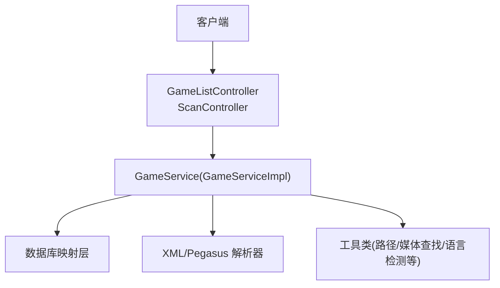
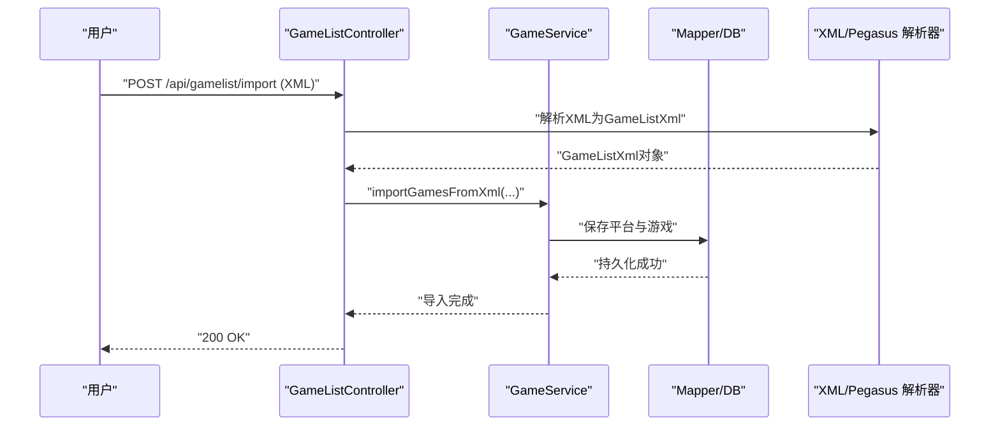
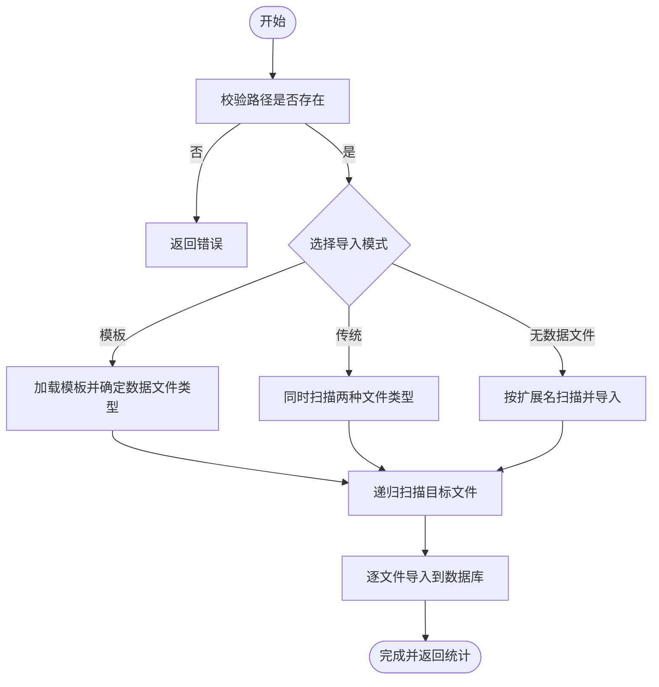
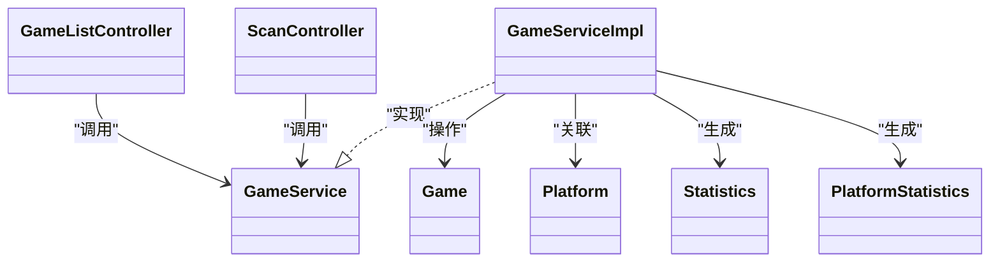

# 游戏列表管理

<cite>
**本文引用的文件**
- [GameListController.java](file://src/main/java/com/gamelist/controller/GameListController.java)
- [ScanController.java](file://src/main/java/com/gamelist/controller/ScanController.java)
- [GameService.java](file://src/main/java/com/gamelist/service/GameService.java)
- [GameServiceImpl.java](file://src/main/java/com/gamelist/service/impl/GameServiceImpl.java)
- [Game.java](file://src/main/java/com/gamelist/model/Game.java)
- [Platform.java](file://src/main/java/com/gamelist/model/Platform.java)
- [Statistics.java](file://src/main/java/com/gamelist/model/Statistics.java)
- [PlatformStatistics.java](file://src/main/java/com/gamelist/model/PlatformStatistics.java)
- [ImportStatistics.java](file://src/main/java/com/gamelist/model/ImportStatistics.java)
- [ScanResult.java](file://src/main/java/com/gamelist/model/ScanResult.java)
- [MergeOperation.java](file://src/main/java/com/gamelist/model/MergeOperation.java)
</cite>

## 目录
1. [简介](#简介)
2. [项目结构](#项目结构)
3. [核心组件](#核心组件)
4. [架构总览](#架构总览)
5. [详细组件分析](#详细组件分析)
6. [依赖关系分析](#依赖关系分析)
7. [性能考虑](#性能考虑)
8. [故障排查指南](#故障排查指南)
9. [结论](#结论)
10. [附录：API 接口说明](#附录api-接口说明)

## 简介
本章节面向“游戏列表管理”功能，覆盖游戏的增删改查、扫描与导入（XML 与 Pegasus 元数据）、多条件筛选与搜索、分页查询、统计信息获取、游戏迁移与合盘等高级能力。文档提供完整的 API 接口说明、请求参数示例与响应格式，并给出实际使用场景的最佳实践建议。

## 项目结构
围绕游戏列表管理的核心代码主要分布在以下位置：
- 控制器层：负责接收 HTTP 请求、参数校验、调用服务层并返回统一响应
- 服务层：封装业务逻辑（CRUD、扫描导入、筛选统计、迁移合盘）
- 模型层：定义数据载体（Game、平台、统计、扫描结果、导入统计等）
- XML/解析工具：用于解析 gamelist.xml 与 Pegasus 元数据

图表来源
- [GameListController.java:39-551](file://src/main/java/com/gamelist/controller/GameListController.java#L39-L551)
- [ScanController.java:26-579](file://src/main/java/com/gamelist/controller/ScanController.java#L26-L579)
- [GameService.java:13-61](file://src/main/java/com/gamelist/service/GameService.java#L13-L61)
- [GameServiceImpl.java:46-114](file://src/main/java/com/gamelist/service/impl/GameServiceImpl.java#L46-L114)

章节来源
- [GameListController.java:39-551](file://src/main/java/com/gamelist/controller/GameListController.java#L39-L551)
- [ScanController.java:26-579](file://src/main/java/com/gamelist/controller/ScanController.java#L26-L579)
- [GameService.java:13-61](file://src/main/java/com/gamelist/service/GameService.java#L13-L61)

## 核心组件
- GameListController：暴露游戏列表的 CRUD、筛选、统计、迁移、合盘、模板导入等 REST 接口
- ScanController：提供文件系统扫描与异步导入任务，支持 gamelist.xml、metadata.pegasus.txt、.lpl 等多种数据源
- GameService/GameServiceImpl：实现具体业务逻辑，包括导入、查询、更新、删除、统计、迁移、合盘等
- 数据模型：Game、Platform、Statistics、PlatformStatistics、ImportStatistics、ScanResult、MergeOperation

章节来源
- [GameListController.java:39-551](file://src/main/java/com/gamelist/controller/GameListController.java#L39-L551)
- [ScanController.java:26-579](file://src/main/java/com/gamelist/controller/ScanController.java#L26-L579)
- [GameService.java:13-61](file://src/main/java/com/gamelist/service/GameService.java#L13-L61)
- [Game.java:5-650](file://src/main/java/com/gamelist/model/Game.java#L5-L650)
- [Platform.java:3-141](file://src/main/java/com/gamelist/model/Platform.java#L3-L141)
- [Statistics.java:3-41](file://src/main/java/com/gamelist/model/Statistics.java#L3-L41)
- [PlatformStatistics.java:3-55](file://src/main/java/com/gamelist/model/PlatformStatistics.java#L3-L55)
- [ImportStatistics.java:3-44](file://src/main/java/com/gamelist/model/ImportStatistics.java#L3-L44)
- [ScanResult.java:5-93](file://src/main/java/com/gamelist/model/ScanResult.java#L5-L93)
- [MergeOperation.java:3-68](file://src/main/java/com/gamelist/model/MergeOperation.java#L3-L68)

## 架构总览
系统采用典型的 MVC 分层：
- 控制器层：处理 HTTP 请求与响应，进行基础参数校验与异常包装
- 服务层：聚合业务规则，协调解析器、Mapper、工具类等完成复杂流程
- 数据访问层：通过 Mapper 与数据库交互
- 外部集成：XML/Pegasus 解析器、Scraper 系统等

图表来源
- [GameListController.java:51-74](file://src/main/java/com/gamelist/controller/GameListController.java#L51-L74)
- [GameServiceImpl.java:116-200](file://src/main/java/com/gamelist/service/impl/GameServiceImpl.java#L116-L200)

## 详细组件分析

### 游戏 CRUD 操作
- 新增游戏
  - 接口：POST /api/gamelist/games
  - 请求体：Game 对象
  - 响应：成功时返回文本提示；失败返回错误信息
  - 行为：调用服务层保存单个游戏记录

- 查询游戏
  - 接口：GET /api/gamelist/games
  - 查询参数：page、pageSize、search、startDate、endDate、developers、genres、players、scrapeStatuses、folderPath
  - 响应：包含 games、totalPages、totalElements
  - 行为：按条件查询后在内存中分页（适用于中小规模数据集）

- 更新游戏
  - 接口：PUT /api/gamelist/games
  - 请求体：Game 对象（至少包含 id）
  - 响应：成功或失败提示

- 批量更新
  - 接口：PUT /api/gamelist/games/batch
  - 请求体：{ gameIds, updates }
  - 响应：{ success, updatedCount, message }

- 删除游戏
  - 接口：DELETE /api/gamelist/games
  - 作用：清空所有游戏记录
  - 批量删除：DELETE /api/gamelist/games/batch-delete，请求体 { gameIds }

章节来源
- [GameListController.java:462-480](file://src/main/java/com/gamelist/controller/GameListController.java#L462-L480)
- [GameListController.java:125-160](file://src/main/java/com/gamelist/controller/GameListController.java#L125-L160)
- [GameListController.java:268-286](file://src/main/java/com/gamelist/controller/GameListController.java#L268-L286)
- [GameListController.java:288-341](file://src/main/java/com/gamelist/controller/GameListController.java#L288-L341)
- [GameListController.java:482-507](file://src/main/java/com/gamelist/controller/GameListController.java#L482-L507)

### 扫描与导入（XML 与 Pegasus 元数据）
- 扫描并导入 XML
  - 接口：POST /api/gamelist/scan
  - 请求体：ScanRequest（path、scanDepth）
  - 响应：ScanResult（success、message、foundFiles、importedFiles、details）

- 扫描并导入 Pegasus 元数据
  - 接口：POST /api/gamelist/scan-pegasus
  - 请求体：ScanRequest（path、scanDepth）
  - 响应：ScanResult

- 更灵活的扫描与导入（支持模板、扩展名过滤、无数据文件模式）
  - 接口：POST /api/scan/scan（仅扫描）
  - 接口：POST /api/scan/import（异步导入，支持多种数据源与线程数配置）
  - 支持的数据源：gamelist.xml、metadata.pegasus.txt、.lpl
  - 支持模板导入：根据模板指定数据文件类型与字段映射

图表来源
- [ScanController.java:170-239](file://src/main/java/com/gamelist/controller/ScanController.java#L170-L239)
- [ScanController.java:273-410](file://src/main/java/com/gamelist/controller/ScanController.java#L273-L410)
- [GameServiceImpl.java:116-200](file://src/main/java/com/gamelist/service/impl/GameServiceImpl.java#L116-L200)

章节来源
- [GameListController.java:51-114](file://src/main/java/com/gamelist/controller/GameListController.java#L51-L114)
- [ScanController.java:170-410](file://src/main/java/com/gamelist/controller/ScanController.java#L170-L410)
- [GameService.java:14-37](file://src/main/java/com/gamelist/service/GameService.java#L14-L37)

### 筛选与搜索
- 按平台查询并分页
  - 接口：GET /api/gamelist/platforms/{platformId}/games
  - 查询参数：page、pageSize、search、startDate、endDate、developers、genres、players、scrapeStatuses、fileStatuses、folderPath
  - 响应：{ games, totalPages, totalElements }

- 按刮削状态查询
  - 接口：GET /api/gamelist/games/by-status
  - 查询参数：platformId、status、page、size

- 条件计数与唯一值
  - 接口：POST /api/gamelist/games/filter
  - 请求体：filterParams（Map），返回 count
  - 接口：GET /api/gamelist/games/unique-values
  - 响应：返回开发商、发行商、类型、玩家数量等唯一值集合

章节来源
- [GameListController.java:162-199](file://src/main/java/com/gamelist/controller/GameListController.java#L162-L199)
- [GameListController.java:249-266](file://src/main/java/com/gamelist/controller/GameListController.java#L249-L266)
- [GameListController.java:416-446](file://src/main/java/com/gamelist/controller/GameListController.java#L416-L446)

### 统计信息
- 总体统计
  - 接口：GET /api/gamelist/statistics/overall
  - 响应：Statistics（totalGames、fullyScraped、partiallyScraped、notScraped、totalPlatforms）

- 各平台统计
  - 接口：GET /api/gamelist/statistics/platforms
  - 响应：List<PlatformStatistics>（每个平台的总数、已刮削、部分刮削、未刮削、缺失游戏数）

章节来源
- [GameListController.java:219-247](file://src/main/java/com/gamelist/controller/GameListController.java#L219-L247)
- [Statistics.java:3-41](file://src/main/java/com/gamelist/model/Statistics.java#L3-L41)
- [PlatformStatistics.java:3-55](file://src/main/java/com/gamelist/model/PlatformStatistics.java#L3-L55)

### 游戏迁移与合盘
- 迁移游戏到目标平台
  - 接口：PUT /api/gamelist/games/migrate
  - 请求体：{ gameIds, targetPlatformId }
  - 响应：{ success, migratedCount, message }

- 合盘操作
  - 接口：POST /api/gamelist/merge-discs
  - 请求体：{ gameIds }
  - 响应：合并结果（成功或错误信息）

章节来源
- [GameListController.java:343-413](file://src/main/java/com/gamelist/controller/GameListController.java#L343-L413)
- [GameListController.java:448-460](file://src/main/java/com/gamelist/controller/GameListController.java#L448-L460)
- [MergeOperation.java:3-68](file://src/main/java/com/gamelist/model/MergeOperation.java#L3-L68)

### 导入模板与元数据
- 获取导入模板列表
  - 接口：GET /api/gamelist/import/templates
  - 响应：模板清单（文件名、名称、前端、版本、描述）

- 模板驱动导入
  - 在扫描与导入过程中，可通过模板指定数据文件类型与字段映射，提高导入准确性与效率

章节来源
- [GameListController.java:509-549](file://src/main/java/com/gamelist/controller/GameListController.java#L509-L549)
- [ScanController.java:190-212](file://src/main/java/com/gamelist/controller/ScanController.java#L190-L212)

## 依赖关系分析
- 控制器依赖服务：GameListController 与 ScanController 均注入 GameService
- 服务依赖 Mapper 与工具：GameServiceImpl 注入 GameMapper、PlatformMapper、PlatformService、ScraperSystemService 等
- 模型间关系：Game 关联 Platform（platformId），统计模型用于汇总展示

图表来源
- [GameListController.java:39-551](file://src/main/java/com/gamelist/controller/GameListController.java#L39-L551)
- [ScanController.java:26-579](file://src/main/java/com/gamelist/controller/ScanController.java#L26-L579)
- [GameService.java:13-61](file://src/main/java/com/gamelist/service/GameService.java#L13-L61)
- [GameServiceImpl.java:46-114](file://src/main/java/com/gamelist/service/impl/GameServiceImpl.java#L46-L114)
- [Game.java:5-650](file://src/main/java/com/gamelist/model/Game.java#L5-L650)
- [Platform.java:3-141](file://src/main/java/com/gamelist/model/Platform.java#L3-L141)
- [Statistics.java:3-41](file://src/main/java/com/gamelist/model/Statistics.java#L3-L41)
- [PlatformStatistics.java:3-55](file://src/main/java/com/gamelist/model/PlatformStatistics.java#L3-L55)

章节来源
- [GameListController.java:39-551](file://src/main/java/com/gamelist/controller/GameListController.java#L39-L551)
- [ScanController.java:26-579](file://src/main/java/com/gamelist/controller/ScanController.java#L26-L579)
- [GameService.java:13-61](file://src/main/java/com/gamelist/service/GameService.java#L13-L61)
- [GameServiceImpl.java:46-114](file://src/main/java/com/gamelist/service/impl/GameServiceImpl.java#L46-L114)

## 性能考虑
- 分页策略：当前列表接口在内存中进行分页，适合中小规模数据；当数据量较大时，建议在数据库层实现分页以减少内存占用
- 并发导入：扫描与导入支持多线程配置，合理设置线程数可提升导入吞吐
- 模板导入：通过模板限定数据文件类型与字段映射，减少无效扫描与解析开销
- 统计查询：总体与平台统计通过服务层聚合，注意避免全表扫描导致的延迟

[本节为通用指导，不直接分析具体文件]

## 故障排查指南
- 导入失败
  - 检查 XML/Pegasus 文件格式是否符合预期
  - 查看导入日志中的详细错误信息（服务层会记录异常堆栈）
  - 确认路径存在且具备读取权限

- 扫描结果为空
  - 确认路径正确且为目录
  - 若使用模板模式，检查模板是否指定了正确的数据文件类型
  - 若无数据文件模式，确认扩展名匹配规则

- 分页与筛选异常
  - 检查查询参数是否正确传递
  - 对于内存分页，关注 totalElements 与实际返回条数的一致性

章节来源
- [GameListController.java:51-114](file://src/main/java/com/gamelist/controller/GameListController.java#L51-L114)
- [ScanController.java:170-239](file://src/main/java/com/gamelist/controller/ScanController.java#L170-L239)
- [GameServiceImpl.java:116-200](file://src/main/java/com/gamelist/service/impl/GameServiceImpl.java#L116-L200)

## 结论
游戏列表管理模块提供了完善的 CRUD、扫描导入、筛选搜索、统计、迁移与合盘能力。通过模板化导入与多线程扫描，能够高效处理大规模游戏库。建议在生产环境中结合数据库分页与合理的线程配置，以获得更好的性能与稳定性。

[本节为总结性内容，不直接分析具体文件]

## 附录：API 接口说明

### 游戏列表与平台
- GET /api/gamelist/platforms
  - 描述：获取所有平台
  - 响应：List<Platform>

- GET /api/gamelist/games
  - 描述：获取所有游戏（支持分页与多条件筛选）
  - 查询参数：page、pageSize、search、startDate、endDate、developers、genres、players、scrapeStatuses、folderPath
  - 响应：{ games, totalPages, totalElements }

- GET /api/gamelist/platforms/{platformId}/games
  - 描述：按平台获取游戏（支持分页与多条件筛选）
  - 查询参数：page、pageSize、search、startDate、endDate、developers、genres、players、scrapeStatuses、fileStatuses、folderPath
  - 响应：{ games, totalPages, totalElements }

- GET /api/gamelist/games/{gameId}
  - 描述：获取单个游戏详情
  - 响应：Game

章节来源
- [GameListController.java:116-123](file://src/main/java/com/gamelist/controller/GameListController.java#L116-L123)
- [GameListController.java:125-160](file://src/main/java/com/gamelist/controller/GameListController.java#L125-L160)
- [GameListController.java:162-199](file://src/main/java/com/gamelist/controller/GameListController.java#L162-L199)
- [GameListController.java:201-208](file://src/main/java/com/gamelist/controller/GameListController.java#L201-L208)

### 导入与扫描
- POST /api/gamelist/import
  - 描述：导入游戏列表 XML 文件
  - 请求：multipart/form-data，字段 file
  - 响应：文本消息

- POST /api/gamelist/scan
  - 描述：扫描并导入 XML
  - 请求体：ScanRequest（path、scanDepth）
  - 响应：ScanResult

- POST /api/gamelist/scan-pegasus
  - 描述：扫描并导入 Pegasus 元数据
  - 请求体：ScanRequest（path、scanDepth）
  - 响应：ScanResult

- POST /api/scan/scan
  - 描述：仅扫描文件系统，返回找到的元数据文件列表
  - 请求体：ScanRequest（path、depth、importMethod、importTemplate、noDataFile、fileExtensions、scraperSystemId）
  - 响应：ScanResult

- POST /api/scan/import
  - 描述：异步导入多个文件（支持 XML、Pegasus、.lpl）
  - 请求体：ImportRequest（files、type、metadataOnly、threadCount、importMethod、importTemplate、scanPath、noDataFile、fileExtensions、scraperSystemId）
  - 响应：BackgroundTask（任务ID，用于后续查询进度与结果）

章节来源
- [GameListController.java:51-114](file://src/main/java/com/gamelist/controller/GameListController.java#L51-L114)
- [ScanController.java:170-239](file://src/main/java/com/gamelist/controller/ScanController.java#L170-L239)
- [ScanController.java:241-410](file://src/main/java/com/gamelist/controller/ScanController.java#L241-L410)

### 筛选与统计
- POST /api/gamelist/games/filter
  - 描述：按条件筛选并返回计数
  - 请求体：Map<String, Object> filterParams
  - 响应：{ count }

- GET /api/gamelist/games/unique-values
  - 描述：获取唯一值（开发商、发行商、类型、玩家数量）
  - 响应：Map<String, List<String>>

- GET /api/gamelist/statistics/overall
  - 描述：总体统计
  - 响应：Statistics

- GET /api/gamelist/statistics/platforms
  - 描述：各平台统计
  - 响应：List<PlatformStatistics>

章节来源
- [GameListController.java:416-446](file://src/main/java/com/gamelist/controller/GameListController.java#L416-L446)
- [GameListController.java:219-247](file://src/main/java/com/gamelist/controller/GameListController.java#L219-L247)

### 迁移与合盘
- PUT /api/gamelist/games/migrate
  - 描述：迁移游戏到目标平台
  - 请求体：{ gameIds, targetPlatformId }
  - 响应：{ success, migratedCount, message }

- POST /api/gamelist/merge-discs
  - 描述：合盘操作
  - 请求体：{ gameIds }
  - 响应：合并结果

章节来源
- [GameListController.java:343-413](file://src/main/java/com/gamelist/controller/GameListController.java#L343-L413)
- [GameListController.java:448-460](file://src/main/java/com/gamelist/controller/GameListController.java#L448-L460)

### 模板与导入模板
- GET /api/gamelist/import/templates
  - 描述：获取导入模板列表
  - 响应：List<Map<String, Object>>（fileName、name、frontend、version、description）

章节来源
- [GameListController.java:509-549](file://src/main/java/com/gamelist/controller/GameListController.java#L509-L549)