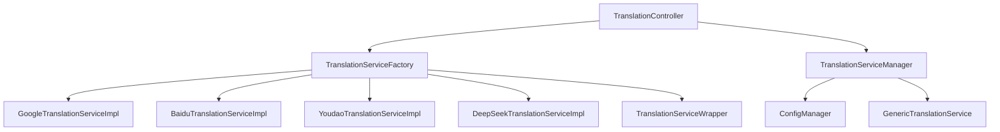
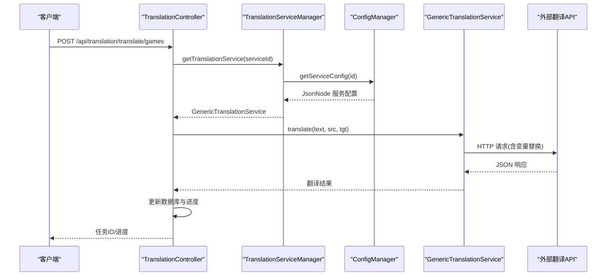
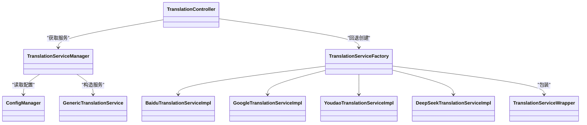
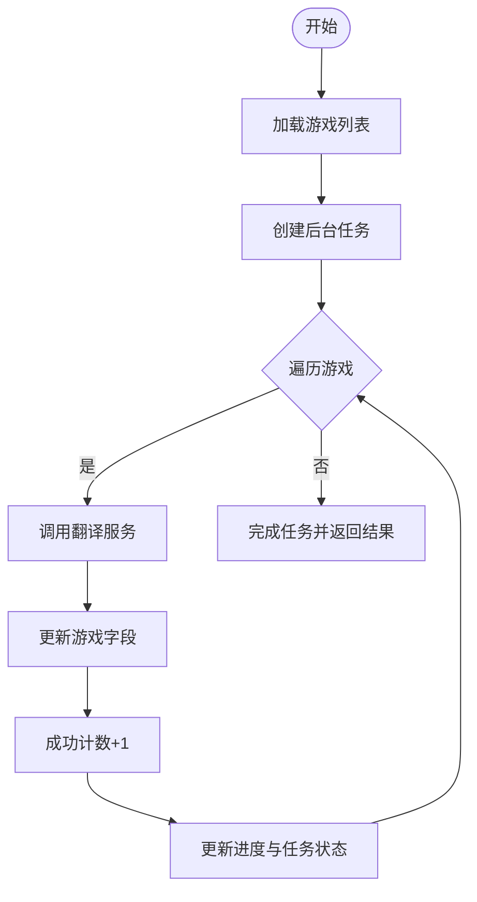

# 翻译服务

<cite>
**本文引用的文件**
- [TranslationService.java](file://src/main/java/com/gamelist/service/TranslationService.java)
- [TranslationServiceFactory.java](file://src/main/java/com/gamelist/service/impl/TranslationServiceFactory.java)
- [TranslationServiceManager.java](file://src/main/java/com/gamelist/service/impl/TranslationServiceManager.java)
- [GenericTranslationService.java](file://src/main/java/com/gamelist/service/impl/GenericTranslationService.java)
- [ConfigManager.java](file://src/main/java/com/gamelist/service/impl/ConfigManager.java)
- [TranslationController.java](file://src/main/java/com/gamelist/controller/TranslationController.java)
- [BaiduTranslationServiceImpl.java](file://src/main/java/com/gamelist/service/impl/BaiduTranslationServiceImpl.java)
- [GoogleTranslationServiceImpl.java](file://src/main/java/com/gamelist/service/impl/GoogleTranslationServiceImpl.java)
- [YoudaoTranslationServiceImpl.java](file://src/main/java/com/gamelist/service/impl/YoudaoTranslationServiceImpl.java)
- [DeepSeekTranslationServiceImpl.java](file://src/main/java/com/gamelist/service/impl/DeepSeekTranslationServiceImpl.java)
- [TranslationServiceWrapper.java](file://src/main/java/com/gamelist/service/impl/TranslationServiceWrapper.java)
- [translation-config.json](file://rules/translation-config.json)
</cite>

## 目录
1. [简介](#简介)
2. [项目结构](#项目结构)
3. [核心组件](#核心组件)
4. [架构总览](#架构总览)
5. [详细组件分析](#详细组件分析)
6. [依赖关系分析](#依赖关系分析)
7. [性能与并发](#性能与并发)
8. [配置指南](#配置指南)
9. [API 接口文档](#api-接口文档)
10. [批量翻译实现原理](#批量翻译实现原理)
11. [质量优化与最佳实践](#质量优化与最佳实践)
12. [故障排除指南](#故障排除指南)
13. [扩展自定义翻译服务](#扩展自定义翻译服务)
14. [结论](#结论)

## 简介
本模块为游戏列表管理应用提供统一的翻译能力，支持多种翻译 API 提供商（百度翻译、有道翻译、Google 翻译、DeepSeek 翻译），并通过工厂模式与服务管理器实现服务选择、配置管理与可扩展的接入机制。同时提供批量翻译功能，支持对平台下所有游戏或指定游戏集合进行名称与描述的翻译，具备进度跟踪与错误记录能力。

## 项目结构
翻译相关代码主要分布在 service 层与 controller 层：
- 接口与异常定义：service 包下的 TranslationService 接口与 TranslationException 异常
- 具体实现：service.impl 包下的各翻译服务实现类与通用实现 GenericTranslationService
- 服务工厂与管理器：TranslationServiceFactory、TranslationServiceManager、ConfigManager
- 控制器：TranslationController 暴露 REST API 用于触发翻译任务、查询进度等
- 配置文件：rules/translation-config.json 声明可配置的翻译服务、请求体模板、响应路径与变量

图表来源
- [TranslationController.java:30-643](file://src/main/java/com/gamelist/controller/TranslationController.java#L30-L643)
- [TranslationServiceFactory.java:5-45](file://src/main/java/com/gamelist/service/impl/TranslationServiceFactory.java#L5-L45)
- [TranslationServiceManager.java:11-110](file://src/main/java/com/gamelist/service/impl/TranslationServiceManager.java#L11-L110)
- [GenericTranslationService.java:21-443](file://src/main/java/com/gamelist/service/impl/GenericTranslationService.java#L21-L443)
- [ConfigManager.java:13-197](file://src/main/java/com/gamelist/service/impl/ConfigManager.java#L13-L197)

章节来源
- [TranslationController.java:30-643](file://src/main/java/com/gamelist/controller/TranslationController.java#L30-L643)
- [TranslationServiceFactory.java:5-45](file://src/main/java/com/gamelist/service/impl/TranslationServiceFactory.java#L5-L45)
- [TranslationServiceManager.java:11-110](file://src/main/java/com/gamelist/service/impl/TranslationServiceManager.java#L11-L110)
- [GenericTranslationService.java:21-443](file://src/main/java/com/gamelist/service/impl/GenericTranslationService.java#L21-L443)
- [ConfigManager.java:13-197](file://src/main/java/com/gamelist/service/impl/ConfigManager.java#L13-L197)

## 核心组件
- 翻译接口与结果模型：统一 translate 与 translateGame 方法，返回 TranslationResult
- 工厂模式：根据 serviceType 创建具体翻译服务实例，并包装为带容错的 Wrapper
- 服务管理器：从配置加载服务定义，缓存服务实例，校验必填变量，支持热重载
- 通用翻译服务：基于 JSON 配置驱动 HTTP 调用，支持变量替换、参数拼接、响应路径提取与解析器
- 控制器：提供翻译任务的启动、进度查询、错误子集导出等 REST 接口

章节来源
- [TranslationService.java:3-32](file://src/main/java/com/gamelist/service/TranslationService.java#L3-L32)
- [TranslationServiceFactory.java:5-45](file://src/main/java/com/gamelist/service/impl/TranslationServiceFactory.java#L5-L45)
- [TranslationServiceManager.java:11-110](file://src/main/java/com/gamelist/service/impl/TranslationServiceManager.java#L11-L110)
- [GenericTranslationService.java:21-443](file://src/main/java/com/gamelist/service/impl/GenericTranslationService.java#L21-L443)
- [TranslationController.java:30-643](file://src/main/java/com/gamelist/controller/TranslationController.java#L30-L643)

## 架构总览
系统采用“配置驱动 + 工厂 + 管理器”的分层设计：
- 配置层：ConfigManager 读取 rules/translation-config.json，维护 variables 与 services 列表
- 服务层：TranslationServiceManager 根据 serviceId 获取或创建 GenericTranslationService；旧式实现通过 TranslationServiceFactory 创建具体实现
- 控制层：TranslationController 接收请求，创建任务，异步执行翻译，更新进度与错误信息

图表来源
- [TranslationController.java:307-480](file://src/main/java/com/gamelist/controller/TranslationController.java#L307-L480)
- [TranslationServiceManager.java:28-41](file://src/main/java/com/gamelist/service/impl/TranslationServiceManager.java#L28-L41)
- [ConfigManager.java:174-197](file://src/main/java/com/gamelist/service/impl/ConfigManager.java#L174-L197)
- [GenericTranslationService.java:203-244](file://src/main/java/com/gamelist/service/impl/GenericTranslationService.java#L203-L244)

## 详细组件分析

### 翻译接口与结果模型
- 接口方法：
  - translate(text, sourceLang, targetLang)：单文本翻译
  - translateGame(gameName, gameDescription, sourceLang, targetLang)：批量字段翻译，默认分别调用 translate
- 结果模型：TranslationResult 包含 translatedName 与 translatedDescription

章节来源
- [TranslationService.java:3-32](file://src/main/java/com/gamelist/service/TranslationService.java#L3-L32)

### 工厂模式与服务选择
- 工厂方法 createTranslationService(serviceType, params...)：
  - google：需要 apiKey
  - baidu：需要 appId, appKey
  - youdao：需要 appKey, appSecret
  - deepseek：需要 apiKey
- 返回对象经 TranslationServiceWrapper 包装，增强错误处理与无效结果过滤

章节来源
- [TranslationServiceFactory.java:5-45](file://src/main/java/com/gamelist/service/impl/TranslationServiceFactory.java#L5-L45)
- [TranslationServiceWrapper.java:6-71](file://src/main/java/com/gamelist/service/impl/TranslationServiceWrapper.java#L6-L71)

### 服务管理器与配置管理
- TranslationServiceManager：
  - 单例管理，内部缓存服务实例
  - getTranslationService(serviceId)：从 ConfigManager 加载配置并构造 GenericTranslationService
  - getValidServices()：列出已配置且满足 requiredVariables 的服务
  - validateService(serviceId)：校验服务是否有效
  - reloadServices()：重新加载配置并清空缓存
- ConfigManager：
  - 加载 rules/translation-config.json
  - 维护 variables 映射，供服务配置中的 ${var} 替换
  - getServiceConfig(id)、getDefaultService() 提供配置访问

章节来源
- [TranslationServiceManager.java:11-110](file://src/main/java/com/gamelist/service/impl/TranslationServiceManager.java#L11-L110)
- [ConfigManager.java:13-197](file://src/main/java/com/gamelist/service/impl/ConfigManager.java#L13-L197)

### 通用翻译服务（配置驱动）
- 支持：
  - URL 与请求头中的变量替换（包括 ${var} 与 {text}/{sourceLang}/{targetLang}）
  - 查询参数拼接（params）
  - 请求体构建（object/array/string）
  - 响应路径提取（responsePath）
  - 响应解析器（responseParser）：如 microsoftGameNameDescription、gameNameDescription
- 超时设置：连接 30s，读写 60s/30s
- 日志输出：打印请求与响应便于调试

章节来源
- [GenericTranslationService.java:21-443](file://src/main/java/com/gamelist/service/impl/GenericTranslationService.java#L21-L443)

### 各翻译 API 实现要点
- Google 翻译：
  - 使用 translation.googleapis.com/language/translate/v2
  - 请求体包含 q、target、可选 source，key 作为查询参数
  - 响应 data.translations[0].translatedText
- 百度翻译：
  - 使用 fanyi-api.baidu.com/api/trans/vip/translate
  - 生成随机 salt 与 MD5 签名 sign，GET 请求携带 q/from/to/appid/salt/sign
  - 响应 trans_result[0].dst
- 有道翻译：
  - 使用 openapi.youdao.com/api
  - FormBody 提交 q/from/to/appKey/salt/sign/signType=v3
  - 签名使用 SHA-256，并对长文本做截断
  - 响应 errorCode=0 时取 translation[0]
- DeepSeek 翻译：
  - 使用 api.deepseek.com/chat/completions
  - 请求体包含 model、messages（system+user）、temperature、max_tokens
  - 响应 choices[0].message.content

章节来源
- [GoogleTranslationServiceImpl.java:10-59](file://src/main/java/com/gamelist/service/impl/GoogleTranslationServiceImpl.java#L10-L59)
- [BaiduTranslationServiceImpl.java:14-100](file://src/main/java/com/gamelist/service/impl/BaiduTranslationServiceImpl.java#L14-L100)
- [YoudaoTranslationServiceImpl.java:13-94](file://src/main/java/com/gamelist/service/impl/YoudaoTranslationServiceImpl.java#L13-L94)
- [DeepSeekTranslationServiceImpl.java:17-118](file://src/main/java/com/gamelist/service/impl/DeepSeekTranslationServiceImpl.java#L17-L118)

## 依赖关系分析
- 控制器依赖：
  - GameService/PlatformService：获取平台与游戏数据
  - TaskService：创建与更新后台任务进度
  - TranslationServiceManager/Factory：创建翻译服务
- 服务层依赖：
  - OkHttp：HTTP 客户端
  - Jackson：JSON 解析与序列化
  - 各第三方 API：Google/Baidu/Youdao/DeepSeek
- 配置依赖：
  - rules/translation-config.json：服务定义、变量、默认服务

图表来源
- [TranslationController.java:30-643](file://src/main/java/com/gamelist/controller/TranslationController.java#L30-L643)
- [TranslationServiceManager.java:11-110](file://src/main/java/com/gamelist/service/impl/TranslationServiceManager.java#L11-L110)
- [ConfigManager.java:13-197](file://src/main/java/com/gamelist/service/impl/ConfigManager.java#L13-L197)
- [TranslationServiceFactory.java:5-45](file://src/main/java/com/gamelist/service/impl/TranslationServiceFactory.java#L5-L45)

章节来源
- [TranslationController.java:30-643](file://src/main/java/com/gamelist/controller/TranslationController.java#L30-L643)
- [TranslationServiceManager.java:11-110](file://src/main/java/com/gamelist/service/impl/TranslationServiceManager.java#L11-L110)
- [ConfigManager.java:13-197](file://src/main/java/com/gamelist/service/impl/ConfigManager.java#L13-L197)
- [TranslationServiceFactory.java:5-45](file://src/main/java/com/gamelist/service/impl/TranslationServiceFactory.java#L5-L45)

## 性能与并发
- 当前批量翻译在控制器中使用新 Thread 串行遍历游戏列表进行翻译与更新，未使用线程池或并发限制
- 建议：
  - 引入线程池与限流（如 RateLimitCounter）避免对第三方 API 的请求风暴
  - 增加重试与退避策略，提高稳定性
  - 将进度更新与错误收集改为原子操作或加锁保护（已有 synchronized 局部保护）
  - 对大文本进行分片或压缩以减少网络开销

章节来源
- [TranslationController.java:139-221](file://src/main/java/com/gamelist/controller/TranslationController.java#L139-L221)
- [TranslationController.java:384-466](file://src/main/java/com/gamelist/controller/TranslationController.java#L384-L466)

## 配置指南
- 配置文件位置：rules/translation-config.json
- 关键结构：
  - variables：全局变量，如 google_api_key、microsoft_api_key、microsoft_region、deepseek_api_key
  - translation.services：服务数组，每个服务包含 id/name/type/url/method/headers/requestBody/params/responsePath/responseParser/validation
  - translation.defaultService：默认服务 ID
- 变量替换：
  - 请求头与请求体中可使用 ${google_api_key} 等形式引用 variables
  - 内置变量：{text}、{sourceLang}、{targetLang}、{gameName}、{gameDescription}
- 示例说明：
  - Google：POST 到 translation.googleapis.com，key 在请求体 key 字段
  - Microsoft：POST 到 cognitive.microsofttranslator.com，Ocp-Apim-Subscription-Key 在请求头
  - DeepSeek：POST 到 chat/completions，Authorization: Bearer ${deepseek_api_key}

章节来源
- [translation-config.json:1-149](file://rules/translation-config.json#L1-L149)
- [ConfigManager.java:13-197](file://src/main/java/com/gamelist/service/impl/ConfigManager.java#L13-L197)

## API 接口文档
- 基础路径：/api/translation
- 端点列表：
  - GET /api/translation/platforms
    - 描述：获取所有平台
    - 返回：平台列表
  - GET /api/translation/services
    - 描述：获取有效的翻译服务列表
    - 返回：{success, services}
  - POST /api/translation/translate
    - 描述：翻译平台下所有游戏
    - 参数：platformId, apiType, sourceLang, targetLang, translateType, apiKey[, appId, appSecret]
    - 返回：{success, taskId, message, totalGames}
  - POST /api/translation/translate/game
    - 描述：翻译单个游戏
    - 参数：gameId, apiType, sourceLang, targetLang, translateType, apiKey[, appId, appSecret]
    - 返回：{success, message, game}
  - POST /api/translation/translate/games
    - 描述：批量翻译指定游戏集合
    - 请求体：{gameIds, apiType, sourceLang, targetLang, translateType, apiKey[, appId, appSecret]}
    - 返回：{success, taskId, message, totalGames}
  - GET /api/translation/progress/{taskId}
    - 描述：查询翻译任务进度
    - 返回：{success, progress[, errors]}
  - POST /api/translation/create-error-subset/{taskId}
    - 描述：基于错误记录创建新的平台与游戏子集
    - 返回：{success, platformName, platformId, errorCount, message}

章节来源
- [TranslationController.java:56-643](file://src/main/java/com/gamelist/controller/TranslationController.java#L56-L643)

## 批量翻译实现原理
- 文本提取：
  - 平台翻译：从 PlatformService 获取平台下所有 Game
  - 批量翻译：从请求体解析 gameIds，转换为 Long 后查询 Game
- 并发处理：
  - 当前实现使用新 Thread 串行遍历游戏列表，逐个调用翻译服务并更新数据库
  - 进度与错误记录通过内存 Map 存储，按 taskId 隔离
- 结果合并：
  - 成功计数、失败计数与错误列表在 finally 块中同步更新
  - 任务完成后将错误列表附加到进度信息中

图表来源
- [TranslationController.java:139-221](file://src/main/java/com/gamelist/controller/TranslationController.java#L139-L221)
- [TranslationController.java:384-466](file://src/main/java/com/gamelist/controller/TranslationController.java#L384-L466)

章节来源
- [TranslationController.java:139-221](file://src/main/java/com/gamelist/controller/TranslationController.java#L139-L221)
- [TranslationController.java:384-466](file://src/main/java/com/gamelist/controller/TranslationController.java#L384-L466)

## 质量优化与最佳实践
- 提示词工程（DeepSeek）：
  - 使用 system 消息明确约束输出格式与风格，减少多余解释
  - 降低 temperature 与 max_tokens，确保简洁输出
- 响应解析：
  - 使用 responsePath 精确提取字段，必要时使用 responseParser 拆分复合结果
- 错误处理：
  - TranslationServiceWrapper 过滤无效结果（包含错误提示、换行、选项标记、过长文本）
  - 控制器捕获 TranslationException 并记录错误条目，便于后续排查
- 速率限制：
  - 建议在控制器或服务层加入令牌桶或滑动窗口限流，避免触发第三方 API 的限制
- 重试与退避：
  - 对网络异常与临时错误实施指数退避重试，提升鲁棒性

章节来源
- [DeepSeekTranslationServiceImpl.java:26-93](file://src/main/java/com/gamelist/service/impl/DeepSeekTranslationServiceImpl.java#L26-L93)
- [TranslationServiceWrapper.java:6-71](file://src/main/java/com/gamelist/service/impl/TranslationServiceWrapper.java#L6-L71)
- [TranslationController.java:177-218](file://src/main/java/com/gamelist/controller/TranslationController.java#L177-L218)

## 故障排除指南
- 常见错误类型：
  - 网络错误：IOException，封装为 TranslationException
  - API 错误码：如百度 error_code、有道 errorCode、DeepSeek error.message
  - 参数缺失：工厂创建时校验 apiKey/appId/appSecret 是否为空
- 定位步骤：
  - 查看控制器日志与 GenericTranslationService 的请求/响应打印
  - 检查 translation-config.json 中 variables 是否正确配置
  - 使用 /api/translation/services 验证服务有效性
  - 使用 /api/translation/progress/{taskId} 获取错误列表
- 恢复措施：
  - 修正 API Key 或区域配置
  - 调整请求体与响应路径以匹配实际 API 返回
  - 对频繁失败的文本进行去重或简化

章节来源
- [BaiduTranslationServiceImpl.java:26-87](file://src/main/java/com/gamelist/service/impl/BaiduTranslationServiceImpl.java#L26-L87)
- [YoudaoTranslationServiceImpl.java:25-74](file://src/main/java/com/gamelist/service/impl/YoudaoTranslationServiceImpl.java#L25-L74)
- [DeepSeekTranslationServiceImpl.java:26-93](file://src/main/java/com/gamelist/service/impl/DeepSeekTranslationServiceImpl.java#L26-L93)
- [TranslationController.java:505-529](file://src/main/java/com/gamelist/controller/TranslationController.java#L505-L529)

## 扩展自定义翻译服务
- 方式一：新增具体实现类
  - 实现 TranslationService 接口，并在 TranslationServiceFactory.createTranslationService 中添加分支
  - 适用于需要独立逻辑与鉴权方式的场景
- 方式二：配置驱动扩展
  - 在 rules/translation-config.json 的 translation.services 中添加新服务节点
  - 配置 url/method/headers/requestBody/params/responsePath/responseParser/validation
  - 通过 TranslationServiceManager.getTranslationService(serviceId) 直接获取 GenericTranslationService
- 注意事项：
  - 确保 requiredVariables 在 variables 中提供值
  - 合理设置 responsePath 与 responseParser，保证结果解析正确
  - 如需复杂业务逻辑，可在 GenericTranslationService 中扩展解析器

章节来源
- [TranslationServiceFactory.java:5-45](file://src/main/java/com/gamelist/service/impl/TranslationServiceFactory.java#L5-L45)
- [translation-config.json:1-149](file://rules/translation-config.json#L1-L149)
- [TranslationServiceManager.java:28-41](file://src/main/java/com/gamelist/service/impl/TranslationServiceManager.java#L28-L41)
- [GenericTranslationService.java:203-244](file://src/main/java/com/gamelist/service/impl/GenericTranslationService.java#L203-L244)

## 结论
本翻译服务模块通过接口抽象、工厂模式与服务管理器实现了多提供商的统一接入与配置驱动扩展，提供了批量翻译、进度跟踪与错误记录能力。结合提示词工程与响应解析策略，可有效提升翻译质量与稳定性。建议在生产环境中引入并发控制、限流与重试机制，进一步优化吞吐与可靠性。