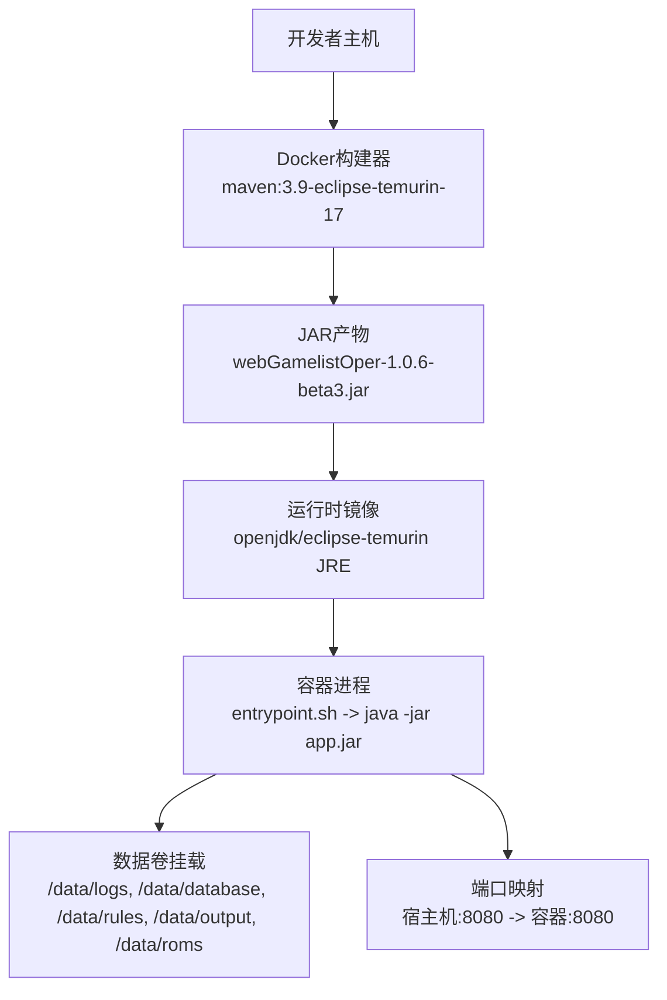
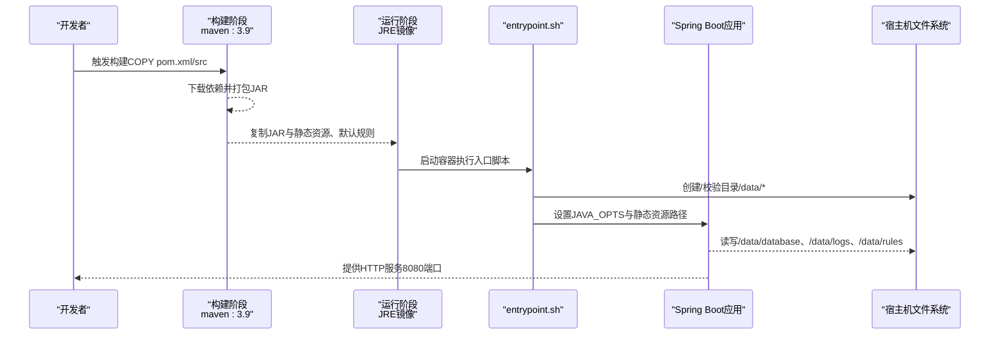
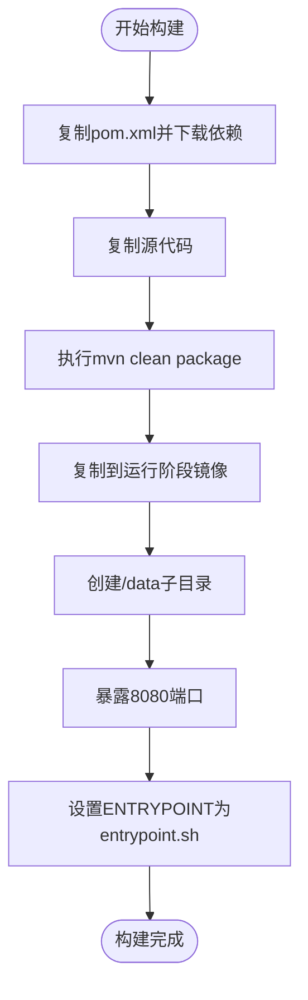
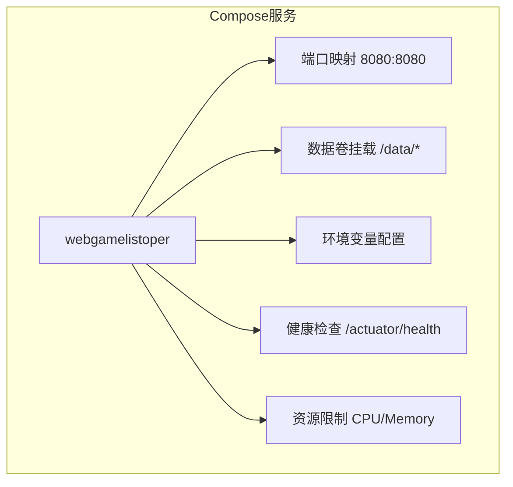
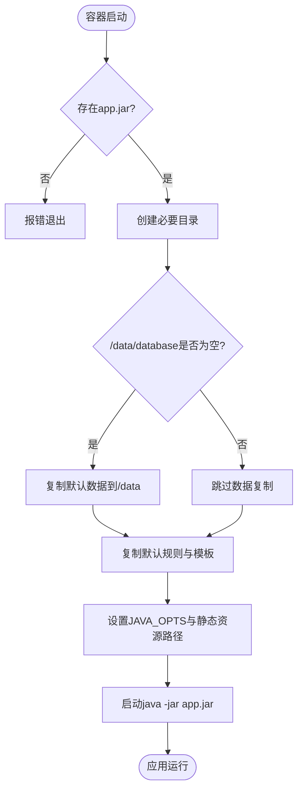
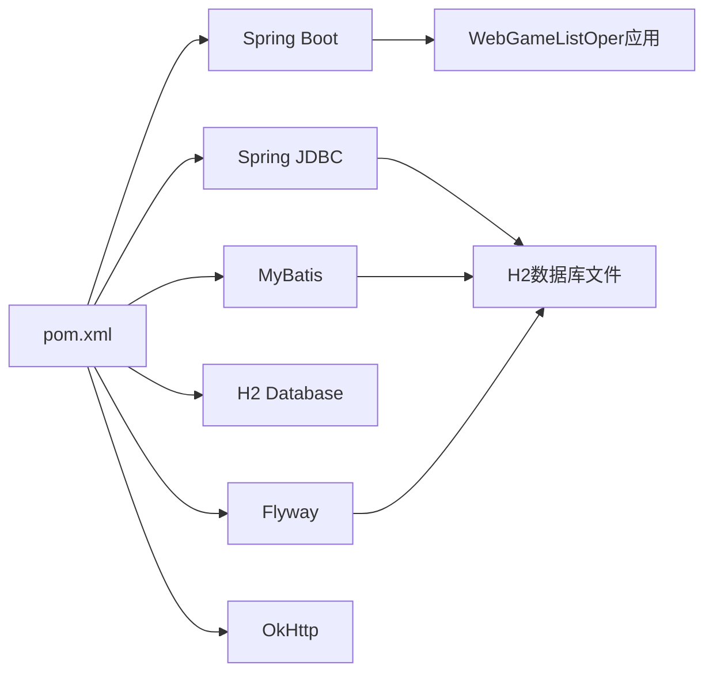

# Docker容器化部署

<cite>
**本文引用的文件**
- [Dockerfile](file://Dockerfile)
- [Dockerfile.multi-stage](file://Dockerfile.multi-stage)
- [docker-compose.yml](file://docker-compose.yml)
- [entrypoint.sh](file://entrypoint.sh)
- [pom.xml](file://pom.xml)
- [application.properties](file://src/main/resources/application.properties)
- [README.md](file://README.md)
- [Configuration.md](file://wiki/Configuration.md)
- [Troubleshooting.md](file://wiki/Troubleshooting.md)
</cite>

## 目录
1. [简介](#简介)
2. [项目结构](#项目结构)
3. [核心组件](#核心组件)
4. [架构总览](#架构总览)
5. [详细组件分析](#详细组件分析)
6. [依赖关系分析](#依赖关系分析)
7. [性能与资源优化](#性能与资源优化)
8. [故障排查指南](#故障排查指南)
9. [结论](#结论)
10. [附录](#附录)

## 简介
本指南面向WebGameListOper的容器化部署，重点说明：
- 多阶段Docker构建流程（Maven编译阶段与运行时镜像优化）
- Docker Compose服务定义、网络、数据卷挂载与环境变量
- 完整的docker run命令示例与docker-compose.yml配置
- 数据持久化策略（数据库、日志、媒体、配置文件）
- 端口映射、资源限制、健康检查等生产环境配置
- 常见部署问题的诊断与解决方案

## 项目结构
仓库包含多种Docker构建方式与编排配置，关键文件如下：
- Dockerfile：基础多阶段构建，使用openjdk:27-ea-17-jdk-slim作为运行基镜像，并内置静态资源与默认规则
- Dockerfile.multi-stage：更优化的多阶段构建，使用eclipse-temurin:17-jre作为运行基镜像，预下载依赖以提升缓存命中率
- docker-compose.yml：服务编排，包含端口映射、数据卷、环境变量、健康检查与资源限制
- entrypoint.sh：容器启动入口脚本，负责目录初始化、默认规则释放、环境变量注入与Java进程启动
- application.properties：Spring Boot应用配置，包括端口、H2数据库路径、静态资源位置、日志输出等
- pom.xml：Maven工程配置，定义主类与打包插件

图表来源
- [Dockerfile:1-55](file://Dockerfile#L1-L55)
- [Dockerfile.multi-stage:1-52](file://Dockerfile.multi-stage#L1-L52)
- [docker-compose.yml:1-33](file://docker-compose.yml#L1-L33)
- [entrypoint.sh:1-93](file://entrypoint.sh#L1-L93)

章节来源
- [Dockerfile:1-55](file://Dockerfile#L1-L55)
- [Dockerfile.multi-stage:1-52](file://Dockerfile.multi-stage#L1-L52)
- [docker-compose.yml:1-33](file://docker-compose.yml#L1-L33)
- [entrypoint.sh:1-93](file://entrypoint.sh#L1-L93)
- [application.properties:1-86](file://src/main/resources/application.properties#L1-L86)
- [pom.xml:1-152](file://pom.xml#L1-L152)

## 核心组件
- 构建阶段（Builder）
  - 使用Maven镜像进行依赖下载与打包，支持阿里云镜像加速
  - 通过spring-boot-maven-plugin生成可执行JAR
- 运行阶段（Runtime）
  - 基于精简JRE镜像，仅复制必要文件
  - 暴露8080端口，设置时区为Asia/Shanghai
  - 通过entrypoint.sh完成数据目录初始化与默认规则释放
- 数据持久化
  - H2数据库文件位于/data/database
  - 日志输出到/data/logs（或/app/logs，取决于配置）
  - 规则与模板位于/data/rules
  - ROM与导出结果位于/data/roms与/data/output
- 编排与健康检查
  - docker-compose.yml中定义了健康检查、资源限制与重启策略

章节来源
- [Dockerfile:1-55](file://Dockerfile#L1-L55)
- [Dockerfile.multi-stage:1-52](file://Dockerfile.multi-stage#L1-L52)
- [entrypoint.sh:1-93](file://entrypoint.sh#L1-L93)
- [application.properties:1-86](file://src/main/resources/application.properties#L1-L86)
- [docker-compose.yml:1-33](file://docker-compose.yml#L1-L33)

## 架构总览
下图展示了从构建到运行的完整流程，以及数据卷挂载与环境变量的作用点。

图表来源
- [Dockerfile:1-55](file://Dockerfile#L1-L55)
- [Dockerfile.multi-stage:1-52](file://Dockerfile.multi-stage#L1-L52)
- [entrypoint.sh:1-93](file://entrypoint.sh#L1-L93)
- [application.properties:1-86](file://src/main/resources/application.properties#L1-L86)

## 详细组件分析

### 多阶段Docker构建过程
- 构建阶段（Builder）
  - 使用maven:3.9-eclipse-temurin-17镜像
  - 配置国内Maven镜像源提升下载速度
  - 先复制pom.xml并下载依赖，再复制源码进行打包，充分利用Docker层缓存
  - 通过spring-boot-maven-plugin生成可执行JAR
- 运行阶段（Runtime）
  - 使用openjdk:27-ea-17-jdk-slim或eclipse-temurin:17-jre作为运行基镜像，减小镜像体积
  - 复制JAR、静态资源、默认规则与entrypoint脚本
  - 创建必要的/data子目录，暴露8080端口
  - 通过entrypoint.sh启动应用，并注入JAVA_OPTS与静态资源路径

图表来源
- [Dockerfile:1-55](file://Dockerfile#L1-L55)
- [Dockerfile.multi-stage:1-52](file://Dockerfile.multi-stage#L1-L52)
- [pom.xml:108-150](file://pom.xml#L108-L150)

章节来源
- [Dockerfile:1-55](file://Dockerfile#L1-L55)
- [Dockerfile.multi-stage:1-52](file://Dockerfile.multi-stage#L1-L52)
- [pom.xml:108-150](file://pom.xml#L108-L150)

### 运行时镜像优化
- 使用JRE而非JDK作为运行基镜像，减少镜像体积
- 仅复制必要的JAR、静态资源与规则文件
- 通过entrypoint.sh在启动时动态初始化数据目录与规则，避免将可变数据写入镜像层
- 设置时区为Asia/Shanghai，确保日志时间正确

章节来源
- [Dockerfile:18-55](file://Dockerfile#L18-L55)
- [Dockerfile.multi-stage:15-52](file://Dockerfile.multi-stage#L15-L52)
- [entrypoint.sh:1-93](file://entrypoint.sh#L1-L93)

### Docker Compose配置详解
- 服务定义
  - 服务名：webgamelistoper
  - 构建上下文：当前目录（build: .）
  - 容器名：webgamelistoper
- 端口映射
  - 宿主机8080映射到容器8080
- 数据卷挂载
  - ./logs:/data/logs（日志）
  - ./roms:/data/roms（ROM文件）
  - ./output:/data/output（导出结果）
  - ./rules:/data/rules（导入模板与导出规则）
  - ./backup:/data/backup（备份）
  - ./database:/data/database（数据库文件）
- 环境变量
  - SPRING_PROFILES_ACTIVE=default
  - SERVER_TOMCAT_BASEDIR=/data
  - SPRING_RESOURCES_STATIC_LOCATIONS=classpath:/static/,file:/data,file:/data/roms,file:/data/output,file:/data/input
  - JAVA_OPTS=-Xmx2g -Xms512m -XX:+UseG1GC
- 健康检查
  - 使用wget访问/actuator/health端点，间隔30秒，超时10秒，重试3次，启动宽限期60秒
- 资源限制
  - CPU限制2核，内存限制4G；预留CPU 0.5核，内存1G

图表来源
- [docker-compose.yml:1-33](file://docker-compose.yml#L1-L33)

章节来源
- [docker-compose.yml:1-33](file://docker-compose.yml#L1-L33)

### 数据持久化策略
- 数据库文件
  - H2数据库文件位于/data/database，通过volume挂载到./database，确保容器重建不丢失
- 日志文件
  - 日志输出到/data/logs（或/app/logs），通过volume挂载到./logs，便于查看与轮转
- 媒体文件
  - ROM文件位于/data/roms，通过volume挂载到./roms，供前端展示与下载
- 配置文件
  - 规则与模板位于/data/rules，通过volume挂载到./rules，支持热更新
- 备份文件
  - 备份目录/data/backup，通过volume挂载到./backup，便于定期备份

章节来源
- [docker-compose.yml:7-13](file://docker-compose.yml#L7-L13)
- [application.properties:15-20](file://src/main/resources/application.properties#L15-L20)
- [entrypoint.sh:31-66](file://entrypoint.sh#L31-L66)

### 启动流程与入口脚本
entrypoint.sh负责：
- 检查app.jar是否存在
- 创建必要目录（/data/rules/export、/data/rules/import、/data/logs等）
- 首次启动时将/app/data中的默认数据复制到/data（跳过已有数据库）
- 复制默认规则与模板到/data/rules
- 设置JAVA_OPTS与静态资源路径
- 启动Spring Boot应用

图表来源
- [entrypoint.sh:27-93](file://entrypoint.sh#L27-L93)

章节来源
- [entrypoint.sh:27-93](file://entrypoint.sh#L27-L93)

### 端口映射、资源限制与健康检查
- 端口映射
  - 容器内8080端口映射到宿主机8080，可通过http://localhost:8080访问
- 资源限制
  - CPU与内存限制通过deploy.resources配置，防止资源争用
- 健康检查
  - 通过/actuator/health端点进行健康探测，确保服务就绪

章节来源
- [docker-compose.yml:5-33](file://docker-compose.yml#L5-L33)

## 依赖关系分析
- Maven依赖
  - Spring Boot Starter Web、JDBC、MyBatis、H2、Flyway、OkHttp、JSON库等
- 运行时依赖
  - Java 17运行时环境
  - 文件系统权限（/data及其子目录）
  - 外部静态资源（可选）

图表来源
- [pom.xml:23-106](file://pom.xml#L23-L106)
- [application.properties:15-38](file://src/main/resources/application.properties#L15-L38)

章节来源
- [pom.xml:23-106](file://pom.xml#L23-L106)
- [application.properties:15-38](file://src/main/resources/application.properties#L15-L38)

## 性能与资源优化
- 构建优化
  - 先复制pom.xml并下载依赖，再利用Docker缓存加速后续构建
  - 使用国内Maven镜像源提升依赖下载速度
- 运行优化
  - 使用JRE镜像减少体积
  - 合理设置JAVA_OPTS（堆大小、垃圾回收器）
  - 通过静态资源配置优先读取外部目录，便于热更新
- 资源限制
  - 通过compose的deploy.resources限制CPU与内存，避免过度占用
- 日志管理
  - 配置日志文件大小与保留数量，避免磁盘占满

章节来源
- [Dockerfile.multi-stage:7-13](file://Dockerfile.multi-stage#L7-L13)
- [application.properties:49-53](file://src/main/resources/application.properties#L49-L53)
- [docker-compose.yml:26-33](file://docker-compose.yml#L26-L33)

## 故障排查指南
- 应用无法启动
  - 检查端口是否被占用
  - 检查目录权限（chmod -R 755 ./data ./output ./logs ./backup）
  - 查看容器日志（docker logs webgamelistoper）
- 导入模板未加载
  - 确认/data/rules/import目录存在且JSON格式正确
  - 检查文件权限（chmod 644 ./data/rules/import/*.json）
- 导出规则未找到
  - 检查/data/rules/export目录与JSON字段完整性
- 字符乱码
  - 确保XML文件为UTF-8编码
- 数据库连接错误
  - 确保/data/database目录存在且有写权限
- 媒体文件不显示
  - 检查/media或/data/roms目录结构与文件扩展名
- 语言切换无效
  - 清除浏览器缓存，检查translation-config.json
- 内存过高
  - 调整JAVA_OPTS（如-Xmx4g -Xms1g -XX:+UseG1GC）

章节来源
- [Troubleshooting.md:7-180](file://wiki/Troubleshooting.md#L7-L180)
- [README.md:95-140](file://README.md#L95-L140)

## 结论
本指南提供了WebGameListOper的多阶段Docker构建与容器化部署方案，涵盖构建优化、数据持久化、编排配置、健康检查与故障排查。建议在生产环境中：
- 使用docker-compose.yml进行服务编排
- 将关键数据目录以volume形式持久化
- 合理设置资源限制与健康检查
- 定期备份/data目录，确保数据安全

## 附录

### 完整的docker run命令示例
以下命令用于直接运行容器，包含端口映射、数据卷挂载与环境变量设置：
- 端口映射：宿主机8081映射到容器8080
- 数据卷挂载：/path/to/output、/path/to/roms、./logs、./data、./backup
- 环境变量：SPRING_PROFILES_ACTIVE、SERVER_TOMCAT_BASEDIR、SPRING_RESOURCES_STATIC_LOCATIONS、JAVA_OPTS
- 重启策略：unless-stopped

章节来源
- [README.md:95-115](file://README.md#L95-L115)
- [README.md:172-192](file://README.md#L172-L192)

### 完整的docker-compose.yml配置
以下为推荐的docker-compose.yml配置，包含服务定义、端口映射、数据卷、环境变量、健康检查与资源限制：
- 服务名：webgamelistoper
- 构建上下文：当前目录
- 端口映射：8080:8080
- 数据卷：logs、roms、output、rules、backup、database
- 环境变量：SPRING_PROFILES_ACTIVE、SERVER_TOMCAT_BASEDIR、SPRING_RESOURCES_STATIC_LOCATIONS、JAVA_OPTS
- 健康检查：/actuator/health
- 资源限制：CPU与内存限制与预留

章节来源
- [docker-compose.yml:1-33](file://docker-compose.yml#L1-L33)