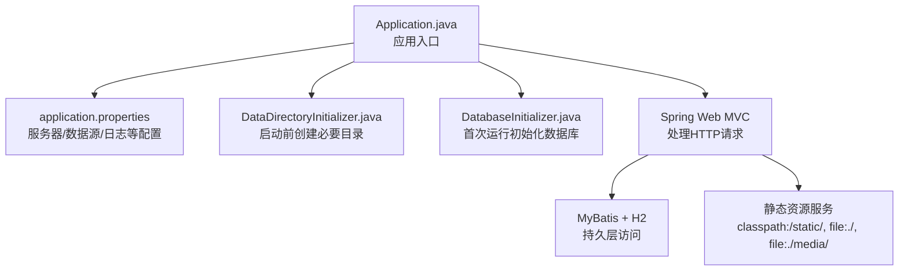
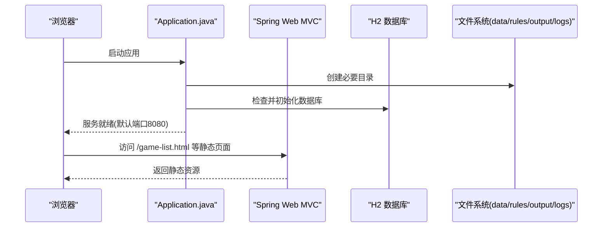
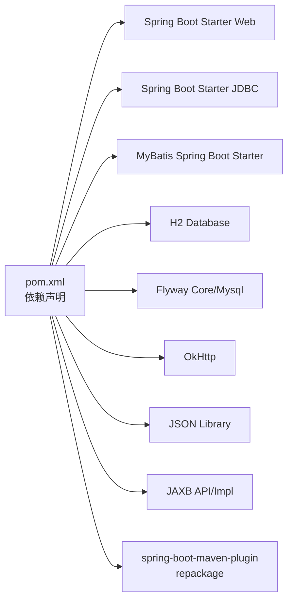

# JAR包部署

<cite>
**本文引用的文件**
- [pom.xml](file://pom.xml)
- [Application.java](file://src/main/java/com/gamelist/Application.java)
- [application.properties](file://src/main/resources/application.properties)
- [DataDirectoryInitializer.java](file://src/main/java/com/gamelist/config/DataDirectoryInitializer.java)
- [DatabaseInitializer.java](file://src/main/java/com/gamelist/config/DatabaseInitializer.java)
- [start.bat](file://start.bat)
- [build.bat](file://build.bat)
- [Dockerfile](file://Dockerfile)
- [docker-compose.yml](file://docker-compose.yml)
- [entrypoint.sh](file://entrypoint.sh)
- [README.md](file://README.md)
</cite>

## 目录
1. [简介](#简介)
2. [项目结构](#项目结构)
3. [核心组件](#核心组件)
4. [架构总览](#架构总览)
5. [详细组件分析](#详细组件分析)
6. [依赖分析](#依赖分析)
7. [性能考虑](#性能考虑)
8. [故障排查指南](#故障排查指南)
9. [结论](#结论)
10. [附录](#附录)

## 简介
本指南面向生产环境，提供 WebGameListOper 的 JAR 包部署全流程说明。内容涵盖：
- Java 与系统依赖要求（JDK 17+）
- Maven 构建流程（含依赖下载、编译打包、跳过测试）
- JAR 启动参数配置（端口、数据库、文件路径等）
- Linux/Windows 启动脚本示例
- 生产进程管理（systemd、supervisor）
- 日志输出、性能调优与内存设置
- 常见部署问题排查

## 项目结构
- 应用入口与装配：Spring Boot 主类负责启动与扫描
- 资源与配置：application.properties 集中定义服务器、数据源、静态资源、日志等
- 初始化逻辑：数据目录与数据库初始化在应用启动早期执行
- 构建产物：通过 Maven 插件生成可执行的 Spring Boot JAR
- 容器化：提供 Dockerfile 与 docker-compose 用于容器部署（可作为参考）

图表来源
- [Application.java:8-14](file://src/main/java/com/gamelist/Application.java#L8-L14)
- [application.properties:1-86](file://src/main/resources/application.properties#L1-L86)
- [DataDirectoryInitializer.java:18-92](file://src/main/java/com/gamelist/config/DataDirectoryInitializer.java#L18-L92)
- [DatabaseInitializer.java:34-52](file://src/main/java/com/gamelist/config/DatabaseInitializer.java#L34-L52)

章节来源
- [pom.xml:1-152](file://pom.xml#L1-L152)
- [Application.java:1-16](file://src/main/java/com/gamelist/Application.java#L1-L16)
- [application.properties:1-86](file://src/main/resources/application.properties#L1-L86)

## 核心组件
- 应用入口：Spring Boot 主类，启用异步任务与 MyBatis Mapper 扫描
- 配置中心：application.properties 统一配置端口、编码、静态资源、数据源、连接池、Flyway、MyBatis、日志、H2控制台、上传临时目录、Tomcat工作目录、自定义路径等
- 数据目录初始化：在环境准备阶段自动创建 data、rules、output、input、logs 等目录
- 数据库初始化：首次运行时执行 init.sql，后续跳过；支持 Flyway 迁移（默认禁用自动迁移）
- 构建与打包：Maven 使用 spring-boot-maven-plugin 生成可执行 JAR，并指定主类

章节来源
- [Application.java:8-14](file://src/main/java/com/gamelist/Application.java#L8-L14)
- [application.properties:1-86](file://src/main/resources/application.properties#L1-L86)
- [DataDirectoryInitializer.java:18-92](file://src/main/java/com/gamelist/config/DataDirectoryInitializer.java#L18-L92)
- [DatabaseInitializer.java:34-52](file://src/main/java/com/gamelist/config/DatabaseInitializer.java#L34-L52)
- [pom.xml:108-136](file://pom.xml#L108-L136)

## 架构总览
WebGameListOper 基于 Spring Boot 3.2.x，内嵌 Tomcat 提供 HTTP 服务，使用 MyBatis 访问 H2 嵌入式数据库，并通过 Flyway 管理数据库版本（默认关闭自动迁移）。静态资源同时从 classpath 与外部文件目录加载，便于在生产中挂载数据卷或独立目录。

图表来源
- [Application.java:8-14](file://src/main/java/com/gamelist/Application.java#L8-L14)
- [application.properties:1-86](file://src/main/resources/application.properties#L1-L86)
- [DataDirectoryInitializer.java:18-92](file://src/main/java/com/gamelist/config/DataDirectoryInitializer.java#L18-L92)
- [DatabaseInitializer.java:34-52](file://src/main/java/com/gamelist/config/DatabaseInitializer.java#L34-L52)

## 详细组件分析

### 构建与打包（Maven）
- 构建命令：执行清理、编译、打包并跳过测试
- 产物：target/webGamelistOper-1.0.6-beta3.jar（由版本号决定）
- 主类：com.gamelist.Application（由插件配置注入到 MANIFEST）
- 资源处理：HTML/JSON 不参与过滤，保持原样

建议命令
- Windows：使用 build.bat 或直接执行 mvn clean package spring-boot:repackage -DskipTests
- Linux：mvn clean package spring-boot:repackage -DskipTests

章节来源
- [pom.xml:18-21](file://pom.xml#L18-L21)
- [pom.xml:108-136](file://pom.xml#L108-L136)
- [build.bat:1-42](file://build.bat#L1-L42)

### 启动参数与环境变量
- 端口：server.port=8080（可通过命令行覆盖）
- 编码：UTF-8（URI与HTTP请求）
- 静态资源：classpath:/static/, file:./, file:./media/（也可通过环境变量覆盖）
- 数据源：H2 文件数据库，默认位于 ./data/database/database.db
- 连接池：HikariCP 最大连接数、空闲超时、连接超时、生命周期等
- 数据库初始化：先执行 sql/init.sql，再按配置决定是否启用 Flyway
- 上传与临时目录：spring.servlet.multipart.location=./data
- Tomcat 工作目录：server.tomcat.basedir=./data
- 自定义路径：规则、导入模板、导出规则、输入输出目录均指向 ./data 下子目录
- 日志：控制台与文件日志（滚动策略、字符集、模式）
- H2 控制台：/h2-console（生产建议关闭或限制访问）

常用覆盖方式
- 命令行：java -jar xxx.jar --server.port=8081
- 环境变量：SPRING_DATASOURCE_URL、SERVER_TOMCAT_BASEDIR、SPRING_RESOURCES_STATIC_LOCATIONS、JAVA_OPTS 等
- 配置文件：application.properties（生产建议使用外部化配置）

章节来源
- [application.properties:1-86](file://src/main/resources/application.properties#L1-L86)
- [README.md:95-146](file://README.md#L95-L146)
- [docker-compose.yml:14-19](file://docker-compose.yml#L14-L19)

### 数据目录与数据库初始化
- 启动前自动创建：data、data/rules、data/rules/import、data/rules/export、data/output、data/input、logs
- 数据库：首次运行检测表是否存在，不存在则执行 init.sql；Flyway 默认禁用自动迁移
- 注意：若使用外部数据库，请修改数据源配置并确保权限正确

章节来源
- [DataDirectoryInitializer.java:18-92](file://src/main/java/com/gamelist/config/DataDirectoryInitializer.java#L18-L92)
- [DatabaseInitializer.java:34-52](file://src/main/java/com/gamelist/config/DatabaseInitializer.java#L34-L52)
- [application.properties:29-38](file://src/main/resources/application.properties#L29-L38)

### 启动脚本示例

- Windows 启动脚本（start.bat）
  - 设置 JVM 内存与 GC 参数
  - 校验 JAR 存在后启动
  - 可直接双击或在命令行执行

- Linux 启动脚本（示例）
  - 设置 JAVA_HOME、JVM 参数
  - 创建必要目录
  - 后台运行并记录日志
  - 提供 stop/restart 功能

- systemd 服务（Linux 生产推荐）
  - 定义 ExecStart、WorkingDirectory、Restart、Environment 等
  - 将日志输出到 journald 或重定向到文件

- supervisor 配置（Linux 备选）
  - 定义程序名、command、user、directory、autorestart、stdout_logfile 等

章节来源
- [start.bat:1-20](file://start.bat#L1-L20)
- [README.md:142-146](file://README.md#L142-L146)

### 容器化参考（可选）
- Dockerfile：多阶段构建，复制 JAR、静态资源、默认规则、data 初始数据，暴露 8080
- entrypoint.sh：初始化目录、释放默认规则、设置 JAVA_OPTS、启动应用
- docker-compose.yml：端口映射、数据卷挂载、环境变量、健康检查、资源限制

章节来源
- [Dockerfile:1-55](file://Dockerfile#L1-L55)
- [entrypoint.sh:1-93](file://entrypoint.sh#L1-L93)
- [docker-compose.yml:1-33](file://docker-compose.yml#L1-L33)

## 依赖分析
- 运行时依赖：Spring Boot Web、JDBC、MyBatis、H2、Flyway、OkHttp、JSON 库、JAXB API/实现
- 构建依赖：maven-jar-plugin、spring-boot-maven-plugin、maven-resources-plugin
- 主类：com.gamelist.Application（MANIFEST 指定）

图表来源
- [pom.xml:23-106](file://pom.xml#L23-L106)
- [pom.xml:108-136](file://pom.xml#L108-L136)

章节来源
- [pom.xml:23-106](file://pom.xml#L23-L106)
- [pom.xml:108-136](file://pom.xml#L108-L136)

## 性能考虑
- JVM 内存与GC
  - 建议：-Xms2g -Xmx4g -XX:MaxMetaspaceSize=512m -XX:+UseG1GC -XX:MaxGCPauseMillis=200
  - 根据实际负载调整堆大小与元空间
- 连接池
  - Hikari maximum-pool-size=30，minimum-idle=10，idle-timeout=60000，connection-timeout=10000，max-lifetime=1800000
- 静态资源缓存
  - 开发期关闭缓存（cache.period=0），生产可开启并设置合理过期时间
- 日志
  - 文件日志滚动：单文件10MB，保留7份；控制台 UTF-8
- 并发与异步
  - 已启用 @EnableAsync，可根据任务量调整线程池（如需自定义）

章节来源
- [application.properties:21-27](file://src/main/resources/application.properties#L21-L27)
- [application.properties:43-53](file://src/main/resources/application.properties#L43-L53)
- [start.bat:3-4](file://start.bat#L3-L4)

## 故障排查指南
- 无法启动或端口占用
  - 检查 server.port 是否被占用，必要时通过命令行或环境变量覆盖
- 数据库目录无权限
  - 确保 data、database、logs 等目录可写；DataDirectoryInitializer 会在启动时尝试创建
- 数据库初始化失败
  - 检查 sql/init.sql 是否存在且可读；查看日志中的 SQL 执行错误
- 静态资源404
  - 确认 static-locations 包含期望目录；生产可通过环境变量 SPRING_RESOURCES_STATIC_LOCATIONS 覆盖
- 上传失败或临时目录无权限
  - 检查 spring.servlet.multipart.location 指向的目录权限
- H2 控制台安全
  - 生产建议关闭或限制访问 /h2-console
- 容器相关
  - 检查 volumes 挂载是否正确；entrypoint.sh 会释放默认规则与数据，避免覆盖已有数据库

章节来源
- [application.properties:10-13](file://src/main/resources/application.properties#L10-L13)
- [application.properties:15-27](file://src/main/resources/application.properties#L15-L27)
- [application.properties:55-58](file://src/main/resources/application.properties#L55-L58)
- [DataDirectoryInitializer.java:18-92](file://src/main/java/com/gamelist/config/DataDirectoryInitializer.java#L18-L92)
- [DatabaseInitializer.java:34-52](file://src/main/java/com/gamelist/config/DatabaseInitializer.java#L34-L52)
- [entrypoint.sh:31-81](file://entrypoint.sh#L31-L81)

## 结论
通过本指南，您可以在 Linux/Windows 环境下完成 WebGameListOper 的 JAR 包构建与生产部署，合理配置端口、数据库、文件路径与日志，并使用 systemd/supervisor 进行进程管理。结合性能调优与常见问题排查，保障服务稳定运行。

## 附录

### 快速部署清单
- 安装 JDK 17+
- 构建 JAR：mvn clean package spring-boot:repackage -DskipTests
- 准备目录：./data/rules/export, ./data/rules/import, ./output, ./logs
- 启动：java -jar target/webGamelistOper-1.0.6-beta3.jar
- 访问：http://localhost:8080

章节来源
- [pom.xml:18-21](file://pom.xml#L18-L21)
- [pom.xml:108-136](file://pom.xml#L108-L136)
- [README.md:142-146](file://README.md#L142-L146)