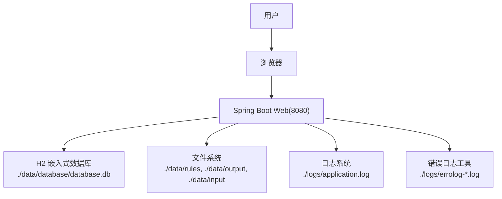
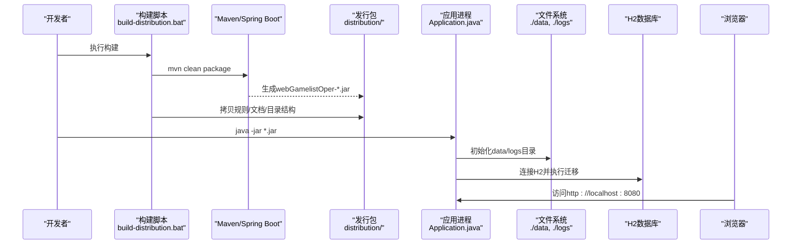
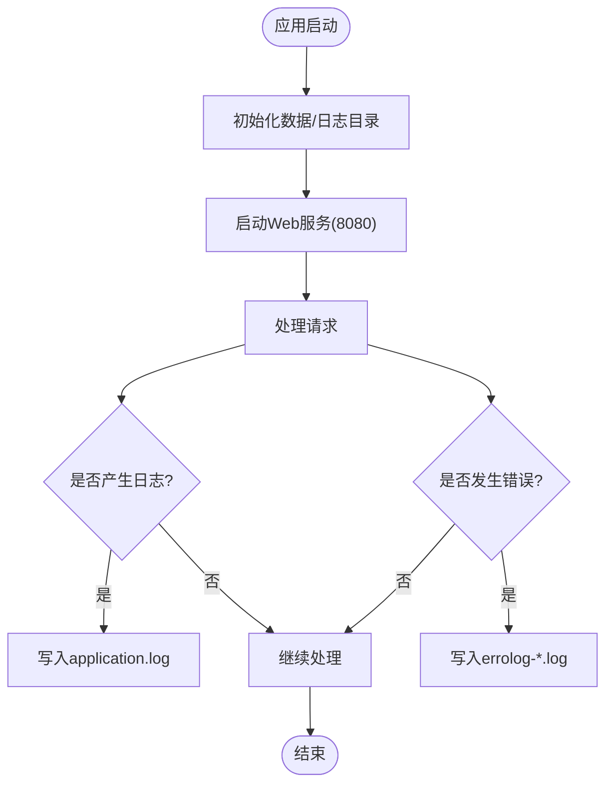
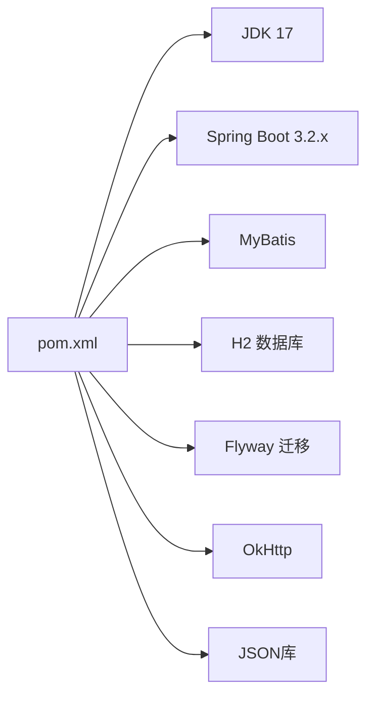

# Windows原生部署

<cite>
**本文引用的文件**
- [build-distribution.bat](file://build-distribution.bat)
- [start.bat](file://start.bat)
- [pom.xml](file://pom.xml)
- [application.properties](file://src/main/resources/application.properties)
- [Application.java](file://src/main/java/com/gamelist/Application.java)
- [DataDirectoryInitializer.java](file://src/main/java/com/gamelist/config/DataDirectoryInitializer.java)
- [ErrorLogWriter.java](file://src/main/java/com/gamelist/util/ErrorLogWriter.java)
- [LogController.java](file://src/main/java/com/gamelist/controller/LogController.java)
- [README.md](file://README.md)
</cite>

## 目录
1. [简介](#简介)
2. [项目结构](#项目结构)
3. [核心组件](#核心组件)
4. [架构总览](#架构总览)
5. [详细组件分析](#详细组件分析)
6. [依赖关系分析](#依赖关系分析)
7. [性能与资源建议](#性能与资源建议)
8. [故障排查指南](#故障排查指南)
9. [结论](#结论)
10. [附录：Windows服务安装与配置](#附录windows服务安装与配置)

## 简介
本指南面向在Windows环境下将WebGameListOper以“可执行应用”的方式部署运行。项目基于Spring Boot 3.2.x，要求JDK 17；构建产物为JAR包，通过脚本生成标准化发行包，便于在Windows上直接启动、配置数据目录、日志与规则文件位置，并支持后续封装为Windows服务。

注意：当前仓库未包含打包为原生EXE的构建插件或工具链，因此“原生EXE”在本仓库中实际指代“可直接运行的JAR发行包”。如需真正的EXE（无需JRE），需额外引入第三方打包工具（例如jpackage或exe4j）并在现有构建流程基础上扩展。

## 项目结构
- 构建与发布
  - build-distribution.bat：停止Java进程、清理target、执行Maven构建、组装distribution目录（含data、rules、文档等）。
  - start.bat：设置JVM参数并启动JAR（开发调试用）。
- 应用配置
  - application.properties：端口、编码、静态资源、H2数据库路径、Hikari连接池、Flyway迁移、MyBatis映射、日志输出、上传临时目录、Tomcat工作目录、自定义路径等。
- 应用入口
  - Application.java：Spring Boot主类，启用异步任务扫描Mapper。
- 运行时初始化
  - DataDirectoryInitializer.java：在环境准备阶段自动创建data、logs、database、rules等目录，确保运行期路径可用。
- 日志与错误处理
  - LogController.java：提供实时日志读取接口。
  - ErrorLogWriter.java：导入/导出过程中的错误明细写入独立日志文件。

图表来源
- [application.properties:1-86](file://src/main/resources/application.properties#L1-L86)
- [DataDirectoryInitializer.java:18-92](file://src/main/java/com/gamelist/config/DataDirectoryInitializer.java#L18-L92)
- [ErrorLogWriter.java:1-189](file://src/main/java/com/gamelist/util/ErrorLogWriter.java#L1-L189)

章节来源
- [build-distribution.bat:1-101](file://build-distribution.bat#L1-L101)
- [start.bat:1-20](file://start.bat#L1-L20)
- [application.properties:1-86](file://src/main/resources/application.properties#L1-L86)
- [Application.java:1-16](file://src/main/java/com/gamelist/Application.java#L1-L16)
- [DataDirectoryInitializer.java:1-106](file://src/main/java/com/gamelist/config/DataDirectoryInitializer.java#L1-L106)
- [ErrorLogWriter.java:1-189](file://src/main/java/com/gamelist/util/ErrorLogWriter.java#L1-L189)
- [LogController.java:16-48](file://src/main/java/com/gamelist/controller/LogController.java#L16-L48)
- [README.md:153-227](file://README.md#L153-L227)

## 核心组件
- 构建与分发
  - Maven构建：使用spring-boot-maven-plugin重打包可执行JAR，主类为com.gamelist.Application。
  - 发行包：build-distribution.bat会复制JAR、规则模板、文档到distribution目录，并预建data子目录结构。
- 运行时
  - Spring Boot Web容器默认监听8080端口。
  - H2嵌入式数据库文件位于./data/database/database.db。
  - 静态资源与上传临时目录均指向./data及其子目录。
- 目录初始化
  - 应用启动时自动创建必要的data、logs、database、rules等目录，减少手动准备步骤。
- 日志与错误
  - 应用日志：./logs/application.log，按大小与保留天数轮转。
  - 错误明细：./logs/errolog-<操作>-<平台>-<日期>.log。
  - 实时日志查看：通过API读取最近日志行。

章节来源
- [pom.xml:108-136](file://pom.xml#L108-L136)
- [build-distribution.bat:18-84](file://build-distribution.bat#L18-L84)
- [application.properties:1-86](file://src/main/resources/application.properties#L1-L86)
- [DataDirectoryInitializer.java:18-92](file://src/main/java/com/gamelist/config/DataDirectoryInitializer.java#L18-L92)
- [ErrorLogWriter.java:19-189](file://src/main/java/com/gamelist/util/ErrorLogWriter.java#L19-L189)
- [LogController.java:16-48](file://src/main/java/com/gamelist/controller/LogController.java#L16-L48)

## 架构总览
下图展示了Windows下从构建到运行的关键路径与组件交互。

图表来源
- [build-distribution.bat:18-84](file://build-distribution.bat#L18-L84)
- [pom.xml:108-136](file://pom.xml#L108-L136)
- [Application.java:8-14](file://src/main/java/com/gamelist/Application.java#L8-L14)
- [application.properties:1-86](file://src/main/resources/application.properties#L1-L86)

## 详细组件分析

### 构建与分发（build-distribution.bat）
- 功能要点
  - 停止所有java.exe进程，避免端口占用或文件锁定。
  - 清理并重建target目录，执行Maven构建跳过测试。
  - 创建distribution目录及data子目录（rules/export、rules/import、database）。
  - 复制JAR、规则模板、文档到distribution。
- 注意事项
  - 若根目录存在data，会被复制到distribution/data中，便于携带。
  - 构建失败会中止并提示。

章节来源
- [build-distribution.bat:1-101](file://build-distribution.bat#L1-L101)

### 启动与运行（start.bat 与 Application）
- start.bat
  - 设置JVM内存与GC参数，检查JAR是否存在后启动。
  - 适用于开发调试。
- Application.java
  - 主类，启用异步与Mapper扫描。
- 启动后行为
  - 根据application.properties绑定端口、配置编码、静态资源、数据库、日志等。
  - DataDirectoryInitializer在环境准备阶段创建必要目录。

章节来源
- [start.bat:1-20](file://start.bat#L1-L20)
- [Application.java:1-16](file://src/main/java/com/gamelist/Application.java#L1-L16)
- [application.properties:1-86](file://src/main/resources/application.properties#L1-L86)
- [DataDirectoryInitializer.java:18-92](file://src/main/java/com/gamelist/config/DataDirectoryInitializer.java#L18-L92)

### 配置文件与路径
- 服务器端口：8080
- 静态资源：classpath:/static/, file:./, file:./media/
- 数据库：H2文件模式，路径./data/database/database.db
- 上传临时目录：./data
- Tomcat基础目录：./data
- 自定义路径：
  - app.rules.directory=./data/rules
  - app.import.templates.path=./data/rules/import
  - app.export.rules.path=./data/rules/export
  - app.input.directory=./data/input
  - app.output.directory=./data/output
- 日志：
  - 控制台与文件日志，文件路径./logs/application.log，按大小与历史数量轮转。

章节来源
- [application.properties:1-86](file://src/main/resources/application.properties#L1-L86)

### 日志与错误处理
- 应用日志：application.properties配置了日志级别、格式、文件路径与轮转策略。
- 错误日志：ErrorLogWriter在导入/导出过程中记录问题游戏清单，输出至./logs/errolog-*.log。
- 实时日志：LogController提供/api/logs/realtime接口，读取最近N行日志。

图表来源
- [application.properties:43-53](file://src/main/resources/application.properties#L43-L53)
- [ErrorLogWriter.java:19-189](file://src/main/java/com/gamelist/util/ErrorLogWriter.java#L19-L189)
- [LogController.java:16-48](file://src/main/java/com/gamelist/controller/LogController.java#L16-L48)

章节来源
- [application.properties:43-53](file://src/main/resources/application.properties#L43-L53)
- [ErrorLogWriter.java:1-189](file://src/main/java/com/gamelist/util/ErrorLogWriter.java#L1-L189)
- [LogController.java:16-48](file://src/main/java/com/gamelist/controller/LogController.java#L16-L48)

## 依赖关系分析
- JDK版本：17（由pom.xml指定）
- 框架与库：Spring Boot 3.2.x、MyBatis、H2、Flyway、OkHttp、JSON等
- 构建插件：maven-jar-plugin、spring-boot-maven-plugin（重打包可执行JAR）

图表来源
- [pom.xml:1-152](file://pom.xml#L1-L152)

章节来源
- [pom.xml:1-152](file://pom.xml#L1-L152)

## 性能与资源建议
- JVM参数
  - start.bat默认设置堆大小与G1 GC，可根据机器内存调整-Xms/-Xmx。
- 连接池
  - HikariCP最大连接数30，空闲超时与连接超时已配置，可按并发需求微调。
- 静态资源缓存
  - 关闭缓存以便开发调试，生产环境可考虑开启缓存以提升性能。
- 日志轮转
  - 单文件最大10MB，保留7份，避免磁盘膨胀。

[本节为通用建议，不直接分析具体文件]

## 故障排查指南
- 端口占用
  - 现象：启动时报端口被占用。
  - 处理：确认8080未被其他程序占用；必要时修改server.port或终止占用进程。
- 权限问题
  - 现象：无法创建data/logs目录或写入数据库文件。
  - 处理：以管理员权限运行命令提示符；或将应用安装在具有读写权限的目录。
- 路径问题
  - 现象：找不到规则文件或输出目录。
  - 处理：确认application.properties中的app.*.path与实际目录一致；确保distribution/data结构与预期一致。
- 依赖冲突
  - 现象：启动报类加载异常。
  - 处理：清理target与distribution后重新构建；检查本地Maven仓库缓存。
- 日志为空
  - 现象：无法查看日志。
  - 处理：确认./logs/application.log已生成；通过/api/logs/realtime获取最近日志。

章节来源
- [application.properties:1-86](file://src/main/resources/application.properties#L1-L86)
- [DataDirectoryInitializer.java:18-92](file://src/main/java/com/gamelist/config/DataDirectoryInitializer.java#L18-L92)
- [LogController.java:16-48](file://src/main/java/com/gamelist/controller/LogController.java#L16-L48)

## 结论
- 本项目在Windows下的“原生部署”以JAR为核心，配合build-distribution.bat生成标准化发行包，简化部署流程。
- 通过application.properties集中管理端口、路径、日志与数据库配置，DataDirectoryInitializer自动创建必要目录，降低运维成本。
- 日志体系完善，支持应用日志与错误明细双通道，便于定位问题。
- 如需真正的EXE（无需JRE），可在现有构建基础上引入jpackage或exe4j进行二次封装。

[本节为总结性内容，不直接分析具体文件]

## 附录：Windows服务安装与配置
说明：以下内容为概念性指导，用于将当前JAR封装为Windows服务。仓库未内置服务化脚本或配置，请结合实际情况选择方案。

- 方案A：使用NSSM（推荐）
  - 下载并安装NSSM。
  - 使用nssm install注册服务，设置可执行文件为java.exe，参数为-jar <发行包JAR路径>。
  - 设置工作目录为distribution所在目录，确保相对路径解析正确。
  - 启动服务并验证端口8080可访问。
- 方案B：使用sc命令
  - 以管理员身份打开命令提示符。
  - 创建服务：sc create "WebGameListOper" binPath= "\"C:\Program Files\Java\jdk-17\bin\java.exe\" -jar \"D:\your\path\distribution\webGamelistOper-*.jar\"" start= auto
  - 启动服务：sc start "WebGameListOper"
  - 查看状态：sc query "WebGameListOper"
- 防火墙与端口
  - 开放入站规则：允许TCP 8080端口。
  - 可通过“高级安全Windows Defender防火墙”添加入站规则，或命令行：netsh advfirewall firewall add rule name="WebGameListOper" dir=in action=allow protocol=TCP localport=8080
- 环境变量与启动参数
  - 可通过JAVA_OPTS或-D参数传入JVM选项（如内存、GC）。
  - 可通过-SERVER_PORT或修改application.properties覆盖端口。
- 事件日志集成
  - 当前应用未直接写入Windows事件日志。可将应用日志（application.log）接入第三方日志转发器（如nxlog）写入Windows事件日志，或在业务层调用Windows事件日志API。
- 常见服务问题
  - 工作目录不正确导致相对路径失效：务必在服务属性中设置“起始目录”为distribution目录。
  - 权限不足：服务账户需对data、logs目录有读写权限。
  - 端口冲突：确认8080未被占用或修改端口。

[本节为概念性指导，不直接分析具体文件]