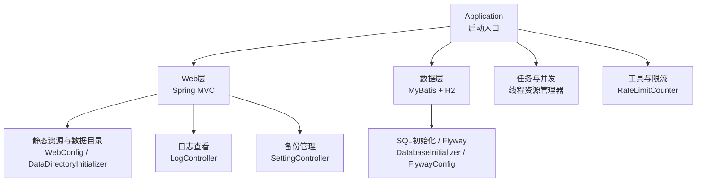
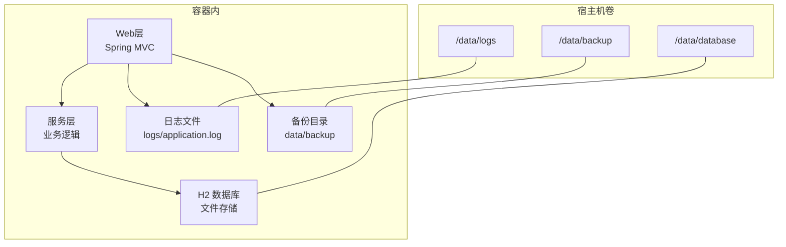
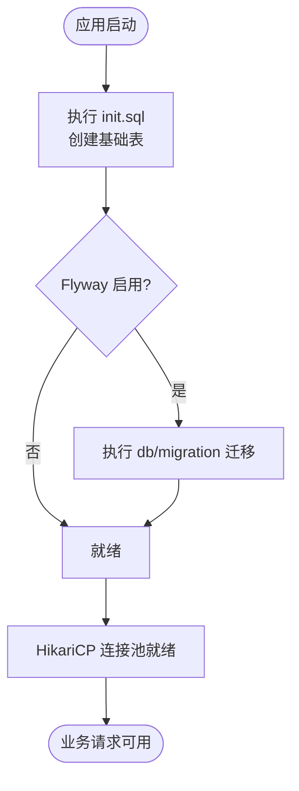
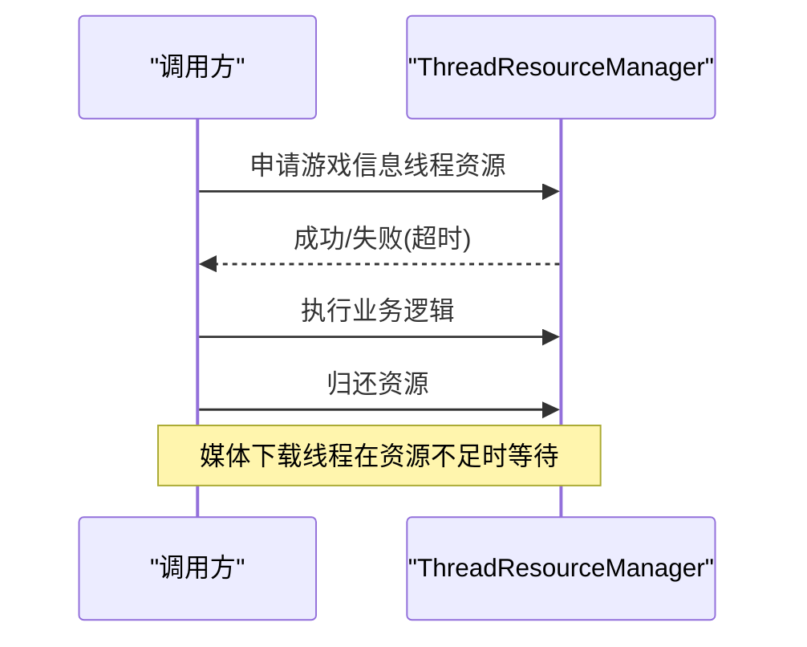
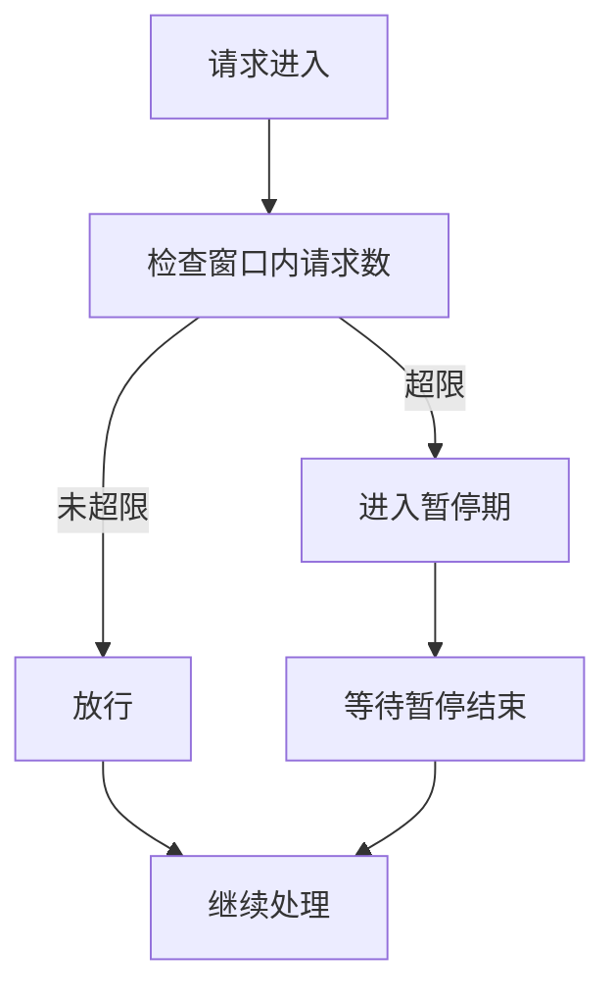
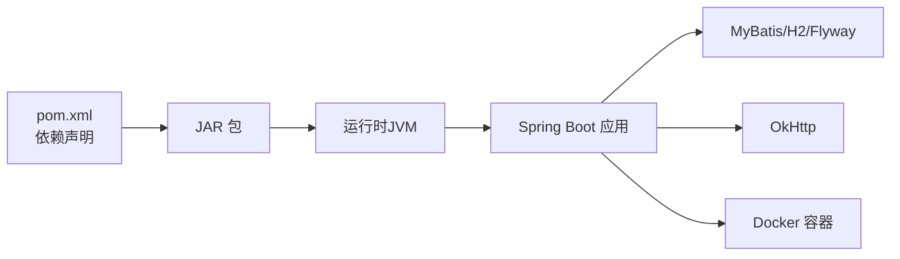
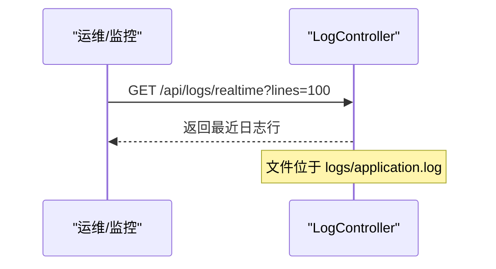
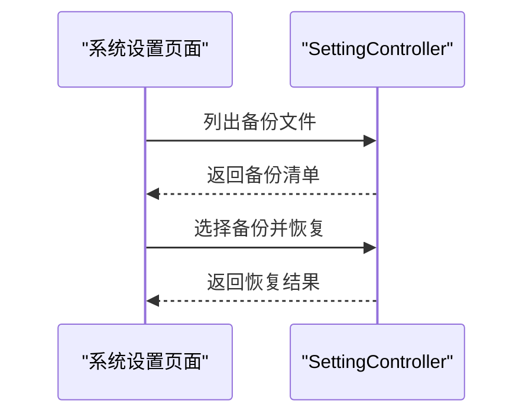

# 生产环境配置

<cite>
**本文引用的文件**
- [application.properties](file://src/main/resources/application.properties)
- [pom.xml](file://pom.xml)
- [Dockerfile](file://Dockerfile)
- [docker-compose.yml](file://docker-compose.yml)
- [Application.java](file://src/main/java/com/gamelist/Application.java)
- [AsyncConfig.java](file://src/main/java/com/gamelist/config/AsyncConfig.java)
- [WebConfig.java](file://src/main/java/com/gamelist/config/WebConfig.java)
- [DataDirectoryInitializer.java](file://src/main/java/com/gamelist/config/DataDirectoryInitializer.java)
- [DatabaseInitializer.java](file://src/main/java/com/gamelist/config/DatabaseInitializer.java)
- [FlywayConfig.java](file://src/main/java/com/gamelist/config/FlywayConfig.java)
- [ThreadResourceManager.java](file://src/main/java/com/gamelist/service/ThreadResourceManager.java)
- [RateLimitCounter.java](file://src/main/java/com/gamelist/util/RateLimitCounter.java)
- [ScreenScraperApiServiceImpl.java](file://src/main/java/com/gamelist/service/impl/ScreenScraperApiServiceImpl.java)
- [LogController.java](file://src/main/java/com/gamelist/controller/LogController.java)
- [SettingController.java](file://src/main/java/com/gamelist/controller/SettingController.java)
- [system-settings.html](file://src/main/resources/static/system-settings.html)
</cite>

## 目录
1. [简介](#简介)
2. [项目结构](#项目结构)
3. [核心组件](#核心组件)
4. [架构总览](#架构总览)
5. [详细组件分析](#详细组件分析)
6. [依赖关系分析](#依赖关系分析)
7. [性能与容量规划](#性能与容量规划)
8. [安全配置](#安全配置)
9. [监控与日志](#监控与日志)
10. [备份与恢复](#备份与恢复)
11. [负载均衡与高可用](#负载均衡与高可用)
12. [故障排查指南](#故障排查指南)
13. [结论](#结论)
14. [附录：多环境配置模板](#附录多环境配置模板)

## 简介
本指南面向WebGameListOper的生产环境部署与运维，聚焦application.properties中的关键配置项（数据库连接池、线程资源、缓存策略、API限流等），并提供开发/测试/生产环境的配置模板与最佳实践；同时覆盖HTTPS与安全、监控与日志、备份恢复、以及负载均衡和高可用部署建议。

## 项目结构
- 应用入口与基础能力
  - 启动类启用异步处理与MyBatis扫描
  - 默认使用H2嵌入式数据库，支持SQL初始化与Flyway迁移
  - 内置静态资源映射与数据目录自动初始化
- 运行时资源与持久化
  - 通过环境变量和卷挂载将日志、ROM、输出、规则、备份、数据库等持久化到宿主机
  - 提供备份管理接口与前端页面用于备份列表展示与恢复操作

图表来源
- [Application.java:8-14](file://src/main/java/com/gamelist/Application.java#L8-L14)
- [WebConfig.java:12-20](file://src/main/java/com/gamelist/config/WebConfig.java#L12-L20)
- [DataDirectoryInitializer.java:18-92](file://src/main/java/com/gamelist/config/DataDirectoryInitializer.java#L18-L92)
- [DatabaseInitializer.java:23-32](file://src/main/java/com/gamelist/config/DatabaseInitializer.java#L23-L32)
- [FlywayConfig.java:17-44](file://src/main/java/com/gamelist/config/FlywayConfig.java#L17-L44)
- [LogController.java:16-48](file://src/main/java/com/gamelist/controller/LogController.java#L16-L48)
- [SettingController.java:373-544](file://src/main/java/com/gamelist/controller/SettingController.java#L373-L544)

章节来源
- [Application.java:8-14](file://src/main/java/com/gamelist/Application.java#L8-L14)
- [application.properties:1-86](file://src/main/resources/application.properties#L1-L86)
- [Dockerfile:1-55](file://Dockerfile#L1-L55)
- [docker-compose.yml:1-33](file://docker-compose.yml#L1-L33)

## 核心组件
- 服务器与编码
  - 端口、URI编码、HTTP请求编码强制UTF-8
- 静态资源与缓存
  - 静态资源位置、禁用浏览器缓存（便于更新）
- 数据库与连接池
  - H2嵌入式数据库URL、用户名、驱动
  - HikariCP连接池大小、空闲超时、连接超时、最大生命周期、自动提交
- SQL初始化与迁移
  - 在Flyway之前执行init.sql确保基础表存在
  - Flyway迁移开关、基线版本、迁移脚本位置
- MyBatis
  - Mapper XML位置、类型别名包
- 日志
  - 控制台与文件日志级别、格式、轮转策略
- H2控制台
  - 是否启用、访问路径、允许外部访问
- 上传与工作目录
  - 临时文件目录、Tomcat工作目录、静态资源映射、上传大小限制
- 自定义路径
  - 规则、导入模板、导出规则、输入输出目录

章节来源
- [application.properties:1-86](file://src/main/resources/application.properties#L1-L86)

## 架构总览
下图展示了生产环境下各组件的交互关系：Web层接收请求，调用服务层与数据层；数据层使用HikariCP连接池访问H2；异步任务由线程资源管理器协调；日志与备份通过控制器暴露；容器化部署通过Docker/Docker Compose编排。

图表来源
- [application.properties:15-53](file://src/main/resources/application.properties#L15-L53)
- [Dockerfile:48-55](file://Dockerfile#L48-L55)
- [docker-compose.yml:7-19](file://docker-compose.yml#L7-L19)

## 详细组件分析

### 数据库与连接池（HikariCP + H2）
- 连接池参数
  - 最大连接数、最小空闲、空闲超时、连接超时、最大生命周期、自动提交
- 数据库URL
  - 使用相对路径保证跨平台兼容，开启AUTO_SERVER以便多进程访问
- 初始化与迁移
  - 先执行init.sql再运行Flyway迁移，确保基础表存在
  - 可通过环境变量或配置文件切换Flyway开关与基线版本

图表来源
- [application.properties:15-37](file://src/main/resources/application.properties#L15-L37)
- [DatabaseInitializer.java:23-32](file://src/main/java/com/gamelist/config/DatabaseInitializer.java#L23-L32)
- [FlywayConfig.java:17-44](file://src/main/java/com/gamelist/config/FlywayConfig.java#L17-L44)

章节来源
- [application.properties:15-37](file://src/main/resources/application.properties#L15-L37)
- [DatabaseInitializer.java:23-32](file://src/main/java/com/gamelist/config/DatabaseInitializer.java#L23-L32)
- [FlywayConfig.java:17-44](file://src/main/java/com/gamelist/config/FlywayConfig.java#L17-L44)

### 线程资源与异步处理
- 异步开关
  - 应用启动时启用异步处理
- 线程资源管理器
  - 动态分配线程上限，区分游戏信息刮削与媒体下载两类任务的优先级
  - 提供获取/归还资源的接口，避免死锁并支持超时等待

图表来源
- [AsyncConfig.java:10-14](file://src/main/java/com/gamelist/config/AsyncConfig.java#L10-L14)
- [ThreadResourceManager.java:26-124](file://src/main/java/com/gamelist/service/ThreadResourceManager.java#L26-L124)

章节来源
- [AsyncConfig.java:10-14](file://src/main/java/com/gamelist/config/AsyncConfig.java#L10-L14)
- [ThreadResourceManager.java:26-124](file://src/main/java/com/gamelist/service/ThreadResourceManager.java#L26-L124)

### 缓存与静态资源
- 静态资源
  - 支持classpath与多个file路径，便于从/data、media等目录读取
  - 默认关闭浏览器缓存，便于热更新
- 应用级缓存
  - 当前未引入Redis/Ehcache等外部缓存组件
  - 如需提升性能，可在后续版本引入本地缓存或分布式缓存，并结合连接池与线程资源进行容量规划

章节来源
- [application.properties:10-13](file://src/main/resources/application.properties#L10-L13)
- [WebConfig.java:12-20](file://src/main/java/com/gamelist/config/WebConfig.java#L12-L20)

### API限流
- 内置限流计数器
  - 基于时间窗口的滑动计数，超过阈值触发暂停机制
  - 适用于对外部第三方API调用的保护（如屏幕抓取器）
- 使用建议
  - 在生产中根据第三方API限制调整阈值与暂停时长
  - 结合重试与退避策略，避免雪崩

图表来源
- [RateLimitCounter.java:13-79](file://src/main/java/com/gamelist/util/RateLimitCounter.java#L13-L79)

章节来源
- [RateLimitCounter.java:13-79](file://src/main/java/com/gamelist/util/RateLimitCounter.java#L13-L79)

### 数据目录与静态资源映射
- 数据目录初始化
  - 启动时解析数据库路径并创建必要目录，确保权限正确
- 静态资源映射
  - 为scraper相关路径提供无缓存的资源访问

章节来源
- [DataDirectoryInitializer.java:18-92](file://src/main/java/com/gamelist/config/DataDirectoryInitializer.java#L18-L92)
- [WebConfig.java:12-20](file://src/main/java/com/gamelist/config/WebConfig.java#L12-L20)

## 依赖关系分析
- 构建与运行
  - Spring Boot 3.2.0，Java 17
  - MyBatis 3.x，H2数据库，Flyway迁移
  - OkHttp用于外部HTTP请求
- 容器化
  - 多阶段构建，最终镜像包含JAR与静态资源
  - 通过卷挂载持久化数据与日志

图表来源
- [pom.xml:1-152](file://pom.xml#L1-L152)
- [Dockerfile:1-55](file://Dockerfile#L1-L55)

章节来源
- [pom.xml:1-152](file://pom.xml#L1-L152)
- [Dockerfile:1-55](file://Dockerfile#L1-L55)

## 性能与容量规划
- 连接池
  - 根据并发查询量调整最大连接数与空闲超时，避免连接耗尽或资源浪费
- 线程资源
  - 合理设置最大线程数，优先保障游戏信息刮削任务
- 内存与GC
  - 通过JAVA_OPTS设置堆大小与G1GC，减少长停顿
- 静态资源
  - 生产环境可考虑CDN或反向代理缓存以提升加载速度
- 外部API
  - 结合限流与重试退避，避免触发第三方限制

[本节为通用指导，不直接分析具体文件]

## 安全配置
- HTTPS/TLS
  - 应用未内置HTTPS证书配置；若需HTTPS，建议在反向代理（Nginx/Ingress）终止TLS并转发至8080
  - 外部HTTP客户端已启用TLSv1.2/1.3，增强安全性
- 访问控制
  - 当前未实现统一鉴权中间件；建议通过反向代理或网关进行IP白名单、Basic Auth或OAuth
- API密钥
  - 第三方服务凭据建议通过环境变量注入，避免硬编码
- H2控制台
  - 生产环境建议关闭或仅在内网访问，防止敏感数据泄露

章节来源
- [ScreenScraperApiServiceImpl.java:45-104](file://src/main/java/com/gamelist/service/impl/ScreenScraperApiServiceImpl.java#L45-L104)
- [application.properties:55-58](file://src/main/resources/application.properties#L55-L58)

## 监控与日志
- 日志
  - 控制台与文件日志均启用，按大小与保留天数轮转
  - 提供实时日志查看接口，便于在线排障
- 健康检查
  - Docker Compose中定义了健康检查命令，可用于编排与健康探测
- 指标收集
  - 当前未集成Prometheus/Micrometer；可在后续版本引入以采集JVM、HTTP、数据库等指标

图表来源
- [LogController.java:16-48](file://src/main/java/com/gamelist/controller/LogController.java#L16-L48)
- [application.properties:43-53](file://src/main/resources/application.properties#L43-L53)

章节来源
- [LogController.java:16-48](file://src/main/java/com/gamelist/controller/LogController.java#L16-L48)
- [application.properties:43-53](file://src/main/resources/application.properties#L43-L53)
- [docker-compose.yml:20-25](file://docker-compose.yml#L20-L25)

## 备份与恢复
- 备份
  - 提供备份文件列表接口，支持递归遍历备份目录
  - 前端页面支持选择备份文件并发起恢复
- 恢复
  - 通过REST接口传入备份文件路径执行恢复
- 建议
  - 定期将/data/backup与/data/database同步到异地存储
  - 制定RTO/RPO目标并演练灾难恢复流程

图表来源
- [system-settings.html:752-834](file://src/main/resources/static/system-settings.html#L752-L834)
- [SettingController.java:373-544](file://src/main/java/com/gamelist/controller/SettingController.java#L373-L544)

章节来源
- [system-settings.html:752-834](file://src/main/resources/static/system-settings.html#L752-L834)
- [SettingController.java:373-544](file://src/main/java/com/gamelist/controller/SettingController.java#L373-L544)

## 负载均衡与高可用
- 单实例模式
  - 当前设计适合单实例运行，数据库为嵌入式H2
- 多实例扩展
  - 若需水平扩展，建议将H2替换为MySQL/PostgreSQL等共享数据库
  - 通过反向代理（Nginx/HAProxy/K8s Ingress）进行流量分发与健康检查
  - 使用外部对象存储或共享文件系统存放ROM与媒体资源
- 容器编排
  - 使用Docker Compose或Kubernetes进行多副本部署与滚动升级

[本节为通用指导，不直接分析具体文件]

## 故障排查指南
- 启动失败
  - 检查数据目录权限与路径是否正确
  - 确认H2数据库文件未被占用
- 数据库问题
  - 检查init.sql与Flyway迁移脚本顺序与兼容性
- 日志问题
  - 查看logs/application.log，必要时提高日志级别
- 备份恢复
  - 确认备份文件完整性与路径正确性
  - 恢复前建议先备份当前数据

章节来源
- [DataDirectoryInitializer.java:18-92](file://src/main/java/com/gamelist/config/DataDirectoryInitializer.java#L18-L92)
- [LogController.java:16-48](file://src/main/java/com/gamelist/controller/LogController.java#L16-L48)
- [SettingController.java:373-544](file://src/main/java/com/gamelist/controller/SettingController.java#L373-L544)

## 结论
WebGameListOper在生产环境中应重点关注数据库连接池、线程资源、静态资源与日志配置，并通过反向代理实现HTTPS与访问控制。建议逐步引入指标采集与外部缓存以提升可观测性与性能。备份恢复能力已内置，配合外部存储可实现可靠的灾难恢复。对于高可用与横向扩展，建议采用共享数据库与反向代理方案。

[本节为总结，不直接分析具体文件]

## 附录：多环境配置模板
以下为不同环境的配置要点与建议（基于现有配置项与容器化方式）：

- 开发环境
  - 端口：8080
  - 数据库：H2嵌入式，启用H2控制台便于调试
  - 日志：INFO级别，便于快速定位问题
  - 静态资源：关闭缓存便于热更新
  - 建议：使用docker-compose本地运行，卷挂载logs、database、rules等目录

- 测试环境
  - 端口：固定端口或容器端口映射
  - 数据库：可切换为MySQL/PostgreSQL以验证迁移脚本
  - 日志：INFO/WARN，保留一定历史
  - 限流：根据第三方API限制调整阈值
  - 建议：增加健康检查与重启策略，模拟真实负载

- 生产环境
  - 端口：由反向代理暴露，应用监听内网端口
  - 数据库：建议使用外部数据库（MySQL/PostgreSQL），关闭H2控制台
  - 连接池：根据QPS与延迟目标调整最大连接数与超时
  - 线程资源：根据CPU核数与任务特性调整最大线程数
  - 日志：INFO/WARN，文件轮转与集中收集
  - 安全：通过反向代理启用HTTPS、访问控制与IP白名单
  - 备份：定时备份/data/backup与数据库文件到异地存储
  - 高可用：多副本+反向代理+共享存储/数据库

章节来源
- [application.properties:1-86](file://src/main/resources/application.properties#L1-L86)
- [docker-compose.yml:14-33](file://docker-compose.yml#L14-L33)
- [Dockerfile:48-55](file://Dockerfile#L48-L55)