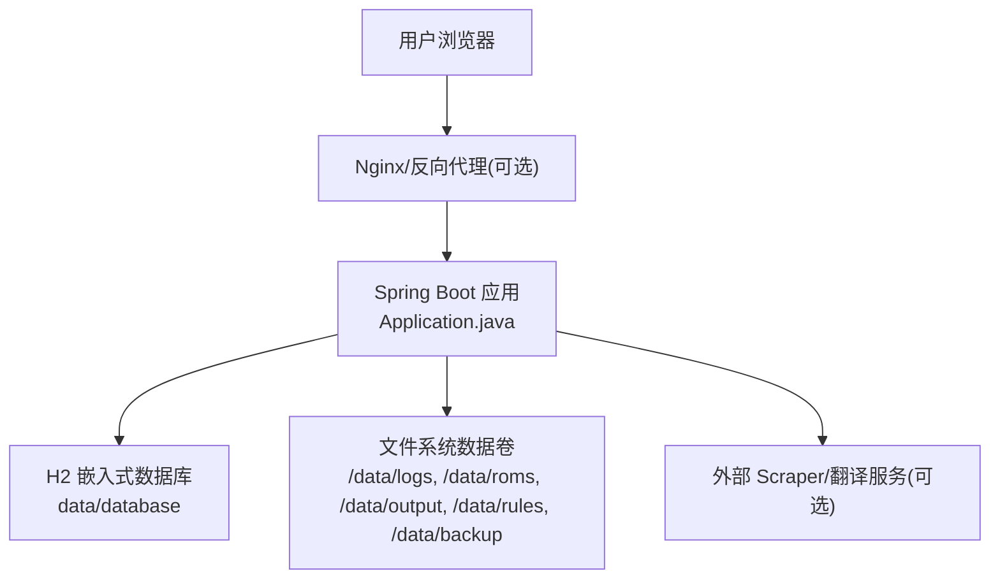
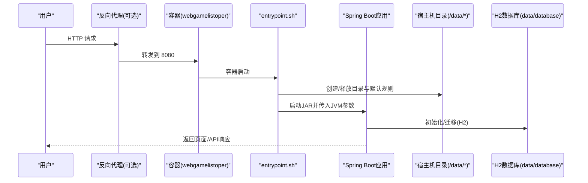
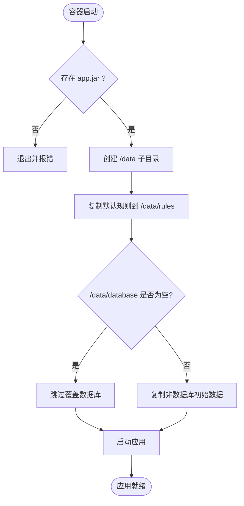
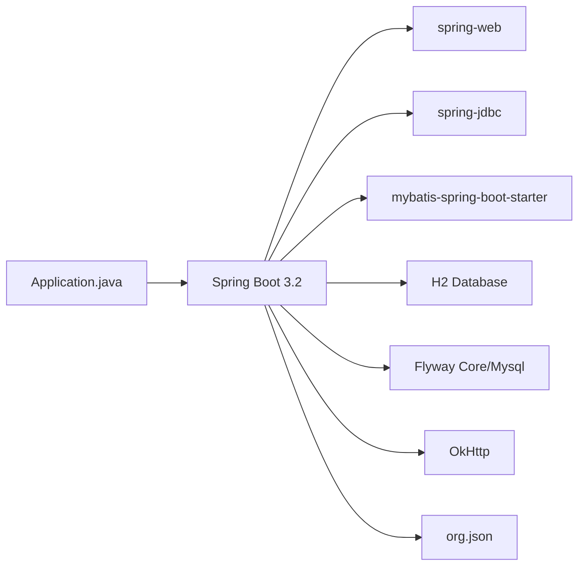

# 部署指南

<cite>
**本文引用的文件**
- [Dockerfile](file://Dockerfile)
- [Dockerfile.multi-stage](file://Dockerfile.multi-stage)
- [docker-compose.yml](file://docker-compose.yml)
- [entrypoint.sh](file://entrypoint.sh)
- [pom.xml](file://pom.xml)
- [application.properties](file://src/main/resources/application.properties)
- [Application.java](file://src/main/java/com/gamelist/Application.java)
- [DatabaseInitializer.java](file://src/main/java/com/gamelist/config/DatabaseInitializer.java)
- [DataDirectoryInitializer.java](file://src/main/java/com/gamelist/config/DataDirectoryInitializer.java)
- [FlywayConfig.java](file://src/main/java/com/gamelist/config/FlywayConfig.java)
- [LogController.java](file://src/main/java/com/gamelist/controller/LogController.java)
- [SettingController.java](file://src/main/java/com/gamelist/controller/SettingController.java)
- [build.bat](file://build.bat)
- [start.bat](file://start.bat)
</cite>

## 目录
1. [简介](#简介)
2. [项目结构](#项目结构)
3. [核心组件](#核心组件)
4. [架构总览](#架构总览)
5. [详细组件分析](#详细组件分析)
6. [依赖关系分析](#依赖关系分析)
7. [性能与容量规划](#性能与容量规划)
8. [故障排查指南](#故障排查指南)
9. [结论](#结论)
10. [附录：部署清单与环境变量](#附录部署清单与环境变量)

## 简介
本指南面向生产环境，提供 WebGameListOper 的三种部署方式：
- Docker 容器化部署（推荐）
- 传统 JAR 包部署
- Windows 原生 EXE 部署

内容涵盖：完整步骤、环境变量、端口映射、数据卷挂载、镜像构建与优化、负载均衡与高可用、健康检查、日志收集、备份恢复、常见问题诊断等。

## 项目结构
- 应用入口与打包配置：见 pom.xml 与 Application.java
- 运行时配置：application.properties（端口、编码、静态资源、数据库、HikariCP、日志等）
- 容器化：Dockerfile、Dockerfile.multi-stage、docker-compose.yml、entrypoint.sh
- 初始化与迁移：DatabaseInitializer、DataDirectoryInitializer、FlywayConfig
- 运维能力：LogController（日志读取）、SettingController（备份/恢复）

图表来源
- [Application.java:8-13](file://src/main/java/com/gamelist/Application.java#L8-L13)
- [application.properties:1-86](file://src/main/resources/application.properties#L1-L86)

章节来源
- [pom.xml:108-150](file://pom.xml#L108-L150)
- [Application.java:8-13](file://src/main/java/com/gamelist/Application.java#L8-L13)
- [application.properties:1-86](file://src/main/resources/application.properties#L1-L86)

## 核心组件
- 启动器：Application.java 启用 Spring Boot、MyBatis MapperScan、异步任务
- 配置中心：application.properties 定义端口、编码、静态资源、数据库、连接池、日志等
- 数据目录初始化：DataDirectoryInitializer 在应用早期创建必要目录
- 数据库初始化：DatabaseInitializer 首次运行执行 init.sql；FlywayConfig 管理迁移
- 容器入口：entrypoint.sh 负责规则释放、目录准备、JVM 参数注入、启动应用
- 运维接口：LogController 提供日志读取；SettingController 提供备份/恢复

章节来源
- [Application.java:8-13](file://src/main/java/com/gamelist/Application.java#L8-L13)
- [application.properties:1-86](file://src/main/resources/application.properties#L1-L86)
- [DataDirectoryInitializer.java:18-106](file://src/main/java/com/gamelist/config/DataDirectoryInitializer.java#L18-L106)
- [DatabaseInitializer.java:23-52](file://src/main/java/com/gamelist/config/DatabaseInitializer.java#L23-L52)
- [FlywayConfig.java:17-44](file://src/main/java/com/gamelist/config/FlywayConfig.java#L17-L44)
- [entrypoint.sh:20-92](file://entrypoint.sh#L20-L92)
- [LogController.java:16-48](file://src/main/java/com/gamelist/controller/LogController.java#L16-L48)
- [SettingController.java:98-124](file://src/main/java/com/gamelist/controller/SettingController.java#L98-L124)

## 架构总览
下图展示容器化部署下的关键交互：Compose 编排、数据卷挂载、健康检查、以及应用内部的数据流。

图表来源
- [docker-compose.yml:1-33](file://docker-compose.yml#L1-L33)
- [entrypoint.sh:20-92](file://entrypoint.sh#L20-L92)
- [application.properties:15-37](file://src/main/resources/application.properties#L15-L37)

## 详细组件分析

### 容器化部署（推荐）
- 镜像构建
  - 基础镜像：多阶段构建，第一阶段使用 Maven 编译，第二阶段仅包含 JRE 与产物，体积更小
  - 静态资源与规则：将默认导出规则、导入模板复制到镜像中，并在启动时释放到 /data/rules
  - 工作目录与端口：WORKDIR /app，EXPOSE 8080
- 运行与编排
  - docker-compose 暴露 8080 端口
  - 数据卷挂载：logs、roms、output、rules、backup、database
  - 环境变量：SPRING_PROFILES_ACTIVE、SERVER_TOMCAT_BASEDIR、静态资源位置、JAVA_OPTS
  - 健康检查：通过 actuator/health 探测
  - 资源限制：CPU/内存限制与预留
- 启动流程
  - entrypoint.sh 创建目录、复制默认规则、保护已有数据库、设置 JVM 参数并启动应用

图表来源
- [entrypoint.sh:27-92](file://entrypoint.sh#L27-L92)
- [docker-compose.yml:1-33](file://docker-compose.yml#L1-L33)

章节来源
- [Dockerfile:1-55](file://Dockerfile#L1-L55)
- [Dockerfile.multi-stage:1-52](file://Dockerfile.multi-stage#L1-L52)
- [docker-compose.yml:1-33](file://docker-compose.yml#L1-L33)
- [entrypoint.sh:20-92](file://entrypoint.sh#L20-L92)

### 传统 JAR 包部署
- 构建
  - 使用 Maven 构建可执行 JAR（spring-boot-maven-plugin repackage）
  - 输出路径：target/webGamelistOper-1.0.6-beta3.jar
- 运行
  - 设置 JAVA_OPTS（堆大小、GC 策略等）
  - 确保 data 目录存在且具备读写权限
  - 端口：默认 8080
- 数据与日志
  - 数据目录：./data（数据库、规则、输入输出等）
  - 日志：logs/application.log（按大小与保留条数滚动）

章节来源
- [pom.xml:108-150](file://pom.xml#L108-L150)
- [application.properties:43-53](file://src/main/resources/application.properties#L43-L53)
- [build.bat:1-42](file://build.bat#L1-L42)
- [start.bat:1-20](file://start.bat#L1-L20)

### Windows 原生 EXE 部署
- 说明
  - 仓库未提供打包为 Windows EXE 的脚本或插件配置
  - 建议采用“JAR 包 + 系统服务”的方式实现类似 EXE 的体验（如使用 nssm 或 Windows Task Scheduler）
- 建议方案
  - 使用 build.bat 构建 JAR
  - 通过 nssm 将 JAR 注册为 Windows 服务，设置启动参数、工作目录、环境变量
  - 或使用计划任务定期拉起 java -jar 进程，配合日志轮转工具

章节来源
- [build.bat:1-42](file://build.bat#L1-L42)
- [start.bat:1-20](file://start.bat#L1-L20)

## 依赖关系分析
- 运行时依赖
  - Spring Boot 3.2 + Java 17
  - MyBatis + HikariCP 连接池
  - H2 嵌入式数据库（文件模式）
  - Flyway 迁移（默认禁用自动迁移，使用自定义配置）
  - OkHttp、JSON 库用于网络与序列化
- 构建期依赖
  - spring-boot-maven-plugin 生成可执行 JAR
  - maven-resources-plugin 控制资源过滤

图表来源
- [pom.xml:23-106](file://pom.xml#L23-L106)
- [Application.java:8-13](file://src/main/java/com/gamelist/Application.java#L8-L13)

章节来源
- [pom.xml:23-106](file://pom.xml#L23-L106)

## 性能与容量规划
- JVM 参数
  - 容器内通过 JAVA_OPTS 设置堆大小与 GC（例如 -Xmx2g -Xms512m -XX:+UseG1GC）
  - 生产环境建议根据实际负载调整堆大小与 Metaspace
- Tomcat 与工作目录
  - 可通过 SERVER_TOMCAT_BASEDIR 指定临时目录，避免写入只读镜像层
- 数据库连接池
  - HikariCP 最大连接数、空闲超时、连接超时等已在 application.properties 配置
- 静态资源缓存
  - 开发环境关闭缓存便于调试；生产环境可按需开启
- 存储与 I/O
  - 将 roms、output、rules、backup、database 挂载到高性能磁盘
  - 日志目录独立挂载，便于集中采集与轮转

章节来源
- [docker-compose.yml:14-18](file://docker-compose.yml#L14-L18)
- [application.properties:21-27](file://src/main/resources/application.properties#L21-L27)
- [application.properties:10-13](file://src/main/resources/application.properties#L10-L13)

## 故障排查指南
- 无法访问应用
  - 检查端口映射与防火墙
  - 查看容器日志与应用日志
- 数据库初始化失败
  - 确认 data/database 目录可写
  - 检查 init.sql 与 Flyway 配置
- 规则/模板未生效
  - 确认 rules 目录已正确挂载
  - 检查 entrypoint.sh 是否成功复制默认规则
- 日志无法查看
  - 确认 logs 目录已挂载
  - 通过 /api/logs/realtime 获取最近日志

章节来源
- [application.properties:15-37](file://src/main/resources/application.properties#L15-L37)
- [entrypoint.sh:68-83](file://entrypoint.sh#L68-L83)
- [LogController.java:16-48](file://src/main/java/com/gamelist/controller/LogController.java#L16-L48)

## 结论
- 推荐使用 Docker 容器化部署，结合 docker-compose 进行编排与数据持久化
- 生产环境应关注 JVM 调优、安全加固、监控日志、备份恢复与高可用
- 若需 EXE 体验，可采用 JAR + 系统服务的方式替代

## 附录：部署清单与环境变量

### Docker 容器化部署（推荐）
- 构建镜像
  - 单阶段：docker build -t webgamelistoper .
  - 多阶段：docker build -f Dockerfile.multi-stage -t webgamelistoper:multi .
- 运行容器
  - 端口映射：8080:8080
  - 数据卷：logs、roms、output、rules、backup、database
  - 环境变量：
    - SPRING_PROFILES_ACTIVE=default
    - SERVER_TOMCAT_BASEDIR=/data
    - SPRING_RESOURCES_STATIC_LOCATIONS=classpath:/static/,file:/data,file:/data/roms,file:/data/output,file:/data/input
    - JAVA_OPTS=-Xmx2g -Xms512m -XX:+UseG1GC
- 健康检查
  - 使用 /actuator/health 进行存活检测
- 资源限制
  - CPU/内存限制与预留

章节来源
- [docker-compose.yml:1-33](file://docker-compose.yml#L1-L33)
- [Dockerfile:1-55](file://Dockerfile#L1-L55)
- [Dockerfile.multi-stage:1-52](file://Dockerfile.multi-stage#L1-L52)
- [entrypoint.sh:20-92](file://entrypoint.sh#L20-L92)

### 传统 JAR 包部署
- 构建：mvn clean package spring-boot:repackage -DskipTests
- 运行：java $JAVA_OPTS -jar target/webGamelistOper-1.0.6-beta3.jar
- 目录：确保 ./data 与 ./logs 存在且可写
- 端口：默认 8080

章节来源
- [pom.xml:108-150](file://pom.xml#L108-L150)
- [application.properties:1-86](file://src/main/resources/application.properties#L1-L86)
- [build.bat:1-42](file://build.bat#L1-L42)
- [start.bat:1-20](file://start.bat#L1-L20)

### Windows 原生 EXE 部署
- 无直接 EXE 构建脚本，建议使用 JAR + 系统服务（nssm/计划任务）
- 设置工作目录为项目根目录，确保 data 与 logs 可写

章节来源
- [build.bat:1-42](file://build.bat#L1-L42)
- [start.bat:1-20](file://start.bat#L1-L20)

### 生产环境最佳实践
- 性能调优
  - 合理设置 JVM 堆与 GC；根据负载调整 HikariCP 连接池参数
  - 静态资源在生产环境可开启缓存
- 安全配置
  - 仅暴露必要端口；使用反向代理（Nginx/Traefik）统一入口
  - 限制上传大小与请求体大小
  - 谨慎暴露 H2 Console（默认已启用，生产建议关闭或限制访问）
- 监控与日志
  - 使用 /actuator/health 做健康检查
  - 日志文件挂载至宿主机，配合日志采集（如 Filebeat/Fluent Bit）
- 备份与恢复
  - 使用 SettingController 提供的备份/恢复接口
  - 定期备份 /data/backup 与 /data/database
- 负载均衡与高可用
  - 多实例部署 + 反向代理负载均衡
  - 共享外部存储（roms/output/rules）与数据库（如需切换 MySQL，需修改 datasource.url 与驱动）

章节来源
- [application.properties:55-58](file://src/main/resources/application.properties#L55-L58)
- [application.properties:72-74](file://src/main/resources/application.properties#L72-L74)
- [SettingController.java:98-124](file://src/main/java/com/gamelist/controller/SettingController.java#L98-L124)
- [SettingController.java:311-339](file://src/main/java/com/gamelist/controller/SettingController.java#L311-L339)

### 健康检查、日志收集、备份恢复
- 健康检查
  - 容器健康检查：/actuator/health
- 日志收集
  - 应用日志：logs/application.log
  - 实时日志接口：/api/logs/realtime
- 备份恢复
  - 备份：/api/settings/backup/database?backupPath=/data/backup
  - 恢复：/api/settings/restore/database?backupFile=/data/backup/xxx.sql

章节来源
- [docker-compose.yml:20-25](file://docker-compose.yml#L20-L25)
- [LogController.java:16-48](file://src/main/java/com/gamelist/controller/LogController.java#L16-L48)
- [SettingController.java:98-124](file://src/main/java/com/gamelist/controller/SettingController.java#L98-L124)
- [SettingController.java:311-339](file://src/main/java/com/gamelist/controller/SettingController.java#L311-L339)