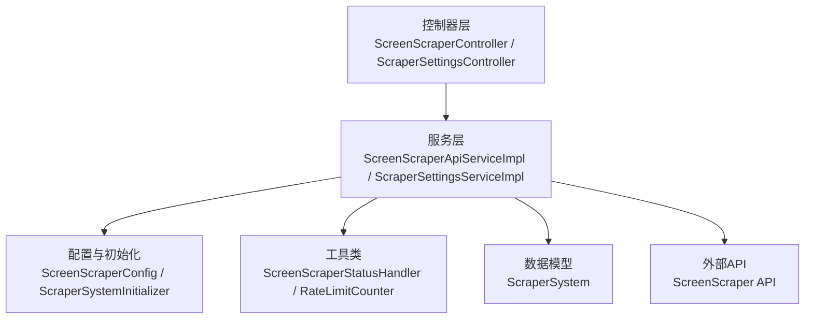
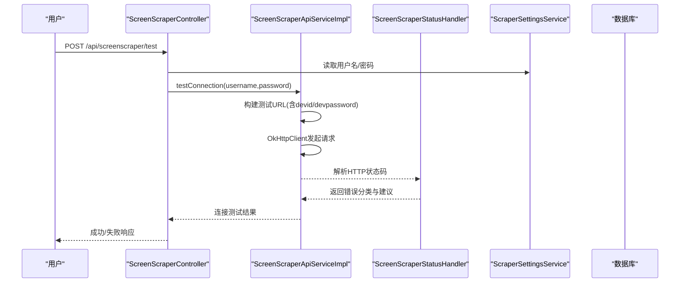
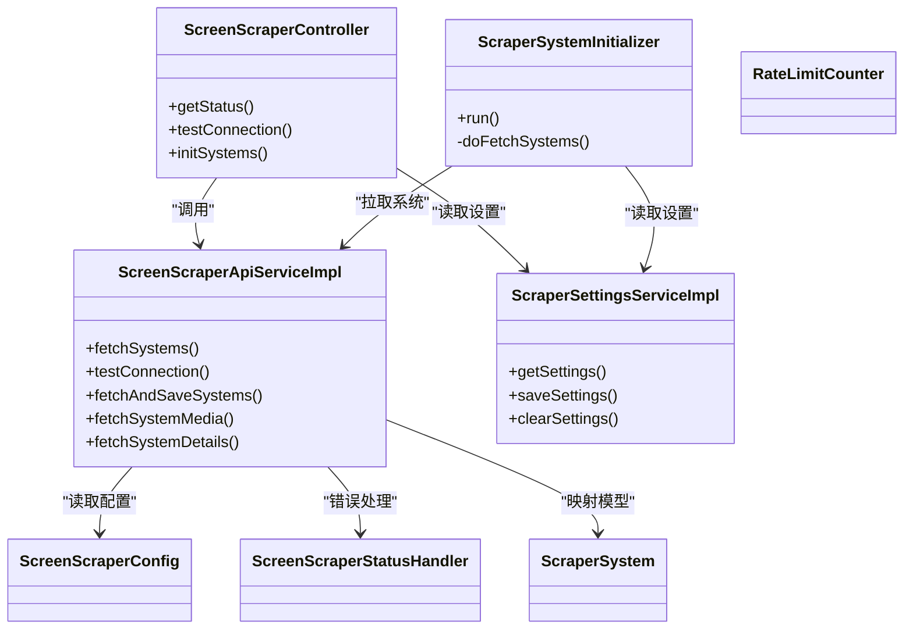

# Scraper系统配置

<cite>
**本文引用的文件**
- [ScreenScraperConfig.java](file://src/main/java/com/gamelist/config/ScreenScraperConfig.java)
- [application.properties](file://src/main/resources/application.properties)
- [ScreenScraperApiServiceImpl.java](file://src/main/java/com/gamelist/service/impl/ScreenScraperApiServiceImpl.java)
- [ScreenScraperStatusHandler.java](file://src/main/java/com/gamelist/util/ScreenScraperStatusHandler.java)
- [RateLimitCounter.java](file://src/main/java/com/gamelist/util/RateLimitCounter.java)
- [ScraperSettingsController.java](file://src/main/java/com/gamelist/controller/ScraperSettingsController.java)
- [ScraperSettingsServiceImpl.java](file://src/main/java/com/gamelist/service/impl/ScraperSettingsServiceImpl.java)
- [ScreenScraperController.java](file://src/main/java/com/gamelist/controller/ScreenScraperController.java)
- [ScraperSystemInitializer.java](file://src/main/java/com/gamelist/config/ScraperSystemInitializer.java)
- [ScraperSystem.java](file://src/main/java/com/gamelist/model/ScraperSystem.java)
- [screenscraper-media-mapping.md](file://docs/screenscraper-media-mapping.md)
</cite>

## 目录
1. [简介](#简介)
2. [项目结构](#项目结构)
3. [核心组件](#核心组件)
4. [架构总览](#架构总览)
5. [详细组件分析](#详细组件分析)
6. [依赖关系分析](#依赖关系分析)
7. [性能与可靠性](#性能与可靠性)
8. [故障排查指南](#故障排查指南)
9. [结论](#结论)
10. [附录：配置示例与集成步骤](#附录：配置示例与集成步骤)

## 简介
本文件面向WebGameListOper中的Scraper子系统，聚焦ScreenScraper API的完整配置与使用。内容涵盖：
- ScreenScraper API密钥与基础URL配置
- 请求频率控制、超时设置、重试机制
- Scraper初始化流程、系统信息获取、元数据映射
- Scraper设置管理接口（启用/禁用、优先级、失败处理）
- 最佳实践（网络异常处理、缓存策略、性能优化）
- 监控与日志配置、常见问题诊断与解决方案
- 实际配置示例与集成步骤

## 项目结构
Scraper相关代码主要分布在以下包：
- config：配置类与启动初始化
- service/impl：API调用实现、设置持久化
- controller：对外暴露的管理与测试接口
- util：状态码处理、限流计数等工具
- model：ScraperSystem模型定义
- docs：媒体类型映射文档

图表来源
- [ScreenScraperController.java:18-35](file://src/main/java/com/gamelist/controller/ScreenScraperController.java#L18-L35)
- [ScraperSettingsController.java:10-18](file://src/main/java/com/gamelist/controller/ScraperSettingsController.java#L10-L18)
- [ScreenScraperApiServiceImpl.java:30-43](file://src/main/java/com/gamelist/service/impl/ScreenScraperApiServiceImpl.java#L30-L43)
- [ScraperSettingsServiceImpl.java:18-22](file://src/main/java/com/gamelist/service/impl/ScraperSettingsServiceImpl.java#L18-L22)
- [ScreenScraperConfig.java:6-13](file://src/main/java/com/gamelist/config/ScreenScraperConfig.java#L6-L13)
- [ScraperSystemInitializer.java:19-41](file://src/main/java/com/gamelist/config/ScraperSystemInitializer.java#L19-L41)
- [ScreenScraperStatusHandler.java:15-43](file://src/main/java/com/gamelist/util/ScreenScraperStatusHandler.java#L15-L43)
- [RateLimitCounter.java:13-23](file://src/main/java/com/gamelist/util/RateLimitCounter.java#L13-L23)
- [ScraperSystem.java:1-36](file://src/main/java/com/gamelist/model/ScraperSystem.java#L1-L36)

章节来源
- [ScreenScraperController.java:18-119](file://src/main/java/com/gamelist/controller/ScreenScraperController.java#L18-L119)
- [ScraperSettingsController.java:10-66](file://src/main/java/com/gamelist/controller/ScraperSettingsController.java#L10-L66)
- [ScreenScraperApiServiceImpl.java:30-806](file://src/main/java/com/gamelist/service/impl/ScreenScraperApiServiceImpl.java#L30-L806)
- [ScraperSettingsServiceImpl.java:18-117](file://src/main/java/com/gamelist/service/impl/ScraperSettingsServiceImpl.java#L18-L117)
- [ScreenScraperConfig.java:6-46](file://src/main/java/com/gamelist/config/ScreenScraperConfig.java#L6-L46)
- [ScraperSystemInitializer.java:19-119](file://src/main/java/com/gamelist/config/ScraperSystemInitializer.java#L19-L119)
- [ScreenScraperStatusHandler.java:15-213](file://src/main/java/com/gamelist/util/ScreenScraperStatusHandler.java#L15-L213)
- [RateLimitCounter.java:13-138](file://src/main/java/com/gamelist/util/RateLimitCounter.java#L13-L138)
- [ScraperSystem.java:1-228](file://src/main/java/com/gamelist/model/ScraperSystem.java#L1-L228)

## 核心组件
- ScreenScraperConfig：集中管理ScreenScraper的基础URL与开发者凭证（devPseudo/devPassword），支持通过配置前缀注入。
- ScreenScraperApiServiceImpl：封装HTTP客户端OkHttpClient，负责构建请求URL、发送请求、解析JSON响应、分页拉取系统列表、保存至数据库。
- ScreenScraperStatusHandler：统一处理ScreenScraper返回的HTTP状态码，提供错误分类、建议、重试间隔、是否立即停止等决策。
- RateLimitCounter：本地限流计数器，用于在短时间窗口内限制访问次数，避免触发远端配额限制。
- ScraperSettingsController/ScraperSettingsServiceImpl：提供Scraper设置的CRUD接口，持久化到本地JSON文件，并对敏感字段进行加密存储。
- ScreenScraperController：对外暴露连接测试、状态查询、系统初始化等接口。
- ScraperSystemInitializer：应用启动时检查scraper_system表是否为空，为空则异步拉取并保存系统列表。
- ScraperSystem：Scraper系统元数据模型，包含多语言名称、公司、发行年份、图标等字段。

章节来源
- [ScreenScraperConfig.java:6-46](file://src/main/java/com/gamelist/config/ScreenScraperConfig.java#L6-L46)
- [ScreenScraperApiServiceImpl.java:30-806](file://src/main/java/com/gamelist/service/impl/ScreenScraperApiServiceImpl.java#L30-L806)
- [ScreenScraperStatusHandler.java:15-213](file://src/main/java/com/gamelist/util/ScreenScraperStatusHandler.java#L15-L213)
- [RateLimitCounter.java:13-138](file://src/main/java/com/gamelist/util/RateLimitCounter.java#L13-L138)
- [ScraperSettingsController.java:10-66](file://src/main/java/com/gamelist/controller/ScraperSettingsController.java#L10-L66)
- [ScraperSettingsServiceImpl.java:18-117](file://src/main/java/com/gamelist/service/impl/ScraperSettingsServiceImpl.java#L18-L117)
- [ScreenScraperController.java:18-119](file://src/main/java/com/gamelist/controller/ScreenScraperController.java#L18-L119)
- [ScraperSystemInitializer.java:19-119](file://src/main/java/com/gamelist/config/ScraperSystemInitializer.java#L19-L119)
- [ScraperSystem.java:1-228](file://src/main/java/com/gamelist/model/ScraperSystem.java#L1-L228)

## 架构总览
Scraper系统采用分层架构：
- 控制器层：接收外部请求，调用服务层完成业务逻辑。
- 服务层：封装ScreenScraper API调用、设置持久化、系统列表拉取与入库。
- 配置与初始化：应用启动时根据配置加载参数，必要时异步初始化系统列表。
- 工具层：统一错误处理、限流控制、SSL/TLS配置。
- 数据模型：ScraperSystem承载系统元数据。

图表来源
- [ScreenScraperController.java:51-88](file://src/main/java/com/gamelist/controller/ScreenScraperController.java#L51-L88)
- [ScreenScraperApiServiceImpl.java:253-277](file://src/main/java/com/gamelist/service/impl/ScreenScraperApiServiceImpl.java#L253-L277)
- [ScreenScraperStatusHandler.java:138-170](file://src/main/java/com/gamelist/util/ScreenScraperStatusHandler.java#L138-L170)
- [ScraperSettingsServiceImpl.java:44-79](file://src/main/java/com/gamelist/service/impl/ScraperSettingsServiceImpl.java#L44-L79)

## 详细组件分析

### ScreenScraper API配置
- 基础URL与开发者凭证：通过ScreenScraperConfig以配置前缀注入，包括baseUrl、devPseudo、devPassword。这些值会拼接到API请求URL中作为鉴权参数。
- 运行时配置：application.properties可调整服务器端口、编码、静态资源路径、数据库连接池等；Scraper相关配置通过@ConfigurationProperties绑定。
- 安全与TLS：OkHttpClient在构造时启用现代TLS版本，并配置连接池、超时、重定向与重试策略。

章节来源
- [ScreenScraperConfig.java:6-46](file://src/main/java/com/gamelist/config/ScreenScraperConfig.java#L6-L46)
- [application.properties:1-86](file://src/main/resources/application.properties#L1-L86)
- [ScreenScraperApiServiceImpl.java:45-104](file://src/main/java/com/gamelist/service/impl/ScreenScraperApiServiceImpl.java#L45-L104)

### 请求频率控制与超时设置
- 超时：连接超时60秒、读超时120秒、写超时60秒，确保长耗时操作不会过早中断。
- 重试：OkHttpClient开启连接失败重试，结合状态码判断是否需要等待或降级。
- 限流：RateLimitCounter提供滑动窗口限流，防止短时间内高频请求触发远端配额限制。
- 分页：系统列表按页拉取，每页固定数量，达到阈值或无更多数据时停止。

章节来源
- [ScreenScraperApiServiceImpl.java:66-103](file://src/main/java/com/gamelist/service/impl/ScreenScraperApiServiceImpl.java#L66-L103)
- [ScreenScraperApiServiceImpl.java:106-251](file://src/main/java/com/gamelist/service/impl/ScreenScraperApiServiceImpl.java#L106-L251)
- [RateLimitCounter.java:13-79](file://src/main/java/com/gamelist/util/RateLimitCounter.java#L13-L79)

### 错误重试机制与状态处理
- 状态码分类：ScreenScraperStatusHandler将HTTP状态码映射为错误类型（认证错误、配额限制、服务端错误等），并提供建议与重试间隔。
- 自动停止策略：对某些致命错误（如423、426、429、430、431）建议立即停止刮削，避免浪费资源。
- 重试策略：对可重试错误（如401、423、429）提供重试建议，结合限流与退避策略降低失败率。

章节来源
- [ScreenScraperStatusHandler.java:15-213](file://src/main/java/com/gamelist/util/ScreenScraperStatusHandler.java#L15-L213)
- [ScreenScraperApiServiceImpl.java:125-147](file://src/main/java/com/gamelist/service/impl/ScreenScraperApiServiceImpl.java#L125-L147)

### Scraper初始化流程
- 启动检查：应用启动时，ScraperSystemInitializer检查scraper_system表是否为空。
- 异步拉取：若为空，则在后台线程异步调用ScreenScraperApiService拉取系统列表并批量入库。
- 状态跟踪：维护初始化状态（未初始化、初始化中、已完成、失败）与最后错误信息，便于前端展示与干预。

章节来源
- [ScraperSystemInitializer.java:19-119](file://src/main/java/com/gamelist/config/ScraperSystemInitializer.java#L19-L119)
- [ScreenScraperApiServiceImpl.java:279-426](file://src/main/java/com/gamelist/service/impl/ScreenScraperApiServiceImpl.java#L279-L426)

### 系统信息获取与元数据映射
- 系统列表：通过/systemesListe.php接口分页获取系统元数据，解析noms对象或多语言字段，填充ScraperSystem模型。
- 媒体URL构建：通过/mediaSysteme.php接口构建系统媒体URL，支持指定媒体类型与区域。
- 媒体映射：遵循screenscraper-media-mapping.md定义的媒体类型到Game字段的映射规则，确保导入一致性。

章节来源
- [ScreenScraperApiServiceImpl.java:428-460](file://src/main/java/com/gamelist/service/impl/ScreenScraperApiServiceImpl.java#L428-L460)
- [ScreenScraperApiServiceImpl.java:648-696](file://src/main/java/com/gamelist/service/impl/ScreenScraperApiServiceImpl.java#L648-L696)
- [ScraperSystem.java:1-228](file://src/main/java/com/gamelist/model/ScraperSystem.java#L1-L228)
- [screenscraper-media-mapping.md:1-189](file://docs/screenscraper-media-mapping.md#L1-L189)

### Scraper设置管理接口
- 获取设置：GET /api/settings/scraper，返回当前用户名与密码（已解密）。
- 保存设置：POST /api/settings/scraper，提交用户名与密码，服务层加密后持久化到本地JSON文件。
- 清除设置：DELETE /api/settings/scraper，清空用户名与密码。
- 连接测试：POST /api/screenscraper/test，验证凭据有效性，区分游客模式与用户模式。
- 初始化系统：POST /api/screenscraper/init，清空现有系统列表并重新拉取。

章节来源
- [ScraperSettingsController.java:20-66](file://src/main/java/com/gamelist/controller/ScraperSettingsController.java#L20-L66)
- [ScraperSettingsServiceImpl.java:44-117](file://src/main/java/com/gamelist/service/impl/ScraperSettingsServiceImpl.java#L44-L117)
- [ScreenScraperController.java:37-119](file://src/main/java/com/gamelist/controller/ScreenScraperController.java#L37-L119)

## 依赖关系分析
- 控制器依赖服务：ScreenScraperController依赖ScreenScraperApiService与ScraperSettingsService。
- 服务依赖配置与工具：ScreenScraperApiServiceImpl依赖ScreenScraperConfig与ScreenScraperStatusHandler。
- 初始化器依赖服务：ScraperSystemInitializer依赖ScraperSystemService与ScreenScraperApiService。
- 设置服务依赖加密工具：ScraperSettingsServiceImpl依赖EncryptionUtil进行敏感字段加密。

图表来源
- [ScreenScraperController.java:18-35](file://src/main/java/com/gamelist/controller/ScreenScraperController.java#L18-L35)
- [ScreenScraperApiServiceImpl.java:30-43](file://src/main/java/com/gamelist/service/impl/ScreenScraperApiServiceImpl.java#L30-L43)
- [ScraperSettingsServiceImpl.java:18-22](file://src/main/java/com/gamelist/service/impl/ScraperSettingsServiceImpl.java#L18-L22)
- [ScraperSystemInitializer.java:19-41](file://src/main/java/com/gamelist/config/ScraperSystemInitializer.java#L19-L41)
- [ScreenScraperConfig.java:6-13](file://src/main/java/com/gamelist/config/ScreenScraperConfig.java#L6-L13)
- [ScreenScraperStatusHandler.java:15-43](file://src/main/java/com/gamelist/util/ScreenScraperStatusHandler.java#L15-L43)
- [RateLimitCounter.java:13-23](file://src/main/java/com/gamelist/util/RateLimitCounter.java#L13-L23)
- [ScraperSystem.java:1-36](file://src/main/java/com/gamelist/model/ScraperSystem.java#L1-L36)

## 性能与可靠性
- 连接池：OkHttpClient配置连接池大小与空闲时间，减少握手开销。
- 超时与重试：合理设置超时时间与重试策略，提升在网络波动时的成功率。
- 限流：使用RateLimitCounter控制短期请求频率，避免触发远端配额限制。
- 分页与批处理：系统列表分页拉取，批量插入数据库，减少IO次数。
- TLS兼容：启用多种TLS版本，提高与服务端的兼容性。

章节来源
- [ScreenScraperApiServiceImpl.java:66-103](file://src/main/java/com/gamelist/service/impl/ScreenScraperApiServiceImpl.java#L66-L103)
- [ScreenScraperApiServiceImpl.java:106-251](file://src/main/java/com/gamelist/service/impl/ScreenScraperApiServiceImpl.java#L106-L251)
- [RateLimitCounter.java:13-79](file://src/main/java/com/gamelist/util/RateLimitCounter.java#L13-L79)

## 故障排查指南
- 认证失败（401/403）：检查用户名/密码是否正确，确认开发者凭证有效。
- 配额限制（429/430/431）：降低请求频率，等待配额恢复，或使用更高权限账户。
- 服务端错误（423/5xx）：等待官方修复或稍后重试，关注服务状态。
- 非JSON响应：检查Content-Type与响应体，确认API返回格式正确。
- SSL握手失败：检查TLS版本与证书信任链，必要时调整JVM参数。

章节来源
- [ScreenScraperStatusHandler.java:138-213](file://src/main/java/com/gamelist/util/ScreenScraperStatusHandler.java#L138-L213)
- [ScreenScraperApiServiceImpl.java:125-147](file://src/main/java/com/gamelist/service/impl/ScreenScraperApiServiceImpl.java#L125-L147)
- [ScreenScraperApiServiceImpl.java:404-422](file://src/main/java/com/gamelist/service/impl/ScreenScraperApiServiceImpl.java#L404-L422)

## 结论
Scraper系统通过清晰的配置、健壮的错误处理与合理的性能优化，实现了与ScreenScraper API的稳定集成。通过设置管理接口与初始化流程，用户可以便捷地配置凭据、测试连接、拉取系统列表，并结合媒体映射规则完成元数据导入。建议在生产环境中结合限流、缓存与监控，进一步提升系统的可靠性与可维护性。

## 附录：配置示例与集成步骤

### 配置ScreenScraper API
- 基础URL与开发者凭证：在配置文件中设置baseUrl、devPseudo、devPassword，或通过环境变量注入。
- 超时与重试：调整OkHttpClient的超时与重试策略，适应不同网络环境。
- 限流：启用RateLimitCounter，控制短期请求频率，避免触发配额限制。

章节来源
- [ScreenScraperConfig.java:6-46](file://src/main/java/com/gamelist/config/ScreenScraperConfig.java#L6-L46)
- [ScreenScraperApiServiceImpl.java:66-103](file://src/main/java/com/gamelist/service/impl/ScreenScraperApiServiceImpl.java#L66-L103)
- [RateLimitCounter.java:13-79](file://src/main/java/com/gamelist/util/RateLimitCounter.java#L13-L79)

### 集成步骤
1. 配置凭据：通过/api/settings/scraper保存用户名与密码。
2. 测试连接：调用/api/screenscraper/test验证凭据有效性。
3. 初始化系统：调用/api/screenscraper/init拉取系统列表并入库。
4. 查看状态：通过/api/screenscraper/status了解当前模式与凭据状态。
5. 媒体映射：遵循screenscraper-media-mapping.md进行媒体类型映射。

章节来源
- [ScraperSettingsController.java:20-66](file://src/main/java/com/gamelist/controller/ScraperSettingsController.java#L20-L66)
- [ScreenScraperController.java:37-119](file://src/main/java/com/gamelist/controller/ScreenScraperController.java#L37-L119)
- [screenscraper-media-mapping.md:1-189](file://docs/screenscraper-media-mapping.md#L1-L189)