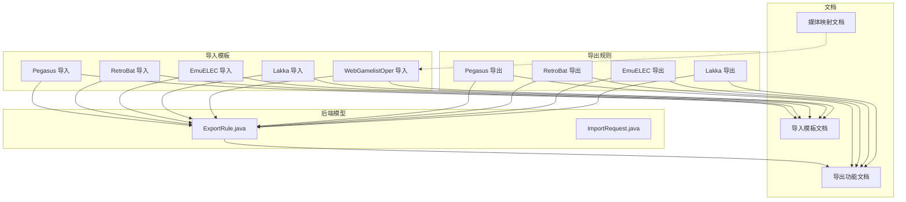
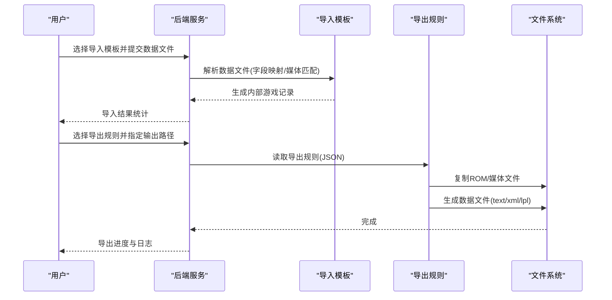
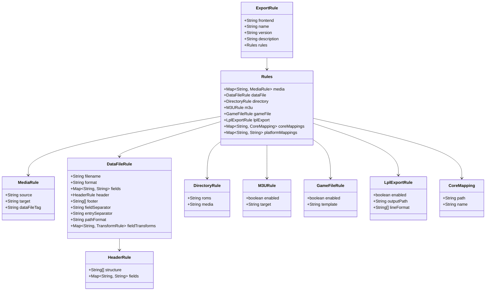

# 导入导出规则配置

<cite>
**本文引用的文件**
- [rules/import/pegasus.json](file://rules/import/pegasus.json)
- [rules/export/pegasus.json](file://rules/export/pegasus.json)
- [rules/import/retrobat.json](file://rules/import/retrobat.json)
- [rules/export/retrobat.json](file://rules/export/retrobat.json)
- [rules/import/emuelec.json](file://rules/import/emuelec.json)
- [rules/export/emuelec.json](file://rules/export/emuelec.json)
- [rules/import/lakka.json](file://rules/import/lakka.json)
- [rules/export/lakka.json](file://rules/export/lakka.json)
- [rules/import/webgamelistoper.json](file://rules/import/webgamelistoper.json)
- [rules/translation-config.json](file://rules/translation-config.json)
- [src/main/java/com/gamelist/model/ExportRule.java](file://src/main/java/com/gamelist/model/ExportRule.java)
- [src/main/java/com/gamelist/model/ImportRequest.java](file://src/main/java/com/gamelist/model/ImportRequest.java)
- [docs/import-templates-cn.md](file://docs/import-templates-cn.md)
- [docs/export-functionality-cn.md](file://docs/export-functionality-cn.md)
- [docs/media-mapping-cn.md](file://docs/media-mapping-cn.md)
</cite>

## 目录
1. [简介](#简介)
2. [项目结构](#项目结构)
3. [核心组件](#核心组件)
4. [架构总览](#架构总览)
5. [详细组件分析](#详细组件分析)
6. [依赖关系分析](#依赖关系分析)
7. [性能考虑](#性能考虑)
8. [故障排查指南](#故障排查指南)
9. [结论](#结论)
10. [附录](#附录)

## 简介
本文件系统性说明 WebGameListOper 的导入与导出规则配置，覆盖导入模板 JSON 结构（字段映射、数据转换、验证、必填项）、导出规则 JSON 格式（目标格式、字段映射、媒体处理、排序）、内置模板使用方法与自定义方法、字段映射最佳实践、错误处理与验证配置，以及常见问题解决方案。内容基于仓库中 rules 目录下的模板与文档、以及后端模型类 ExportRule 的实现契约进行整理。

## 项目结构
- 导入模板位于 rules/import/*.json，定义不同前端的数据解析、字段映射与媒体匹配规则。
- 导出规则位于 rules/export/*.json，定义导出数据文件格式、媒体拷贝路径、M3U/LPL 等特殊输出。
- 翻译服务配置位于 rules/translation-config.json，用于名称与描述的批量翻译。
- 后端模型 ExportRule.java 定义了导出规则的 JSON 结构及解析逻辑（含兼容旧版表头数组）。
- 文档 docs/* 提供了导入模板、导出功能、媒体映射的详细说明。

图表来源
- [rules/import/pegasus.json:1-556](file://rules/import/pegasus.json#L1-L556)
- [rules/export/pegasus.json:1-93](file://rules/export/pegasus.json#L1-L93)
- [rules/import/retrobat.json:1-435](file://rules/import/retrobat.json#L1-L435)
- [rules/export/retrobat.json:1-92](file://rules/export/retrobat.json#L1-L92)
- [rules/import/emuelec.json:1-206](file://rules/import/emuelec.json#L1-L206)
- [rules/export/emuelec.json:1-102](file://rules/export/emuelec.json#L1-L102)
- [rules/import/lakka.json:1-58](file://rules/import/lakka.json#L1-L58)
- [rules/export/lakka.json:1-73](file://rules/export/lakka.json#L1-L73)
- [rules/import/webgamelistoper.json:1-334](file://rules/import/webgamelistoper.json#L1-L334)
- [src/main/java/com/gamelist/model/ExportRule.java:1-519](file://src/main/java/com/gamelist/model/ExportRule.java#L1-L519)
- [docs/import-templates-cn.md:1-800](file://docs/import-templates-cn.md#L1-L800)
- [docs/export-functionality-cn.md:1-800](file://docs/export-functionality-cn.md#L1-L800)
- [docs/media-mapping-cn.md:1-274](file://docs/media-mapping-cn.md#L1-L274)

章节来源
- [docs/import-templates-cn.md:1-800](file://docs/import-templates-cn.md#L1-L800)
- [docs/export-functionality-cn.md:1-800](file://docs/export-functionality-cn.md#L1-L800)

## 核心组件
- 导入模板：负责将外部前端的数据文件（XML/文本）解析为系统内部统一的游戏记录，并匹配媒体文件。
- 导出规则：负责将系统内游戏数据导出为目标前端的可识别格式（文本/XML/LPL），同时复制媒体文件到约定目录。
- 翻译配置：提供多语言翻译服务的请求参数、响应路径与校验要求。
- 后端模型：ExportRule.java 定义了导出规则的 JSON 结构，包括媒体规则、数据文件规则、目录规则、M3U/LPL 导出等；ImportRequest.java 表示导入请求的基本结构。

章节来源
- [src/main/java/com/gamelist/model/ExportRule.java:1-519](file://src/main/java/com/gamelist/model/ExportRule.java#L1-L519)
- [src/main/java/com/gamelist/model/ImportRequest.java:1-29](file://src/main/java/com/gamelist/model/ImportRequest.java#L1-L29)
- [rules/translation-config.json:1-149](file://rules/translation-config.json#L1-L149)

## 架构总览
导入流程：选择导入模板 → 解析数据文件（XML/文本）→ 字段映射 → 媒体匹配 → 生成内部游戏记录。
导出流程：选择导出规则 → 复制 ROM/媒体文件 → 生成数据文件（text/xml/lpl）→ 可选 M3U/LPL 处理。

图表来源
- [rules/import/pegasus.json:1-556](file://rules/import/pegasus.json#L1-L556)
- [rules/export/pegasus.json:1-93](file://rules/export/pegasus.json#L1-L93)
- [rules/import/retrobat.json:1-435](file://rules/import/retrobat.json#L1-L435)
- [rules/export/retrobat.json:1-92](file://rules/export/retrobat.json#L1-L92)
- [rules/import/emuelec.json:1-206](file://rules/import/emuelec.json#L1-L206)
- [rules/export/emuelec.json:1-102](file://rules/export/emuelec.json#L1-L102)
- [rules/import/lakka.json:1-58](file://rules/import/lakka.json#L1-L58)
- [rules/export/lakka.json:1-73](file://rules/export/lakka.json#L1-L73)
- [rules/import/webgamelistoper.json:1-334](file://rules/import/webgamelistoper.json#L1-L334)
- [src/main/java/com/gamelist/model/ExportRule.java:1-519](file://src/main/java/com/gamelist/model/ExportRule.java#L1-L519)

## 详细组件分析

### 导入模板通用结构
- 基本信息：frontend、name、version、description、type（xml/text）、dataFile、delimiter。
- 规则包装器 rules：
  - header：表头提取（XML或key-value），支持 startMarker/endMarker、structure、fields。
  - fieldMappings：字段映射，支持 fields 列表、isMultiValue、valuePrefix、transform（path/trim/case/replace）。
  - media：媒体类型与路径模板匹配（source、rules[]、transform）。
  - extensions：图片/视频扩展名白名单。
  - gameExtensions：游戏文件扩展名白名单。

章节来源
- [docs/import-templates-cn.md:1-800](file://docs/import-templates-cn.md#L1-L800)
- [rules/import/pegasus.json:1-556](file://rules/import/pegasus.json#L1-L556)
- [rules/import/retrobat.json:1-435](file://rules/import/retrobat.json#L1-L435)
- [rules/import/emuelec.json:1-206](file://rules/import/emuelec.json#L1-L206)
- [rules/import/lakka.json:1-58](file://rules/import/lakka.json#L1-L58)
- [rules/import/webgamelistoper.json:1-334](file://rules/import/webgamelistoper.json#L1-L334)

### Pegasus 导入模板要点
- type=text，dataFile=metadata.pegasus.txt，delimiter=:。
- header 使用 key-value 格式，支持 collection/sort-by/launch 等。
- fieldMappings 覆盖 name/description/releaseDate/developer/publisher/genre/players/files/rating 及多种媒体字段。
- media.rules 提供大量媒体路径模板，支持 {filename}/{ext} 变量替换。
- extensions/gameExtensions 定义支持的媒体与游戏文件扩展名。

章节来源
- [rules/import/pegasus.json:1-556](file://rules/import/pegasus.json#L1-L556)
- [docs/import-templates-cn.md:376-526](file://docs/import-templates-cn.md#L376-L526)

### RetroBat 导入模板要点
- type=xml，dataFile=gamelist.xml。
- header 使用 XML 格式，startMarker=<provider>，endMarker=</provider>，支持 System/software/database/web/launch/sort-by/description。
- fieldMappings 覆盖常见元数据与媒体字段，files 支持 path/file。
- media.rules 提供盒封面、截图、视频、轮图、横幅、同人图等路径模板。

章节来源
- [rules/import/retrobat.json:1-435](file://rules/import/retrobat.json#L1-L435)

### EmuELEC 导入模板要点
- type=xml，dataFile=gamelist.xml，header 默认关闭。
- fieldMappings 包含 name/description/releaseDate/developer/publisher/genre/players/rating/hash/files/image/video/thumbnail/marquee。
- media.rules 针对 EmuELEC 的 downloaded_images/{platform}/... 路径结构进行匹配。

章节来源
- [rules/import/emuelec.json:1-206](file://rules/import/emuelec.json#L1-L206)

### Lakka 导入模板要点
- type=text，dataFile=*.lpl，textFormat.linesPerEntry=6，autoDetect=true，supportedLineCounts=[5,6]。
- lineMappings 将每行映射到 files/name/corePath/coreName/databaseLink/playlistName。
- fieldMappings 仅包含必要字段，extensions 限定图片扩展名，gameExtensions 限定游戏扩展名。

章节来源
- [rules/import/lakka.json:1-58](file://rules/import/lakka.json#L1-L58)

### WebGamelistOper 导入模板要点
- type=xml，dataFile=gamelist.xml，header 默认关闭。
- fieldMappings 覆盖广泛元数据与媒体字段，files 支持 path/file。
- media.rules 针对 scraper/games/{platform}/{gameId}/{region}/... 的路径结构进行匹配，覆盖大量媒体类型（boxFront/Back/3D、screenshot、video、marquee、fanart、poster、manual、music 等）。

章节来源
- [rules/import/webgamelistoper.json:1-334](file://rules/import/webgamelistoper.json#L1-L334)
- [docs/media-mapping-cn.md:26-67](file://docs/media-mapping-cn.md#L26-L67)

### 导出规则通用结构
- 基本信息：frontend、name、version、description。
- rules：
  - media：媒体源字段 source、目标路径 target、数据文件标签 dataFileTag。
  - dataFile：文件名 filename、格式 format（text/xml/lpl）、分隔符/条目分隔符、header/footer、fields 映射、pathFormat、fieldTransforms。
  - directory：roms/media 目录模板。
  - m3u：是否启用 M3U 处理及目标路径模板。
  - lplExport：Lakka LPL 导出开关、输出路径、lineFormat。
  - coreMappings/platformMappings：平台与核心映射。

章节来源
- [docs/export-functionality-cn.md:1-800](file://docs/export-functionality-cn.md#L1-L800)
- [src/main/java/com/gamelist/model/ExportRule.java:1-519](file://src/main/java/com/gamelist/model/ExportRule.java#L1-L519)

### Pegasus 导出规则要点
- media 定义 video/box2dfront/box2dback/box3d/screenshot/wheel/marquee/fanart 的目标路径与 dataFileTag。
- dataFile.filename=metadata.pegasus.txt，format=text，pathFormat=relative，header.structure 包含 collection/sort-by/launch，fields 映射 name/description/rating/releaseYear/developer/publisher/genre/players/region。
- directory.roms/media 使用 {outputPath}/{platform.system} 模板。
- m3u.enabled=true，target={romsPath}。

章节来源
- [rules/export/pegasus.json:1-93](file://rules/export/pegasus.json#L1-L93)
- [docs/export-functionality-cn.md:118-173](file://docs/export-functionality-cn.md#L118-L173)

### RetroBat 导出规则要点
- media 定义 box2dfront/box2dback/box3d/screenshot/video/wheel/marquee/fanart 的目标路径与 dataFileTag。
- dataFile.filename=gamelist.xml，format=xml，pathFormat=absoluteWithDot，header.structure 包含 provider/System/software/database/web，fields 映射 title/path/description/rating/releaseDate/developer/publisher/genre/players/region。
- directory.roms/media 使用 {outputPath}/{platform} 模板。

章节来源
- [rules/export/retrobat.json:1-92](file://rules/export/retrobat.json#L1-L92)
- [docs/export-functionality-cn.md:175-238](file://docs/export-functionality-cn.md#L175-L238)

### EmuELEC 导出规则要点
- exportOptions.gameFiles=false，mediaFiles=true，gameListFile=true，showWarning=true。
- media 定义 box2dback/box2dfront/box2dside/box3d/fanart/screenshot/video/wheel/banner/manual/images 的目标路径与 dataFileTag。
- dataFile.filename=gamelist.xml，format=xml，pathFormat=absoluteWithDot，header/footer 标准 XML 包裹，fields 映射 title/path/desc/rating/releasedate/developer/publisher/genre/players。
- directory.roms/media/gamelist 使用 {outputPath}/roms/{platform} 与 {outputPath}/downloaded_images/{platform}。

章节来源
- [rules/export/emuelec.json:1-102](file://rules/export/emuelec.json#L1-L102)

### Lakka 导出规则要点
- lplExport.enabled=true，outputPath={outputPath}/playlists/{platformName}.lpl，lineFormat 六行格式（ROM路径/游戏名/corePath/coreName/DETECT/播放列表名）。
- coreMappings 提供各平台核心路径与名称映射，platformMappings 提供平台显示名映射。
- dataFile.format=lpl，pathFormat=absolute。
- media 定义 screenshot/thumbnail/video 的目标路径与 dataFileTag。

章节来源
- [rules/export/lakka.json:1-73](file://rules/export/lakka.json#L1-L73)

### 字段映射最佳实践
- 游戏名称：优先映射 name，其次 title/name/game；必要时通过 transform.replace 清理非法字符或标准化命名。
- 平台：从 header.fields.platform.name 或 platform.system 获取，确保与目录模板一致。
- 描述：映射 desc/description，必要时结合翻译服务（见翻译配置）。
- 媒体文件：根据前端实际路径结构配置 media.rules，使用 {filename}/{filepath}/{ext} 变量；对路径字段设置 transform.path=no/yes/keep 以符合前端要求。
- 多值字段：如 Pegasus 的 files 可使用 isMultiValue=true 与 valuePrefix 控制拼接。

章节来源
- [docs/import-templates-cn.md:108-158](file://docs/import-templates-cn.md#L108-L158)
- [docs/media-mapping-cn.md:1-151](file://docs/media-mapping-cn.md#L1-L151)
- [rules/import/pegasus.json:68-75](file://rules/import/pegasus.json#L68-L75)

### 错误处理与验证规则
- 导入模板：
  - 字段缺失：通过 fieldMappings 的 fields 列表顺序匹配，若全部为空则记录缺失。
  - 路径格式：transform.path/no/yes/keep 控制路径前缀，避免前端无法识别。
  - 扩展名白名单：extensions/gameExtensions 限制匹配范围，减少误匹配。
- 导出规则：
  - exportOptions 控制是否允许导出游戏文件/媒体/列表文件，并可 showWarning 提示限制。
  - dataFile.fieldTransforms 可对字段值进行 trim/case/replace 与路径格式化。
  - M3U/LPL：m3u.enabled 与 lplExport.enabled 控制特殊输出，确保目标路径存在。
- 翻译服务：
  - translation-config.json 中每个服务定义 requiredVariables（如 google_api_key、microsoft_api_key、deepseek_api_key），未配置时调用应失败并提示。

章节来源
- [rules/export/emuelec.json:6-11](file://rules/export/emuelec.json#L6-L11)
- [docs/export-functionality-cn.md:677-755](file://docs/export-functionality-cn.md#L677-L755)
- [rules/translation-config.json:1-149](file://rules/translation-config.json#L1-L149)

### 实际配置示例与常见问题
- 示例参考：
  - Pegasus 导入/导出：rules/import/pegasus.json、rules/export/pegasus.json。
  - RetroBat 导入/导出：rules/import/retrobat.json、rules/export/retrobat.json。
  - EmuELEC 导入/导出：rules/import/emuelec.json、rules/export/emuelec.json。
  - Lakka 导入/导出：rules/import/lakka.json、rules/export/lakka.json。
  - WebGamelistOper 导入：rules/import/webgamelistoper.json。
- 常见问题：
  - 媒体文件未找到：检查 media.rules 路径模板是否与前端实际目录一致；确认 {filename}/{filepath}/{ext} 变量是否正确。
  - 路径前缀问题：根据前端要求设置 transform.path 或 dataFile.pathFormat（relative/absoluteWithDot/absolute）。
  - 导出选项限制：EmuELEC 模板禁止导出游戏文件，需在 UI 中注意提示。
  - 翻译服务不可用：检查 translation-config.json 中 API Key 与区域配置是否完整。

章节来源
- [rules/import/pegasus.json:1-556](file://rules/import/pegasus.json#L1-L556)
- [rules/export/pegasus.json:1-93](file://rules/export/pegasus.json#L1-L93)
- [rules/import/retrobat.json:1-435](file://rules/import/retrobat.json#L1-L435)
- [rules/export/retrobat.json:1-92](file://rules/export/retrobat.json#L1-L92)
- [rules/import/emuelec.json:1-206](file://rules/import/emuelec.json#L1-L206)
- [rules/export/emuelec.json:1-102](file://rules/export/emuelec.json#L1-L102)
- [rules/import/lakka.json:1-58](file://rules/import/lakka.json#L1-L58)
- [rules/export/lakka.json:1-73](file://rules/export/lakka.json#L1-L73)
- [rules/import/webgamelistoper.json:1-334](file://rules/import/webgamelistoper.json#L1-L334)
- [rules/translation-config.json:1-149](file://rules/translation-config.json#L1-L149)

## 依赖关系分析
- 导入模板依赖：
  - 数据文件类型（xml/text）决定解析方式。
  - fieldMappings 依赖外部字段名与内部字段名的映射。
  - media.rules 依赖前端媒体目录结构与变量替换。
- 导出规则依赖：
  - ExportRule.java 定义的 JSON 结构被后端加载与解析。
  - dataFile.header 兼容旧版数组与新对象格式（HeaderRuleDeserializer）。
  - m3u/lplExport 依赖平台与核心映射。

图表来源
- [src/main/java/com/gamelist/model/ExportRule.java:1-519](file://src/main/java/com/gamelist/model/ExportRule.java#L1-L519)

章节来源
- [src/main/java/com/gamelist/model/ExportRule.java:1-519](file://src/main/java/com/gamelist/model/ExportRule.java#L1-L519)

## 性能考虑
- 媒体匹配：media.rules 按顺序尝试，建议将最可能匹配的路径放在前面以减少扫描次数。
- 字段映射：fieldMappings.fields 列表顺序影响匹配效率，优先常用字段。
- 扩展名白名单：合理设置 extensions/gameExtensions 可减少无效文件匹配。
- 导出路径：directory 模板尽量简洁，避免过深嵌套导致 IO 开销。
- M3U/LPL：仅在需要时启用，避免不必要的解析与写入。

[本节为通用指导，不直接分析具体文件]

## 故障排查指南
- 导入失败：
  - 检查 type/dataFile/delimiter 是否与输入文件一致。
  - 核对 fieldMappings.fields 是否覆盖外部字段名。
  - 确认 media.rules 路径模板与实际目录一致。
- 导出异常：
  - 检查 exportOptions 是否允许导出所需内容。
  - 确认 dataFile.pathFormat 与前端要求一致。
  - 验证 m3u/lplExport 配置与目标路径存在。
- 翻译服务错误：
  - 检查 translation-config.json 中 requiredVariables 是否已配置。
  - 确认 API Key 与区域设置正确。

章节来源
- [rules/translation-config.json:1-149](file://rules/translation-config.json#L1-L149)
- [rules/export/emuelec.json:6-11](file://rules/export/emuelec.json#L6-L11)
- [docs/export-functionality-cn.md:677-755](file://docs/export-functionality-cn.md#L677-L755)

## 结论
WebGameListOper 的导入导出规则通过 JSON 模板实现高度可配置的字段映射、媒体匹配与数据文件生成。内置模板覆盖了主流前端（Pegasus、RetroBat、EmuELEC、Lakka 等），并提供了完善的变量替换与转换能力。遵循本文的最佳实践与排错指南，可快速适配新前端或定制个性化规则。

[本节为总结性内容，不直接分析具体文件]

## 附录
- 变量参考：{gameName}/{filename}/{filepath}/{platform}/{ext}/{outputPath}/{mediaPath}/{romsPath}。
- 数据库字段清单与媒体映射详见媒体映射文档。
- 导入/导出模板示例请参考对应 JSON 文件与文档章节。

章节来源
- [docs/import-templates-cn.md:780-800](file://docs/import-templates-cn.md#L780-L800)
- [docs/media-mapping-cn.md:154-216](file://docs/media-mapping-cn.md#L154-L216)