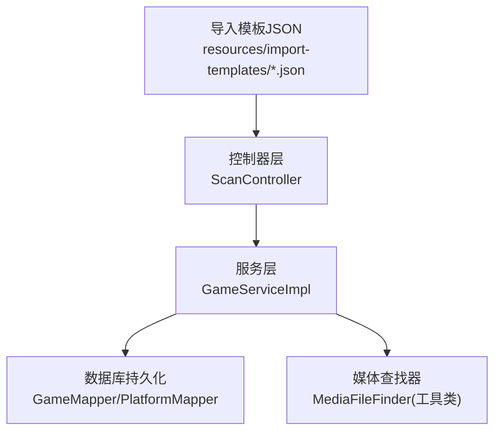
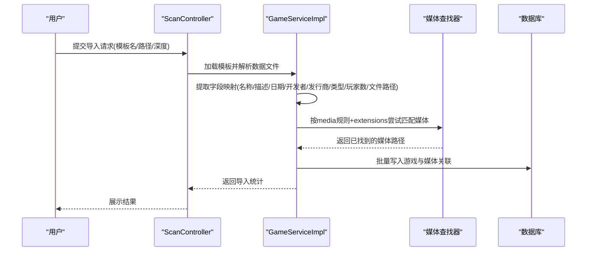
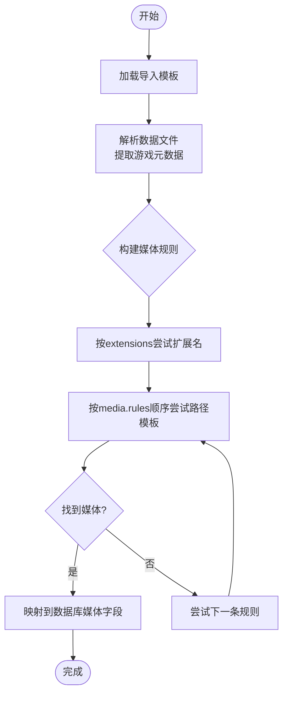
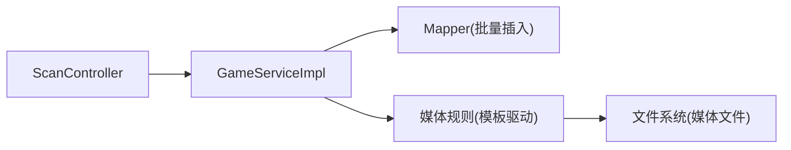

# 导入模板配置

<cite>
**本文引用的文件**
- [pegasus.json](file://src/main/resources/import-templates/pegasus.json)
- [retrobat.json](file://src/main/resources/import-templates/retrobat.json)
- [emuelec.json](file://src/main/resources/import-templates/emuelec.json)
- [lakka.json](file://src/main/resources/import-templates/lakka.json)
- [webgamelistoper.json](file://src/main/resources/import-templates/webgamelistoper.json)
- [import-templates-cn.md](file://docs/import-templates-cn.md)
- [media-mapping-cn.md](file://docs/media-mapping-cn.md)
- [ScanController.java](file://src/main/java/com/gamelist/controller/ScanController.java)
- [GameServiceImpl.java](file://src/main/java/com/gamelist/service/impl/GameServiceImpl.java)
</cite>

## 目录
1. [简介](#简介)
2. [项目结构](#项目结构)
3. [核心组件](#核心组件)
4. [架构总览](#架构总览)
5. [详细组件分析](#详细组件分析)
6. [依赖关系分析](#依赖关系分析)
7. [性能考虑](#性能考虑)
8. [故障排查指南](#故障排查指南)
9. [结论](#结论)
10. [附录](#附录)

## 简介
本文件面向“WebGameListOper”的导入模板配置，系统性说明导入模板 JSON 的结构与语义，覆盖前端类型定义、数据文件格式设置、字段映射规则、表头（header）配置、媒体文件自动定位机制、扩展名配置、以及不同前端（Pegasus、RetroBat、EmuELEC、Lakka、WebGamelistOper）的使用示例与最佳实践。同时给出错误处理与数据验证要点，帮助用户快速搭建并定制导入流程。

## 项目结构
导入模板以 JSON 形式存放于资源目录中，系统在服务启动时加载，并在扫描/导入阶段按模板解析数据文件与匹配媒体文件。

图表来源
- [ScanController.java:170-200](file://src/main/java/com/gamelist/controller/ScanController.java#L170-L200)
- [GameServiceImpl.java:63-70](file://src/main/java/com/gamelist/service/impl/GameServiceImpl.java#L63-L70)

章节来源
- [ScanController.java:170-200](file://src/main/java/com/gamelist/controller/ScanController.java#L170-L200)
- [GameServiceImpl.java:63-70](file://src/main/java/com/gamelist/service/impl/GameServiceImpl.java#L63-L70)

## 核心组件
- 模板元信息：frontend、name、version、description、type、dataFile、delimiter
- 规则包装：rules
  - header：表头启停、格式、起止标记、结构模板、平台字段映射
  - fieldMappings：游戏元数据字段映射（名称、描述、发布日期、开发者、发行商、类型、玩家数量、评分、哈希、文件路径等）
  - media：多媒体文件查找规则（封面、截图、视频、轮播图等）
  - extensions：图片/视频/音频/文档扩展名白名单
  - gameExtensions：可识别的游戏文件扩展名列表

章节来源
- [pegasus.json:1-556](file://src/main/resources/import-templates/pegasus.json#L1-L556)
- [retrobat.json:1-573](file://src/main/resources/import-templates/retrobat.json#L1-L573)
- [emuelec.json:1-52](file://src/main/resources/import-templates/emuelec.json#L1-L52)
- [lakka.json:1-58](file://src/main/resources/import-templates/lakka.json#L1-L58)
- [webgamelistoper.json:1-341](file://src/main/resources/import-templates/webgamelistoper.json#L1-L341)
- [import-templates-cn.md:22-223](file://docs/import-templates-cn.md#L22-L223)

## 架构总览
导入流程从选择模板开始，解析数据文件，提取游戏元数据，再根据模板中的媒体规则在磁盘上定位对应资源，最终将结果写入数据库。

图表来源
- [ScanController.java:170-200](file://src/main/java/com/gamelist/controller/ScanController.java#L170-L200)
- [GameServiceImpl.java:116-235](file://src/main/java/com/gamelist/service/impl/GameServiceImpl.java#L116-L235)

## 详细组件分析

### 模板元信息与数据文件格式
- frontend：标识目标前端（如 pegasus、retrobat、emuelec、lakka、webgamelistoper）
- type：数据文件类型（xml 或 text），决定解析策略
- dataFile：数据文件名或通配模式（如 gamelist.xml、metadata.pegasus.txt、*.lpl）
- delimiter：文本类型时的分隔符（如 Pegasus 使用冒号）

章节来源
- [pegasus.json:1-10](file://src/main/resources/import-templates/pegasus.json#L1-L10)
- [retrobat.json:1-10](file://src/main/resources/import-templates/retrobat.json#L1-L10)
- [emuelec.json:1-10](file://src/main/resources/import-templates/emuelec.json#L1-L10)
- [lakka.json:1-10](file://src/main/resources/import-templates/lakka.json#L1-L10)
- [webgamelistoper.json:1-10](file://src/main/resources/import-templates/webgamelistoper.json#L1-L10)
- [import-templates-cn.md:22-52](file://docs/import-templates-cn.md#L22-L52)

### 表头（header）配置
- enabled：是否启用表头处理
- format：表头格式（xml 或 key-value）
- startMarker/endMarker：XML/文本表头的起止标记
- structure：表头结构模板（用于生成或校验头部）
- fields：平台级字段的映射（如 platform.name、platform.sortBy、platform.launch 等）

章节来源
- [pegasus.json:9-38](file://src/main/resources/import-templates/pegasus.json#L9-L38)
- [retrobat.json:9-49](file://src/main/resources/import-templates/retrobat.json#L9-L49)
- [import-templates-cn.md:75-107](file://docs/import-templates-cn.md#L75-L107)

### 字段映射（fieldMappings）
- 键名：系统内部字段（name、description、releaseDate、developer、publisher、genre、players、rating、hash、files 等）
- fields：外部数据文件中的字段名列表，按顺序匹配第一个非空值
- isMultiValue：是否为多值字段
- transform：可选转换
  - path：路径格式控制（no/yes/keep）
  - trim/case/replace：字符串清洗与替换（支持正则）

注意：内置模板对路径相关字段默认设置 path:"no"，以保证导入后路径统一。

章节来源
- [pegasus.json:39-248](file://src/main/resources/import-templates/pegasus.json#L39-L248)
- [retrobat.json:50-265](file://src/main/resources/import-templates/retrobat.json#L50-L265)
- [emuelec.json:13-28](file://src/main/resources/import-templates/emuelec.json#L13-L28)
- [webgamelistoper.json:13-85](file://src/main/resources/import-templates/webgamelistoper.json#L13-L85)
- [import-templates-cn.md:108-158](file://docs/import-templates-cn.md#L108-L158)

### 媒体文件规则（media）
- source：媒体来源字段名（与 fieldMappings 中的键一致）
- rules：媒体路径模板数组，按顺序尝试匹配
- transform.path：通常设为 no，避免路径前缀干扰
- 变量：{gameName}/{filename}、{filepath}、{platform}、{ext} 等

常见媒体类型：boxFront、boxBack、box3d、boxFull、screenshot、video、wheel、marquee、fanart、titlescreen、banner、thumbnail、background、music、poster、bezel、panel、cartridge、steam、steamgrid、manual 等。

章节来源
- [pegasus.json:249-549](file://src/main/resources/import-templates/pegasus.json#L249-L549)
- [retrobat.json:266-566](file://src/main/resources/import-templates/retrobat.json#L266-L566)
- [emuelec.json:29-45](file://src/main/resources/import-templates/emuelec.json#L29-L45)
- [webgamelistoper.json:86-332](file://src/main/resources/import-templates/webgamelistoper.json#L86-L332)
- [media-mapping-cn.md:26-88](file://docs/media-mapping-cn.md#L26-L88)

### 扩展名配置（extensions 与 gameExtensions）
- extensions：图片/视频/音频/文档的扩展名白名单，用于媒体匹配
- gameExtensions：可识别的游戏文件扩展名集合，用于扫描与归类

章节来源
- [pegasus.json:550-555](file://src/main/resources/import-templates/pegasus.json#L550-L555)
- [retrobat.json:567-572](file://src/main/resources/import-templates/retrobat.json#L567-L572)
- [emuelec.json:46-51](file://src/main/resources/import-templates/emuelec.json#L46-L51)
- [lakka.json:53-57](file://src/main/resources/import-templates/lakka.json#L53-L57)
- [webgamelistoper.json:333-340](file://src/main/resources/import-templates/webgamelistoper.json#L333-L340)
- [media-mapping-cn.md:234-269](file://docs/media-mapping-cn.md#L234-L269)

### 不同前端的模板使用示例与最佳实践
- Pegasus（文本型 metadata.pegasus.txt）
  - 使用 key-value 表头，支持 collection/sort-by/launch 等平台级字段
  - 字段映射包含 title/name/game 等多源兼容
  - 媒体规则覆盖盒封面、截图、视频、轮播图、背景、音乐等
  - 建议：保持 files 字段为相对路径，transform.path 设为 no
- RetroBat（XML 型 gamelist.xml）
  - 使用 XML 表头，支持 System/software/database/web/launch/sort-by/description
  - 字段映射与 Pegasus 类似，但数据源为 XML
  - 建议：确保 XML 结构与模板一致，必要时调整 startMarker/endMarker
- EmuELEC（XML 型 gamelist.xml）
  - 关闭表头处理，专注游戏条目
  - 媒体路径采用 {filepath} 变量，适配深度子目录结构
  - 建议：媒体按平台子目录组织，便于批量匹配
- Lakka（文本型 *.lpl）
  - 使用 textFormat 行映射，每条目固定行数，支持 autoDetect
  - 字段包括 files/name/corePath/coreName/databaseLink/playlistName
  - 建议：严格遵循每条目行数约定，避免错位
- WebGamelistOper（XML 型 gamelist.xml）
  - 针对自身抓取产物设计，媒体路径基于 scraper/games/{platform}/{gameId}/{region}/...
  - 支持大量媒体类型（含 wheelcarbon/wheelsteel/pictocouleur 等）
  - 建议：保持抓取输出目录结构不变，以便媒体自动定位

章节来源
- [pegasus.json:1-556](file://src/main/resources/import-templates/pegasus.json#L1-L556)
- [retrobat.json:1-573](file://src/main/resources/import-templates/retrobat.json#L1-L573)
- [emuelec.json:1-52](file://src/main/resources/import-templates/emuelec.json#L1-L52)
- [lakka.json:1-58](file://src/main/resources/import-templates/lakka.json#L1-L58)
- [webgamelistoper.json:1-341](file://src/main/resources/import-templates/webgamelistoper.json#L1-L341)
- [import-templates-cn.md:224-779](file://docs/import-templates-cn.md#L224-L779)

### 媒体自动定位机制（流程图）

图表来源
- [import-templates-cn.md:991-1001](file://docs/import-templates-cn.md#L991-L1001)
- [media-mapping-cn.md:26-88](file://docs/media-mapping-cn.md#L26-L88)

## 依赖关系分析
- 控制器 ScanController 负责接收导入请求，并根据模板确定要扫描的数据文件类型
- 服务 GameServiceImpl 负责加载模板、解析数据、批量入库与错误日志记录
- 媒体查找由模板规则驱动，结合 extensions 与 media.rules 进行路径匹配
- 数据库通过 Mapper 批量插入，减少 IO 开销

图表来源
- [ScanController.java:170-200](file://src/main/java/com/gamelist/controller/ScanController.java#L170-L200)
- [GameServiceImpl.java:116-235](file://src/main/java/com/gamelist/service/impl/GameServiceImpl.java#L116-L235)

章节来源
- [ScanController.java:170-200](file://src/main/java/com/gamelist/controller/ScanController.java#L170-L200)
- [GameServiceImpl.java:116-235](file://src/main/java/com/gamelist/service/impl/GameServiceImpl.java#L116-L235)

## 性能考虑
- 批量插入：服务层按批次（例如每批数百条）写入数据库，降低单次事务压力
- 多线程导入：当数据量较大时，可按线程数分片并行处理，提升吞吐
- 路径去重与过滤：批量查询已存在路径，避免重复导入
- 媒体匹配优化：按模板规则顺序尝试，优先命中高频路径；合理组织媒体目录结构可减少搜索次数

章节来源
- [GameServiceImpl.java:242-395](file://src/main/java/com/gamelist/service/impl/GameServiceImpl.java#L242-L395)
- [GameServiceImpl.java:501-543](file://src/main/java/com/gamelist/service/impl/GameServiceImpl.java#L501-L543)

## 故障排查指南
- 路径为空或被跳过：检查 fieldMappings.files 的 transform.path 设置，确保路径格式正确
- 媒体未匹配：确认 media.rules 顺序与 extensions 白名单与实际目录结构一致；必要时添加新规则
- 导入失败：查看服务日志与错误日志文件，关注“跳过/失败”的具体条目与原因
- 平台信息异常：核对 header.fields 的平台字段映射是否与数据文件一致

章节来源
- [GameServiceImpl.java:384-395](file://src/main/java/com/gamelist/service/impl/GameServiceImpl.java#L384-L395)
- [GameServiceImpl.java:412-499](file://src/main/java/com/gamelist/service/impl/GameServiceImpl.java#L412-L499)
- [import-templates-cn.md:155-158](file://docs/import-templates-cn.md#L155-L158)

## 结论
导入模板通过 JSON 声明式地定义了数据解析、字段映射与媒体定位规则，配合系统层的批量处理与错误日志机制，能够高效、稳定地完成多前端数据的迁移与整合。按照本文档的结构化配置与最佳实践，用户可以快速适配新的前端或自定义媒体目录结构。

## 附录
- 变量参考：{gameName}/{filename}、{filepath}、{platform}、{ext}、{outputPath}、{mediaPath}、{romsPath}
- 媒体类型清单：参见各模板 media 节点与媒体映射文档
- 扩展名清单：参见 extensions 与 gameExtensions

章节来源
- [import-templates-cn.md:780-800](file://docs/import-templates-cn.md#L780-L800)
- [media-mapping-cn.md:154-216](file://docs/media-mapping-cn.md#L154-L216)