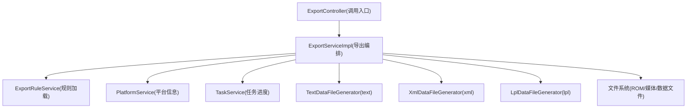
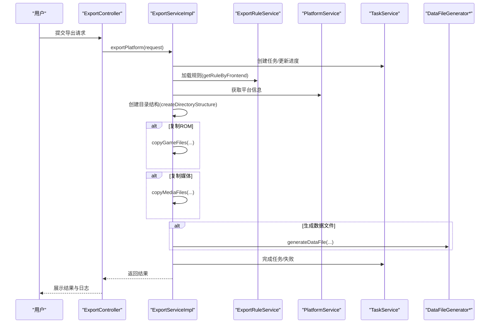
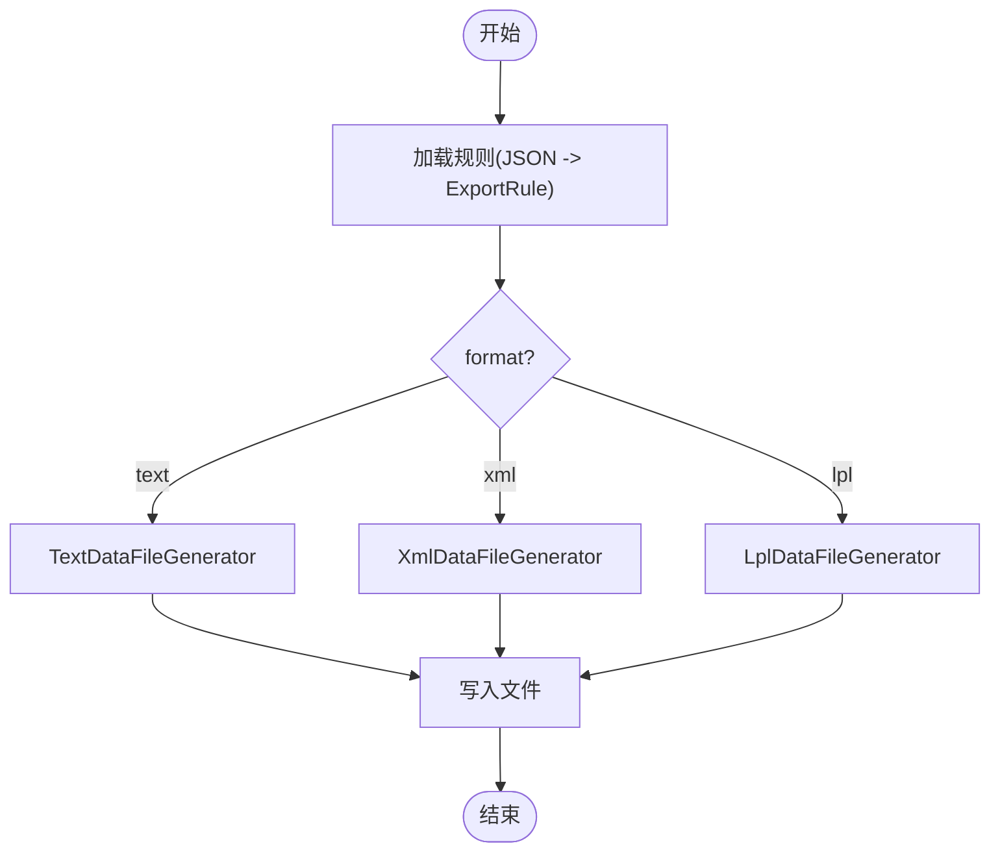
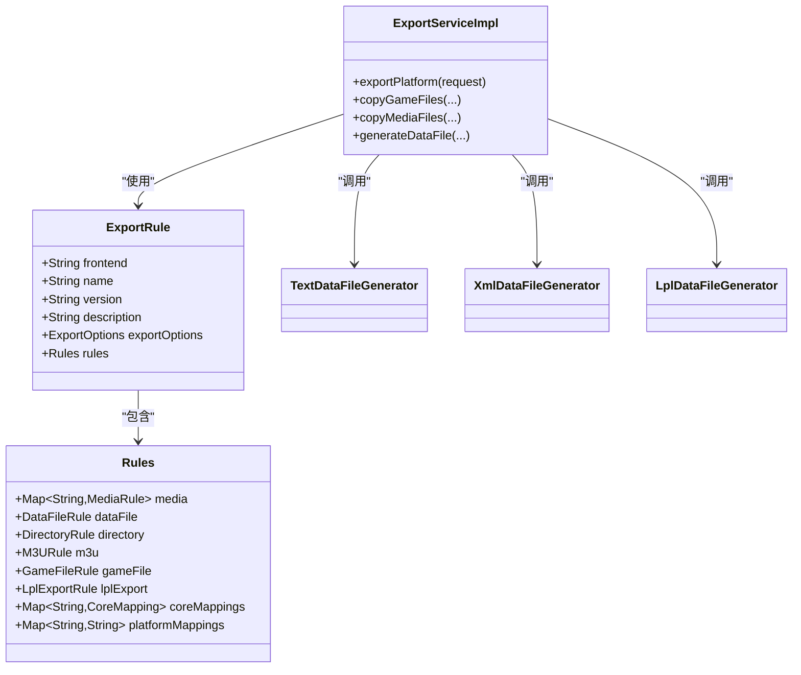

# 导出规则配置

<cite>
**本文引用的文件**
- [ExportRule.java](file://src/main/java/com/gamelist/model/ExportRule.java)
- [ExportService.java](file://src/main/java/com/gamelist/service/ExportService.java)
- [ExportServiceImpl.java](file://src/main/java/com/gamelist/service/impl/ExportServiceImpl.java)
- [TextDataFileGenerator.java](file://src/main/java/com/gamelist/service/impl/TextDataFileGenerator.java)
- [XmlDataFileGenerator.java](file://src/main/java/com/gamelist/service/impl/XmlDataFileGenerator.java)
- [LplDataFileGenerator.java](file://src/main/java/com/gamelist/service/impl/LplDataFileGenerator.java)
- [pegasus.json](file://rules/export/pegasus.json)
- [retrobat.json](file://rules/export/retrobat.json)
- [emuelec.json](file://rules/export/emuelec.json)
- [lakka.json](file://rules/export/lakka.json)
- [esde.json](file://rules/export/esde.json)
- [export-functionality-cn.md](file://docs/export-functionality-cn.md)
- [Export.md](file://wiki/Export.md)
</cite>

## 目录
1. [简介](#简介)
2. [项目结构](#项目结构)
3. [核心组件](#核心组件)
4. [架构总览](#架构总览)
5. [详细组件分析](#详细组件分析)
6. [依赖关系分析](#依赖关系分析)
7. [性能与并发](#性能与并发)
8. [故障排查指南](#故障排查指南)
9. [结论](#结论)
10. [附录：字段映射与变量参考](#附录字段映射与变量参考)

## 简介
本文件系统性说明 WebGameListOper 的“导出规则配置”能力，覆盖导出规则 JSON 的结构、目标格式选择（Pegasus、RetroBat、EmuELEC、Lakka、ESDE）、字段映射、排序与过滤、媒体文件处理、路径生成与复制策略、以及 ExportRule 模型类的属性与业务逻辑。文档同时提供实际规则示例与常见问题解决方案，帮助读者快速理解并定制导出流程。

## 项目结构
- 规则定义位于 rules/export/*.json，描述不同前端的目标格式、媒体映射、数据文件格式与目录结构。
- 运行时由服务层加载规则并执行导出：ExportServiceImpl 负责整体编排；TextDataFileGenerator、XmlDataFileGenerator、LplDataFileGenerator 分别负责 text/xml/lpl 三种数据文件生成。
- 模型层 ExportRule 将 JSON 规则映射为 Java 对象，供服务层使用。

图表来源
- [ExportServiceImpl.java:52-180](file://src/main/java/com/gamelist/service/impl/ExportServiceImpl.java#L52-L180)
- [ExportServiceImpl.java:183-581](file://src/main/java/com/gamelist/service/impl/ExportServiceImpl.java#L183-L581)
- [TextDataFileGenerator.java:21-39](file://src/main/java/com/gamelist/service/impl/TextDataFileGenerator.java#L21-L39)
- [XmlDataFileGenerator.java:21-39](file://src/main/java/com/gamelist/service/impl/XmlDataFileGenerator.java#L21-L39)
- [LplDataFileGenerator.java:25-37](file://src/main/java/com/gamelist/service/impl/LplDataFileGenerator.java#L25-L37)

章节来源
- [ExportServiceImpl.java:52-180](file://src/main/java/com/gamelist/service/impl/ExportServiceImpl.java#L52-L180)
- [Export.md:1-56](file://wiki/Export.md#L1-L56)

## 核心组件
- ExportRule：JSON 规则的 Java 模型，包含前端标识、名称、版本、描述、导出选项与规则集。
- ExportService/ExportServiceImpl：导出流程编排，包括创建目录、复制 ROM/媒体、生成数据文件、M3U 处理、LPL 播放列表等。
- DataFileGenerator 系列：按 format 选择具体生成器，支持 text、xml、lpl。
- 规则文件：rules/export/*.json，定义媒体映射、数据文件结构与目录模板。

章节来源
- [ExportRule.java:17-519](file://src/main/java/com/gamelist/model/ExportRule.java#L17-L519)
- [ExportService.java:7-37](file://src/main/java/com/gamelist/service/ExportService.java#L7-L37)
- [ExportServiceImpl.java:52-180](file://src/main/java/com/gamelist/service/impl/ExportServiceImpl.java#L52-L180)

## 架构总览
导出流程从控制器接收请求，服务层加载对应前端的规则，创建输出目录结构，按需复制游戏与媒体文件，再根据规则生成数据文件（text/xml/lpl）。过程中通过 TaskService 上报进度与日志。

图表来源
- [ExportServiceImpl.java:52-180](file://src/main/java/com/gamelist/service/impl/ExportServiceImpl.java#L52-L180)
- [ExportServiceImpl.java:183-581](file://src/main/java/com/gamelist/service/impl/ExportServiceImpl.java#L183-L581)

## 详细组件分析

### 导出规则 JSON 结构
- 顶层字段：frontend、name、version、description、rules、exportOptions（可选）。
- rules.media：媒体类型到源字段与目标路径模板的映射，可指定 dataFileTag 以在数据文件中引用。
- rules.dataFile：数据文件命名、格式（text/xml/lpl）、分隔符、表头/页脚、字段映射、路径格式（relative/absoluteWithDot）与字段转换。
- rules.directory：roms/media/gamelist 目录模板，支持变量替换。
- rules.m3u：是否启用 M3U 处理及目标路径模板。
- rules.gameFile：是否启用游戏文件重命名及模板。
- rules.lplExport/coreMappings/platformMappings：Lakka LPL 播放列表专用。

章节来源
- [pegasus.json:1-93](file://rules/export/pegasus.json#L1-L93)
- [retrobat.json:1-92](file://rules/export/retrobat.json#L1-L92)
- [emuelec.json:1-102](file://rules/export/emuelec.json#L1-L102)
- [lakka.json:1-73](file://rules/export/lakka.json#L1-L73)
- [esde.json:1-120](file://rules/export/esde.json#L1-L120)
- [export-functionality-cn.md:18-115](file://docs/export-functionality-cn.md#L18-L115)

### 目标格式与适用场景
- Pegasus：文本元数据 + 媒体按游戏子目录组织，适合强调媒体与启动命令的前端。
- RetroBat：XML gamelist.xml，路径带 ./ 前缀，适合 Windows 生态的集成方案。
- EmuELEC：XML gamelist.xml，路径绝对带 ./，媒体集中存放，适合嵌入式系统。
- Lakka：LPL 播放列表，需 coreMappings 与 platformMappings，适合基于 RetroArch 的核心体系。
- ESDE：XML gamelist.xml，相对路径 ./，媒体独立目录，适合桌面版前端。

章节来源
- [pegasus.json:1-93](file://rules/export/pegasus.json#L1-L93)
- [retrobat.json:1-92](file://rules/export/retrobat.json#L1-L92)
- [emuelec.json:1-102](file://rules/export/emuelec.json#L1-L102)
- [lakka.json:1-73](file://rules/export/lakka.json#L1-L73)
- [esde.json:1-120](file://rules/export/esde.json#L1-L120)

### 字段映射与数据类型转换
- fields：将数据库字段映射到目标字段，支持逗号分隔的多值回退匹配（如 name,translatedName）。
- fieldTransforms：对字段值进行 trim、大小写转换、路径前缀控制（yes/no）、字符串替换。
- pathFormat：relative 或 absoluteWithDot，控制路径是否带 ./ 前缀。
- 媒体 dataFileTag：若配置则会在数据文件中写入媒体相对路径，否则仅复制文件。

章节来源
- [TextDataFileGenerator.java:53-117](file://src/main/java/com/gamelist/service/impl/TextDataFileGenerator.java#L53-L117)
- [XmlDataFileGenerator.java:52-113](file://src/main/java/com/gamelist/service/impl/XmlDataFileGenerator.java#L52-L113)
- [export-functionality-cn.md:524-755](file://docs/export-functionality-cn.md#L524-L755)

### 媒体文件处理规则
- source：从 Game 对象的媒体字段读取相对路径（如 screenshot、video、box2dfront 等）。
- target：目标路径模板，支持 {mediaPath}、{gameName}、{filename} 等变量。
- 复制策略：遍历媒体规则，若源存在则复制到目标路径；计算相对路径并按 pathFormat 处理。
- M3U 处理：若文件名以 .m3u 结尾且启用 m3u，则解析并复制其中引用的所有文件。

章节来源
- [ExportServiceImpl.java:365-505](file://src/main/java/com/gamelist/service/impl/ExportServiceImpl.java#L365-L505)
- [TextDataFileGenerator.java:245-319](file://src/main/java/com/gamelist/service/impl/TextDataFileGenerator.java#L245-L319)
- [XmlDataFileGenerator.java:254-340](file://src/main/java/com/gamelist/service/impl/XmlDataFileGenerator.java#L254-L340)

### 排序与过滤
- 当前导出流程未内置按名称/日期/平台的排序与筛选逻辑；如需过滤，可在上层（控制器或服务）先对游戏集合进行处理后再传入导出流程。
- 平台维度可通过 platformId 限定导出范围。

章节来源
- [ExportServiceImpl.java:52-180](file://src/main/java/com/gamelist/service/impl/ExportServiceImpl.java#L52-L180)

### ExportRule 模型类详解
- 顶层：frontend/name/version/description/rules/exportOptions。
- Rules：
  - media：Map<String, MediaRule>，source/target/dataFileTag。
  - dataFile：DataFileRule，含 filename/format/fields/header/footer/fieldSeparator/entrySeparator/pathFormat/fieldTransforms。
  - directory：roms/media。
  - m3u：enabled/target。
  - gameFile：enabled/template。
  - lplExport：enabled/outputPath/lineFormat。
  - coreMappings/platformMappings：Lakka 专用。
- HeaderRule：兼容旧数组与新对象结构，支持 structure 与 fields。
- TransformRule/ReplaceRule：用于字段值转换。

章节来源
- [ExportRule.java:17-519](file://src/main/java/com/gamelist/model/ExportRule.java#L17-L519)

### 数据文件生成流程（text/xml/lpl）
- text：按 header/fields/footer 生成键值对条目，支持自定义分隔符与条目分隔符。
- xml：生成 <game> 节点，自动转义 XML 特殊字符，支持 pathFormat。
- lpl：按 lineFormat 逐行生成播放列表，结合 coreMappings/platformMappings 填充核心信息与平台名。

图表来源
- [ExportServiceImpl.java:507-581](file://src/main/java/com/gamelist/service/impl/ExportServiceImpl.java#L507-L581)
- [TextDataFileGenerator.java:21-39](file://src/main/java/com/gamelist/service/impl/TextDataFileGenerator.java#L21-L39)
- [XmlDataFileGenerator.java:21-39](file://src/main/java/com/gamelist/service/impl/XmlDataFileGenerator.java#L21-L39)
- [LplDataFileGenerator.java:25-37](file://src/main/java/com/gamelist/service/impl/LplDataFileGenerator.java#L25-L37)

章节来源
- [ExportServiceImpl.java:507-581](file://src/main/java/com/gamelist/service/impl/ExportServiceImpl.java#L507-L581)

### 实际规则示例要点
- Pegasus：metadata.pegasus.txt，text 格式，媒体按游戏子目录组织，header 含 collection/sort-by/launch。
- RetroBat：gamelist.xml，xml 格式，路径带 ./ 前缀，provider 节点含 system/software/database/web。
- EmuELEC：gamelist.xml，xml 格式，路径 absoluteWithDot，媒体集中存放于 downloaded_images/{platform}。
- Lakka：{platform}.lpl，lpl 格式，需 lplExport.lineFormat 与 coreMappings/platformMappings。
- ESDE：gamelist.xml，xml 格式，相对路径 ./，媒体独立目录 downloaded_media/{platform.system}。

章节来源
- [pegasus.json:1-93](file://rules/export/pegasus.json#L1-L93)
- [retrobat.json:1-92](file://rules/export/retrobat.json#L1-L92)
- [emuelec.json:1-102](file://rules/export/emuelec.json#L1-L102)
- [lakka.json:1-73](file://rules/export/lakka.json#L1-L73)
- [esde.json:1-120](file://rules/export/esde.json#L1-L120)

## 依赖关系分析
- ExportServiceImpl 依赖：
  - ExportRuleService：加载 rules/export/*.json 为 ExportRule。
  - PlatformService：获取平台信息以填充变量。
  - TaskService：记录任务状态与日志。
  - 各 DataFileGenerator：按 format 生成数据文件。
- 规则文件与模型强耦合：JSON 字段必须与 ExportRule 内部类一致，否则无法正确解析。

图表来源
- [ExportRule.java:17-519](file://src/main/java/com/gamelist/model/ExportRule.java#L17-L519)
- [ExportServiceImpl.java:52-180](file://src/main/java/com/gamelist/service/impl/ExportServiceImpl.java#L52-L180)

章节来源
- [ExportRule.java:17-519](file://src/main/java/com/gamelist/model/ExportRule.java#L17-L519)
- [ExportServiceImpl.java:52-180](file://src/main/java/com/gamelist/service/impl/ExportServiceImpl.java#L52-L180)

## 性能与并发
- 文件复制采用固定大小线程池，默认线程数取 CPU 核心数上限，最大限制防止资源耗尽。
- 媒体与 ROM 复制并行执行，提升吞吐。
- 任务进度与日志实时更新，便于监控与排障。

章节来源
- [ExportServiceImpl.java:47-74](file://src/main/java/com/gamelist/service/impl/ExportServiceImpl.java#L47-L74)
- [ExportServiceImpl.java:231-359](file://src/main/java/com/gamelist/service/impl/ExportServiceImpl.java#L231-L359)
- [ExportServiceImpl.java:408-501](file://src/main/java/com/gamelist/service/impl/ExportServiceImpl.java#L408-L501)

## 故障排查指南
- 规则未找到：检查 frontend 是否与规则文件一致，确保规则已加载。
- 媒体未复制：确认 source 字段存在、target 模板变量正确、输出目录可写。
- XML 格式错误：校验 header/footer 是否为合法 XML，pathFormat 是否符合预期。
- LPL 播放列表异常：核对 lplExport.lineFormat 顺序与 coreMappings/platformMappings 配置。
- 路径问题：确认 pathFormat 与路径变量替换是否正确，必要时调整 fieldTransforms.path。

章节来源
- [ExportServiceImpl.java:98-110](file://src/main/java/com/gamelist/service/impl/ExportServiceImpl.java#L98-L110)
- [ExportServiceImpl.java:365-505](file://src/main/java/com/gamelist/service/impl/ExportServiceImpl.java#L365-L505)
- [export-functionality-cn.md:466-482](file://docs/export-functionality-cn.md#L466-L482)

## 结论
WebGameListOper 的导出规则配置通过 JSON 驱动，灵活适配多种前端的数据格式与目录结构。借助 ExportRule 模型与多生成器实现，系统能够高效完成 ROM/媒体复制与数据文件生成。通过字段映射、路径格式与转换规则，可满足复杂场景需求。建议根据目标前端规范选择合适的规则模板，并在必要时扩展字段映射与媒体规则。

## 附录：字段映射与变量参考
- 常用字段：name、description、rating、releaseYear、developer、publisher、genre、players、region、filename、path。
- 路径变量：{outputPath}、{platform}、{platform.system}、{platform.name}、{platform.launch}、{platform.software}、{platform.database}、{platform.web}、{mediaPath}、{romsPath}、{env.*}。
- 媒体来源字段：box2dfront、box2dback、box3d、screenshot、video、wheel、marquee、fanart。
- 路径格式：relative（不带 ./）、absoluteWithDot（带 ./）。
- 字段转换：trim、case（upper/lower）、path（yes/no）、replace(from/to)。

章节来源
- [export-functionality-cn.md:405-755](file://docs/export-functionality-cn.md#L405-L755)
- [TextDataFileGenerator.java:165-243](file://src/main/java/com/gamelist/service/impl/TextDataFileGenerator.java#L165-L243)
- [XmlDataFileGenerator.java:174-252](file://src/main/java/com/gamelist/service/impl/XmlDataFileGenerator.java#L174-L252)