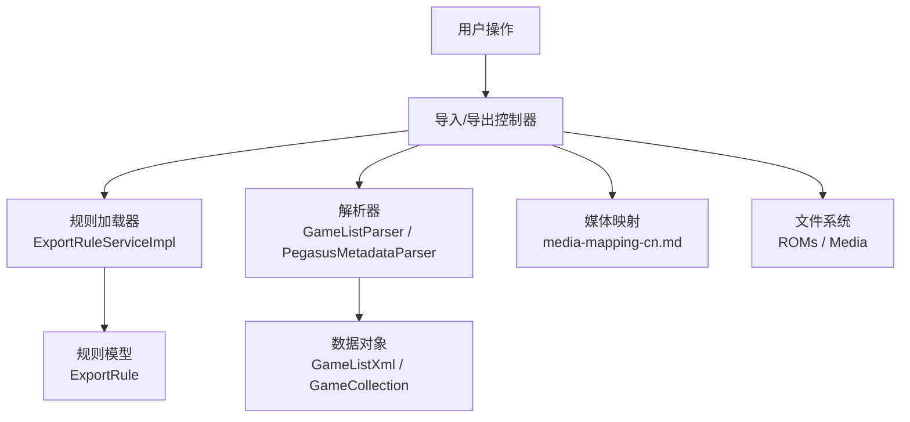
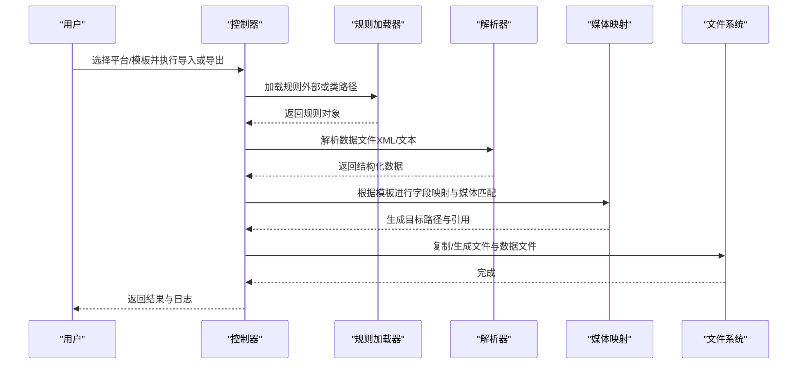
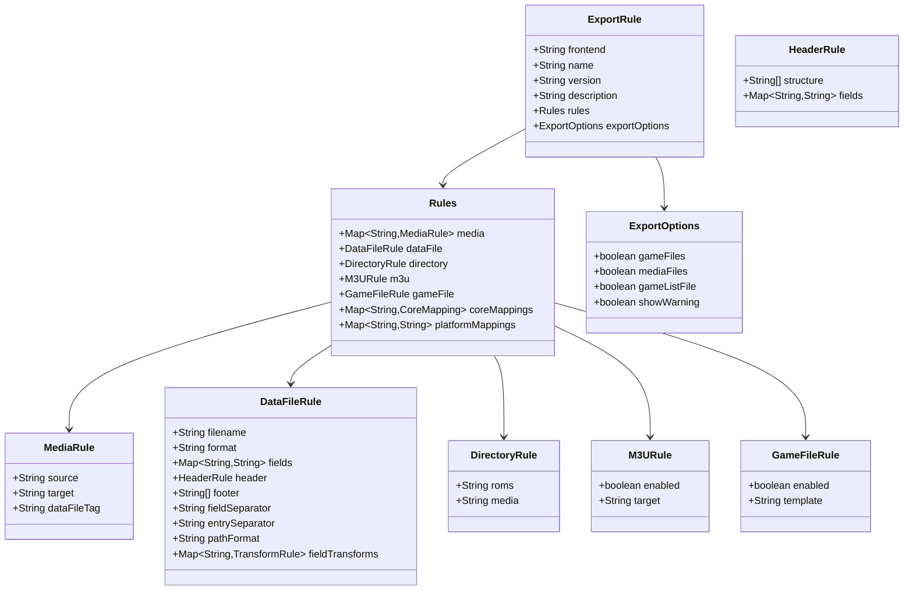

# 自定义模板开发

<cite>
**本文引用的文件**
- [导入模板文档（中文）](file://docs/import-templates-cn.md)
- [导出功能文档（中文）](file://docs/export-functionality-cn.md)
- [媒体映射关系文档（中文）](file://docs/media-mapping-cn.md)
- [Pegasus 导入模板](file://rules/import/pegasus.json)
- [WebGamelistOper 导入模板](file://rules/import/webgamelistoper.json)
- [Pegasus 导出规则](file://rules/export/pegasus.json)
- [ES-DE 导出规则](file://rules/export/esde.json)
- [导出规则服务接口](file://src/main/java/com/gamelist/service/ExportRuleService.java)
- [导出规则服务实现](file://src/main/java/com/gamelist/service/impl/ExportRuleServiceImpl.java)
- [导出规则模型](file://src/main/java/com/gamelist/model/ExportRule.java)
- [XML 游戏列表解析器](file://src/main/java/com/gamelist/xml/GameListParser.java)
- [Pegasus 元数据解析器（util）](file://src/main/java/com/gamelist/util/PegasusMetadataParser.java)
- [Pegasus 元数据解析器（xml）](file://src/main/java/com/gamelist/xml/PegasusMetadataParser.java)
</cite>

## 目录
1. [简介](#简介)
2. [项目结构](#项目结构)
3. [核心组件](#核心组件)
4. [架构总览](#架构总览)
5. [详细组件分析](#详细组件分析)
6. [依赖关系分析](#依赖关系分析)
7. [性能考虑](#性能考虑)
8. [故障排查指南](#故障排查指南)
9. [结论](#结论)
10. [附录](#附录)

## 简介
本指南面向希望从零开始为 WebGameListOper 创建自定义导入与导出模板的开发者。内容涵盖：
- 模板文件结构设计、字段映射语法、媒体文件处理规则
- 模板配置的标准格式与必需字段说明
- 内置解析器与转换器（如 PegasusMetadataParser）的使用方法
- 从简单字段映射到复杂数据转换的完整示例
- 模板测试与调试方法、错误排查与性能优化技巧
- 模板版本管理与兼容性考虑
- 最佳实践建议与社区贡献流程

## 项目结构
本项目将导入与导出能力通过“规则/模板”驱动，核心由 JSON 配置文件与 Java 服务层组成：
- 导入模板位于 rules/import/*.json，定义如何把外部前端的数据与媒体文件导入系统
- 导出规则位于 rules/export/*.json，定义如何将系统内数据导出为目标前端格式
- XML/文本解析器负责读取并结构化数据，服务层负责加载规则、执行导入/导出逻辑
- 媒体映射文档统一了不同来源的媒体类型到数据库字段的对应关系

图表来源
- [导出规则服务实现:41-101](file://src/main/java/com/gamelist/service/impl/ExportRuleServiceImpl.java#L41-L101)
- [XML 游戏列表解析器:319-384](file://src/main/java/com/gamelist/xml/GameListParser.java#L319-L384)
- [Pegasus 元数据解析器（util）:284-614](file://src/main/java/com/gamelist/util/PegasusMetadataParser.java#L284-L614)

章节来源
- [导入模板文档（中文）:16-74](file://docs/import-templates-cn.md#L16-L74)
- [导出功能文档（中文）:18-116](file://docs/export-functionality-cn.md#L18-L116)

## 核心组件
- 导入模板（JSON）：描述数据来源、字段映射、媒体匹配规则、扩展名等
- 导出规则（JSON）：描述目标前端的媒体拷贝、数据文件生成、目录结构、变量替换等
- 规则加载器：扫描外部或类路径下的规则文件，反序列化为 ExportRule
- 解析器：
  - GameListParser：解析 XML（含编码检测、BOM处理、多编码尝试）
  - PegasusMetadataParser：解析 Pegasus 文本元数据（支持 assets 块与多行 files）
- 媒体映射：统一不同来源媒体类型到数据库字段

章节来源
- [导出规则服务接口:8-27](file://src/main/java/com/gamelist/service/ExportRuleService.java#L8-L27)
- [导出规则服务实现:41-101](file://src/main/java/com/gamelist/service/impl/ExportRuleServiceImpl.java#L41-L101)
- [XML 游戏列表解析器:319-384](file://src/main/java/com/gamelist/xml/GameListParser.java#L319-L384)
- [Pegasus 元数据解析器（util）:284-614](file://src/main/java/com/gamelist/util/PegasusMetadataParser.java#L284-L614)
- [媒体映射关系文档（中文）:5-67](file://docs/media-mapping-cn.md#L5-L67)

## 架构总览
导入与导出的整体流程如下：

图表来源
- [导出规则服务实现:41-101](file://src/main/java/com/gamelist/service/impl/ExportRuleServiceImpl.java#L41-L101)
- [XML 游戏列表解析器:319-384](file://src/main/java/com/gamelist/xml/GameListParser.java#L319-L384)
- [Pegasus 元数据解析器（util）:284-614](file://src/main/java/com/gamelist/util/PegasusMetadataParser.java#L284-L614)

## 详细组件分析

### 导入模板结构与字段映射
- 基本信息：frontend、name、version、description、type、dataFile、delimiter
- rules.header：表头处理开关、格式、起止标记、结构模板、平台信息字段映射
- rules.fieldMappings：字段映射数组、是否多值、值前缀、transform（path/trim/case/replace）
- rules.media：媒体类型、source、rules（路径模板数组）、transform
- rules.extensions：图片/视频扩展名
- rules.gameExtensions：游戏文件扩展名

要点
- 路径字段默认使用 path:"no" 去除 ./ 前缀，保证导入一致性
- 支持正则 replace，例如从绝对路径提取文件名
- 多值字段（如 files）可设置 valuePrefix 以识别缩进或多行

章节来源
- [导入模板文档（中文）:16-158](file://docs/import-templates-cn.md#L16-L158)
- [Pegasus 导入模板:39-85](file://rules/import/pegasus.json#L39-L85)
- [WebGamelistOper 导入模板:13-85](file://rules/import/webgamelistoper.json#L13-L85)

### 媒体文件处理规则
- 媒体类型覆盖广泛：boxFront/Back/3d、screenshot、video、wheel、marquee、fanart、poster、manual、music 等
- 路径模板支持变量：{gameName}/{filename}、{filepath}、{platform}、{ext}、{outputPath}/{mediaPath}/{romsPath}
- Skraper-EmulationStation 模板支持深度子目录 {filepath}，便于复杂目录结构

章节来源
- [导入模板文档（中文）:159-223](file://docs/import-templates-cn.md#L159-L223)
- [导入模板文档（中文）:780-800](file://docs/import-templates-cn.md#L780-L800)
- [媒体映射关系文档（中文）:26-88](file://docs/media-mapping-cn.md#L26-L88)

### 导出规则结构与数据文件生成
- media：source（来源字段）、target（目标路径模板）、dataFileTag（数据文件标签）
- dataFile：filename、format（text/xml）、fieldSeparator、entrySeparator、header/footer、fields、fieldTransforms
- directory：roms、media、gamelist（可选）
- exportOptions：控制是否允许导出游戏文件/媒体文件/列表文件，以及是否显示警告
- gameFile：重命名模板（enabled/template），支持 {platform}/{filename}/{name}/{ext}
- m3u：处理播放列表文件（enabled/target）

章节来源
- [导出功能文档（中文）:42-116](file://docs/export-functionality-cn.md#L42-L116)
- [导出功能文档（中文）:371-403](file://docs/export-functionality-cn.md#L371-L403)
- [导出功能文档（中文）:627-755](file://docs/export-functionality-cn.md#L627-L755)
- [Pegasus 导出规则:7-92](file://rules/export/pegasus.json#L7-L92)
- [ES-DE 导出规则:6-118](file://rules/export/esde.json#L6-L118)

### 解析器与转换器
- GameListParser：
  - 自动检测 BOM 与 XML 声明编码，支持 UTF-8/UTF-16/UTF-32/GBK/GB2312
  - 多编码尝试解析，忽略未知元素，记录严重级别事件
  - 提供平台类型识别与 LPL 播放列表解析
- PegasusMetadataParser（util）：
  - 解析 metadata.pegasus.txt，支持 collection/game/launch/sort-by
  - 支持多行 files 与 assets 块，映射多种媒体字段
- PegasusMetadataParser（xml）：
  - 轻量解析集合与游戏条目，处理 description 多行拼接

章节来源
- [XML 游戏列表解析器:29-139](file://src/main/java/com/gamelist/xml/GameListParser.java#L29-L139)
- [XML 游戏列表解析器:319-384](file://src/main/java/com/gamelist/xml/GameListParser.java#L319-L384)
- [XML 游戏列表解析器:496-547](file://src/main/java/com/gamelist/xml/GameListParser.java#L496-L547)
- [Pegasus 元数据解析器（util）:284-614](file://src/main/java/com/gamelist/util/PegasusMetadataParser.java#L284-L614)
- [Pegasus 元数据解析器（xml）:15-107](file://src/main/java/com/gamelist/xml/PegasusMetadataParser.java#L15-L107)

### 规则加载机制
- ExportRuleServiceImpl 优先从外部路径（app.export.rules.path）加载规则
- 若外部路径为空或无规则，则回退到类路径下的 export-rules 资源
- 使用 Jackson ObjectMapper 反序列化 JSON 为 ExportRule 对象
- 支持旧版 header 直接数组与新对象格式的兼容反序列化

章节来源
- [导出规则服务实现:35-101](file://src/main/java/com/gamelist/service/impl/ExportRuleServiceImpl.java#L35-L101)
- [导出规则模型:295-366](file://src/main/java/com/gamelist/model/ExportRule.java#L295-L366)

### 完整开发示例（从简单到复杂）
- 简单字段映射：将外部 name/description/releaseDate 映射到系统字段，设置 transform.path="no"
- 多值字段：files 字段支持多行或多值，设置 isMultiValue=true 与 valuePrefix
- 媒体匹配：为每种媒体类型配置 rules 数组，按顺序匹配路径模板
- 复杂转换：使用 fieldTransforms 对 title/files 等进行 trim/case/replace 处理
- 导出目标：配置 dataFile 的 fields 与 header/footer，生成 text 或 xml 数据文件

章节来源
- [导入模板文档（中文）:108-158](file://docs/import-templates-cn.md#L108-L158)
- [导入模板文档（中文）:224-526](file://docs/import-templates-cn.md#L224-L526)
- [导出功能文档（中文）:677-755](file://docs/export-functionality-cn.md#L677-L755)
- [Pegasus 导入模板:39-85](file://rules/import/pegasus.json#L39-L85)
- [WebGamelistOper 导入模板:13-85](file://rules/import/webgamelistoper.json#L13-L85)

## 依赖关系分析
- 规则加载依赖 Jackson 反序列化，ExportRule 内部类包含 MediaRule、DataFileRule、HeaderRule、DirectoryRule、M3URule、GameFileRule、ExportOptions 等
- 解析器依赖 JAXB 与 IO 流，支持 BOM 与多编码
- 媒体映射文档作为规范，指导导入/导出时媒体类型的统一归并

图表来源
- [导出规则模型:18-519](file://src/main/java/com/gamelist/model/ExportRule.java#L18-L519)

章节来源
- [导出规则模型:18-519](file://src/main/java/com/gamelist/model/ExportRule.java#L18-L519)

## 性能考虑
- 解析阶段：
  - 使用 BufferedInputStream 与 mark/reset 支持 BOM 检测与编码回退
  - 多编码尝试避免重复失败，减少异常开销
- 规则加载：
  - 优先外部路径，减少类路径扫描成本
  - 仅加载 *.json 文件，限制 I/O 范围
- 媒体匹配：
  - 路径模板按顺序匹配，尽量将高概率路径放在前面
  - 合理使用 transform.path 减少不必要的路径处理
- 导出阶段：
  - 批量写入数据文件，减少频繁 I/O
  - 对 M3U 文件解析后一次性拷贝引用文件

[本节为通用性能建议，不直接分析具体代码文件]

## 故障排查指南
常见问题与定位方法：
- XML 解析失败：
  - 检查 BOM 与 XML 声明编码，查看日志中“检测到编码”“尝试编码”信息
  - 关注 JAXB 验证事件中的 ERROR/FATAL_ERROR 消息与行列号
- 字段映射不正确：
  - 核对 fieldMappings.fields 顺序与 isMultiValue/valuePrefix
  - 确认 transform.replace 的正则模式与分组引用
- 媒体文件未匹配：
  - 检查 media.rules 模板是否与真实路径一致
  - 确认 extensions 与 gameExtensions 是否包含实际扩展名
- 规则未加载：
  - 检查外部规则路径是否存在且可读
  - 查看日志中“Loading export rules from external path”与“Total rules loaded”

章节来源
- [XML 游戏列表解析器:148-220](file://src/main/java/com/gamelist/xml/GameListParser.java#L148-L220)
- [XML 游戏列表解析器:319-384](file://src/main/java/com/gamelist/xml/GameListParser.java#L319-L384)
- [导出规则服务实现:41-101](file://src/main/java/com/gamelist/service/impl/ExportRuleServiceImpl.java#L41-L101)

## 结论
通过 JSON 驱动的导入/导出模板体系，WebGameListOper 提供了高度灵活的迁移与输出能力。开发者只需遵循标准模板结构、合理配置字段映射与媒体规则，即可快速适配不同前端格式。结合内置解析器与媒体映射规范，能够稳定处理多编码 XML 与复杂媒体目录结构。建议在开发过程中重视日志与错误定位，持续优化路径匹配与转换逻辑，确保导入/导出的高效与准确。

[本节为总结性内容，不直接分析具体代码文件]

## 附录

### 模板版本管理与兼容性
- 在模板中维护 version 字段，便于升级与回滚
- 保持向后兼容：新增字段应可选，旧模板仍能正常解析
- 对 header 结构采用兼容反序列化（数组或对象）

章节来源
- [导出规则模型:295-366](file://src/main/java/com/gamelist/model/ExportRule.java#L295-L366)

### 最佳实践建议
- 命名规范：
  - 模板名称与前端标识清晰明确（如 pegasus、esde）
  - 字段映射键名与系统字段保持一致
- 错误处理：
  - 在模板中为路径字段设置 transform.path="no"，避免不一致的前缀
  - 对多值字段设置合适的 valuePrefix，提高解析准确性
- 日志记录：
  - 利用解析器的详细日志定位编码与解析问题
  - 在规则加载阶段记录成功/失败数量，便于监控

[本节为通用指导，不直接分析具体代码文件]

### 社区贡献模板的流程与规范
- 新增导入模板：
  - 在 rules/import/ 下添加 JSON 文件，遵循标准结构
  - 提供完整的 fieldMappings、media、extensions、gameExtensions
- 新增导出规则：
  - 在 rules/export/ 下添加 JSON 文件，定义 media、dataFile、directory
  - 如需限制导出内容，配置 exportOptions
- 提交前自检：
  - 使用现有模板样例验证 JSON 合法性
  - 运行导入/导出流程，检查日志与输出结果

章节来源
- [导入模板文档（中文）:16-74](file://docs/import-templates-cn.md#L16-L74)
- [导出功能文档（中文）:18-116](file://docs/export-functionality-cn.md#L18-L116)