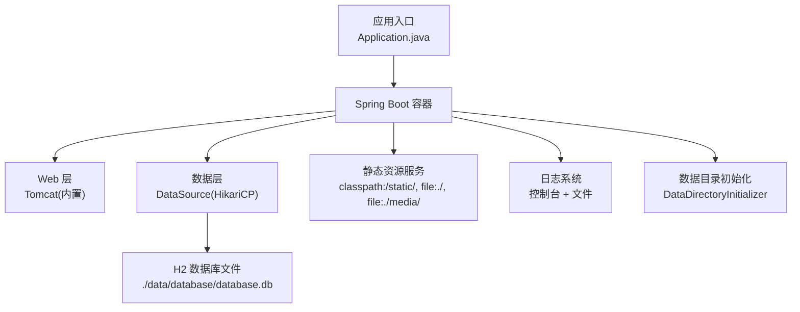
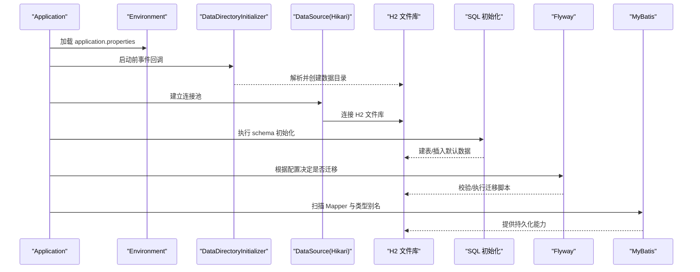
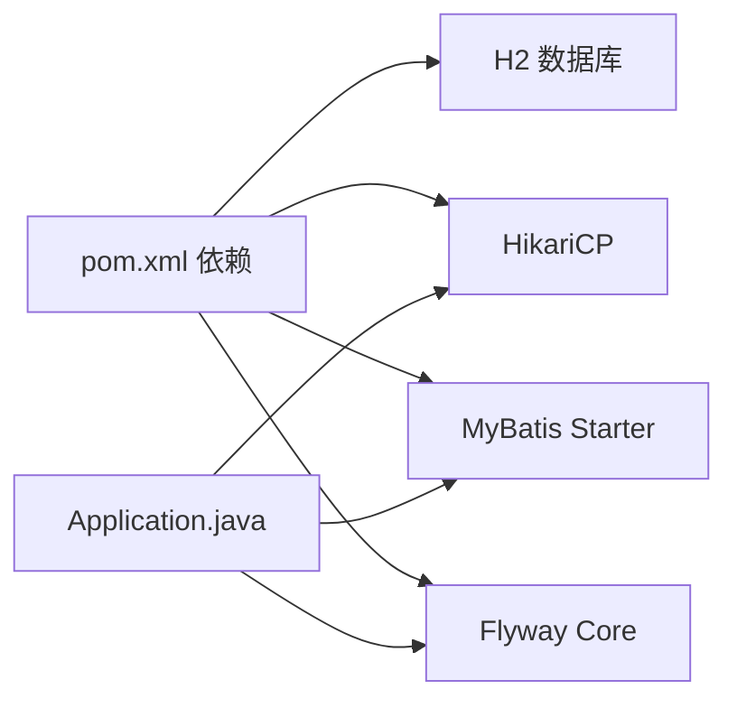

# 应用配置

<cite>
**本文引用的文件**
- [application.properties](file://src/main/resources/application.properties)
- [Application.java](file://src/main/java/com/gamelist/Application.java)
- [FlywayConfig.java](file://src/main/java/com/gamelist/config/FlywayConfig.java)
- [DataDirectoryInitializer.java](file://src/main/java/com/gamelist/config/DataDirectoryInitializer.java)
- [DatabaseInitializer.java](file://src/main/java/com/gamelist/config/DatabaseInitializer.java)
- [init.sql](file://src/main/resources/sql/init.sql)
- [pom.xml](file://pom.xml)
</cite>

## 目录
1. [简介](#简介)
2. [项目结构](#项目结构)
3. [核心组件](#核心组件)
4. [架构总览](#架构总览)
5. [详细组件分析](#详细组件分析)
6. [依赖关系分析](#依赖关系分析)
7. [性能考虑](#性能考虑)
8. [故障排查指南](#故障排查指南)
9. [结论](#结论)
10. [附录：环境差异化配置示例](#附录环境差异化配置示例)

## 简介
本文件为 WebGameListOper 应用的“应用配置”专项文档，聚焦于 src/main/resources/application.properties 中的全部配置项，覆盖服务器端口、UTF-8 编码、静态资源、数据库连接（H2）、HikariCP 连接池、SQL 初始化、Flyway 迁移、MyBatis、日志、H2 控制台、文件上传与自定义路径等。文档同时给出各配置项的作用、默认值、可选值与最佳实践，并提供开发、测试、生产环境的差异化配置建议以及常见问题解决方案。

## 项目结构
- 配置文件位于 resources/application.properties，集中管理运行时行为。
- 数据目录与规则目录在启动时由 DataDirectoryInitializer 自动创建，确保运行期所需目录存在。
- 数据库通过 H2 文件模式持久化，配合 SQL 初始化脚本与 Flyway 迁移脚本进行版本化管理。
- MyBatis 通过注解扫描与 XML Mapper 映射访问数据库。
- 日志输出到控制台与文件，便于开发与运维排障。

图表来源
- [Application.java:8-14](file://src/main/java/com/gamelist/Application.java#L8-L14)
- [application.properties:1-13](file://src/main/resources/application.properties#L1-L13)
- [DataDirectoryInitializer.java:18-92](file://src/main/java/com/gamelist/config/DataDirectoryInitializer.java#L18-L92)

章节来源
- [application.properties:1-86](file://src/main/resources/application.properties#L1-L86)
- [DataDirectoryInitializer.java:18-92](file://src/main/java/com/gamelist/config/DataDirectoryInitializer.java#L18-L92)

## 核心组件
- 服务器与编码：控制监听端口、URI 编码与 HTTP 请求响应编码。
- 静态资源：定义静态资源查找顺序与缓存策略。
- 数据库与连接池：H2 文件库 + HikariCP 连接池参数。
- 初始化与迁移：SQL 初始化脚本与 Flyway 迁移。
- MyBatis：Mapper 扫描与类型别名。
- 日志：控制台与文件输出格式、级别与轮转策略。
- H2 控制台：内嵌控制台开关与访问路径。
- 文件上传：临时目录、大小限制与 Tomcat 工作目录。
- 自定义路径：规则、导入模板、导出规则、输入输出目录。

章节来源
- [application.properties:1-86](file://src/main/resources/application.properties#L1-L86)

## 架构总览
下图展示了配置如何影响应用启动与运行时的关键路径：

图表来源
- [application.properties:15-41](file://src/main/resources/application.properties#L15-L41)
- [DataDirectoryInitializer.java:18-92](file://src/main/java/com/gamelist/config/DataDirectoryInitializer.java#L18-L92)
- [FlywayConfig.java:17-44](file://src/main/java/com/gamelist/config/FlywayConfig.java#L17-L44)
- [init.sql:1-305](file://src/main/resources/sql/init.sql#L1-L305)

## 详细组件分析

### 服务器与编码
- server.port
  - 作用：设置内置 Tomcat 监听端口。
  - 默认值：8080。
  - 可选值：任意可用 TCP 端口。
  - 最佳实践：生产环境避免使用 80/443 直接暴露，交由反向代理；容器部署可通过环境变量覆盖。
- UTF-8 编码
  - spring.http.encoding.charset=UTF-8
  - spring.http.encoding.enabled=true
  - spring.http.encoding.force=true
  - server.tomcat.uri-encoding=UTF-8
  - 作用：统一请求/响应与 URI 解码为 UTF-8，避免中文乱码。
  - 最佳实践：保持开启 force 与 enabled；若前端或网关已处理编码，可评估关闭 force。

章节来源
- [application.properties:1-8](file://src/main/resources/application.properties#L1-L8)

### 静态资源配置
- spring.web.resources.static-locations=classpath:/static/,file:./,file:./media/
- spring.web.resources.cache.period=0
- spring.web.resources.cache.cachecontrol.no-store=true
- 作用：指定静态资源查找顺序（类路径优先，其次当前目录与 media），禁用缓存以便热更新。
- 最佳实践：
  - 生产环境建议启用缓存以提升性能。
  - 如需对外部目录提供 HTTP 访问，可将外部目录加入 static-locations（注意权限与安全）。

章节来源
- [application.properties:10-13](file://src/main/resources/application.properties#L10-L13)

### 数据库连接（H2）
- spring.datasource.url=jdbc:h2:file:./data/database/database.db;DB_CLOSE_DELAY=-1;AUTO_SERVER=TRUE
- spring.datasource.username=sa
- spring.datasource.password=
- spring.datasource.driver-class-name=org.h2.Driver
- 作用：使用 H2 文件模式存储，支持多进程访问（AUTO_SERVER）与延迟关闭（DB_CLOSE_DELAY）。
- 最佳实践：
  - 单实例部署建议保留 AUTO_SERVER=TRUE；多实例共享需评估锁竞争。
  - 生产环境建议使用独立磁盘路径并定期备份 database.db。
  - 密码为空仅适用于本地开发；生产务必设置强密码或切换至企业数据库。

章节来源
- [application.properties:15-19](file://src/main/resources/application.properties#L15-L19)

### HikariCP 连接池参数
- maximum-pool-size=30
- minimum-idle=10
- idle-timeout=60000
- connection-timeout=10000
- max-lifetime=1800000
- auto-commit=true
- 作用：控制连接池大小、空闲回收、获取超时与生命周期。
- 最佳实践：
  - 根据并发量与数据库负载调优；一般最大池大小不超过数据库允许的最大连接数。
  - connection-timeout 不宜过小，避免误判瞬时抖动。
  - max-lifetime 应小于数据库侧的连接超时时间。

章节来源
- [application.properties:21-27](file://src/main/resources/application.properties#L21-L27)

### SQL 初始化配置
- spring.sql.init.schema-locations=classpath:sql/init.sql
- spring.sql.init.mode=always
- 作用：启动时始终执行 init.sql，用于创建基础表与默认数据。
- 最佳实践：
  - 将幂等的建表语句放入 init.sql，避免重复执行报错。
  - 生产环境谨慎使用 always，必要时改为 never 并由 CI/CD 触发迁移。

章节来源
- [application.properties:29-31](file://src/main/resources/application.properties#L29-L31)
- [init.sql:1-305](file://src/main/resources/sql/init.sql#L1-L305)

### Flyway 数据库迁移配置
- spring.flyway.enabled=false
- spring.flyway.baseline-on-migrate=true
- spring.flyway.locations=classpath:db/migration
- spring.flyway.baseline-version=1.0.2
- 作用：禁用 Spring Boot 自动 Flyway 配置，使用自定义配置；设置基线版本与迁移脚本位置。
- 最佳实践：
  - 首次上线前需确认 baseline-version 与实际数据一致，否则可能报版本不匹配。
  - 迁移脚本命名遵循 V{version}__description.sql 规范。
  - 生产环境建议开启 validateOnMigrate 并在预发验证后部署。

章节来源
- [application.properties:33-37](file://src/main/resources/application.properties#L33-L37)
- [FlywayConfig.java:17-44](file://src/main/java/com/gamelist/config/FlywayConfig.java#L17-L44)

### MyBatis 配置
- mybatis.mapper-locations=classpath:mappers/*.xml
- mybatis.type-aliases-package=com.gamelist.model
- Application 中启用 @MapperScan("com.gamelist.mapper")
- 作用：扫描 XML Mapper 与 Java Mapper 接口，注册类型别名。
- 最佳实践：
  - 确保 mapper XML 与接口包路径一致。
  - 类型别名简化 SQL 中的类型书写，注意命名冲突。

章节来源
- [application.properties:39-41](file://src/main/resources/application.properties#L39-L41)
- [Application.java:8-10](file://src/main/java/com/gamelist/Application.java#L8-L10)

### 日志配置
- logging.level.com.gamelist=INFO
- logging.level.org.mybatis=INFO
- logging.pattern.console=%d{yyyy-MM-dd HH:mm:ss.SSS} [%thread] %-5level %logger{36} - %msg%n
- logging.charset.console=UTF-8
- logging.file.name=logs/application.log
- logging.file.max-size=10MB
- logging.file.max-history=7
- logging.pattern.file=...
- 作用：控制台与文件日志的级别、格式、字符集与轮转策略。
- 最佳实践：
  - 生产环境建议降低默认级别为 WARN，按需开启 DEBUG。
  - 合理设置 max-size 与 max-history，避免磁盘占满。
  - 容器化部署建议输出到 stdout，由日志采集器收集。

章节来源
- [application.properties:43-53](file://src/main/resources/application.properties#L43-L53)

### H2 控制台配置
- spring.h2.console.enabled=true
- spring.h2.console.path=/h2-console
- spring.h2.console.settings.web-allow-others=true
- 作用：启用内嵌 H2 控制台，允许外部访问。
- 最佳实践：
  - 生产环境建议关闭或限制访问来源（防火墙/反向代理）。
  - 不建议在生产暴露控制台。

章节来源
- [application.properties:55-58](file://src/main/resources/application.properties#L55-L58)

### 文件上传配置
- spring.servlet.multipart.location=./data
- server.tomcat.basedir=./data
- spring.resources.static-locations=classpath:/static/,file:./data
- spring.servlet.multipart.max-file-size=10MB
- spring.servlet.multipart.max-request-size=10MB
- 作用：设置上传临时目录、Tomcat 工作目录、静态资源映射与上传大小限制。
- 最佳实践：
  - 确保 ./data 目录可写；DataDirectoryInitializer 会尝试创建必要子目录。
  - 大文件上传场景下，适当增大 max-file-size 与 max-request-size。
  - 若需通过 URL 访问上传文件，将对应目录加入 static-locations（注意权限）。

章节来源
- [application.properties:60-74](file://src/main/resources/application.properties#L60-L74)
- [DataDirectoryInitializer.java:45-85](file://src/main/java/com/gamelist/config/DataDirectoryInitializer.java#L45-L85)

### 自定义路径配置
- app.rules.directory=./data/rules
- app.import.templates.path=./data/rules/import
- app.export.rules.path=./data/rules/export
- app.input.directory=./data/input
- app.output.directory=./data/output
- 作用：集中管理规则、模板、输入输出目录，便于挂载与扩展。
- 最佳实践：
  - 容器化部署时通过卷挂载这些目录，实现数据持久化与配置外置。
  - 确保目录存在且具备读写权限；DataDirectoryInitializer 会在启动时创建缺失目录。

章节来源
- [application.properties:76-86](file://src/main/resources/application.properties#L76-L86)
- [DataDirectoryInitializer.java:51-79](file://src/main/java/com/gamelist/config/DataDirectoryInitializer.java#L51-L79)

## 依赖关系分析
- 数据库驱动与连接池：H2 与 HikariCP 由 Spring Boot Starter JDBC 引入。
- MyBatis：通过 mybatis-spring-boot-starter 集成。
- Flyway：flyway-core 与 flyway-mysql 依赖用于迁移。
- 应用入口：Application 启用 @SpringBootApplication、@MapperScan、@EnableAsync。

图表来源
- [pom.xml:23-69](file://pom.xml#L23-L69)
- [Application.java:8-10](file://src/main/java/com/gamelist/Application.java#L8-L10)

章节来源
- [pom.xml:23-69](file://pom.xml#L23-L69)
- [Application.java:8-10](file://src/main/java/com/gamelist/Application.java#L8-L10)

## 性能考虑
- 连接池：根据并发与数据库能力调整 maximum-pool-size、connection-timeout、max-lifetime。
- 静态资源：生产环境建议开启缓存以减少带宽与 CPU 开销。
- 日志：生产环境降低日志级别，合理轮转，避免 I/O 瓶颈。
- 数据库：H2 适合单机或小规模；高并发场景建议迁移至 MySQL/PostgreSQL。
- 文件上传：大文件上传需结合 Nginx/Tomcat 超时与内存限制优化。

## 故障排查指南
- 无法写入 data 目录
  - 现象：启动时报权限错误或目录不存在。
  - 排查：检查 ./data 及其子目录是否存在且可写；DataDirectoryInitializer 会尝试创建但仍可能失败。
  - 解决：赋予运行用户写权限；或在容器中以非 root 用户并确保挂载目录权限正确。
- H2 数据库锁定或无法连接
  - 现象：连接异常或数据库被锁定。
  - 排查：确认是否多进程同时访问同一 H2 文件；检查 AUTO_SERVER 参数。
  - 解决：单实例部署或改用其他数据库；清理残留锁文件。
- Flyway 版本不一致
  - 现象：迁移失败或版本校验错误。
  - 排查：核对 baseline-version 与实际数据版本；检查 db/migration 下的脚本编号。
  - 解决：修正 baseline-version 或使用修复脚本；生产环境先预发验证。
- 中文乱码
  - 现象：请求/响应或日志出现乱码。
  - 排查：确认 UTF-8 编码配置生效；检查前端与网关编码。
  - 解决：保持 spring.http.encoding.* 与 server.tomcat.uri-encoding 为 UTF-8。
- 上传失败或无权限
  - 现象：上传时报错或临时目录不可写。
  - 排查：检查 spring.servlet.multipart.location 指向的目录权限；确认 max-file-size 未超限。
  - 解决：调整目录权限或增大大小限制；必要时调整 Tomcat 工作目录。

章节来源
- [application.properties:15-86](file://src/main/resources/application.properties#L15-L86)
- [DataDirectoryInitializer.java:18-92](file://src/main/java/com/gamelist/config/DataDirectoryInitializer.java#L18-L92)

## 结论
application.properties 提供了 WebGameListOper 的核心运行配置，涵盖 Web、编码、静态资源、数据库、连接池、初始化与迁移、MyBatis、日志、H2 控制台、文件上传与自定义路径等。通过合理的默认值与环境差异化配置，可在不同环境下稳定运行。生产环境建议关闭 H2 控制台、启用日志轮转、调整连接池与静态资源缓存，并将数据目录与规则目录外置以利于持久化与运维。

## 附录：环境差异化配置示例
以下为常见环境的差异化配置建议（基于现有配置项）：

- 开发环境
  - 端口：8080
  - 日志级别：INFO
  - H2 控制台：启用
  - 静态资源缓存：关闭
  - 说明：便于调试与快速迭代。

- 测试环境
  - 端口：8080 或 8081
  - 日志级别：INFO
  - H2 控制台：启用（限制来源）
  - 静态资源缓存：关闭或短时缓存
  - 说明：接近生产但允许调试。

- 生产环境
  - 端口：由反向代理转发（如 80/443）
  - 日志级别：WARN 或 INFO（按需）
  - H2 控制台：关闭
  - 静态资源缓存：开启
  - 连接池：根据压测结果调优
  - 说明：强调安全、性能与可观测性。

章节来源
- [application.properties:1-86](file://src/main/resources/application.properties#L1-L86)