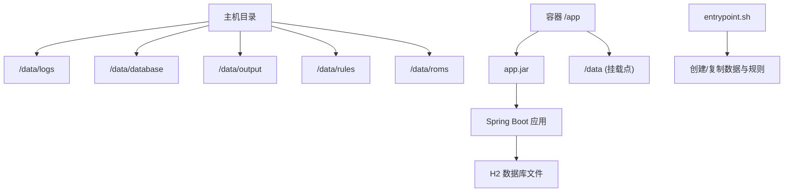
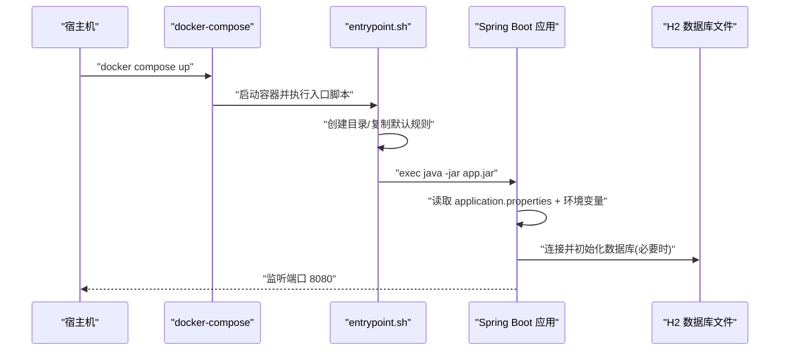
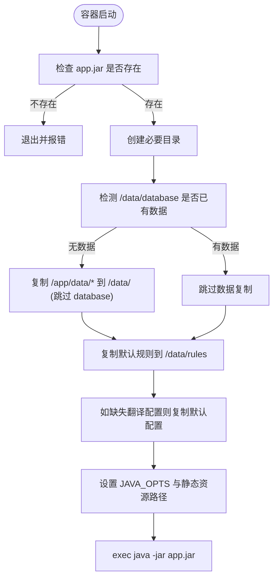
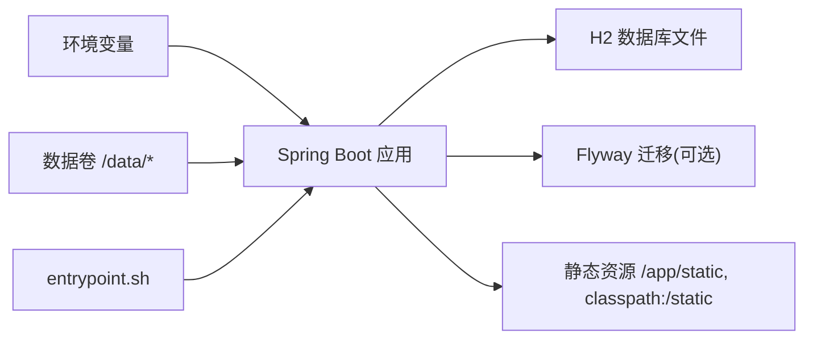

# 环境配置管理

<cite>
**本文引用的文件**
- [Dockerfile](file://Dockerfile)
- [Dockerfile.cn](file://Dockerfile.cn)
- [Dockerfile.local](file://Dockerfile.local)
- [docker-compose.yml](file://docker-compose.yml)
- [entrypoint.sh](file://entrypoint.sh)
- [application.properties](file://src/main/resources/application.properties)
- [DataDirectoryInitializer.java](file://src/main/java/com/gamelist/config/DataDirectoryInitializer.java)
- [DatabaseInitializer.java](file://src/main/java/com/gamelist/config/DatabaseInitializer.java)
- [FlywayConfig.java](file://src/main/java/com/gamelist/config/FlywayConfig.java)
- [ConfigManager.java](file://src/main/java/com/gamelist/service/impl/ConfigManager.java)
</cite>

## 目录
1. [简介](#简介)
2. [项目结构](#项目结构)
3. [核心组件](#核心组件)
4. [架构总览](#架构总览)
5. [详细组件分析](#详细组件分析)
6. [依赖关系分析](#依赖关系分析)
7. [性能考虑](#性能考虑)
8. [故障排除指南](#故障排除指南)
9. [结论](#结论)
10. [附录：多环境配置与部署示例](#附录多环境配置与部署示例)

## 简介
本文件面向WebGameListOper的环境配置管理，覆盖开发、测试、生产等不同部署环境的差异与环境变量管理；详细说明Docker容器化构建与编排（Dockerfile、docker-compose）、环境变量传递、数据卷挂载；解释启动脚本entrypoint.sh的初始化流程；给出数据目录初始化的配置选项（权限、目录结构、默认值）；并提供多环境最佳实践、不同部署场景的配置示例与常见问题排查。

## 项目结构
- 应用以Spring Boot为基础，使用H2嵌入式数据库与MyBatis，静态资源位于resources/static，规则模板位于rules目录。
- 通过Docker多阶段构建镜像，使用entrypoint.sh完成运行时数据目录初始化与规则同步，再以java -jar方式启动应用。
- docker-compose负责端口映射、数据持久化、健康检查与资源限制。

图表来源
- [docker-compose.yml:7-18](file://docker-compose.yml#L7-L18)
- [entrypoint.sh:31-83](file://entrypoint.sh#L31-L83)
- [application.properties:15-19](file://src/main/resources/application.properties#L15-L19)

章节来源
- [docker-compose.yml:1-33](file://docker-compose.yml#L1-L33)
- [Dockerfile:1-55](file://Dockerfile#L1-L55)
- [entrypoint.sh:1-93](file://entrypoint.sh#L1-L93)
- [application.properties:1-86](file://src/main/resources/application.properties#L1-L86)

## 核心组件
- 数据目录初始化器：在应用环境准备阶段自动创建必要目录，确保运行期路径可用。
- 数据库初始化器：首次启动时执行SQL初始化脚本，保证基础表存在。
- Flyway配置：可选启用迁移校验与基线版本控制。
- 启动脚本：负责目录创建、默认规则释放、日志目录准备、Java参数注入与最终进程启动。
- Docker与Compose：定义构建过程、镜像层、数据卷挂载、环境变量与健康检查。

章节来源
- [DataDirectoryInitializer.java:18-91](file://src/main/java/com/gamelist/config/DataDirectoryInitializer.java#L18-L91)
- [DatabaseInitializer.java:34-52](file://src/main/java/com/gamelist/config/DatabaseInitializer.java#L34-L52)
- [FlywayConfig.java:17-44](file://src/main/java/com/gamelist/config/FlywayConfig.java#L17-L44)
- [entrypoint.sh:20-92](file://entrypoint.sh#L20-L92)
- [docker-compose.yml:1-33](file://docker-compose.yml#L1-L33)

## 架构总览
下图展示了从容器启动到应用就绪的关键流程：entrypoint.sh进行环境与数据准备，随后启动Spring Boot应用；应用读取application.properties与外部环境变量，初始化数据目录与数据库，并暴露HTTP服务。

图表来源
- [docker-compose.yml:1-33](file://docker-compose.yml#L1-L33)
- [entrypoint.sh:86-92](file://entrypoint.sh#L86-L92)
- [application.properties:15-19](file://src/main/resources/application.properties#L15-L19)
- [DatabaseInitializer.java:34-52](file://src/main/java/com/gamelist/config/DatabaseInitializer.java#L34-L52)

## 详细组件分析

### 启动脚本 entrypoint.sh
- 功能要点
  - 创建必要的运行时目录（规则、日志、抓取系统目录等）。
  - 将容器内默认数据复制到挂载目录/data，但保护已有数据库不被覆盖。
  - 强制覆盖默认导出规则与导入模板，确保升级后使用最新内置规则。
  - 若翻译配置文件不存在则复制默认配置。
  - 设置JAVA_OPTS与静态资源路径参数，最后以exec方式启动应用。
- 关键行为
  - 当检测到/data/database已有内容时，跳过所有数据复制，避免覆盖用户数据。
  - 对非database目录，仅在目标不存在时复制，减少重复IO。
  - 通过追加-Dspring.web.resources.static-locations=file:/app/static/,classpath:/static/，优先使用容器内静态资源目录。

图表来源
- [entrypoint.sh:27-92](file://entrypoint.sh#L27-L92)

章节来源
- [entrypoint.sh:1-93](file://entrypoint.sh#L1-L93)

### 数据目录初始化 DataDirectoryInitializer
- 触发时机：Spring环境准备阶段，早于大多数Bean初始化。
- 职责：解析数据库URL中的H2文件路径，确保数据库目录存在；同时创建data、rules/import、rules/export、output、input、logs等目录。
- 健壮性：仅创建不存在的目录，记录成功/失败日志；异常被捕获不影响后续启动。

章节来源
- [DataDirectoryInitializer.java:18-91](file://src/main/java/com/gamelist/config/DataDirectoryInitializer.java#L18-L91)

### 数据库初始化 DatabaseInitializer
- 触发时机：应用启动完成后作为ApplicationRunner执行。
- 职责：检查平台表是否存在，若不存在则加载并执行sql/init.sql进行初始化；支持事务提交与回滚。
- 安全策略：检查失败时保守认为已存在，避免误删数据。

章节来源
- [DatabaseInitializer.java:34-102](file://src/main/java/com/gamelist/config/DatabaseInitializer.java#L34-L102)

### Flyway 配置
- 通过属性开关控制是否启用Flyway迁移；可配置迁移位置与基线版本。
- 建议在生产环境开启迁移校验，并在升级前备份数据库。

章节来源
- [FlywayConfig.java:17-44](file://src/main/java/com/gamelist/config/FlywayConfig.java#L17-L44)
- [application.properties:33-37](file://src/main/resources/application.properties#L33-L37)

### 配置管理器 ConfigManager
- 作用：加载translation-config.json，维护变量映射与服务配置，支持热重载。
- 变量注入：服务请求体或头中可通过${变量名}引用variables中的值。
- 热重载：提供reloadConfig方法，配合调用方可实现动态刷新。

章节来源
- [ConfigManager.java:30-50](file://src/main/java/com/gamelist/service/impl/ConfigManager.java#L30-L50)
- [ConfigManager.java:154-197](file://src/main/java/com/gamelist/service/impl/ConfigManager.java#L154-L197)

## 依赖关系分析
- 应用启动依赖：
  - 环境变量：SPRING_PROFILES_ACTIVE、SERVER_TOMCAT_BASEDIR、SPRING_RESOURCES_STATIC_LOCATIONS、JAVA_OPTS等。
  - 数据卷：/data下的子目录用于持久化日志、数据库、输出、规则与ROM。
  - 静态资源：优先使用file:/app/static/，其次classpath:/static/。
- 组件耦合：
  - entrypoint.sh与DataDirectoryInitializer共同保障目录可用性。
  - DatabaseInitializer与H2文件路径由application.properties决定。
  - FlywayConfig与application.properties中的flyway相关属性绑定。

图表来源
- [docker-compose.yml:14-18](file://docker-compose.yml#L14-L18)
- [application.properties:10-13](file://src/main/resources/application.properties#L10-L13)
- [entrypoint.sh:86-92](file://entrypoint.sh#L86-L92)

章节来源
- [docker-compose.yml:1-33](file://docker-compose.yml#L1-L33)
- [application.properties:1-86](file://src/main/resources/application.properties#L1-L86)

## 性能考虑
- JVM参数：通过JAVA_OPTS调整堆大小与GC策略，建议在compose中按实际负载调优。
- 静态资源缓存：开发环境关闭缓存便于调试；生产环境可开启以提高响应速度。
- 数据库连接池：根据并发量调整最大连接数与超时时间。
- 磁盘I/O：避免频繁复制大体积数据；entrypoint已优化为增量复制。

[本节为通用指导，无需特定文件来源]

## 故障排除指南
- 无法访问静态资源
  - 确认已通过环境变量或启动参数正确设置spring.web.resources.static-locations，且容器内/app/static目录存在。
  - 参考：[application.properties:10-13](file://src/main/resources/application.properties#L10-L13)、[entrypoint.sh:89-91](file://entrypoint.sh#L89-L91)
- 数据库目录不存在或无写入权限
  - 检查/data/database是否由volume挂载且具备写权限；应用会在启动前尝试创建目录。
  - 参考：[DataDirectoryInitializer.java:27-43](file://src/main/java/com/gamelist/config/DataDirectoryInitializer.java#L27-L43)
- 规则未生效或版本不一致
  - entrypoint会强制覆盖export/import规则，确保使用最新内置规则；如需保留自定义规则，请修改规则文件名或避免同名覆盖。
  - 参考：[entrypoint.sh:68-80](file://entrypoint.sh#L68-L80)
- 翻译服务不可用
  - 检查translation-config.json中variables是否配置完整，并通过ConfigManager.reloadConfig()热重载。
  - 参考：[ConfigManager.java:154-197](file://src/main/java/com/gamelist/service/impl/ConfigManager.java#L154-L197)
- 健康检查失败
  - 确认actuator端点可达，或在compose中调整healthcheck命令与重试间隔。
  - 参考：[docker-compose.yml:20-25](file://docker-compose.yml#L20-L25)

章节来源
- [DataDirectoryInitializer.java:27-43](file://src/main/java/com/gamelist/config/DataDirectoryInitializer.java#L27-L43)
- [entrypoint.sh:68-91](file://entrypoint.sh#L68-L91)
- [ConfigManager.java:154-197](file://src/main/java/com/gamelist/service/impl/ConfigManager.java#L154-L197)
- [docker-compose.yml:20-25](file://docker-compose.yml#L20-L25)

## 结论
本项目通过“容器入口脚本 + Spring环境初始化 + 数据卷持久化”的组合，实现了跨环境的一致性与可运维性。推荐在多环境中统一使用环境变量驱动配置，结合数据卷隔离数据与规则，利用entrypoint保证默认资源与目录结构的完整性。生产环境应开启Flyway迁移校验、合理设置JVM与连接池参数，并建立定期备份策略。

[本节为总结性内容，无需特定文件来源]

## 附录：多环境配置与部署示例

### 环境变量与配置分离
- 使用环境变量覆盖关键配置项：
  - SPRING_PROFILES_ACTIVE：切换环境profile（如default/dev/test/prod）。
  - SERVER_TOMCAT_BASEDIR：指定Tomcat工作目录，便于隔离临时文件。
  - SPRING_RESOURCES_STATIC_LOCATIONS：扩展静态资源路径，支持外部目录映射。
  - JAVA_OPTS：JVM内存与GC参数。
- 配置文件优先级：
  - application.properties提供默认值；环境变量可在运行时覆盖。
  - 规则与模板通过/data/rules持久化，便于在不同环境间共享或独立管理。

章节来源
- [docker-compose.yml:14-18](file://docker-compose.yml#L14-L18)
- [application.properties:10-13](file://src/main/resources/application.properties#L10-L13)

### Docker构建与镜像
- 多阶段构建：
  - 构建阶段使用Maven编译打包，运行阶段仅包含JRE与JAR，减小镜像体积。
  - 国内镜像源加速依赖下载（可选）。
- 静态资源与规则：
  - 将静态HTML与默认规则复制到镜像中，启动时再按需释放到/data。

章节来源
- [Dockerfile:1-55](file://Dockerfile#L1-L55)
- [Dockerfile.cn:1-56](file://Dockerfile.cn#L1-L56)
- [Dockerfile.local:1-56](file://Dockerfile.local#L1-L56)

### docker-compose编排
- 端口映射：8080对外暴露。
- 数据卷挂载：
  - logs、database、output、rules、roms、backup分别映射到宿主机目录，确保数据持久化与可观测性。
- 健康检查：基于actuator端点探测服务可用性。
- 资源限制：CPU与内存上限与预留，防止资源争用。

章节来源
- [docker-compose.yml:1-33](file://docker-compose.yml#L1-L33)

### 数据目录初始化与权限
- 目录结构：
  - /data/database：H2数据库文件存储。
  - /data/rules/export、/data/rules/import：导出规则与导入模板。
  - /data/output：导出结果输出。
  - /data/logs：应用日志。
  - /data/roms：游戏ROM文件。
  - /data/backup：备份目录。
- 权限建议：
  - 确保挂载目录对容器内运行用户可读写；Linux下可使用chown或chmod调整宿主目录权限。
  - 避免直接修改容器内只读层文件，所有变更应在/data下进行。

章节来源
- [entrypoint.sh:31-83](file://entrypoint.sh#L31-L83)
- [application.properties:15-19](file://src/main/resources/application.properties#L15-L19)

### 敏感信息保护
- 将API密钥等敏感信息放入translation-config.json的variables中，并通过只读挂载或密钥管理服务注入，避免硬编码。
- 生产环境禁用H2控制台或限制访问。

章节来源
- [ConfigManager.java:52-152](file://src/main/java/com/gamelist/service/impl/ConfigManager.java#L52-L152)
- [application.properties:55-58](file://src/main/resources/application.properties#L55-L58)

### 配置热重载
- 通过ConfigManager.reloadConfig()重新加载translation-config.json，适用于在线调整翻译服务配置而无需重启应用。
- 注意：热重载后需确保下游服务能感知配置变化（如清理缓存）。

章节来源
- [ConfigManager.java:194-197](file://src/main/java/com/gamelist/service/impl/ConfigManager.java#L194-L197)

### 不同部署场景示例
- 本地开发
  - 使用Dockerfile.local快速构建，挂载当前目录到/data以便即时修改规则与输出。
  - 关闭静态资源缓存，便于前端调试。
- 测试环境
  - 使用docker-compose部署，启用健康检查，限制资源，使用独立数据卷隔离测试数据。
- 生产环境
  - 使用稳定版Dockerfile，启用Flyway迁移校验，配置合理的JVM参数与连接池，定期备份/data/database与/data/backup。

章节来源
- [Dockerfile.local:1-56](file://Dockerfile.local#L1-L56)
- [docker-compose.yml:20-33](file://docker-compose.yml#L20-L33)
- [application.properties:21-28](file://src/main/resources/application.properties#L21-L28)