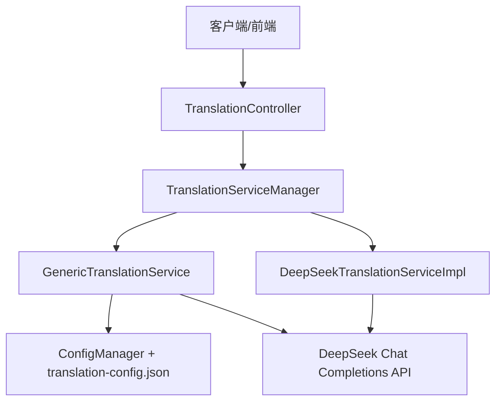
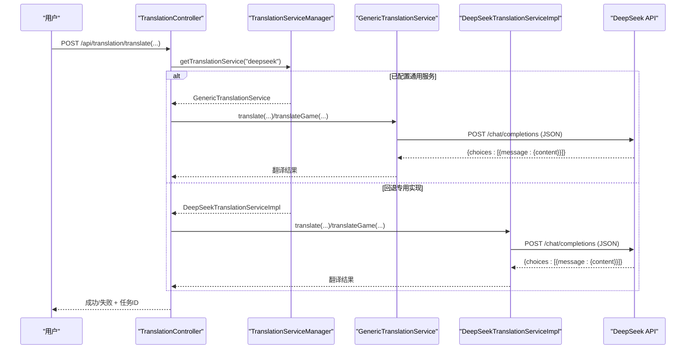
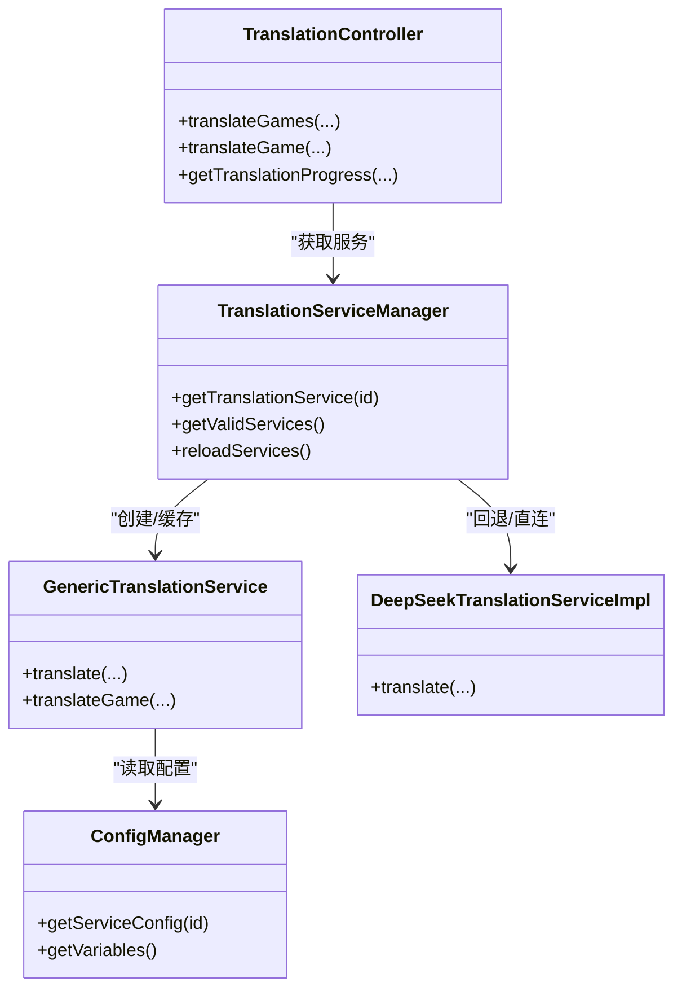

# DeepSeek翻译服务配置

<cite>
**本文引用的文件**
- [DeepSeekTranslationServiceImpl.java](file://src/main/java/com/gamelist/service/impl/DeepSeekTranslationServiceImpl.java)
- [GenericTranslationService.java](file://src/main/java/com/gamelist/service/impl/GenericTranslationService.java)
- [TranslationServiceFactory.java](file://src/main/java/com/gamelist/service/impl/TranslationServiceFactory.java)
- [TranslationController.java](file://src/main/java/com/gamelist/controller/TranslationController.java)
- [translation-config.json](file://rules/translation-config.json)
- [ConfigManager.java](file://src/main/java/com/gamelist/service/impl/ConfigManager.java)
- [TranslationService.java](file://src/main/java/com/gamelist/service/TranslationService.java)
- [application.properties](file://src/main/resources/application.properties)
</cite>

## 目录
1. [简介](#简介)
2. [项目结构](#项目结构)
3. [核心组件](#核心组件)
4. [架构总览](#架构总览)
5. [详细组件分析](#详细组件分析)
6. [依赖关系分析](#依赖关系分析)
7. [性能与并发](#性能与并发)
8. [故障排查指南](#故障排查指南)
9. [结论](#结论)
10. [附录：配置清单与最佳实践](#附录：配置清单与最佳实践)

## 简介
本文件面向需要在项目中接入并使用 DeepSeek AI 大模型进行游戏名称与描述翻译的开发者与运维人员，提供从 API 认证、请求格式定制、响应解析、到提示词工程、质量评估、成本控制、并发限制与错误恢复策略的完整配置与使用指南。文档同时覆盖两种实现路径：
- 基于通用配置的 GenericTranslationService（推荐）：通过 rules/translation-config.json 声明式配置 DeepSeek 的请求体、头、参数与响应路径，无需修改代码即可切换或扩展。
- 基于专用实现的 DeepSeekTranslationServiceImpl：直接调用 DeepSeek 聊天接口，适合快速集成与最小化依赖场景。

## 项目结构
本项目采用分层与模块化组织：
- 控制器层：TranslationController 暴露翻译相关 REST 接口，负责任务编排、进度跟踪与错误收集。
- 服务层：
  - TranslationService 接口定义统一翻译能力。
  - GenericTranslationService 通过 JSON 配置驱动任意 HTTP 翻译服务（包括 DeepSeek）。
  - DeepSeekTranslationServiceImpl 为 DeepSeek 的专用实现。
  - TranslationServiceFactory 与 TranslationServiceManager 负责服务实例创建与缓存。
- 配置层：
  - rules/translation-config.json 集中管理各翻译服务的 URL、方法、请求体、响应路径、变量与校验规则。
  - ConfigManager 加载并维护 variables 与服务配置。
- 应用配置：application.properties 设置服务器、数据库、日志等运行参数。

图表来源
- [TranslationController.java:84-235](file://src/main/java/com/gamelist/controller/TranslationController.java#L84-L235)
- [TranslationServiceManager.java:28-41](file://src/main/java/com/gamelist/service/impl/TranslationServiceManager.java#L28-L41)
- [GenericTranslationService.java:204-280](file://src/main/java/com/gamelist/service/impl/GenericTranslationService.java#L204-L280)
- [DeepSeekTranslationServiceImpl.java:26-93](file://src/main/java/com/gamelist/service/impl/DeepSeekTranslationServiceImpl.java#L26-L93)
- [translation-config.json:86-145](file://rules/translation-config.json#L86-L145)

章节来源
- [TranslationController.java:84-235](file://src/main/java/com/gamelist/controller/TranslationController.java#L84-L235)
- [translation-config.json:1-149](file://rules/translation-config.json#L1-L149)
- [application.properties:1-86](file://src/main/resources/application.properties#L1-L86)

## 核心组件
- 翻译接口与结果
  - TranslationService：定义 translate(text, sourceLang, targetLang) 与 translateGame(gameName, gameDescription, sourceLang, targetLang)。
  - TranslationResult：封装游戏名称与描述的翻译结果。
- 通用翻译服务
  - GenericTranslationService：根据 serviceId 从配置中读取 URL、Method、Headers、Params、RequestBody、ResponsePath、ResponseParser，动态构建请求并解析响应；支持变量替换与数组/对象嵌套处理。
- DeepSeek 专用实现
  - DeepSeekTranslationServiceImpl：固定调用 https://api.deepseek.com/chat/completions，构造 system/user 消息，设置 temperature 与 max_tokens，返回 choices[0].message.content。
- 工厂与管理器
  - TranslationServiceFactory：按类型创建具体翻译服务实例（含 deepseek），并包装为带通用错误处理的 Wrapper。
  - TranslationServiceManager：单例管理，按 serviceId 获取并缓存服务实例，支持有效服务列表查询与配置重载。
- 控制器
  - TranslationController：提供 /api/translation/* 接口，支持单个/批量翻译、任务进度查询、错误子集导出等。

章节来源
- [TranslationService.java:1-33](file://src/main/java/com/gamelist/service/TranslationService.java#L1-L33)
- [GenericTranslationService.java:204-443](file://src/main/java/com/gamelist/service/impl/GenericTranslationService.java#L204-L443)
- [DeepSeekTranslationServiceImpl.java:17-118](file://src/main/java/com/gamelist/service/impl/DeepSeekTranslationServiceImpl.java#L17-L118)
- [TranslationServiceFactory.java:5-46](file://src/main/java/com/gamelist/service/impl/TranslationServiceFactory.java#L5-L46)
- [TranslationServiceManager.java:11-110](file://src/main/java/com/gamelist/service/impl/TranslationServiceManager.java#L11-L110)
- [TranslationController.java:30-643](file://src/main/java/com/gamelist/controller/TranslationController.java#L30-L643)

## 架构总览
系统通过控制器接收翻译请求，选择或创建翻译服务实例，将文本发送至 DeepSeek 聊天接口，解析返回内容后更新游戏数据，并提供异步任务进度与错误记录。

图表来源
- [TranslationController.java:84-235](file://src/main/java/com/gamelist/controller/TranslationController.java#L84-L235)
- [TranslationServiceManager.java:28-41](file://src/main/java/com/gamelist/service/impl/TranslationServiceManager.java#L28-L41)
- [GenericTranslationService.java:204-280](file://src/main/java/com/gamelist/service/impl/GenericTranslationService.java#L204-L280)
- [DeepSeekTranslationServiceImpl.java:26-93](file://src/main/java/com/gamelist/service/impl/DeepSeekTranslationServiceImpl.java#L26-L93)

## 详细组件分析

### DeepSeek 接入方式与 API 认证
- 认证方式
  - 通用配置模式：在 headers 中注入 Authorization: Bearer ${deepseek_api_key}，变量 deepseek_api_key 在 variables 中配置。
  - 专用实现模式：在请求头中直接拼接 Bearer + apiKey。
- 端点与模型
  - 端点：https://api.deepseek.com/chat/completions
  - 模型：deepseek-chat
- 变量与校验
  - requiredVariables: ["deepseek_api_key"]
  - 若未配置或为空，服务将被判定为无效，无法启用。

章节来源
- [translation-config.json:86-145](file://rules/translation-config.json#L86-L145)
- [ConfigManager.java:55-154](file://src/main/java/com/gamelist/service/impl/ConfigManager.java#L55-L154)
- [DeepSeekTranslationServiceImpl.java:17-33](file://src/main/java/com/gamelist/service/impl/DeepSeekTranslationServiceImpl.java#L17-L33)

### 基于 AI 大模型的翻译能力
- 上下文理解
  - 通过 messages 中的 system 与 user 角色分工，将“翻译风格、术语保留、输出约束”写入 system 提示，提升语义一致性。
- 语义翻译
  - 使用 chat/completions 接口，结合目标语言与待翻译文本，获得更自然的本地化结果。
- 个性化选项
  - temperature：控制创造性，建议低值（如 0.1）保证稳定性。
  - max_tokens：限制输出长度，避免冗余。
  - 针对“仅名称”和“名称+描述”的不同场景，分别提供 deepseek 与 deepseek-both 配置。

章节来源
- [translation-config.json:86-145](file://rules/translation-config.json#L86-L145)
- [DeepSeekTranslationServiceImpl.java:34-56](file://src/main/java/com/gamelist/service/impl/DeepSeekTranslationServiceImpl.java#L34-L56)

### 请求格式定制
- 通用配置字段说明
  - url/method：HTTP 方法与端点。
  - headers：请求头，支持变量替换。
  - params：URL 查询参数。
  - requestBody：请求体，支持对象/数组/字符串模板，变量包括 {text}/{sourceLang}/{targetLang}/{gameName}/{gameDescription}。
  - responsePath：JSON 路径提取最终文本。
  - responseParser：内置解析器（如 microsoftGameNameDescription、gameNameDescription、plainText）。
- DeepSeek 示例
  - deepseek：单条文本翻译，messages 包含 system 与 user。
  - deepseek-both：同时翻译名称与描述，配合 responseParser 拆分结果。

章节来源
- [GenericTranslationService.java:246-379](file://src/main/java/com/gamelist/service/impl/GenericTranslationService.java#L246-L379)
- [translation-config.json:86-145](file://rules/translation-config.json#L86-L145)

### 响应结果处理
- 路径提取：responsePath 指向 choices[0].message.content。
- 解析器：
  - gameNameDescription：从“游戏名称：... 游戏描述：...”结构中拆分两部分。
  - microsoftGameNameDescription：适配微软双段返回。
  - plainText：直接返回文本。
- 错误处理：非 2xx 状态码抛出异常，携带响应体便于定位问题。

章节来源
- [GenericTranslationService.java:365-443](file://src/main/java/com/gamelist/service/impl/GenericTranslationService.java#L365-L443)
- [DeepSeekTranslationServiceImpl.java:71-93](file://src/main/java/com/gamelist/service/impl/DeepSeekTranslationServiceImpl.java#L71-L93)

### 模型参数调优
- temperature：建议 0.1~0.3，平衡准确性与多样性。
- max_tokens：短文本（名称）建议 50；长文本（描述）建议 200~500。
- messages 设计：system 明确约束输出格式与术语保留；user 传入目标语言与待翻译内容。
- 流式与非流式：当前为非流式（stream=false），如需流式可调整配置并在上层消费增量。

章节来源
- [translation-config.json:86-145](file://rules/translation-config.json#L86-L145)
- [DeepSeekTranslationServiceImpl.java:54-56](file://src/main/java/com/gamelist/service/impl/DeepSeekTranslationServiceImpl.java#L54-L56)

### 高质量翻译的配置技巧
- 提示词工程
  - system 中强调“只输出翻译结果”，避免多余解释。
  - 指定术语保留策略（如 RPG、FPS、技能名等）。
  - 对名称与描述分别给出风格要求（名称信达雅，描述流畅自然）。
- 翻译风格设定
  - 通过不同 service 配置区分“仅名称”与“名称+描述”。
  - 使用 responseParser 精准拆分多段输出。
- 质量评估指标
  - 人工抽检：术语一致性、语气风格、可读性。
  - 自动化辅助：重复率统计、长度阈值、敏感词过滤。
  - 回归对比：同一批样本在不同温度/提示词下的差异。

章节来源
- [translation-config.json:86-145](file://rules/translation-config.json#L86-L145)
- [GenericTranslationService.java:381-416](file://src/main/java/com/gamelist/service/impl/GenericTranslationService.java#L381-L416)

### 成本控制、并发限制与错误恢复
- 成本控制
  - 降低 temperature 与 max_tokens 减少 token 消耗。
  - 批量翻译时合并请求（若上游支持）以减少往返。
  - 缓存热点文本翻译结果，避免重复调用。
- 并发限制
  - 控制器使用线程逐条执行翻译，注意服务端限流与重试。
  - 可在上层增加令牌桶/滑动窗口限流，避免触发 API 配额。
- 错误恢复
  - 网络/超时：捕获 IOException 并重试（指数退避）。
  - 业务错误：解析 error.message，记录到任务错误列表，支持后续导出与重跑。
  - 降级策略：当 DeepSeek 不可用时，可回退至其他可用服务（需配置）。

章节来源
- [TranslationController.java:139-221](file://src/main/java/com/gamelist/controller/TranslationController.java#L139-L221)
- [GenericTranslationService.java:229-243](file://src/main/java/com/gamelist/service/impl/GenericTranslationService.java#L229-L243)
- [DeepSeekTranslationServiceImpl.java:71-93](file://src/main/java/com/gamelist/service/impl/DeepSeekTranslationServiceImpl.java#L71-L93)

## 依赖关系分析
- 控制器依赖管理器与任务服务，负责编排与进度上报。
- 管理器依赖配置管理器，按 serviceId 获取并缓存服务实例。
- 通用服务依赖 JSON 配置，解耦具体 API 细节。
- 专用实现直接依赖 OkHttp 与 JSON 库。

图表来源
- [TranslationController.java:30-643](file://src/main/java/com/gamelist/controller/TranslationController.java#L30-L643)
- [TranslationServiceManager.java:11-110](file://src/main/java/com/gamelist/service/impl/TranslationServiceManager.java#L11-L110)
- [GenericTranslationService.java:186-201](file://src/main/java/com/gamelist/service/impl/GenericTranslationService.java#L186-L201)
- [DeepSeekTranslationServiceImpl.java:17-24](file://src/main/java/com/gamelist/service/impl/DeepSeekTranslationServiceImpl.java#L17-L24)
- [ConfigManager.java:55-154](file://src/main/java/com/gamelist/service/impl/ConfigManager.java#L55-L154)

## 性能与并发
- 连接池与超时
  - 通用服务使用 OkHttpClient 并设置连接/读写超时，建议根据网络环境调优。
- 任务并行度
  - 控制器以新线程顺序遍历游戏列表，可按需引入线程池与限流器控制并发。
- 缓存与去重
  - 建议在内存或 Redis 中缓存相同文本的翻译结果，显著降低成本与延迟。
- 日志与监控
  - 开启关键步骤日志（请求/响应摘要），结合外部监控追踪耗时与错误率。

章节来源
- [GenericTranslationService.java:196-201](file://src/main/java/com/gamelist/service/impl/GenericTranslationService.java#L196-L201)
- [TranslationController.java:139-221](file://src/main/java/com/gamelist/controller/TranslationController.java#L139-L221)
- [application.properties:43-53](file://src/main/resources/application.properties#L43-L53)

## 故障排查指南
- 常见问题
  - API Key 为空或未配置：服务被判定无效，无法启用。
  - 网络错误：检查代理、防火墙与域名可达性。
  - 非 2xx 响应：查看响应体中的错误信息，确认模型/权限/配额。
  - 解析失败：核对 responsePath 与实际响应结构是否一致。
- 定位步骤
  - 使用 /api/translation/services 检查可用服务。
  - 使用 /api/translation/progress/{taskId} 查看任务进度与错误列表。
  - 必要时导出错误子集，隔离问题条目重跑。
- 恢复策略
  - 重试机制：对瞬时错误实施指数退避重试。
  - 降级：切换到备用翻译服务。
  - 熔断：连续失败达到阈值时暂停任务，等待恢复。

章节来源
- [TranslationController.java:67-79](file://src/main/java/com/gamelist/controller/TranslationController.java#L67-L79)
- [TranslationController.java:505-529](file://src/main/java/com/gamelist/controller/TranslationController.java#L505-L529)
- [GenericTranslationService.java:229-243](file://src/main/java/com/gamelist/service/impl/GenericTranslationService.java#L229-L243)
- [DeepSeekTranslationServiceImpl.java:71-93](file://src/main/java/com/gamelist/service/impl/DeepSeekTranslationServiceImpl.java#L71-L93)

## 结论
本项目提供了两套 DeepSeek 接入方案：推荐通过 rules/translation-config.json 使用 GenericTranslationService 进行声明式配置，灵活可控且易于扩展；也可使用 DeepSeekTranslationServiceImpl 快速集成。通过合理的提示词工程、参数调优与质量控制手段，可获得稳定、高质量的翻译结果。在生产环境中，应重视成本控制、并发限制与错误恢复策略，确保高可用与低成本运行。

## 附录：配置清单与最佳实践
- 必要变量
  - deepseek_api_key：必须配置，用于 Authorization: Bearer。
- 服务配置要点
  - url：https://api.deepseek.com/chat/completions
  - method：POST
  - headers：Content-Type=application/json；Authorization=Bearer ${deepseek_api_key}
  - requestBody：model=deepseek-chat；messages=[system,user]；temperature=0.1；max_tokens=按需设置
  - responsePath：choices[0].message.content
- 常用场景
  - 仅名称：使用 deepseek 配置，max_tokens≈50。
  - 名称+描述：使用 deepseek-both 配置，max_tokens≈200~500，配合 responseParser=gameNameDescription。
- 最佳实践
  - 提示词：明确“只输出翻译结果”“保留术语”“目标语言”。
  - 质量评估：抽样人工审核 + 自动化指标（重复率、长度、敏感词）。
  - 成本优化：降低 temperature/max_tokens；缓存热点；合并请求。
  - 并发与限流：引入令牌桶/滑动窗口；监控 QPS 与错误率。
  - 错误恢复：指数退避重试；降级到备用服务；导出错误子集重跑。

章节来源
- [translation-config.json:1-149](file://rules/translation-config.json#L1-L149)
- [ConfigManager.java:55-154](file://src/main/java/com/gamelist/service/impl/ConfigManager.java#L55-L154)
- [GenericTranslationService.java:246-379](file://src/main/java/com/gamelist/service/impl/GenericTranslationService.java#L246-L379)
- [DeepSeekTranslationServiceImpl.java:26-93](file://src/main/java/com/gamelist/service/impl/DeepSeekTranslationServiceImpl.java#L26-L93)