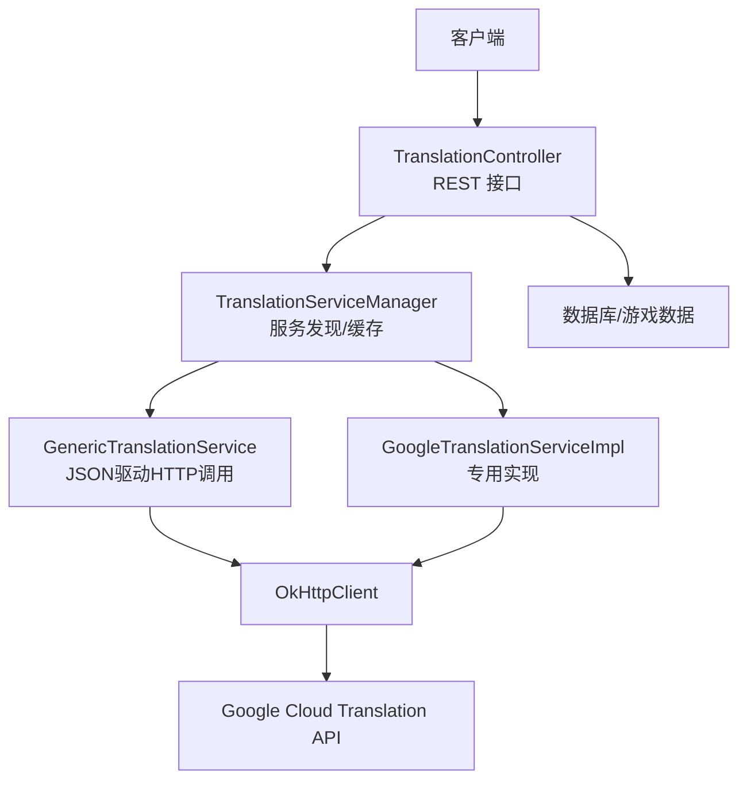
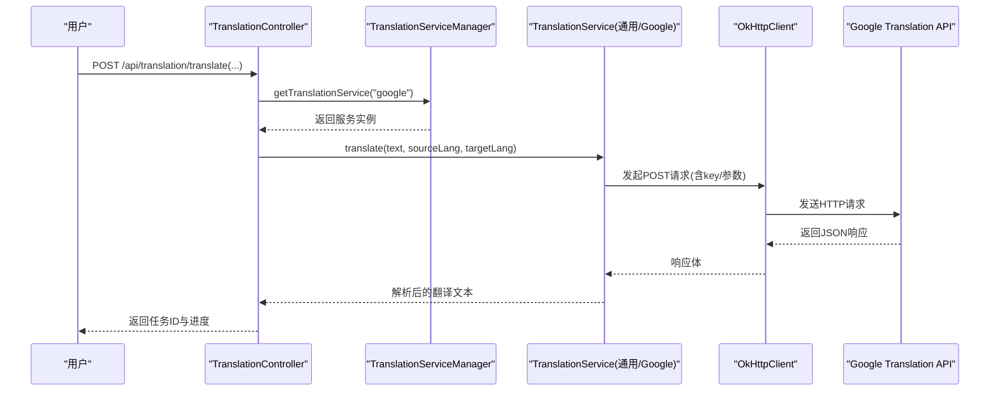
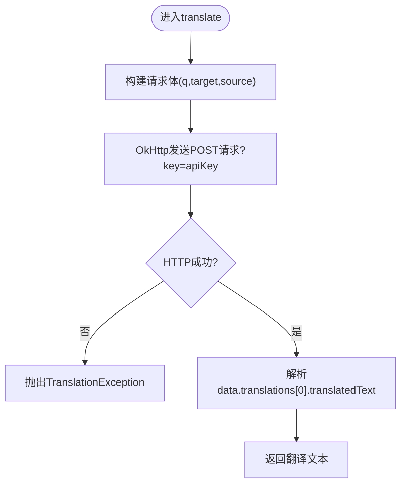
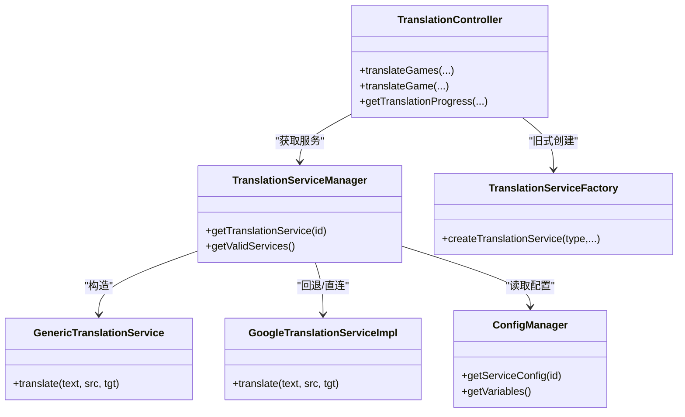

# Google翻译服务配置

<cite>
**本文引用的文件**
- [GoogleTranslationServiceImpl.java](file://src/main/java/com/gamelist/service/impl/GoogleTranslationServiceImpl.java)
- [TranslationService.java](file://src/main/java/com/gamelist/service/TranslationService.java)
- [TranslationController.java](file://src/main/java/com/gamelist/controller/TranslationController.java)
- [translation-config.json](file://rules/translation-config.json)
- [ConfigManager.java](file://src/main/java/com/gamelist/service/impl/ConfigManager.java)
- [TranslationServiceFactory.java](file://src/main/java/com/gamelist/service/impl/TranslationServiceFactory.java)
- [TranslationServiceManager.java](file://src/main/java/com/gamelist/service/impl/TranslationServiceManager.java)
- [GenericTranslationService.java](file://src/main/java/com/gamelist/service/impl/GenericTranslationService.java)
- [application.properties](file://src/main/resources/application.properties)
- [LanguageDetector.java](file://src/main/java/com/gamelist/util/LanguageDetector.java)
- [Translation.md](file://wiki/Translation.md)
</cite>

## 目录
1. [简介](#简介)
2. [项目结构](#项目结构)
3. [核心组件](#核心组件)
4. [架构总览](#架构总览)
5. [详细组件分析](#详细组件分析)
6. [依赖关系分析](#依赖关系分析)
7. [性能与配额管理](#性能与配额管理)
8. [故障排查指南](#故障排查指南)
9. [结论](#结论)
10. [附录](#附录)

## 简介
本文件面向需要在系统中启用并配置 Google Cloud Translation API 的开发者与运维人员，提供从启用 API、获取密钥、RESTful 调用方式、请求参数与响应处理，到多语言支持、语言代码规范、错误处理最佳实践、配额与成本控制、以及性能优化的完整指南。系统同时支持通过通用翻译服务（基于 JSON 配置）与专用实现（OkHttp 直调）两种方式接入 Google 翻译。

## 项目结构
围绕 Google 翻译的关键位置如下：
- 控制器层：对外暴露翻译任务接口，负责创建任务、异步执行、进度查询与错误收集
- 服务层：封装具体翻译实现（Google 专用实现与通用实现），统一异常与结果提取
- 配置层：集中管理翻译服务配置、变量注入与校验
- 工具层：语言检测等辅助能力

图表来源
- [TranslationController.java:84-235](file://src/main/java/com/gamelist/controller/TranslationController.java#L84-L235)
- [TranslationServiceManager.java:28-41](file://src/main/java/com/gamelist/service/impl/TranslationServiceManager.java#L28-L41)
- [GenericTranslationService.java:191-244](file://src/main/java/com/gamelist/service/impl/GenericTranslationService.java#L191-L244)
- [GoogleTranslationServiceImpl.java:19-57](file://src/main/java/com/gamelist/service/impl/GoogleTranslationServiceImpl.java#L19-L57)

章节来源
- [TranslationController.java:84-235](file://src/main/java/com/gamelist/controller/TranslationController.java#L84-L235)
- [TranslationServiceManager.java:28-41](file://src/main/java/com/gamelist/service/impl/TranslationServiceManager.java#L28-L41)
- [GenericTranslationService.java:191-244](file://src/main/java/com/gamelist/service/impl/GenericTranslationService.java#L191-L244)
- [GoogleTranslationServiceImpl.java:19-57](file://src/main/java/com/gamelist/service/impl/GoogleTranslationServiceImpl.java#L19-L57)

## 核心组件
- 控制器：提供平台级批量翻译、单个游戏翻译、批量 ID 翻译、进度查询与错误子集导出等接口
- 服务抽象：定义 translate 与 translateGame 的统一接口，便于扩展不同翻译后端
- Google 专用实现：使用 OkHttp 直接调用 Google 翻译 REST API v2，按 key 鉴权
- 通用实现：基于 JSON 配置动态构建请求、发送、解析响应，支持多种第三方翻译服务
- 配置管理：加载 translation-config.json，注入变量（如 google_api_key），校验必填项
- 工厂与管理器：根据 serviceId 选择具体实现或通用实现，并进行缓存

章节来源
- [TranslationController.java:84-235](file://src/main/java/com/gamelist/controller/TranslationController.java#L84-L235)
- [TranslationService.java:3-32](file://src/main/java/com/gamelist/service/TranslationService.java#L3-L32)
- [GoogleTranslationServiceImpl.java:10-57](file://src/main/java/com/gamelist/service/impl/GoogleTranslationServiceImpl.java#L10-L57)
- [GenericTranslationService.java:191-244](file://src/main/java/com/gamelist/service/impl/GenericTranslationService.java#L191-L244)
- [ConfigManager.java:13-197](file://src/main/java/com/gamelist/service/impl/ConfigManager.java#L13-L197)
- [TranslationServiceFactory.java:5-45](file://src/main/java/com/gamelist/service/impl/TranslationServiceFactory.java#L5-L45)
- [TranslationServiceManager.java:11-110](file://src/main/java/com/gamelist/service/impl/TranslationServiceManager.java#L11-L110)

## 架构总览
系统采用“控制器 + 服务抽象 + 多实现”的分层设计。控制器接收前端请求，创建后台任务并异步执行翻译；服务层屏蔽底层差异；配置层以 JSON 驱动的方式统一管理各翻译服务的端点、请求体、响应路径与变量注入。

图表来源
- [TranslationController.java:84-235](file://src/main/java/com/gamelist/controller/TranslationController.java#L84-L235)
- [TranslationServiceManager.java:28-41](file://src/main/java/com/gamelist/service/impl/TranslationServiceManager.java#L28-L41)
- [GenericTranslationService.java:203-244](file://src/main/java/com/gamelist/service/impl/GenericTranslationService.java#L203-L244)
- [GoogleTranslationServiceImpl.java:19-57](file://src/main/java/com/gamelist/service/impl/GoogleTranslationServiceImpl.java#L19-L57)

## 详细组件分析

### Google 专用实现（GoogleTranslationServiceImpl）
- 功能要点
  - 使用固定 URL 调用 Google Cloud Translation API v2
  - 通过 URL 参数 key 进行鉴权
  - 请求体包含 q、target、可选 source 字段
  - 响应解析取 data.translations[0].translatedText
  - 网络与解析异常统一包装为 TranslationException
- 适用场景
  - 快速集成、对配置灵活性要求不高的场景
  - 需要稳定、简洁的直连调用流程

图表来源
- [GoogleTranslationServiceImpl.java:19-57](file://src/main/java/com/gamelist/service/impl/GoogleTranslationServiceImpl.java#L19-L57)

章节来源
- [GoogleTranslationServiceImpl.java:10-57](file://src/main/java/com/gamelist/service/impl/GoogleTranslationServiceImpl.java#L10-L57)

### 通用翻译服务（GenericTranslationService）
- 功能要点
  - 基于 JSON 配置动态构建请求（URL、Method、Headers、Params、Body）
  - 支持变量替换（如 ${google_api_key}）
  - 超时与重试策略由 OkHttpClient 控制
  - 响应通过 responsePath 定位翻译结果
  - 统一异常包装与日志输出
- 优势
  - 无需修改代码即可新增/切换翻译服务
  - 便于集中管理与审计

章节来源
- [GenericTranslationService.java:191-244](file://src/main/java/com/gamelist/service/impl/GenericTranslationService.java#L191-L244)

### 配置管理（ConfigManager）
- 功能要点
  - 从 rules/translation-config.json 加载配置与变量
  - 若文件不存在则生成默认配置（内存中）
  - 提供 getServiceConfig、getDefaultService、reloadConfig 等方法
  - 校验必填变量（requiredVariables）
- 关键变量
  - google_api_key：Google 翻译 API 密钥
  - microsoft_*、deepseek_*：其他服务相关变量

章节来源
- [ConfigManager.java:13-197](file://src/main/java/com/gamelist/service/impl/ConfigManager.java#L13-L197)
- [translation-config.json:1-149](file://rules/translation-config.json#L1-L149)

### 服务管理器与工厂（TranslationServiceManager / TranslationServiceFactory）
- 管理器
  - 根据 serviceId 从配置中读取服务定义并构造 GenericTranslationService
  - 维护服务实例缓存，减少重复初始化
  - 提供有效服务列表查询与校验
- 工厂
  - 针对特定服务类型（如 google）创建对应实现类
  - 对缺失参数进行校验并抛出异常
  - 返回时包裹通用异常处理包装器

章节来源
- [TranslationServiceManager.java:11-110](file://src/main/java/com/gamelist/service/impl/TranslationServiceManager.java#L11-L110)
- [TranslationServiceFactory.java:5-45](file://src/main/java/com/gamelist/service/impl/TranslationServiceFactory.java#L5-L45)

### 控制器接口（TranslationController）
- 主要接口
  - GET /api/translation/services：列出已配置且有效的翻译服务
  - POST /api/translation/translate：平台级批量翻译（异步）
  - POST /api/translation/translate/game：单游戏翻译
  - POST /api/translation/translate/games：批量 ID 翻译（异步）
  - GET /api/translation/progress/{taskId}：查询任务进度与错误
  - POST /api/translation/create-error-subset/{taskId}：将失败条目分离到新平台
- 业务流程
  - 校验平台/游戏存在性
  - 创建翻译服务实例
  - 启动后台线程异步翻译，更新进度与错误记录
  - 完成后汇总统计并结束任务

章节来源
- [TranslationController.java:59-643](file://src/main/java/com/gamelist/controller/TranslationController.java#L59-L643)

### 语言检测工具（LanguageDetector）
- 提供基础语言判断与文件名提取等工具方法
- 可用于在翻译前做简单语言识别或预处理

章节来源
- [LanguageDetector.java:1-34](file://src/main/java/com/gamelist/util/LanguageDetector.java#L1-L34)

## 依赖关系分析
- 控制器依赖服务管理器与工厂，用于动态选择翻译后端
- 服务层依赖 OkHttp 发起 HTTP 请求
- 配置层依赖 Jackson 解析 JSON 配置
- 运行时依赖 application.properties 中的编码、端口、路径等基础设置

图表来源
- [TranslationController.java:84-235](file://src/main/java/com/gamelist/controller/TranslationController.java#L84-L235)
- [TranslationServiceManager.java:28-41](file://src/main/java/com/gamelist/service/impl/TranslationServiceManager.java#L28-L41)
- [GenericTranslationService.java:191-244](file://src/main/java/com/gamelist/service/impl/GenericTranslationService.java#L191-L244)
- [GoogleTranslationServiceImpl.java:19-57](file://src/main/java/com/gamelist/service/impl/GoogleTranslationServiceImpl.java#L19-L57)
- [ConfigManager.java:166-197](file://src/main/java/com/gamelist/service/impl/ConfigManager.java#L166-L197)
- [TranslationServiceFactory.java:5-45](file://src/main/java/com/gamelist/service/impl/TranslationServiceFactory.java#L5-L45)

## 性能与配额管理

### 启用 Google Cloud Translation API 与获取密钥
- 在 Google Cloud Console 中启用 Cloud Translation API
- 创建服务账号或 API Key（本项目使用 API Key 模式）
- 将密钥填入 variables.google_api_key 或通过控制器参数传入

说明
- 专用实现通过 URL 参数 key 鉴权
- 通用实现通过 JSON 配置的变量注入机制填充 key

章节来源
- [GoogleTranslationServiceImpl.java:20-37](file://src/main/java/com/gamelist/service/impl/GoogleTranslationServiceImpl.java#L20-L37)
- [translation-config.json:1-30](file://rules/translation-config.json#L1-L30)
- [ConfigManager.java:52-84](file://src/main/java/com/gamelist/service/impl/ConfigManager.java#L52-L84)

### RESTful API 调用方式与参数
- 端点：https://translation.googleapis.com/language/translate/v2
- 方法：POST
- 请求体关键字段
  - q：待翻译文本
  - target：目标语言代码
  - source：源语言代码（可选，可设为 auto）
  - format：text
  - key：API Key
- 响应关键字段
  - data.translations[0].translatedText：翻译结果

章节来源
- [GoogleTranslationServiceImpl.java:20-51](file://src/main/java/com/gamelist/service/impl/GoogleTranslationServiceImpl.java#L20-L51)
- [translation-config.json:11-30](file://rules/translation-config.json#L11-L30)

### 翻译模式选择（标准 vs 神经机器）
- 本项目未显式区分“标准翻译”与“神经机器翻译”的参数开关
- 实际模型由 Google 服务端决定，通常默认使用神经机器翻译
- 如需切换模型或版本，可在通用实现的请求体中添加相应字段（当前代码未包含该字段）

章节来源
- [GenericTranslationService.java:203-244](file://src/main/java/com/gamelist/service/impl/GenericTranslationService.java#L203-L244)

### 配额管理与成本控制建议
- 在 Google Cloud Console 中设置每日配额上限与预算提醒
- 结合业务量评估并发与批大小，避免突发流量触发限流
- 使用缓存策略（如本地缓存常见词条）降低重复调用
- 监控错误率与延迟，及时扩容或降级

说明
- 本项目未内置配额与成本统计模块，建议在网关或监控系统侧实现

### 性能优化建议
- 连接池与超时：OkHttp 已配置连接与读写超时，可按需调整
- 批量翻译：控制器已支持批量任务与异步执行，注意控制单次批次大小
- 重试与退避：可在通用实现中增加指数退避重试逻辑
- 日志与追踪：开启必要日志以便定位瓶颈

章节来源
- [GenericTranslationService.java:191-201](file://src/main/java/com/gamelist/service/impl/GenericTranslationService.java#L191-L201)
- [TranslationController.java:139-221](file://src/main/java/com/gamelist/controller/TranslationController.java#L139-L221)

## 故障排查指南
- 常见问题
  - 网络错误：检查网络连通性与代理设置
  - 认证失败：确认 API Key 正确且已启用相应 API
  - 参数错误：检查 source/target 语言代码是否合法
  - 响应解析失败：核对 responsePath 与实际返回结构一致
- 错误处理
  - 网络异常与解析异常统一包装为 TranslationException
  - 控制器捕获异常并记录错误信息，支持导出错误子集
- 调试技巧
  - 查看控制台输出的请求与响应日志（通用实现包含打印）
  - 使用浏览器或 Postman 直接调用 Google API 验证

章节来源
- [GoogleTranslationServiceImpl.java:42-57](file://src/main/java/com/gamelist/service/impl/GoogleTranslationServiceImpl.java#L42-L57)
- [GenericTranslationService.java:222-244](file://src/main/java/com/gamelist/service/impl/GenericTranslationService.java#L222-L244)
- [TranslationController.java:177-217](file://src/main/java/com/gamelist/controller/TranslationController.java#L177-L217)

## 结论
本项目提供了两种接入 Google 翻译的方式：专用实现与通用 JSON 驱动实现。推荐在生产环境优先使用通用实现，以获得更好的可配置性与可维护性。配合合理的配额管理、成本控制与性能优化策略，可实现稳定高效的翻译能力。

## 附录

### 多语言支持与语言代码规范
- 支持的常用语言代码参考 wiki 文档
- 在翻译请求中使用 ISO 639-1 或 Google 接受的语言代码
- 可通过 LanguageDetector 进行简单的中文检测

章节来源
- [Translation.md:284-298](file://wiki/Translation.md#L284-L298)
- [LanguageDetector.java:5-16](file://src/main/java/com/gamelist/util/LanguageDetector.java#L5-L16)

### 配置文件位置与示例
- 配置文件路径：data/rules/translation-config.json
- 变量与 services 数组定义了可用翻译服务及必填变量
- 默认服务可在配置中指定

章节来源
- [Translation.md:5-10](file://wiki/Translation.md#L5-L10)
- [translation-config.json:1-149](file://rules/translation-config.json#L1-L149)
- [ConfigManager.java:30-49](file://src/main/java/com/gamelist/service/impl/ConfigManager.java#L30-L49)

### 应用基础配置
- 端口、编码、静态资源、数据库等基础设置在 application.properties 中
- 规则文件目录与导入导出路径也在此配置

章节来源
- [application.properties:1-86](file://src/main/resources/application.properties#L1-L86)