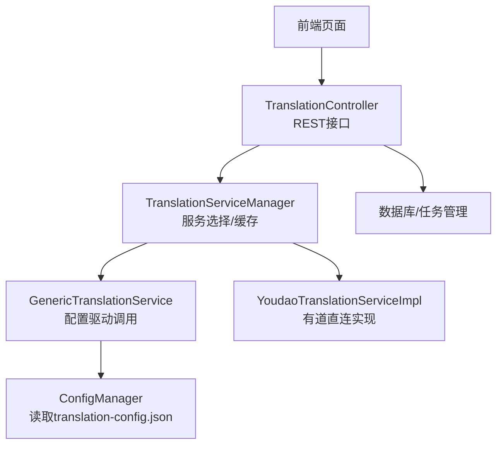
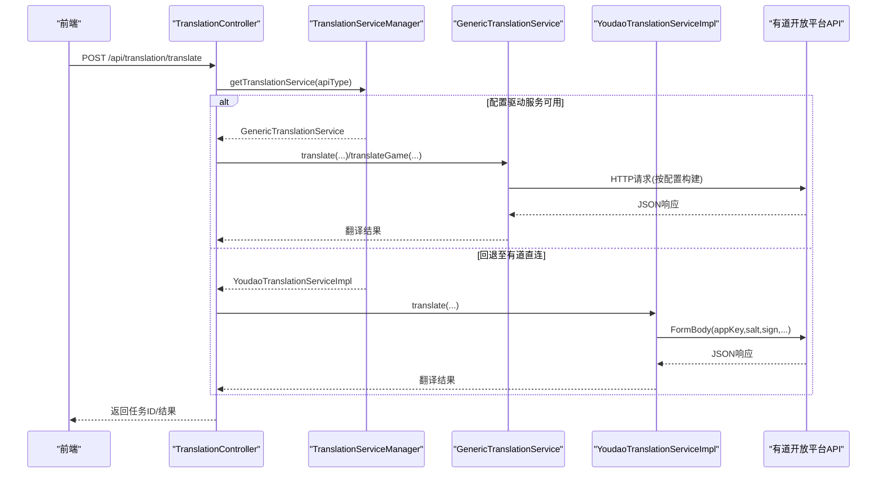
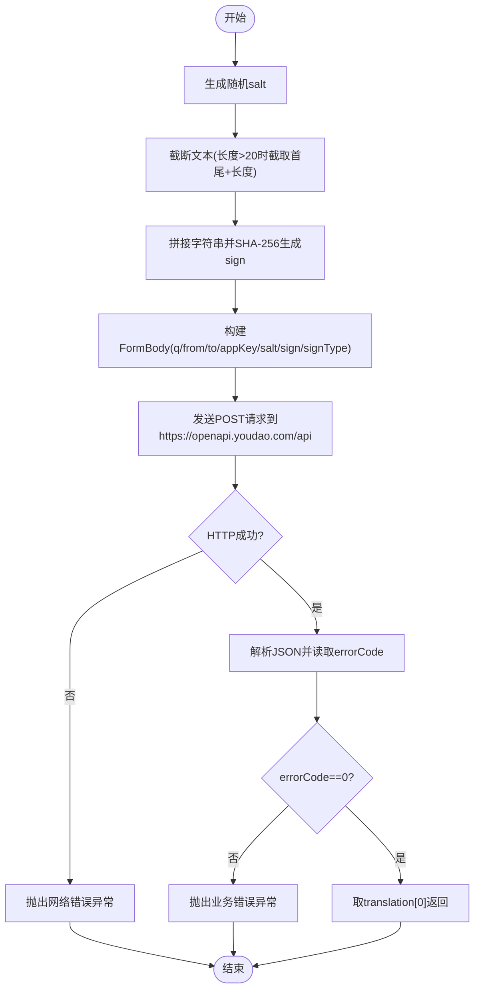
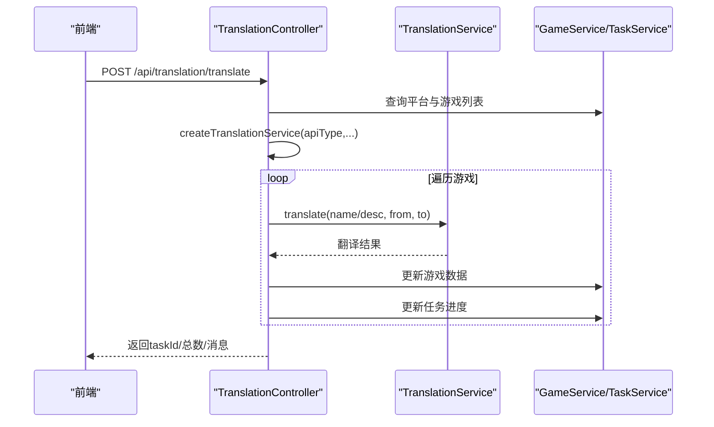
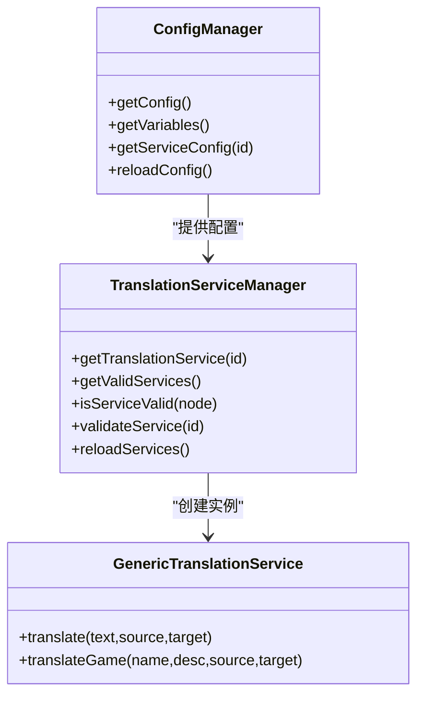
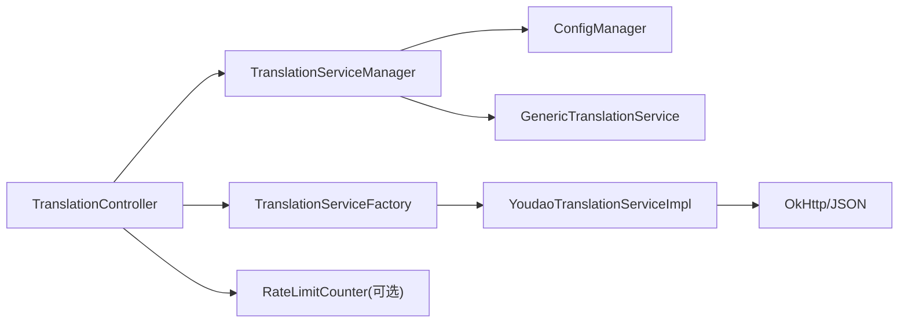

# 有道翻译服务配置

<cite>
**本文引用的文件**
- [YoudaoTranslationServiceImpl.java](file://src/main/java/com/gamelist/service/impl/YoudaoTranslationServiceImpl.java)
- [TranslationController.java](file://src/main/java/com/gamelist/controller/TranslationController.java)
- [TranslationService.java](file://src/main/java/com/gamelist/service/TranslationService.java)
- [TranslationServiceFactory.java](file://src/main/java/com/gamelist/service/impl/TranslationServiceFactory.java)
- [TranslationServiceManager.java](file://src/main/java/com/gamelist/service/impl/TranslationServiceManager.java)
- [GenericTranslationService.java](file://src/main/java/com/gamelist/service/impl/GenericTranslationService.java)
- [ConfigManager.java](file://src/main/java/com/gamelist/service/impl/ConfigManager.java)
- [translation-config.json](file://rules/translation-config.json)
- [RateLimitCounter.java](file://src/main/java/com/gamelist/util/RateLimitCounter.java)
- [application.properties](file://src/main/resources/application.properties)
</cite>

## 目录
1. [简介](#简介)
2. [项目结构](#项目结构)
3. [核心组件](#核心组件)
4. [架构总览](#架构总览)
5. [详细组件分析](#详细组件分析)
6. [依赖关系分析](#依赖关系分析)
7. [性能与调优](#性能与调优)
8. [故障排查指南](#故障排查指南)
9. [结论](#结论)
10. [附录](#附录)

## 简介
本文件面向需要在项目中集成并配置“有道翻译”能力的开发者，系统说明：
- 有道API的注册与认证要点（APP ID、APP KEY、SECURITY KEY）在本项目中的使用方式
- 请求格式、签名验证机制与响应解析流程
- 不同翻译场景的参数配置（语言检测、批量翻译等）
- 批量翻译最佳实践（频率控制、缓存策略、错误重试）
- 性能调优建议与常见问题解决方案

## 项目结构
本项目围绕“翻译能力抽象 + 多服务商实现 + 配置驱动”的方式组织代码。与有道翻译直接相关的核心位置如下：
- 控制器层：提供REST接口用于触发翻译任务与查询进度
- 服务层：定义统一的翻译接口，并提供具体实现（含有道）
- 配置管理：从JSON配置文件加载服务定义与变量（如API密钥）
- 工具类：限流计数器等通用能力

图表来源
- [TranslationController.java:84-235](file://src/main/java/com/gamelist/controller/TranslationController.java#L84-L235)
- [TranslationServiceManager.java:28-41](file://src/main/java/com/gamelist/service/impl/TranslationServiceManager.java#L28-L41)
- [GenericTranslationService.java:203-244](file://src/main/java/com/gamelist/service/impl/GenericTranslationService.java#L203-L244)
- [YoudaoTranslationServiceImpl.java:25-74](file://src/main/java/com/gamelist/service/impl/YoudaoTranslationServiceImpl.java#L25-L74)
- [ConfigManager.java:13-21](file://src/main/java/com/gamelist/service/impl/ConfigManager.java#L13-L21)

章节来源
- [TranslationController.java:84-235](file://src/main/java/com/gamelist/controller/TranslationController.java#L84-L235)
- [TranslationServiceManager.java:28-41](file://src/main/java/com/gamelist/service/impl/TranslationServiceManager.java#L28-L41)
- [GenericTranslationService.java:203-244](file://src/main/java/com/gamelist/service/impl/GenericTranslationService.java#L203-L244)
- [YoudaoTranslationServiceImpl.java:25-74](file://src/main/java/com/gamelist/service/impl/YoudaoTranslationServiceImpl.java#L25-L74)
- [ConfigManager.java:13-21](file://src/main/java/com/gamelist/service/impl/ConfigManager.java#L13-L21)

## 核心组件
- 统一翻译接口：定义 translate(text, sourceLang, targetLang) 与 translateGame(...) 的默认实现
- 有道实现：封装HTTP请求、签名生成、响应解析与异常处理
- 工厂与管理器：根据类型创建具体服务；管理器支持基于配置的动态服务发现与校验
- 配置管理：从 rules/translation-config.json 加载服务定义与变量替换
- 控制器：暴露翻译任务入口、进度查询、错误子集导出等能力
- 限流工具：提供滑动窗口限流能力，便于在批量场景中保护第三方API

章节来源
- [TranslationService.java:1-33](file://src/main/java/com/gamelist/service/TranslationService.java#L1-L33)
- [YoudaoTranslationServiceImpl.java:13-93](file://src/main/java/com/gamelist/service/impl/YoudaoTranslationServiceImpl.java#L13-L93)
- [TranslationServiceFactory.java:5-45](file://src/main/java/com/gamelist/service/impl/TranslationServiceFactory.java#L5-L45)
- [TranslationServiceManager.java:11-110](file://src/main/java/com/gamelist/service/impl/TranslationServiceManager.java#L11-L110)
- [ConfigManager.java:13-197](file://src/main/java/com/gamelist/service/impl/ConfigManager.java#L13-L197)
- [TranslationController.java:84-480](file://src/main/java/com/gamelist/controller/TranslationController.java#L84-L480)
- [RateLimitCounter.java:13-138](file://src/main/java/com/gamelist/util/RateLimitCounter.java#L13-L138)

## 架构总览
下图展示了从控制器到具体翻译服务的调用链，以及配置驱动的通用服务与有道直连实现的并存模式。

图表来源
- [TranslationController.java:84-235](file://src/main/java/com/gamelist/controller/TranslationController.java#L84-L235)
- [TranslationServiceManager.java:28-41](file://src/main/java/com/gamelist/service/impl/TranslationServiceManager.java#L28-L41)
- [GenericTranslationService.java:203-244](file://src/main/java/com/gamelist/service/impl/GenericTranslationService.java#L203-L244)
- [YoudaoTranslationServiceImpl.java:25-74](file://src/main/java/com/gamelist/service/impl/YoudaoTranslationServiceImpl.java#L25-L74)

## 详细组件分析

### 有道翻译实现（YoudaoTranslationServiceImpl）
- 认证参数
  - appKey：对应“APP KEY”，用于标识应用
  - appSecret：对应“SECURITY KEY”，用于签名计算
  - 注：当前实现未使用“APP ID”字段
- 请求构造
  - 使用表单形式提交 q、from、to、appKey、salt、sign、signType
  - sign 由 appKey、截断后的文本、随机 salt、当前时间戳、appSecret 拼接后做SHA-256得到
- 响应解析
  - 检查 errorCode，非0则抛出异常
  - 取 translation[0] 作为翻译结果
- 异常处理
  - 网络异常与业务异常统一包装为 TranslationException

图表来源
- [YoudaoTranslationServiceImpl.java:25-93](file://src/main/java/com/gamelist/service/impl/YoudaoTranslationServiceImpl.java#L25-L93)

章节来源
- [YoudaoTranslationServiceImpl.java:13-93](file://src/main/java/com/gamelist/service/impl/YoudaoTranslationServiceImpl.java#L13-L93)

### 控制器与任务编排（TranslationController）
- 批量翻译入口
  - POST /api/translation/translate：按平台批量翻译游戏名称/描述
  - POST /api/translation/games：按游戏ID列表批量翻译
  - POST /api/translation/translate/game：单个游戏翻译
- 任务管理
  - 异步执行翻译，维护进度与错误记录
  - 通过 TaskService 更新后台任务进度与完成状态
- 服务选择
  - 优先尝试通过 TranslationServiceManager 获取配置驱动服务
  - 若不可用，回退到旧工厂模式（包含 youdao 分支）

图表来源
- [TranslationController.java:84-235](file://src/main/java/com/gamelist/controller/TranslationController.java#L84-L235)
- [TranslationController.java:307-480](file://src/main/java/com/gamelist/controller/TranslationController.java#L307-L480)

章节来源
- [TranslationController.java:84-480](file://src/main/java/com/gamelist/controller/TranslationController.java#L84-L480)

### 配置驱动服务（GenericTranslationService + ConfigManager）
- 通过 rules/translation-config.json 声明各翻译服务的URL、方法、请求体、参数、响应路径与变量替换规则
- ConfigManager 负责加载配置与变量，TranslationServiceManager 缓存服务实例并按id获取
- 当存在匹配的服务配置时，优先使用 GenericTranslationService 发起请求；否则回退到直连实现（如Youdao）

图表来源
- [ConfigManager.java:13-197](file://src/main/java/com/gamelist/service/impl/ConfigManager.java#L13-L197)
- [TranslationServiceManager.java:11-110](file://src/main/java/com/gamelist/service/impl/TranslationServiceManager.java#L11-L110)
- [GenericTranslationService.java:203-244](file://src/main/java/com/gamelist/service/impl/GenericTranslationService.java#L203-L244)

章节来源
- [ConfigManager.java:13-197](file://src/main/java/com/gamelist/service/impl/ConfigManager.java#L13-L197)
- [TranslationServiceManager.java:11-110](file://src/main/java/com/gamelist/service/impl/TranslationServiceManager.java#L11-L110)
- [GenericTranslationService.java:203-244](file://src/main/java/com/gamelist/service/impl/GenericTranslationService.java#L203-L244)

### 工厂模式（TranslationServiceFactory）
- 根据 serviceType 创建具体翻译服务实例
- 对 youdao 类型要求传入 appKey 与 appSecret
- 所有返回的服务均被包装以添加通用错误处理

章节来源
- [TranslationServiceFactory.java:5-45](file://src/main/java/com/gamelist/service/impl/TranslationServiceFactory.java#L5-L45)

## 依赖关系分析
- 控制器依赖服务管理器与工厂进行服务选择
- 服务管理器依赖配置管理器加载服务定义
- 有道实现依赖 OkHttp 与 JSON 库进行网络请求与解析
- 限流工具可被上层批量逻辑复用，避免触发第三方API限流

图表来源
- [TranslationController.java:84-235](file://src/main/java/com/gamelist/controller/TranslationController.java#L84-L235)
- [TranslationServiceManager.java:28-41](file://src/main/java/com/gamelist/service/impl/TranslationServiceManager.java#L28-L41)
- [TranslationServiceFactory.java:24-29](file://src/main/java/com/gamelist/service/impl/TranslationServiceFactory.java#L24-L29)
- [YoudaoTranslationServiceImpl.java:13-18](file://src/main/java/com/gamelist/service/impl/YoudaoTranslationServiceImpl.java#L13-L18)

章节来源
- [TranslationController.java:84-235](file://src/main/java/com/gamelist/controller/TranslationController.java#L84-L235)
- [TranslationServiceManager.java:28-41](file://src/main/java/com/gamelist/service/impl/TranslationServiceManager.java#L28-L41)
- [TranslationServiceFactory.java:24-29](file://src/main/java/com/gamelist/service/impl/TranslationServiceFactory.java#L24-L29)
- [YoudaoTranslationServiceImpl.java:13-18](file://src/main/java/com/gamelist/service/impl/YoudaoTranslationServiceImpl.java#L13-L18)

## 性能与调优
- 连接与超时
  - 通用服务已设置连接/读写超时，建议在并发较高时适当调整
- 并发与限流
  - 可使用 RateLimitCounter 实现滑动窗口限流，避免短时间内大量请求触发第三方限制
- 批量策略
  - 分批提交：将大批量任务拆分为多个小批次，降低单次压力
  - 失败重试：对瞬时错误（网络抖动、临时限流）采用指数退避重试
  - 去重缓存：对相同输入与目标语言的翻译结果进行本地缓存，减少重复请求
- 资源隔离
  - 使用独立线程池或后台任务执行翻译，避免阻塞主线程
- 日志与监控
  - 开启关键步骤日志，统计成功率、平均耗时与错误分布，指导进一步优化

[本节为通用建议，不直接分析具体文件]

## 故障排查指南
- 常见错误
  - 网络错误：检查网络连通性与代理设置
  - 业务错误：检查 errorCode 是否为0，确认 appKey/appSecret 是否正确
  - 参数缺失：确保 from/to 语言代码合法，q 不为空
- 定位方法
  - 查看控制器返回的任务ID，通过进度接口获取错误明细
  - 在服务实现中捕获并打印请求与响应信息，辅助定位问题
- 恢复策略
  - 对限流错误进行等待与重试
  - 对无效输入进行前置校验，避免无意义请求

章节来源
- [YoudaoTranslationServiceImpl.java:55-74](file://src/main/java/com/gamelist/service/impl/YoudaoTranslationServiceImpl.java#L55-L74)
- [TranslationController.java:505-529](file://src/main/java/com/gamelist/controller/TranslationController.java#L505-L529)

## 结论
本项目提供了灵活的翻译能力接入方案：既支持通过配置驱动的通用服务快速对接多种翻译API，也保留了有道直连实现以满足特定需求。结合任务编排、进度跟踪与错误记录，能够支撑稳定的批量翻译场景。建议在生产环境中配合限流、缓存与重试策略，以获得更好的性能与稳定性。

[本节为总结性内容，不直接分析具体文件]

## 附录

### A. 有道API注册与认证要点
- 在“有道智云”控制台创建应用，获取 APP KEY 与 SECURITY KEY
- 本项目中：
  - APP KEY 对应 appKey
  - SECURITY KEY 对应 appSecret
  - 当前实现未使用 APP ID
- 安全建议
  - 不要在前端明文传递 appSecret
  - 服务端集中保管密钥，仅暴露必要接口

章节来源
- [YoudaoTranslationServiceImpl.java:13-23](file://src/main/java/com/gamelist/service/impl/YoudaoTranslationServiceImpl.java#L13-L23)
- [TranslationServiceFactory.java:24-29](file://src/main/java/com/gamelist/service/impl/TranslationServiceFactory.java#L24-L29)

### B. 请求格式与签名验证
- 请求地址：https://openapi.youdao.com/api
- 请求体（表单）：q、from、to、appKey、salt、sign、signType
- 签名算法：
  - 拼接字符串：appKey + 截断文本 + salt + 当前毫秒时间戳 + appSecret
  - 对拼接串进行 SHA-256 哈希，得到十六进制小写字符串作为 sign
- 文本截断：超过20字符时，保留前10个字符、原始长度、后10个字符

章节来源
- [YoudaoTranslationServiceImpl.java:25-93](file://src/main/java/com/gamelist/service/impl/YoudaoTranslationServiceImpl.java#L25-L93)

### C. 响应数据解析
- 成功条件：errorCode == "0"
- 翻译结果：取 translation[0] 作为最终译文
- 错误处理：非0错误码抛出业务异常，便于上层统一处理

章节来源
- [YoudaoTranslationServiceImpl.java:55-74](file://src/main/java/com/gamelist/service/impl/YoudaoTranslationServiceImpl.java#L55-L74)

### D. 翻译场景与参数配置
- 语言检测
  - 前端支持“自动检测”选项，实际 from 值需与服务端约定（例如 auto）
  - 有道API是否支持 auto 取决于其官方文档，本项目实现中会原样传递 from 参数
- 专业领域翻译
  - 当前实现未内置“专业领域”参数；如需支持，可在请求体中扩展相应字段并在服务端透传
- 批量翻译
  - 控制器提供按平台与按游戏ID的批量接口，内部异步执行并上报进度

章节来源
- [TranslationController.java:84-235](file://src/main/java/com/gamelist/controller/TranslationController.java#L84-L235)
- [TranslationController.java:307-480](file://src/main/java/com/gamelist/controller/TranslationController.java#L307-L480)

### E. 批量翻译最佳实践
- 请求频率控制
  - 使用 RateLimitCounter 实现滑动窗口限流，避免触发第三方限制
- 缓存策略
  - 对相同输入与目标语言的翻译结果进行本地缓存，减少重复请求
- 错误重试
  - 对瞬时错误采用指数退避重试，对确定性错误快速失败
- 任务拆分
  - 将大批量任务拆分为多个小批次，提升整体吞吐与容错性

章节来源
- [RateLimitCounter.java:13-138](file://src/main/java/com/gamelist/util/RateLimitCounter.java#L13-L138)

### F. 性能调优建议
- 合理设置连接与读写超时
- 使用连接池复用HTTP连接
- 控制并发度，避免打满上游API配额
- 启用必要的日志与指标采集，持续优化

[本节为通用建议，不直接分析具体文件]

### G. 常见问题与解决
- 签名错误
  - 检查 appKey/appSecret 是否正确
  - 确认时间戳与 salt 每次请求唯一
  - 确认文本截断逻辑一致
- 网络错误
  - 检查网络连通性与代理设置
  - 增加重试与退避策略
- 业务错误
  - 根据 errorCode 定位原因（如配额不足、参数非法）

章节来源
- [YoudaoTranslationServiceImpl.java:55-74](file://src/main/java/com/gamelist/service/impl/YoudaoTranslationServiceImpl.java#L55-L74)