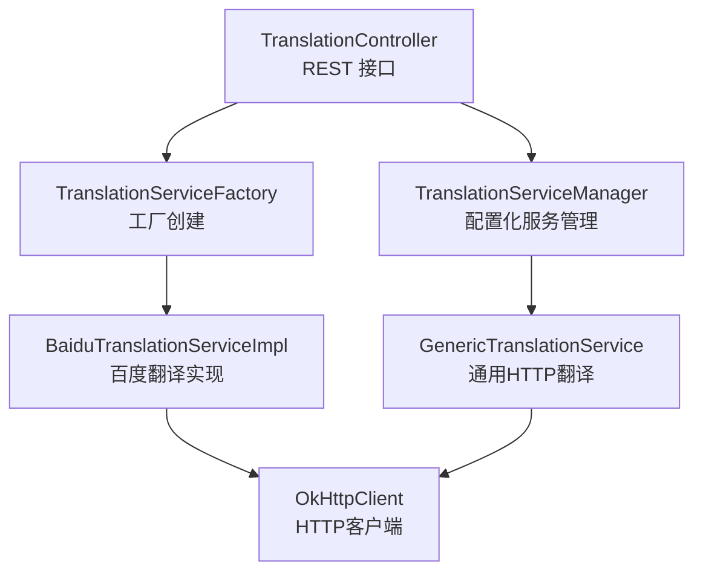
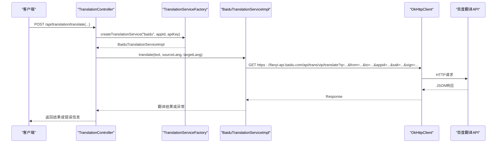
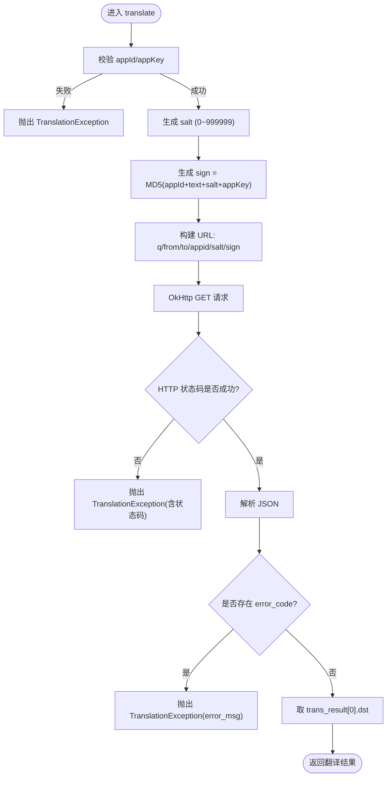
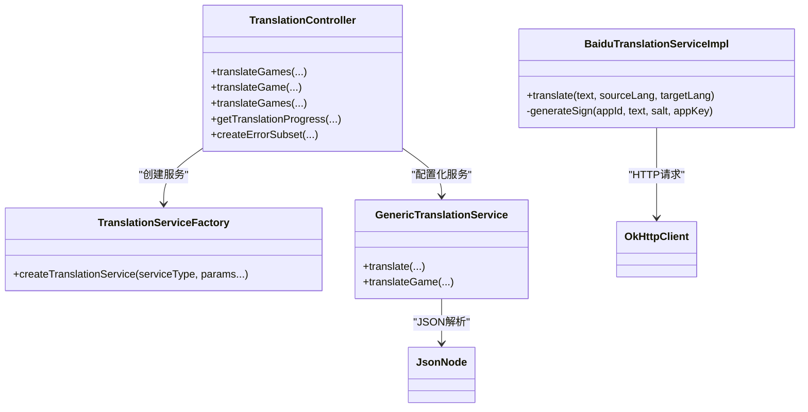

# 百度翻译服务配置

<cite>
**本文引用的文件**
- [BaiduTranslationServiceImpl.java](file://src/main/java/com/gamelist/service/impl/BaiduTranslationServiceImpl.java)
- [TranslationService.java](file://src/main/java/com/gamelist/service/TranslationService.java)
- [TranslationController.java](file://src/main/java/com/gamelist/controller/TranslationController.java)
- [TranslationServiceFactory.java](file://src/main/java/com/gamelist/service/impl/TranslationServiceFactory.java)
- [GenericTranslationService.java](file://src/main/java/com/gamelist/service/impl/GenericTranslationService.java)
- [ConfigManager.java](file://src/main/java/com/gamelist/service/impl/ConfigManager.java)
- [translation-config.json](file://rules/translation-config.json)
- [application.properties](file://src/main/resources/application.properties)
</cite>

## 目录
1. [简介](#简介)
2. [项目结构](#项目结构)
3. [核心组件](#核心组件)
4. [架构总览](#架构总览)
5. [详细组件分析](#详细组件分析)
6. [依赖关系分析](#依赖关系分析)
7. [性能与并发优化建议](#性能与并发优化建议)
8. [故障排除指南](#故障排除指南)
9. [结论](#结论)
10. [附录：配置示例与最佳实践](#附录：配置示例与最佳实践)

## 简介
本文件面向需要在系统中集成并使用百度翻译服务的开发者与运维人员，详细说明以下内容：
- 百度翻译API的注册流程、AppID与AppKey获取方法（基于官方渠道）
- 请求签名生成机制（salt随机数、MD5签名算法）
- 请求参数格式、响应数据结构解析与错误处理
- 完整配置示例（网络超时、重试策略、并发限制等）
- 常见错误码说明与故障排除

## 项目结构
本项目采用分层架构，翻译能力通过接口抽象与具体实现解耦。百度翻译的具体实现位于服务层，控制器负责接收请求并调度翻译任务，通用翻译服务用于统一配置化调用。

图表来源
- [TranslationController.java:30-643](file://src/main/java/com/gamelist/controller/TranslationController.java#L30-L643)
- [TranslationServiceFactory.java:6-44](file://src/main/java/com/gamelist/service/impl/TranslationServiceFactory.java#L6-L44)
- [BaiduTranslationServiceImpl.java:14-99](file://src/main/java/com/gamelist/service/impl/BaiduTranslationServiceImpl.java#L14-L99)
- [GenericTranslationService.java:21-201](file://src/main/java/com/gamelist/service/impl/GenericTranslationService.java#L21-L201)

章节来源
- [TranslationController.java:30-643](file://src/main/java/com/gamelist/controller/TranslationController.java#L30-L643)
- [TranslationServiceFactory.java:6-44](file://src/main/java/com/gamelist/service/impl/TranslationServiceFactory.java#L6-L44)
- [BaiduTranslationServiceImpl.java:14-99](file://src/main/java/com/gamelist/service/impl/BaiduTranslationServiceImpl.java#L14-L99)
- [GenericTranslationService.java:21-201](file://src/main/java/com/gamelist/service/impl/GenericTranslationService.java#L21-L201)

## 核心组件
- 百度翻译服务实现：封装百度翻译API的请求构建、签名生成、网络请求与响应解析。
- 翻译接口：定义统一的翻译方法与批量翻译结果模型。
- 控制器：提供REST接口，支持单条/批量翻译、进度查询与错误子集分离。
- 工厂与管理器：根据类型创建具体翻译服务或从配置加载通用服务。

章节来源
- [BaiduTranslationServiceImpl.java:14-99](file://src/main/java/com/gamelist/service/impl/BaiduTranslationServiceImpl.java#L14-L99)
- [TranslationService.java:3-32](file://src/main/java/com/gamelist/service/TranslationService.java#L3-L32)
- [TranslationController.java:30-643](file://src/main/java/com/gamelist/controller/TranslationController.java#L30-L643)
- [TranslationServiceFactory.java:6-44](file://src/main/java/com/gamelist/service/impl/TranslationServiceFactory.java#L6-L44)
- [ConfigManager.java:13-197](file://src/main/java/com/gamelist/service/impl/ConfigManager.java#L13-L197)

## 架构总览
系统对外暴露翻译相关REST接口，内部通过工厂或管理器选择具体翻译实现。百度翻译实现直接构造URL参数并发起GET请求，使用MD5进行签名校验。

图表来源
- [TranslationController.java:84-235](file://src/main/java/com/gamelist/controller/TranslationController.java#L84-L235)
- [TranslationServiceFactory.java:17-22](file://src/main/java/com/gamelist/service/impl/TranslationServiceFactory.java#L17-L22)
- [BaiduTranslationServiceImpl.java:27-86](file://src/main/java/com/gamelist/service/impl/BaiduTranslationServiceImpl.java#L27-L86)

## 详细组件分析

### 百度翻译服务实现（BaiduTranslationServiceImpl）
- 职责：完成百度翻译API的参数组装、签名计算、HTTP请求发送与JSON响应解析。
- 关键流程：
  - 参数校验：appId与appKey非空检查。
  - 随机数生成：salt为0到999999之间的整数。
  - 签名算法：将appId + text + salt + appKey拼接后执行MD5，得到十六进制小写签名串。
  - URL构建：包含q、from、to、appid、salt、sign等查询参数。
  - 网络请求：使用OkHttp发起GET请求。
  - 响应解析：若存在error_code则抛出异常；否则从trans_result数组取第一条记录的dst字段作为翻译结果。
- 错误处理：
  - 网络异常：包装为TranslationException并附带原始异常。
  - 业务异常：当响应体包含error_code时，提取error_msg并抛出异常。

图表来源
- [BaiduTranslationServiceImpl.java:27-99](file://src/main/java/com/gamelist/service/impl/BaiduTranslationServiceImpl.java#L27-L99)

章节来源
- [BaiduTranslationServiceImpl.java:27-99](file://src/main/java/com/gamelist/service/impl/BaiduTranslationServiceImpl.java#L27-L99)

### 翻译接口与结果模型（TranslationService）
- 定义统一方法：translate(text, sourceLang, targetLang)。
- 提供默认批量方法：translateGame(gameName, gameDescription, sourceLang, targetLang)，返回TranslationResult对象，包含游戏名称与描述的翻译结果。

章节来源
- [TranslationService.java:3-32](file://src/main/java/com/gamelist/service/TranslationService.java#L3-L32)

### 控制器与任务编排（TranslationController）
- 提供REST接口：
  - 平台级批量翻译：POST /api/translation/translate
  - 单个游戏翻译：POST /api/translation/translate/game
  - 批量游戏翻译：POST /api/translation/translate/games
  - 进度查询：GET /api/translation/progress/{taskId}
  - 错误子集分离：POST /api/translation/create-error-subset/{taskId}
- 服务选择逻辑：优先尝试从配置管理器加载通用服务；未命中则回退到工厂创建具体服务（包括百度）。
- 异步执行：后台线程逐条翻译，更新进度与错误记录，完成后标记任务完成。

章节来源
- [TranslationController.java:84-643](file://src/main/java/com/gamelist/controller/TranslationController.java#L84-L643)

### 工厂与管理器（TranslationServiceFactory / ConfigManager / GenericTranslationService）
- 工厂：按类型创建具体翻译服务，百度需要传入appId与apiKey。
- 管理器：从配置文件读取服务定义，缓存实例，支持验证与服务重载。
- 通用服务：支持通过JSON配置动态构建请求（URL、Headers、Params、Body）、变量替换、响应路径提取与解析器。

章节来源
- [TranslationServiceFactory.java:6-44](file://src/main/java/com/gamelist/service/impl/TranslationServiceFactory.java#L6-L44)
- [ConfigManager.java:13-197](file://src/main/java/com/gamelist/service/impl/ConfigManager.java#L13-L197)
- [GenericTranslationService.java:21-201](file://src/main/java/com/gamelist/service/impl/GenericTranslationService.java#L21-L201)

## 依赖关系分析
- 百度翻译实现依赖OkHttp进行HTTP通信，依赖JSON库解析响应。
- 控制器依赖工厂与管理器以选择合适服务。
- 通用服务依赖Jackson进行JSON解析与变量替换。

图表来源
- [TranslationController.java:30-643](file://src/main/java/com/gamelist/controller/TranslationController.java#L30-L643)
- [TranslationServiceFactory.java:6-44](file://src/main/java/com/gamelist/service/impl/TranslationServiceFactory.java#L6-L44)
- [BaiduTranslationServiceImpl.java:14-99](file://src/main/java/com/gamelist/service/impl/BaiduTranslationServiceImpl.java#L14-L99)
- [GenericTranslationService.java:21-201](file://src/main/java/com/gamelist/service/impl/GenericTranslationService.java#L21-L201)

章节来源
- [TranslationController.java:30-643](file://src/main/java/com/gamelist/controller/TranslationController.java#L30-L643)
- [TranslationServiceFactory.java:6-44](file://src/main/java/com/gamelist/service/impl/TranslationServiceFactory.java#L6-L44)
- [BaiduTranslationServiceImpl.java:14-99](file://src/main/java/com/gamelist/service/impl/BaiduTranslationServiceImpl.java#L14-L99)
- [GenericTranslationService.java:21-201](file://src/main/java/com/gamelist/service/impl/GenericTranslationService.java#L21-L201)

## 性能与并发优化建议
当前百度翻译实现在构造OkHttpClient时未显式设置连接池、超时与重试策略。建议在多场景下对网络层进行增强：
- 连接池与复用：共享OkHttpClient实例，避免频繁创建销毁带来的开销。
- 超时设置：合理配置connectTimeout、readTimeout、writeTimeout，防止阻塞。
- 重试策略：针对瞬时网络抖动增加有限次数的指数退避重试。
- 并发限制：结合线程池与令牌桶/信号量控制并发度，避免压垮第三方API。
- 日志与监控：记录请求耗时、错误率与QPS，便于容量规划与问题定位。

注意：上述为通用优化建议，需结合实际部署环境调整。

## 故障排除指南
- 参数缺失：
  - 现象：抛出“appId为空”或“appKey为空”的异常。
  - 排查：确认初始化时已正确传入appId与appKey。
- 网络异常：
  - 现象：抛出“Network error”并携带底层IO异常。
  - 排查：检查网络连通性、代理设置、防火墙规则；必要时增加重试与超时。
- 业务错误：
  - 现象：响应体包含error_code，抛出“Baidu API error”并携带error_msg。
  - 排查：核对AppID/AppKey权限、配额、目标语言代码、文本长度限制等。
- HTTP状态码非成功：
  - 现象：抛出“Baidu API request failed”并携带状态码。
  - 排查：检查URL、签名是否正确；查看服务端返回的错误详情。

章节来源
- [BaiduTranslationServiceImpl.java:27-86](file://src/main/java/com/gamelist/service/impl/BaiduTranslationServiceImpl.java#L27-L86)

## 结论
本项目提供了完整的百度翻译集成方案，涵盖签名生成、请求构建、响应解析与错误处理。通过控制器与工厂/管理器组合，实现了灵活的服务选择与任务编排。建议在生产环境中完善网络层配置（超时、重试、并发控制），并结合日志与监控提升可观测性与稳定性。

## 附录：配置示例与最佳实践

### 百度翻译API注册与密钥获取
- 在百度翻译开放平台注册账号并创建应用，获取AppID与AppKey。
- 确保应用已开通相应翻译权限与配额。

### 请求参数与签名
- 请求URL：https://fanyi-api.baidu.com/api/trans/vip/translate
- 查询参数：
  - q：待翻译文本
  - from：源语言代码
  - to：目标语言代码
  - appid：应用ID
  - salt：随机数（0~999999）
  - sign：签名，由MD5(appId + text + salt + appKey)生成
- 响应数据：
  - 成功：trans_result数组，取第一条记录的dst字段即为翻译结果
  - 失败：包含error_code与error_msg

章节来源
- [BaiduTranslationServiceImpl.java:27-99](file://src/main/java/com/gamelist/service/impl/BaiduTranslationServiceImpl.java#L27-L99)

### 控制器调用示例（参数说明）
- 平台批量翻译：POST /api/translation/translate
  - 参数：platformId、apiType=baidu、sourceLang、targetLang、translateType、apiKey（即appKey）、appId
- 单个游戏翻译：POST /api/translation/translate/game
  - 参数：gameId、apiType=baidu、sourceLang、targetLang、translateType、apiKey、appId
- 批量游戏翻译：POST /api/translation/translate/games
  - 参数：gameIds、apiType=baidu、sourceLang、targetLang、translateType、apiKey、appId
- 进度查询：GET /api/translation/progress/{taskId}
- 错误子集分离：POST /api/translation/create-error-subset/{taskId}

章节来源
- [TranslationController.java:84-643](file://src/main/java/com/gamelist/controller/TranslationController.java#L84-L643)

### 通用配置化服务（可选）
- 可通过rules/translation-config.json配置通用翻译服务，支持变量替换、请求头、参数、请求体与响应路径提取。
- 当前配置文件中未包含百度翻译条目，如需接入可参考现有Google/Microsoft/DeepSeek配置结构新增百度条目。

章节来源
- [translation-config.json:1-149](file://rules/translation-config.json#L1-L149)
- [ConfigManager.java:13-197](file://src/main/java/com/gamelist/service/impl/ConfigManager.java#L13-L197)
- [GenericTranslationService.java:21-201](file://src/main/java/com/gamelist/service/impl/GenericTranslationService.java#L21-L201)

### 网络与性能配置建议
- 应用基础配置：
  - 端口与编码：server.port、UTF-8编码已在application.properties中设置
  - 数据库连接池：HikariCP最大连接数、空闲超时、连接超时等
- 翻译网络层建议（需在OkHttpClient层面扩展）：
  - connectTimeout：例如30秒
  - readTimeout：例如60秒
  - writeTimeout：例如30秒
  - 重试：对瞬时错误进行有限次数重试（如3次，指数退避）
  - 并发：结合线程池与限流器控制并发度，避免触发第三方API限流

章节来源
- [application.properties:1-86](file://src/main/resources/application.properties#L1-L86)
- [GenericTranslationService.java:196-201](file://src/main/java/com/gamelist/service/impl/GenericTranslationService.java#L196-L201)

### 常见错误码与处理
- 网络异常：IOException -> TranslationException("Network error")
- HTTP非成功：response.isSuccessful()为false -> TranslationException("Baidu API request failed: 状态码")
- 业务错误：响应体包含error_code -> TranslationException("Baidu API error: error_msg")

章节来源
- [BaiduTranslationServiceImpl.java:67-86](file://src/main/java/com/gamelist/service/impl/BaiduTranslationServiceImpl.java#L67-L86)