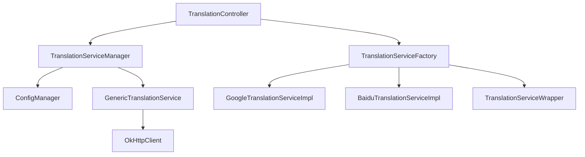
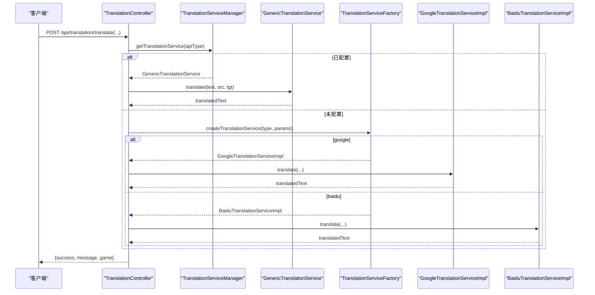
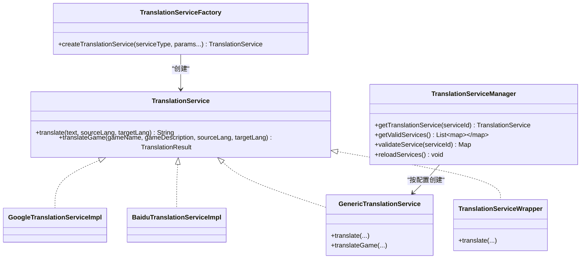
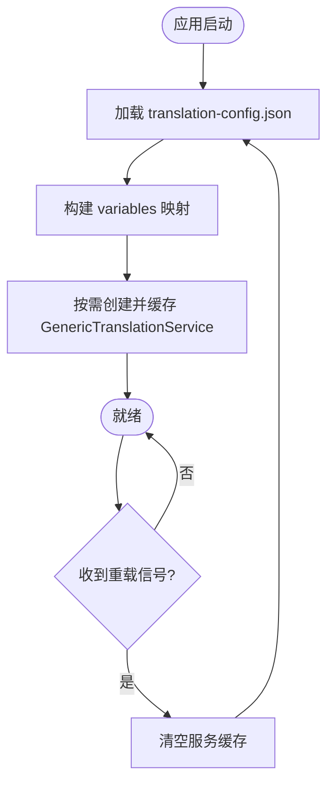
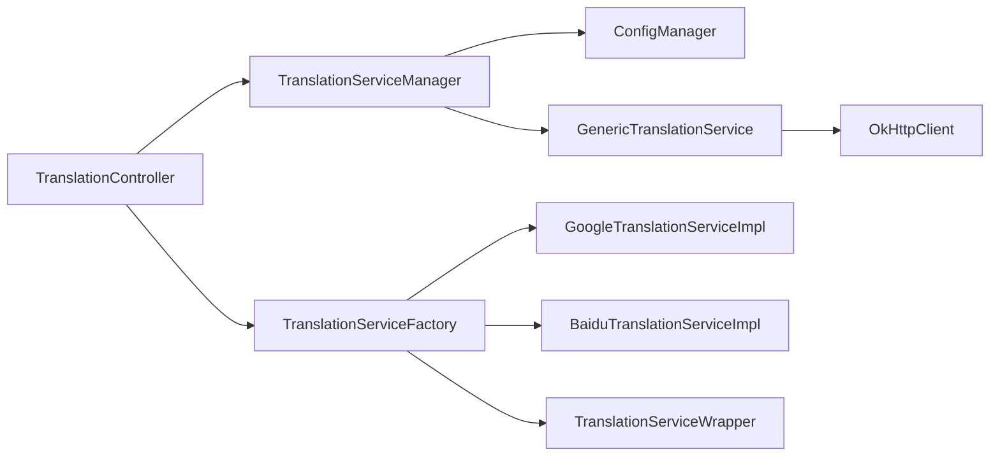

# 翻译服务工厂配置

<cite>
**本文引用的文件**
- [TranslationServiceFactory.java](file://src/main/java/com/gamelist/service/impl/TranslationServiceFactory.java)
- [TranslationServiceManager.java](file://src/main/java/com/gamelist/service/impl/TranslationServiceManager.java)
- [GenericTranslationService.java](file://src/main/java/com/gamelist/service/impl/GenericTranslationService.java)
- [TranslationServiceWrapper.java](file://src/main/java/com/gamelist/service/impl/TranslationServiceWrapper.java)
- [ConfigManager.java](file://src/main/java/com/gamelist/service/impl/ConfigManager.java)
- [TranslationService.java](file://src/main/java/com/gamelist/service/TranslationService.java)
- [GoogleTranslationServiceImpl.java](file://src/main/java/com/gamelist/service/impl/GoogleTranslationServiceImpl.java)
- [BaiduTranslationServiceImpl.java](file://src/main/java/com/gamelist/service/impl/BaiduTranslationServiceImpl.java)
- [TranslationController.java](file://src/main/java/com/gamelist/controller/TranslationController.java)
- [translation-config.json](file://rules/translation-config.json)
</cite>

## 目录
1. [简介](#简介)
2. [项目结构](#项目结构)
3. [核心组件](#核心组件)
4. [架构总览](#架构总览)
5. [详细组件分析](#详细组件分析)
6. [依赖关系分析](#依赖关系分析)
7. [性能与可用性](#性能与可用性)
8. [故障排查指南](#故障排查指南)
9. [结论](#结论)
10. [附录：扩展新翻译服务开发指南](#附录：扩展新翻译服务开发指南)

## 简介
本文件面向“翻译服务工厂模式”的配置与管理，聚焦以下目标：
- 解释 TranslationServiceFactory 的实现原理与服务动态切换机制
- 说明如何配置多个翻译服务提供商（优先级、负载均衡、故障转移）
- 介绍 TranslationServiceManager 的服务注册、发现与管理能力
- 提供统一接口抽象与扩展新服务的开发指南
- 给出服务监控、健康检查与性能统计的配置建议

## 项目结构
本项目采用分层与模块化组织：
- 接口层：定义统一的翻译服务接口与异常类型
- 实现层：包含具体翻译服务商实现、通用HTTP适配实现、包装器与工厂
- 管理层：负责从配置加载服务、缓存实例、校验变量
- 控制层：对外暴露REST API，编排翻译任务、进度与错误处理
- 配置层：以JSON描述各翻译服务的请求/响应格式、鉴权参数与校验规则

图示来源
- [TranslationController.java:30-79](file://src/main/java/com/gamelist/controller/TranslationController.java#L30-L79)
- [TranslationServiceManager.java:11-41](file://src/main/java/com/gamelist/service/impl/TranslationServiceManager.java#L11-L41)
- [TranslationServiceFactory.java:5-44](file://src/main/java/com/gamelist/service/impl/TranslationServiceFactory.java#L5-L44)
- [GenericTranslationService.java:21-201](file://src/main/java/com/gamelist/service/impl/GenericTranslationService.java#L21-L201)
- [ConfigManager.java:13-49](file://src/main/java/com/gamelist/service/impl/ConfigManager.java#L13-L49)

章节来源
- [TranslationController.java:30-79](file://src/main/java/com/gamelist/controller/TranslationController.java#L30-L79)
- [translation-config.json:1-149](file://rules/translation-config.json#L1-L149)

## 核心组件
- TranslationService：统一接口，定义 translate 与 translateGame 方法，以及结果封装 TranslationResult
- TranslationServiceFactory：根据 serviceType 创建具体翻译服务实例，并返回带通用错误处理的包装实例
- TranslationServiceManager：单例管理器，基于 JSON 配置动态加载、缓存、校验翻译服务
- GenericTranslationService：通用HTTP适配器，按配置构建请求、发送、解析响应，支持变量替换与路径提取
- TranslationServiceWrapper：对底层服务进行错误兜底与结果清洗，失败时回退为原文
- ConfigManager：读取 rules/translation-config.json，维护 variables 与 services 列表，提供默认服务查询
- 具体实现：GoogleTranslationServiceImpl、BaiduTranslationServiceImpl 等

章节来源
- [TranslationService.java:1-33](file://src/main/java/com/gamelist/service/TranslationService.java#L1-L33)
- [TranslationServiceFactory.java:5-44](file://src/main/java/com/gamelist/service/impl/TranslationServiceFactory.java#L5-L44)
- [TranslationServiceManager.java:11-110](file://src/main/java/com/gamelist/service/impl/TranslationServiceManager.java#L11-L110)
- [GenericTranslationService.java:21-443](file://src/main/java/com/gamelist/service/impl/GenericTranslationService.java#L21-L443)
- [TranslationServiceWrapper.java:1-71](file://src/main/java/com/gamelist/service/impl/TranslationServiceWrapper.java#L1-L71)
- [ConfigManager.java:13-197](file://src/main/java/com/gamelist/service/impl/ConfigManager.java#L13-L197)
- [GoogleTranslationServiceImpl.java:1-59](file://src/main/java/com/gamelist/service/impl/GoogleTranslationServiceImpl.java#L1-L59)
- [BaiduTranslationServiceImpl.java:1-100](file://src/main/java/com/gamelist/service/impl/BaiduTranslationServiceImpl.java#L1-L100)

## 架构总览
系统通过控制器接收翻译请求，优先使用基于配置的通用翻译服务；若未配置则回退到工厂模式创建的具体实现。所有服务均通过统一接口调用，便于横向扩展与替换。

图示来源
- [TranslationController.java:84-235](file://src/main/java/com/gamelist/controller/TranslationController.java#L84-L235)
- [TranslationServiceManager.java:28-41](file://src/main/java/com/gamelist/service/impl/TranslationServiceManager.java#L28-L41)
- [TranslationServiceFactory.java:5-44](file://src/main/java/com/gamelist/service/impl/TranslationServiceFactory.java#L5-L44)
- [GenericTranslationService.java:203-244](file://src/main/java/com/gamelist/service/impl/GenericTranslationService.java#L203-L244)
- [GoogleTranslationServiceImpl.java:19-57](file://src/main/java/com/gamelist/service/impl/GoogleTranslationServiceImpl.java#L19-L57)
- [BaiduTranslationServiceImpl.java:26-87](file://src/main/java/com/gamelist/service/impl/BaiduTranslationServiceImpl.java#L26-L87)

## 详细组件分析

### 工厂模式与动态切换
- 工厂职责：依据 serviceType 选择具体实现，校验必要参数，返回包装后的服务实例
- 动态切换：控制器先尝试从管理器获取基于配置的通用服务；若不存在则回退到工厂创建具体实现
- 包装器：对底层服务调用进行异常捕获与结果清洗，失败时返回原文，避免污染数据

图示来源
- [TranslationService.java:1-33](file://src/main/java/com/gamelist/service/TranslationService.java#L1-L33)
- [TranslationServiceFactory.java:5-44](file://src/main/java/com/gamelist/service/impl/TranslationServiceFactory.java#L5-L44)
- [TranslationServiceManager.java:11-110](file://src/main/java/com/gamelist/service/impl/TranslationServiceManager.java#L11-L110)
- [GenericTranslationService.java:21-443](file://src/main/java/com/gamelist/service/impl/GenericTranslationService.java#L21-L443)
- [TranslationServiceWrapper.java:1-71](file://src/main/java/com/gamelist/service/impl/TranslationServiceWrapper.java#L1-L71)
- [GoogleTranslationServiceImpl.java:1-59](file://src/main/java/com/gamelist/service/impl/GoogleTranslationServiceImpl.java#L1-L59)
- [BaiduTranslationServiceImpl.java:1-100](file://src/main/java/com/gamelist/service/impl/BaiduTranslationServiceImpl.java#L1-L100)

章节来源
- [TranslationController.java:618-641](file://src/main/java/com/gamelist/controller/TranslationController.java#L618-L641)
- [TranslationServiceFactory.java:5-44](file://src/main/java/com/gamelist/service/impl/TranslationServiceFactory.java#L5-L44)
- [TranslationServiceWrapper.java:13-70](file://src/main/java/com/gamelist/service/impl/TranslationServiceWrapper.java#L13-L70)

### 配置驱动的服务注册与发现
- 配置文件位置：rules/translation-config.json
- 关键结构：
  - variables：全局变量，如各类API密钥与区域
  - translation.services：服务数组，每个元素定义 id、name、type、url、method、headers、requestBody、params、responsePath、responseParser、validation.requiredVariables
  - translation.defaultService：默认服务ID
- 管理器行为：
  - 启动时加载配置与变量
  - 根据 serviceId 查找对应配置节点
  - 校验 requiredVariables 是否齐全
  - 缓存 GenericTranslationService 实例，避免重复创建
  - 支持 reloadServices 热重载配置并清空缓存

图示来源
- [ConfigManager.java:13-49](file://src/main/java/com/gamelist/service/impl/ConfigManager.java#L13-L49)
- [ConfigManager.java:154-197](file://src/main/java/com/gamelist/service/impl/ConfigManager.java#L154-L197)
- [TranslationServiceManager.java:16-41](file://src/main/java/com/gamelist/service/impl/TranslationServiceManager.java#L16-L41)
- [TranslationServiceManager.java:106-109](file://src/main/java/com/gamelist/service/impl/TranslationServiceManager.java#L106-L109)

章节来源
- [translation-config.json:1-149](file://rules/translation-config.json#L1-L149)
- [ConfigManager.java:13-197](file://src/main/java/com/gamelist/service/impl/ConfigManager.java#L13-L197)
- [TranslationServiceManager.java:28-109](file://src/main/java/com/gamelist/service/impl/TranslationServiceManager.java#L28-L109)

### 多提供商配置要点
- 变量注入：在 requestBody、headers、params 中使用 ${var} 语法引用 variables
- 请求构造：支持对象或数组形式的 requestBody，自动序列化
- URL参数：通过 params 节点追加查询参数，支持变量替换
- 响应解析：通过 responsePath 指定JSON路径提取字段；可通过 responseParser 定制解析逻辑（如 microsoftGameNameDescription、gameNameDescription）
- 校验规则：validation.requiredVariables 声明必填变量，管理器据此判定服务是否可用

章节来源
- [translation-config.json:1-149](file://rules/translation-config.json#L1-L149)
- [GenericTranslationService.java:246-379](file://src/main/java/com/gamelist/service/impl/GenericTranslationService.java#L246-L379)
- [TranslationServiceManager.java:64-83](file://src/main/java/com/gamelist/service/impl/TranslationServiceManager.java#L64-L83)

### 优先级、负载均衡与故障转移策略
当前代码未内置多服务优先级队列、轮询/加权负载均衡与自动故障转移逻辑。可基于现有组件做如下扩展设计：
- 优先级：在配置中为 services 排序，管理器按顺序尝试；或使用 defaultService 作为首选
- 负载均衡：可在控制器或服务管理器层引入策略（轮询、随机、最少活跃），对同一 serviceId 的多个实例进行分发
- 故障转移：结合 TranslationServiceWrapper 的错误回退语义，在管理器层实现“下一个备选服务”的切换逻辑
- 健康检查：定期调用各服务的轻量验证接口，标记不可用服务，参与调度决策

注意：以上为扩展建议，需新增调度与健康检查组件，当前仓库未直接实现该部分。

[本节为概念性说明，不直接分析具体文件]

## 依赖关系分析
- 控制器依赖管理器与工厂，优先走配置化通用服务，否则回退到工厂创建具体实现
- 管理器依赖配置管理器，负责变量注入与实例缓存
- 通用服务依赖HTTP客户端与JSON解析库，按配置构建请求与解析响应
- 包装器依赖具体实现，提供异常兜底与结果清洗

图示来源
- [TranslationController.java:30-79](file://src/main/java/com/gamelist/controller/TranslationController.java#L30-L79)
- [TranslationServiceManager.java:11-41](file://src/main/java/com/gamelist/service/impl/TranslationServiceManager.java#L11-L41)
- [TranslationServiceFactory.java:5-44](file://src/main/java/com/gamelist/service/impl/TranslationServiceFactory.java#L5-L44)
- [GenericTranslationService.java:21-201](file://src/main/java/com/gamelist/service/impl/GenericTranslationService.java#L21-L201)

章节来源
- [TranslationController.java:618-641](file://src/main/java/com/gamelist/controller/TranslationController.java#L618-L641)
- [TranslationServiceManager.java:11-110](file://src/main/java/com/gamelist/service/impl/TranslationServiceManager.java#L11-L110)
- [TranslationServiceFactory.java:5-44](file://src/main/java/com/gamelist/service/impl/TranslationServiceFactory.java#L5-L44)

## 性能与可用性
- 连接与超时：通用服务使用 OkHttpClient，设置连接、读、写超时，避免阻塞
- 重试与熔断：当前未实现，建议在管理器层增加重试次数、退避策略与熔断开关
- 缓存：管理器对服务实例进行缓存，减少重复创建开销
- 线程模型：控制器使用后台线程执行批量翻译，更新任务进度与错误记录
- 资源清理：包装器在异常时返回原文，避免脏数据写入；建议增加指标采集（QPS、延迟、错误率）

章节来源
- [GenericTranslationService.java:191-201](file://src/main/java/com/gamelist/service/impl/GenericTranslationService.java#L191-L201)
- [TranslationController.java:138-221](file://src/main/java/com/gamelist/controller/TranslationController.java#L138-L221)
- [TranslationServiceWrapper.java:13-70](file://src/main/java/com/gamelist/service/impl/TranslationServiceWrapper.java#L13-L70)

## 故障排查指南
- 常见错误类型：
  - 网络异常：IO异常导致抛出 TranslationException
  - API错误：非2xx状态码或业务错误码
  - 变量缺失：requiredVariables 未满足，服务被判定无效
  - 响应解析失败：responsePath 不存在或格式不符
- 定位步骤：
  - 查看控制器日志输出（请求URL、方法、请求体、响应体）
  - 检查 translation-config.json 中的 variables 与 requiredVariables
  - 使用 validateService 接口验证服务配置有效性
  - 使用 getValidServices 获取可用服务列表
- 恢复措施：
  - 修正变量或权限问题
  - 调整 responsePath/responseParser
  - 重启或触发 reloadServices 重新加载配置

章节来源
- [TranslationController.java:203-244](file://src/main/java/com/gamelist/controller/TranslationController.java#L203-L244)
- [TranslationServiceManager.java:85-103](file://src/main/java/com/gamelist/service/impl/TranslationServiceManager.java#L85-L103)
- [GenericTranslationService.java:222-244](file://src/main/java/com/gamelist/service/impl/GenericTranslationService.java#L222-L244)

## 结论
- 工厂模式提供了快速接入多种翻译服务的入口，配合包装器提升鲁棒性
- 配置驱动的管理器实现了服务注册、发现与校验，便于多提供商管理
- 当前版本未内置优先级、负载均衡与故障转移，但具备扩展基础
- 建议在生产环境补充健康检查、指标采集与重试熔断机制，以提升稳定性与可观测性

[本节为总结性内容，不直接分析具体文件]

## 附录：扩展新翻译服务开发指南
- 方式一：基于工厂模式
  - 新建实现类实现 TranslationService 接口
  - 在 TranslationServiceFactory.createTranslationService 中添加分支，完成参数校验与实例创建
  - 如需通用错误处理，将返回实例包裹为 TranslationServiceWrapper
- 方式二：基于配置驱动
  - 在 translation-config.json 的 services 数组新增条目，填写 url、method、headers、requestBody/params、responsePath/responseParser、validation.requiredVariables
  - 确保 variables 中提供所需变量
  - 通过 TranslationServiceManager.getTranslationService 即可直接使用
- 最佳实践
  - 保持接口契约不变，仅关注请求构造与响应解析
  - 合理设置超时与重试策略
  - 对敏感信息使用 variables 注入，避免硬编码
  - 编写单元测试覆盖边界情况（空文本、超长文本、非法响应）

章节来源
- [TranslationServiceFactory.java:5-44](file://src/main/java/com/gamelist/service/impl/TranslationServiceFactory.java#L5-L44)
- [translation-config.json:1-149](file://rules/translation-config.json#L1-L149)
- [TranslationServiceManager.java:28-41](file://src/main/java/com/gamelist/service/impl/TranslationServiceManager.java#L28-L41)
- [TranslationServiceWrapper.java:13-70](file://src/main/java/com/gamelist/service/impl/TranslationServiceWrapper.java#L13-L70)