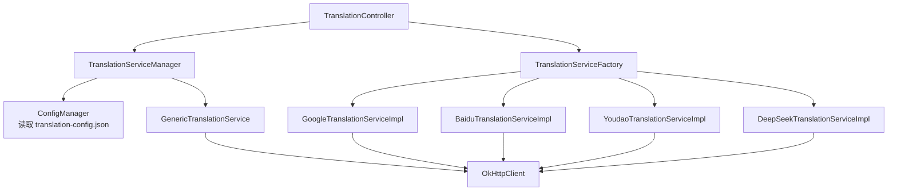
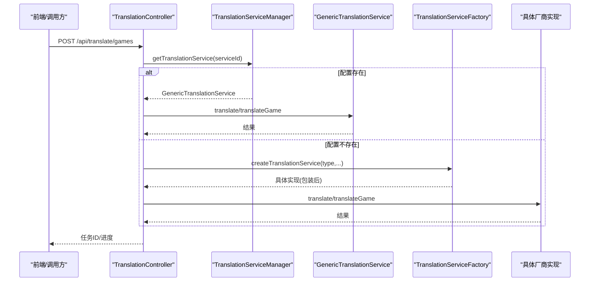
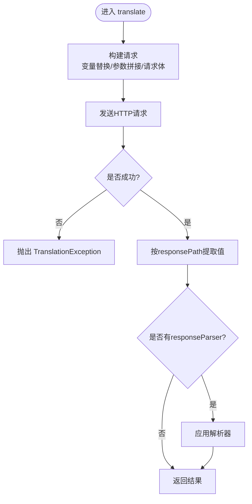
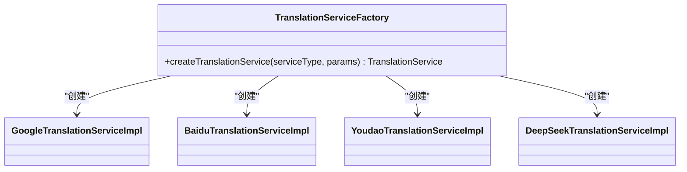
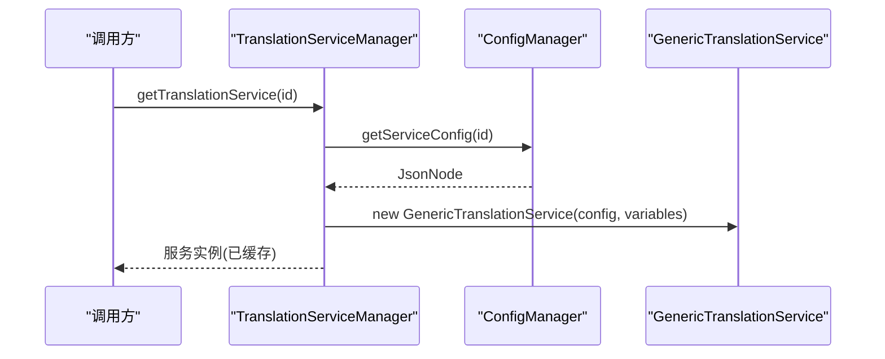
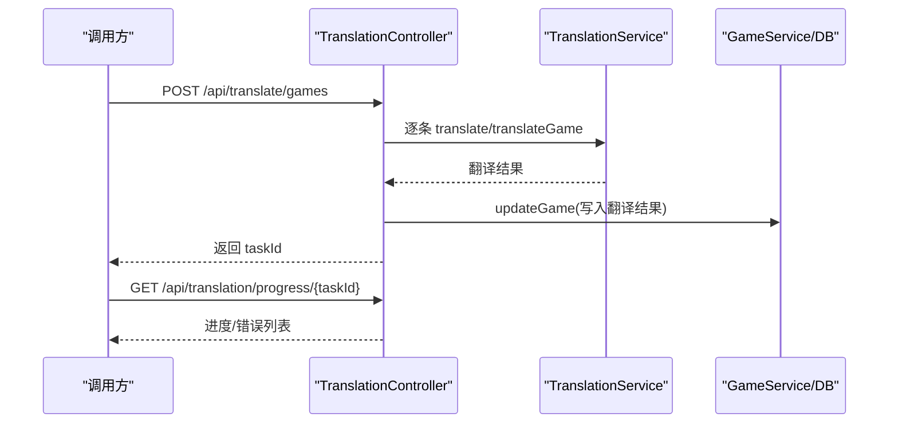
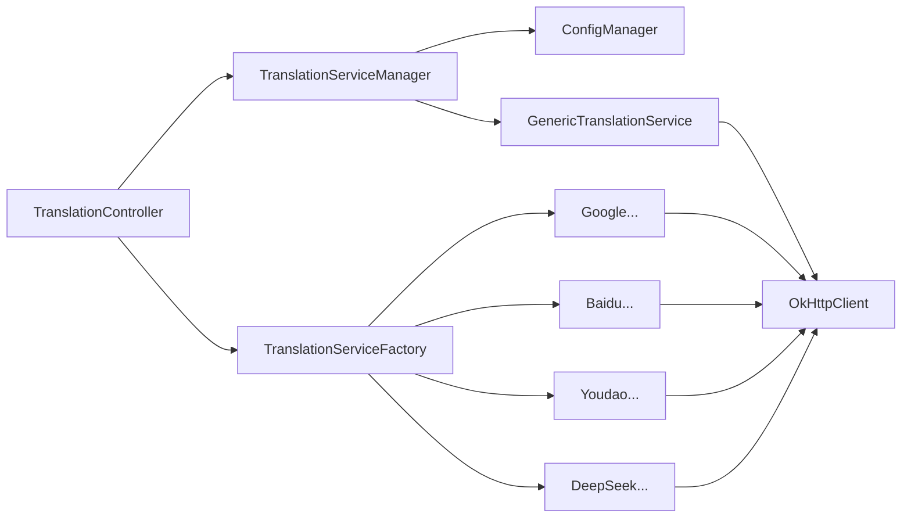

# 翻译服务配置

<cite>
**本文引用的文件**
- [TranslationService.java](file://src/main/java/com/gamelist/service/TranslationService.java)
- [TranslationServiceFactory.java](file://src/main/java/com/gamelist/service/impl/TranslationServiceFactory.java)
- [TranslationServiceManager.java](file://src/main/java/com/gamelist/service/impl/TranslationServiceManager.java)
- [GenericTranslationService.java](file://src/main/java/com/gamelist/service/impl/GenericTranslationService.java)
- [BaiduTranslationServiceImpl.java](file://src/main/java/com/gamelist/service/impl/BaiduTranslationServiceImpl.java)
- [YoudaoTranslationServiceImpl.java](file://src/main/java/com/gamelist/service/impl/YoudaoTranslationServiceImpl.java)
- [GoogleTranslationServiceImpl.java](file://src/main/java/com/gamelist/service/impl/GoogleTranslationServiceImpl.java)
- [DeepSeekTranslationServiceImpl.java](file://src/main/java/com/gamelist/service/impl/DeepSeekTranslationServiceImpl.java)
- [ConfigManager.java](file://src/main/java/com/gamelist/service/impl/ConfigManager.java)
- [translation-config.json](file://rules/translation-config.json)
- [TranslationController.java](file://src/main/java/com/gamelist/controller/TranslationController.java)
- [RateLimitCounter.java](file://src/main/java/com/gamelist/util/RateLimitCounter.java)
- [application.properties](file://src/main/resources/application.properties)
</cite>

## 目录
1. [简介](#简介)
2. [项目结构](#项目结构)
3. [核心组件](#核心组件)
4. [架构总览](#架构总览)
5. [详细组件分析](#详细组件分析)
6. [依赖关系分析](#依赖关系分析)
7. [性能与并发](#性能与并发)
8. [故障排除指南](#故障排除指南)
9. [结论](#结论)
10. [附录：配置示例与最佳实践](#附录配置示例与最佳实践)

## 简介
本文件面向WebGameListOper的“翻译服务配置”，系统性说明如何配置和使用支持的翻译API（百度、有道、Google、DeepSeek），涵盖认证方式、请求参数、响应格式、错误处理、工厂模式与动态切换机制，以及批量翻译的配置选项（并发控制、缓存策略、质量优化）和性能调优建议。

## 项目结构
翻译能力由“接口 + 具体实现 + 工厂/管理器 + 配置中心”构成：
- 接口层：统一翻译接口，定义单条文本翻译与游戏名称+描述批量翻译方法。
- 实现层：各厂商的具体实现（百度、有道、Google、DeepSeek），以及一个通用配置驱动的实现（Generic）。
- 工厂与管理器：根据类型创建具体实现，或从配置文件加载并缓存服务实例；提供校验与热重载能力。
- 控制器：对外暴露REST接口，支持平台级、单个游戏、批量游戏的翻译任务，并提供进度查询与错误子集导出。
- 配置：通过JSON集中管理各服务的URL、请求体、响应路径、变量替换、必填变量校验等。

图表来源
- [TranslationController.java:30-643](file://src/main/java/com/gamelist/controller/TranslationController.java#L30-L643)
- [TranslationServiceManager.java:11-110](file://src/main/java/com/gamelist/service/impl/TranslationServiceManager.java#L11-L110)
- [ConfigManager.java:13-197](file://src/main/java/com/gamelist/service/impl/ConfigManager.java#L13-L197)
- [GenericTranslationService.java:21-443](file://src/main/java/com/gamelist/service/impl/GenericTranslationService.java#L21-L443)
- [TranslationServiceFactory.java:5-46](file://src/main/java/com/gamelist/service/impl/TranslationServiceFactory.java#L5-L46)
- [GoogleTranslationServiceImpl.java:10-59](file://src/main/java/com/gamelist/service/impl/GoogleTranslationServiceImpl.java#L10-L59)
- [BaiduTranslationServiceImpl.java:14-100](file://src/main/java/com/gamelist/service/impl/BaiduTranslationServiceImpl.java#L14-L100)
- [YoudaoTranslationServiceImpl.java:13-94](file://src/main/java/com/gamelist/service/impl/YoudaoTranslationServiceImpl.java#L13-L94)
- [DeepSeekTranslationServiceImpl.java:17-118](file://src/main/java/com/gamelist/service/impl/DeepSeekTranslationServiceImpl.java#L17-L118)

章节来源
- [TranslationController.java:30-643](file://src/main/java/com/gamelist/controller/TranslationController.java#L30-L643)
- [translation-config.json:1-149](file://rules/translation-config.json#L1-L149)

## 核心组件
- TranslationService：定义 translate(text, sourceLang, targetLang) 与 translateGame(gameName, gameDescription, sourceLang, targetLang)。
- GenericTranslationService：基于配置的通用HTTP客户端实现，支持变量替换、URL参数拼接、请求体构建、响应路径提取、响应解析器。
- TranslationServiceFactory：按字符串类型创建具体实现（google/baidu/youdao/deepseek），并包装为带通用错误处理的Wrapper。
- TranslationServiceManager：从配置加载服务，维护缓存，提供有效性校验与热重载。
- ConfigManager：加载 rules/translation-config.json，维护 variables 映射，提供 getServiceConfig/getDefaultService/reloadConfig。
- 各厂商实现：分别对接百度、有道、Google、DeepSeek API，完成签名、请求构造、响应解析与异常转换。

章节来源
- [TranslationService.java:3-33](file://src/main/java/com/gamelist/service/TranslationService.java#L3-L33)
- [GenericTranslationService.java:21-443](file://src/main/java/com/gamelist/service/impl/GenericTranslationService.java#L21-L443)
- [TranslationServiceFactory.java:5-46](file://src/main/java/com/gamelist/service/impl/TranslationServiceFactory.java#L5-L46)
- [TranslationServiceManager.java:11-110](file://src/main/java/com/gamelist/service/impl/TranslationServiceManager.java#L11-L110)
- [ConfigManager.java:13-197](file://src/main/java/com/gamelist/service/impl/ConfigManager.java#L13-L197)

## 架构总览
系统采用“配置驱动 + 工厂/管理器”的双通道：
- 新通道：通过 translation-config.json 声明式配置任意HTTP翻译服务，由 GenericTranslationService 执行。
- 旧通道：通过 TranslationServiceFactory 直接创建特定厂商实现。
- 控制器优先尝试新通道，失败回退到旧通道，保证兼容性与平滑迁移。

图表来源
- [TranslationController.java:618-641](file://src/main/java/com/gamelist/controller/TranslationController.java#L618-L641)
- [TranslationServiceManager.java:28-41](file://src/main/java/com/gamelist/service/impl/TranslationServiceManager.java#L28-L41)
- [GenericTranslationService.java:203-244](file://src/main/java/com/gamelist/service/impl/GenericTranslationService.java#L203-L244)
- [TranslationServiceFactory.java:6-44](file://src/main/java/com/gamelist/service/impl/TranslationServiceFactory.java#L6-L44)

## 详细组件分析

### 通用配置驱动实现（GenericTranslationService）
- 变量替换：支持 ${var} 形式的变量注入，以及 {text}/{sourceLang}/{targetLang}/{gameName}/{gameDescription} 占位符。
- URL与参数：支持在URL中追加 params 节点定义的查询参数，自动编码。
- 请求体：支持对象、数组、字符串三种形式，递归处理占位符与变量。
- 响应提取：通过 responsePath 定位字段；支持 responseParser 进行二次解析（如 microsoftGameNameDescription、gameNameDescription）。
- 超时设置：连接/读/写超时分别为30s/60s/30s。
- 错误处理：非成功状态码抛出 TranslationException，包含状态码与响应体摘要。

图表来源
- [GenericTranslationService.java:203-244](file://src/main/java/com/gamelist/service/impl/GenericTranslationService.java#L203-L244)
- [GenericTranslationService.java:246-317](file://src/main/java/com/gamelist/service/impl/GenericTranslationService.java#L246-L317)
- [GenericTranslationService.java:365-441](file://src/main/java/com/gamelist/service/impl/GenericTranslationService.java#L365-L441)

章节来源
- [GenericTranslationService.java:21-443](file://src/main/java/com/gamelist/service/impl/GenericTranslationService.java#L21-L443)

### 工厂模式与动态切换（TranslationServiceFactory）
- 根据 serviceType 创建对应实现：google、baidu、youdao、deepseek。
- 参数校验：缺失必需参数时抛出非法参数异常。
- 统一包装：返回 TranslationServiceWrapper 以添加通用错误处理。

图表来源
- [TranslationServiceFactory.java:5-46](file://src/main/java/com/gamelist/service/impl/TranslationServiceFactory.java#L5-L46)

章节来源
- [TranslationServiceFactory.java:5-46](file://src/main/java/com/gamelist/service/impl/TranslationServiceFactory.java#L5-L46)

### 管理器与配置中心（TranslationServiceManager + ConfigManager）
- 管理器职责：
  - 从配置获取服务节点，构造 GenericTranslationService 并缓存。
  - 校验服务是否有效（检查 requiredVariables 是否存在且非空）。
  - 提供 reloadServices 热重载配置并清空缓存。
- 配置中心职责：
  - 加载 rules/translation-config.json。
  - 维护 variables 映射，供请求体/头/URL中的 ${var} 替换。
  - 提供 getServiceConfig/getDefaultService。

图表来源
- [TranslationServiceManager.java:28-41](file://src/main/java/com/gamelist/service/impl/TranslationServiceManager.java#L28-L41)
- [ConfigManager.java:174-197](file://src/main/java/com/gamelist/service/impl/ConfigManager.java#L174-L197)

章节来源
- [TranslationServiceManager.java:11-110](file://src/main/java/com/gamelist/service/impl/TranslationServiceManager.java#L11-L110)
- [ConfigManager.java:13-197](file://src/main/java/com/gamelist/service/impl/ConfigManager.java#L13-L197)

### 各翻译服务认证、请求与响应

- Google Translate
  - 认证：通过URL参数 key 传入 apiKey。
  - 请求：POST JSON，包含 q、target、可选 source、format。
  - 响应：data.translations[0].translatedText。
  - 参考：[GoogleTranslationServiceImpl.java:19-57](file://src/main/java/com/gamelist/service/impl/GoogleTranslationServiceImpl.java#L19-L57)

- 百度翻译
  - 认证：GET 请求，参数包含 appid、salt、sign（MD5(appid+q+salt+appKey)）。
  - 请求：fanyi-api.baidu.com/api/trans/vip/translate。
  - 响应：trans_result[0].dst。
  - 参考：[BaiduTranslationServiceImpl.java:26-86](file://src/main/java/com/gamelist/service/impl/BaiduTranslationServiceImpl.java#L26-L86)

- 有道翻译
  - 认证：POST FormBody，包含 appKey、salt、sign（SHA-256(appKey+截断文本+salt+时间戳+appSecret)）、signType=v3。
  - 请求：openapi.youdao.com/api。
  - 响应：errorCode=0 时取 translation[0]。
  - 参考：[YoudaoTranslationServiceImpl.java:25-73](file://src/main/java/com/gamelist/service/impl/YoudaoTranslationServiceImpl.java#L25-L73)

- DeepSeek
  - 认证：Authorization: Bearer ${apiKey}。
  - 请求：chat/completions，messages 包含 system 与 user 消息，temperature 低值以保证稳定输出。
  - 响应：choices[0].message.content。
  - 参考：[DeepSeekTranslationServiceImpl.java:26-92](file://src/main/java/com/gamelist/service/impl/DeepSeekTranslationServiceImpl.java#L26-L92)

章节来源
- [GoogleTranslationServiceImpl.java:10-59](file://src/main/java/com/gamelist/service/impl/GoogleTranslationServiceImpl.java#L10-L59)
- [BaiduTranslationServiceImpl.java:14-100](file://src/main/java/com/gamelist/service/impl/BaiduTranslationServiceImpl.java#L14-L100)
- [YoudaoTranslationServiceImpl.java:13-94](file://src/main/java/com/gamelist/service/impl/YoudaoTranslationServiceImpl.java#L13-L94)
- [DeepSeekTranslationServiceImpl.java:17-118](file://src/main/java/com/gamelist/service/impl/DeepSeekTranslationServiceImpl.java#L17-L118)

### 批量翻译与任务管理（TranslationController）
- 支持三种入口：
  - 平台级翻译：/api/translate（按平台ID拉取游戏列表）。
  - 单游戏翻译：/api/translate/game。
  - 批量游戏翻译：/api/translate/games（支持数组或逗号分隔的游戏ID）。
- 任务模型：
  - 生成 taskId，记录 total/completed/success/failed/status。
  - 后台线程逐条翻译并更新数据库，实时上报进度至 TaskService。
  - 完成后将 errors 列表附加到进度信息。
- 错误子集：
  - 提供 /api/translation/create-error-subset/{taskId}，将失败条目分离到新平台便于重试。

图表来源
- [TranslationController.java:307-480](file://src/main/java/com/gamelist/controller/TranslationController.java#L307-L480)
- [TranslationController.java:505-529](file://src/main/java/com/gamelist/controller/TranslationController.java#L505-L529)

章节来源
- [TranslationController.java:84-235](file://src/main/java/com/gamelist/controller/TranslationController.java#L84-L235)
- [TranslationController.java:240-302](file://src/main/java/com/gamelist/controller/TranslationController.java#L240-L302)
- [TranslationController.java:307-480](file://src/main/java/com/gamelist/controller/TranslationController.java#L307-L480)
- [TranslationController.java:505-529](file://src/main/java/com/gamelist/controller/TranslationController.java#L505-L529)

## 依赖关系分析
- 控制器依赖管理器与工厂，优先使用配置驱动的服务，否则回退到具体实现。
- 管理器依赖配置中心，负责服务实例化与缓存。
- 通用实现依赖 OkHttp 发起HTTP请求，Jackson 解析JSON。
- 各厂商实现均依赖 OkHttp 与 JSON 库，封装各自API协议细节。

图表来源
- [TranslationController.java:618-641](file://src/main/java/com/gamelist/controller/TranslationController.java#L618-L641)
- [TranslationServiceManager.java:28-41](file://src/main/java/com/gamelist/service/impl/TranslationServiceManager.java#L28-L41)
- [GenericTranslationService.java:196-201](file://src/main/java/com/gamelist/service/impl/GenericTranslationService.java#L196-L201)

章节来源
- [TranslationController.java:618-641](file://src/main/java/com/gamelist/controller/TranslationController.java#L618-L641)
- [TranslationServiceManager.java:28-41](file://src/main/java/com/gamelist/service/impl/TranslationServiceManager.java#L28-L41)

## 性能与并发
- 超时设置
  - 通用实现默认：连接30秒、读取60秒、写入30秒。可根据目标服务调整。
  - 参考：[GenericTranslationService.java:196-201](file://src/main/java/com/gamelist/service/impl/GenericTranslationService.java#L196-L201)
- 限流与重试
  - 内置 RateLimitCounter 提供滑动窗口限流（可配置阈值与暂停时长），当前未在服务层直接集成，可在上层调用处结合使用以避免触发第三方限流。
  - 参考：[RateLimitCounter.java:13-79](file://src/main/java/com/gamelist/util/RateLimitCounter.java#L13-L79)
- 并发控制
  - 当前批量翻译使用单线程顺序处理，避免对第三方API造成压力。若需提升吞吐，可在控制器层引入线程池与令牌桶/漏桶限流，并结合任务队列与重试策略。
- 缓存策略
  - 管理器对服务实例进行缓存（按serviceId），但不对翻译结果做缓存。建议在业务层增加基于“原文+源语言+目标语言”的本地缓存（如内存或Redis），以减少重复请求。
- 质量优化
  - DeepSeek 使用较低 temperature 与较短 max_tokens，确保稳定输出；可通过 prompt 工程进一步优化（例如在配置中定制 system message）。
  - 对于微软/DeepSeek 的“同时翻译名称与描述”场景，使用专用 responseParser 提高解析准确率。

章节来源
- [GenericTranslationService.java:196-201](file://src/main/java/com/gamelist/service/impl/GenericTranslationService.java#L196-L201)
- [RateLimitCounter.java:13-79](file://src/main/java/com/gamelist/util/RateLimitCounter.java#L13-L79)
- [translation-config.json:86-145](file://rules/translation-config.json#L86-L145)

## 故障排除指南
- 常见错误
  - 网络错误：IO异常被包装为 TranslationException，包含原始异常信息。
  - 认证失败：各服务会返回非2xx状态码或错误码，会被转换为异常并附带响应体片段。
  - 参数缺失：工厂创建时会校验必需参数，缺失则抛异常。
- 调试建议
  - 开启日志：application.properties 中 logging.level 设置为 DEBUG 可查看更详细的请求/响应日志（通用实现内部有打印语句）。
  - 查看进度与错误：通过 /api/translation/progress/{taskId} 获取任务进度与错误列表；必要时使用“错误子集”接口导出失败条目。
  - 校验配置：使用 TranslationServiceManager.getValidServices 或 validateService 检查服务是否可用。
- 典型问题定位
  - 百度/有道签名错误：检查 appId/appKey/appSecret、salt、sign算法是否符合官方要求。
  - DeepSeek 返回空内容：检查 messages 结构与 system/user 角色是否正确，确认 Authorization 头携带正确密钥。
  - 响应路径不匹配：核对 responsePath 与实际API返回结构一致。

章节来源
- [TranslationController.java:505-529](file://src/main/java/com/gamelist/controller/TranslationController.java#L505-L529)
- [GenericTranslationService.java:229-243](file://src/main/java/com/gamelist/service/impl/GenericTranslationService.java#L229-L243)
- [BaiduTranslationServiceImpl.java:67-86](file://src/main/java/com/gamelist/service/impl/BaiduTranslationServiceImpl.java#L67-L86)
- [YoudaoTranslationServiceImpl.java:55-73](file://src/main/java/com/gamelist/service/impl/YoudaoTranslationServiceImpl.java#L55-L73)
- [DeepSeekTranslationServiceImpl.java:72-92](file://src/main/java/com/gamelist/service/impl/DeepSeekTranslationServiceImpl.java#L72-L92)

## 结论
本项目提供了“配置驱动 + 工厂实现”的双通道翻译体系，既支持快速接入新的HTTP翻译服务，又兼容既有厂商实现。通过统一的接口、完善的错误处理与任务进度追踪，能够满足批量翻译与生产环境的稳定性需求。建议在生产环境中结合限流、缓存与重试策略，并根据不同服务商的特性进行参数调优。

## 附录：配置示例与最佳实践

- 配置位置
  - 主配置：rules/translation-config.json
  - 变量：variables 节点用于注入API密钥与区域等敏感信息
  - 服务列表：translation.services 数组，每个元素定义一种翻译服务

- 关键配置项说明
  - id/name/type：服务标识、显示名、类型（用于工厂回退）
  - url/method：目标API地址与HTTP方法
  - headers/params：请求头与查询参数，支持 ${var} 与 {text}/{sourceLang}/{targetLang} 等占位符
  - requestBody：请求体，支持对象/数组/字符串
  - responsePath：响应中提取结果的JSON路径
  - responseParser：特殊解析器（如 microsoftGameNameDescription、gameNameDescription）
  - validation.requiredVariables：必填变量清单，用于服务可用性校验

- 各服务配置要点
  - Google：key 放入 requestBody.key；responsePath=data.translations[0].translatedText
  - Microsoft：Ocp-Apim-Subscription-Key 与 region 通过 headers/URL 注入；支持双字段翻译
  - DeepSeek：Authorization: Bearer ${deepseek_api_key}；messages 中 system 提示词决定输出风格
  - 百度/有道：遵循各自签名算法，注意参数大小写与编码

- 最佳实践
  - 使用 GenericTranslationService 接入新服务，减少代码侵入
  - 合理设置 timeout，避免长尾请求阻塞
  - 结合 RateLimitCounter 或外部网关进行限流
  - 对高频重复翻译启用缓存（键：原文+源语言+目标语言）
  - 对AI类服务（DeepSeek）使用低 temperature 与明确 prompt，提升一致性
  - 使用 validateService 与 getValidServices 在启动时自检配置

章节来源
- [translation-config.json:1-149](file://rules/translation-config.json#L1-L149)
- [ConfigManager.java:154-197](file://src/main/java/com/gamelist/service/impl/ConfigManager.java#L154-L197)
- [GenericTranslationService.java:350-363](file://src/main/java/com/gamelist/service/impl/GenericTranslationService.java#L350-L363)
- [RateLimitCounter.java:13-79](file://src/main/java/com/gamelist/util/RateLimitCounter.java#L13-L79)