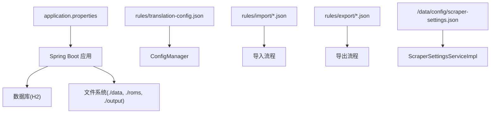
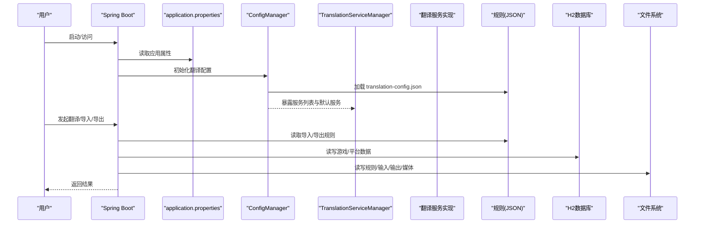
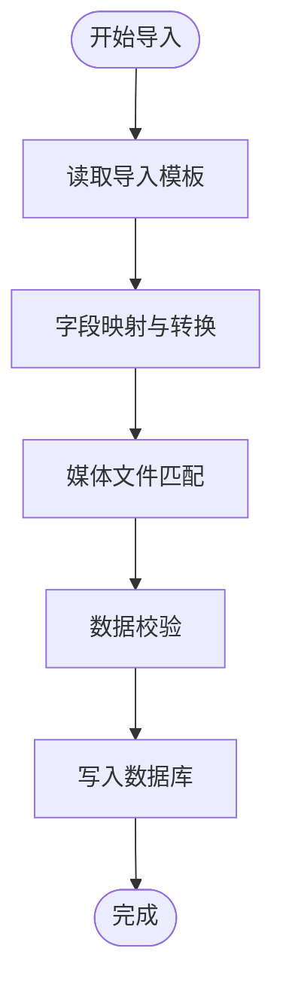
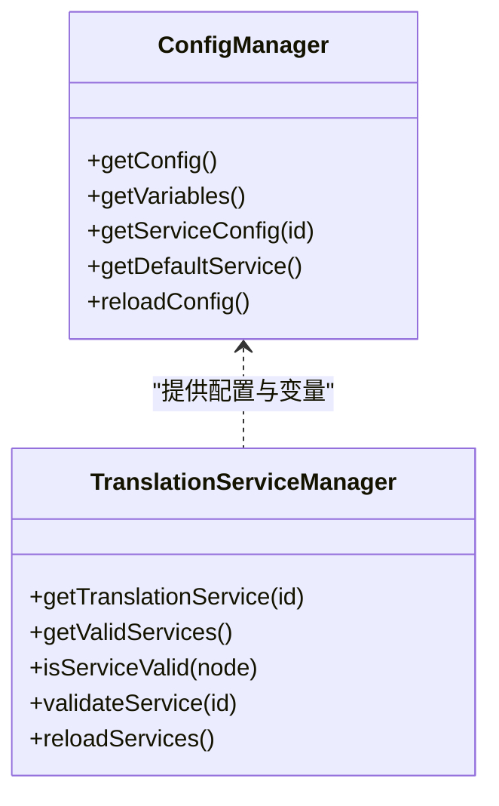
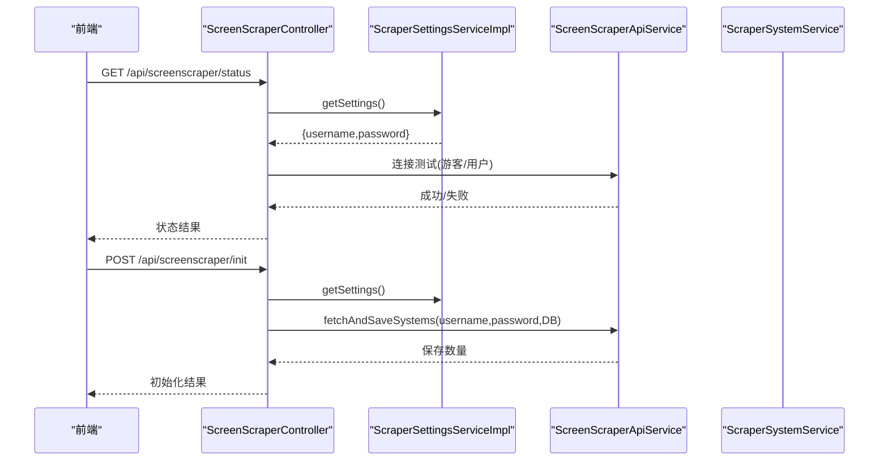
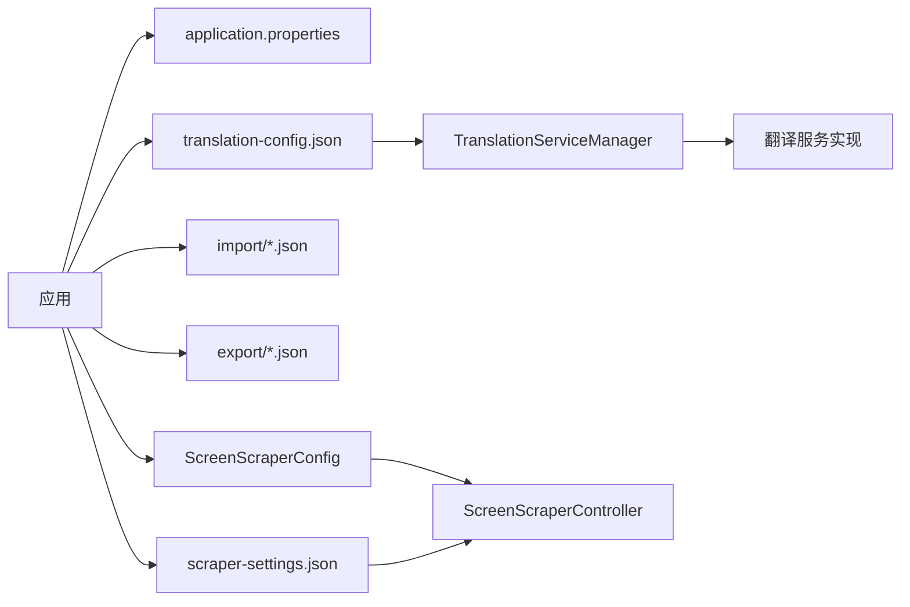

# 配置管理

<cite>
**本文引用的文件**
- [application.properties](file://src/main/resources/application.properties)
- [translation-config.json](file://rules/translation-config.json)
- [webgamelistoper.json](file://rules/import/webgamelistoper.json)
- [emuelec.json](file://rules/export/emuelec.json)
- [ScreenScraperConfig.java](file://src/main/java/com/gamelist/config/ScreenScraperConfig.java)
- [ConfigManager.java](file://src/main/java/com/gamelist/service/impl/ConfigManager.java)
- [TranslationServiceManager.java](file://src/main/java/com/gamelist/service/impl/TranslationServiceManager.java)
- [AsyncConfig.java](file://src/main/java/com/gamelist/config/AsyncConfig.java)
- [RateLimitCounter.java](file://src/main/java/com/gamelist/util/RateLimitCounter.java)
- [ScraperSettingsServiceImpl.java](file://src/main/java/com/gamelist/service/impl/ScraperSettingsServiceImpl.java)
- [ScreenScraperController.java](file://src/main/java/com/gamelist/controller/ScreenScraperController.java)
- [software-guide-cn.md](file://docs/software-guide-cn.md)
</cite>

## 目录
1. [简介](#简介)
2. [项目结构](#项目结构)
3. [核心组件](#核心组件)
4. [架构总览](#架构总览)
5. [详细组件分析](#详细组件分析)
6. [依赖关系分析](#依赖关系分析)
7. [性能考虑](#性能考虑)
8. [故障排查指南](#故障排查指南)
9. [结论](#结论)
10. [附录](#附录)

## 简介
本文件为 WebGameListOper 的配置管理完整文档，覆盖以下方面：
- 应用配置文件 application.properties 的各项配置选项（服务器、数据库、文件路径、线程池等）
- 导入与导出规则的 JSON 配置结构（字段映射、转换规则、验证规则）
- 翻译服务的配置方法（API 密钥、请求限制、超时设置等）
- Scraper 系统配置（API 密钥、频率控制、错误重试机制）
- 不同部署环境的差异化配置示例（开发、测试、生产）
- 配置热重载机制与配置验证规则
- 配置最佳实践与常见问题解决方案

## 项目结构
本项目采用 Spring Boot + H2 的轻量级架构，配置主要来源于：
- 应用属性文件 application.properties：服务器、编码、静态资源、数据库连接池、日志、H2 控制台、上传临时目录、自定义路径等
- 规则目录 rules：导入模板、导出规则、翻译服务配置
- 运行时配置：Scraper 设置持久化到 /data/config/scraper-settings.json
- 异步能力：通过注解启用异步处理

图表来源
- [application.properties:1-86](file://src/main/resources/application.properties#L1-L86)
- [translation-config.json:1-149](file://rules/translation-config.json#L1-L149)
- [webgamelistoper.json:1-334](file://rules/import/webgamelistoper.json#L1-L334)
- [emuelec.json:1-102](file://rules/export/emuelec.json#L1-L102)
- [ScraperSettingsServiceImpl.java:21-42](file://src/main/java/com/gamelist/service/impl/ScraperSettingsServiceImpl.java#L21-L42)

章节来源
- [application.properties:1-86](file://src/main/resources/application.properties#L1-L86)
- [software-guide-cn.md:438-485](file://docs/software-guide-cn.md#L438-L485)

## 核心组件
- 应用属性与路径配置：统一在 application.properties 中定义，包括端口、编码、静态资源、数据库、日志、上传目录、规则与输入输出目录等
- 翻译服务配置：通过 translation-config.json 声明各翻译提供方、请求体、响应解析、变量与校验规则；由 ConfigManager 加载并支持热重载
- 导入/导出规则：以 JSON 模板描述字段映射、媒体匹配、数据文件格式与路径模板
- Scraper 系统配置：凭据与基础地址通过 ScreenScraperConfig 注入；用户凭据持久化于 /data/config/scraper-settings.json
- 限流与并发：RateLimitCounter 提供窗口限流；AsyncConfig 启用异步执行

章节来源
- [application.properties:1-86](file://src/main/resources/application.properties#L1-L86)
- [translation-config.json:1-149](file://rules/translation-config.json#L1-L149)
- [webgamelistoper.json:1-334](file://rules/import/webgamelistoper.json#L1-L334)
- [emuelec.json:1-102](file://rules/export/emuelec.json#L1-L102)
- [ScreenScraperConfig.java:1-46](file://src/main/java/com/gamelist/config/ScreenScraperConfig.java#L1-L46)
- [ScraperSettingsServiceImpl.java:21-117](file://src/main/java/com/gamelist/service/impl/ScraperSettingsServiceImpl.java#L21-L117)
- [AsyncConfig.java:1-14](file://src/main/java/com/gamelist/config/AsyncConfig.java#L1-L14)
- [RateLimitCounter.java:1-138](file://src/main/java/com/gamelist/util/RateLimitCounter.java#L1-L138)

## 架构总览
下图展示配置在各模块中的流转与使用关系。

图表来源
- [application.properties:1-86](file://src/main/resources/application.properties#L1-L86)
- [ConfigManager.java:13-197](file://src/main/java/com/gamelist/service/impl/ConfigManager.java#L13-L197)
- [TranslationServiceManager.java:11-110](file://src/main/java/com/gamelist/service/impl/TranslationServiceManager.java#L11-L110)
- [webgamelistoper.json:1-334](file://rules/import/webgamelistoper.json#L1-L334)
- [emuelec.json:1-102](file://rules/export/emuelec.json#L1-L102)

## 详细组件分析

### 应用属性配置（application.properties）
- 服务器与编码
  - 端口、Tomcat URI 编码、HTTP 编码强制 UTF-8
- 静态资源
  - 多位置映射（classpath、当前目录、media/data），关闭缓存便于调试
- 数据库与连接池
  - H2 文件型数据库，相对路径确保跨平台
  - HikariCP 连接池大小、空闲超时、连接超时、最大生命周期、自动提交
- SQL 初始化与迁移
  - 先执行 init.sql，再按 Flyway 迁移脚本升级（已禁用自动迁移，使用基线版本）
- MyBatis
  - Mapper XML 位置、类型别名包
- 日志
  - 包级别日志级别、控制台与文件日志格式、滚动策略
- H2 控制台
  - 启用、访问路径、允许外部访问
- 上传与工作目录
  - 临时目录、Tomcat 工作目录、静态资源映射
- 自定义路径
  - 规则目录、导入模板目录、导出规则目录、输入/输出目录

章节来源
- [application.properties:1-86](file://src/main/resources/application.properties#L1-L86)

### 导入规则（JSON 模板）
- 元信息
  - 前端标识、名称、版本、描述、数据类型、数据文件名、分隔符
- 字段映射
  - fieldMappings 将源字段映射到目标字段，支持多值字段、路径转换开关
- 媒体映射
  - media 定义多种媒体类型的来源与查找规则，支持路径模板与扩展名白名单
- 扩展名
  - extensions 与 gameExtensions 限定可识别的文件类型

图表来源
- [webgamelistoper.json:1-334](file://rules/import/webgamelistoper.json#L1-L334)

章节来源
- [webgamelistoper.json:1-334](file://rules/import/webgamelistoper.json#L1-L334)

### 导出规则（JSON 模板）
- 元信息与导出选项
  - 是否导出游戏文件、媒体文件、清单文件，是否显示警告
- 媒体导出
  - 将内部媒体类型映射到目标前端的目录结构与命名约定
- 数据文件
  - 指定文件名、格式、路径格式、头部/尾部、字段映射
- 目录模板
  - ROM、媒体、清单文件的输出目录模板

章节来源
- [emuelec.json:1-102](file://rules/export/emuelec.json#L1-L102)

### 翻译服务配置
- 配置文件
  - variables：集中管理 API Key、区域等变量
  - translation.services：每个服务包含 id、name、type、url、method、headers、requestBody/params、responsePath、responseParser、validation.requiredVariables
  - defaultService：默认使用的翻译服务
- 配置加载与热重载
  - ConfigManager 从 rules/translation-config.json 加载配置，支持 reloadConfig() 重新加载
  - TranslationServiceManager 维护服务实例缓存，reloadServices() 会清空缓存并重建
- 校验
  - isServiceValid 检查 requiredVariables 是否齐全且非空
- 使用建议
  - 将敏感信息放入 variables，避免硬编码
  - 针对不同服务设置合适的请求体与响应解析路径

图表来源
- [ConfigManager.java:13-197](file://src/main/java/com/gamelist/service/impl/ConfigManager.java#L13-L197)
- [TranslationServiceManager.java:11-110](file://src/main/java/com/gamelist/service/impl/TranslationServiceManager.java#L11-L110)
- [translation-config.json:1-149](file://rules/translation-config.json#L1-L149)

章节来源
- [translation-config.json:1-149](file://rules/translation-config.json#L1-L149)
- [ConfigManager.java:13-197](file://src/main/java/com/gamelist/service/impl/ConfigManager.java#L13-L197)
- [TranslationServiceManager.java:11-110](file://src/main/java/com/gamelist/service/impl/TranslationServiceManager.java#L11-L110)

### Scraper 系统配置
- 基础配置
  - ScreenScraperConfig 提供 baseUrl、devPseudo、devPassword、debugPassword 等默认值，可通过配置覆盖
- 用户凭据存储
  - ScraperSettingsServiceImpl 将 username/password 加密后持久化至 /data/config/scraper-settings.json
- 状态检测与初始化
  - ScreenScraperController 提供状态查询与系统初始化接口，支持游客模式与用户模式

图表来源
- [ScreenScraperController.java:18-104](file://src/main/java/com/gamelist/controller/ScreenScraperController.java#L18-L104)
- [ScraperSettingsServiceImpl.java:21-117](file://src/main/java/com/gamelist/service/impl/ScraperSettingsServiceImpl.java#L21-L117)
- [ScreenScraperConfig.java:1-46](file://src/main/java/com/gamelist/config/ScreenScraperConfig.java#L1-L46)

章节来源
- [ScreenScraperConfig.java:1-46](file://src/main/java/com/gamelist/config/ScreenScraperConfig.java#L1-L46)
- [ScraperSettingsServiceImpl.java:21-117](file://src/main/java/com/gamelist/service/impl/ScraperSettingsServiceImpl.java#L21-L117)
- [ScreenScraperController.java:18-104](file://src/main/java/com/gamelist/controller/ScreenScraperController.java#L18-L104)

### 线程池与异步
- 异步启用
  - AsyncConfig 通过 @EnableAsync 启用异步处理能力
- 线程池参数
  - 未显式配置线程池时，使用 Spring 默认线程池；如需定制可在项目中添加线程池 Bean 配置

章节来源
- [AsyncConfig.java:1-14](file://src/main/java/com/gamelist/config/AsyncConfig.java#L1-L14)

### 限流与重试
- 限流
  - RateLimitCounter 基于时间窗口统计请求次数，超过阈值触发暂停（当前实现暂停时长为 0，便于测试）
- 重试
  - 代码中未内置通用重试机制；可在调用外部 API 处结合限流与业务逻辑实现重试策略

章节来源
- [RateLimitCounter.java:1-138](file://src/main/java/com/gamelist/util/RateLimitCounter.java#L1-L138)

## 依赖关系分析
- 配置依赖
  - application.properties 驱动 Spring Boot 行为（服务器、数据库、日志、静态资源）
  - translation-config.json 被 ConfigManager 加载，供翻译服务使用
  - 导入/导出规则 JSON 被对应流程读取，决定字段映射与文件组织
  - Scraper 设置文件独立于应用属性，用于持久化用户凭据
- 组件耦合
  - TranslationServiceManager 依赖 ConfigManager 获取服务配置与变量
  - ScreenScraperController 依赖 ScraperSettingsServiceImpl 与 ScreenScraperConfig
- 外部依赖
  - H2 数据库、文件系统、第三方翻译 API、ScreenScraper 服务

图表来源
- [application.properties:1-86](file://src/main/resources/application.properties#L1-L86)
- [translation-config.json:1-149](file://rules/translation-config.json#L1-L149)
- [webgamelistoper.json:1-334](file://rules/import/webgamelistoper.json#L1-L334)
- [emuelec.json:1-102](file://rules/export/emuelec.json#L1-L102)
- [ScreenScraperConfig.java:1-46](file://src/main/java/com/gamelist/config/ScreenScraperConfig.java#L1-L46)
- [ScraperSettingsServiceImpl.java:21-117](file://src/main/java/com/gamelist/service/impl/ScraperSettingsServiceImpl.java#L21-L117)
- [ScreenScraperController.java:18-104](file://src/main/java/com/gamelist/controller/ScreenScraperController.java#L18-L104)

## 性能考虑
- 数据库连接池
  - 根据并发量调整 maximum-pool-size、minimum-idle、connection-timeout、max-lifetime
- 静态资源缓存
  - 开发环境关闭缓存便于调试；生产环境可开启缓存以提升性能
- 日志
  - 合理设置日志级别与滚动策略，避免磁盘占用过大
- 限流
  - 在高并发场景下，结合 RateLimitCounter 保护外部 API 不被限流或封禁
- 异步
  - 对耗时任务启用异步，提升吞吐；注意线程池容量与任务队列长度

[本节为通用指导，不直接分析具体文件]

## 故障排查指南
- 无法连接 H2 控制台
  - 确认 spring.h2.console.enabled 与路径配置正确
- 导入模板不生效
  - 检查 rules/import 下的模板文件是否存在且格式正确
- 导出文件不符合预期
  - 核对 rules/export 模板中的字段映射与路径模板
- 翻译失败
  - 检查 translation-config.json 中 variables 是否填写完整，requiredVariables 是否满足
  - 使用 TranslationServiceManager.validateService 进行校验
- Scraper 连接失败
  - 检查 /data/config/scraper-settings.json 中的用户名密码是否正确
  - 使用 /api/screenscraper/status 进行连通性测试
- 限流导致请求被拒
  - 检查 RateLimitCounter 的阈值与窗口设置，必要时调整

章节来源
- [application.properties:55-58](file://src/main/resources/application.properties#L55-L58)
- [translation-config.json:1-149](file://rules/translation-config.json#L1-L149)
- [TranslationServiceManager.java:43-104](file://src/main/java/com/gamelist/service/impl/TranslationServiceManager.java#L43-L104)
- [ScraperSettingsServiceImpl.java:44-79](file://src/main/java/com/gamelist/service/impl/ScraperSettingsServiceImpl.java#L44-L79)
- [ScreenScraperController.java:37-88](file://src/main/java/com/gamelist/controller/ScreenScraperController.java#L37-L88)
- [RateLimitCounter.java:31-79](file://src/main/java/com/gamelist/util/RateLimitCounter.java#L31-L79)

## 结论
WebGameListOper 的配置体系围绕 application.properties 与 JSON 规则文件构建，具备高内聚、低耦合的特点。通过 ConfigManager 与 TranslationServiceManager 实现了翻译服务的灵活配置与热重载；导入/导出规则以 JSON 形式解耦业务逻辑；Scraper 凭据安全持久化并提供连通性检测。配合合理的连接池、限流与异步策略，可满足多环境部署与稳定运行需求。

[本节为总结，不直接分析具体文件]

## 附录

### 不同部署环境的配置示例
- 开发环境
  - 关闭静态资源缓存，开启 H2 控制台，日志级别 INFO
  - 使用本地 H2 文件数据库，规则与输入输出目录位于 ./data
- 测试环境
  - 适当增大连接池大小，保留 H2 控制台但限制外部访问
  - 规则与数据目录挂载到容器卷，便于数据隔离
- 生产环境
  - 开启静态资源缓存，关闭 H2 控制台或限制访问
  - 使用环境变量或外部配置中心覆盖关键参数（端口、数据库、路径）
  - 日志滚动策略收紧，监控磁盘使用

章节来源
- [application.properties:10-13](file://src/main/resources/application.properties#L10-L13)
- [application.properties:55-58](file://src/main/resources/application.properties#L55-L58)
- [application.properties:76-86](file://src/main/resources/application.properties#L76-L86)
- [software-guide-cn.md:552-592](file://docs/software-guide-cn.md#L552-L592)

### 配置热重载机制
- 翻译配置
  - ConfigManager.reloadConfig() 重新加载 translation-config.json
  - TranslationServiceManager.reloadServices() 清空服务缓存并重建
- Scraper 设置
  - 修改 /data/config/scraper-settings.json 后，下次读取即生效（无需重启）

章节来源
- [ConfigManager.java:194-197](file://src/main/java/com/gamelist/service/impl/ConfigManager.java#L194-L197)
- [TranslationServiceManager.java:106-110](file://src/main/java/com/gamelist/service/impl/TranslationServiceManager.java#L106-L110)
- [ScraperSettingsServiceImpl.java:44-79](file://src/main/java/com/gamelist/service/impl/ScraperSettingsServiceImpl.java#L44-L79)

### 配置验证规则
- 翻译服务
  - validation.requiredVariables 指定的变量必须存在且非空
  - 可通过 validateService(serviceId) 进行校验并返回错误信息
- 导入/导出规则
  - 字段映射与媒体规则需与实际数据结构一致，否则导入/导出失败
- Scraper 凭据
  - 用户名/密码为空时使用游客模式，否则使用用户模式

章节来源
- [TranslationServiceManager.java:64-104](file://src/main/java/com/gamelist/service/impl/TranslationServiceManager.java#L64-L104)
- [webgamelistoper.json:1-334](file://rules/import/webgamelistoper.json#L1-L334)
- [emuelec.json:1-102](file://rules/export/emuelec.json#L1-L102)
- [ScreenScraperController.java:37-88](file://src/main/java/com/gamelist/controller/ScreenScraperController.java#L37-L88)

### 配置最佳实践
- 将敏感信息（API Key、区域）集中在 variables 中管理
- 使用相对路径与可挂载目录，提高跨平台与容器化友好性
- 在生产环境关闭不必要的调试功能（如 H2 控制台）
- 合理设置连接池与日志滚动策略，避免资源耗尽
- 对外部 API 调用增加限流与重试，提升稳定性

[本节为通用指导，不直接分析具体文件]