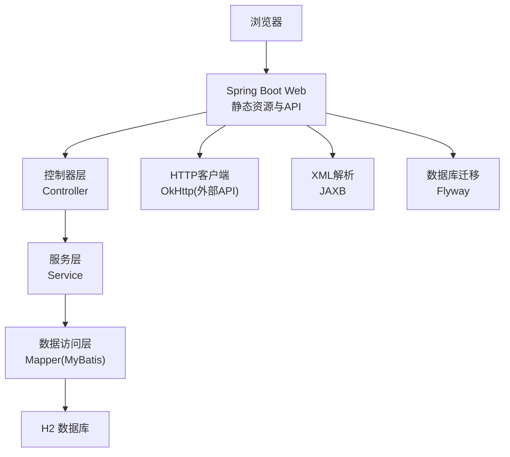
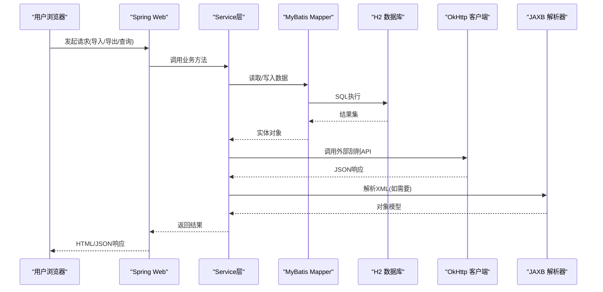
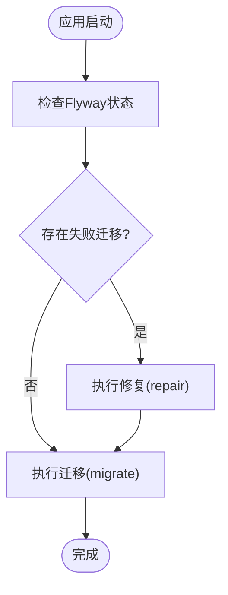
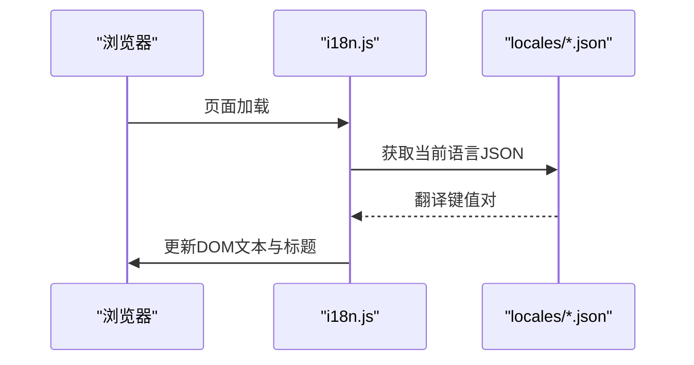
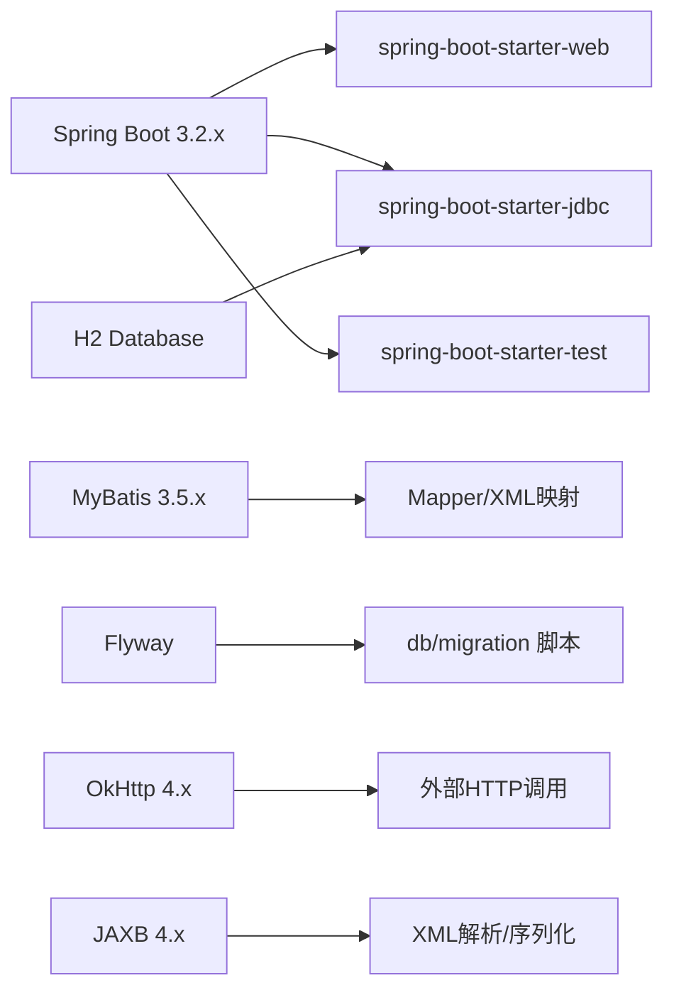

# 技术栈

<cite>
**本文引用的文件**
- [pom.xml](file://pom.xml)
- [application.properties](file://src/main/resources/application.properties)
- [Application.java](file://src/main/java/com/gamelist/Application.java)
- [FlywayConfig.java](file://src/main/java/com/gamelist/config/FlywayConfig.java)
- [V1.0.3__baseline_migration.sql](file://src/main/resources/db/migration/V1.0.3__baseline_migration.sql)
- [Dockerfile](file://Dockerfile)
- [i18n.js](file://src/main/resources/static/js/i18n.js)
- [index.html](file://src/main/resources/static/index.html)
- [ScreenScraperApiServiceImpl.java](file://src/main/java/com/gamelist/service/impl/ScreenScraperApiServiceImpl.java)
- [GameListParser.java](file://src/main/java/com/gamelist/xml/GameListParser.java)
</cite>

## 目录
1. [简介](#简介)
2. [项目结构](#项目结构)
3. [核心组件](#核心组件)
4. [架构总览](#架构总览)
5. [详细组件分析](#详细组件分析)
6. [依赖关系分析](#依赖关系分析)
7. [性能考量](#性能考量)
8. [故障排查指南](#故障排查指南)
9. [结论](#结论)
10. [附录：版本升级与兼容性指南](#附录版本升级与兼容性指南)

## 简介
本技术栈文档面向WebGameListOper项目的后端与前端技术选型、配置与部署实践，覆盖以下要点：
- 开发语言与框架：Java 17 + Spring Boot 3.2.x
- ORM与数据库：MyBatis + H2（嵌入式）+ Flyway（迁移）
- HTTP客户端：OkHttp
- XML处理：JAXB（Jakarta XML Binding）
- 前端技术：HTML5、JavaScript、CSS及国际化机制
- 构建与部署：Maven + Docker多阶段构建
- 依赖管理与版本升级建议

## 项目结构
- 后端采用Spring Boot标准分层：controller、service、mapper、model、config等
- 资源文件位于resources下：静态页面、i18n语言包、MyBatis映射XML、数据库迁移脚本
- 前端静态资源通过Spring Web MVC直接提供，支持本地化与主题样式
- 构建产物为可执行JAR，使用Spring Boot Maven插件打包；容器镜像基于OpenJDK运行

图表来源
- [Application.java:8-14](file://src/main/java/com/gamelist/Application.java#L8-L14)
- [application.properties:15-41](file://src/main/resources/application.properties#L15-L41)
- [FlywayConfig.java:17-74](file://src/main/java/com/gamelist/config/FlywayConfig.java#L17-L74)
- [ScreenScraperApiServiceImpl.java:30-106](file://src/main/java/com/gamelist/service/impl/ScreenScraperApiServiceImpl.java#L30-L106)
- [GameListParser.java:172-218](file://src/main/java/com/gamelist/xml/GameListParser.java#L172-L218)

章节来源
- [Application.java:8-14](file://src/main/java/com/gamelist/Application.java#L8-L14)
- [application.properties:1-86](file://src/main/resources/application.properties#L1-L86)

## 核心组件
- Java 17：作为运行时与编译期语言版本，确保现代语言特性与长周期支持。
- Spring Boot 3.2.x：提供Web服务器、自动装配、配置管理、测试等能力。
- MyBatis 3.5.x：以注解+XML方式实现ORM映射，灵活控制SQL。
- H2 Database：嵌入式数据库，便于开发与轻量部署；通过JDBC连接。
- Flyway：数据库版本化管理，支持基线版本与增量迁移。
- OkHttp：高性能HTTP客户端，用于调用外部刮削API。
- JAXB（Jakarta XML Binding 4.x）：用于XML与对象之间的编解码。
- 前端：HTML5/CSS/JS + i18n（JSON语言包），无重型前端框架。
- 构建与部署：Maven + Spring Boot Maven Plugin；Docker多阶段构建。

章节来源
- [pom.xml:18-105](file://pom.xml#L18-L105)
- [application.properties:15-41](file://src/main/resources/application.properties#L15-L41)
- [Dockerfile:1-55](file://Dockerfile#L1-L55)

## 架构总览
系统由Web入口、业务服务、数据持久化、外部HTTP通信与XML处理组成。启动时初始化异步任务、扫描Mapper、加载静态资源与数据库迁移；运行时通过控制器暴露REST接口，服务层协调MyBatis与外部API，最终将结果返回给前端。

图表来源
- [Application.java:8-14](file://src/main/java/com/gamelist/Application.java#L8-L14)
- [ScreenScraperApiServiceImpl.java:30-106](file://src/main/java/com/gamelist/service/impl/ScreenScraperApiServiceImpl.java#L30-L106)
- [GameListParser.java:172-218](file://src/main/java/com/gamelist/xml/GameListParser.java#L172-L218)

## 详细组件分析

### 应用启动与基础配置
- 启动类启用Spring Boot、MyBatis Mapper扫描与异步任务支持。
- 应用属性配置了端口、编码、静态资源路径、H2数据库连接、HikariCP连接池、SQL初始化与Flyway迁移位置、MyBatis映射路径与日志级别等。

章节来源
- [Application.java:8-14](file://src/main/java/com/gamelist/Application.java#L8-L14)
- [application.properties:1-86](file://src/main/resources/application.properties#L1-L86)

### 数据库与迁移（H2 + Flyway）
- 使用H2嵌入式数据库，存储于相对路径，便于跨平台与容器化。
- Flyway负责数据库版本管理，支持基线版本与迁移脚本；自定义配置类在启动时检查失败迁移并修复后执行迁移。
- 迁移脚本包含平台、游戏、临时子集、后台任务、媒体下载任务等表结构定义。

图表来源
- [FlywayConfig.java:35-74](file://src/main/java/com/gamelist/config/FlywayConfig.java#L35-L74)
- [V1.0.3__baseline_migration.sql:1-238](file://src/main/resources/db/migration/V1.0.3__baseline_migration.sql#L1-L238)

章节来源
- [application.properties:29-37](file://src/main/resources/application.properties#L29-L37)
- [FlywayConfig.java:17-74](file://src/main/java/com/gamelist/config/FlywayConfig.java#L17-L74)
- [V1.0.3__baseline_migration.sql:1-238](file://src/main/resources/db/migration/V1.0.3__baseline_migration.sql#L1-L238)

### ORM与数据访问（MyBatis）
- 通过mybatis-spring-boot-starter集成，配置映射XML位置与类型别名包。
- Mapper接口与XML文件分离，便于维护复杂SQL与结果映射。

章节来源
- [application.properties:39-41](file://src/main/resources/application.properties#L39-L41)

### HTTP客户端（OkHttp）
- 使用OkHttp进行外部API调用，配置SSL上下文、TLS协议、连接池、超时与重试策略，增强稳定性与兼容性。
- 适用于对网络环境要求较高的刮削场景。

章节来源
- [ScreenScraperApiServiceImpl.java:30-106](file://src/main/java/com/gamelist/service/impl/ScreenScraperApiServiceImpl.java#L30-L106)

### XML处理（JAXB）
- 使用Jakarta XML Binding API与实现进行XML解组，支持多种字符集尝试与错误定位，提升容错性。
- 通过事件处理器忽略未知元素，提高对不同XML结构的兼容。

章节来源
- [GameListParser.java:172-218](file://src/main/java/com/gamelist/xml/GameListParser.java#L172-L218)
- [GameListParser.java:347-383](file://src/main/java/com/gamelist/xml/GameListParser.java#L347-L383)

### 前端技术栈与国际化
- 纯HTML5/CSS/JS实现界面，无重型框架；通过静态资源直接提供服务端渲染或前后端分离的API调用。
- 国际化机制：前端通过i18n.js动态加载locales下的JSON语言包，支持中文、英文、日文；页面元素通过data-i18n属性绑定翻译键。

图表来源
- [i18n.js:1-76](file://src/main/resources/static/js/i18n.js#L1-L76)
- [index.html:420-421](file://src/main/resources/static/index.html#L420-L421)

章节来源
- [i18n.js:1-76](file://src/main/resources/static/js/i18n.js#L1-L76)
- [index.html:1-698](file://src/main/resources/static/index.html#L1-L698)

### 构建与部署（Maven + Docker）
- Maven构建：使用spring-boot-maven-plugin打包可执行JAR，指定主类与UTF-8资源编码。
- Docker多阶段构建：第一阶段基于maven镜像编译，第二阶段基于openjdk镜像运行；复制静态资源、规则文件与数据目录，暴露8080端口并通过entrypoint启动。

章节来源
- [pom.xml:108-150](file://pom.xml#L108-L150)
- [Dockerfile:1-55](file://Dockerfile#L1-L55)

## 依赖关系分析
- 核心依赖包括Spring Boot Starter Web/JDBC、MyBatis Starter、H2、Flyway、JAXB API与实现、OkHttp、JSON库。
- 版本选择遵循Spring Boot 3.2.x生态，JAXB使用Jakarta命名空间以适配Spring Boot 3。

图表来源
- [pom.xml:23-105](file://pom.xml#L23-L105)

章节来源
- [pom.xml:23-105](file://pom.xml#L23-L105)

## 性能考量
- 连接池：HikariCP最大连接数、空闲超时、连接超时等参数已配置，可根据负载调优。
- 网络：OkHttp连接池大小与超时时间已设置，避免外部API调用阻塞。
- 静态资源：关闭缓存便于开发调试，生产环境可开启CDN或缓存策略。
- 日志：控制台与文件日志输出，按大小与保留天数轮转，便于问题追踪。

[本节为通用指导，不直接分析具体文件]

## 故障排查指南
- 数据库迁移失败：查看Flyway日志，必要时执行repair后再migrate；确认迁移脚本顺序与基线版本一致。
- XML解析异常：检查字符集与BOM处理，参考解析流程中的多编码尝试与错误行定位逻辑。
- 外部API调用失败：检查OkHttp SSL/TLS配置与超时设置，确认网络连通性与证书信任链。
- 前端国际化缺失：确认locales目录下对应语言JSON文件存在且格式正确，检查data-i18n键是否匹配。

章节来源
- [FlywayConfig.java:35-74](file://src/main/java/com/gamelist/config/FlywayConfig.java#L35-L74)
- [GameListParser.java:347-383](file://src/main/java/com/gamelist/xml/GameListParser.java#L347-L383)
- [ScreenScraperApiServiceImpl.java:45-106](file://src/main/java/com/gamelist/service/impl/ScreenScraperApiServiceImpl.java#L45-L106)
- [i18n.js:6-22](file://src/main/resources/static/js/i18n.js#L6-L22)

## 结论
本项目以Spring Boot 3.2.x为核心，结合MyBatis与H2实现轻量级数据管理，使用Flyway保障数据库演进，OkHttp与JAXB分别满足外部API与XML处理能力。前端采用简洁的HTML5/CSS/JS与i18n机制，配合Maven与Docker实现高效构建与容器化部署。整体技术栈成熟稳定，具备良好扩展性与可维护性。

[本节为总结性内容，不直接分析具体文件]

## 附录：版本升级与兼容性指南
- Java版本：保持Java 17，确保与Spring Boot 3.2.x兼容；如需升级至更高版本，需评估第三方库兼容性。
- Spring Boot：优先跟随官方LTS版本；升级前检查依赖冲突与弃用API。
- MyBatis：与Spring Boot 3.x配套的starter版本需匹配；升级时关注XML映射与注解变更。
- H2：嵌入式数据库适合开发与测试；生产环境可考虑切换至MySQL/PostgreSQL，同时调整Flyway驱动与迁移脚本。
- Flyway：迁移脚本命名与顺序严格；新增字段或表时需编写增量脚本，避免破坏性变更。
- OkHttp：注意TLS版本与证书信任策略；在高延迟或不稳定网络环境下适当增加超时与重试。
- JAXB：Jakarta命名空间与Spring Boot 3兼容；升级时关注API变更与模块依赖。
- 前端：i18n语言包按需扩展；静态资源可通过CDN优化加载性能。
- 构建与部署：Docker镜像基于OpenJDK Slim减小体积；CI/CD中可使用多阶段构建加速流水线。

[本节为通用指导，不直接分析具体文件]