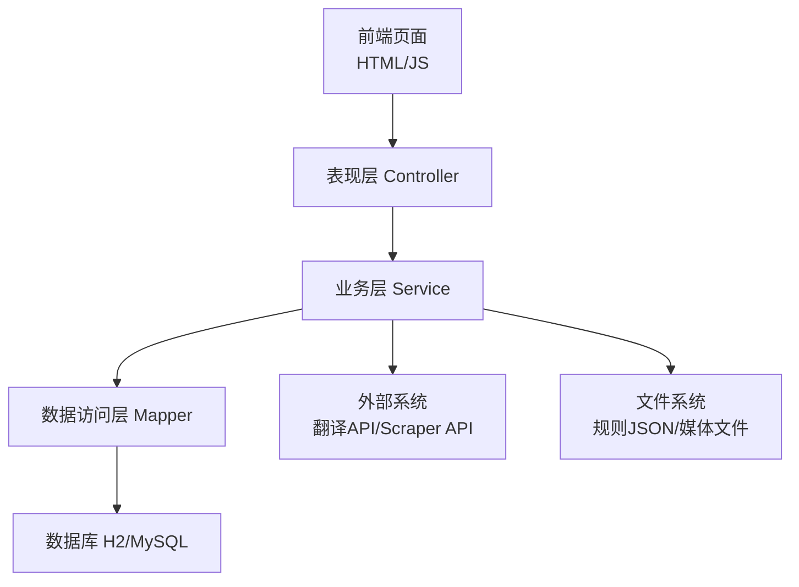
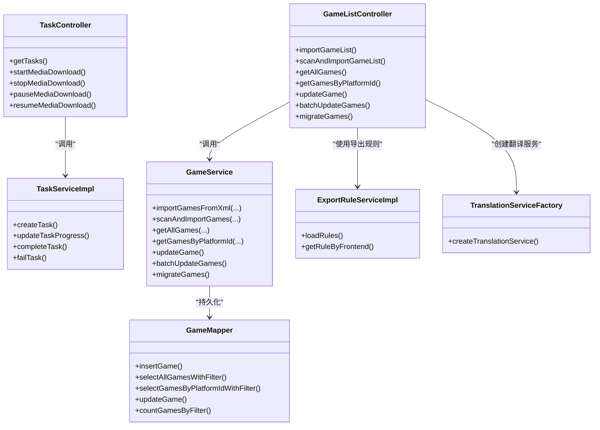
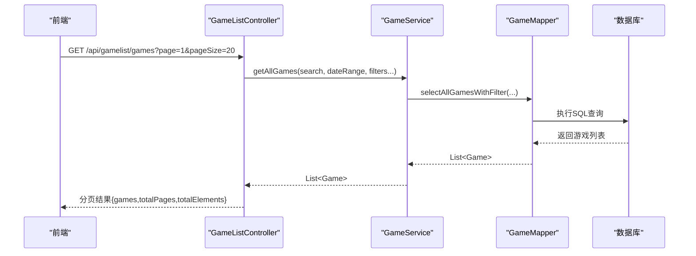
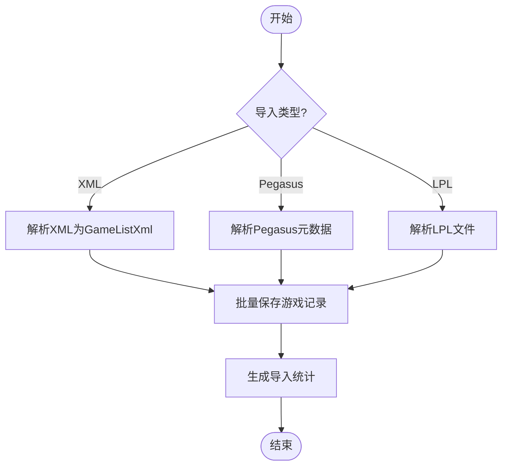
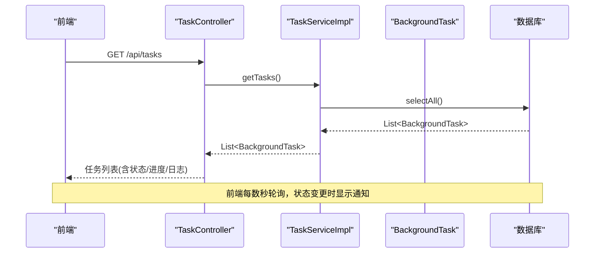
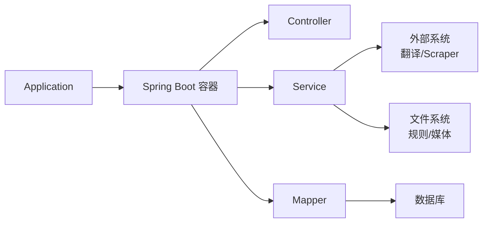

# 架构设计

<cite>
**本文引用的文件**
- [Application.java](file://src/main/java/com/gamelist/Application.java)
- [pom.xml](file://pom.xml)
- [README.md](file://README.md)
- [GameListController.java](file://src/main/java/com/gamelist/controller/GameListController.java)
- [TaskController.java](file://src/main/java/com/gamelist/controller/TaskController.java)
- [GameService.java](file://src/main/java/com/gamelist/service/GameService.java)
- [ExportRuleServiceImpl.java](file://src/main/java/com/gamelist/service/impl/ExportRuleServiceImpl.java)
- [TranslationServiceFactory.java](file://src/main/java/com/gamelist/service/impl/TranslationServiceFactory.java)
- [TaskServiceImpl.java](file://src/main/java/com/gamelist/service/impl/TaskServiceImpl.java)
- [BackgroundTask.java](file://src/main/java/com/gamelist/model/BackgroundTask.java)
- [GameMapper.java](file://src/main/java/com/gamelist/mapper/GameMapper.java)
- [AsyncConfig.java](file://src/main/java/com/gamelist/config/AsyncConfig.java)
</cite>

## 目录
1. [简介](#简介)
2. [项目结构](#项目结构)
3. [核心组件](#核心组件)
4. [架构总览](#架构总览)
5. [详细组件分析](#详细组件分析)
6. [依赖关系分析](#依赖关系分析)
7. [性能考虑](#性能考虑)
8. [故障排查指南](#故障排查指南)
9. [结论](#结论)
10. [附录](#附录)

## 简介
本架构设计文档面向 WebGameListOper 项目，系统性阐述分层架构与 MVC 模式的应用、关键设计模式的落地（工厂模式、策略模式、观察者模式）、组件交互与数据流转、扩展性与模块化设计。通过架构图与流程图帮助开发者快速理解整体思路与技术决策。

## 项目结构
- 表现层（Controller）：负责 HTTP 请求接入、参数校验、响应封装，如游戏列表、任务管理、导出导入等控制器。
- 业务逻辑层（Service）：封装领域逻辑与流程编排，如游戏导入/扫描、导出规则加载、翻译服务调度、后台任务管理等。
- 数据访问层（Mapper）：基于 MyBatis 的接口定义，映射数据库操作。
- 配置与启动：Spring Boot 应用入口、异步能力启用、数据库迁移与初始化。
- 资源与规则：导入/导出模板 JSON、静态页面、i18n 资源等。

图表来源
- [Application.java:8-10](file://src/main/java/com/gamelist/Application.java#L8-L10)
- [GameListController.java:39-49](file://src/main/java/com/gamelist/controller/GameListController.java#L39-L49)
- [GameService.java:13-61](file://src/main/java/com/gamelist/service/GameService.java#L13-L61)
- [GameMapper.java:11-75](file://src/main/java/com/gamelist/mapper/GameMapper.java#L11-L75)

章节来源
- [Application.java:8-10](file://src/main/java/com/gamelist/Application.java#L8-L10)
- [pom.xml:23-106](file://pom.xml#L23-L106)

## 核心组件
- 表现层（Controller）
  - GameListController：提供游戏列表、平台、导入/扫描、统计、批量更新/迁移等 REST 接口。
  - TaskController：提供后台任务查询、媒体下载任务的启停控制与状态监控。
- 业务层（Service）
  - GameService：定义游戏导入、扫描、CRUD、筛选、统计、合并等能力契约。
  - ExportRuleServiceImpl：从外部路径或类路径加载导出规则 JSON，按前端类型返回策略。
  - TranslationServiceFactory：根据服务类型创建具体翻译实现，统一包装错误处理。
  - TaskServiceImpl：后台任务生命周期管理（创建、进度更新、日志追加、完成/失败），并维护内存缓存与数据库一致性。
- 数据访问层（Mapper）
  - GameMapper：游戏相关 SQL 映射接口，涵盖增删改查、筛选、统计、唯一值获取等。
- 模型（Model）
  - BackgroundTask：后台任务实体，包含类型、状态、进度、日志等字段。
- 配置（Config）
  - AsyncConfig：启用 Spring 异步能力，支撑异步任务执行。

章节来源
- [GameListController.java:39-551](file://src/main/java/com/gamelist/controller/GameListController.java#L39-L551)
- [TaskController.java:22-202](file://src/main/java/com/gamelist/controller/TaskController.java#L22-L202)
- [GameService.java:13-61](file://src/main/java/com/gamelist/service/GameService.java#L13-L61)
- [ExportRuleServiceImpl.java:29-162](file://src/main/java/com/gamelist/service/impl/ExportRuleServiceImpl.java#L29-L162)
- [TranslationServiceFactory.java:5-46](file://src/main/java/com/gamelist/service/impl/TranslationServiceFactory.java#L5-L46)
- [TaskServiceImpl.java:17-175](file://src/main/java/com/gamelist/service/impl/TaskServiceImpl.java#L17-L175)
- [GameMapper.java:11-75](file://src/main/java/com/gamelist/mapper/GameMapper.java#L11-L75)
- [BackgroundTask.java:5-114](file://src/main/java/com/gamelist/model/BackgroundTask.java#L5-L114)
- [AsyncConfig.java:6-14](file://src/main/java/com/gamelist/config/AsyncConfig.java#L6-L14)

## 架构总览
本项目采用分层架构与 MVC 模式：
- 表现层（Controller）：接收请求、参数校验、调用 Service 并返回结果。
- 业务层（Service）：编排业务流程、协调外部依赖、持久化数据。
- 数据访问层（Mapper）：专注 SQL 映射与数据库交互。
- 启动与配置：Spring Boot 应用入口装配 MyBatis、异步能力；Flyway 管理数据库迁移。

图表来源
- [GameListController.java:39-551](file://src/main/java/com/gamelist/controller/GameListController.java#L39-L551)
- [GameService.java:13-61](file://src/main/java/com/gamelist/service/GameService.java#L13-L61)
- [GameMapper.java:11-75](file://src/main/java/com/gamelist/mapper/GameMapper.java#L11-L75)
- [TaskController.java:22-202](file://src/main/java/com/gamelist/controller/TaskController.java#L22-L202)
- [TaskServiceImpl.java:17-175](file://src/main/java/com/gamelist/service/impl/TaskServiceImpl.java#L17-L175)
- [ExportRuleServiceImpl.java:29-162](file://src/main/java/com/gamelist/service/impl/ExportRuleServiceImpl.java#L29-L162)
- [TranslationServiceFactory.java:5-46](file://src/main/java/com/gamelist/service/impl/TranslationServiceFactory.java#L5-L46)

## 详细组件分析

### 表现层（MVC 中的 Controller）
- 职责分工
  - 接收 HTTP 请求，解析参数与请求体。
  - 调用 Service 执行业务逻辑。
  - 封装响应对象与状态码，处理异常并返回友好消息。
- 数据流向
  - 前端发起请求 → Controller 校验 → Service 处理 → Mapper 持久化 → 返回结果。
- 典型接口
  - 游戏列表与筛选、平台信息、导入/扫描、批量更新/迁移、统计信息等。

图表来源
- [GameListController.java:128-159](file://src/main/java/com/gamelist/controller/GameListController.java#L128-L159)
- [GameService.java:40-46](file://src/main/java/com/gamelist/service/GameService.java#L40-L46)
- [GameMapper.java:15-21](file://src/main/java/com/gamelist/mapper/GameMapper.java#L15-L21)

章节来源
- [GameListController.java:39-551](file://src/main/java/com/gamelist/controller/GameListController.java#L39-L551)
- [GameService.java:13-61](file://src/main/java/com/gamelist/service/GameService.java#L13-L61)
- [GameMapper.java:11-75](file://src/main/java/com/gamelist/mapper/GameMapper.java#L11-L75)

### 业务逻辑层（Service）
- 游戏导入与扫描
  - 支持 XML、Pegasus 元数据、LPL 等多种格式导入。
  - 支持递归扫描目录并批量导入，返回统计结果。
- 导出规则策略
  - 从外部路径或类路径加载 JSON 规则，按前端类型返回对应策略。
- 翻译服务工厂
  - 根据配置的服务类型创建 Google/Baidu/Youdao/DeepSeek 翻译实现，统一包装错误处理。
- 后台任务管理
  - 任务创建、进度更新、日志追加、完成/失败状态管理，结合内存缓存提升读取性能。

图表来源
- [GameService.java:14-37](file://src/main/java/com/gamelist/service/GameService.java#L14-L37)

章节来源
- [GameService.java:13-61](file://src/main/java/com/gamelist/service/GameService.java#L13-L61)
- [ExportRuleServiceImpl.java:29-162](file://src/main/java/com/gamelist/service/impl/ExportRuleServiceImpl.java#L29-L162)
- [TranslationServiceFactory.java:5-46](file://src/main/java/com/gamelist/service/impl/TranslationServiceFactory.java#L5-L46)
- [TaskServiceImpl.java:17-175](file://src/main/java/com/gamelist/service/impl/TaskServiceImpl.java#L17-L175)

### 数据访问层（Mapper）
- 职责
  - 定义 SQL 映射接口，屏蔽底层数据库细节。
  - 提供复杂查询、统计、筛选、唯一值获取等方法。
- 典型能力
  - 多条件查询、分页、平台维度统计、去重字段查询、批量插入/更新。

章节来源
- [GameMapper.java:11-75](file://src/main/java/com/gamelist/mapper/GameMapper.java#L11-L75)

### 设计模式应用
- 工厂模式（翻译服务工厂）
  - 根据 serviceType 动态创建不同翻译实现，并对参数进行校验，统一返回包装后的服务以增强错误处理。
- 策略模式（导入/导出规则处理）
  - 通过 JSON 规则文件定义不同前端的导入/导出策略，运行时加载并选择对应策略。
- 观察者模式（异步任务监控）
  - 前端轮询任务状态，当任务状态变化时触发通知；后端通过任务服务维护任务状态与日志，形成“发布-订阅”式的监控机制。

图表来源
- [TaskController.java:41-49](file://src/main/java/com/gamelist/controller/TaskController.java#L41-L49)
- [TaskServiceImpl.java:143-151](file://src/main/java/com/gamelist/service/impl/TaskServiceImpl.java#L143-L151)
- [BackgroundTask.java:5-114](file://src/main/java/com/gamelist/model/BackgroundTask.java#L5-L114)

章节来源
- [TranslationServiceFactory.java:5-46](file://src/main/java/com/gamelist/service/impl/TranslationServiceFactory.java#L5-L46)
- [ExportRuleServiceImpl.java:29-162](file://src/main/java/com/gamelist/service/impl/ExportRuleServiceImpl.java#L29-L162)
- [TaskController.java:22-202](file://src/main/java/com/gamelist/controller/TaskController.java#L22-L202)
- [TaskServiceImpl.java:17-175](file://src/main/java/com/gamelist/service/impl/TaskServiceImpl.java#L17-L175)
- [BackgroundTask.java:5-114](file://src/main/java/com/gamelist/model/BackgroundTask.java#L5-L114)

### 组件间交互与数据流转
- 请求链路
  - 前端 → Controller → Service → Mapper → 数据库
  - 外部依赖：翻译 API、Scraper API、文件系统（规则 JSON、媒体文件）
- 异步链路
  - 任务创建 → 后台线程执行 → 进度/日志更新 → 前端轮询展示
- 规则加载
  - 启动时扫描外部规则目录，加载 JSON 到内存 Map，供导出/导入流程使用

章节来源
- [GameListController.java:39-551](file://src/main/java/com/gamelist/controller/GameListController.java#L39-L551)
- [TaskController.java:22-202](file://src/main/java/com/gamelist/controller/TaskController.java#L22-L202)
- [ExportRuleServiceImpl.java:29-162](file://src/main/java/com/gamelist/service/impl/ExportRuleServiceImpl.java#L29-L162)
- [TaskServiceImpl.java:17-175](file://src/main/java/com/gamelist/service/impl/TaskServiceImpl.java#L17-L175)

## 依赖关系分析
- 框架与库
  - Spring Boot 3.2.x、MyBatis、H2/MySQL、Flyway、OkHttp、JAXB、JSON 库
- 模块耦合
  - Controller 依赖 Service，Service 依赖 Mapper 与外部系统，Mapper 仅关注数据库。
  - 规则加载与翻译服务解耦，通过工厂与策略降低耦合度。
  - 任务管理与媒体下载服务协作，支持启停与暂停恢复。

图表来源
- [Application.java:8-10](file://src/main/java/com/gamelist/Application.java#L8-L10)
- [pom.xml:23-106](file://pom.xml#L23-L106)

章节来源
- [pom.xml:23-106](file://pom.xml#L23-L106)
- [Application.java:8-10](file://src/main/java/com/gamelist/Application.java#L8-L10)

## 性能考虑
- 异步处理
  - 启用 @EnableAsync，长耗时任务（导入、导出、刮削、媒体下载）在后台线程执行，避免阻塞请求。
- 规则加载优化
  - 启动时一次性加载规则至内存 Map，减少重复 IO。
- 任务状态缓存
  - 任务服务维护内存缓存，降低频繁数据库查询压力。
- 批量操作
  - 批量插入/更新、批量删除，减少数据库往返次数。
- 资源限制
  - 媒体下载与刮削线程数受用户配置限制，防止资源耗尽。

章节来源
- [AsyncConfig.java:6-14](file://src/main/java/com/gamelist/config/AsyncConfig.java#L6-L14)
- [ExportRuleServiceImpl.java:29-162](file://src/main/java/com/gamelist/service/impl/ExportRuleServiceImpl.java#L29-L162)
- [TaskServiceImpl.java:17-175](file://src/main/java/com/gamelist/service/impl/TaskServiceImpl.java#L17-L175)

## 故障排查指南
- 导入失败
  - 检查上传文件格式与路径合法性，查看控制器异常捕获与返回消息。
- 规则未加载
  - 确认外部规则目录存在且可读写，查看服务启动日志中规则加载过程。
- 任务无进展
  - 检查任务状态是否为 RUNNING，查看任务日志与媒体下载任务计数。
- 翻译服务异常
  - 校验传入参数（API Key/AppId/Secret），确认工厂创建的具体实现是否正确。

章节来源
- [GameListController.java:54-94](file://src/main/java/com/gamelist/controller/GameListController.java#L54-L94)
- [ExportRuleServiceImpl.java:41-68](file://src/main/java/com/gamelist/service/impl/ExportRuleServiceImpl.java#L41-L68)
- [TaskController.java:84-129](file://src/main/java/com/gamelist/controller/TaskController.java#L84-L129)
- [TranslationServiceFactory.java:5-46](file://src/main/java/com/gamelist/service/impl/TranslationServiceFactory.java#L5-L46)

## 结论
WebGameListOper 采用清晰的分层架构与 MVC 模式，结合工厂、策略与观察者等设计模式，实现了高内聚、低耦合的系统结构。通过异步任务与规则驱动的策略机制，系统在可扩展性、可维护性与用户体验方面具备良好基础。后续可在统计看板、多文件游戏支持与更精细的过滤排序等方面持续演进。

## 附录
- 技术栈概览
  - Java 17、Spring Boot 3.2.x、MyBatis、H2/MySQL、Flyway、OkHttp、JAXB、JSON
- 部署方式
  - Docker、Docker Compose、JAR 包运行
- 访问地址
  - http://localhost:8081

章节来源
- [README.md:76-169](file://README.md#L76-L169)
- [README.md:153-227](file://README.md#L153-L227)
- [pom.xml:18-21](file://pom.xml#L18-L21)